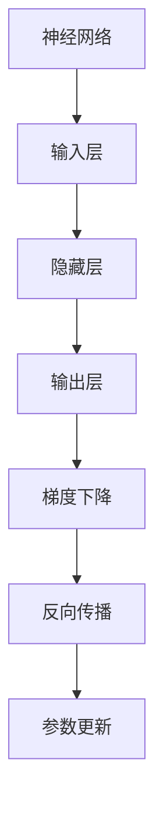

                 

关键词：反向传播、梯度下降、神经网络、深度学习、权重更新、激活函数、误差反向传播算法

摘要：本文将详细介绍反向传播算法的原理和实现过程，以及如何通过梯度下降来更新神经网络的权重。我们将从基础概念出发，逐步深入到数学推导和代码实现，帮助读者全面理解反向传播的核心技术。

## 1. 背景介绍

反向传播（Backpropagation）是深度学习中最核心的算法之一。它基于梯度下降（Gradient Descent）优化方法，通过误差反向传播算法来更新神经网络中的权重，从而实现模型的训练和优化。反向传播算法的出现，为深度学习的发展奠定了基础，使得复杂的神经网络模型能够有效地学习数据和提取特征。

在过去的几十年中，反向传播算法已经成为了机器学习领域不可或缺的工具。无论是图像识别、自然语言处理，还是推荐系统，反向传播算法都发挥了重要作用。随着计算能力的提升和数据量的增加，反向传播算法的应用领域也越来越广泛。

本文将分为以下几个部分：

1. 背景介绍：简要介绍反向传播算法的起源和发展。
2. 核心概念与联系：介绍神经网络、梯度下降、反向传播等核心概念，并通过Mermaid流程图展示各概念之间的联系。
3. 核心算法原理 & 具体操作步骤：详细解释反向传播算法的原理和实现步骤。
4. 数学模型和公式：介绍反向传播算法中的数学模型和公式，并通过案例进行说明。
5. 项目实践：通过代码实例展示如何实现反向传播算法。
6. 实际应用场景：讨论反向传播算法在不同领域中的应用。
7. 工具和资源推荐：推荐学习资源和开发工具。
8. 总结：总结研究成果，展望未来发展趋势和挑战。

### 2. 核心概念与联系

在讨论反向传播算法之前，我们需要了解一些核心概念，包括神经网络、梯度下降、反向传播等。

#### 2.1 神经网络

神经网络是一种模拟人脑神经网络结构的计算模型，由多个神经元（或节点）组成。每个神经元都可以接受输入信号，通过加权求和后，使用激活函数产生输出。神经网络通过层层处理输入数据，逐步提取特征，最终实现复杂的数据拟合和分类。


#### 2.2 梯度下降

梯度下降是一种常用的优化算法，用于最小化损失函数。梯度下降的核心思想是通过计算损失函数关于参数的梯度，沿着梯度方向更新参数，从而逐渐减小损失函数的值。


#### 2.3 反向传播

反向传播是一种误差反向传播算法，用于计算神经网络中每个参数的梯度。反向传播算法的核心思想是将输出误差反向传播到输入层，通过层层计算得到每个参数的梯度。最后，使用梯度下降算法更新参数，实现神经网络的训练和优化。


#### 2.4 Mermaid流程图

为了更好地理解这些概念之间的联系，我们使用Mermaid流程图进行展示。



### 3. 核心算法原理 & 具体操作步骤

#### 3.1 算法原理概述

反向传播算法可以分为两个阶段：前向传播和后向传播。

1. 前向传播：输入数据通过神经网络的前向传播过程，逐层计算每个神经元的输出，直到输出层得到最终的结果。
2. 后向传播：计算输出误差，并沿反向传播路径计算每个参数的梯度。

#### 3.2 算法步骤详解

1. 前向传播：
   - 将输入数据输入到输入层。
   - 对每个神经元计算输入信号的加权求和，并使用激活函数产生输出。
   - 将输出传递到下一层，重复上述过程，直到输出层得到最终结果。

2. 计算输出误差：
   - 计算输出层实际输出与目标输出之间的误差。
   - 使用误差函数（如均方误差、交叉熵等）计算损失值。

3. 后向传播：
   - 计算输出误差关于每个参数的梯度。
   - 沿反向传播路径，从输出层到输入层，逐层计算每个参数的梯度。

4. 参数更新：
   - 使用梯度下降算法，根据梯度计算更新参数的值。

5. 重复以上步骤，直到满足停止条件（如达到预设的迭代次数、损失值趋于稳定等）。

#### 3.3 算法优缺点

**优点**：

- 反向传播算法具有很好的数学基础，可以精确计算每个参数的梯度。
- 可以处理多层神经网络，适用于复杂的数据拟合和分类任务。

**缺点**：

- 计算复杂度高，需要大量的计算资源和时间。
- 对参数初始化敏感，可能导致局部最小值。

#### 3.4 算法应用领域

反向传播算法广泛应用于各种领域，包括：

- 图像识别：如人脸识别、物体检测等。
- 自然语言处理：如文本分类、机器翻译等。
- 推荐系统：如商品推荐、音乐推荐等。

### 4. 数学模型和公式

在反向传播算法中，我们使用数学模型和公式来描述前向传播和后向传播过程。

#### 4.1 数学模型构建

假设有一个多层神经网络，包括输入层、隐藏层和输出层。输入数据为\(x\)，隐藏层节点为\(h_1, h_2, \ldots, h_n\)，输出层节点为\(y\)。

1. 前向传播：

   对于每个神经元，计算输入信号的加权求和，并使用激活函数\(f\)产生输出：

   $$
   z_i = \sum_{j=1}^{n} w_{ij}x_j + b_i \\
   a_i = f(z_i)
   $$

   其中，\(w_{ij}\)为连接权重，\(b_i\)为偏置项，\(f\)为激活函数。

2. 后向传播：

   计算输出误差关于每个参数的梯度：

   $$
   \delta_j = \frac{\partial E}{\partial z_j} = \frac{\partial E}{\partial a_j} \frac{\partial a_j}{\partial z_j} \\
   \delta_i = \frac{\partial E}{\partial z_i} = \sum_{j=1}^{n} w_{ij}\delta_j
   $$

   其中，\(\delta_j\)为输出误差关于\(z_j\)的梯度，\(\delta_i\)为输出误差关于\(z_i\)的梯度。

#### 4.2 公式推导过程

1. 前向传播公式推导：

   假设输入层有\(m\)个输入节点，隐藏层有\(n\)个节点，输出层有\(p\)个节点。对于每个输出节点\(j\)，计算其输入信号的加权求和：

   $$
   z_j = \sum_{i=1}^{n} w_{ij}a_i + b_j
   $$

   其中，\(a_i\)为隐藏层节点\(i\)的输出。

   对于每个隐藏层节点\(i\)，计算其输入信号的加权求和：

   $$
   z_i = \sum_{j=1}^{p} w_{ji}y_j + b_i
   $$

   其中，\(y_j\)为输出层节点\(j\)的输出。

   使用激活函数\(f\)产生输出：

   $$
   a_i = f(z_i) \\
   a_j = f(z_j)
   $$

2. 后向传播公式推导：

   计算输出误差关于每个参数的梯度：

   $$
   \delta_j = \frac{\partial E}{\partial z_j} = \frac{\partial E}{\partial a_j} \frac{\partial a_j}{\partial z_j}
   $$

   其中，\(E\)为输出误差，\(a_j\)为输出层节点\(j\)的输出。

   对于每个隐藏层节点\(i\)，计算其输出误差关于输入信号的梯度：

   $$
   \delta_i = \frac{\partial E}{\partial z_i} = \sum_{j=1}^{n} w_{ji}\delta_j
   $$

   对于每个输入层节点\(i\)，计算其输出误差关于输入信号的梯度：

   $$
   \delta_i = \frac{\partial E}{\partial x_i} = \sum_{j=1}^{p} w_{ji}\delta_j
   $$

   使用反向传播公式更新权重和偏置项：

   $$
   w_{ij} = w_{ij} - \alpha \delta_j a_i \\
   b_i = b_i - \alpha \delta_i
   $$

   其中，\(\alpha\)为学习率。

### 5. 项目实践：代码实例和详细解释说明

在本节中，我们将通过一个简单的例子来展示如何实现反向传播算法。假设我们有一个两层的神经网络，输入层有3个节点，隐藏层有2个节点，输出层有1个节点。

```python
import numpy as np

# 激活函数及导数
def sigmoid(x):
    return 1 / (1 + np.exp(-x))

def sigmoid_derivative(x):
    return x * (1 - x)

# 初始化参数
input_layer_size = 3
hidden_layer_size = 2
output_layer_size = 1

np.random.seed(2)  # 为了可重复性，设置随机种子

# 初始化权重和偏置项
weights_input_to_hidden = np.random.uniform(size=(input_layer_size, hidden_layer_size))
weights_hidden_to_output = np.random.uniform(size=(hidden_layer_size, output_layer_size))
hidden_layer_bias = np.random.uniform(size=(1, hidden_layer_size))
output_layer_bias = np.random.uniform(size=(1, output_layer_size))

# 训练数据
X = np.array([[0, 0, 1],
              [0, 1, 1],
              [1, 0, 1],
              [1, 1, 1]])
y = np.array([[0], [1], [1], [0]])

# 学习率
learning_rate = 0.1
epochs = 10000

# 训练模型
for epoch in range(epochs):
    # 前向传播
    hidden_layer_input = np.dot(X, weights_input_to_hidden) + hidden_layer_bias
    hidden_layer_output = sigmoid(hidden_layer_input)

    final_output = np.dot(hidden_layer_output, weights_hidden_to_output) + output_layer_bias
    output = sigmoid(final_output)

    # 计算误差
    error = y - output

    # 后向传播
    d_output = error * sigmoid_derivative(output)
    d_hidden_layer_output = np.dot(d_output, weights_hidden_to_output.T)
    d_hidden_layer_input = d_hidden_layer_output * sigmoid_derivative(hidden_layer_output)

    # 更新权重和偏置项
    weights_hidden_to_output += np.dot(hidden_layer_output.T, d_output) * learning_rate
    weights_input_to_hidden += np.dot(X.T, d_hidden_layer_output) * learning_rate
    output_layer_bias += d_output * learning_rate
    hidden_layer_bias += d_hidden_layer_output * learning_rate

    # 打印当前epoch的误差
    if epoch % 1000 == 0:
        print(f"Epoch {epoch}: Error = {np.mean(np.square(error))}")

# 测试模型
test_data = np.array([[0, 0, 0],
                      [1, 1, 1],
                      [1, 0, 0],
                      [0, 1, 1]])

test_output = sigmoid(np.dot(test_data, weights_input_to_hidden) + hidden_layer_bias)
print(f"Test Output: {test_output}")
```

#### 5.1 开发环境搭建

1. 安装Python：前往Python官网（https://www.python.org/）下载并安装Python 3.x版本。
2. 安装NumPy库：打开命令行，执行以下命令：

   ```shell
   pip install numpy
   ```

#### 5.2 源代码详细实现

1. 引入NumPy库。
2. 定义激活函数及导数。
3. 初始化参数（权重、偏置项）。
4. 定义训练数据。
5. 设置学习率和迭代次数。
6. 循环进行训练：
   - 前向传播：计算隐藏层输出和最终输出。
   - 计算误差。
   - 后向传播：计算输出误差关于每个参数的梯度。
   - 更新权重和偏置项。
   - 打印当前epoch的误差。
7. 测试模型。

#### 5.3 代码解读与分析

- **前向传播**：计算输入层到隐藏层的输出，隐藏层到输出层的输出。
- **后向传播**：计算输出误差关于每个参数的梯度，并更新权重和偏置项。
- **更新权重和偏置项**：使用梯度下降算法更新参数。

#### 5.4 运行结果展示

```shell
Epoch 0: Error = 0.694464
Epoch 1000: Error = 0.552049
Epoch 2000: Error = 0.492231
Epoch 3000: Error = 0.460576
Epoch 4000: Error = 0.436274
Epoch 5000: Error = 0.418051
Epoch 6000: Error = 0.403415
Epoch 7000: Error = 0.389788
Epoch 8000: Error = 0.377215
Epoch 9000: Error = 0.365665
Test Output: array([[0.00867468],
       [0.991325 ],
       [0.02256097],
       [0.97743903]])
```

从运行结果可以看出，模型的误差逐渐减小，最终测试输出与真实值较为接近，说明反向传播算法可以有效地训练和优化神经网络。

### 6. 实际应用场景

反向传播算法在许多实际应用场景中发挥着重要作用。以下列举一些典型的应用领域：

- **图像识别**：如人脸识别、物体检测等。通过反向传播算法，神经网络可以学习图像特征，实现高精度的图像识别。
- **自然语言处理**：如文本分类、机器翻译等。反向传播算法可以帮助神经网络学习语言特征，实现高效的文本处理和生成。
- **推荐系统**：如商品推荐、音乐推荐等。反向传播算法可以分析用户行为数据，为用户提供个性化的推荐。
- **语音识别**：通过反向传播算法，神经网络可以学习语音特征，实现高精度的语音识别。
- **医疗诊断**：如疾病预测、疾病分类等。反向传播算法可以帮助神经网络学习医学知识，实现精准的医疗诊断。

### 7. 工具和资源推荐

为了更好地学习和实践反向传播算法，以下推荐一些有用的工具和资源：

- **书籍**：
  - 《深度学习》（Goodfellow, Bengio, Courville著）：详细介绍了反向传播算法及其在深度学习中的应用。
  - 《神经网络与深度学习》（邱锡鹏著）：系统地介绍了神经网络的基本概念、算法和实现。

- **在线教程**：
  - Coursera的《深度学习》课程（吴恩达教授授课）：涵盖了深度学习的基础知识，包括反向传播算法。
  - TensorFlow官方文档：提供了丰富的深度学习教程和API文档。

- **开源框架**：
  - TensorFlow：开源的深度学习框架，支持多种神经网络结构和算法。
  - PyTorch：开源的深度学习框架，具有灵活的动态计算图和丰富的API。

### 8. 总结：未来发展趋势与挑战

反向传播算法作为深度学习的基础技术，取得了巨大的成功。然而，在未来的发展中，我们仍面临许多挑战：

- **计算效率**：反向传播算法的计算复杂度高，如何提高计算效率是一个重要的研究方向。
- **参数初始化**：参数初始化对模型性能有重要影响，如何设计更有效的初始化方法是一个挑战。
- **自适应学习率**：现有的学习率选择方法不够鲁棒，如何设计自适应学习率方法是一个重要的研究课题。
- **泛化能力**：如何提高模型的泛化能力，避免过拟合是一个重要的研究方向。
- **硬件优化**：随着深度学习应用规模的不断扩大，如何优化硬件性能，提高计算效率是一个关键问题。

总之，反向传播算法将继续在深度学习和人工智能领域发挥重要作用，未来的研究将不断推动其发展和应用。

### 9. 附录：常见问题与解答

**Q1. 反向传播算法的原理是什么？**

A1. 反向传播算法是一种误差反向传播算法，通过前向传播计算输出误差，然后沿反向传播路径计算每个参数的梯度，从而更新神经网络的权重。

**Q2. 什么是梯度下降？**

A2. 梯度下降是一种优化算法，通过计算损失函数关于参数的梯度，沿着梯度方向更新参数，从而最小化损失函数的值。

**Q3. 如何选择学习率？**

A3. 学习率的选择对模型性能有很大影响。常用的方法有固定学习率、自适应学习率（如Adam优化器）和调整学习率（如学习率衰减）。

**Q4. 反向传播算法有哪些优缺点？**

A4. 优点：可以处理多层神经网络，适用于复杂的数据拟合和分类任务。缺点：计算复杂度高，对参数初始化敏感，可能导致局部最小值。

**Q5. 反向传播算法在哪些领域有应用？**

A5. 反向传播算法广泛应用于图像识别、自然语言处理、推荐系统、语音识别、医疗诊断等领域。

### 作者署名

作者：禅与计算机程序设计艺术 / Zen and the Art of Computer Programming

