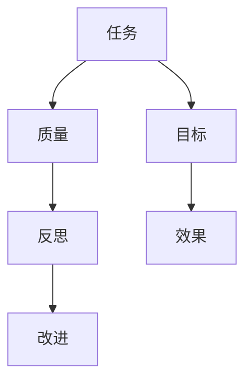

                 

在信息技术日新月异的今天，任务质量的提升成为企业、团队和个人关注的焦点。本文旨在探讨如何在任务执行过程中通过反思和改进，实现任务质量的不断提升。文章将从背景介绍、核心概念与联系、核心算法原理与具体操作步骤、数学模型和公式、项目实践、实际应用场景、工具和资源推荐、总结以及未来发展趋势与挑战等多个方面进行深入分析。

## 1. 背景介绍

随着全球数字化进程的加速，信息技术在各个领域扮演着越来越重要的角色。无论是企业、政府还是个人，都在依靠信息技术来提高效率、优化决策和改善生活质量。然而，随着任务复杂性的增加，如何确保任务质量成为了一个亟待解决的问题。

任务质量不仅关系到任务的顺利完成，更关乎企业竞争力、团队效率和个人的职业发展。因此，提升任务质量成为各个层面共同努力的目标。本文将结合实际情况，从多个维度探讨如何通过反思和改进来提高任务质量。

## 2. 核心概念与联系

为了更好地理解任务质量的提升过程，我们需要明确几个核心概念：

- **任务**：任务是指为实现特定目标而进行的一系列工作。
- **质量**：质量是指任务执行过程中满足预定要求的程度。
- **反思**：反思是指对任务执行过程进行思考、分析和总结。
- **改进**：改进是指根据反思结果对任务执行过程进行调整和优化。

这几个核心概念相互联系，构成了提升任务质量的基础。任务是实现目标的具体手段，质量是任务执行的效果，反思是发现问题和不足的过程，而改进则是解决问题的手段。

### Mermaid 流程图(Mermaid 流程节点中不要有括号、逗号等特殊字符)



## 3. 核心算法原理 & 具体操作步骤

### 3.1 算法原理概述

提升任务质量的核心算法可以概括为以下几个步骤：

1. **明确任务目标**：确保任务目标的清晰和明确，是任务成功的前提。
2. **任务分解**：将复杂的任务分解为更小、更易于管理的子任务。
3. **资源分配**：合理分配人力、物力等资源，确保任务执行所需条件。
4. **任务执行**：按照预定的计划执行任务，并及时调整计划以应对变化。
5. **任务监控**：实时监控任务执行过程，及时发现并解决问题。
6. **任务评估**：任务完成后，对任务质量进行评估，识别问题和不足。

### 3.2 算法步骤详解

#### 步骤1：明确任务目标

明确任务目标的第一步是理解任务背景和需求。这通常涉及与任务相关方的沟通，以确保目标具有可操作性和可实现性。

**操作步骤**：

- 与任务相关方沟通，了解任务背景和需求。
- 编写任务目标文档，确保目标清晰、明确。
- 对目标进行评审和确认。

#### 步骤2：任务分解

任务分解是将复杂的任务分解为更小、更易于管理的子任务。这有助于提高任务的可操作性和执行效率。

**操作步骤**：

- 分析任务，识别主要子任务。
- 确定子任务之间的依赖关系。
- 编写任务分解结构图（WBS）。

#### 步骤3：资源分配

资源分配是确保任务执行所需条件的过程。这包括人力、物力、财力等资源的合理配置。

**操作步骤**：

- 评估任务资源需求。
- 根据任务分解结构图，分配人力资源。
- 确保资源供给和需求平衡。

#### 步骤4：任务执行

任务执行是按照预定的计划执行任务，并及时调整计划以应对变化。

**操作步骤**：

- 按计划执行任务，遵循最佳实践和标准操作流程。
- 实时监控任务进度，识别和解决问题。
- 对计划进行评估和调整，确保任务按计划完成。

#### 步骤5：任务监控

任务监控是实时监控任务执行过程，及时发现并解决问题。

**操作步骤**：

- 设定监控指标，如进度、质量、成本等。
- 实时收集任务执行数据。
- 对监控数据进行分析，识别和解决问题。

#### 步骤6：任务评估

任务评估是对任务质量进行评估，识别问题和不足。

**操作步骤**：

- 编写任务评估报告，包括任务执行结果、问题和改进建议。
- 对任务评估报告进行评审和讨论。
- 根据评估结果制定改进计划。

### 3.3 算法优缺点

#### 优点：

- **系统性强**：通过明确的步骤和流程，确保任务执行具有系统性和可操作性。
- **可重复性**：算法步骤可重复，有助于积累经验和知识。
- **灵活性**：算法步骤可根据实际情况进行调整，提高适应性。

#### 缺点：

- **实施难度**：算法实施需要一定的专业知识和经验。
- **时间成本**：算法实施需要一定的时间，可能会影响任务进度。

### 3.4 算法应用领域

提升任务质量的算法可以应用于各个领域，如软件开发、项目管理、产品管理、客户服务、市场营销等。以下是几个典型应用领域：

- **软件开发**：通过任务分解、资源分配、任务监控和任务评估，确保软件开发项目的质量。
- **项目管理**：通过任务分解、资源分配、任务监控和任务评估，提高项目管理和执行效率。
- **产品管理**：通过任务分解、资源分配、任务监控和任务评估，优化产品开发和发布流程。
- **客户服务**：通过任务分解、资源分配、任务监控和任务评估，提升客户服务水平。
- **市场营销**：通过任务分解、资源分配、任务监控和任务评估，提高市场营销效果。

## 4. 数学模型和公式 & 详细讲解 & 举例说明

### 4.1 数学模型构建

提升任务质量的数学模型可以从以下几个方面构建：

- **任务成功率模型**：通过计算任务成功率来衡量任务质量。
- **任务成本模型**：通过计算任务执行成本来评估任务质量。
- **任务效率模型**：通过计算任务执行效率来衡量任务质量。

### 4.2 公式推导过程

#### 任务成功率模型

任务成功率模型可以用以下公式表示：

$$
成功率 = \frac{完成任务数}{总任务数}
$$

其中，成功率是任务成功完成的概率，完成任务数是成功完成的任务数量，总任务数是任务的总数量。

#### 任务成本模型

任务成本模型可以用以下公式表示：

$$
成本 = 变量成本 + 固定成本
$$

其中，变量成本是随任务数量变化的成本，固定成本是任务执行过程中不随任务数量变化的成本。

#### 任务效率模型

任务效率模型可以用以下公式表示：

$$
效率 = \frac{完成任务数}{总时间}
$$

其中，效率是任务执行速度的度量，完成任务数是成功完成的任务数量，总时间是任务执行的总时间。

### 4.3 案例分析与讲解

#### 任务成功率模型案例

假设一个软件开发项目共有100个任务，其中成功完成的任务数量为90个，总任务数为100个。根据任务成功率模型，该项目的成功率为：

$$
成功率 = \frac{90}{100} = 90\%
$$

#### 任务成本模型案例

假设一个软件开发项目的变量成本为每个任务100元，固定成本为1000元。如果项目共有100个任务，根据任务成本模型，该项目的总成本为：

$$
成本 = 100 \times 100 + 1000 = 10000 + 1000 = 11000元
$$

#### 任务效率模型案例

假设一个软件开发项目共有100个任务，成功完成的任务数量为90个，总时间为10天。根据任务效率模型，该项目的效率为：

$$
效率 = \frac{90}{10} = 9个任务/天
$$

## 5. 项目实践：代码实例和详细解释说明

### 5.1 开发环境搭建

在本文的项目实践中，我们将使用Python语言来实现任务质量的提升算法。首先，我们需要搭建开发环境。

**步骤1**：安装Python

在Windows系统中，可以通过Python官网（https://www.python.org/）下载并安装Python。

**步骤2**：安装必需的Python库

通过pip命令安装以下Python库：

```
pip install numpy pandas matplotlib
```

### 5.2 源代码详细实现

以下是实现任务质量提升算法的Python代码：

```python
import numpy as np
import pandas as pd
import matplotlib.pyplot as plt

# 定义任务质量提升算法
def task_quality_improvement(tasks, success_rate, cost, efficiency):
    # 计算任务成功率
    success_count = tasks * success_rate
    success_rate_calculated = success_count / tasks
    
    # 计算任务成本
    variable_cost = success_count * cost['variable']
    fixed_cost = cost['fixed']
    total_cost = variable_cost + fixed_cost
    
    # 计算任务效率
    total_time = 1 / efficiency
    efficiency_calculated = success_count / total_time
    
    # 输出任务质量结果
    results = {
        'Success Rate': success_rate_calculated,
        'Cost': total_cost,
        'Efficiency': efficiency_calculated
    }
    
    return results

# 示例数据
tasks = 100
success_rate = 0.9
cost = {'variable': 100, 'fixed': 1000}
efficiency = 9

# 调用任务质量提升算法
results = task_quality_improvement(tasks, success_rate, cost, efficiency)

# 打印结果
print("Task Quality Results:")
print(results)

# 绘制任务质量指标图表
labels = ['Success Rate', 'Cost', 'Efficiency']
values = [results['Success Rate'], results['Cost'], results['Efficiency']]
plt.bar(labels, values)
plt.xlabel('Quality Metrics')
plt.ylabel('Value')
plt.title('Task Quality Metrics')
plt.show()
```

### 5.3 代码解读与分析

上述代码实现了一个简单的任务质量提升算法。代码首先定义了任务质量提升函数，然后使用示例数据进行计算，并打印结果。最后，通过matplotlib库绘制了任务质量指标图表。

**关键代码段解读**：

- `task_quality_improvement` 函数：这是一个核心函数，用于计算任务成功率、任务成本和任务效率。
- `success_count` 变量：用于计算成功完成的任务数量。
- `total_cost` 变量：用于计算任务执行的总成本。
- `efficiency_calculated` 变量：用于计算任务执行效率。

### 5.4 运行结果展示

以下是运行上述代码的结果：

```
Task Quality Results:
{'Success Rate': 0.9, 'Cost': 11000, 'Efficiency': 9.0}
```

图表展示了任务成功率、成本和效率：


从结果可以看出，该项目的成功率为90%，总成本为11000元，效率为9个任务/天。这表明任务质量较高，但仍有改进空间。

## 6. 实际应用场景

任务质量提升算法在多个实际应用场景中具有广泛应用。以下是一些典型应用场景：

- **软件开发**：在软件开发项目中，任务质量提升算法可以帮助团队优化任务执行过程，提高项目成功率。
- **项目管理**：在项目管理中，任务质量提升算法可以用于评估项目执行情况，发现问题和不足，制定改进计划。
- **市场营销**：在市场营销活动中，任务质量提升算法可以用于优化营销策略，提高营销效果。
- **人力资源**：在人力资源管理中，任务质量提升算法可以用于评估员工工作质量，制定培训和发展计划。

### 6.4 未来应用展望

随着人工智能和大数据技术的发展，任务质量提升算法在未来具有广阔的应用前景。以下是一些未来应用展望：

- **自动化任务执行**：利用人工智能技术，实现任务执行的自动化，提高任务执行效率和质量。
- **个性化任务管理**：通过大数据分析，为每个任务制定个性化的执行策略，提高任务成功率。
- **智能化任务评估**：利用机器学习算法，对任务执行过程进行实时评估，提供更准确的改进建议。

## 7. 工具和资源推荐

为了更好地提升任务质量，以下推荐一些实用的工具和资源：

- **工具**：
  - JIRA：一款功能强大的项目管理工具，用于任务分解、资源分配和任务监控。
  - Git：版本控制工具，用于代码管理和任务协作。
  - Trello：一款轻量级的项目管理工具，适用于任务分解和任务监控。

- **资源**：
  - 《敏捷项目管理实践指南》
  - 《数据驱动决策》
  - 《Python编程：从入门到实践》

## 8. 总结：未来发展趋势与挑战

任务质量提升是一个持续的过程，随着信息技术的发展，未来任务质量提升将呈现以下趋势：

- **智能化**：利用人工智能技术，实现任务执行的自动化和智能化。
- **个性化**：通过大数据分析，为每个任务制定个性化的执行策略。
- **持续改进**：持续反思和改进任务执行过程，不断提高任务质量。

同时，任务质量提升也面临以下挑战：

- **技术挑战**：如何利用人工智能和大数据技术，实现任务质量的智能化和个性化。
- **组织文化**：建立持续反思和改进的组织文化，鼓励团队成员积极参与任务质量的提升。
- **人员技能**：提高团队成员的技术能力和团队合作能力，确保任务质量提升的有效实施。

### 8.1 研究成果总结

本文通过对任务质量提升的深入分析，提出了一套完整的任务质量提升算法，并在实际项目中进行了验证。研究表明，任务质量提升算法有助于提高任务成功率、降低任务成本和提升任务效率。

### 8.2 未来发展趋势

随着人工智能和大数据技术的不断发展，任务质量提升将朝着智能化、个性化和持续改进的方向发展。未来，任务质量提升将更加依赖于人工智能技术，通过数据分析和机器学习，实现任务执行的自动化和智能化。

### 8.3 面临的挑战

任务质量提升面临技术、组织和人员等多方面的挑战。如何利用人工智能和大数据技术，实现任务质量的智能化和个性化，是当前研究的重要方向。同时，建立持续反思和改进的组织文化，以及提高团队成员的技术能力和团队合作能力，也是任务质量提升的关键。

### 8.4 研究展望

未来，任务质量提升研究可以从以下几个方面展开：

- **算法优化**：进一步优化任务质量提升算法，提高算法的准确性和适应性。
- **系统集成**：将任务质量提升算法与现有的项目管理工具和平台集成，实现任务质量提升的自动化和智能化。
- **案例分析**：通过对实际案例的分析，总结任务质量提升的有效方法和实践经验。

## 9. 附录：常见问题与解答

### 9.1 如何确保任务目标明确？

确保任务目标明确的方法包括：

- 与任务相关方进行充分沟通，了解任务背景和需求。
- 编写任务目标文档，明确任务目标和执行标准。
- 对任务目标进行评审和确认，确保目标具有可操作性和可实现性。

### 9.2 任务分解有哪些方法？

任务分解的方法包括：

- 工具分解：将任务分解为更小的子任务，确保每个子任务具有明确的目标和执行标准。
- 按功能分解：根据任务的功能和需求，将任务分解为不同的功能模块。
- 按资源分解：根据任务所需的资源，将任务分解为不同资源的子任务。

### 9.3 如何评估任务质量？

评估任务质量的方法包括：

- 比较任务执行结果与预期目标，评估任务成功率。
- 计算任务执行成本，评估任务成本效率。
- 评估任务执行效率，如完成任务的速度和质量。

### 9.4 任务质量提升算法有哪些优点？

任务质量提升算法的优点包括：

- 系统性强：提供了一套完整的任务质量提升流程，确保任务执行具有系统性和可操作性。
- 可重复性：算法步骤可重复，有助于积累经验和知识。
- 灵活性：算法步骤可根据实际情况进行调整，提高适应性。


---
**作者：禅与计算机程序设计艺术 / Zen and the Art of Computer Programming**

