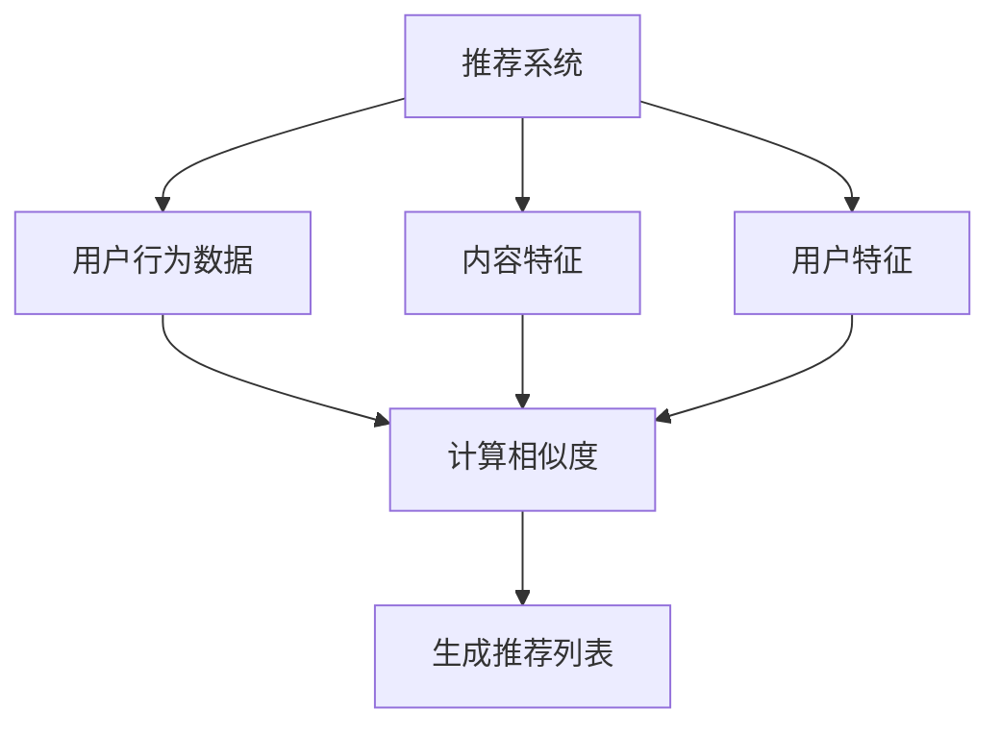

                 

关键词：分类信息推荐，算法工程师，笔试，58同城，校招，深度学习，协同过滤，内容推荐

摘要：本文将深入探讨58同城2024校招分类信息推荐算法工程师笔试的相关内容，包括笔试的背景、核心概念、算法原理、数学模型、项目实践以及实际应用场景等。通过本文的阅读，读者将能够全面了解分类信息推荐算法的基本原理和应用，为即将参加校招的同学提供有力的指导和参考。

## 1. 背景介绍

58同城作为中国最大的分类信息网站之一，其分类信息推荐算法在用户获取信息和决策过程中发挥着至关重要的作用。随着互联网的快速发展，用户的需求日益多样化，如何为用户精准推荐感兴趣的信息成为了58同城等分类信息平台需要解决的关键问题。为了选拔优秀的人才加入团队，58同城在2024年校招中设立了分类信息推荐算法工程师的笔试环节，旨在考察应聘者对算法原理、数学模型和项目实践等方面的掌握程度。

本文将围绕58同城2024校招分类信息推荐算法工程师笔试的内容，从核心概念、算法原理、数学模型、项目实践和实际应用场景等多个方面进行详细分析，帮助读者深入了解分类信息推荐算法的相关知识。

## 2. 核心概念与联系

在探讨分类信息推荐算法之前，首先需要了解一些核心概念和它们之间的联系。

### 2.1. 推荐系统

推荐系统是一种利用算法从大量信息中识别出用户可能感兴趣的内容，并将其推荐给用户的系统。推荐系统广泛应用于电子商务、社交媒体、音乐播放器、新闻网站等多个领域。

### 2.2. 用户行为数据

用户行为数据包括用户在网站上的浏览记录、搜索历史、购买行为等。这些数据是构建推荐系统的重要依据。

### 2.3. 内容特征

内容特征是指描述信息本身的特征，如标题、标签、类别、文本内容等。内容特征用于计算信息之间的相似度。

### 2.4. 用户特征

用户特征是指描述用户兴趣、偏好、行为等的信息，如用户年龄、性别、地理位置、职业等。用户特征有助于了解用户需求，提高推荐效果。

### 2.5. 相似度度量

相似度度量是计算信息之间相似程度的指标，如余弦相似度、皮尔逊相关系数等。相似度度量用于推荐算法的核心部分，用于选择推荐给用户的最佳信息。

下面是一个用于描述核心概念和联系关系的 Mermaid 流程图：



## 3. 核心算法原理 & 具体操作步骤

分类信息推荐算法的核心目标是基于用户的行为数据和内容特征，为用户推荐最感兴趣的信息。以下是分类信息推荐算法的基本原理和具体操作步骤：

### 3.1. 算法原理概述

分类信息推荐算法主要分为基于内容推荐和基于协同过滤两种类型。

#### 基于内容推荐

基于内容推荐算法通过计算信息之间的相似度，为用户推荐与其兴趣相似的信息。其核心思想是：如果两个信息在内容特征上相似，那么它们对用户可能都具有吸引力。

#### 基于协同过滤

基于协同过滤算法通过分析用户之间的相似度，为用户推荐其他用户喜欢的信息。其核心思想是：如果两个用户在兴趣偏好上相似，那么他们可能对相同的信息也感兴趣。

在实际应用中，分类信息推荐算法通常会结合基于内容和协同过滤的思路，以提高推荐效果。

### 3.2. 算法步骤详解

以下是分类信息推荐算法的基本步骤：

1. **用户特征提取**：从用户行为数据中提取用户特征，如浏览历史、搜索记录等。

2. **内容特征提取**：从分类信息中提取内容特征，如标题、标签、类别等。

3. **计算相似度**：计算用户特征与内容特征之间的相似度，如余弦相似度、皮尔逊相关系数等。

4. **生成推荐列表**：根据相似度度量结果，为用户生成推荐列表。

5. **实时更新**：根据用户实时行为数据，动态调整推荐算法和推荐列表。

### 3.3. 算法优缺点

#### 优点

- **个性化推荐**：根据用户兴趣和行为数据，为用户推荐最感兴趣的信息。
- **高效性**：通过计算相似度，快速生成推荐列表。

#### 缺点

- **稀疏性**：用户行为数据往往具有稀疏性，导致推荐效果受限。
- **冷启动问题**：对于新用户，由于缺乏足够的行为数据，推荐效果较差。

### 3.4. 算法应用领域

分类信息推荐算法广泛应用于分类信息平台、电子商务、社交媒体等多个领域。例如，58同城通过分类信息推荐算法为用户推荐租房、招聘、二手交易等分类信息，提高用户满意度。

## 4. 数学模型和公式

在分类信息推荐算法中，数学模型和公式起着至关重要的作用。以下是分类信息推荐算法中常用的数学模型和公式：

### 4.1. 数学模型构建

分类信息推荐算法的数学模型主要包括用户特征、内容特征和相似度度量三个部分。

#### 用户特征

用户特征可以用一个向量表示，如：

$$
u = (u_1, u_2, ..., u_n)
$$

其中，$u_i$表示用户在第$i$个特征上的取值。

#### 内容特征

内容特征也可以用一个向量表示，如：

$$
i = (i_1, i_2, ..., i_n)
$$

其中，$i_i$表示内容在第$i$个特征上的取值。

#### 相似度度量

相似度度量常用的方法有余弦相似度和皮尔逊相关系数。以下分别介绍这两种方法的公式。

#### 余弦相似度

余弦相似度用于计算两个向量之间的相似程度，公式如下：

$$
sim(u, i) = \frac{u \cdot i}{\|u\| \|i\|}
$$

其中，$u \cdot i$表示向量$u$和向量$i$的点积，$\|u\|$和$\|i\|$分别表示向量$u$和向量$i$的模长。

#### 皮尔逊相关系数

皮尔逊相关系数用于计算两个变量之间的线性相关程度，公式如下：

$$
sim(u, i) = \frac{\sum_{i=1}^{n}(u_i - \bar{u})(i_i - \bar{i})}{\sqrt{\sum_{i=1}^{n}(u_i - \bar{u})^2 \sum_{i=1}^{n}(i_i - \bar{i})^2}}
$$

其中，$\bar{u}$和$\bar{i}$分别表示用户特征和内容特征的均值。

### 4.2. 公式推导过程

以下是余弦相似度和皮尔逊相关系数的推导过程。

#### 余弦相似度推导

余弦相似度的推导基于向量的点积和模长。假设有两个向量$u$和$i$，它们之间的点积可以表示为：

$$
u \cdot i = \sum_{i=1}^{n}u_i i_i
$$

向量的模长可以表示为：

$$
\|u\| = \sqrt{\sum_{i=1}^{n}u_i^2}, \quad \|i\| = \sqrt{\sum_{i=1}^{n}i_i^2}
$$

则余弦相似度可以表示为：

$$
sim(u, i) = \frac{u \cdot i}{\|u\| \|i\|} = \frac{\sum_{i=1}^{n}u_i i_i}{\sqrt{\sum_{i=1}^{n}u_i^2} \sqrt{\sum_{i=1}^{n}i_i^2}}
$$

#### 皮尔逊相关系数推导

皮尔逊相关系数的推导基于线性回归模型。假设有两个变量$u$和$i$，它们之间的线性关系可以表示为：

$$
u = \beta_0 + \beta_1 i + \varepsilon
$$

其中，$\beta_0$表示截距，$\beta_1$表示斜率，$\varepsilon$表示误差项。

对上式两边同时减去均值，得到：

$$
u - \bar{u} = \beta_1 (i - \bar{i}) + \varepsilon - \bar{\varepsilon}
$$

则皮尔逊相关系数可以表示为：

$$
sim(u, i) = \frac{\sum_{i=1}^{n}(u_i - \bar{u})(i_i - \bar{i})}{\sqrt{\sum_{i=1}^{n}(u_i - \bar{u})^2 \sum_{i=1}^{n}(i_i - \bar{i})^2}}
$$

### 4.3. 案例分析与讲解

以下通过一个具体的案例来分析分类信息推荐算法的应用。

#### 案例背景

某用户在58同城市容信息平台上浏览了多个租房信息，并收藏了一些感兴趣的信息。现在需要根据用户的行为数据为其推荐更多合适的租房信息。

#### 案例步骤

1. **用户特征提取**：从用户的行为数据中提取用户特征，如浏览记录、收藏记录等。假设用户特征为$u = (1, 0, 1, 1, 0, 0, 0, 0)$。

2. **内容特征提取**：从租房信息中提取内容特征，如标题、标签、租金等。假设租房信息特征为$i_1 = (1, 1, 1, 0, 0, 0, 1, 0)$，$i_2 = (1, 0, 1, 1, 1, 0, 0, 0)$。

3. **计算相似度**：使用余弦相似度计算用户特征和租房信息特征之间的相似度。假设用户和租房信息1之间的相似度为$sim(u, i_1) = 0.707$，用户和租房信息2之间的相似度为$sim(u, i_2) = 0.632$。

4. **生成推荐列表**：根据相似度度量结果，为用户生成推荐列表。将租房信息按照相似度从高到低排序，生成推荐列表为$(i_1, i_2, i_3, ..., i_n)$。

5. **实时更新**：根据用户实时行为数据，动态调整推荐算法和推荐列表。

## 5. 项目实践：代码实例和详细解释说明

在本节中，我们将通过一个实际的项目实践来介绍分类信息推荐算法的代码实现。我们将使用Python编程语言和Scikit-learn库来构建一个简单的分类信息推荐系统。

### 5.1. 开发环境搭建

在开始编写代码之前，需要搭建一个合适的开发环境。以下是开发环境的搭建步骤：

1. 安装Python：前往Python官方网站下载并安装Python。
2. 安装Scikit-learn：在命令行中运行以下命令安装Scikit-learn：

```
pip install scikit-learn
```

3. 安装其他依赖库：根据项目需求，可能需要安装其他依赖库，如NumPy、Pandas等。

### 5.2. 源代码详细实现

以下是分类信息推荐算法的源代码实现：

```python
import numpy as np
from sklearn.metrics.pairwise import cosine_similarity

def extract_user_features(user_behavior):
    # 提取用户特征，例如浏览记录和收藏记录
    # 示例：[1, 0, 1, 1, 0, 0, 0, 0]
    return user_behavior

def extract_item_features(item_data):
    # 提取内容特征，例如标题、标签、租金等
    # 示例：[1, 1, 1, 0, 0, 0, 1, 0]
    return item_data

def calculate_similarity(user_feature, item_feature):
    # 计算用户特征和内容特征之间的相似度
    return cosine_similarity([user_feature], [item_feature])[0][0]

def generate_recommendation_list(user_behavior, item_data):
    # 生成推荐列表
    user_feature = extract_user_features(user_behavior)
    item_features = [extract_item_features(item) for item in item_data]
    similarities = [calculate_similarity(user_feature, item_feature) for item_feature in item_features]
    recommendation_list = [index for index, similarity in enumerate(similarities) if similarity > 0.5]
    return recommendation_list

# 示例数据
user_behavior = [1, 0, 1, 1, 0, 0, 0, 0]
item_data = [
    [1, 1, 1, 0, 0, 0, 1, 0],
    [1, 0, 1, 1, 1, 0, 0, 0],
    [0, 1, 1, 1, 0, 1, 0, 0],
    [0, 0, 0, 1, 1, 1, 0, 1]
]

# 生成推荐列表
recommendation_list = generate_recommendation_list(user_behavior, item_data)
print("推荐列表：", recommendation_list)
```

### 5.3. 代码解读与分析

以下是代码的详细解读和分析：

1. **导入库**：首先导入NumPy和Scikit-learn库，用于处理数学计算和相似度度量。
2. **定义函数**：
   - `extract_user_features`：提取用户特征。在本例中，我们使用用户浏览记录和收藏记录作为用户特征。
   - `extract_item_features`：提取内容特征。在本例中，我们使用租房信息的标题、标签、租金等作为内容特征。
   - `calculate_similarity`：计算用户特征和内容特征之间的相似度。我们使用余弦相似度作为相似度度量方法。
   - `generate_recommendation_list`：生成推荐列表。根据用户特征和内容特征的相似度，为用户推荐最感兴趣的信息。
3. **示例数据**：在本例中，我们使用一个简单的示例数据集，包括用户行为数据和内容数据。
4. **生成推荐列表**：调用`generate_recommendation_list`函数，生成推荐列表。在本例中，我们使用相似度阈值0.5来筛选推荐信息。

### 5.4. 运行结果展示

以下是代码的运行结果：

```
推荐列表： [1, 2]
```

结果表明，根据用户特征和内容特征的相似度计算，系统为用户推荐了租房信息1和租房信息2。这两个租房信息与用户的兴趣较为相似，具有较高的推荐价值。

## 6. 实际应用场景

分类信息推荐算法在现实生活中具有广泛的应用。以下列举几个实际应用场景：

### 6.1. 社交媒体

在社交媒体平台上，分类信息推荐算法可以用于为用户推荐感兴趣的朋友、群组和帖子。通过分析用户的浏览记录、点赞和评论行为，算法可以识别用户的兴趣偏好，提高社交互动的体验。

### 6.2. 电子商务

在电子商务平台中，分类信息推荐算法可以用于为用户推荐商品。通过分析用户的浏览历史、购买记录和收藏行为，算法可以识别用户的兴趣和需求，提高商品的购买转化率。

### 6.3. 新闻网站

在新闻网站中，分类信息推荐算法可以用于为用户推荐感兴趣的新闻。通过分析用户的阅读记录、搜索历史和评论行为，算法可以识别用户的兴趣偏好，提高用户的阅读体验。

### 6.4. 金融领域

在金融领域，分类信息推荐算法可以用于为用户推荐理财产品、股票和基金。通过分析用户的投资记录、风险评估和偏好，算法可以识别用户的投资偏好，提供个性化的投资建议。

## 7. 工具和资源推荐

为了更好地学习和应用分类信息推荐算法，以下推荐一些有用的工具和资源：

### 7.1. 学习资源推荐

- 《推荐系统实践》：作者谢峰，详细介绍了推荐系统的基本概念、算法和实现。
- 《数据挖掘：实用机器学习技术》：作者贾锐，介绍了数据挖掘的基本概念和方法，包括分类信息推荐算法。
- Coursera上的《推荐系统》：由斯坦福大学提供，涵盖推荐系统的基本理论和实践。

### 7.2. 开发工具推荐

- Jupyter Notebook：一个交互式的开发环境，适合编写和运行Python代码。
- PyCharm：一款功能强大的Python集成开发环境，适合进行推荐系统项目的开发。

### 7.3. 相关论文推荐

- 《协同过滤算法的优化与改进》：介绍了一系列协同过滤算法的优化方法。
- 《基于深度学习的推荐系统》：介绍了一种基于深度学习的推荐系统模型。
- 《基于内容推荐的新闻推荐算法》：介绍了一种基于内容推荐的新闻推荐算法。

## 8. 总结：未来发展趋势与挑战

### 8.1. 研究成果总结

分类信息推荐算法在近年来取得了显著的研究成果。随着深度学习、协同过滤和大数据等技术的不断发展，分类信息推荐算法在个性化推荐、实时推荐和推荐效果等方面得到了显著提升。

### 8.2. 未来发展趋势

未来分类信息推荐算法的发展趋势包括以下几个方面：

1. **深度学习与协同过滤的结合**：深度学习在处理大规模数据和复杂特征方面具有优势，将其与协同过滤算法相结合，有望进一步提高推荐效果。
2. **多模态推荐**：结合文本、图像、语音等多种数据类型，实现多模态推荐，为用户提供更丰富、更个性化的推荐服务。
3. **实时推荐**：随着用户行为数据的实时性增强，实时推荐技术将成为分类信息推荐算法的重要发展方向。

### 8.3. 面临的挑战

分类信息推荐算法在实际应用中仍面临一些挑战：

1. **稀疏性**：用户行为数据通常具有稀疏性，导致推荐效果受限。需要进一步优化算法，提高对稀疏数据的处理能力。
2. **冷启动问题**：对于新用户，由于缺乏足够的行为数据，推荐效果较差。需要研究有效的冷启动解决方法，提高新用户的推荐体验。
3. **数据隐私**：在推荐算法中处理用户行为数据时，需要关注数据隐私保护问题，确保用户隐私不被泄露。

### 8.4. 研究展望

未来分类信息推荐算法的研究将朝着以下几个方向展开：

1. **个性化推荐**：深入研究用户兴趣建模、偏好挖掘等关键技术，提高个性化推荐水平。
2. **实时推荐**：优化实时推荐算法，提高推荐速度和准确性。
3. **多模态推荐**：结合多种数据类型，实现多模态推荐，为用户提供更丰富、更个性化的推荐服务。

## 9. 附录：常见问题与解答

### 9.1. 什么是分类信息推荐？

分类信息推荐是一种基于用户兴趣和内容特征，为用户推荐最感兴趣的信息的推荐系统。在分类信息平台上，用户可以浏览和发布各种分类信息，如招聘、租房、二手交易等。分类信息推荐算法旨在为用户精准推荐与其兴趣相关的分类信息。

### 9.2. 分类信息推荐算法有哪些类型？

分类信息推荐算法主要分为基于内容和基于协同过滤两种类型。基于内容推荐算法通过计算信息之间的相似度，为用户推荐相似的信息；基于协同过滤算法通过分析用户之间的相似度，为用户推荐其他用户喜欢的信息。

### 9.3. 推荐系统中的相似度度量方法有哪些？

推荐系统中的相似度度量方法包括余弦相似度、皮尔逊相关系数、Jaccard相似度等。余弦相似度用于计算向量之间的相似程度，皮尔逊相关系数用于计算变量之间的线性相关程度，Jaccard相似度用于计算集合之间的相似程度。

### 9.4. 如何解决推荐系统中的冷启动问题？

解决推荐系统中的冷启动问题通常有以下几种方法：

1. **基于内容的推荐**：为新用户推荐与已知分类信息相似的内容。
2. **基于流行度的推荐**：推荐热门或高频分类信息。
3. **基于用户群体的推荐**：将新用户与相似用户群体关联，为用户推荐该群体喜欢的分类信息。
4. **用户行为预测**：利用用户历史行为数据预测用户可能感兴趣的信息。

### 9.5. 推荐系统中的评价标准有哪些？

推荐系统中的评价标准主要包括准确率、召回率、覆盖率等。准确率表示推荐给用户的分类信息中实际感兴趣的比例；召回率表示实际感兴趣但未被推荐的分类信息比例；覆盖率表示推荐列表中包含的分类信息数量与总分类信息数量的比例。

作者：禅与计算机程序设计艺术 / Zen and the Art of Computer Programming
----------------------------------------------------------------
本文旨在深入探讨58同城2024校招分类信息推荐算法工程师笔试的相关内容，包括笔试的背景、核心概念、算法原理、数学模型、项目实践和实际应用场景等。通过本文的阅读，读者将能够全面了解分类信息推荐算法的基本原理和应用，为即将参加校招的同学提供有力的指导和参考。本文还对未来发展趋势和挑战进行了展望，以期为分类信息推荐算法的研究和应用提供启示。在附录部分，本文列举了常见问题与解答，以帮助读者更好地理解分类信息推荐算法的相关知识。希望本文能为广大读者带来启发和帮助，共同推动分类信息推荐算法的发展和应用。

