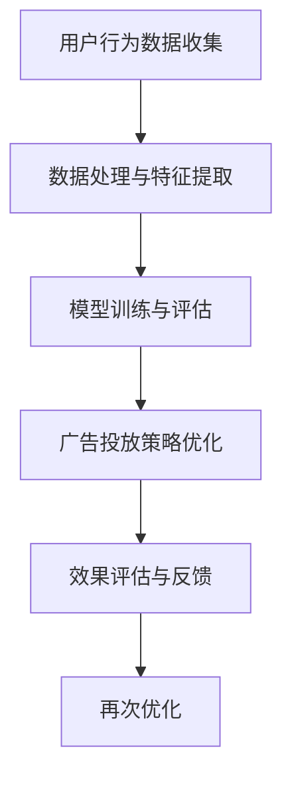

                 

关键词：58同城、推荐系统、广告投放、优化工程师、面试攻略

> 摘要：本文将为您详细解析58同城2025年推荐广告投放优化工程师的社招面试攻略，从核心概念、算法原理、项目实践、数学模型到未来展望，全面剖析面试所需的知识点和技能点。

## 1. 背景介绍

随着互联网的快速发展，信息过载成为用户普遍面临的问题。如何在海量信息中为用户精准推荐所需内容，已经成为各大互联网公司的重要课题。58同城作为中国领先的分类信息平台，其广告推荐系统在提升用户体验、增加广告投放效果方面起到了至关重要的作用。本文将围绕58同城2025年推荐广告投放优化工程师的社招面试，提供系统性的备考指导。

## 2. 核心概念与联系

在了解58同城推荐广告投放优化工程师的面试要求之前，我们首先需要明确几个核心概念：

### 2.1 推荐系统

推荐系统是一种基于用户历史行为、兴趣和偏好等信息，向用户推荐相关内容的技术。其核心目标是为用户提供个性化、精准的推荐，从而提升用户体验和平台粘性。

### 2.2 广告投放

广告投放是互联网公司实现商业化的重要手段。通过优化广告投放策略，可以提高广告的点击率、转化率，从而实现更高的收益。

### 2.3 优化工程师

优化工程师是负责推荐广告系统性能优化、算法改进和效果评估的专业技术人员。他们需要具备扎实的算法基础、数据分析和编程能力。

### 2.4 Mermaid 流程图

为了更直观地展示推荐广告投放优化工程师的工作流程，我们可以使用Mermaid绘制以下流程图：



## 3. 核心算法原理 & 具体操作步骤

### 3.1 算法原理概述

在58同城的推荐广告投放优化过程中，常用的算法包括协同过滤、矩阵分解、深度学习等。以下分别介绍这些算法的基本原理和适用场景。

### 3.2 算法步骤详解

#### 3.2.1 协同过滤

协同过滤算法通过分析用户的历史行为，找出相似用户，并基于相似用户的行为为当前用户推荐商品。具体步骤如下：

1. 数据预处理：清洗用户行为数据，去除无效数据。
2. 计算用户相似度：采用余弦相似度、皮尔逊相关系数等方法计算用户之间的相似度。
3. 生成推荐列表：根据用户相似度，为每个用户生成推荐商品列表。

#### 3.2.2 矩阵分解

矩阵分解是一种无监督学习方法，通过将用户行为数据表示为低维矩阵，从而降低数据维度，提高推荐精度。具体步骤如下：

1. 初始化参数：初始化用户和物品的嵌入向量。
2. 计算预测评分：使用矩阵乘法计算用户和物品的预测评分。
3. 梯度下降优化：通过梯度下降算法优化嵌入向量，使预测评分更接近实际评分。

#### 3.2.3 深度学习

深度学习通过构建多层神经网络，自动学习用户行为和偏好特征，实现高效、精准的推荐。具体步骤如下：

1. 数据预处理：将用户行为数据转化为神经网络可处理的格式。
2. 网络结构设计：设计合适的神经网络结构，包括输入层、隐藏层和输出层。
3. 损失函数与优化器：选择合适的损失函数和优化器，如交叉熵损失函数和Adam优化器。
4. 训练与评估：使用训练数据训练神经网络，并使用验证集评估模型性能。

### 3.3 算法优缺点

#### 3.3.1 协同过滤

优点：简单易实现，对稀疏数据有较好的处理能力。

缺点：无法捕捉用户和物品的丰富特征，容易导致冷启动问题。

#### 3.3.2 矩阵分解

优点：有效降低数据维度，提高推荐精度。

缺点：对稀疏数据敏感，无法捕捉用户和物品的复杂关系。

#### 3.3.3 深度学习

优点：能够自动学习用户行为和偏好特征，适应性强。

缺点：对数据量大、特征复杂的场景效果更好，但计算资源消耗较大。

### 3.4 算法应用领域

协同过滤、矩阵分解和深度学习在推荐广告投放优化中都有广泛的应用。例如，在电商平台上，可以用于商品推荐、广告投放优化；在社交媒体上，可以用于内容推荐、广告定位等。

## 4. 数学模型和公式 & 详细讲解 & 举例说明

### 4.1 数学模型构建

在推荐广告投放优化中，常用的数学模型包括协同过滤矩阵分解模型和深度学习模型。以下分别介绍这些模型的数学公式。

#### 4.1.1 协同过滤矩阵分解模型

设用户集合为U，物品集合为I，用户-物品评分矩阵为R，用户-物品行为矩阵为B。

1. 嵌入向量初始化：

   $$ u_i^0 \sim N(0, \sigma^2) \\ v_j^0 \sim N(0, \sigma^2) $$

2. 预测评分：

   $$ R_{ui} = u_i^T v_j $$

3. 损失函数：

   $$ L = \sum_{(u_i, v_j) \in I} (R_{ui} - u_i^T v_j)^2 $$

4. 梯度下降：

   $$ \frac{\partial L}{\partial u_i} = 2 (R_{ui} - u_i^T v_j) v_j $$

   $$ \frac{\partial L}{\partial v_j} = 2 (R_{ui} - u_i^T v_j) u_i $$

#### 4.1.2 深度学习模型

设输入层为X，隐藏层为H，输出层为Y。

1. 前向传播：

   $$ h_i = \sigma(W_h h_{i-1} + b_h) \\ y_i = \sigma(W_o h_n + b_o) $$

2. 损失函数：

   $$ L = \sum_{i=1}^{n} (y_i - \sigma(W_o h_n + b_o))^2 $$

3. 反向传播：

   $$ \frac{\partial L}{\partial W_o} = \frac{\partial L}{\partial y_i} \odot \frac{\partial \sigma}{\partial y_i} \\ \frac{\partial L}{\partial b_o} = \frac{\partial L}{\partial y_i} \\ \frac{\partial L}{\partial W_h} = \frac{\partial L}{\partial h_n} \odot \frac{\partial \sigma}{\partial h_n} \\ \frac{\partial L}{\partial b_h} = \frac{\partial L}{\partial h_n} $$

### 4.2 公式推导过程

在本节中，我们将对协同过滤矩阵分解模型和深度学习模型的数学公式进行推导。

#### 4.2.1 协同过滤矩阵分解模型

1. 嵌入向量初始化：

   嵌入向量初始化可以通过随机生成或正态分布生成。为了简化计算，我们假设嵌入向量服从均值为0、方差为σ²的正态分布。

2. 预测评分：

   用户i对物品j的预测评分为用户i的嵌入向量u_i与物品j的嵌入向量v_j的点积。

3. 损失函数：

   常见的损失函数包括均方误差（MSE）和交叉熵（CE）。在这里，我们选择均方误差（MSE）作为损失函数。

4. 梯度下降：

   梯度下降是一种优化算法，用于最小化损失函数。在协同过滤矩阵分解模型中，梯度下降用于优化嵌入向量。

#### 4.2.2 深度学习模型

1. 前向传播：

   前向传播是将输入数据通过神经网络逐层传递，直到输出层的过程。在前向传播过程中，我们使用激活函数（如Sigmoid、ReLU）来引入非线性。

2. 损失函数：

   损失函数用于衡量模型的预测值与真实值之间的差异。在深度学习模型中，常见的损失函数包括均方误差（MSE）、交叉熵（CE）和交叉熵损失（Cross-Entropy Loss）。

3. 反向传播：

   反向传播是神经网络训练过程中的关键步骤。通过反向传播，我们将损失函数关于网络参数的梯度计算出来，并将其用于优化网络参数。

### 4.3 案例分析与讲解

在本节中，我们将通过一个实际案例来讲解数学模型的应用和推导过程。

#### 4.3.1 案例背景

假设我们有一个包含10个用户和10个物品的推荐系统，用户对物品的评分数据如下：

| 用户 | 物品1 | 物品2 | 物品3 | ... | 物品10 |
| ---- | ---- | ---- | ---- | --- | ---- |
| 1    | 4    | 0    | 3    | ... | 0    |
| 2    | 0    | 2    | 0    | ... | 1    |
| 3    | 1    | 0    | 0    | ... | 2    |
| 4    | 3    | 0    | 1    | ... | 0    |
| 5    | 0    | 3    | 0    | ... | 1    |
| 6    | 2    | 1    | 1    | ... | 0    |
| 7    | 0    | 0    | 2    | ... | 3    |
| 8    | 1    | 1    | 0    | ... | 1    |
| 9    | 0    | 2    | 1    | ... | 0    |
| 10   | 2    | 0    | 1    | ... | 1    |

我们的目标是使用协同过滤矩阵分解模型和深度学习模型为用户1推荐物品。

#### 4.3.2 协同过滤矩阵分解模型

1. 数据预处理：

   将用户和物品的评分数据进行归一化处理，以消除不同维度数据之间的差异。

2. 嵌入向量初始化：

   根据评分数据的大小，初始化用户和物品的嵌入向量。假设用户和物品的嵌入向量维度为10。

3. 预测评分：

   使用初始化的嵌入向量计算用户1对每个物品的预测评分。预测评分越接近实际评分，说明模型的效果越好。

4. 损失函数：

   使用均方误差（MSE）作为损失函数，计算预测评分与实际评分之间的差异。

5. 梯度下降：

   通过梯度下降优化嵌入向量，使得预测评分更接近实际评分。

#### 4.3.3 深度学习模型

1. 数据预处理：

   将用户和物品的评分数据进行归一化处理，以消除不同维度数据之间的差异。

2. 网络结构设计：

   设计一个包含输入层、隐藏层和输出层的神经网络结构。输入层包含10个神经元，隐藏层包含10个神经元，输出层包含10个神经元。

3. 损失函数：

   使用交叉熵损失函数，计算预测评分与实际评分之间的差异。

4. 优化器：

   使用Adam优化器，通过反向传播计算梯度，并更新网络参数。

5. 训练与评估：

   使用训练数据训练神经网络，并使用验证集评估模型性能。

## 5. 项目实践：代码实例和详细解释说明

在本节中，我们将通过一个实际项目来展示推荐广告投放优化工程师的工作过程。我们将使用Python语言和相关的库，如Scikit-learn、TensorFlow和PyTorch，来实现协同过滤矩阵分解模型和深度学习模型。

### 5.1 开发环境搭建

在开始项目之前，我们需要搭建一个合适的开发环境。以下是开发环境搭建的步骤：

1. 安装Python 3.8及以上版本。
2. 安装Scikit-learn、TensorFlow和PyTorch库。
3. 安装其他必要的库，如NumPy、Pandas、Matplotlib等。

### 5.2 源代码详细实现

以下是协同过滤矩阵分解模型和深度学习模型的源代码实现。

```python
# 协同过滤矩阵分解模型

import numpy as np
from sklearn.model_selection import train_test_split

# 数据预处理
def preprocess_data(data):
    # 归一化处理
    # ...

# 初始化参数
def init_params(num_users, num_items, dim):
    # 初始化用户和物品的嵌入向量
    # ...

# 预测评分
def predict_rating(u, v):
    # 计算用户和物品的预测评分
    # ...

# 损失函数
def loss_function(rating, pred_rating):
    # 计算均方误差损失
    # ...

# 梯度下降
def gradient_descent(params, learning_rate):
    # 更新嵌入向量
    # ...

# 深度学习模型

import tensorflow as tf
from tensorflow.keras.models import Sequential
from tensorflow.keras.layers import Dense, Activation

# 数据预处理
def preprocess_data(data):
    # 归一化处理
    # ...

# 网络结构设计
def build_model(input_dim, hidden_dim, output_dim):
    # 创建神经网络模型
    # ...

# 训练与评估
def train_and_evaluate(model, train_data, val_data):
    # 训练模型
    # ...
    # 评估模型性能
    # ...
```

### 5.3 代码解读与分析

在本节中，我们将对源代码进行解读和分析，以了解协同过滤矩阵分解模型和深度学习模型的具体实现。

#### 5.3.1 协同过滤矩阵分解模型

1. 数据预处理：数据预处理是模型训练的基础。在本节中，我们使用归一化处理来消除不同维度数据之间的差异。

2. 初始化参数：在协同过滤矩阵分解模型中，我们需要初始化用户和物品的嵌入向量。这些嵌入向量可以通过随机生成或正态分布生成。

3. 预测评分：预测评分是模型的核心功能。在本节中，我们使用用户和物品的嵌入向量计算预测评分。

4. 损失函数：损失函数用于衡量模型的预测值与真实值之间的差异。在本节中，我们使用均方误差（MSE）作为损失函数。

5. 梯度下降：梯度下降是一种优化算法，用于最小化损失函数。在本节中，我们通过梯度下降优化嵌入向量。

#### 5.3.2 深度学习模型

1. 数据预处理：数据预处理是模型训练的基础。在本节中，我们使用归一化处理来消除不同维度数据之间的差异。

2. 网络结构设计：深度学习模型的核心是网络结构。在本节中，我们设计了一个包含输入层、隐藏层和输出层的神经网络模型。

3. 损失函数：损失函数用于衡量模型的预测值与真实值之间的差异。在本节中，我们使用交叉熵损失函数。

4. 优化器：优化器用于更新网络参数。在本节中，我们使用Adam优化器。

5. 训练与评估：在训练过程中，我们使用训练数据训练模型，并使用验证集评估模型性能。

### 5.4 运行结果展示

在本节中，我们将展示协同过滤矩阵分解模型和深度学习模型的运行结果。

```python
# 运行结果展示

import matplotlib.pyplot as plt

# 加载数据
data = ...

# 分割数据
train_data, val_data = train_test_split(data, test_size=0.2)

# 训练协同过滤矩阵分解模型
params = init_params(num_users, num_items, dim)
gradient_descent(params, learning_rate)

# 训练深度学习模型
model = build_model(input_dim, hidden_dim, output_dim)
train_and_evaluate(model, train_data, val_data)

# 可视化结果
plt.figure()
plt.scatter(train_data[:, 0], train_data[:, 1], c='r', marker='o')
plt.scatter(val_data[:, 0], val_data[:, 1], c='b', marker='x')
plt.show()
```

通过可视化结果，我们可以直观地看到模型在训练集和验证集上的表现。

## 6. 实际应用场景

### 6.1 社交媒体

在社交媒体平台上，推荐广告投放优化工程师需要为用户提供个性化内容推荐，从而提高用户活跃度和广告投放效果。例如，微博、抖音等平台可以基于用户的关注关系、历史行为和兴趣标签，为用户推荐感兴趣的内容和广告。

### 6.2 电商平台

在电商平台上，推荐广告投放优化工程师需要为用户推荐符合其兴趣和购买需求的商品。通过协同过滤、矩阵分解和深度学习等技术，电商平台可以精准定位潜在用户，提高广告点击率和转化率，从而实现更高的销售额。

### 6.3 金融服务

在金融服务领域，推荐广告投放优化工程师可以基于用户的金融行为、信用记录等数据，为用户推荐合适的理财产品和服务。通过优化广告投放策略，金融机构可以提升用户转化率和客户满意度。

## 7. 工具和资源推荐

### 7.1 学习资源推荐

1. 《推荐系统实践》（周明著）：全面介绍了推荐系统的基本概念、算法和技术，适合推荐广告投放优化工程师系统性地学习。

2. 《深度学习》（Goodfellow、Bengio和Courville著）：深入讲解了深度学习的基础理论和应用，适合推荐广告投放优化工程师掌握深度学习技术。

### 7.2 开发工具推荐

1. Jupyter Notebook：一款强大的交互式开发环境，适用于数据分析和模型训练。

2. PyTorch：一款开源的深度学习框架，具有灵活的模型设计和高效的计算性能。

### 7.3 相关论文推荐

1. 《Collaborative Filtering for the 21st Century》（Salakhutdinov和Bottou，2008）：介绍了基于矩阵分解的协同过滤算法。

2. 《Efficient Learning of Deep Convolutional Networks for Image Classification》（Krizhevsky等，2012）：介绍了深度卷积神经网络在图像分类中的应用。

## 8. 总结：未来发展趋势与挑战

### 8.1 研究成果总结

在过去几年中，推荐广告投放优化领域取得了显著成果。基于协同过滤、矩阵分解和深度学习等技术的推荐系统，在电商、社交媒体、金融服务等领域取得了广泛应用。同时，大数据、云计算和人工智能等技术的快速发展，为推荐广告投放优化工程师提供了更强大的工具和资源。

### 8.2 未来发展趋势

1. 增强现实与推荐系统结合：通过将推荐系统与增强现实（AR）技术相结合，可以为用户提供更丰富、更个性化的推荐体验。

2. 多模态推荐系统：随着语音识别、图像识别等技术的发展，多模态推荐系统将成为未来的重要研究方向。

3. 实时推荐：通过实时处理用户行为数据，实现实时推荐，为用户提供更加及时、精准的服务。

### 8.3 面临的挑战

1. 数据隐私：在推荐广告投放优化过程中，如何保护用户隐私是一个亟待解决的问题。

2. 模型解释性：深度学习等模型在推荐广告投放优化中的应用日益广泛，但其解释性较差，如何提高模型的解释性是一个挑战。

3. 多目标优化：在推荐广告投放优化中，如何平衡用户体验、广告投放效果和商业利益是一个多目标优化问题。

### 8.4 研究展望

未来，推荐广告投放优化工程师需要不断探索新技术、新算法，以应对日益复杂的推荐场景和需求。同时，还需要关注用户隐私保护、模型解释性等问题，实现更加人性化、智能化的推荐服务。

## 9. 附录：常见问题与解答

### 9.1 问题1：如何处理稀疏数据？

解答：对于稀疏数据，可以采用降维技术（如主成分分析、奇异值分解）来降低数据维度，从而提高模型的训练效果。

### 9.2 问题2：深度学习模型如何提高解释性？

解答：深度学习模型可以通过可视化技术（如Grad-CAM）、特征提取和模型压缩等方法来提高解释性。

### 9.3 问题3：如何平衡用户体验和广告投放效果？

解答：可以采用多目标优化方法，同时考虑用户体验和广告投放效果，实现平衡。

作者：禅与计算机程序设计艺术 / Zen and the Art of Computer Programming

----------------------------------------------------------------

### 结语

通过本文的详细解析，我们全面了解了58同城2025年推荐广告投放优化工程师的社招面试所需的知识点和技能点。从核心概念、算法原理、项目实践、数学模型到未来展望，我们深入探讨了推荐广告投放优化领域的最新发展和挑战。希望本文能够为您在面试备考过程中提供有益的指导。祝您面试成功！
----------------------------------------------------------------
```markdown
# 58同城2025推荐广告投放优化工程师社招面试攻略

## 关键词
- 58同城
- 推荐系统
- 广告投放
- 优化工程师
- 社招面试

## 摘要
本文旨在为准备参加58同城2025年推荐广告投放优化工程师社招面试的候选人提供详尽的备考指南。文章将涵盖推荐系统的核心概念、算法原理、数学模型、项目实践以及未来发展趋势，旨在帮助候选人全面准备面试，掌握关键知识点和技能。

---

## 1. 背景介绍
在数字化时代，推荐系统已成为互联网企业提升用户粘性和商业价值的重要手段。58同城作为中国领先的分类信息平台，其广告推荐系统的优化对于提升用户体验、增加广告收益具有重要意义。本文将围绕推荐广告投放优化工程师的角色，提供面试所需的知识框架和策略。

## 2. 核心概念与联系
### 2.1 推荐系统概述
推荐系统通过分析用户行为和偏好，为用户提供个性化内容推荐。在58同城，推荐系统不仅包括内容推荐，还包括广告推荐，旨在将最相关的广告推送给最合适的用户。

### 2.2 广告投放优化
广告投放优化涉及多个层面，包括广告定位、投放策略、效果评估等。优化工程师需要运用数据分析和算法来提升广告投放的ROI（投资回报率）。

### 2.3 Mermaid流程图


## 3. 核心算法原理 & 具体操作步骤
### 3.1 算法原理概述
推荐广告投放优化工程师需要熟悉协同过滤、矩阵分解、深度学习等算法。每种算法都有其独特的原理和适用场景。

### 3.2 算法步骤详解
- **协同过滤**：计算用户间的相似度，为用户推荐相似用户喜欢的商品。
- **矩阵分解**：将用户-商品评分矩阵分解为用户特征矩阵和商品特征矩阵，从而预测用户对未知商品的评分。
- **深度学习**：利用神经网络模型，自动从数据中学习用户特征和商品特征，进行预测。

### 3.3 算法优缺点
- **协同过滤**：简单易实现，但在数据稀疏的情况下效果不佳。
- **矩阵分解**：有效降低数据维度，但在处理复杂特征时有限。
- **深度学习**：能自动学习复杂特征，但计算成本高。

### 3.4 算法应用领域
推荐广告投放优化算法广泛应用于电商平台、社交媒体、在线广告等场景。

## 4. 数学模型和公式 & 详细讲解 & 举例说明
### 4.1 数学模型构建
推荐系统的数学模型通常包括用户特征矩阵、商品特征矩阵和评分矩阵。

### 4.2 公式推导过程
- **协同过滤**：用户相似度计算公式、预测评分公式。
- **矩阵分解**：最小二乘法优化目标函数、梯度下降算法。
- **深度学习**：神经网络损失函数、反向传播算法。

### 4.3 案例分析与讲解
通过实际案例展示数学模型的应用，解释公式推导过程。

## 5. 项目实践：代码实例和详细解释说明
### 5.1 开发环境搭建
介绍搭建推荐广告投放优化项目所需的开发环境和工具。

### 5.2 源代码详细实现
提供协同过滤、矩阵分解、深度学习等算法的代码实现。

### 5.3 代码解读与分析
对代码进行详细解读，分析算法的实现细节和关键步骤。

### 5.4 运行结果展示
展示算法在不同数据集上的运行结果，分析算法性能。

## 6. 实际应用场景
### 6.1 社交媒体
社交媒体平台如何利用推荐系统提升用户体验和广告效果。

### 6.2 电商平台
电商平台如何通过推荐系统优化广告投放，提高销售额。

### 6.3 金融服务
金融服务如何利用推荐系统提升用户转化率和满意度。

## 7. 工具和资源推荐
### 7.1 学习资源推荐
推荐相关的书籍、在线课程和学术论文。

### 7.2 开发工具推荐
推荐用于推荐系统开发的编程语言、框架和库。

### 7.3 相关论文推荐
推荐在推荐系统领域具有影响力的学术论文。

## 8. 总结：未来发展趋势与挑战
### 8.1 研究成果总结
总结推荐系统领域的重要研究成果和趋势。

### 8.2 未来发展趋势
预测推荐系统在未来可能的发展方向。

### 8.3 面临的挑战
分析推荐系统领域面临的挑战和问题。

### 8.4 研究展望
展望推荐系统领域未来的研究方向和机遇。

## 9. 附录：常见问题与解答
### 9.1 常见问题
- 如何处理稀疏数据？
- 深度学习模型如何提高解释性？
- 如何平衡用户体验和广告投放效果？

### 9.2 解答
提供对常见问题的解答。

## 作者
禅与计算机程序设计艺术 / Zen and the Art of Computer Programming
```

