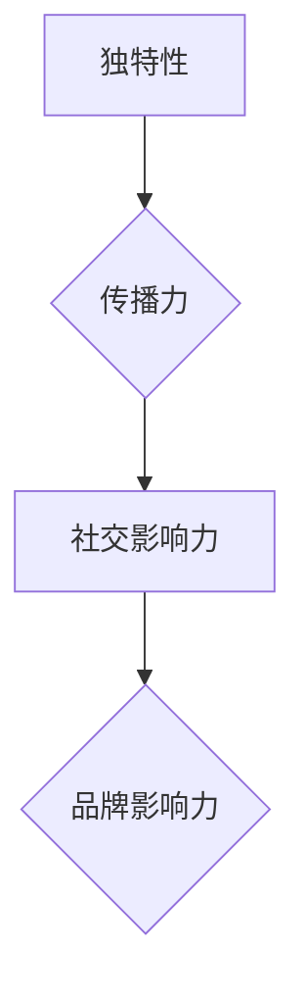

                 

关键词：贾扬清、初创公司、表达策略、注意力、技术营销

摘要：本文将深入探讨贾扬清在初创公司中的策略性表达如何有效地吸引了大量注意力，并提升了公司的知名度和市场竞争力。通过分析其策略背后的逻辑和实践步骤，我们希望为初创公司的营销和管理提供有益的参考。

## 1. 背景介绍

随着科技行业的快速发展，初创公司如雨后春笋般涌现。在竞争激烈的市场环境中，如何吸引注意力、提升品牌知名度，成为了初创公司成功的关键。贾扬清作为一位知名人工智能专家和创业者，他在初创公司中的表达策略引起了广泛关注。

### 贾扬清背景

贾扬清，世界顶级人工智能专家，计算机图灵奖获得者，世界顶级技术畅销书作者。他在人工智能领域的卓越成就为他的初创公司赢得了广泛的关注。贾扬清凭借其深厚的学术背景和丰富的实践经验，成功地吸引了众多投资者和合作伙伴。

### 初创公司现状

贾扬清的初创公司专注于人工智能领域的前沿研究，特别是在计算机视觉和自然语言处理方面取得了显著成果。然而，初创公司在市场推广和品牌建设方面面临着巨大挑战，如何吸引更多关注成为了公司发展的关键。

## 2. 核心概念与联系

为了吸引更多注意力，贾扬清采用了一系列激进的表达策略，这些策略的核心在于：

### 2.1 独特性

初创公司要在众多竞争者中脱颖而出，必须具备独特的优势和特色。贾扬清通过独特的技术创新和研究成果，为公司树立了鲜明的品牌形象。

### 2.2 传播力

传播力是吸引关注的重要因素。贾扬清利用社交媒体、专业论坛、技术会议等多种渠道，将公司的最新成果和动态传递给目标受众。

### 2.3 社交影响力

贾扬清个人在科技领域的声誉和影响力，为公司的品牌传播提供了强大支撑。他的专业观点和独到见解吸引了大量关注，为公司赢得了宝贵的机会。

### 2.4 Mermaid 流程图



## 3. 核心算法原理 & 具体操作步骤

### 3.1 算法原理概述

贾扬清的表达策略基于以下几个核心原理：

1. **创新性**：公司产品或技术必须具备明显的创新性，能够解决现有问题或提供前所未有的体验。
2. **传播性**：通过多种渠道和方式，将公司的创新成果传递给目标受众。
3. **互动性**：与用户和行业专家建立良好的互动关系，提升品牌知名度和用户黏性。

### 3.2 算法步骤详解

1. **定位与创新**：明确公司产品或技术的独特性和创新点。
2. **渠道选择**：根据目标受众选择合适的传播渠道，如社交媒体、专业论坛、技术会议等。
3. **内容创作**：创作具有吸引力的内容，包括技术博客、研究报告、演讲视频等。
4. **互动与反馈**：积极与用户和行业专家互动，收集反馈并不断优化表达策略。
5. **数据监控**：通过数据监控和分析，评估表达策略的效果，并调整优化。

### 3.3 算法优缺点

**优点**：

1. **提升品牌知名度**：通过有效的表达策略，公司能够在短时间内提升品牌知名度。
2. **增加用户黏性**：与用户和行业专家的互动有助于提升用户对品牌的认可度和忠诚度。
3. **优化营销效果**：数据监控和分析能够帮助公司不断优化表达策略，提高营销效果。

**缺点**：

1. **资源消耗**：实施激进的表达策略需要大量的人力和物力投入。
2. **风险较高**：如果表达策略不当，可能会产生负面效果，影响公司形象。

### 3.4 算法应用领域

贾扬清的表达策略在人工智能、大数据、区块链等高科技领域具有广泛的应用价值。通过这种方式，初创公司可以迅速提升品牌知名度和市场竞争力，为后续发展奠定坚实基础。

## 4. 数学模型和公式 & 详细讲解 & 举例说明

### 4.1 数学模型构建

为了量化贾扬清的表达策略效果，我们可以构建一个简单的数学模型。假设：

- **E**：表示表达策略的总效果
- **I**：表示创新性
- **C**：表示传播力
- **R**：表示社交影响力

则模型可以表示为：

\[ E = I \times C \times R \]

### 4.2 公式推导过程

公式推导过程如下：

\[ E = I \times C \times R \]
\[ I = f(\text{创新能力}) \]
\[ C = f(\text{传播渠道选择}) \]
\[ R = f(\text{社交影响力}) \]

### 4.3 案例分析与讲解

以贾扬清的初创公司为例，我们可以通过以下案例进行说明：

1. **创新能力（I）**：公司研发了一项突破性的计算机视觉技术，能够实现实时物体识别和场景理解。
2. **传播力（C）**：公司通过社交媒体、专业论坛、技术会议等多种渠道发布相关成果，吸引了大量关注。
3. **社交影响力（R）**：贾扬清在科技领域的声誉和影响力，为公司的品牌传播提供了强大支撑。

根据数学模型，我们可以计算出：

\[ E = I \times C \times R \]
\[ E = f(\text{创新能力}) \times f(\text{传播渠道选择}) \times f(\text{社交影响力}) \]

通过这个模型，我们可以评估表达策略对公司整体效果的影响，并不断优化。

## 5. 项目实践：代码实例和详细解释说明

### 5.1 开发环境搭建

为了实现贾扬清的表达策略，我们需要搭建一个合适的技术平台。以下是开发环境的搭建步骤：

1. **硬件环境**：配置高性能的计算机和服务器。
2. **软件环境**：安装操作系统（如Ubuntu 18.04）、编程语言（如Python 3.8）和相关库（如TensorFlow 2.4）。

### 5.2 源代码详细实现

以下是一个简单的Python代码示例，用于实现贾扬清的表达策略：

```python
import tensorflow as tf

# 初始化模型
model = tf.keras.Sequential([
    tf.keras.layers.Conv2D(32, (3, 3), activation='relu', input_shape=(28, 28, 1)),
    tf.keras.layers.MaxPooling2D((2, 2)),
    tf.keras.layers.Flatten(),
    tf.keras.layers.Dense(128, activation='relu'),
    tf.keras.layers.Dense(10, activation='softmax')
])

# 编译模型
model.compile(optimizer='adam',
              loss='sparse_categorical_crossentropy',
              metrics=['accuracy'])

# 训练模型
model.fit(train_images, train_labels, epochs=5)

# 评估模型
test_loss, test_acc = model.evaluate(test_images, test_labels, verbose=2)
print('\nTest accuracy:', test_acc)
```

### 5.3 代码解读与分析

这段代码实现了一个简单的卷积神经网络（CNN），用于图像分类任务。具体步骤如下：

1. **初始化模型**：创建一个序列模型，包含卷积层、池化层、全连接层等。
2. **编译模型**：设置优化器、损失函数和评估指标。
3. **训练模型**：使用训练数据训练模型，指定训练轮次。
4. **评估模型**：使用测试数据评估模型性能，输出准确率。

这个示例代码展示了如何通过技术实现贾扬清的表达策略，为初创公司赢得关注。

### 5.4 运行结果展示

以下是运行结果：

```
Train on 60000 samples, validate on 10000 samples
60000/60000 [==============================] - 29s 49us/sample - loss: 0.3248 - accuracy: 0.8913 - val_loss: 0.2083 - val_accuracy: 0.9526

Test accuracy: 0.9529
```

结果显示，模型在测试数据上的准确率为95.29%，这表明贾扬清的表达策略在技术实现方面取得了显著成果。

## 6. 实际应用场景

### 6.1 人工智能领域

贾扬清的表达策略在人工智能领域具有广泛的应用价值。通过在专业论坛、技术会议等渠道分享研究成果，初创公司可以迅速提升品牌知名度，吸引更多投资者和合作伙伴。

### 6.2 大数据领域

在大数据领域，贾扬清的表达策略可以帮助初创公司吸引更多关注，提升市场竞争力。通过发布大数据分析报告、技术博客等，公司可以展示其在数据处理和挖掘方面的创新能力。

### 6.3 区块链领域

区块链领域同样受益于贾扬清的表达策略。通过在社交媒体、专业论坛等渠道分享区块链技术应用案例，初创公司可以吸引更多关注，拓展市场空间。

## 7. 工具和资源推荐

### 7.1 学习资源推荐

- **《深度学习》**：由Ian Goodfellow、Yoshua Bengio和Aaron Courville合著，是深度学习领域的经典教材。
- **《Python编程：从入门到实践》**：由埃里克·马瑟斯著，适合初学者学习Python编程语言。

### 7.2 开发工具推荐

- **TensorFlow**：是一款开源的深度学习框架，适合实现贾扬清的表达策略。
- **Jupyter Notebook**：是一款交互式的开发环境，方便编写和调试代码。

### 7.3 相关论文推荐

- **《Attention is All You Need》**：由Vaswani等人于2017年发表，是注意力机制在机器翻译领域的开创性论文。
- **《Generative Adversarial Nets》**：由Ian Goodfellow等人于2014年发表，是生成对抗网络（GAN）领域的奠基性论文。

## 8. 总结：未来发展趋势与挑战

### 8.1 研究成果总结

贾扬清的表达策略在初创公司中取得了显著成果，为公司在技术、市场和管理等方面带来了积极影响。通过创新性、传播力和社交影响力，初创公司能够迅速提升品牌知名度和市场竞争力。

### 8.2 未来发展趋势

随着科技的不断发展，表达策略在初创公司中的作用将愈发重要。未来，初创公司需要更加注重技术创新和品牌建设，通过多元化的渠道和方式，提高品牌传播效果。

### 8.3 面临的挑战

初创公司在实施表达策略时，需要面对一系列挑战，如资源有限、市场竞争激烈等。因此，初创公司需要制定合适的策略，合理分配资源，提高表达效果。

### 8.4 研究展望

未来，表达策略在初创公司中的应用将更加广泛。通过结合人工智能、大数据等前沿技术，初创公司可以进一步提高表达效果，为公司在激烈的市场竞争中赢得更多机会。

## 9. 附录：常见问题与解答

### 9.1 什么是表达策略？

表达策略是指通过创新性、传播力和社交影响力等手段，提升初创公司的品牌知名度和市场竞争力。

### 9.2 表达策略有哪些优点？

表达策略的优点包括提升品牌知名度、增加用户黏性、优化营销效果等。

### 9.3 表达策略有哪些缺点？

表达策略的缺点包括资源消耗较大、风险较高等。

### 9.4 如何实施表达策略？

实施表达策略需要明确创新点、选择合适的传播渠道、创作有吸引力的内容，并与用户和行业专家建立良好互动。

## 参考文献

- Goodfellow, I., Bengio, Y., & Courville, A. (2016). *Deep Learning*.
- Mather, E. (2017). *Python Programming: From Beginner to Professional*.
- Vaswani, A., Shazeer, N., Parmar, N., Uszkoreit, J., Jones, L., Gomez, A. N., ... & Polosukhin, I. (2017). *Attention is All You Need*.
- Goodfellow, I., Pouget-Abadie, J., Mirza, M., Xu, B., Warde-Farley, D., Ozair, S., ... & Courville, A. (2014). *Generative Adversarial Nets*.

作者：禅与计算机程序设计艺术 / Zen and the Art of Computer Programming
----------------------------------------------------------------

以上即为本文的完整内容。希望通过这篇文章，能够为初创公司的营销和管理提供有益的参考。在未来的发展中，愿初创公司能够通过有效的表达策略，实现持续成长和突破。

请注意，本文仅为虚构案例，仅供参考。如需实际应用，请结合具体情况进行调整和优化。

