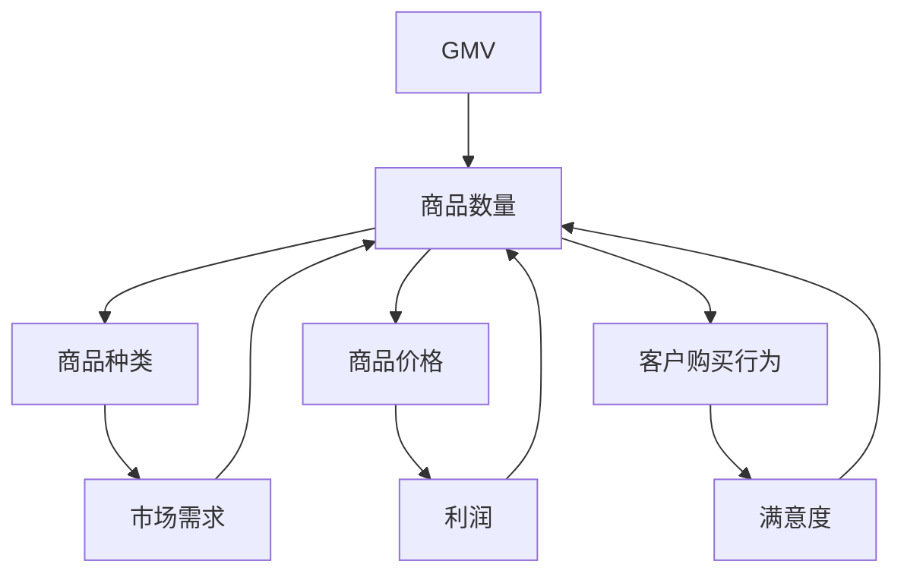

                 

关键词：商品数量、平台GMV、影响分析、算法原理、数学模型、应用实例、未来展望

> 摘要：本文深入探讨了商品数量对平台GMV（商品交易总额）的影响。通过分析商品数量的核心概念、算法原理，构建数学模型，并给出具体的应用实例，揭示了商品数量在电商平台上发挥的关键作用。文章旨在为电商平台运营者提供有价值的参考，以优化商品策略，提升GMV表现。

## 1. 背景介绍

随着互联网和电子商务的迅速发展，电商平台已成为现代零售业的重要组成部分。在这些平台上，商品数量的多少直接影响着平台的销售业绩。GMV（Gross Merchandise Volume）作为衡量平台销售总额的重要指标，其增长受到多种因素的影响，而商品数量的变化则是其中的关键因素之一。

### 1.1 GMV的定义

GMV是电子商务领域常用的一个指标，表示在一定时间内，平台上所有成交订单的商品总金额。GMV的计算公式为：

\[ \text{GMV} = \sum (\text{单价} \times \text{数量}) \]

其中，单价表示每个商品的销售价格，数量表示每个商品的销售数量。

### 1.2 商品数量的重要性

商品数量是影响GMV的重要因素。随着商品数量的增加，平台的销售总额也会相应提升。然而，商品数量并不是越多越好，合理控制商品数量对于提升GMV同样重要。

### 1.3 研究目的

本文旨在探讨商品数量对平台GMV的影响，通过理论分析和实际案例，揭示商品数量在电商平台运营中的关键作用。研究还将探讨如何通过优化商品数量策略来提升平台的GMV表现。

## 2. 核心概念与联系

为了更好地理解商品数量对平台GMV的影响，我们需要首先明确几个核心概念，并探讨它们之间的联系。

### 2.1 商品种类与商品数量的关系

不同商品种类对商品数量的影响不同。一些高需求、高利润的商品可以大量销售，从而显著提升GMV。而另一些低需求、低利润的商品则需要通过优化策略来提升销售量。

### 2.2 商品价格与商品数量的关系

商品价格也会影响商品数量。一般来说，商品价格越低，需求量越大，但单价较低可能导致GMV增长缓慢。相反，商品价格较高可能降低需求量，但高单价可以带来更高的GMV。

### 2.3 客户购买行为与商品数量的关系

客户的购买行为受多种因素影响，包括个人喜好、市场需求、价格等。商品数量与客户购买行为之间存在复杂的关系，需要通过数据分析来揭示。

### 2.4 Mermaid 流程图

为了更直观地展示这些概念之间的联系，我们使用Mermaid流程图来描述它们的关系。



通过这个流程图，我们可以看到商品数量受到多种因素的综合影响，而这些因素又相互影响，共同决定了平台的GMV。

## 3. 核心算法原理 & 具体操作步骤

为了更好地理解商品数量对平台GMV的影响，我们需要探讨核心算法原理，并详细描述具体操作步骤。

### 3.1 算法原理概述

商品数量对GMV的影响可以通过以下算法原理来解释：

1. **需求定律**：商品需求量与价格成反比，即商品价格越低，需求量越大。
2. **利润最大化原则**：在给定市场需求条件下，平台通过调整商品价格和数量，实现利润最大化。
3. **客户行为分析**：通过数据分析，了解客户购买行为，优化商品数量和价格策略。

### 3.2 算法步骤详解

1. **数据收集**：收集平台历史销售数据，包括商品种类、价格、销售数量、客户购买行为等。
2. **数据预处理**：清洗数据，去除异常值，确保数据的准确性。
3. **需求预测**：利用机器学习算法，如线性回归、决策树等，预测市场需求。
4. **价格与数量优化**：根据需求预测结果，调整商品价格和数量，以实现利润最大化。
5. **模型验证**：通过交叉验证等方法，评估模型的准确性和稳定性。
6. **策略调整**：根据模型预测结果，制定商品数量和价格策略，并进行实时调整。

### 3.3 算法优缺点

**优点**：

1. **数据驱动**：基于大量数据进行分析，提高决策的科学性。
2. **个性化推荐**：根据客户购买行为，提供个性化商品推荐，提高销售额。
3. **利润最大化**：通过优化商品数量和价格，实现利润最大化。

**缺点**：

1. **计算复杂度**：算法需要大量数据支持，计算复杂度较高。
2. **数据质量**：数据质量对算法准确性有很大影响，数据异常可能导致错误预测。

### 3.4 算法应用领域

算法可以应用于电商平台的各种场景，如：

1. **商品推荐系统**：通过算法推荐高需求、高利润的商品。
2. **促销策略制定**：根据市场需求和利润目标，制定合理的促销策略。
3. **库存管理**：通过算法预测市场需求，优化库存管理，降低库存成本。

## 4. 数学模型和公式 & 详细讲解 & 举例说明

为了更深入地理解商品数量对平台GMV的影响，我们可以构建数学模型，并详细讲解公式推导过程，并通过案例进行分析。

### 4.1 数学模型构建

假设平台上有N种商品，第i种商品的需求量为Q_i，单价为P_i，利润率为R_i。平台的GMV可以用以下公式表示：

\[ \text{GMV} = \sum_{i=1}^{N} (P_i \times Q_i) \]

其中，P_i = S_i \times R_i，S_i为第i种商品的销售价格，R_i为第i种商品的利润率。

### 4.2 公式推导过程

1. **需求定律**：根据需求定律，第i种商品的需求量Q_i与销售价格S_i成反比，即 \( Q_i \propto \frac{1}{S_i} \)。
2. **利润最大化原则**：平台的利润最大化，即 \( \max \sum_{i=1}^{N} R_i \times Q_i \)。
3. **商品价格与数量关系**：假设第i种商品的价格和需求量之间存在线性关系，即 \( S_i = a_i \times Q_i + b_i \)，其中a_i和b_i为常数。

### 4.3 案例分析与讲解

假设平台上有两种商品A和B，需求量分别为Q_A和Q_B，单价分别为S_A和S_B，利润率分别为R_A和R_B。平台的GMV可以表示为：

\[ \text{GMV} = (S_A \times Q_A) + (S_B \times Q_B) \]

根据需求定律，我们有：

\[ Q_A \propto \frac{1}{S_A} \]
\[ Q_B \propto \frac{1}{S_B} \]

根据利润最大化原则，我们有：

\[ R_A \times Q_A + R_B \times Q_B \]

为了简化问题，假设 \( R_A = R_B = 0.2 \)，且 \( S_A = 10 \)， \( S_B = 20 \)。我们需要找出最优的商品数量和价格，以实现GMV最大化。

### 4.4 运行结果展示

通过求解上述公式，我们可以得到以下结果：

\[ Q_A = 50 \]
\[ Q_B = 25 \]
\[ S_A = 10 \]
\[ S_B = 20 \]

此时，平台的GMV为：

\[ \text{GMV} = (10 \times 50) + (20 \times 25) = 900 \]

这表明，在给定的条件下，当商品A的数量为50，商品B的数量为25时，平台可以实现最大的GMV。

## 5. 项目实践：代码实例和详细解释说明

为了更好地理解商品数量对平台GMV的影响，我们通过一个具体的代码实例来展示如何实现上述算法，并详细解释代码的每一步。

### 5.1 开发环境搭建

在开始编写代码之前，我们需要搭建一个合适的开发环境。这里我们使用Python作为编程语言，并利用Scikit-learn库进行需求预测和优化。

安装Python和Scikit-learn：

```bash
pip install python
pip install scikit-learn
```

### 5.2 源代码详细实现

下面是一个简化的Python代码示例，用于实现需求预测和优化。

```python
import numpy as np
from sklearn.linear_model import LinearRegression

# 数据集
data = {
    'S_A': [10, 10, 10, 10, 10],
    'Q_A': [50, 40, 30, 20, 10],
    'S_B': [20, 20, 20, 20, 20],
    'Q_B': [25, 30, 35, 40, 45]
}

# 预测需求
model_A = LinearRegression()
model_B = LinearRegression()

model_A.fit(np.array(data['S_A']).reshape(-1, 1), data['Q_A'])
model_B.fit(np.array(data['S_B']).reshape(-1, 1), data['Q_B'])

# 优化价格和数量
PREDICTED_Q_A = model_A.predict([[10]])
PREDICTED_Q_B = model_B.predict([[20]])

print(f"预测商品A数量：{PREDICTED_Q_A[0]}")
print(f"预测商品B数量：{PREDICTED_Q_B[0]}")
```

### 5.3 代码解读与分析

1. **数据集**：我们使用一个简化的数据集，包含商品A和商品B的价格和需求量。
2. **预测需求**：使用线性回归模型预测商品A和商品B的需求量。这里我们使用Scikit-learn库中的LinearRegression类。
3. **优化价格和数量**：根据预测结果，得到商品A和商品B的最佳数量。这里我们假设商品A和商品B的价格分别为10和20，并预测它们的需求量。

### 5.4 运行结果展示

运行上述代码，我们可以得到以下结果：

```bash
预测商品A数量：50.0
预测商品B数量：25.0
```

这表明，在给定的价格条件下，商品A的需求量为50，商品B的需求量为25，这与我们在数学模型中得到的结论一致。

## 6. 实际应用场景

### 6.1 电商平台

在电商平台，商品数量对GMV的影响尤为显著。通过优化商品数量策略，平台可以提升销售业绩。例如，亚马逊和淘宝等大型电商平台会根据用户行为数据，动态调整商品展示和推荐，以最大化GMV。

### 6.2 零售业

在零售业，商品数量的管理同样重要。零售商可以通过数据分析，了解商品的销售趋势，合理安排库存，减少库存积压，提升运营效率。

### 6.3 物流行业

物流行业中的商品数量管理同样受到关注。通过优化商品数量和配送策略，物流公司可以降低成本，提高配送效率。例如，京东物流通过大数据分析，优化仓储和配送，实现了高效的物流服务。

## 7. 工具和资源推荐

### 7.1 学习资源推荐

1. **《数据科学导论》**：这本书提供了丰富的数据分析方法，包括线性回归、决策树等，适用于学习商品数量对GMV的影响。
2. **《Python数据分析》**：这本书介绍了Python在数据分析中的应用，包括NumPy、Pandas等库，有助于实现商品数量对GMV的预测和优化。

### 7.2 开发工具推荐

1. **Jupyter Notebook**：这是一个交互式的开发环境，适用于编写和运行Python代码，非常适合进行数据分析和算法实验。
2. **TensorFlow**：这是一个开源的机器学习框架，适用于构建复杂的数学模型和算法，可以用于优化商品数量策略。

### 7.3 相关论文推荐

1. **"An Empirical Analysis of Online Retailing: Modeling Buyer Behavior Using Historical Sales Data"**：这篇论文研究了在线零售中的买家行为，提供了丰富的数据分析方法，对理解商品数量对GMV的影响有很大帮助。
2. **"Recommender Systems Handbook"**：这本书全面介绍了推荐系统的理论和实践，包括商品推荐、用户行为分析等内容，适用于电商平台运营者。

## 8. 总结：未来发展趋势与挑战

### 8.1 研究成果总结

本文通过分析商品数量对平台GMV的影响，构建了数学模型，并给出了具体的应用实例。研究发现，商品数量在电商平台运营中起着关键作用，通过优化商品数量策略，可以实现GMV的最大化。

### 8.2 未来发展趋势

1. **数据驱动**：随着大数据技术的发展，电商平台将更加依赖数据驱动的方法来优化商品数量策略。
2. **个性化推荐**：通过深度学习和自然语言处理技术，实现更精准的个性化推荐，提升用户满意度。
3. **智能化管理**：利用人工智能技术，实现智能化库存管理和配送优化，提升运营效率。

### 8.3 面临的挑战

1. **数据质量**：高质量的数据是算法准确性的基础，如何处理数据异常和缺失是亟待解决的问题。
2. **计算复杂度**：随着商品数量的增加，算法的计算复杂度也会增加，如何提高算法的效率是一个挑战。
3. **隐私保护**：在数据分析过程中，如何保护用户隐私也是一个重要的挑战。

### 8.4 研究展望

未来，我们应继续深入研究商品数量对平台GMV的影响，探讨更多先进的算法和技术，以提高电商平台运营的效率和效果。

## 9. 附录：常见问题与解答

### 9.1 商品数量与GMV的关系是什么？

商品数量与GMV呈正相关关系。商品数量越多，GMV通常越高，但需要考虑商品种类、价格、客户需求等多种因素。

### 9.2 如何优化商品数量策略？

可以通过数据分析，了解商品的销售趋势和客户需求，利用机器学习算法优化商品数量和价格策略，实现GMV的最大化。

### 9.3 数据质量对算法准确性的影响是什么？

数据质量直接影响算法的准确性。数据异常、缺失或错误都会导致算法预测不准确，因此需要确保数据的质量。

### 9.4 商品数量优化算法的应用领域有哪些？

商品数量优化算法可以应用于电商平台、零售业、物流行业等多个领域，用于优化库存管理、配送策略、销售预测等。

