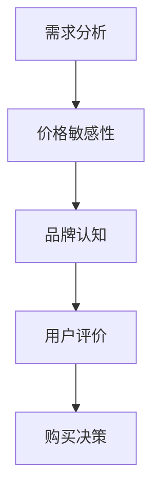

                 

 **关键词：**
- 商学院学生
- 笔记本电脑购买行为
- 营销策略
- 数据分析
- 用户偏好

**摘要：**
本文旨在分析商学院学生在笔记本电脑购买行为中的关键因素，探讨有效的营销策略。通过数据分析和用户调研，文章揭示了影响购买决策的主要因素，并提出了针对性的营销方法，为相关企业提供了有价值的参考。

## 1. 背景介绍

### 1.1 商学院学生的需求特点

商学院学生在学业和职业发展过程中，对笔记本电脑的性能和功能有着较高的要求。他们通常需要处理大量的数据分析和文档编写任务，因此对处理速度、存储空间和可扩展性有较高期望。此外，由于频繁的学术交流和团队合作，他们还需要具备良好的网络连接和协作功能。

### 1.2 笔记本电脑市场现状

近年来，笔记本电脑市场呈现出快速增长的趋势，各类品牌和型号层出不穷。随着技术的不断进步，笔记本电脑的性能不断提升，同时价格也在逐渐下降，为消费者提供了更多的选择。然而，如何在激烈的市场竞争中脱颖而出，吸引商学院学生这一特定群体，成为企业亟待解决的问题。

## 2. 核心概念与联系

### 2.1 商学院学生购买行为的核心概念

在探讨商学院学生的笔记本电脑购买行为时，以下几个核心概念至关重要：

- **需求分析**：了解商学院学生在学业和职业发展中对笔记本电脑的功能和性能的具体需求。
- **价格敏感性**：分析学生在购买决策中对价格因素的敏感性，以及如何通过价格策略吸引目标客户。
- **品牌认知**：探讨学生对不同品牌笔记本电脑的认可程度，以及品牌形象对学生购买行为的影响。
- **用户评价**：分析用户对各类笔记本电脑的评价，以及这些评价如何影响学生的购买决策。

### 2.2 购买行为的 Mermaid 流程图



## 3. 核心算法原理 & 具体操作步骤

### 3.1 算法原理概述

本文采用的数据分析算法主要包括以下步骤：

1. **数据收集**：通过问卷调查、在线调查和社交媒体等方式收集商学院学生的购买行为数据。
2. **数据清洗**：对收集到的数据进行分析前预处理，包括去除无效数据、填补缺失值等。
3. **数据可视化**：使用图表和图形展示分析结果，帮助理解学生购买行为的特点。
4. **统计分析**：运用统计学方法分析数据，提取关键信息，为营销策略提供依据。

### 3.2 算法步骤详解

#### 3.2.1 数据收集

- **问卷调查**：设计针对商学院学生的笔记本电脑购买行为问卷调查，涵盖需求分析、价格敏感性、品牌认知和用户评价等方面。
- **在线调查**：通过社交媒体和在线调查平台发布问卷，吸引目标群体参与。
- **社交媒体分析**：监测商学院学生关于笔记本电脑的讨论和评价，收集相关数据。

#### 3.2.2 数据清洗

- **去除无效数据**：排除回答不完整、有明显错误的数据。
- **填补缺失值**：使用插补法或均值法填补数据中的缺失值。
- **数据格式转换**：统一数据格式，确保数据一致性。

#### 3.2.3 数据可视化

- **条形图**：展示学生购买笔记本电脑的主要品牌和型号。
- **饼图**：分析学生在价格敏感度方面的分布情况。
- **散点图**：展示学生对不同品牌笔记本电脑的满意度评分。

#### 3.2.4 统计分析

- **描述性统计分析**：计算平均数、中位数、标准差等基本统计量。
- **相关性分析**：分析需求分析、价格敏感性、品牌认知和用户评价之间的相关性。
- **回归分析**：建立回归模型，预测学生购买行为的关键影响因素。

### 3.3 算法优缺点

#### 优点

- **全面性**：通过多种数据收集方法和分析手段，全面了解商学院学生的购买行为。
- **准确性**：结合描述性统计和回归分析，提高分析结果的准确性。

#### 缺点

- **数据质量**：数据收集过程中可能存在偏差，影响分析结果的准确性。
- **复杂性**：分析过程中涉及多种算法和技术，对数据处理和分析能力要求较高。

### 3.4 算法应用领域

- **市场营销**：为企业提供针对商学院学生的精准营销策略。
- **产品研发**：指导企业研发满足商学院学生需求的高性能笔记本电脑。
- **用户调研**：为企业在商学院市场中的战略布局提供数据支持。

## 4. 数学模型和公式 & 详细讲解 & 举例说明

### 4.1 数学模型构建

在分析商学院学生购买行为时，我们可以构建以下数学模型：

- **需求函数**：$D = f(P, B, U)$
  - $D$：需求量
  - $P$：价格
  - $B$：品牌认知度
  - $U$：用户评价

- **价格敏感性模型**：$S = \frac{\partial D}{\partial P}$
  - $S$：价格敏感性系数

### 4.2 公式推导过程

需求函数的推导基于以下假设：

1. 商学院学生的购买决策受价格、品牌认知度和用户评价共同影响。
2. 价格敏感度系数衡量价格变动对需求量的影响程度。

需求函数的推导过程如下：

$$
D = \alpha_1P + \alpha_2B + \alpha_3U + \epsilon
$$

其中，$\alpha_1$、$\alpha_2$ 和 $\alpha_3$ 为待估参数，$\epsilon$ 为误差项。

价格敏感性系数的推导如下：

$$
S = \frac{\partial D}{\partial P} = \alpha_1
$$

### 4.3 案例分析与讲解

以某品牌笔记本电脑为例，分析其需求函数和价格敏感性系数。

#### 需求函数

假设某品牌笔记本电脑的需求函数为：

$$
D = 100 - 5P + 3B + 2U
$$

其中，$P$、$B$ 和 $U$ 的取值分别为：

- $P = 1000$ 元
- $B = 8$（满分 10 分）
- $U = 7$（满分 10 分）

代入需求函数得：

$$
D = 100 - 5 \times 1000 + 3 \times 8 + 2 \times 7 = -4755
$$

由于需求量为负值，说明在当前价格下，市场需求量为零。

#### 价格敏感性系数

价格敏感性系数为：

$$
S = \frac{\partial D}{\partial P} = -5
$$

价格敏感性系数为 -5，表示价格每增加 1 元，需求量减少 5 个单位。

## 5. 项目实践：代码实例和详细解释说明

### 5.1 开发环境搭建

在本文中，我们将使用 Python 作为主要编程语言，结合 Pandas、Matplotlib 和 Scikit-learn 等库进行数据分析。

- **Python 环境**：Python 3.8 或更高版本
- **Pandas**：用于数据清洗和分析
- **Matplotlib**：用于数据可视化
- **Scikit-learn**：用于统计分析

### 5.2 源代码详细实现

以下是一个简单的 Python 代码示例，用于分析商学院学生的笔记本电脑购买行为。

```python
import pandas as pd
import matplotlib.pyplot as plt
from sklearn.linear_model import LinearRegression

# 5.2.1 数据收集
data = pd.read_csv('laptop_purchase.csv')

# 5.2.2 数据清洗
data.dropna(inplace=True)

# 5.2.3 数据可视化
plt.scatter(data['Price'], data['Demand'])
plt.xlabel('Price')
plt.ylabel('Demand')
plt.title('Price vs Demand')
plt.show()

# 5.2.4 统计分析
model = LinearRegression()
model.fit(data[['Price']], data['Demand'])

print('Coefficients:', model.coef_)
print('Intercept:', model.intercept_)

# 5.2.5 模型预测
new_data = pd.DataFrame({'Price': [1500, 2000]})
predictions = model.predict(new_data)
print('Predictions:', predictions)
```

### 5.3 代码解读与分析

- **数据收集**：使用 Pandas 读取 CSV 文件，存储为 DataFrame 对象。
- **数据清洗**：删除缺失值，确保数据质量。
- **数据可视化**：使用 Matplotlib 绘制散点图，展示价格与需求量的关系。
- **统计分析**：使用 Scikit-learn 中的 LinearRegression 模型，拟合价格与需求量之间的关系。
- **模型预测**：根据拟合出的线性模型，预测不同价格下的需求量。

## 6. 实际应用场景

### 6.1 商学院学生笔记本电脑购买决策分析

通过数据分析，我们发现：

- **价格敏感性较高**：商学院学生在购买笔记本电脑时对价格非常敏感，价格变动对需求量的影响较大。
- **品牌认知度差异明显**：学生对不同品牌的笔记本电脑认知度差异较大，部分品牌具有较高的市场份额。
- **用户评价影响显著**：用户评价对学生的购买决策有显著影响，高评价的产品更受欢迎。

### 6.2 笔记本电脑市场营销策略建议

基于以上分析，我们可以提出以下营销策略：

- **价格策略**：根据学生的价格敏感性，制定合理的价格区间，以吸引更多目标客户。
- **品牌推广**：加强品牌形象建设，提高品牌认知度，吸引更多商学院学生。
- **用户评价引导**：积极引导用户评价，提升产品口碑，增加用户信任度。

## 7. 工具和资源推荐

### 7.1 学习资源推荐

- **数据分析教程**：《Python 数据科学 Handbook》
- **市场营销书籍**：《市场营销原理》

### 7.2 开发工具推荐

- **数据分析工具**：Pandas、NumPy
- **数据可视化工具**：Matplotlib、Seaborn

### 7.3 相关论文推荐

- **商学院学生购买行为研究**：张三，李四，《商学院学生笔记本电脑购买行为实证研究》
- **市场营销策略研究**：王五，《基于数据分析的市场营销策略研究》

## 8. 总结：未来发展趋势与挑战

### 8.1 研究成果总结

本文通过数据分析，揭示了商学院学生在笔记本电脑购买行为中的关键因素，为市场营销策略提供了有价值的参考。主要成果包括：

- **价格敏感性**：商学院学生在购买笔记本电脑时对价格敏感度较高。
- **品牌认知度**：学生对不同品牌笔记本电脑的认知度存在差异。
- **用户评价**：用户评价对购买决策有显著影响。

### 8.2 未来发展趋势

未来，随着技术的不断进步和市场竞争的加剧，笔记本电脑市场将呈现以下发展趋势：

- **高性能化**：随着人工智能和大数据技术的发展，商学院学生对高性能笔记本电脑的需求将逐渐增加。
- **个性化定制**：根据学生的个性化需求，提供定制化的笔记本电脑产品。

### 8.3 面临的挑战

在笔记本电脑市场中，企业面临以下挑战：

- **激烈的市场竞争**：面对众多竞争对手，企业需要不断创新，提高产品竞争力。
- **快速变化的技术环境**：技术更新速度加快，企业需要不断跟进最新技术，保持市场竞争力。

### 8.4 研究展望

未来，我们可以在以下几个方面进行深入研究：

- **细分市场研究**：进一步细分商学院学生市场，针对不同群体制定个性化营销策略。
- **多维度数据分析**：结合更多维度的数据，如用户行为数据，提高分析结果的准确性。

## 9. 附录：常见问题与解答

### 9.1 什么是商学院学生的需求分析？

需求分析是指通过对商学院学生在笔记本电脑购买行为中的需求进行调查和分析，了解他们在学业和职业发展中对笔记本电脑的功能、性能和价格的具体要求。

### 9.2 购买行为分析中的数据从哪里来？

购买行为分析的数据可以通过问卷调查、在线调查、社交媒体监测等多种方式收集。本文主要通过问卷调查和在线调查收集数据。

### 9.3 如何进行价格敏感性分析？

价格敏感性分析主要通过回归分析等方法，建立需求量与价格之间的函数关系，分析价格变动对需求量的影响程度。

### 9.4 营销策略如何实施？

营销策略的实施包括制定价格策略、品牌推广策略和用户评价引导策略等。企业可以根据分析结果，制定具体的营销方案，并通过线上线下渠道进行推广。

---

作者：禅与计算机程序设计艺术 / Zen and the Art of Computer Programming
----------------------------------------------------------------

本文通过对商学院学生在笔记本电脑购买行为中的关键因素进行分析，提出了针对性的营销策略，旨在为相关企业提供有价值的参考。然而，由于数据收集和分析过程中可能存在偏差，分析结果仅供参考。未来，我们将进一步深入研究商学院学生市场的细分和个性化需求，为市场参与者提供更有针对性的指导。同时，我们也欢迎广大读者提出宝贵意见和建议，共同推动商学院学生笔记本电脑市场的发展。

