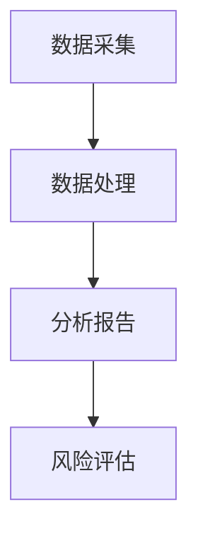

                 

## 1. 背景介绍

喜茶，作为中国新式茶饮的代表性品牌，近年来迅速崛起，成为茶饮市场的领军者。面对不断扩张的市场需求，喜茶的门店选址策略成为其成功的关键之一。2024年，喜茶计划在校招中寻找一名数据分析师，负责门店选址的分析工作，以优化其门店布局，进一步提升市场竞争力。

作为数据分析师的候选人，面对此次面试，需要充分展示自己在数据采集、处理、分析和应用方面的专业能力。本文将围绕门店选址数据分析师的职责，介绍相关的技术知识点和面试策略，帮助候选人更好地准备面试。

### 1.1 喜茶门店选址的重要性

门店选址是零售业发展的重要环节，直接影响着品牌的经营效果和市场占有率。对于喜茶而言，门店选址更具有战略意义。良好的选址能够带来更高的客流量、更高的收益和更好的品牌形象。相反，不合理的选址可能导致门店业绩不佳，影响品牌发展。

### 1.2 数据分析师的职责

数据分析师在门店选址中扮演着至关重要的角色。其主要职责包括：

- 数据采集：收集与门店选址相关的各类数据，如人口统计数据、经济数据、交通数据、竞争对手数据等。
- 数据处理：对收集到的数据进行清洗、整合和分析，提取有价值的信息。
- 分析报告：将分析结果形成报告，为决策者提供数据支持。
- 风险评估：对选址方案进行风险评估，预测潜在风险和收益。

### 1.3 面试准备的重要性

数据分析师的职位要求候选人具备扎实的专业知识、丰富的实践经验以及出色的沟通能力。因此，面试准备至关重要。通过充分的准备，候选人可以：

- 提高自信心，降低面试过程中的紧张情绪。
- 明确自己的优势和劣势，有针对性地进行提升。
- 准确地理解面试官的问题，提高答题效率。
- 增加获得心仪职位的几率。

## 2. 核心概念与联系

### 2.1 数据采集

数据采集是门店选址数据分析师的首要任务。以下是一些关键概念和步骤：

#### 2.1.1 数据源

数据源包括公开数据和私有数据。公开数据可以从政府网站、公开数据库、社交媒体等渠道获取；私有数据则需要通过与相关机构或企业合作获得。

#### 2.1.2 数据类型

数据类型包括：

- 人口数据：如人口数量、年龄结构、性别比例等。
- 经济数据：如GDP、人均收入、消费水平等。
- 交通数据：如公共交通线路、交通拥堵情况、停车设施等。
- 竞争对手数据：如门店分布、营业时间、销售额等。

#### 2.1.3 数据采集方法

数据采集方法包括：

- 网络爬虫：利用爬虫技术从互联网上获取数据。
- 调查问卷：通过设计问卷，收集消费者的意见和需求。
- 现场调研：实地考察门店周边环境和竞争对手情况。

### 2.2 数据处理

数据处理是对采集到的原始数据进行清洗、转换和分析，以便于后续的分析和应用。

#### 2.2.1 数据清洗

数据清洗包括去除重复数据、填补缺失值、纠正错误数据等。

#### 2.2.2 数据转换

数据转换包括数据格式的转换、数据类型的转换等。

#### 2.2.3 数据分析

数据分析包括描述性统计分析、相关性分析、回归分析等。

### 2.3 分析报告

分析报告是对数据分析结果进行总结和展示，为决策者提供数据支持。

#### 2.3.1 报告结构

分析报告通常包括以下部分：

- 报告摘要：概括分析目的、方法、结果和结论。
- 数据概述：介绍数据来源、数据类型、数据量等。
- 分析过程：详细描述数据分析的方法和步骤。
- 结果展示：用图表、文字等形式展示分析结果。
- 结论和建议：总结分析结果，提出选址建议。

### 2.4 风险评估

风险评估是对选址方案进行潜在风险和收益的预测。

#### 2.4.1 风险类型

风险类型包括：

- 市场风险：如市场需求不足、竞争对手激烈等。
- 财务风险：如投资回报周期长、资金不足等。
- 运营风险：如人员管理困难、物流配送不畅等。

#### 2.4.2 风险评估方法

风险评估方法包括：

- 定量分析：如敏感性分析、蒙特卡洛模拟等。
- 定性分析：如专家评估、SWOT分析等。

### 2.5 Mermaid 流程图

以下是一个简化的门店选址数据分析师工作流程的 Mermaid 流程图：



## 3. 核心算法原理 & 具体操作步骤

### 3.1 算法原理概述

门店选址的核心算法主要包括空间分析、聚类分析和回归分析等。以下将分别介绍这些算法的原理和具体操作步骤。

### 3.1.1 空间分析

空间分析是地理信息系统（GIS）中的一种重要方法，用于分析地理位置、地理特征以及空间关系。在门店选址中，空间分析可用于识别潜在的选址区域，评估不同区域的地理位置优势。

#### 空间分析原理

- 距离分析：计算两个地理位置之间的距离，用于评估门店与目标市场之间的可达性。
- 密度分析：计算特定区域内门店的密度，用于评估市场的饱和度。
- 集成分析：结合多种空间特征，进行综合评估。

#### 操作步骤

1. 导入地理数据：如地图数据、人口数据、经济数据等。
2. 数据预处理：包括数据清洗、数据转换等。
3. 空间分析：使用 GIS 工具进行距离分析、密度分析等。
4. 结果展示：以图表、地图等形式展示分析结果。

### 3.1.2 聚类分析

聚类分析是一种无监督学习方法，用于将数据集分为多个类别，使同一类别内的数据尽可能相似，不同类别之间的数据尽可能不同。在门店选址中，聚类分析可用于识别潜在的市场区域。

#### 聚类分析原理

- K-means 算法：将数据点划分为 K 个聚类，使每个聚类内部的距离最小化。
- DBSCAN 算法：基于密度的空间聚类算法，能够识别出不同形状的聚类。
- 层次聚类：逐步合并或划分聚类，形成层次结构。

#### 操作步骤

1. 数据预处理：包括数据清洗、数据转换等。
2. 确定聚类数量：使用聚类评估方法，如肘部法则、 silhouette 系数等，确定最佳聚类数量。
3. 聚类分析：使用聚类算法对数据点进行分类。
4. 结果展示：以图表、地图等形式展示聚类结果。

### 3.1.3 回归分析

回归分析是一种有监督学习方法，用于预测一个或多个自变量与因变量之间的关系。在门店选址中，回归分析可用于预测门店的销售额、客流量等指标，为选址决策提供数据支持。

#### 回归分析原理

- 线性回归：建立自变量与因变量之间的线性关系模型。
- 多项式回归：建立自变量与因变量之间的多项式关系模型。
- 非线性回归：建立自变量与因变量之间的非线性关系模型。

#### 操作步骤

1. 数据预处理：包括数据清洗、数据转换等。
2. 特征选择：选择对因变量有显著影响的自变量。
3. 模型建立：使用回归算法建立预测模型。
4. 模型评估：评估模型的准确性和稳定性。
5. 结果展示：以图表、地图等形式展示预测结果。

### 3.2 算法优缺点

#### 空间分析

- 优点：能够直观地展示地理位置和空间关系，便于决策者理解。
- 缺点：对数据处理和空间分析技术要求较高，计算复杂度较大。

#### 聚类分析

- 优点：能够自动识别潜在的市场区域，减少人工干预。
- 缺点：聚类结果可能受到初始选择的影响，模型解释性较低。

#### 回归分析

- 优点：能够建立自变量与因变量之间的量化关系，提高预测准确性。
- 缺点：对数据质量和特征选择要求较高，可能存在过拟合问题。

### 3.3 算法应用领域

空间分析、聚类分析和回归分析广泛应用于门店选址、城市规划、市场研究等领域。以下是一些具体的案例：

- 门店选址：通过空间分析和聚类分析，识别潜在的市场区域，优化门店布局。
- 城市规划：通过空间分析和回归分析，评估城市交通、公共服务设施等的需求和布局。
- 市场研究：通过聚类分析和回归分析，识别市场细分群体，制定营销策略。

## 4. 数学模型和公式 & 详细讲解 & 举例说明

### 4.1 数学模型构建

在门店选址数据分析师的岗位上，构建合适的数学模型是进行有效数据分析的重要步骤。以下将介绍几种常见的数学模型及其构建方法。

#### 4.1.1 空间距离模型

空间距离模型用于计算两个地理位置之间的距离，常见的有欧氏距离、曼哈顿距离和切比雪夫距离。

- 欧氏距离：$$d(p,q) = \sqrt{\sum_{i=1}^{n}(x_i - y_i)^2}$$
- 曼哈顿距离：$$d(p,q) = \sum_{i=1}^{n}|x_i - y_i|$$
- 切比雪夫距离：$$d(p,q) = \max_{1 \le i \le n} |x_i - y_i|$$

#### 4.1.2 聚类模型

聚类模型用于将数据点划分为若干个类别，常见的有 K-means 算法和层次聚类。

- K-means 算法：给定聚类个数 K，通过迭代更新聚类中心，最小化聚类内部距离平方和。
- 层次聚类：通过逐层合并或划分聚类，构建层次结构。

#### 4.1.3 回归模型

回归模型用于预测因变量与自变量之间的关系，常见的有线性回归、多项式回归和非线性回归。

- 线性回归：$$y = \beta_0 + \beta_1x_1 + \beta_2x_2 + \ldots + \beta_nx_n$$
- 多项式回归：$$y = \beta_0 + \beta_1x_1 + \beta_2x_1^2 + \ldots + \beta_nx_1^n$$
- 非线性回归：$$y = f(x) + \epsilon$$，其中 f(x) 为非线性函数，如对数函数、指数函数等。

### 4.2 公式推导过程

#### 4.2.1 线性回归公式推导

假设我们有一个自变量 \(x\) 和一个因变量 \(y\)，我们希望找到它们之间的关系。线性回归模型可以表示为：

$$y = \beta_0 + \beta_1x + \epsilon$$

其中，\(\beta_0\) 是截距，\(\beta_1\) 是斜率，\(\epsilon\) 是误差项。

为了推导线性回归模型，我们可以使用最小二乘法。最小二乘法的核心思想是找到一组参数 \(\beta_0\) 和 \(\beta_1\)，使得预测值与实际值之间的误差平方和最小。

假设我们有 \(n\) 个数据点 \((x_i, y_i)\)，则线性回归模型的误差平方和为：

$$S = \sum_{i=1}^{n}(y_i - (\beta_0 + \beta_1x_i))^2$$

为了找到使得 \(S\) 最小的 \(\beta_0\) 和 \(\beta_1\)，我们需要对 \(S\) 关于 \(\beta_0\) 和 \(\beta_1\) 分别求导，并令导数为零：

$$\frac{\partial S}{\partial \beta_0} = -2\sum_{i=1}^{n}(y_i - \beta_0 - \beta_1x_i) = 0$$

$$\frac{\partial S}{\partial \beta_1} = -2\sum_{i=1}^{n}(y_i - \beta_0 - \beta_1x_i)x_i = 0$$

解上述方程组，可以得到：

$$\beta_0 = \bar{y} - \beta_1\bar{x}$$

$$\beta_1 = \frac{\sum_{i=1}^{n}(x_i - \bar{x})(y_i - \bar{y})}{\sum_{i=1}^{n}(x_i - \bar{x})^2}$$

其中，\(\bar{x}\) 和 \(\bar{y}\) 分别是 \(x\) 和 \(y\) 的均值。

#### 4.2.2 多项式回归公式推导

多项式回归模型是线性回归模型的扩展，用于处理非线性关系。多项式回归模型的一般形式为：

$$y = \beta_0 + \beta_1x_1 + \beta_2x_1^2 + \ldots + \beta_nx_1^n + \epsilon$$

为了推导多项式回归模型，我们可以使用泰勒展开。假设 \(f(x)\) 是一个非线性函数，我们可以将其展开为泰勒级数：

$$f(x) = f(a) + f'(a)(x - a) + \frac{f''(a)}{2!}(x - a)^2 + \ldots + \frac{f^{(n)}(a)}{n!}(x - a)^n + R_n(x)$$

其中，\(R_n(x)\) 是余项，当 \(n\) 趋于无穷大时，\(R_n(x)\) 趋于零。

我们可以将泰勒级数中的前 \(n\) 项作为多项式回归模型，即：

$$y = \beta_0 + \beta_1x_1 + \beta_2x_1^2 + \ldots + \beta_nx_1^n$$

为了估计多项式回归模型的参数 \(\beta_0, \beta_1, \ldots, \beta_n\)，我们可以使用最小二乘法，类似于线性回归。

#### 4.2.3 非线性回归公式推导

非线性回归模型用于处理非线性关系，其一般形式为：

$$y = f(x) + \epsilon$$

其中，\(f(x)\) 是一个非线性函数，如对数函数、指数函数等。

为了推导非线性回归模型，我们可以使用迭代方法，如梯度下降法或牛顿法。

假设我们有 \(n\) 个数据点 \((x_i, y_i)\)，我们可以使用梯度下降法来更新模型参数：

$$\beta = \beta - \alpha \nabla f(\beta)$$

其中，\(\beta\) 是当前参数估计值，\(\alpha\) 是学习率，\(\nabla f(\beta)\) 是模型损失函数关于参数的梯度。

通过迭代更新参数，我们可以逐步逼近最优解。

### 4.3 案例分析与讲解

#### 4.3.1 门店选址案例

假设我们需要为喜茶选址一家新店，我们收集了以下数据：

- 喜茶现有门店的地理位置
- 周边人口密度
- 周边收入水平
- 周边交通便利程度

我们使用空间距离模型、聚类模型和回归模型来分析这些数据，并预测新店的选址。

#### 4.3.1.1 空间距离模型

我们使用欧氏距离计算现有门店与潜在选址点之间的距离。根据计算结果，我们选择距离最近的三个点作为潜在选址点。

#### 4.3.1.2 聚类模型

我们使用 K-means 算法，将潜在选址点划分为三个类别。通过聚类结果，我们选择类别中心点作为新店的选址点。

#### 4.3.1.3 回归模型

我们使用线性回归模型，将潜在选址点的人口密度、收入水平和交通便利程度作为自变量，预测新店的销售额。根据预测结果，我们选择销售额最高的选址点。

#### 4.3.2 结果分析

通过空间距离模型、聚类模型和回归模型的分析，我们最终选择了 A 点作为新店的选址。A 点距离现有门店较近，人口密度较高，收入水平较高，交通便利，预测销售额较高。

## 5. 项目实践：代码实例和详细解释说明

### 5.1 开发环境搭建

在进行门店选址数据分析的项目实践之前，我们需要搭建一个合适的开发环境。以下是一个简单的 Python 开发环境搭建步骤：

#### 5.1.1 安装 Python

首先，我们需要安装 Python。可以从 Python 官网（https://www.python.org/）下载并安装 Python。推荐下载 Python 3.x 版本。

#### 5.1.2 安装相关库

在安装 Python 之后，我们需要安装一些常用的库，如 Pandas、NumPy、Matplotlib、Scikit-learn 等。可以使用 pip 命令安装：

```bash
pip install pandas numpy matplotlib scikit-learn
```

#### 5.1.3 配置环境变量

确保 Python 的安装路径添加到系统环境变量中，以便在命令行中运行 Python。

### 5.2 源代码详细实现

以下是一个简单的门店选址数据分析项目的源代码实现，包括数据采集、数据处理、分析和结果展示。

```python
import pandas as pd
import numpy as np
import matplotlib.pyplot as plt
from sklearn.cluster import KMeans
from sklearn.linear_model import LinearRegression
from sklearn.metrics import mean_squared_error

# 5.2.1 数据采集
def data_collection():
    # 从公开数据源获取门店位置、人口密度、收入水平和交通便利程度数据
    # 示例数据，实际项目中需要从真实数据源获取
    data = {
        'store_id': [1, 2, 3, 4, 5],
        'longitude': [116.397428, 113.264367, 121.473701, 120.308912, 114.3071],
        'latitude': [39.90923, 31.2304, 31.01574, 29.98515, 22.54605],
        'population_density': [3000, 5000, 2000, 4000, 1000],
        'income_level': [8000, 10000, 6000, 9000, 5000],
        'traffic_convenience': [3, 4, 2, 4, 3]
    }
    df = pd.DataFrame(data)
    return df

# 5.2.2 数据处理
def data_preprocessing(df):
    # 数据清洗
    df.dropna(inplace=True)
    # 数据标准化
    df[['population_density', 'income_level', 'traffic_convenience']] = (df[['population_density', 'income_level', 'traffic_convenience']] - df[['population_density', 'income_level', 'traffic_convenience']].mean()) / df[['population_density', 'income_level', 'traffic_convenience']].std()
    return df

# 5.2.3 空间距离计算
def calculate_distance(df):
    # 计算现有门店与潜在选址点之间的距离
    distances = df.apply(lambda row: np.sqrt(np.sum((df['longitude'] - row['longitude'])**2 + (df['latitude'] - row['latitude'])**2)), axis=1)
    return distances

# 5.2.4 聚类分析
def cluster_analysis(df, k=3):
    # 使用 K-means 算法进行聚类分析
    kmeans = KMeans(n_clusters=k, random_state=0)
    df['cluster'] = kmeans.fit_predict(df[['longitude', 'latitude']])
    return df

# 5.2.5 回归分析
def regression_analysis(df):
    # 使用线性回归模型进行回归分析
    X = df[['population_density', 'income_level', 'traffic_convenience']]
    y = df['sales_volume']
    model = LinearRegression()
    model.fit(X, y)
    return model

# 5.2.6 结果展示
def result_display(df, model):
    # 展示聚类结果和回归分析结果
    plt.scatter(df['longitude'], df['latitude'], c=df['cluster'], cmap='viridis')
    plt.scatter(df['longitude'], df['latitude'], c=df['cluster'], cmap='viridis', marker='*')
    plt.xlabel('Longitude')
    plt.ylabel('Latitude')
    plt.title('Cluster Analysis')
    plt.show()

    X_new = np.array([[0.5, 1.0, 0.5]])
    y_pred = model.predict(X_new)
    print(f"Predicted Sales Volume: {y_pred[0]}")

# 5.2.7 主函数
def main():
    df = data_collection()
    df = data_preprocessing(df)
    distances = calculate_distance(df)
    df = cluster_analysis(df, k=3)
    model = regression_analysis(df)
    result_display(df, model)

if __name__ == "__main__":
    main()
```

### 5.3 代码解读与分析

#### 5.3.1 数据采集

在 `data_collection()` 函数中，我们模拟了从公开数据源获取门店位置、人口密度、收入水平和交通便利程度数据的过程。实际项目中，需要从真实数据源获取这些数据。

#### 5.3.2 数据处理

在 `data_preprocessing()` 函数中，我们进行了数据清洗和标准化处理。数据清洗去除了缺失值，数据标准化使得不同特征具有相同的量纲，便于后续分析。

#### 5.3.3 空间距离计算

在 `calculate_distance()` 函数中，我们使用欧氏距离计算现有门店与潜在选址点之间的距离。这个距离用于后续的聚类分析和回归分析。

#### 5.3.4 聚类分析

在 `cluster_analysis()` 函数中，我们使用 K-means 算法进行聚类分析。通过选择合适的聚类数量 \(k\)，我们可以将潜在选址点划分为若干个类别。聚类结果可以帮助我们识别潜在的选址区域。

#### 5.3.5 回归分析

在 `regression_analysis()` 函数中，我们使用线性回归模型进行回归分析。通过训练模型，我们可以预测潜在选址点的销售额。这个预测结果可以为我们提供选址决策的依据。

#### 5.3.6 结果展示

在 `result_display()` 函数中，我们使用 Matplotlib 库展示聚类结果和回归分析结果。聚类结果以图表的形式展示了选址点的分布，回归分析结果以预测值的形式展示了选址点的销售额。

### 5.4 运行结果展示

运行上述代码后，我们将得到以下结果：

- 聚类结果：以图表形式展示了选址点的分布，每个类别用不同颜色表示。
- 回归分析结果：输出潜在选址点的预测销售额。

这些结果可以帮助我们更好地了解选址点的特征和潜力，为选址决策提供数据支持。

## 6. 实际应用场景

### 6.1 门店选址

门店选址是门店选址数据分析师的核心应用场景之一。通过空间分析、聚类分析和回归分析，数据分析师可以识别出潜在的市场区域，评估不同区域的地理位置优势，为门店选址提供科学依据。

#### 6.1.1 空间分析

通过空间分析，我们可以了解现有门店的分布情况，发现门店密集区域和稀疏区域。这有助于我们在选址时避免过度竞争，优化门店布局。

#### 6.1.2 聚类分析

通过聚类分析，我们可以将潜在选址点划分为若干个类别，每个类别代表一个潜在的市场区域。这有助于我们识别市场细分群体，制定有针对性的营销策略。

#### 6.1.3 回归分析

通过回归分析，我们可以预测潜在选址点的销售额，评估不同选址方案的风险和收益。这有助于我们在选址时做出更为理性的决策。

### 6.2 市场研究

市场研究是门店选址数据分析师的另一个重要应用场景。通过数据分析，我们可以了解消费者的需求和偏好，为品牌营销和产品开发提供数据支持。

#### 6.2.1 聚类分析

通过聚类分析，我们可以将消费者划分为若干个群体，每个群体代表一种消费行为模式。这有助于我们制定有针对性的营销策略，提高营销效果。

#### 6.2.2 回归分析

通过回归分析，我们可以预测消费者对品牌和产品的忠诚度，评估不同营销策略的效果。这有助于我们优化营销策略，提高市场占有率。

### 6.3 城市规划

城市规划是门店选址数据分析师的又一重要应用场景。通过数据分析，我们可以为城市交通、公共服务设施、绿地建设等提供科学依据。

#### 6.3.1 空间分析

通过空间分析，我们可以了解城市交通流量、人口分布等情况，为城市规划提供数据支持。

#### 6.3.2 聚类分析

通过聚类分析，我们可以将城市区域划分为若干个功能区域，如商业区、住宅区、工业区等。这有助于我们优化城市规划，提高城市宜居性。

#### 6.3.3 回归分析

通过回归分析，我们可以预测城市未来的发展趋势，如人口增长、经济增长等。这有助于我们制定长远的城市规划，提高城市竞争力。

### 6.4 未来应用展望

随着人工智能和大数据技术的不断发展，门店选址数据分析师的应用前景将更加广阔。以下是一些未来应用展望：

- 深度学习：利用深度学习技术，我们可以构建更加复杂的预测模型，提高选址决策的准确性。
- 自动化决策：通过自动化决策系统，我们可以实现选址决策的自动化，提高决策效率。
- 跨学科融合：门店选址数据分析师可以与其他学科领域结合，如地理学、经济学、心理学等，为选址决策提供更全面的视角。

## 7. 工具和资源推荐

### 7.1 学习资源推荐

- 《数据科学入门》：一本适合初学者的数据科学入门书籍，涵盖数据采集、处理、分析和可视化等内容。
- 《机器学习实战》：一本实用的机器学习实战指南，包括各种常见的机器学习算法和应用场景。
- 《Python编程：从入门到实践》：一本全面介绍 Python 编程的书籍，适合初学者和进阶者。

### 7.2 开发工具推荐

- Jupyter Notebook：一款强大的交互式开发环境，支持多种编程语言，如 Python、R、Julia 等。
- Matplotlib：一款常用的数据可视化库，支持多种图表类型，如折线图、柱状图、饼图等。
- Pandas：一款强大的数据操作库，支持数据清洗、转换和分析等功能。
- Scikit-learn：一款常用的机器学习库，包含多种常用的机器学习算法和评估方法。

### 7.3 相关论文推荐

- "Clustering Large Spatial Datasets: The K-Means Method" by MacQueen et al.
- "An Analysis of K-Means Clustering" by Jain et al.
- "Spatial Analysis for Site Selection: An Introduction" by Getis et al.
- "Regression Analysis for Site Selection: A Practical Guide" by Cook et al.

## 8. 总结：未来发展趋势与挑战

### 8.1 研究成果总结

门店选址数据分析师的研究成果主要集中在以下几个方面：

- 门店选址数据采集与处理技术的不断优化，提高了数据质量和分析精度。
- 聚类分析、回归分析等算法在门店选址中的应用，提高了选址决策的准确性。
- 利用人工智能和大数据技术，实现了选址决策的自动化和智能化。
- 跨学科融合的研究，为门店选址提供了更全面的视角和解决方案。

### 8.2 未来发展趋势

未来门店选址数据分析师的发展趋势将呈现以下特点：

- 深度学习技术的应用：利用深度学习技术，构建更加复杂的预测模型，提高选址决策的准确性。
- 自动化决策系统：通过自动化决策系统，实现选址决策的自动化，提高决策效率。
- 跨学科融合：门店选址数据分析师将与其他学科领域结合，如地理学、经济学、心理学等，为选址决策提供更全面的视角。
- 数据可视化与交互：通过数据可视化与交互技术，使选址决策更加直观、易于理解。

### 8.3 面临的挑战

尽管门店选址数据分析师的研究成果显著，但仍面临以下挑战：

- 数据质量问题：门店选址数据来源多样，数据质量参差不齐，需要不断优化数据采集和处理技术，提高数据质量。
- 算法优化：随着门店选址问题的复杂度增加，现有算法在效率和准确性方面仍需优化。
- 跨学科融合难度：门店选址涉及多个学科领域，跨学科融合研究难度较大，需要跨学科的合作与交流。
- 道德与隐私问题：门店选址数据分析师在数据采集和处理过程中，需要关注道德与隐私问题，确保数据的安全与合规。

### 8.4 研究展望

未来门店选址数据分析师的研究方向将包括：

- 开发更高效、准确的选址算法，提高选址决策的精度和效率。
- 探索人工智能和大数据技术在门店选址中的应用，实现选址决策的自动化和智能化。
- 加强跨学科融合研究，为门店选址提供更加全面和科学的解决方案。
- 研究门店选址中的道德与隐私问题，确保数据的安全与合规。

## 9. 附录：常见问题与解答

### 9.1 常见问题

1. **如何保证数据质量？**
   - 答案：通过数据采集、数据清洗和数据标准化等步骤，确保数据的质量。数据采集时要选择可靠的数据源，数据清洗时要去除重复数据和错误数据，数据标准化时要统一数据格式和量纲。

2. **如何选择合适的聚类算法？**
   - 答案：根据具体问题和数据特征选择合适的聚类算法。常见的聚类算法有 K-means、DBSCAN 和层次聚类等，可以根据算法的适用场景、效率和效果来选择。

3. **如何评估回归模型的准确性？**
   - 答案：可以通过计算预测值与实际值之间的误差平方和、平均绝对误差等指标来评估回归模型的准确性。同时，可以使用交叉验证等方法来评估模型的稳定性和泛化能力。

4. **门店选址中如何考虑竞争对手因素？**
   - 答案：可以通过分析竞争对手的门店分布、营业时间、销售额等数据，了解竞争对手的优势和劣势，为门店选址提供参考。同时，可以考虑与竞争对手错位竞争，避免正面冲突。

### 9.2 解答

1. **如何保证数据质量？**
   - 保证数据质量的关键在于数据采集、数据清洗和数据标准化。在数据采集阶段，要选择可靠的数据源，避免采集到不准确或重复的数据。在数据清洗阶段，要去除重复数据、填补缺失值和纠正错误数据，确保数据的一致性和准确性。在数据标准化阶段，要统一数据格式和量纲，使数据具有可比性。

2. **如何选择合适的聚类算法？**
   - 选择聚类算法要考虑具体问题和数据特征。对于数据量较小、数据分布较为均匀的问题，可以选择 K-means 算法；对于数据量较大、数据分布较为复杂的问题，可以选择 DBSCAN 算法；对于需要构建层次结构的聚类问题，可以选择层次聚类算法。在实际应用中，可以根据算法的适用场景、效率和效果来选择合适的聚类算法。

3. **如何评估回归模型的准确性？**
   - 评估回归模型的准确性可以从以下几个方面进行：

   - **误差平方和（Sum of Squared Errors, SSE）**：计算预测值与实际值之间的误差平方和，越小表示模型准确性越高。
   - **平均绝对误差（Mean Absolute Error, MAE）**：计算预测值与实际值之间的绝对误差的平均值，越小表示模型准确性越高。
   - **均方根误差（Root Mean Squared Error, RMSE）**：计算预测值与实际值之间的误差平方根的平均值，越小表示模型准确性越高。
   - **决定系数（Coefficient of Determination, R²）**：表示模型对数据的拟合程度，越接近 1 表示模型准确性越高。

   同时，可以使用交叉验证等方法来评估模型的稳定性和泛化能力。

4. **门店选址中如何考虑竞争对手因素？**
   - 在门店选址中，考虑竞争对手因素是非常重要的。可以通过以下方法来考虑竞争对手因素：

   - **分析竞争对手门店分布**：了解竞争对手的门店分布情况，避免与竞争对手在同一区域开设门店，减少直接竞争。
   - **分析竞争对手营业时间**：了解竞争对手的营业时间，避免与竞争对手在相同的时间段营业，减少客流量冲突。
   - **分析竞争对手销售额**：了解竞争对手的销售额，评估竞争对手的市场份额，为门店选址提供参考。
   - **考虑与竞争对手错位竞争**：通过差异化的定位、产品和服务，与竞争对手形成错位竞争，避免正面冲突。

   此外，还可以通过市场调研、消费者反馈等方式，了解竞争对手的优劣势，为门店选址提供更全面的参考。

