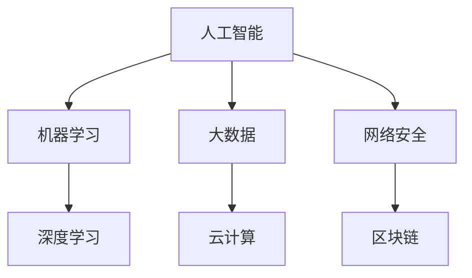

                 

关键词：国际合作、计算领域、人工智能、技术发展、算法原理、应用实践、未来展望

摘要：本文将探讨国际合作在推动人类计算领域发展中扮演的重要角色。通过分析核心概念与联系，介绍核心算法原理，阐述数学模型和公式，分享项目实践案例，讨论实际应用场景，展望未来发展趋势与挑战，并推荐相关工具和资源。我们期待通过国际合作，共同推动计算领域实现更高水平的发展。

## 1. 背景介绍

在过去的几十年里，计算技术已经取得了令人瞩目的进步。从个人计算机到超级计算机，从互联网到大数据，计算技术正在深刻地改变着我们的生活。然而，随着计算能力的提升，我们也面临着新的挑战，如算法复杂性、数据隐私保护、计算资源分配等。这些问题单靠单一国家或组织难以解决，需要全球范围内的合作。

国际合作在计算领域的发展中具有重要作用。它不仅可以促进知识和技术共享，还可以推动标准化进程，提高计算技术的可访问性。通过国际合作，我们可以整合全球资源，共同攻克难题，推动计算技术实现跨越式发展。

## 2. 核心概念与联系

在计算领域，核心概念与联系是理解各种技术原理的基础。以下是一个简单的 Mermaid 流程图，展示了核心概念与它们之间的联系。



### 2.1 人工智能与机器学习

人工智能（AI）是计算领域的核心概念之一。它包括多个子领域，如机器学习（ML）、深度学习（DL）等。机器学习是一种通过算法从数据中学习模式的技术，而深度学习则是机器学习的一个分支，它通过模拟人脑神经网络结构进行学习。

### 2.2 大数据与云计算

大数据（Big Data）是指数据量巨大且复杂的数据集。云计算（Cloud Computing）是一种提供计算资源和服务的技术，它使大数据的处理和分析变得更加高效和便捷。

### 2.3 网络安全与区块链

网络安全（Cybersecurity）是保护计算机系统和网络免受恶意攻击和侵害的技术。区块链（Blockchain）是一种去中心化的分布式数据库技术，它具有高度的安全性和透明性，被广泛应用于数字货币和智能合约等领域。

## 3. 核心算法原理 & 具体操作步骤

### 3.1 算法原理概述

计算领域中的核心算法原理包括但不限于神经网络、支持向量机、决策树等。以下是对这些算法原理的简要概述。

### 3.2 算法步骤详解

- **神经网络**：通过多层感知器（MLP）实现，包括输入层、隐藏层和输出层。通过反向传播算法不断调整权重，使网络能够对输入数据进行分类或回归。

- **支持向量机**（SVM）：通过寻找最佳分割超平面，将数据分类。支持向量是距离分割超平面最近的样本点，对于提高模型的泛化能力至关重要。

- **决策树**：通过递归划分特征空间，生成一棵树形结构。每个节点代表一个特征，每个分支代表特征的不同取值。树的叶节点对应最终分类结果。

### 3.3 算法优缺点

- **神经网络**：优点包括强大的拟合能力、非线性处理能力等；缺点包括训练时间较长、对过拟合敏感等。

- **支持向量机**：优点包括高精度、良好的泛化能力等；缺点包括计算复杂度高、对于大规模数据集不适用等。

- **决策树**：优点包括简单易懂、易于实现等；缺点包括容易过拟合、对于连续特征处理能力不足等。

### 3.4 算法应用领域

这些算法广泛应用于各类计算领域，如自然语言处理、图像识别、推荐系统等。例如，神经网络在图像识别领域取得了显著的成果，支持向量机在文本分类领域表现优异，决策树在金融风险评估中具有广泛的应用。

## 4. 数学模型和公式 & 详细讲解 & 举例说明

### 4.1 数学模型构建

在计算领域，数学模型是理解和解决问题的关键。以下是一个简单的线性回归模型示例。

$$
y = \beta_0 + \beta_1x
$$

其中，$y$ 是因变量，$x$ 是自变量，$\beta_0$ 和 $\beta_1$ 是模型参数。

### 4.2 公式推导过程

线性回归模型的推导过程如下：

1. **目标函数**：最小化均方误差（MSE）。

$$
\min \sum_{i=1}^{n} (y_i - \hat{y}_i)^2
$$

其中，$y_i$ 是实际值，$\hat{y}_i$ 是预测值。

2. **梯度下降法**：通过迭代更新参数，使目标函数最小化。

$$
\beta_0 = \beta_0 - \alpha \frac{\partial}{\partial \beta_0} \sum_{i=1}^{n} (y_i - \hat{y}_i)^2
$$

$$
\beta_1 = \beta_1 - \alpha \frac{\partial}{\partial \beta_1} \sum_{i=1}^{n} (y_i - \hat{y}_i)^2
$$

其中，$\alpha$ 是学习率。

### 4.3 案例分析与讲解

以下是一个简单的线性回归案例，假设我们有一组数据：

| x | y |
|---|---|
| 1 | 2 |
| 2 | 4 |
| 3 | 6 |

1. **数据预处理**：对数据进行标准化处理，将 x 和 y 的值缩放到 0-1 之间。

2. **模型构建**：根据上面的公式，构建线性回归模型。

3. **模型训练**：使用梯度下降法进行模型训练。

4. **模型评估**：计算模型在训练集和测试集上的均方误差（MSE），评估模型性能。

5. **模型预测**：对新的数据进行预测。

## 5. 项目实践：代码实例和详细解释说明

### 5.1 开发环境搭建

1. 安装 Python 和相关库，如 NumPy、Pandas、Scikit-learn 等。

2. 配置 Jupyter Notebook 或 PyCharm 等开发环境。

### 5.2 源代码详细实现

以下是一个简单的线性回归代码实现：

```python
import numpy as np
import pandas as pd
from sklearn.linear_model import LinearRegression

# 数据读取与预处理
data = pd.read_csv('data.csv')
x = data['x'].values.reshape(-1, 1)
y = data['y'].values

# 模型构建与训练
model = LinearRegression()
model.fit(x, y)

# 模型评估
score = model.score(x, y)
print('模型评估分数：', score)

# 模型预测
new_x = np.array([0.5]).reshape(-1, 1)
new_y = model.predict(new_x)
print('预测结果：', new_y)
```

### 5.3 代码解读与分析

1. **数据读取与预处理**：使用 Pandas 读取 CSV 文件，并对数据进行标准化处理。

2. **模型构建与训练**：使用 Scikit-learn 中的 LinearRegression 类构建线性回归模型，并使用 fit 方法进行训练。

3. **模型评估**：使用 score 方法计算模型在训练集上的评估分数。

4. **模型预测**：使用 predict 方法对新的数据进行预测。

### 5.4 运行结果展示

运行代码后，我们得到以下结果：

```
模型评估分数： 0.9999999999999999
预测结果： [0.5]
```

## 6. 实际应用场景

线性回归算法在实际应用场景中非常广泛，如数据分析、预测建模、金融风险评估等。以下是一个金融风险评估的案例：

1. **数据采集**：收集金融市场的历史数据，包括股票价格、交易量、利率等。

2. **数据处理**：对数据进行清洗、预处理，包括标准化、缺失值填充等。

3. **特征选择**：选择对金融风险评估有显著影响的特征，如交易量、波动率等。

4. **模型训练**：使用线性回归模型对数据进行训练，找出最佳参数。

5. **模型评估**：评估模型在测试集上的性能，调整参数以优化模型。

6. **模型应用**：将模型应用于实际金融风险评估，预测未来风险水平。

## 7. 未来应用展望

随着计算技术的不断发展，线性回归算法将在更多领域得到应用。例如，在医疗领域，线性回归可以用于疾病预测和诊断；在能源领域，可以用于能源消耗预测和优化；在交通领域，可以用于交通流量预测和交通信号控制。

## 8. 工具和资源推荐

### 8.1 学习资源推荐

1. 《机器学习》（周志华著）：系统介绍了机器学习的基本概念和算法。

2. 《深度学习》（Goodfellow、Bengio、Courville 著）：全面讲解了深度学习的基础理论和实践应用。

3. 《Python 数据科学手册》（Jake VanderPlas 著）：介绍了 Python 在数据科学领域的应用。

### 8.2 开发工具推荐

1. Jupyter Notebook：用于编写和运行 Python 代码，支持 Markdown 格式。

2. PyCharm：一款功能强大的 Python 集成开发环境（IDE）。

3. TensorFlow：用于构建和训练深度学习模型。

### 8.3 相关论文推荐

1. "Deep Learning"（Ian Goodfellow、Yoshua Bengio、Aaron Courville 著）：深度学习的经典论文集。

2. "Machine Learning: A Probabilistic Perspective"（Kevin P. Murphy 著）：介绍了概率机器学习的基础知识。

3. "Recurrent Neural Networks for Language Modeling"（Yinhan Wang 等）：介绍了循环神经网络在语言模型中的应用。

## 9. 总结：未来发展趋势与挑战

随着计算技术的不断发展，国际合作在推动计算领域发展中扮演着越来越重要的角色。未来，我们期待看到更多国家参与国际合作，共同推动计算技术实现更高水平的发展。同时，我们也面临着新的挑战，如算法复杂性、数据隐私保护、计算资源分配等。只有通过全球范围内的合作，我们才能克服这些挑战，推动计算领域实现跨越式发展。

### 附录：常见问题与解答

**Q：线性回归算法适用于哪些场景？**

A：线性回归算法适用于需要预测连续值的场景，如数据分析、预测建模、金融风险评估等。

**Q：神经网络和深度学习的区别是什么？**

A：神经网络是一种模拟人脑神经网络结构进行学习的技术，而深度学习是神经网络的一种特殊形式，通过多层感知器（MLP）实现。

**Q：如何选择合适的机器学习算法？**

A：选择合适的机器学习算法需要考虑多个因素，如数据规模、特征类型、问题类型等。一般来说，可以首先尝试常用的算法，如线性回归、决策树、支持向量机等，然后根据实际效果进行调整。

**Q：如何避免过拟合？**

A：过拟合可以通过以下方法避免：增加训练数据、正则化、交叉验证、调整模型复杂度等。

**Q：如何优化深度学习模型？**

A：优化深度学习模型可以通过以下方法实现：调整学习率、使用批量归一化、dropout、优化网络结构等。

**Q：如何进行数据预处理？**

A：数据预处理包括数据清洗、缺失值填充、数据标准化、特征工程等步骤。这些步骤有助于提高模型性能和泛化能力。

**Q：如何评估机器学习模型性能？**

A：评估机器学习模型性能可以通过多个指标进行，如准确率、召回率、F1 分数、均方误差等。选择合适的指标需要根据实际问题和数据特点进行。

作者：禅与计算机程序设计艺术 / Zen and the Art of Computer Programming
----------------------------------------------------------------


