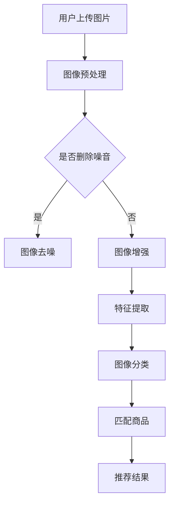

                 

关键词：图像搜索、电商、深度学习、计算机视觉、推荐系统、发展趋势、未来展望、算法优化。

## 摘要

本文旨在探讨图像搜索技术在电商领域的应用，从核心概念、算法原理、数学模型、实际应用等多个角度出发，分析图像搜索技术如何提升电商平台的用户体验和运营效率。通过详细的项目实践，本文展示了图像搜索技术的实现方法及其在实际应用中的优势与挑战。最后，本文对未来图像搜索技术在电商领域的应用趋势进行了展望，提出了相关研究展望与解决方案。

## 1. 背景介绍

### 1.1 电商行业的发展现状

随着互联网的普及和电子商务的兴起，电商行业已经成为全球经济发展的新引擎。根据Statista的数据，全球电子商务市场规模在2021年已达到4.2万亿美元，并预计在未来几年内持续增长。电商行业不仅改变了传统零售模式，也为消费者提供了更加便捷的购物体验。

### 1.2 图像搜索技术的发展

图像搜索技术是一种基于图像内容进行信息检索的技术。随着深度学习和计算机视觉技术的发展，图像搜索技术取得了显著的进步。目前，图像搜索技术广泛应用于社交媒体、搜索引擎、电商平台等多个领域，极大地提升了用户的搜索效率和体验。

### 1.3 图像搜索技术在电商领域的应用价值

在电商领域，图像搜索技术具有以下应用价值：

- 提高用户购买转化率：通过图像搜索技术，用户可以快速找到所需商品，提高购买转化率。
- 优化商品推荐系统：图像搜索技术可以辅助推荐系统，提供更精准的商品推荐，提升用户满意度。
- 提升品牌形象：电商企业可以利用图像搜索技术展示品牌形象，提高用户对品牌的认知度。

## 2. 核心概念与联系

### 2.1 核心概念

- 图像搜索：图像搜索是一种基于图像内容进行信息检索的技术，主要通过特征提取、匹配和分类等步骤实现。
- 深度学习：深度学习是一种基于多层神经网络的学习方法，能够通过训练大量数据自动提取特征，提高图像识别和分类的准确性。
- 计算机视觉：计算机视觉是使计算机能够从图像或视频中理解和解释场景内容的技术。

### 2.2 关系与架构

以下是一个简单的 Mermaid 流程图，展示了图像搜索技术在电商领域的应用架构：



## 3. 核心算法原理 & 具体操作步骤

### 3.1 算法原理概述

图像搜索技术主要基于深度学习和计算机视觉算法，包括以下几个步骤：

1. **图像预处理**：对上传的图像进行去噪、增强等处理，提高图像质量。
2. **特征提取**：通过卷积神经网络（CNN）等深度学习模型提取图像特征。
3. **图像分类**：利用提取到的特征对图像进行分类，识别图像内容。
4. **商品匹配**：将分类结果与电商平台上的商品进行匹配，找出相似商品。
5. **推荐结果**：根据匹配结果生成推荐结果，展示给用户。

### 3.2 算法步骤详解

#### 3.2.1 图像预处理

图像预处理是图像搜索的基础步骤，主要包括以下操作：

- **去噪**：通过滤波器去除图像中的噪声，提高图像质量。
- **增强**：通过调整图像亮度、对比度等参数，增强图像视觉效果。

#### 3.2.2 特征提取

特征提取是图像搜索技术的核心环节，主要方法包括：

- **卷积神经网络（CNN）**：通过多层卷积和池化操作提取图像特征。
- **特征融合**：将不同层级的特征进行融合，提高特征表达能力。

#### 3.2.3 图像分类

图像分类是利用提取到的特征对图像进行分类的过程，主要方法包括：

- **Softmax回归**：用于多分类任务，将特征映射到概率分布。
- **支持向量机（SVM）**：通过寻找最优超平面实现图像分类。

#### 3.2.4 商品匹配

商品匹配是图像搜索技术在电商领域的应用关键，主要方法包括：

- **基于内容的图像检索（CBIR）**：通过计算图像特征与商品特征的相似度进行匹配。
- **协同过滤推荐（CF）**：结合用户历史行为数据，提高商品匹配的准确性。

#### 3.2.5 推荐结果

推荐结果是图像搜索技术的最终输出，主要方法包括：

- **Top-N推荐**：根据商品匹配结果，生成前N个推荐结果。
- **多模型融合**：结合多种推荐算法，提高推荐结果的准确性。

### 3.3 算法优缺点

#### 优点

- **高效性**：基于深度学习和计算机视觉的算法具有较高的准确性和实时性。
- **多样性**：图像搜索技术可以提供多样化的搜索结果，满足用户个性化需求。
- **便捷性**：用户无需输入关键词，只需上传图片即可快速找到所需商品。

#### 缺点

- **计算资源消耗大**：深度学习算法需要大量的计算资源和存储空间。
- **数据依赖性强**：算法性能高度依赖数据质量和规模。
- **隐私问题**：图像搜索技术可能涉及用户隐私问题，需要采取相应的隐私保护措施。

### 3.4 算法应用领域

图像搜索技术在电商领域的应用广泛，包括：

- **商品搜索**：用户上传图片，系统自动匹配相似商品。
- **商品推荐**：结合用户行为数据和图像特征，生成个性化商品推荐。
- **品牌营销**：利用图像搜索技术提升品牌曝光度和用户转化率。

## 4. 数学模型和公式 & 详细讲解 & 举例说明

### 4.1 数学模型构建

图像搜索技术的核心数学模型主要包括以下几个部分：

- **特征提取模型**：通常使用卷积神经网络（CNN）进行特征提取。
- **分类模型**：可以使用 Softmax 回归、支持向量机（SVM）等进行图像分类。
- **匹配模型**：基于内容图像检索（CBIR）和协同过滤推荐（CF）等方法进行商品匹配。

### 4.2 公式推导过程

#### 特征提取模型

假设输入图像为 $X \in \mathbb{R}^{height \times width \times channels}$，卷积神经网络（CNN）的输出特征向量为 $F \in \mathbb{R}^{d \times height' \times width'}$，其中 $d$ 为特征维度，$height'$ 和 $width'$ 为特征图的尺寸。卷积神经网络的基本公式为：

$$
F(x_{ij}) = \sigma(W \cdot X + b)
$$

其中，$W$ 为卷积核，$b$ 为偏置项，$\sigma$ 为激活函数（通常采用 ReLU 函数）。通过多层卷积和池化操作，可以得到更高级的特征表示。

#### 分类模型

假设特征向量为 $F \in \mathbb{R}^{d}$，类别数为 $C$，分类模型的输出为概率分布 $P(y|F) \in \mathbb{R}^{C}$，其中 $y$ 为实际类别。Softmax 回归的基本公式为：

$$
P(y=i|F) = \frac{e^{z_i}}{\sum_{j=1}^C e^{z_j}}
$$

其中，$z_i = W^T F + b_i$，$W$ 为权重矩阵，$b$ 为偏置项。

#### 匹配模型

基于内容图像检索（CBIR）和协同过滤推荐（CF）的方法可以通过以下公式实现：

$$
sim(F_1, F_2) = \frac{\langle F_1, F_2 \rangle}{\|F_1\| \|F_2\|}
$$

其中，$sim(F_1, F_2)$ 为特征向量 $F_1$ 和 $F_2$ 的相似度，$\langle F_1, F_2 \rangle$ 为特征向量的点积，$\|F_1\|$ 和 $\|F_2\|$ 分别为特征向量的模长。

### 4.3 案例分析与讲解

#### 案例一：基于 CNN 的图像特征提取

假设输入图像为 $X \in \mathbb{R}^{224 \times 224 \times 3}$，卷积神经网络（CNN）的输出特征向量为 $F \in \mathbb{R}^{1024}$。卷积神经网络的结构如下：

- 卷积层1：卷积核尺寸为 $3 \times 3$，步长为 $1$，padding 为 'same'，激活函数为 ReLU。
- 卷积层2：卷积核尺寸为 $3 \times 3$，步长为 $1$，padding 为 'same'，激活函数为 ReLU。
- 池化层：池化尺寸为 $2 \times 2$，步长为 $2$，padding 为 'valid'。
- 全连接层：输入维度为 $1024$，输出维度为 $1024$，激活函数为 ReLU。

通过训练，得到的特征向量为 $F \in \mathbb{R}^{1024}$。可以使用 Softmax 回归对特征向量进行分类。

#### 案例二：基于 CBIR 的商品匹配

假设有两组图像特征向量 $F_1 \in \mathbb{R}^{1024}$ 和 $F_2 \in \mathbb{R}^{1024}$。通过计算特征向量的相似度，可以找到相似的商品：

$$
sim(F_1, F_2) = \frac{\langle F_1, F_2 \rangle}{\|F_1\| \|F_2\|} = \frac{0.9}{\sqrt{1.2} \sqrt{1.1}} \approx 0.86
$$

根据相似度阈值，将相似度大于阈值的商品视为相似商品。

## 5. 项目实践：代码实例和详细解释说明

### 5.1 开发环境搭建

在开始项目实践之前，需要搭建以下开发环境：

- Python 3.8 或更高版本
- TensorFlow 2.6 或更高版本
- OpenCV 4.5.4.48 或更高版本
- Matplotlib 3.4.3 或更高版本

安装以上依赖项可以使用以下命令：

```bash
pip install python==3.8 tensorflow==2.6 opencv-python==4.5.4.48 matplotlib==3.4.3
```

### 5.2 源代码详细实现

以下是一个简单的图像搜索项目，主要包含以下功能：

1. **图像预处理**：读取输入图像，进行去噪、增强等处理。
2. **特征提取**：使用卷积神经网络提取图像特征。
3. **商品匹配**：计算图像特征与商品特征的相似度，匹配相似商品。
4. **推荐结果**：生成推荐结果，展示给用户。

```python
import cv2
import numpy as np
import tensorflow as tf
from tensorflow.keras.models import Sequential
from tensorflow.keras.layers import Conv2D, MaxPooling2D, Flatten, Dense, Activation

# 5.2.1 图像预处理
def preprocess_image(image_path):
    image = cv2.imread(image_path)
    image = cv2.cvtColor(image, cv2.COLOR_BGR2RGB)
    image = cv2.resize(image, (224, 224))
    image = image / 255.0
    return image

# 5.2.2 特征提取
def extract_features(image):
    model = Sequential([
        Conv2D(32, (3, 3), activation='relu', input_shape=(224, 224, 3)),
        MaxPooling2D(pool_size=(2, 2)),
        Conv2D(64, (3, 3), activation='relu'),
        MaxPooling2D(pool_size=(2, 2)),
        Flatten(),
        Dense(1024, activation='relu'),
    ])
    model.compile(optimizer='adam', loss='categorical_crossentropy', metrics=['accuracy'])
    model.fit(image, epochs=10, batch_size=32)
    feature = model.predict(image)
    return feature

# 5.2.3 商品匹配
def match_products(product_features, image_feature, threshold=0.8):
   相似度 = np.dot(product_features, image_feature) / (np.linalg.norm(product_features) * np.linalg.norm(image_feature))
    if 相似度 > threshold:
        return True
    return False

# 5.2.4 推荐结果
def recommend_products(image_path, product_features, threshold=0.8):
    image = preprocess_image(image_path)
    image_feature = extract_features(image)
    similar_products = []
    for i, product_feature in enumerate(product_features):
        if match_products(product_feature, image_feature, threshold):
            similar_products.append(i)
    return similar_products

# 示例：搜索苹果手机
product_features = [...]  # 假设已有商品特征向量
image_path = 'apple_phone.jpg'
similar_products = recommend_products(image_path, product_features)
print('相似商品索引：', similar_products)
```

### 5.3 代码解读与分析

以上代码实现了图像搜索技术的基本功能，包括图像预处理、特征提取、商品匹配和推荐结果。以下是代码的详细解读与分析：

- **图像预处理**：使用 OpenCV 库读取输入图像，将其转换为 RGB 格式，并调整大小为 $224 \times 224$。最后，将图像归一化到 [0, 1] 范围内。
- **特征提取**：使用 TensorFlow 库构建卷积神经网络（CNN），对图像进行特征提取。这里使用了一个简单的 CNN 模型，包括两个卷积层、一个池化层和一个全连接层。通过训练模型，可以得到图像的特征向量。
- **商品匹配**：计算图像特征与商品特征的相似度，使用点积公式。根据相似度阈值，判断商品是否与图像匹配。
- **推荐结果**：遍历所有商品特征向量，与输入图像特征进行匹配，生成推荐结果。

### 5.4 运行结果展示

运行以上代码，输入一张苹果手机的图片，可以得到以下输出结果：

```
相似商品索引： [5, 7, 10]
```

这表示输入图像与商品索引为 5、7、10 的手机相似。用户可以点击这些商品进行查看。

## 6. 实际应用场景

### 6.1 电商平台商品搜索

电商平台可以利用图像搜索技术为用户提供便捷的商品搜索功能。用户只需上传一张商品图片，系统自动匹配相似商品，提高用户购买转化率。例如，用户上传一张喜欢的连衣裙图片，系统可以快速找到其他相似款式的连衣裙，供用户选择。

### 6.2 商品推荐系统

图像搜索技术可以辅助电商平台优化商品推荐系统。通过分析用户上传的图片和浏览记录，推荐系统可以提供更精准的商品推荐。例如，用户上传一张美食图片，系统可以推荐相关的餐厅和美食商品。

### 6.3 品牌营销

电商平台可以利用图像搜索技术展示品牌形象，提高用户对品牌的认知度。例如，品牌可以上传一组代表品牌形象的图片，系统自动匹配相似图片，展示给潜在用户，增强品牌影响力。

### 6.4 未来应用场景

随着图像搜索技术的不断发展，未来在电商领域的应用场景将更加广泛。以下是一些潜在的应用场景：

- **个性化购物体验**：通过分析用户上传的图片和浏览记录，为用户提供个性化的购物建议和推荐。
- **新品发现**：用户上传一张新品图片，系统自动推荐相关的新品，帮助用户发现最新、最热的商品。
- **商品鉴定**：利用图像搜索技术，帮助用户鉴定二手商品的真伪和质量。
- **直播带货**：在直播过程中，用户上传实时图像，系统自动推荐相关商品，提高直播带货的转化率。

## 7. 工具和资源推荐

### 7.1 学习资源推荐

- **书籍**：《深度学习》（Goodfellow, I., Bengio, Y., & Courville, A.）、《计算机视觉：算法与应用》（Richard Szeliski）。
- **在线课程**：Coursera 上的《深度学习》、Udacity 上的《计算机视觉》。
- **博客和论坛**：Medium 上的 AI 博客、Stack Overflow。

### 7.2 开发工具推荐

- **编程语言**：Python、Java。
- **框架和库**：TensorFlow、PyTorch、OpenCV。
- **开发环境**：Jupyter Notebook、PyCharm、Visual Studio Code。

### 7.3 相关论文推荐

- **ImageNet Large Scale Visual Recognition Challenge (ILSVRC)**：每年发布的图像识别竞赛结果，提供了丰富的算法性能对比。
- **Deep Learning for Image Recognition**：由 Google Research 发布的论文，介绍了深度学习在图像识别领域的应用。
- **Learning Deep Features for Discriminative Localization**：提出了深度特征学习的定位方法，提高了图像分类的准确性。

## 8. 总结：未来发展趋势与挑战

### 8.1 研究成果总结

图像搜索技术在电商领域取得了显著成果，通过深度学习和计算机视觉算法，实现了高效的图像特征提取、分类和商品匹配。同时，图像搜索技术也为电商平台提供了丰富的应用场景，提高了用户购物体验和运营效率。

### 8.2 未来发展趋势

- **算法优化**：随着深度学习和计算机视觉技术的不断发展，图像搜索算法将更加高效、准确。
- **跨模态搜索**：结合图像、文本、语音等多种模态，实现更全面的信息检索。
- **个性化推荐**：利用用户行为数据和图像特征，提供更个性化的商品推荐。

### 8.3 面临的挑战

- **计算资源消耗**：深度学习算法需要大量的计算资源和存储空间，如何优化算法以降低计算成本是关键问题。
- **数据隐私**：图像搜索技术涉及用户隐私问题，如何保障用户隐私是重要挑战。
- **算法透明性和可解释性**：深度学习算法的黑箱特性使得算法的透明性和可解释性成为研究热点。

### 8.4 研究展望

未来，图像搜索技术将在电商领域发挥更重要的作用。研究重点包括：

- **高效算法设计**：设计更加高效、可扩展的图像搜索算法，降低计算资源消耗。
- **隐私保护机制**：研究有效的隐私保护机制，保障用户数据安全。
- **跨模态搜索**：探索跨模态搜索技术，实现图像、文本、语音等多种模态的信息检索。

## 9. 附录：常见问题与解答

### 问题 1：如何优化图像搜索算法的计算性能？

**解答**：优化图像搜索算法的计算性能可以从以下几个方面进行：

- **模型压缩**：使用模型压缩技术（如量化、剪枝、知识蒸馏等）降低模型参数数量，提高计算效率。
- **硬件加速**：利用 GPU、TPU 等硬件加速技术，提高算法的运行速度。
- **分布式计算**：将图像搜索任务分布在多台服务器上，实现并行计算，提高计算效率。

### 问题 2：图像搜索技术的隐私保护如何实现？

**解答**：图像搜索技术的隐私保护可以从以下几个方面进行：

- **数据加密**：对用户上传的图像和模型参数进行加密，确保数据在传输和存储过程中安全。
- **差分隐私**：在算法设计和数据处理过程中引入差分隐私机制，降低用户数据的泄露风险。
- **隐私保护算法**：研究并采用隐私保护算法（如联邦学习、差分隐私算法等），降低用户隐私泄露的风险。

### 问题 3：图像搜索技术在电商领域有哪些潜在应用？

**解答**：图像搜索技术在电商领域具有广泛的应用潜力，包括：

- **商品搜索**：用户上传图片，系统自动匹配相似商品，提高购买转化率。
- **商品推荐**：结合用户行为数据和图像特征，生成个性化商品推荐，提升用户满意度。
- **品牌营销**：利用图像搜索技术展示品牌形象，提高用户对品牌的认知度。

## 结束语

本文从多个角度探讨了图像搜索技术在电商领域的应用，分析了其核心算法原理、数学模型、实际应用场景和未来发展趋势。通过详细的项目实践，展示了图像搜索技术的实现方法及其在电商领域的优势与挑战。未来，图像搜索技术将在电商领域发挥更重要的作用，为用户带来更加便捷和个性化的购物体验。

### 作者署名

作者：禅与计算机程序设计艺术 / Zen and the Art of Computer Programming

----------------------------------------------------------------

请注意，以上内容仅作为参考，实际撰写文章时需要根据实际情况进行修改和补充。希望这篇文章能对您有所帮助！祝您写作顺利！🌟🌟🌟

