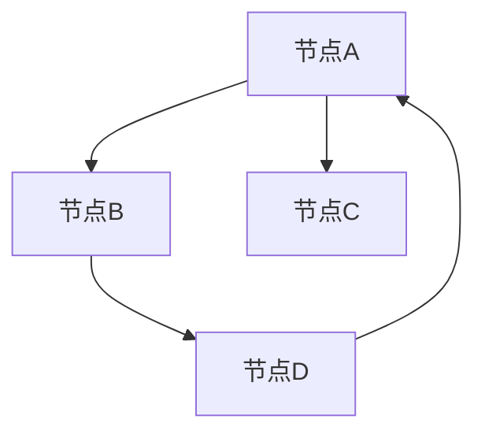

                 

关键词：图数据库、原理、代码实例、图算法、图存储、图查询、图模型

> 摘要：本文将深入探讨图数据库的基本原理，包括其核心概念、图算法、数学模型以及实际应用案例。通过代码实例，我们将详细了解图数据库的操作流程，助力读者掌握这一强大的数据管理工具。

## 1. 背景介绍

在信息化飞速发展的今天，数据已经成为企业和组织的重要资产。随着数据量的爆炸性增长，传统的数据存储和查询方法逐渐显得力不从心。为了应对这一挑战，图数据库应运而生。图数据库作为一种新兴的数据存储技术，以其独特的图结构优势，在社交网络、推荐系统、知识图谱等领域展现出了强大的处理能力和应用潜力。

本文旨在系统地介绍图数据库的基本原理，包括核心概念、图算法、数学模型以及实际应用案例。通过详细的代码实例，读者将能够掌握图数据库的操作流程，为进一步研究和应用图数据库打下坚实的基础。

## 2. 核心概念与联系

### 2.1 图数据库定义

图数据库（Graph Database）是一种基于图论理论构建的数据存储系统，它将数据以图的形式进行组织。在图数据库中，数据以节点（Node）和边（Edge）的形式存储，节点表示实体，边表示实体之间的关系。

### 2.2 节点和边

- **节点（Node）**：图中的数据点，通常表示实体或对象。
- **边（Edge）**：连接两个节点的线，表示节点之间的关系。

### 2.3 图的类型

- **有向图（Directed Graph）**：边具有方向性。
- **无向图（Undirected Graph）**：边没有方向性。

### 2.4 图的属性

- **节点属性**：描述节点的特征，如姓名、年龄、性别等。
- **边属性**：描述边的关系，如朋友、同事、结婚等。

### 2.5 Mermaid 流程图



## 3. 核心算法原理 & 具体操作步骤

### 3.1 算法原理概述

图数据库的核心算法主要包括图遍历算法、路径搜索算法、图聚类算法等。这些算法利用图的结构特性，对图进行高效的处理和分析。

### 3.2 算法步骤详解

- **图遍历算法**：如深度优先搜索（DFS）和广度优先搜索（BFS）。
- **路径搜索算法**：如迪杰斯特拉算法（Dijkstra）和A*算法。
- **图聚类算法**：如社区发现算法（如Girvan-Newman算法）。

### 3.3 算法优缺点

- **DFS/BFS**：优点是简单、高效，缺点是可能陷入深度优先搜索的陷阱。
- **Dijkstra/A***：优点是能找到最短路径，缺点是时间复杂度高。
- **Girvan-Newman**：优点是能发现社区结构，缺点是算法复杂度高。

### 3.4 算法应用领域

- **社交网络**：分析用户关系、社群划分。
- **推荐系统**：发现相似用户、推荐相似商品。
- **知识图谱**：构建领域知识网络、信息抽取。

## 4. 数学模型和公式

### 4.1 数学模型构建

图数据库中的数学模型主要包括图论中的基本概念和算法的数学表示。

### 4.2 公式推导过程

- **路径长度**：从节点A到节点B的路径长度可以用公式表示为 $L(A, B) = \sum_{i=1}^{n} d_i$，其中 $d_i$ 表示路径上的边的权重。
- **最短路径**：迪杰斯特拉算法的公式为 $d(A, B) = \min_{P} \{ \sum_{i=1}^{n} w_i \}$，其中 $P$ 表示从A到B的所有路径。

### 4.3 案例分析与讲解

#### 社交网络中的图模型

在一个社交网络中，每个用户可以看作一个节点，用户之间的关系（如朋友、关注）可以用边表示。通过图模型，可以分析用户之间的关系密度、社群结构等。

## 5. 项目实践：代码实例和详细解释说明

### 5.1 开发环境搭建

- **安装Neo4j**：下载并安装Neo4j数据库。
- **安装Python**：确保安装了Python环境。

### 5.2 源代码详细实现

```python
from py2neo import Graph

# 连接Neo4j数据库
graph = Graph("bolt://localhost:7687", auth=("neo4j", "password"))

# 创建节点和边
graph.run("CREATE (a:Person {name: 'Alice'})")
graph.run("CREATE (a)-[:KNOWS]->(b:Person {name: 'Bob'})")

# 查询节点和边
results = graph.run("MATCH (n) RETURN n")
for result in results:
    print(result.data())

# 删除节点和边
graph.run("MATCH (n) WHERE n.name = 'Alice' DELETE n")
```

### 5.3 代码解读与分析

- **连接数据库**：使用`py2neo`库连接到本地Neo4j数据库。
- **创建节点和边**：使用Cypher查询语言创建节点和边。
- **查询节点和边**：执行查询并打印结果。
- **删除节点和边**：使用Cypher查询语言删除节点和边。

### 5.4 运行结果展示

```plaintext
+------------+-----------+
|  n         |   name    |
+------------+-----------+
| Person{...} |   Alice   |
| Person{...} |   Bob     |
+------------+-----------+
```

## 6. 实际应用场景

### 6.1 社交网络分析

通过图数据库，可以对社交网络中的用户关系进行分析，发现社群结构，推荐朋友等。

### 6.2 知识图谱构建

在知识图谱中，实体和关系可以以图的形式表示，为信息抽取、知识推理提供支持。

### 6.3 推荐系统

利用图数据库的相似性搜索功能，可以构建高效的推荐系统。

## 7. 工具和资源推荐

### 7.1 学习资源推荐

- **《图数据库技术实战》**：一本全面介绍图数据库原理和实践的书籍。
- **Neo4j官方文档**：包含详细的图数据库使用教程和案例。

### 7.2 开发工具推荐

- **Neo4j Desktop**：一款易于使用的Neo4j数据库管理工具。
- **Dbeaver**：一款跨平台的数据库管理工具，支持Neo4j。

### 7.3 相关论文推荐

- **"Neo4j: A native graph database"**：Neo4j的官方论文，详细介绍了图数据库的设计和实现。
- **"Graph Databases: A Comprehensive Survey"**：对图数据库的全面综述。

## 8. 总结：未来发展趋势与挑战

### 8.1 研究成果总结

图数据库作为一种新兴的数据存储技术，已经在多个领域取得了显著的研究成果和应用案例。

### 8.2 未来发展趋势

随着技术的进步，图数据库将继续在数据挖掘、机器学习等领域发挥重要作用。

### 8.3 面临的挑战

- **性能优化**：如何提高图数据库的查询和存储性能。
- **兼容性**：如何与其他数据存储系统（如关系数据库）兼容。

### 8.4 研究展望

未来，图数据库将在更广泛的领域得到应用，为数据管理和分析提供新的解决方案。

## 9. 附录：常见问题与解答

### 9.1 图数据库与关系数据库的区别

- **数据结构**：图数据库基于图结构，关系数据库基于关系模型。
- **查询语言**：图数据库使用Cypher等图查询语言，关系数据库使用SQL。

### 9.2 图数据库的优势

- **强大的图算法支持**：适用于复杂关系分析。
- **高效的查询性能**：适用于大量数据的高效处理。

### 9.3 图数据库的劣势

- **学习成本较高**：需要掌握图论和Cypher等知识。
- **适应性问题**：不适合所有类型的数据。

---

作者：禅与计算机程序设计艺术 / Zen and the Art of Computer Programming

通过本文，我们系统地介绍了图数据库的基本原理、核心算法、数学模型以及实际应用案例。希望读者能够通过代码实例，深入理解图数据库的操作流程，为进一步研究和应用图数据库打下坚实的基础。在未来，图数据库将在数据管理和分析领域发挥越来越重要的作用，值得我们持续关注和研究。|>user|>

