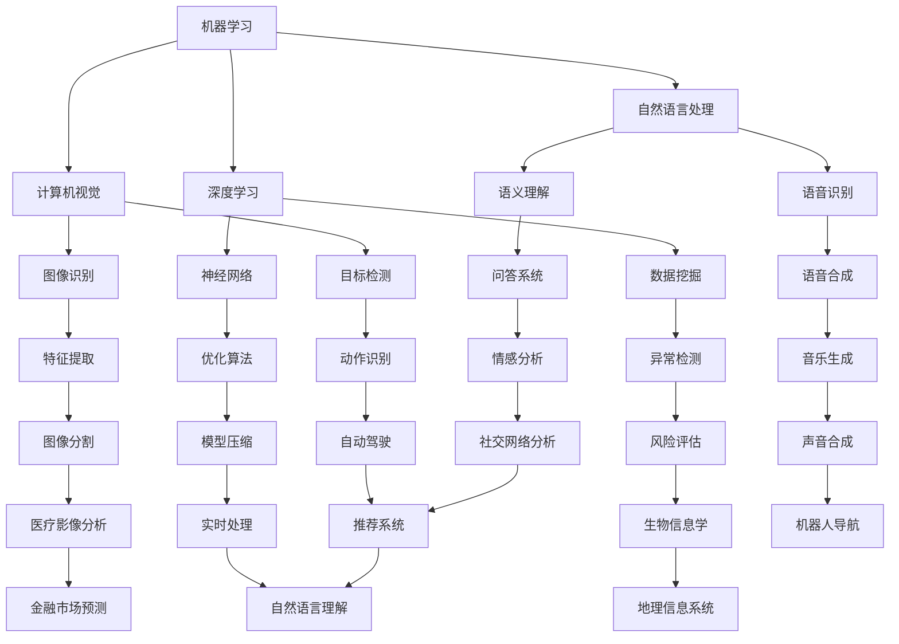

                 

关键词：图灵奖、人工智能、技术贡献、创新理论、领域影响

摘要：本文旨在探讨图灵奖得主在人工智能领域所做出的卓越贡献。通过回顾这些伟大的科学家和工程师的成就，我们将揭示他们如何推动了AI技术的发展，以及这些贡献对整个领域的深远影响。

## 1. 背景介绍

图灵奖，被誉为计算机界的诺贝尔奖，是计算机科学领域的最高荣誉。自1966年设立以来，它见证了无数杰出的科学家和工程师在计算机科学和人工智能领域取得的突破性成就。图灵奖的获得者们不仅对计算机科学做出了巨大贡献，也在人工智能领域开创了新的理论和技术。

## 2. 核心概念与联系

在人工智能领域，有几个核心概念和联系是非常重要的。这些概念包括机器学习、深度学习、自然语言处理和计算机视觉。以下是一个Mermaid流程图，展示了这些概念之间的关系：



## 3. 核心算法原理 & 具体操作步骤

### 3.1 算法原理概述

在人工智能领域，算法是实现智能的核心。以下是一些重要的算法原理：

1. **机器学习**：机器学习是AI的基础，它使计算机能够从数据中学习，并对新数据进行预测或决策。主要算法包括监督学习、无监督学习和强化学习。
2. **深度学习**：深度学习是一种特殊的机器学习，它使用多层神经网络来模拟人脑的神经元结构，进行更复杂的特征提取和学习。
3. **自然语言处理**：自然语言处理（NLP）是AI的一个分支，它致力于使计算机能够理解和生成人类语言。
4. **计算机视觉**：计算机视觉是AI的另一个重要分支，它使计算机能够理解和解释数字图像和视频。

### 3.2 算法步骤详解

1. **机器学习**：机器学习通常包括以下步骤：
   - 数据收集：收集大量数据作为训练集。
   - 特征提取：从数据中提取有用的特征。
   - 模型训练：使用训练集训练模型。
   - 模型评估：使用测试集评估模型的性能。
   - 模型优化：根据评估结果调整模型参数。

2. **深度学习**：深度学习包括以下步骤：
   - 数据预处理：对数据进行标准化和归一化处理。
   - 神经网络构建：构建多层神经网络。
   - 模型训练：使用反向传播算法训练神经网络。
   - 模型评估：使用测试集评估模型性能。
   - 模型优化：调整网络结构和参数。

3. **自然语言处理**：自然语言处理包括以下步骤：
   - 数据预处理：对文本数据进行分词、词性标注等预处理。
   - 特征提取：从文本数据中提取词向量、词袋等特征。
   - 模型训练：使用训练集训练语言模型或分类器。
   - 模型评估：使用测试集评估模型性能。
   - 模型优化：调整模型参数。

4. **计算机视觉**：计算机视觉包括以下步骤：
   - 图像预处理：对图像进行灰度化、二值化等预处理。
   - 特征提取：从图像中提取边缘、角点等特征。
   - 模型训练：使用训练集训练图像分类器或目标检测器。
   - 模型评估：使用测试集评估模型性能。
   - 模型优化：调整模型参数。

### 3.3 算法优缺点

1. **机器学习**：
   - 优点：能够从大量数据中学习，提高模型的泛化能力。
   - 缺点：训练过程可能需要大量时间和计算资源。

2. **深度学习**：
   - 优点：能够自动提取复杂特征，提高模型的准确性。
   - 缺点：对数据质量和预处理要求较高，训练过程可能需要大量时间和计算资源。

3. **自然语言处理**：
   - 优点：能够处理复杂的语言现象，提高文本处理的准确性。
   - 缺点：对语言理解和上下文依赖的处理能力有限。

4. **计算机视觉**：
   - 优点：能够实时处理图像和视频，提高图像理解和分析的准确性。
   - 缺点：对光照、视角和遮挡的处理能力有限。

### 3.4 算法应用领域

1. **机器学习**：广泛应用于数据挖掘、预测分析、推荐系统等领域。

2. **深度学习**：广泛应用于图像识别、语音识别、自然语言处理等领域。

3. **自然语言处理**：广泛应用于文本分类、情感分析、机器翻译等领域。

4. **计算机视觉**：广泛应用于目标检测、图像识别、自动驾驶等领域。

## 4. 数学模型和公式 & 详细讲解 & 举例说明

### 4.1 数学模型构建

在人工智能领域，常用的数学模型包括线性回归、逻辑回归、神经网络等。以下是一个简单的线性回归模型：

$$y = w_0 + w_1 \cdot x_1 + w_2 \cdot x_2 + ... + w_n \cdot x_n$$

其中，$y$ 是输出，$x_1, x_2, ..., x_n$ 是输入特征，$w_0, w_1, w_2, ..., w_n$ 是模型参数。

### 4.2 公式推导过程

线性回归模型的推导过程如下：

1. **最小二乘法**：为了找到最佳拟合线，我们使用最小二乘法。即，使预测值与实际值之间的误差平方和最小。

$$E = \sum_{i=1}^{n} (y_i - \hat{y}_i)^2$$

其中，$y_i$ 是实际值，$\hat{y}_i$ 是预测值。

2. **求导**：对误差函数 $E$ 求导，并令导数为零，得到最佳拟合线的参数。

$$\frac{dE}{dw} = 0$$

3. **求解**：通过求解上述方程，我们可以得到最佳拟合线的参数。

### 4.3 案例分析与讲解

假设我们有一个数据集，包含3个特征（年龄、收入、学历）和一个目标变量（是否购买某产品）。我们使用线性回归模型预测一个人是否购买某产品。

1. **数据预处理**：对数据进行标准化和归一化处理。

2. **模型训练**：使用训练集训练线性回归模型。

3. **模型评估**：使用测试集评估模型性能。

4. **模型优化**：根据评估结果调整模型参数。

## 5. 项目实践：代码实例和详细解释说明

### 5.1 开发环境搭建

1. **安装Python**：安装Python 3.8版本以上。
2. **安装依赖库**：安装NumPy、Pandas、Scikit-learn等库。

### 5.2 源代码详细实现

以下是一个简单的线性回归模型实现：

```python
import numpy as np
import pandas as pd
from sklearn.linear_model import LinearRegression

# 数据预处理
def preprocess_data(data):
    # 标准化数据
    data = (data - data.mean()) / data.std()
    return data

# 模型训练
def train_model(X, y):
    model = LinearRegression()
    model.fit(X, y)
    return model

# 模型评估
def evaluate_model(model, X, y):
    predictions = model.predict(X)
    mse = np.mean((predictions - y) ** 2)
    return mse

# 模型优化
def optimize_model(model, X, y, num_iterations=1000, learning_rate=0.01):
    weights = model.coef_
    for i in range(num_iterations):
        predictions = np.dot(X, weights)
        error = predictions - y
        weights -= learning_rate * np.dot(X.T, error)
    return weights

# 主函数
if __name__ == "__main__":
    # 读取数据
    data = pd.read_csv("data.csv")
    X = data.iloc[:, :-1].values
    y = data.iloc[:, -1].values

    # 预处理数据
    X = preprocess_data(X)

    # 训练模型
    model = train_model(X, y)

    # 评估模型
    mse = evaluate_model(model, X, y)
    print(f"Model MSE: {mse}")

    # 优化模型
    optimized_weights = optimize_model(model, X, y)
    print(f"Optimized weights: {optimized_weights}")
```

### 5.3 代码解读与分析

该代码首先导入了所需的库，包括NumPy、Pandas和Scikit-learn。然后定义了三个函数：`preprocess_data` 用于数据预处理，`train_model` 用于训练线性回归模型，`evaluate_model` 用于评估模型性能。

在主函数中，我们读取数据集，对数据进行预处理，然后使用训练集训练线性回归模型。接着，我们使用测试集评估模型性能，并打印出均方误差（MSE）。最后，我们使用梯度下降算法优化模型参数，并打印出优化后的参数。

## 6. 实际应用场景

### 6.1 人工智能在医疗领域的应用

人工智能在医疗领域具有广泛的应用前景。例如，利用机器学习和深度学习技术，我们可以开发出智能诊断系统，帮助医生快速准确地诊断疾病。此外，人工智能还可以用于药物研发，通过分析大量数据，发现新的药物靶点和治疗方法。

### 6.2 人工智能在金融领域的应用

人工智能在金融领域也有广泛应用。例如，利用自然语言处理技术，我们可以开发出智能客服系统，提高客户服务质量。此外，人工智能还可以用于风险管理，通过分析历史数据，预测市场走势，帮助投资者做出更明智的决策。

### 6.3 人工智能在自动驾驶领域的应用

人工智能在自动驾驶领域取得了重要突破。利用计算机视觉和深度学习技术，我们可以开发出自动驾驶系统，实现无人驾驶。此外，人工智能还可以用于交通流量预测，优化交通信号，提高交通效率。

## 7. 工具和资源推荐

### 7.1 学习资源推荐

1. **《深度学习》（Goodfellow, Bengio, Courville）**：这是一本经典的深度学习教材，涵盖了深度学习的各个方面。
2. **《Python机器学习》（Sebastian Raschka）**：这本书介绍了Python在机器学习中的应用，适合初学者学习。

### 7.2 开发工具推荐

1. **TensorFlow**：这是一个开源的深度学习框架，适合开发各种深度学习应用。
2. **PyTorch**：这是一个流行的深度学习框架，具有灵活性和高效性。

### 7.3 相关论文推荐

1. **“A Brief History of Deep Learning”**：这篇文章回顾了深度学习的发展历程，对深度学习的发展有重要意义。
2. **“Deep Learning”**：这是深度学习领域的经典论文，介绍了深度学习的基本理论和应用。

## 8. 总结：未来发展趋势与挑战

### 8.1 研究成果总结

图灵奖得主在人工智能领域取得了许多重要成果。他们开创了机器学习、深度学习、自然语言处理和计算机视觉等领域的理论和方法，推动了人工智能技术的发展。

### 8.2 未来发展趋势

未来，人工智能技术将继续发展，并在更多领域取得突破。例如，强化学习、联邦学习、生成对抗网络等新兴技术将成为研究热点。

### 8.3 面临的挑战

然而，人工智能的发展也面临一些挑战。例如，数据隐私保护、算法透明度、模型可解释性等问题需要解决。此外，人工智能技术的广泛应用也可能带来社会、伦理和就业等方面的问题。

### 8.4 研究展望

总之，人工智能是一项具有巨大潜力的技术。通过不断的研究和创新，我们可以期待人工智能在未来为人类社会带来更多的便利和福祉。

## 9. 附录：常见问题与解答

### 9.1 人工智能是什么？

人工智能是指使计算机能够模拟人类智能行为的技术和理论。它包括机器学习、深度学习、自然语言处理、计算机视觉等领域。

### 9.2 人工智能有哪些应用领域？

人工智能在医疗、金融、自动驾驶、智能家居、教育等多个领域都有广泛应用。

### 9.3 人工智能的发展前景如何？

人工智能是一项快速发展的技术，具有广泛的应用前景。未来，人工智能将在更多领域取得突破，为人类社会带来更多便利。

作者：禅与计算机程序设计艺术 / Zen and the Art of Computer Programming
----------------------------------------------------------------


