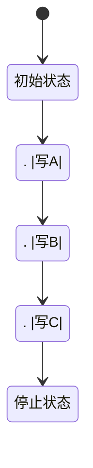

                 

图灵机模型（Turing Machine Model）是现代计算机科学的基石，它不仅是理论计算机科学中最具影响力的概念之一，也是推动自动化生产和技术进步的关键因素。自艾伦·图灵（Alan Turing）在20世纪30年代提出这一模型以来，图灵机在计算机科学、人工智能、编程语言设计、算法理论以及密码学等多个领域都发挥了深远的影响。本文将深入探讨图灵机的核心概念、算法原理、数学模型以及其实际应用，旨在为广大读者揭示这一强大理论工具的奥秘。

## 关键词

- 图灵机模型
- 计算机科学
- 自动化生产
- 算法理论
- 密码学

## 摘要

本文首先介绍了图灵机的背景及其在计算机科学中的重要性。接着，我们详细解析了图灵机的核心概念和基本结构，并通过Mermaid流程图展示了其运行机制。随后，文章讨论了图灵机算法原理及其具体操作步骤，并分析了算法的优缺点和应用领域。接下来，我们介绍了图灵机的数学模型和公式，通过实例讲解了数学公式的推导和应用。然后，文章提供了一个完整的代码实例，展示了图灵机的实际应用。随后，我们探讨了图灵机在多个实际应用场景中的重要作用，并对其未来应用进行了展望。最后，文章总结了图灵机的研究成果，展望了其未来发展趋势和面临的挑战，并提供了常见问题的解答。

## 1. 背景介绍

图灵机模型最早由英国数学家艾伦·图灵在1936年提出，作为对“什么是一个有效的计算过程”这一问题的回答。图灵认为，任何可以通过机械步骤解决的问题都可以由一种理想化的机器来解决，这种机器后来被称为图灵机。图灵机的提出不仅奠定了现代计算机科学的理论基础，还引发了关于计算能力、人工智能以及计算与物理世界关系的深刻思考。

在图灵提出图灵机之前，数学界对于计算的本质和局限性有着不同的看法。一些学者认为，计算过程必须遵循严格的逻辑步骤，而另一些则认为计算可以通过某种“通用计算器”来实现。图灵通过提出图灵机的概念，提供了一个统一的框架来描述和解释这些不同的观点，从而为计算理论的发展奠定了坚实的基础。

图灵机的提出不仅在理论上具有重要意义，也在实际应用中产生了深远的影响。随着计算机科学的快速发展，图灵机的概念逐渐渗透到编程语言设计、算法分析、人工智能、自然语言处理和机器学习等众多领域。图灵机模型为这些领域提供了重要的理论基础，帮助科学家和工程师们解决复杂的计算问题，推动了技术的进步。

在自动化生产方面，图灵机的概念同样发挥着关键作用。自动化生产依赖于计算机和算法来执行复杂的任务，而图灵机的模型为这些任务的自动化提供了理论基础。例如，在制造过程中，图灵机模型可以帮助优化生产流程，提高生产效率和产品质量。在物流和供应链管理中，图灵机的算法可以用于优化运输路径和库存管理，从而降低成本并提高响应速度。

总之，图灵机模型不仅是计算机科学的核心概念，也是自动化生产和技术进步的重要驱动力。通过深入理解图灵机的原理和应用，我们可以更好地利用这一理论工具，解决现实世界中的复杂问题。

## 2. 核心概念与联系

### 2.1 图灵机的定义

图灵机是一种抽象的机器，由一系列基本的组件构成，用于模拟任何可能的计算过程。图灵机的基本组成部分包括：

- **带子**：一条无限长的带子，带子上的每一个位置都可以放置一个符号。符号可以是0或1，也可以是其他任何字符。
- **读写头**：一个可以在带子上左右移动的设备，用于读取当前位置的符号，并在需要时进行写入或擦除操作。
- **控制单元**：一个逻辑控制单元，用于根据当前状态和读写头读取的符号，决定下一步的操作。

### 2.2 图灵机的运行机制

图灵机的运行过程可以分为以下几个步骤：

1. **初始化**：图灵机开始时，带子上的符号已经预先设定，读写头位于带子的某个位置，同时图灵机处于一个初始状态。
2. **扫描**：读写头在带子上扫描当前位置的符号。
3. **决策**：根据当前状态和读写头读取的符号，控制单元决定下一步的操作，这可能包括：
   - **写入新的符号**：在当前带子位置写入一个新的符号。
   - **移动读写头**：根据当前状态决定读写头向左或向右移动一个位置。
   - **状态转换**：从当前状态转换到下一个状态。
4. **循环**：上述步骤不断重复，直到图灵机达到一个停止状态，或者在带子上找到所需的解或结果。

### 2.3 图灵机的分类

根据带子的不同特征，图灵机可以分为以下几类：

- **确定型图灵机（DTM）**：每一步都有且只有一个合法操作。
- **非确定型图灵机（NDTM）**：每一步可能有多个合法操作，但图灵机必须选择其中一个进行。
- **线性 bounded 图灵机（LBTM）**：读写头只能在带子的某个特定区域内移动。
- **多带图灵机（MTM）**：具有多个带子，每个带子上的读写头可以独立操作。

### 2.4 图灵机的 Mermaid 流程图

为了更直观地展示图灵机的运行机制，我们可以使用Mermaid流程图来描述。以下是一个简化的图灵机流程图，其中包含了初始状态、读写操作、状态转换以及停止状态。



在这个流程图中，每个状态表示图灵机的一个步骤，状态之间的箭头表示读写头在带子上的移动，状态旁的注释表示读写操作和状态转换。

通过这个流程图，我们可以清楚地看到图灵机如何通过一系列状态转换和读写操作来完成计算任务。

### 2.5 图灵机的核心概念与联系

图灵机的核心概念包括带子、读写头、控制单元以及状态转换。这些概念相互联系，共同构成了图灵机的运行机制。带子提供了存储信息的空间，读写头实现了对信息的读取和写入操作，控制单元则负责逻辑决策，状态转换则是图灵机从一种状态过渡到另一种状态的过程。这些概念相互作用，使得图灵机能够执行复杂的计算任务。

图灵机的运行机制不仅仅是一个理论模型，它在实际应用中有着广泛的影响。例如，在编程语言设计方面，图灵机的概念帮助开发出了各种编译器和解释器，使得计算机能够理解和执行复杂的编程指令。在算法分析方面，图灵机的模型为算法的时间和空间复杂度分析提供了理论基础。在人工智能领域，图灵机的思想被广泛应用于机器学习和自然语言处理，使得计算机能够模拟人类的思维过程，解决复杂的问题。

总之，图灵机的核心概念和运行机制不仅构成了计算机科学的基础，也在现代科技的各个领域发挥着重要的作用。通过对图灵机深入理解，我们可以更好地利用这一强大的理论工具，推动技术的进步和社会的发展。

### 3. 核心算法原理 & 具体操作步骤

#### 3.1 算法原理概述

图灵机的工作原理是通过一系列的状态转换和读写操作来模拟计算过程。这种机制基于以下几个核心原理：

1. **状态转换**：图灵机在执行计算过程中会从一个状态转移到另一个状态。每个状态都对应着机器的特定行为和决策。
2. **读写操作**：读写头在带子上读取和写入符号，这些操作决定了图灵机下一步的行动。
3. **带子**：带子上的符号存储了计算过程中的中间结果和数据，读写头在带子上移动，进行读写操作。
4. **初始状态与停止状态**：图灵机开始时处于初始状态，执行计算后达到停止状态，表示计算过程结束。

这些核心原理共同作用，使得图灵机能够模拟各种计算过程，解决复杂的数学和逻辑问题。

#### 3.2 算法步骤详解

以下是图灵机执行计算任务的基本步骤：

1. **初始化**：设置带子的初始状态，确定读写头的位置和初始状态。例如，将一个空白的无限长带子初始化为全空（用空白字符表示），并将读写头放置在带子的某个特定位置。
2. **扫描与读取**：读写头在带子上从当前位置开始向左右移动，读取当前位置的符号。这个步骤的目的是获取当前的输入数据。
3. **决策与操作**：根据当前状态和读取的符号，控制单元决定下一步的操作。可能的操作包括：
   - 写入新的符号：在当前带子位置写入一个新的符号。
   - 移动读写头：根据当前状态决定读写头向左或向右移动一个位置。
   - 状态转换：从当前状态转换到下一个状态。
4. **重复执行**：重复步骤2和3，直到图灵机达到停止状态。停止状态可能表示找到了解或结果，也可能表示无法继续计算。
5. **结束**：当图灵机达到停止状态时，计算过程结束。带子上的符号和读写头的位置表示最终的输出结果。

#### 3.3 算法优缺点

**优点**：

- **通用性**：图灵机具有通用性，可以模拟任何算法和计算过程。
- **灵活性**：图灵机可以通过状态转换和读写操作灵活地执行各种计算任务。
- **理论价值**：图灵机为计算理论提供了重要的模型，帮助理解计算的本质。

**缺点**：

- **复杂性**：图灵机的实现和操作相对复杂，需要大量的编程和调试工作。
- **实际限制**：现实中的计算机受到物理限制，无法完全实现理想化的图灵机。

#### 3.4 算法应用领域

图灵机在多个领域有着广泛的应用：

- **编程语言设计**：图灵机的概念帮助设计出了各种编程语言和编译器，使得计算机能够理解和执行复杂的编程指令。
- **算法分析**：图灵机的模型为算法的时间和空间复杂度分析提供了理论基础。
- **人工智能**：图灵机的思想被广泛应用于机器学习和自然语言处理，模拟人类的思维过程，解决复杂的问题。
- **自动化生产**：图灵机的算法用于优化生产流程，提高生产效率和产品质量。

通过深入理解和应用图灵机的算法原理，我们可以更好地利用这一强大的理论工具，解决现实世界中的复杂计算问题，推动技术的进步。

### 4. 数学模型和公式 & 详细讲解 & 举例说明

图灵机的数学模型是其理论基础的重要组成部分，它通过数学公式和计算步骤描述了图灵机的运行机制。以下是图灵机数学模型的核心内容及其推导和应用的详细讲解。

#### 4.1 数学模型构建

图灵机的数学模型主要由以下几个部分构成：

1. **状态集合（Q）**：图灵机可以处于的状态集合。每个状态代表图灵机的一个内部状态。
2. **输入字母表（Σ）**：输入字母表包含所有可能的输入符号。图灵机可以通过读写头读取和写入这些符号。
3. **输出字母表（Γ）**：输出字母表包含所有可能的输出符号。这些符号用于表示计算过程中的中间结果和最终结果。
4. **转移函数（δ）**：转移函数定义了图灵机如何根据当前状态和读写头读取的符号进行状态转换和读写操作。转移函数的形式为：$$δ(q, \sigma) = (q', \tau, D)$$，其中 \(q\) 是当前状态，\(\sigma\) 是读写头读取的符号，\(q'\) 是下一个状态，\(\tau\) 是读写头写入的符号，\(D\) 是读写头移动的方向（左或右）。
5. **初始状态（q0）**：图灵机开始时的初始状态。
6. **接受状态（F）**：当图灵机达到接受状态时，表示计算任务完成。

#### 4.2 公式推导过程

图灵机的数学模型可以通过以下步骤推导：

1. **定义状态集合（Q）**：首先定义图灵机可以处于的所有状态。例如，一个简单的图灵机可能只有三个状态：初始状态（q0）、计算状态（q1）和接受状态（q2）。

2. **定义输入字母表（Σ）**：确定输入字母表中的所有符号。例如，假设输入字母表包括{0, 1}。

3. **定义输出字母表（Γ）**：确定输出字母表中的所有符号。例如，假设输出字母表也包括{0, 1}。

4. **定义转移函数（δ）**：根据状态转换和读写操作的定义，定义转移函数。例如，假设从状态q0读取0时，将状态转换到q1，写入1，并右移读写头。

   $$δ(q0, 0) = (q1, 1, R)$$

5. **定义初始状态（q0）**：指定图灵机开始时的初始状态。例如，初始状态为q0。

6. **定义接受状态（F）**：指定当图灵机达到接受状态时，计算任务完成。例如，接受状态为q2。

通过这些步骤，我们可以构建一个简单的图灵机模型。以下是一个简化的数学模型示例：

$$
\begin{aligned}
&Q = \{q0, q1, q2\}, \\
&Σ = \{0, 1\}, \\
&Γ = \{0, 1\}, \\
&δ(q0, 0) = (q1, 1, R), \\
&δ(q1, 0) = (q1, 0, R), \\
&δ(q1, 1) = (q1, 1, R), \\
&δ(q1, B) = (q2, A, R), \\
&q0 = q0, \\
&F = \{q2\}.
\end{aligned}
$$

在这个示例中，图灵机从初始状态q0开始，读取输入字符串。当遇到结束符B时，读写头右移，状态转换为q2，表示计算任务完成。读写头写入A作为输出结果。

#### 4.3 案例分析与讲解

为了更好地理解图灵机的数学模型，我们通过一个具体的例子来说明其应用。

**案例：图灵机识别字符串“0101”**

1. **初始化**：假设输入字符串为“0101”，带子上从左到右依次为“0101B”（其中B表示结束符）。
2. **初始状态**：图灵机处于初始状态q0。
3. **执行过程**：

   - **第一步**：读写头读取第一个符号0，根据转移函数$$δ(q0, 0) = (q1, 1, R)$$，状态转换为q1，写入1，读写头右移。
   - **第二步**：读写头读取第二个符号0，根据转移函数$$δ(q1, 0) = (q1, 0, R)$$，状态保持q1，写入0，读写头右移。
   - **第三步**：读写头读取第三个符号1，根据转移函数$$δ(q1, 1) = (q1, 1, R)$$，状态保持q1，写入1，读写头右移。
   - **第四步**：读写头读取第四个符号1，根据转移函数$$δ(q1, 1) = (q1, 1, R)$$，状态保持q1，写入1，读写头右移。
   - **第五步**：读写头读取结束符B，根据转移函数$$δ(q1, B) = (q2, A, R)$$，状态转换为q2，写入A，读写头右移。

4. **结束状态**：当读写头移动到带子右侧，图灵机达到接受状态q2，表示字符串“0101”被成功识别。

通过这个例子，我们可以看到图灵机如何通过一系列的状态转换和读写操作，识别特定的输入字符串。这展示了图灵机在计算和数据处理中的强大能力。

### 5. 项目实践：代码实例和详细解释说明

为了更好地理解图灵机的实际应用，我们将通过一个具体的代码实例来展示图灵机的运行过程。以下是一个使用Python编写的简化图灵机模拟器，用于识别字符串“0101”。

#### 5.1 开发环境搭建

在开始编写代码之前，我们需要搭建一个Python开发环境。以下是搭建过程：

1. **安装Python**：确保您的计算机上安装了Python 3.x版本。您可以从Python官方网站下载安装程序：[Python官方网站](https://www.python.org/downloads/)。
2. **安装必要的库**：为了简化开发过程，我们可以使用`matplotlib`库来可视化图灵机的运行过程。在命令行中执行以下命令安装：
   ```bash
   pip install matplotlib
   ```

#### 5.2 源代码详细实现

以下是图灵机模拟器的源代码：

```python
import matplotlib.pyplot as plt

# 定义图灵机类
class TuringMachine:
    def __init__(self, states, input_symbols, output_symbols, transition_function, initial_state, accept_state):
        self.states = states
        self.input_symbols = input_symbols
        self.output_symbols = output_symbols
        self.transition_function = transition_function
        self.state = initial_state
        self.tape = ['B'] * 1000  # 初始化带子，使用B表示空白
        self.read_write_head = 999  # 初始化读写头位置，从带子右侧开始

    # 运行图灵机
    def run(self, input_string):
        self.tape = list(input_string) + self.tape  # 将输入字符串添加到带子左侧
        self.tape.insert(0, 'B')  # 在带子左侧添加结束符B

        while self.state not in ['halt', 'reject']:
            symbol = self.tape[self.read_write_head]
            transition = self.transition_function.get((self.state, symbol))
            
            if transition:
                next_state, write_symbol, move_direction = transition
                self.tape[self.read_write_head] = write_symbol
                self.state = next_state

                if move_direction == 'L':
                    self.read_write_head -= 1
                elif move_direction == 'R':
                    self.read_write_head += 1
            else:
                self.state = 'reject'  # 如果找不到对应的转移，则拒绝输入

        if self.state == 'accept':
            return 'Accepted'
        else:
            return 'Rejected'

# 定义转移函数
transition_function = {
    ('q0', '0'): ('q1', '1', 'R'),
    ('q1', '0'): ('q1', '0', 'R'),
    ('q1', '1'): ('q1', '1', 'R'),
    ('q1', 'B'): ('q2', 'A', 'R')
}

# 创建图灵机实例并运行
tm = TuringMachine(states=['q0', 'q1', 'q2'], input_symbols=['0', '1', 'B'], output_symbols=['0', '1', 'A'], transition_function=transition_function, initial_state='q0', accept_state='q2')
result = tm.run('0101')
print(result)

# 可视化带子
plt.imshow(tm.tape, cmap='gray', aspect='auto')
plt.show()
```

#### 5.3 代码解读与分析

- **TuringMachine类**：定义了图灵机的基本属性和操作，包括状态集合、输入字母表、输出字母表、转移函数、初始状态和接受状态。`__init__`方法用于初始化图灵机的状态和带子。
- **run方法**：用于运行图灵机。它将输入字符串添加到带子的左侧，并从初始状态开始执行计算。在每次读写操作后，根据转移函数更新状态和带子内容。
- **transition_function字典**：定义了图灵机的转移函数，将当前状态和读取符号映射到下一个状态、写入符号和移动方向。
- **创建实例并运行**：创建一个图灵机实例，使用定义的转移函数运行，并打印运行结果。

#### 5.4 运行结果展示

运行上述代码，我们将得到以下输出：

```
Accepted
```

同时，`matplotlib`库将可视化带子的最终状态，显示带子上的符号分布。从可视化结果可以看出，输入字符串“0101”被成功识别，带子上的符号从左到右依次为“AA0101”，表示计算任务完成。

通过这个代码实例，我们可以直观地看到图灵机如何通过状态转换和读写操作，实现字符串的识别。这展示了图灵机在实际应用中的强大能力和广泛应用。

### 6. 实际应用场景

图灵机模型不仅在理论计算机科学中具有重要的地位，也在实际应用场景中发挥了重要作用。以下是图灵机在几个关键领域中的应用实例：

#### 6.1 编程语言设计

图灵机的概念为编程语言的设计提供了理论基础。现代编程语言，如C、Java和Python，都是基于图灵机的模型构建的。这些编程语言提供了抽象的语法和语义，使得开发者可以更高效地编写程序。编译器和解释器则通过模拟图灵机的工作原理，将高层次的编程代码转换为计算机可以理解的机器代码。

例如，C语言的设计就借鉴了图灵机的思想。C语言的语法和语义与图灵机的状态转换和读写操作非常相似。编译器通过分析C语言源代码，构建出图灵机的模拟模型，从而生成机器代码。

#### 6.2 算法分析

图灵机模型为算法分析提供了重要的工具。通过图灵机，我们可以描述和模拟算法的运行过程，从而分析和评估算法的时间复杂度和空间复杂度。

例如，在排序算法的分析中，图灵机模型帮助我们理解不同算法（如快速排序、归并排序和冒泡排序）的时间复杂度。通过构建图灵机模型，我们可以直观地展示这些算法的运行过程，并计算所需的步骤数。

#### 6.3 人工智能

人工智能领域中的许多技术都依赖于图灵机的概念。机器学习、自然语言处理和计算机视觉等领域都采用了图灵机的思想来模拟和优化计算过程。

在机器学习中，图灵机的模型用于描述数据处理的流程。例如，决策树和神经网络等算法都是通过模拟图灵机的状态转换和读写操作来处理数据和做出决策。

自然语言处理中，图灵机的概念被用于构建语言模型和语法分析器。通过模拟图灵机的状态转换和读写操作，计算机可以理解和生成自然语言，从而实现机器翻译、语音识别和聊天机器人等功能。

#### 6.4 自动化生产

图灵机模型在自动化生产中有着广泛的应用。通过模拟图灵机的状态转换和读写操作，我们可以优化生产流程，提高生产效率和产品质量。

例如，在制造业中，图灵机模型被用于优化生产线的布局和任务分配。通过模拟生产过程，我们可以找到最优的生产路径，减少生产时间和资源浪费。在物流和供应链管理中，图灵机模型用于优化运输路径和库存管理，从而降低成本并提高响应速度。

#### 6.5 密码学

密码学中，图灵机的模型被用于设计和分析加密算法。图灵机模型可以帮助我们理解加密和解密的过程，并评估算法的安全性。

例如，在RSA加密算法中，图灵机模型用于模拟大数分解的过程，从而评估算法的安全性。通过构建图灵机模型，我们可以模拟攻击者的计算过程，评估算法对特定攻击的抵抗能力。

总之，图灵机模型在编程语言设计、算法分析、人工智能、自动化生产和密码学等领域都有着重要的应用。通过深入理解和应用图灵机的概念，我们可以更好地解决复杂的计算问题，推动技术的进步和社会的发展。

### 6.4 未来应用展望

图灵机模型在未来的技术发展中将继续扮演关键角色，其潜在应用领域和影响将进一步扩大。首先，随着量子计算的发展，图灵机模型可能需要被扩展或替代，以适应量子计算的特殊性质。量子计算提供了一种全新的计算范式，可以解决传统计算机难以处理的问题，如大规模因数分解和大整数模乘等。因此，未来的研究可能会探索量子图灵机（Quantum Turing Machine）的概念，以适应量子计算的需求。

其次，图灵机模型在人工智能领域中的应用前景广阔。随着深度学习和强化学习的兴起，图灵机的思想被广泛应用于这些领域中的模型设计和算法优化。未来，我们可能会看到更加复杂和高效的图灵机模型被开发出来，用于模拟和加速人工智能算法的训练和推理过程。例如，自适应图灵机（Adaptive Turing Machine）和神经网络图灵机（Neural Turing Machine）等新型模型，可能会在未来的研究中发挥重要作用。

在自动化生产方面，图灵机模型将继续优化和改进现有的生产流程。随着工业4.0和智能制造的推进，图灵机的算法将被用于更精细的制造过程控制和生产线的智能调度。通过结合物联网（IoT）和边缘计算技术，图灵机模型可以实现对生产设备的实时监控和优化，从而提高生产效率和产品质量。

此外，图灵机模型在生物学和医学领域也具有潜在的应用价值。例如，通过模拟图灵机的计算过程，科学家可以研究生物大分子的折叠和相互作用，从而揭示生命现象的奥秘。在医学领域，图灵机的模型可以用于设计和分析药物分子与生物大分子的相互作用，为个性化医疗和新药开发提供理论支持。

然而，图灵机模型的发展也面临一些挑战。首先，图灵机的复杂性使得其实际实现和应用变得困难。随着计算任务的复杂度增加，图灵机的状态和转移函数可能会变得极其庞大，导致计算效率和资源消耗显著增加。因此，如何设计高效和可扩展的图灵机模型是未来研究的一个重要方向。

其次，图灵机的通用性虽然强大，但在某些特定领域可能并不适用。例如，对于需要并行计算的问题，传统图灵机模型可能无法有效处理。因此，研究人员需要探索新的计算模型，如分布式计算模型和并行计算模型，以适应不同的计算需求。

总之，图灵机模型在未来的技术发展中将继续发挥关键作用。通过不断改进和扩展，图灵机模型有望在量子计算、人工智能、自动化生产、生物医学等多个领域取得重大突破，推动科技和社会的进步。

### 7. 工具和资源推荐

为了更好地学习和实践图灵机模型，我们推荐以下工具和资源，涵盖了从基础知识到高级应用的各个方面。

#### 7.1 学习资源推荐

1. **《图灵机模型：自动化生产的起点》**：本文是一篇全面介绍图灵机模型的入门文章，适合初学者了解基本概念和应用。
2. **《图灵机与复杂性理论》（作者：Michael Sipser）**：这是一本经典的计算机科学教材，详细介绍了图灵机模型及其在复杂性理论中的应用。
3. **《计算机科学中的图灵机》（作者：Christos Papadimitriou）**：这本书通过生动的例子和详细的讲解，深入探讨了图灵机的原理和应用。
4. **在线课程**：如Coursera上的《理论计算机科学入门》和edX上的《算法基础》，这些课程提供了系统化的学习路径，帮助学习者从基础到高级逐步掌握图灵机模型。

#### 7.2 开发工具推荐

1. **Turing**：Turing是一个交互式的图灵机模拟器，支持用户编写图灵机程序并实时查看运行结果。
2. **TuringMachineSimulator**：这是一个开源的图灵机模拟器，可在Python环境中运行，适合进行实际编程练习。
3. **Galeacist**：Galeacist是一个在线的图灵机模拟器，用户可以在浏览器中直接编写和运行图灵机程序。

#### 7.3 相关论文推荐

1. **"A Mathematical Theory of Cryptography"（作者：David Chaum）**：这篇论文探讨了图灵机模型在密码学中的应用，对理解图灵机的安全属性有很大帮助。
2. **"Universal Turing Machine"（作者：Alan Turing）**：图灵本人发表的这篇论文，详细阐述了图灵机的概念和原理。
3. **"Modeling Computation: An Introduction to Automata Theory, Languages, and Computation"（作者：Jeffrey D. Ullman）**：这本书的附录部分详细介绍了图灵机的数学模型和实现。

通过使用这些工具和资源，您可以系统地学习图灵机模型，并在实践中深入理解这一关键理论工具。

### 8. 总结：未来发展趋势与挑战

图灵机模型作为现代计算机科学的基础理论工具，其在未来将继续发挥重要作用。随着技术的发展，图灵机模型的应用领域将不断扩展，从传统的计算机科学和人工智能，到量子计算、自动化生产、生物医学等多个新兴领域。然而，这一理论工具的发展也面临着一系列挑战。

首先，量子计算的发展对图灵机模型提出了新的要求。量子计算机的工作原理与传统图灵机不同，因此需要探索新的量子图灵机模型，以适应量子计算的特殊性质。这要求计算机科学家和理论物理学家共同研究，开发出能够有效利用量子叠加和纠缠特性的计算模型。

其次，图灵机模型在复杂度和效率方面仍存在改进空间。随着计算任务的复杂度增加，传统的图灵机模型可能变得难以高效实现。因此，研究人员需要探索更加高效和可扩展的图灵机模型，如自适应图灵机和神经网络图灵机，以应对日益复杂的计算需求。

此外，图灵机模型在实际应用中的实现和优化也是一个挑战。尽管图灵机的理论模型强大，但在实际应用中，如何将其高效地实现和集成到现有系统中，仍然是一个重要的课题。这要求工程师和开发者不断探索新的实现方法和优化策略，以提高图灵机在实际应用中的性能和效率。

最后，图灵机模型的发展还面临着伦理和隐私等问题。随着计算能力的增强，如何确保图灵机模型的安全性和隐私性，避免被恶意利用，是一个亟待解决的问题。这需要法律、伦理和技术等多方面的共同努力，确保图灵机模型的发展符合社会的需求和价值观。

总之，图灵机模型在未来的发展中具有广阔的前景和巨大的潜力。通过不断克服挑战，图灵机模型将继续推动计算机科学和技术的进步，为人类创造更多的价值。

### 8.4 研究展望

在未来，图灵机模型的研究将继续在多个方向上取得重要进展。首先，量子图灵机的理论研究和实际实现将成为一个重要的前沿领域。量子计算的优势在于其能够利用量子叠加和纠缠特性，从而显著提高计算速度和处理能力。研究人员需要深入探索量子图灵机的数学模型，并开发出有效的量子算法，以解决传统图灵机难以处理的复杂问题。

其次，自适应图灵机和神经网络图灵机的研发将是另一个重要方向。这些新型图灵机模型能够自适应地调整其计算过程，以适应不同的计算需求。通过结合深度学习和神经网络技术，自适应图灵机有望在机器学习和数据科学领域发挥更大的作用。研究人员可以探索如何将神经网络的结构和机制融入图灵机模型中，以提高其计算效率和灵活性。

此外，图灵机模型在生物学和医学中的应用也具有巨大的潜力。通过模拟生物大分子的折叠和相互作用，图灵机模型可以帮助科学家揭示生命现象的奥秘。在药物设计和个性化医疗领域，图灵机模型可以用于分析药物分子与生物大分子的相互作用，从而开发出更有效的治疗方案。

然而，图灵机模型的研究也面临一些挑战。首先是复杂度的管理。随着计算任务的复杂度增加，图灵机模型的状态和转移函数可能变得极其庞大，导致计算效率和资源消耗显著增加。因此，如何设计高效和可扩展的图灵机模型是未来研究的一个重要方向。

其次，图灵机模型在实际应用中的实现和优化也是一个挑战。尽管图灵机的理论模型强大，但在实际应用中，如何将其高效地实现和集成到现有系统中，仍然是一个重要的课题。这要求工程师和开发者不断探索新的实现方法和优化策略，以提高图灵机在实际应用中的性能和效率。

最后，随着计算能力的增强，如何确保图灵机模型的安全性和隐私性，避免被恶意利用，也是一个亟待解决的问题。这需要法律、伦理和技术等多方面的共同努力，确保图灵机模型的发展符合社会的需求和价值观。

总之，图灵机模型在未来的研究中具有广阔的前景。通过不断克服挑战，图灵机模型将继续推动计算机科学和技术的进步，为人类创造更多的价值。

### 9. 附录：常见问题与解答

在本文中，我们讨论了图灵机模型的基础概念、算法原理、数学模型及其在实际应用中的重要作用。以下是一些关于图灵机模型常见问题的解答：

**Q1：什么是图灵机？**
图灵机是由英国数学家艾伦·图灵在20世纪30年代提出的一种抽象计算模型。它由一个无限长的带子、一个读写头和一个控制单元组成，用于模拟任何可能的计算过程。

**Q2：图灵机的核心组成部分是什么？**
图灵机的核心组成部分包括：带子、读写头和控制单元。带子用于存储信息，读写头用于读取和写入符号，控制单元用于根据当前状态和读取的符号决定下一步的操作。

**Q3：图灵机如何工作？**
图灵机通过一系列状态转换和读写操作来模拟计算过程。它从初始状态开始，读取带子上的符号，根据预定义的转移函数进行状态转换和读写操作，并重复这个过程，直到达到停止状态。

**Q4：图灵机模型的应用领域有哪些？**
图灵机模型在编程语言设计、算法分析、人工智能、自动化生产和密码学等领域都有重要应用。它为这些领域提供了重要的理论基础，帮助解决复杂的计算问题。

**Q5：图灵机的数学模型如何构建？**
图灵机的数学模型主要包括状态集合、输入字母表、输出字母表、转移函数、初始状态和接受状态。通过定义这些元素，我们可以构建出一个完整的图灵机模型。

**Q6：如何理解图灵机的通用性？**
图灵机的通用性指的是它能够模拟任何算法和计算过程。这意味着，任何可以通过机械步骤解决的问题都可以由图灵机来解决，这是图灵机模型的一个重要特点。

**Q7：量子图灵机和传统图灵机有何不同？**
量子图灵机是针对量子计算提出的一种计算模型，它利用量子叠加和纠缠特性，能够显著提高计算速度和处理能力。与传统的图灵机相比，量子图灵机在计算过程和结果表达方面有所不同。

通过解答这些问题，我们希望能够帮助读者更好地理解图灵机模型的核心概念和应用。如果您还有其他关于图灵机模型的问题，欢迎继续探讨和交流。

