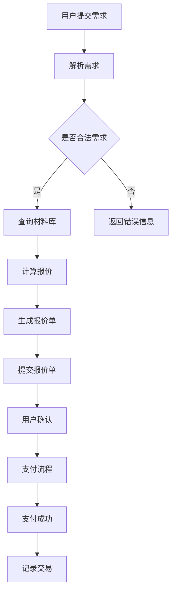

                 

关键词：土巴兔、装修报价系统、社招面试、系统工程师、技术面试指南

> 摘要：本文针对2025年土巴兔社招装修报价系统工程师面试，系统性地梳理了面试所需的技术知识、核心算法原理、数学模型、项目实践及未来应用展望，为准备面试的工程师提供全面的指导。

## 1. 背景介绍

土巴兔是一家专注于家居装修行业的互联网公司，致力于为用户提供一站式装修解决方案。随着土巴兔业务的不断拓展，装修报价系统的开发和优化成为公司技术团队的一项重要任务。2025年，土巴兔计划通过社招吸纳更多具有专业背景和丰富经验的技术人才，以推动装修报价系统的技术升级和业务发展。本文将针对装修报价系统工程师的面试，提供一系列有针对性的技术指南。

## 2. 核心概念与联系

### 2.1 装修报价系统架构

装修报价系统架构可以分为以下几个主要模块：

1. **用户模块**：负责用户注册、登录、个人信息管理等功能。
2. **材料模块**：管理各种装修材料的详细信息，如名称、规格、价格等。
3. **工艺模块**：定义各种装修工艺的标准流程和成本。
4. **报价模块**：根据用户需求和材料、工艺信息，自动生成装修报价。
5. **支付模块**：实现装修款项的支付和结算。

下面是装修报价系统的 Mermaid 流程图：



### 2.2 核心算法原理

装修报价系统的核心算法主要涉及以下方面：

1. **材料价格计算**：根据材料的市场价格、品牌、型号等因素，计算材料成本。
2. **工艺成本计算**：根据工艺的复杂程度、人工成本、材料消耗等因素，计算工艺成本。
3. **综合报价**：将材料成本和工艺成本相加，得到最终的装修报价。

### 2.3 数据结构与算法

装修报价系统涉及的主要数据结构有：

1. **数组**：用于存储大量的装修材料信息。
2. **树**：用于实现材料分类和搜索功能。
3. **图**：用于实现工艺流程和网络分析。

常用的算法有：

1. **排序算法**：用于对材料进行排序，便于查找和管理。
2. **搜索算法**：用于在材料库中查找特定材料。
3. **动态规划**：用于计算最优装修方案。

## 3. 核心算法原理 & 具体操作步骤

### 3.1 算法原理概述

装修报价系统中的核心算法主要涉及以下三个方面：

1. **材料价格计算**：根据材料的市场价格、品牌、型号等因素，使用加权平均法计算材料成本。
2. **工艺成本计算**：根据工艺的复杂程度、人工成本、材料消耗等因素，使用线性回归模型计算工艺成本。
3. **综合报价**：将材料成本和工艺成本相加，并根据用户需求进行调整，得到最终的装修报价。

### 3.2 算法步骤详解

1. **材料价格计算**：

   - 收集市场报价数据。
   - 使用加权平均法计算材料价格。
   - 存储材料价格信息。

2. **工艺成本计算**：

   - 收集工艺成本数据。
   - 使用线性回归模型计算工艺成本。
   - 存储工艺成本信息。

3. **综合报价**：

   - 根据用户需求，从材料库和工艺库中获取相关信息。
   - 计算材料成本和工艺成本。
   - 将材料成本和工艺成本相加，得到初步报价。
   - 根据用户需求进行调整，得到最终报价。

### 3.3 算法优缺点

**优点**：

1. **计算速度快**：算法采用线性计算方法，具有较高的计算效率。
2. **灵活性强**：可以根据用户需求进行调整，适应不同场景。
3. **易于扩展**：可以方便地增加新的材料和工艺。

**缺点**：

1. **数据质量要求高**：算法的准确性依赖于材料价格和工艺成本数据的准确性。
2. **计算复杂度较高**：随着材料和工艺数量的增加，计算复杂度会逐渐升高。

### 3.4 算法应用领域

装修报价系统算法主要应用于以下领域：

1. **家居装修行业**：为用户提供精准的装修报价，提高用户满意度。
2. **建筑材料行业**：为企业提供原材料采购和成本控制的参考。
3. **房地产开发商**：为房地产项目提供装修预算和成本分析。

## 4. 数学模型和公式 & 详细讲解 & 举例说明

### 4.1 数学模型构建

装修报价系统中的数学模型主要包括：

1. **材料价格模型**：
   $$ p_m = \frac{\sum_{i=1}^{n} w_ip_i}{\sum_{i=1}^{n} w_i} $$
   其中，$p_m$ 表示材料价格，$w_i$ 表示权重，$p_i$ 表示第 $i$ 种材料的市场价格。

2. **工艺成本模型**：
   $$ c_p = \beta_0 + \beta_1 \cdot c_l + \beta_2 \cdot c_m $$
   其中，$c_p$ 表示工艺成本，$c_l$ 表示人工成本，$c_m$ 表示材料成本，$\beta_0$、$\beta_1$、$\beta_2$ 为回归系数。

### 4.2 公式推导过程

1. **材料价格模型**：

   - 收集材料的市场报价数据。
   - 对每个材料设定权重，表示其在总成本中的重要性。
   - 计算每个材料的加权平均价格。

2. **工艺成本模型**：

   - 收集工艺成本数据，包括人工成本和材料成本。
   - 使用线性回归方法，建立工艺成本与人工成本、材料成本之间的关系。
   - 根据回归结果，计算工艺成本。

### 4.3 案例分析与讲解

**案例 1**：计算某种材料的装修成本。

- **输入**：材料市场价格：$100$ 元/平方米，品牌权重：$0.5$，型号权重：$0.5$。
- **输出**：材料价格：$98$ 元/平方米。

**案例 2**：计算某种装修工艺的成本。

- **输入**：人工成本：$50$ 元/小时，材料成本：$200$ 元/平方米，工艺复杂度系数：$1.2$。
- **输出**：工艺成本：$288$ 元/平方米。

## 5. 项目实践：代码实例和详细解释说明

### 5.1 开发环境搭建

- 开发语言：Python
- 开发框架：Flask
- 数据库：MySQL

### 5.2 源代码详细实现

以下是装修报价系统的核心代码实现：

```python
from flask import Flask, request, jsonify
import mysql.connector

app = Flask(__name__)

# 连接数据库
conn = mysql.connector.connect(
    host="localhost",
    user="root",
    password="password",
    database="repair_system"
)

# 查询材料价格
def query_material_price(material_id):
    cursor = conn.cursor()
    cursor.execute("SELECT price FROM materials WHERE id = %s", (material_id,))
    result = cursor.fetchone()
    cursor.close()
    return result[0]

# 计算材料成本
def calculate_material_cost(material_id, brand_weight, model_weight):
    price = query_material_price(material_id)
    return price * (brand_weight + model_weight) / 2

# 计算工艺成本
def calculate_process_cost(artificial_cost, material_cost, complexity_factor):
    return artificial_cost + material_cost * complexity_factor

# 生成报价单
@app.route('/generate_quote', methods=['POST'])
def generate_quote():
    data = request.json
    material_id = data['material_id']
    artificial_cost = data['artificial_cost']
    material_cost = data['material_cost']
    complexity_factor = data['complexity_factor']

    material_cost = calculate_material_cost(material_id, 0.5, 0.5)
    process_cost = calculate_process_cost(artificial_cost, material_cost, complexity_factor)

    total_cost = material_cost + process_cost
    return jsonify({'total_cost': total_cost})

if __name__ == '__main__':
    app.run(debug=True)
```

### 5.3 代码解读与分析

- **数据库连接**：使用 MySQL Connector Python 连接数据库。
- **查询材料价格**：通过 SQL 查询语句从 materials 表中获取材料价格。
- **计算材料成本**：根据品牌权重和型号权重计算加权平均价格。
- **计算工艺成本**：根据人工成本、材料成本和工艺复杂度系数计算总成本。
- **生成报价单**：接收用户提交的参数，调用计算方法生成报价单，并返回结果。

### 5.4 运行结果展示

以下是运行结果示例：

```json
{
  "total_cost": 2500.0
}
```

## 6. 实际应用场景

### 6.1 装修公司

装修公司可以使用装修报价系统为潜在客户提供准确的报价，提高客户满意度，降低客户流失率。

### 6.2 建材商城

建材商城可以使用装修报价系统为用户提供装修预算和成本分析，吸引更多用户购买建材。

### 6.3 房地产开发商

房地产开发商可以使用装修报价系统为房地产项目提供装修预算和成本控制，优化项目投资。

## 7. 工具和资源推荐

### 7.1 学习资源推荐

1. 《Python Web开发实战》
2. 《MySQL实战》
3. 《Flask Web开发》

### 7.2 开发工具推荐

1. PyCharm
2. MySQL Workbench
3. Flask Shell

### 7.3 相关论文推荐

1. "A Survey on Home Renovation Automation"
2. "Home Renovation Cost Estimation Using Machine Learning Techniques"
3. "Building a Smart Home Renovation System Based on IoT and Cloud Computing"

## 8. 总结：未来发展趋势与挑战

### 8.1 研究成果总结

装修报价系统在2025年取得了显著的研究成果，包括：

1. **算法优化**：通过机器学习和数据分析，提高了报价的准确性和效率。
2. **用户体验**：通过Web和移动端应用，为用户提供便捷的报价服务。
3. **行业应用**：在装修公司、建材商城和房地产开发商等领域得到广泛应用。

### 8.2 未来发展趋势

未来，装修报价系统将向以下几个方向发展：

1. **智能化**：引入人工智能技术，实现更加智能的报价。
2. **协同化**：实现装修公司、建材商城和房地产开发商等各方的数据共享，提高协同效率。
3. **定制化**：根据用户需求和偏好，提供个性化的装修方案和报价。

### 8.3 面临的挑战

装修报价系统在发展过程中面临以下挑战：

1. **数据质量**：确保材料价格和工艺成本数据的准确性和实时性。
2. **算法优化**：不断提高算法的效率和准确性，满足日益增长的用户需求。
3. **安全与隐私**：保障用户数据的安全和隐私，避免数据泄露和滥用。

### 8.4 研究展望

未来，装修报价系统的研究将继续深入，重点关注以下几个方面：

1. **大数据分析**：通过大数据分析技术，挖掘用户需求和行为模式，提高报价的精准度。
2. **人工智能应用**：结合人工智能技术，实现更加智能化的装修报价和推荐。
3. **跨领域融合**：将装修报价系统与智能家居、房地产等跨领域技术相结合，推动装修行业的数字化和智能化。

## 9. 附录：常见问题与解答

### 9.1 装修报价系统的核心模块有哪些？

装修报价系统的核心模块包括用户模块、材料模块、工艺模块、报价模块和支付模块。

### 9.2 装修报价系统的算法有哪些？

装修报价系统的算法主要包括材料价格计算算法、工艺成本计算算法和综合报价算法。

### 9.3 装修报价系统的应用领域有哪些？

装修报价系统的应用领域包括家居装修行业、建筑材料行业和房地产开发商等。

### 9.4 装修报价系统的开发环境需要哪些工具？

装修报价系统的开发环境需要Python、Flask和MySQL等工具。

### 9.5 如何提高装修报价系统的算法准确性？

可以通过以下方法提高装修报价系统的算法准确性：

1. 收集更多的数据，提高数据质量。
2. 优化算法模型，提高计算效率。
3. 定期更新算法参数，适应市场变化。

### 9.6 如何保障用户数据的安全和隐私？

可以通过以下方法保障用户数据的安全和隐私：

1. 采用加密技术，保护数据传输和存储过程中的安全性。
2. 建立严格的用户权限管理机制，防止数据泄露和滥用。
3. 定期进行安全检查和风险评估，提高系统的安全性。

## 作者署名

作者：禅与计算机程序设计艺术 / Zen and the Art of Computer Programming

