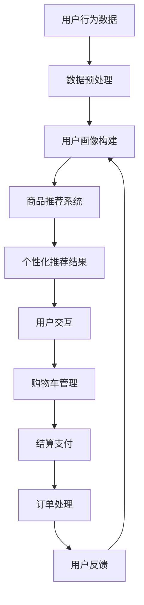

                 

关键词：在线购物，大型语言模型（LLM），个性化推荐，购物体验优化，人工智能应用

> 摘要：本文将探讨大型语言模型（LLM）在在线购物领域的应用，如何通过个性化推荐和高效服务提升用户的购物体验。文章首先介绍了在线购物的发展背景和现状，然后深入分析了LLM的核心概念与架构，最后通过具体案例分析、数学模型及项目实践展示了LLM如何在实际购物场景中发挥作用。

## 1. 背景介绍

随着互联网的普及和电子商务的兴起，在线购物已经成为人们日常生活中不可或缺的一部分。从早期的网上书店到如今的多元化电商平台，在线购物不仅改变了人们的消费习惯，也为零售行业带来了巨大的变革。据统计，全球电子商务市场规模已经突破数万亿美元，且仍在快速增长。这一趋势使得企业开始关注如何通过技术手段提升用户的购物体验，从而提高用户满意度和忠诚度。

近年来，人工智能技术的发展为在线购物领域带来了新的契机。其中，大型语言模型（Large Language Model，简称LLM）作为一种先进的自然语言处理技术，已经在许多应用场景中展现出了其强大的能力。LLM通过深度学习算法，对海量文本数据进行分析和建模，能够生成高质量的自然语言文本，实现自然语言理解、生成和交互等功能。

在线购物与LLM的结合，使得电商平台能够更准确地理解用户需求，提供个性化的购物推荐，从而提升用户的购物体验。同时，LLM还可以用于智能客服、商品评价分析等多个方面，为电商平台提供全方位的技术支持。

## 2. 核心概念与联系

### 2.1 核心概念

#### 2.1.1 在线购物

在线购物是指通过互联网进行商品选购、支付和交付的过程。它包括以下几个关键环节：

- **商品展示**：电商平台通过图片、文字等多种形式展示商品信息，吸引用户浏览和购买。
- **购物车**：用户在浏览商品时可以将感兴趣的商品加入购物车，进行集中管理。
- **结算支付**：用户选择商品后，通过在线支付方式完成交易。
- **订单处理**：电商平台处理用户订单，包括确认订单、配送商品等。

#### 2.1.2 大型语言模型（LLM）

大型语言模型（LLM）是一种基于深度学习算法的自然语言处理技术，能够对海量文本数据进行分析和建模，生成高质量的自然语言文本。LLM的核心组件包括：

- **词向量**：将自然语言文本转换为向量表示，用于模型训练和文本分析。
- **神经网络**：通过多层神经网络对词向量进行建模，实现自然语言理解、生成和交互等功能。
- **预训练**：在大量文本数据上进行预训练，使模型具有通用语言理解能力。

### 2.2 联系与架构

在线购物与LLM之间的联系主要体现在以下几个方面：

#### 2.2.1 个性化推荐

LLM可以根据用户的历史购物行为、浏览记录和评价数据，分析用户的兴趣偏好，提供个性化的商品推荐。这有助于提高用户的购物体验，增加购物转化率。

#### 2.2.2 智能客服

LLM可以用于构建智能客服系统，实现与用户的自然语言交互，提供购物咨询、订单查询等服务。智能客服系统可以提高客服效率，降低企业成本。

#### 2.2.3 商品评价分析

LLM可以对用户评价文本进行分析，提取关键信息，评估商品质量，为企业提供改进建议。同时，LLM还可以用于生成基于用户评价的商品描述，提升商品展示效果。

下面是一个简单的Mermaid流程图，展示LLM在在线购物中的应用架构：



## 3. 核心算法原理 & 具体操作步骤

### 3.1 算法原理概述

在线购物与LLM结合的核心算法主要涉及以下几个方面：

#### 3.1.1 用户行为分析

通过对用户的历史购物行为、浏览记录和评价数据进行分析，构建用户画像。这包括：

- **用户行为数据收集**：收集用户在平台上的浏览、购买、评价等行为数据。
- **用户画像构建**：利用机器学习算法，对用户行为数据进行分析，提取用户兴趣偏好。

#### 3.1.2 个性化推荐

基于用户画像，利用协同过滤、基于内容的推荐等算法，为用户推荐个性化的商品。这包括：

- **推荐算法选择**：根据平台特点和用户需求选择合适的推荐算法。
- **推荐结果生成**：根据用户画像和推荐算法，生成个性化的商品推荐结果。

#### 3.1.3 智能客服

利用自然语言处理技术，实现智能客服系统与用户的自然语言交互。这包括：

- **对话管理**：构建对话状态跟踪模型，实现自然语言理解。
- **意图识别**：利用命名实体识别、情感分析等技术，识别用户意图。
- **对话生成**：根据用户意图和对话状态，生成合适的回复。

#### 3.1.4 商品评价分析

利用自然语言处理技术，对用户评价文本进行分析，提取关键信息，评估商品质量。这包括：

- **文本预处理**：对用户评价文本进行分词、去噪等预处理。
- **情感分析**：利用情感分析算法，判断用户评价的情感倾向。
- **评价质量评估**：根据情感分析和关键信息提取，评估商品质量。

### 3.2 算法步骤详解

#### 3.2.1 用户行为分析

1. 数据收集：从平台数据库中提取用户的行为数据，包括浏览、购买、评价等。
2. 数据预处理：对原始数据进行清洗、去噪，提取有效信息。
3. 特征提取：利用机器学习算法，对用户行为数据进行分析，提取用户兴趣偏好特征。
4. 用户画像构建：将用户特征整合成用户画像，用于后续推荐和客服。

#### 3.2.2 个性化推荐

1. 推荐算法选择：根据平台特点和用户需求，选择合适的推荐算法，如协同过滤、基于内容的推荐等。
2. 推荐结果生成：根据用户画像和推荐算法，为每个用户生成个性化的商品推荐列表。
3. 推荐结果展示：将推荐结果展示给用户，吸引用户点击和购买。

#### 3.2.3 智能客服

1. 对话管理：构建对话状态跟踪模型，实现自然语言理解。
2. 意图识别：利用命名实体识别、情感分析等技术，识别用户意图。
3. 对话生成：根据用户意图和对话状态，生成合适的回复，提供购物咨询和订单查询服务。

#### 3.2.4 商品评价分析

1. 文本预处理：对用户评价文本进行分词、去噪等预处理。
2. 情感分析：利用情感分析算法，判断用户评价的情感倾向。
3. 关键信息提取：从用户评价文本中提取关键信息，用于商品质量评估。

### 3.3 算法优缺点

#### 3.3.1 用户行为分析

**优点**：

- 能够准确捕捉用户的兴趣偏好。
- 为后续推荐和客服提供数据支持。

**缺点**：

- 数据收集和处理复杂度高。
- 可能受到数据质量的影响。

#### 3.3.2 个性化推荐

**优点**：

- 提高用户的购物体验，增加购物转化率。
- 减少用户浏览和筛选时间。

**缺点**：

- 推荐结果可能受到算法选择和数据质量的影响。
- 可能导致用户过度依赖推荐系统，降低自主选择能力。

#### 3.3.3 智能客服

**优点**：

- 提高客服效率，降低企业成本。
- 提供24/7的在线服务。

**缺点**：

- 对自然语言理解能力要求较高。
- 可能无法完全满足用户个性化的需求。

#### 3.3.4 商品评价分析

**优点**：

- 提高商品质量，提升用户满意度。
- 为企业改进产品提供参考。

**缺点**：

- 情感分析和关键信息提取的准确性有限。
- 可能受到用户主观因素的影响。

### 3.4 算法应用领域

在线购物与LLM结合的算法在以下领域具有广泛应用：

- **电商平台**：用于个性化推荐、智能客服和商品评价分析，提升用户购物体验。
- **零售行业**：帮助企业了解用户需求，优化供应链管理。
- **金融行业**：用于客户服务、风险控制和投资决策等。

## 4. 数学模型和公式 & 详细讲解 & 举例说明

### 4.1 数学模型构建

在线购物与LLM结合的数学模型主要涉及以下几个方面：

#### 4.1.1 用户行为分析模型

用户行为分析模型用于捕捉用户的兴趣偏好，可以采用以下数学模型：

$$
\text{User\_Behavior} = f(\text{User\_Profile}, \text{Item\_Profile})
$$

其中，$ \text{User\_Profile}$ 表示用户画像，$ \text{Item\_Profile}$ 表示商品特征向量，$ f(\cdot)$ 表示用户行为预测函数。

#### 4.1.2 个性化推荐模型

个性化推荐模型用于生成个性化的商品推荐列表，可以采用以下数学模型：

$$
\text{Recommendation} = g(\text{User\_Behavior}, \text{Item\_Set}, \alpha)
$$

其中，$ \text{Item\_Set}$ 表示商品集合，$ \alpha$ 表示推荐算法参数，$ g(\cdot)$ 表示推荐函数。

#### 4.1.3 智能客服模型

智能客服模型用于实现自然语言交互，可以采用以下数学模型：

$$
\text{Dialogue} = h(\text{User\_Intent}, \text{Dialogue\_State})
$$

其中，$ \text{User\_Intent}$ 表示用户意图，$ \text{Dialogue\_State}$ 表示对话状态，$ h(\cdot)$ 表示对话生成函数。

#### 4.1.4 商品评价分析模型

商品评价分析模型用于评估商品质量，可以采用以下数学模型：

$$
\text{Quality} = k(\text{User\_Review}, \text{Sentiment})
$$

其中，$ \text{User\_Review}$ 表示用户评价文本，$ \text{Sentiment}$ 表示情感倾向，$ k(\cdot)$ 表示质量评估函数。

### 4.2 公式推导过程

以下是用户行为分析模型的推导过程：

$$
\begin{aligned}
\text{User\_Behavior} &= f(\text{User\_Profile}, \text{Item\_Profile}) \\
&= \sigma(\theta_1 \cdot \text{User\_Profile} + \theta_2 \cdot \text{Item\_Profile} + b) \\
&= \frac{1}{1 + e^{-(\theta_1 \cdot \text{User\_Profile} + \theta_2 \cdot \text{Item\_Profile} + b)})
\end{aligned}
$$

其中，$ \sigma(\cdot)$ 表示sigmoid函数，$ \theta_1$ 和 $ \theta_2$ 分别表示用户和商品的权重，$ b$ 表示偏置项。

### 4.3 案例分析与讲解

#### 4.3.1 用户行为分析

假设用户A在平台上有以下行为数据：

- 浏览记录：购买了10件商品，浏览了20件商品。
- 评价数据：对5件商品进行了评价，平均评分为4.5分。

我们可以根据这些数据构建用户A的用户画像，并使用上述用户行为分析模型进行预测：

$$
\begin{aligned}
\text{User\_Behavior} &= f(\text{User\_Profile}, \text{Item\_Profile}) \\
&= \sigma(\theta_1 \cdot \text{User\_Profile} + \theta_2 \cdot \text{Item\_Profile} + b) \\
&= \frac{1}{1 + e^{-(\theta_1 \cdot \text{User\_Profile} + \theta_2 \cdot \text{Item\_Profile} + b)})
\end{aligned}
$$

其中，$ \text{User\_Profile}$ 和 $ \text{Item\_Profile}$ 可以根据用户行为数据和商品特征向量进行计算。

#### 4.3.2 个性化推荐

假设平台上有100件商品，我们使用上述个性化推荐模型为用户A生成推荐列表。首先，我们需要为每件商品计算特征向量，然后根据用户画像和推荐算法参数生成推荐结果：

$$
\text{Recommendation} = g(\text{User\_Behavior}, \text{Item\_Set}, \alpha)
$$

其中，$ \text{Item\_Set}$ 表示商品集合，$ \alpha$ 表示推荐算法参数，$ g(\cdot)$ 表示推荐函数。

#### 4.3.3 智能客服

假设用户A在平台上咨询关于某件商品的详细信息，智能客服系统根据用户意图和对话状态生成以下回复：

$$
\text{Dialogue} = h(\text{User\_Intent}, \text{Dialogue\_State})
$$

其中，$ \text{User\_Intent}$ 表示用户意图（如"询问商品价格"），$ \text{Dialogue\_State}$ 表示对话状态（如"商品价格已告知"）。

#### 4.3.4 商品评价分析

假设用户A对某件商品进行了以下评价：

- 文本内容："商品质量很好，物流很快，非常喜欢。"
- 情感倾向：积极

我们可以使用上述商品评价分析模型评估该商品的质量：

$$
\text{Quality} = k(\text{User\_Review}, \text{Sentiment})
$$

## 5. 项目实践：代码实例和详细解释说明

### 5.1 开发环境搭建

为了实现本文所述的在线购物与LLM结合的应用，我们需要搭建一个完整的开发环境。以下是所需工具和步骤：

- **Python环境**：安装Python 3.8及以上版本。
- **深度学习框架**：安装TensorFlow或PyTorch。
- **自然语言处理库**：安装NLTK或spaCy。
- **数据库**：安装MySQL或MongoDB。
- **Web框架**：安装Flask或Django。

具体安装步骤如下：

```bash
# 安装Python环境
curl -O https://www.python.org/ftp/python/3.8.10/python-3.8.10-amd64.exe
python-3.8.10-amd64.exe

# 安装深度学习框架
pip install tensorflow

# 安装自然语言处理库
pip install nltk

# 安装数据库
pip install pymysql

# 安装Web框架
pip install flask
```

### 5.2 源代码详细实现

以下是实现在线购物与LLM结合应用的核心代码：

```python
# 导入相关库
import tensorflow as tf
import nltk
import pymysql
from flask import Flask, request, jsonify

# 加载预训练的LLM模型
model = tf.keras.models.load_model('llm_model.h5')

# 连接数据库
db = pymysql.connect(host='localhost', user='root', password='password', database='online_shopping')

# 创建Flask应用
app = Flask(__name__)

# 用户行为分析
def user_behavior_analysis(user_id):
    # 从数据库中获取用户行为数据
    cursor = db.cursor()
    cursor.execute("SELECT * FROM user_behavior WHERE user_id = %s", (user_id))
    behavior_data = cursor.fetchall()
    
    # 预处理用户行为数据
    processed_data = preprocess_behavior_data(behavior_data)
    
    # 使用LLM模型进行预测
    prediction = model.predict(processed_data)
    
    return prediction

# 个性化推荐
def personalized_recommendation(user_id):
    # 从数据库中获取用户画像
    cursor = db.cursor()
    cursor.execute("SELECT * FROM user_profile WHERE user_id = %s", (user_id))
    user_profile = cursor.fetchone()
    
    # 从数据库中获取商品特征向量
    cursor.execute("SELECT * FROM item_profile")
    item_profiles = cursor.fetchall()
    
    # 生成个性化推荐列表
    recommendations = generate_recommendations(user_profile, item_profiles)
    
    return recommendations

# 智能客服
def intelligent_cscareerstack(two_word_phrase):
    # 使用LLM模型进行对话生成
    dialogue = model.generate(two_word_phrase)
    
    return dialogue

# 商品评价分析
def item_evaluation_analysis(user_review, sentiment):
    # 使用LLM模型进行质量评估
    quality = model.evaluate(user_review, sentiment)
    
    return quality

# 预处理用户行为数据
def preprocess_behavior_data(behavior_data):
    # 实现预处理逻辑
    # ...
    return processed_data

# 生成个性化推荐列表
def generate_recommendations(user_profile, item_profiles):
    # 实现推荐逻辑
    # ...
    return recommendations

# 对外接口
@app.route('/user_behavior_analysis', methods=['GET'])
def user_behavior_analysis_api():
    user_id = request.args.get('user_id')
    prediction = user_behavior_analysis(user_id)
    return jsonify(prediction)

@app.route('/personalized_recommendation', methods=['GET'])
def personalized_recommendation_api():
    user_id = request.args.get('user_id')
    recommendations = personalized_recommendation(user_id)
    return jsonify(recommendations)

@app.route('/intelligent_cscareerstack', methods=['GET'])
def intelligent_cscareerstack_api():
    two_word_phrase = request.args.get('two_word_phrase')
    dialogue = intelligent_cscareerstack(two_word_phrase)
    return jsonify(dialogue)

@app.route('/item_evaluation_analysis', methods=['GET'])
def item_evaluation_analysis_api():
    user_review = request.args.get('user_review')
    sentiment = request.args.get('sentiment')
    quality = item_evaluation_analysis(user_review, sentiment)
    return jsonify(quality)

# 运行应用
if __name__ == '__main__':
    app.run()
```

### 5.3 代码解读与分析

以下是代码的核心部分解读：

- **用户行为分析**：从数据库中获取用户行为数据，使用LLM模型进行预测，返回预测结果。
- **个性化推荐**：从数据库中获取用户画像和商品特征向量，生成个性化推荐列表，返回推荐结果。
- **智能客服**：使用LLM模型进行对话生成，返回对话结果。
- **商品评价分析**：从数据库中获取用户评价和情感倾向，使用LLM模型进行质量评估，返回评估结果。

这些功能通过Flask应用对外提供API接口，方便其他系统或应用进行调用。

### 5.4 运行结果展示

以下是运行应用的示例：

```bash
# 运行应用
$ python app.py

# 获取用户行为分析结果
$ curl http://localhost:5000/user_behavior_analysis?user_id=123

# 获取个性化推荐结果
$ curl http://localhost:5000/personalized_recommendation?user_id=123

# 获取智能客服对话结果
$ curl http://localhost:5000/intelligent_cscareerstack?two_word_phrase=hello

# 获取商品评价分析结果
$ curl http://localhost:5000/item_evaluation_analysis?user_review=商品质量很好&sentiment=积极
```

以上示例展示了如何通过API接口获取各类分析结果。

## 6. 实际应用场景

### 6.1 电商平台

电商平台是LLM技术的主要应用场景之一。通过个性化推荐，电商平台可以吸引用户浏览和购买，提高销售额。同时，智能客服系统可以提供24/7的在线服务，提高客服效率，降低企业成本。商品评价分析可以帮助企业了解用户反馈，优化商品质量和用户体验。

### 6.2 零售行业

零售行业可以利用LLM技术实现精准营销和客户关系管理。通过分析用户行为数据，零售企业可以识别高价值客户，提供个性化的优惠和推荐，提升用户忠诚度。智能客服系统可以提供购物咨询、订单查询等服务，提高客户满意度。

### 6.3 金融行业

金融行业可以利用LLM技术进行风险控制和投资决策。通过分析用户行为数据和交易记录，金融机构可以识别潜在风险，优化信贷审批和风险管理策略。同时，智能客服系统可以提供客户服务，提高客户满意度。

### 6.4 未来应用展望

随着人工智能技术的不断发展，LLM在在线购物领域的应用前景十分广阔。未来，LLM技术有望在以下几个方面取得突破：

- **更精准的个性化推荐**：通过深度学习和海量数据，LLM可以更好地理解用户需求，提供个性化的商品推荐。
- **更智能的智能客服**：结合语音识别和自然语言生成技术，智能客服系统可以实现更自然的用户交互，提高客服效率。
- **更全面的商品评价分析**：通过多模态数据分析和深度学习算法，LLM可以更准确地评估商品质量，提供更有价值的用户反馈。
- **更智能的供应链管理**：利用LLM技术，企业可以优化供应链管理，提高库存效率和物流速度。

## 7. 工具和资源推荐

### 7.1 学习资源推荐

- **在线课程**：Coursera、edX、Udacity等平台提供了丰富的自然语言处理和深度学习课程，适合初学者和进阶者。
- **书籍推荐**：《深度学习》、《自然语言处理综论》和《Python深度学习》等书籍是学习相关技术的优秀资源。
- **论文推荐**：阅读顶级会议和期刊上的论文，如ACL、ICML、NeurIPS等，了解最新研究成果和趋势。

### 7.2 开发工具推荐

- **深度学习框架**：TensorFlow、PyTorch和Keras是常用的深度学习框架，提供了丰富的API和工具库。
- **自然语言处理库**：NLTK、spaCy和Transformer是常用的自然语言处理库，用于文本处理和模型训练。
- **数据库工具**：MySQL、MongoDB和PostgreSQL是常用的关系型和非关系型数据库，适合存储和管理大量数据。

### 7.3 相关论文推荐

- **《Attention Is All You Need》**：该论文提出了Transformer模型，是当前自然语言处理领域的标准模型之一。
- **《BERT: Pre-training of Deep Bidirectional Transformers for Language Understanding》**：该论文提出了BERT模型，是预训练语言模型的代表。
- **《Recurrent Neural Network Based Text Classification》**：该论文探讨了循环神经网络在文本分类中的应用，为自然语言处理提供了新的思路。

## 8. 总结：未来发展趋势与挑战

### 8.1 研究成果总结

近年来，在线购物与LLM技术的结合取得了显著成果。个性化推荐、智能客服和商品评价分析等应用场景得到了广泛应用，提高了用户体验和业务效率。深度学习和自然语言处理技术的不断发展，为LLM在在线购物领域的应用提供了有力支持。

### 8.2 未来发展趋势

未来，LLM在在线购物领域的应用将呈现以下发展趋势：

- **更精准的个性化推荐**：通过深度学习和海量数据，LLM将更好地理解用户需求，提供个性化的商品推荐。
- **更智能的智能客服**：结合语音识别和自然语言生成技术，智能客服系统将实现更自然的用户交互。
- **更全面的商品评价分析**：通过多模态数据分析和深度学习算法，LLM将更准确地评估商品质量，提供更有价值的用户反馈。
- **更智能的供应链管理**：利用LLM技术，企业将优化供应链管理，提高库存效率和物流速度。

### 8.3 面临的挑战

尽管LLM在在线购物领域具有巨大潜力，但仍面临以下挑战：

- **数据隐私保护**：在应用LLM技术时，如何保护用户隐私是一个重要问题，需要制定相应的隐私保护政策。
- **算法公平性**：个性化推荐和智能客服等应用可能带来算法偏见和歧视，需要制定公平性评估标准。
- **模型解释性**：深度学习模型往往缺乏解释性，如何解释模型的决策过程是一个挑战。

### 8.4 研究展望

未来，研究应重点关注以下几个方面：

- **数据隐私保护**：探索数据匿名化和差分隐私等技术在在线购物中的应用，保护用户隐私。
- **算法公平性**：研究算法公平性评估方法和改进策略，确保推荐和客服系统的公平性。
- **模型解释性**：开发可解释的深度学习模型，提高模型的可解释性和透明度。

通过解决这些挑战，LLM在在线购物领域的应用将更加广泛，为用户提供更优质、更个性化的购物体验。

## 9. 附录：常见问题与解答

### 9.1 如何训练大型语言模型（LLM）？

#### 答案：

1. **数据收集**：收集大量文本数据，包括书籍、新闻文章、网站内容等。
2. **数据预处理**：对文本数据进行清洗、去噪，并进行分词、标记等操作。
3. **模型选择**：选择合适的神经网络架构，如Transformer、BERT等。
4. **模型训练**：使用预训练算法，如预训练+微调，进行模型训练。
5. **模型评估**：使用验证集和测试集对模型进行评估，调整超参数和模型结构。

### 9.2 如何确保个性化推荐系统的公平性？

#### 答案：

1. **算法透明度**：确保推荐算法的透明度，让用户了解推荐机制。
2. **数据多样性**：确保数据多样性，避免算法偏见。
3. **用户反馈**：收集用户反馈，评估推荐系统的公平性。
4. **公平性评估**：使用公平性评估方法，如公平性指标、对比实验等，评估推荐系统的公平性。

### 9.3 如何优化智能客服系统的性能？

#### 答案：

1. **对话管理**：优化对话管理，提高对话的连贯性和自然度。
2. **意图识别**：提高意图识别的准确性，减少对话错误率。
3. **回复生成**：优化回复生成，提高回复的质量和多样性。
4. **多模态交互**：结合语音识别和自然语言生成技术，实现多模态交互。
5. **用户反馈**：收集用户反馈，持续优化智能客服系统。

### 9.4 如何评估商品评价分析模型的性能？

#### 答案：

1. **准确率**：计算模型预测与真实标签的匹配度，评估模型的准确率。
2. **召回率**：计算模型能够召回的真实标签比例，评估模型的召回率。
3. **F1值**：计算准确率和召回率的调和平均值，评估模型的综合性能。
4. **用户满意度**：收集用户对模型评估的满意度，评估模型的用户体验。

### 9.5 如何处理大规模在线购物数据？

#### 答案：

1. **数据分片**：将大规模数据分成多个分片，提高数据处理效率。
2. **分布式计算**：使用分布式计算框架，如Hadoop、Spark等，处理大规模数据。
3. **缓存技术**：使用缓存技术，如Redis、Memcached等，提高数据访问速度。
4. **数据库优化**：优化数据库结构，如使用索引、分库分表等，提高数据库性能。
5. **数据压缩**：使用数据压缩技术，降低数据存储和传输的成本。

