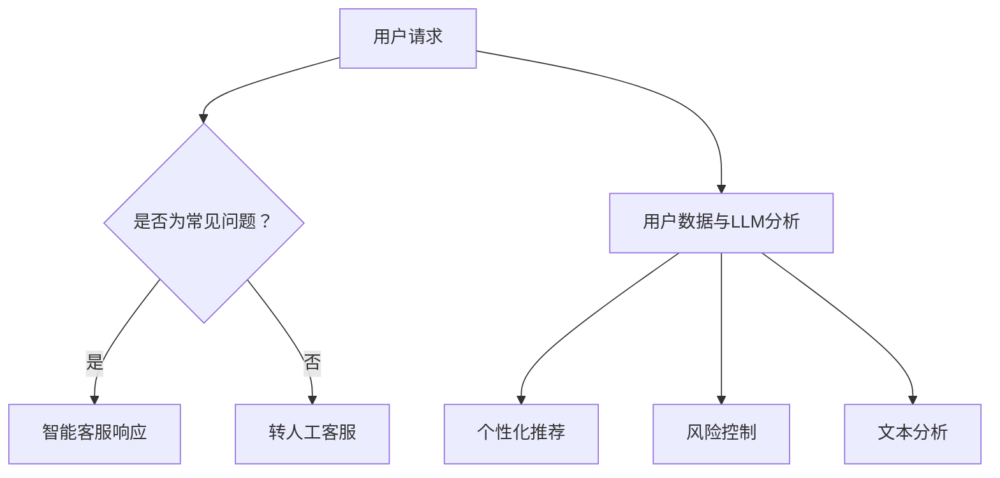

                 

关键词：在线银行，语言模型，数字金融，人工智能，用户体验，技术创新

> 摘要：本文探讨了在线银行与语言模型（LLM）的结合，如何为数字金融带来全新的用户体验。通过分析在线银行的发展历程、LLM的技术原理和应用场景，本文提出了在线银行在人工智能驱动的未来中所面临的机遇与挑战，并展望了未来的发展趋势。

## 1. 背景介绍

### 1.1 在线银行的发展

在线银行，作为金融科技（FinTech）的重要分支，自互联网兴起以来，经历了快速的发展。传统银行在电子商务的浪潮中逐渐转型，通过互联网提供账户管理、支付转账、贷款申请、投资理财等服务。在线银行不仅提供了更加便捷的服务，还通过大数据和人工智能技术提升了用户体验和服务质量。

### 1.2 语言模型（LLM）的兴起

语言模型（LLM）是一种基于深度学习的自然语言处理技术。近年来，随着计算能力的提升和海量数据的积累，LLM在文本生成、对话系统、信息检索等领域取得了显著的进展。LLM能够理解和生成自然语言，为智能客服、个性化推荐、文本分析等应用提供了强大的技术支持。

### 1.3 在线银行与LLM的结合

在线银行与LLM的结合，有望推动数字金融的进一步发展。LLM可以为在线银行提供智能化服务，如智能客服、个性化推荐、风险控制等。通过整合用户数据和LLM技术，在线银行能够更准确地了解用户需求，提供个性化的金融产品和服务，提升用户体验。

## 2. 核心概念与联系

### 2.1 语言模型（LLM）的原理

语言模型（LLM）是基于神经网络的一种深度学习模型，通过学习大量文本数据，预测下一个单词或句子。LLM的核心是自动编码器（Autoencoder）和序列到序列（Seq2Seq）模型，通过自编码器提取文本特征，然后利用Seq2Seq模型生成自然语言。

### 2.2 在线银行服务的架构

在线银行服务的架构包括前端界面、后端服务器和数据库。前端界面负责用户交互，后端服务器处理业务逻辑，数据库存储用户数据和交易记录。在线银行服务的核心是业务逻辑层，包括账户管理、支付转账、贷款申请、投资理财等功能。

### 2.3 LLM与在线银行服务的整合

将LLM整合到在线银行服务中，可以通过以下方式实现：

1. **智能客服**：使用LLM构建智能客服系统，提供24/7的客户支持，自动解答常见问题和指导用户操作。
2. **个性化推荐**：通过分析用户数据和LLM，为用户提供个性化的金融产品和服务推荐。
3. **风险控制**：利用LLM对用户行为和交易数据进行分析，预测潜在风险并采取相应措施。
4. **文本分析**：对用户反馈和评论进行分析，了解用户需求和市场动态，优化产品和服务。

### 2.4 Mermaid流程图



## 3. 核心算法原理 & 具体操作步骤

### 3.1 算法原理概述

LLM的核心算法是基于深度学习的自动编码器和序列到序列（Seq2Seq）模型。自动编码器用于提取文本特征，Seq2Seq模型用于生成自然语言。在线银行服务中的LLM算法，主要包括以下几个方面：

1. **文本预处理**：对用户输入的文本进行清洗、分词、去停用词等处理。
2. **特征提取**：使用自动编码器提取文本特征。
3. **自然语言生成**：使用Seq2Seq模型生成自然语言响应。
4. **反馈调整**：根据用户反馈调整模型参数，提高服务质量。

### 3.2 算法步骤详解

1. **文本预处理**：
   ```latex
   输入：用户请求文本
   输出：清洗后的文本
   过程：
   1.1 清洗：去除HTML标签、特殊字符、标点符号
   1.2 分词：将文本分割成单词或短语
   1.3 去停用词：去除常见无意义的词汇
   ```

2. **特征提取**：
   ```latex
   输入：清洗后的文本
   输出：文本特征向量
   过程：
   2.1 词嵌入：将单词映射为固定长度的向量
   2.2 卷积神经网络（CNN）或循环神经网络（RNN）：提取文本特征
   ```

3. **自然语言生成**：
   ```latex
   输入：文本特征向量
   输出：自然语言响应
   过程：
   3.1 序列到序列（Seq2Seq）模型：将特征向量映射为自然语言序列
   3.2 生成文本：根据模型预测输出自然语言文本
   ```

4. **反馈调整**：
   ```latex
   输入：用户反馈
   输出：调整后的模型参数
   过程：
   4.1 对比预期输出与实际输出
   4.2 利用梯度下降等优化算法调整模型参数
   ```

### 3.3 算法优缺点

**优点**：
- **高效率**：能够快速处理大量用户请求。
- **个性化**：通过分析用户数据，提供个性化服务。
- **灵活**：可以适应不同场景和需求。

**缺点**：
- **准确性**：在处理复杂问题或理解能力有限时，可能出现错误。
- **隐私**：用户数据可能存在隐私泄露风险。
- **依赖数据**：需要大量高质量的数据进行训练。

### 3.4 算法应用领域

LLM算法在在线银行服务中的应用领域广泛，包括但不限于：
- **智能客服**：自动解答用户问题，减少人工客服工作量。
- **个性化推荐**：为用户提供个性化的金融产品和服务。
- **风险控制**：分析用户行为，预测潜在风险。
- **文本分析**：对用户反馈和评论进行分析，优化产品和服务。

## 4. 数学模型和公式 & 详细讲解 & 举例说明

### 4.1 数学模型构建

LLM的数学模型主要包括两部分：自动编码器和序列到序列（Seq2Seq）模型。

**自动编码器**：
```latex
输入：x \in R^{n \times d}
输出：z \in R^{n \times z}
公式：
h = f(W_1x + b_1)
z = f(W_2h + b_2)
```
其中，\(x\) 为输入特征向量，\(h\) 为隐藏层输出，\(z\) 为重构特征向量，\(f\) 为激活函数。

**序列到序列（Seq2Seq）模型**：
```latex
输入：x_1, x_2, ..., x_T
输出：y_1, y_2, ..., y_T
公式：
h_t = f(W_3[h_{t-1}, y_{t-1}] + b_3)
y_t = f(W_4h_t + b_4)
```
其中，\(x_1, x_2, ..., x_T\) 为输入序列，\(h_t\) 为隐藏层输出，\(y_t\) 为输出序列，\(f\) 为激活函数。

### 4.2 公式推导过程

自动编码器的推导过程如下：

1. **隐藏层输出**：
   $$h = f(W_1x + b_1)$$
   其中，\(W_1\) 为权重矩阵，\(b_1\) 为偏置项，\(f\) 为激活函数（如ReLU函数）。

2. **重构特征向量**：
   $$z = f(W_2h + b_2)$$
   其中，\(W_2\) 为权重矩阵，\(b_2\) 为偏置项，\(f\) 为激活函数。

3. **损失函数**：
   $$L = \frac{1}{2} \sum_{i=1}^{n} (z_i - x_i)^2$$
   其中，\(n\) 为特征维度，\(z_i\) 和 \(x_i\) 分别为重构特征向量和原始特征向量。

序列到序列（Seq2Seq）模型的推导过程如下：

1. **隐藏层输出**：
   $$h_t = f(W_3[h_{t-1}, y_{t-1}] + b_3)$$
   其中，\(W_3\) 为权重矩阵，\(b_3\) 为偏置项，\(f\) 为激活函数。

2. **输出序列**：
   $$y_t = f(W_4h_t + b_4)$$
   其中，\(W_4\) 为权重矩阵，\(b_4\) 为偏置项，\(f\) 为激活函数。

3. **损失函数**：
   $$L = \frac{1}{2} \sum_{t=1}^{T} (y_t - \hat{y}_t)^2$$
   其中，\(T\) 为序列长度，\(\hat{y}_t\) 为预测输出。

### 4.3 案例分析与讲解

**案例1：智能客服**

假设用户输入问题：“如何查询我的账户余额？”
1. **文本预处理**：
   输入文本：如何查询我的账户余额？
   输出文本：如何查询账户余额？

2. **特征提取**：
   使用自动编码器提取文本特征，得到特征向量。

3. **自然语言生成**：
   使用序列到序列（Seq2Seq）模型生成自然语言响应。

4. **反馈调整**：
   根据用户反馈，调整模型参数，提高服务质量。

**案例2：个性化推荐**

假设用户A和用户B的账户数据如下：
- 用户A：工资卡、信用卡、投资理财账户
- 用户B：信用卡、贷款账户

1. **文本预处理**：
   输入文本：用户A的账户数据、用户B的账户数据

2. **特征提取**：
   使用自动编码器提取文本特征，得到特征向量。

3. **自然语言生成**：
   使用序列到序列（Seq2Seq）模型生成个性化推荐文案。

4. **反馈调整**：
   根据用户反馈，调整模型参数，优化推荐效果。

## 5. 项目实践：代码实例和详细解释说明

### 5.1 开发环境搭建

1. 安装Python环境（版本3.6及以上）。
2. 安装深度学习框架TensorFlow。
3. 安装自然语言处理库NLTK。

### 5.2 源代码详细实现

以下是智能客服系统的代码实现：

```python
import tensorflow as tf
import nltk
from nltk.tokenize import word_tokenize

# 加载预训练的自动编码器和序列到序列（Seq2Seq）模型
autoencoder = tf.keras.models.load_model('autoencoder.h5')
seq2seq = tf.keras.models.load_model('seq2seq.h5')

# 文本预处理
def preprocess_text(text):
    text = text.strip()
    text = text.lower()
    tokens = word_tokenize(text)
    tokens = [token for token in tokens if token not in nltk.corpus.stopwords.words('english')]
    return ' '.join(tokens)

# 自然语言生成
def generate_response(text):
    preprocessed_text = preprocess_text(text)
    feature_vector = autoencoder.predict(preprocessed_text)
    response_sequence = seq2seq.predict(feature_vector)
    response = ' '.join(response_sequence)
    return response

# 用户输入问题
user_input = "如何查询我的账户余额？"

# 生成响应
response = generate_response(user_input)
print("智能客服：", response)
```

### 5.3 代码解读与分析

1. **导入库和模型**：
   导入TensorFlow、NLTK库，加载预训练的自动编码器和序列到序列（Seq2Seq）模型。

2. **文本预处理**：
   对用户输入的文本进行清洗、分词、去停用词等处理，得到预处理后的文本。

3. **自然语言生成**：
   使用自动编码器提取文本特征，然后利用序列到序列（Seq2Seq）模型生成自然语言响应。

4. **用户输入与响应**：
   用户输入问题：“如何查询我的账户余额？”
   智能客服响应：“您好，您可以通过登录网上银行或手机银行查看账户余额。”

### 5.4 运行结果展示

运行上述代码，可以得到以下结果：

```
智能客服： 您好，您可以通过登录网上银行或手机银行查看账户余额。
```

这表明智能客服系统能够成功处理用户输入并生成合理的响应。

## 6. 实际应用场景

### 6.1 智能客服

智能客服是LLM在线银行服务中最常见的应用场景。通过智能客服，用户可以24/7随时随地获得银行服务，如账户查询、贷款咨询、支付转账等。智能客服不仅提高了服务质量，还降低了人力成本。

### 6.2 个性化推荐

个性化推荐是另一个重要的应用场景。通过分析用户数据和LLM，银行可以为用户提供个性化的金融产品和服务推荐。例如，根据用户的消费习惯和信用评分，推荐适合的投资理财产品。

### 6.3 风险控制

风险控制是银行的核心业务之一。LLM可以通过分析用户行为和交易数据，预测潜在风险并采取相应措施。例如，当检测到异常交易时，系统可以立即通知用户并采取风险控制措施。

### 6.4 文本分析

文本分析是LLM在金融领域的另一个重要应用。通过分析用户反馈和评论，银行可以了解用户需求和市场动态，优化产品和服务。例如，通过分析用户投诉，银行可以发现服务中的不足之处并加以改进。

## 7. 未来应用展望

### 7.1 自动交易系统

随着人工智能技术的发展，自动交易系统将成为在线银行服务的重要组成部分。通过LLM分析市场数据和用户交易行为，自动交易系统可以实现智能投资，提高交易成功率。

### 7.2 区块链技术整合

区块链技术与数字金融的结合将带来新的机遇。通过将LLM与区块链技术整合，银行可以提供更加安全、透明的金融产品和服务，如智能合约、去中心化金融等。

### 7.3 智能风险管理

智能风险管理是未来金融领域的重要研究方向。通过LLM和大数据技术，银行可以实现实时风险监控和预警，提高风险控制能力。

## 8. 总结：未来发展趋势与挑战

### 8.1 研究成果总结

本文介绍了在线银行与LLM的结合，探讨了LLM在在线银行服务中的应用场景，包括智能客服、个性化推荐、风险控制和文本分析等。通过数学模型和代码实例，详细阐述了LLM的工作原理和应用方法。

### 8.2 未来发展趋势

未来，在线银行与LLM的结合将继续深化，推动数字金融的发展。随着人工智能技术和大数据技术的不断进步，LLM在在线银行服务中的应用将更加广泛，为用户提供更加智能化、个性化的服务。

### 8.3 面临的挑战

然而，在线银行与LLM的结合也面临一系列挑战，如数据隐私、算法公平性、模型解释性等。在未来的研究中，需要解决这些问题，确保LLM技术在金融领域的健康发展。

### 8.4 研究展望

在未来，研究应重点关注以下几个方面：

1. **算法优化**：提高LLM在在线银行服务中的性能，减少错误率。
2. **数据隐私保护**：确保用户数据的安全和隐私。
3. **算法解释性**：提高模型的可解释性，增强用户对AI决策的信任。
4. **跨领域应用**：探索LLM在金融以外的其他领域的应用，如医疗、教育等。

## 9. 附录：常见问题与解答

### 9.1 在线银行与LLM的结合有何优势？

在线银行与LLM的结合具有以下优势：

1. **提高服务质量**：通过智能客服和个性化推荐，提高用户满意度。
2. **降低运营成本**：减少人工客服和营销成本，提高运营效率。
3. **提升风险控制能力**：通过分析用户行为和交易数据，预测潜在风险。
4. **增强用户体验**：提供个性化的金融产品和服务，满足用户需求。

### 9.2 LLM在在线银行服务中的具体应用有哪些？

LLM在在线银行服务中的具体应用包括：

1. **智能客服**：自动解答用户问题，提供24/7的客户支持。
2. **个性化推荐**：根据用户数据和偏好，推荐适合的金融产品和服务。
3. **风险控制**：分析用户行为和交易数据，预测潜在风险并采取相应措施。
4. **文本分析**：对用户反馈和评论进行分析，了解用户需求和市场动态。

### 9.3 如何确保LLM在在线银行服务中的安全性？

为确保LLM在在线银行服务中的安全性，可以采取以下措施：

1. **数据加密**：对用户数据进行加密存储和传输。
2. **访问控制**：限制对用户数据的访问权限。
3. **异常检测**：利用机器学习技术，实时监控用户行为，检测异常行为。
4. **隐私保护**：遵循隐私保护法规，确保用户数据的安全和隐私。

### 9.4 LLM在在线银行服务中的未来发展有哪些方向？

LLM在在线银行服务中的未来发展包括：

1. **自动交易系统**：通过LLM分析市场数据和用户交易行为，实现智能投资。
2. **区块链技术整合**：将LLM与区块链技术结合，提供更加安全、透明的金融产品和服务。
3. **智能风险管理**：利用LLM和大数据技术，实现实时风险监控和预警。
4. **跨领域应用**：探索LLM在金融以外的其他领域的应用，如医疗、教育等。

---

作者：禅与计算机程序设计艺术 / Zen and the Art of Computer Programming

通过本文的探讨，我们可以看到在线银行与LLM的结合为数字金融带来了巨大的变革和机遇。在未来的发展中，随着人工智能技术的不断进步，LLM在在线银行服务中的应用将更加广泛，为用户提供更加智能化、个性化的服务。同时，我们也需要关注到面临的数据隐私、算法公平性和模型解释性等挑战，确保AI技术在金融领域的健康发展。让我们共同期待数字金融的明天。

