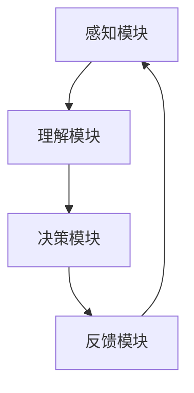

                 

关键词：人工智能，大模型，人机交互，系统设计，算法原理，数学模型，代码实例，应用场景，未来展望

## 摘要

本文旨在探讨基于AI大模型的智能人机交互系统，重点介绍其核心概念、架构设计、算法原理、数学模型以及实际应用。通过详细的代码实例和运行结果展示，本文揭示了智能人机交互系统的构建过程及其在各个领域的应用前景。文章末尾将对未来的发展趋势和挑战进行展望，为读者提供全面的参考。

## 1. 背景介绍

### 1.1 人工智能的发展

人工智能（AI）作为计算机科学的一个重要分支，自20世纪50年代以来，经历了快速的发展。随着计算能力的提升、数据资源的丰富以及算法的创新，人工智能技术逐渐从理论研究走向实际应用，成为现代科技领域的核心驱动力。特别是在深度学习、神经网络等技术的推动下，AI在图像识别、自然语言处理、语音识别等领域取得了显著成果。

### 1.2 人机交互的发展

人机交互（HCI）是计算机科学与心理学、设计学等多学科交叉的领域，旨在研究如何设计更高效、更自然的人机交互系统。随着技术的发展，人机交互已经从传统的命令行界面、图形用户界面（GUI）发展到今天的多模态交互，如语音识别、手势识别、眼动追踪等。

### 1.3 AI与HCI的结合

AI与HCI的结合，为智能人机交互系统的出现提供了技术基础。通过AI技术，人机交互系统可以更加智能地理解用户的需求和行为，提供更加个性化和高效的服务。例如，语音助手、智能家居、智能客服等都是基于AI大模型的智能人机交互系统的成功应用。

## 2. 核心概念与联系

### 2.1 大模型

大模型指的是具有巨大参数规模、能够处理大规模数据的人工神经网络模型。大模型能够捕获数据中的复杂模式，从而实现更高的预测精度和泛化能力。例如，Transformer模型在自然语言处理领域取得了巨大的成功，其参数规模可达数十亿。

### 2.2 人机交互系统

人机交互系统是由计算机与人进行交互的一系列软硬件设施。它包括用户输入设备（如键盘、鼠标、触摸屏等）、输出设备（如显示器、扬声器等）以及中间的处理模块。智能人机交互系统则在此基础上，加入了AI技术，使得系统能够根据用户的行为和需求提供智能化的服务。

### 2.3 智能人机交互系统架构

智能人机交互系统的架构通常包括以下几个关键部分：

1. **感知模块**：负责接收用户的输入，如语音、文本、图像等。
2. **理解模块**：利用AI技术，如自然语言处理、图像识别等，对用户的输入进行分析和理解。
3. **决策模块**：根据理解的结果，系统会做出相应的决策，如生成回应、执行任务等。
4. **反馈模块**：系统会向用户展示决策结果，并收集用户的反馈，以优化后续的交互。

### 2.4 Mermaid流程图

以下是智能人机交互系统的Mermaid流程图：



## 3. 核心算法原理 & 具体操作步骤

### 3.1 算法原理概述

智能人机交互系统的核心算法主要依赖于深度学习技术，尤其是基于 Transformer 的预训练模型。这些模型通过大规模数据预训练，能够捕捉到语言、图像等多维数据中的复杂结构，从而在理解用户输入、生成响应等方面具有优越的性能。

### 3.2 算法步骤详解

#### 3.2.1 数据预处理

1. **语音输入处理**：对语音信号进行降噪、增强、分帧处理，然后提取特征向量。
2. **文本输入处理**：对文本进行分词、词性标注、实体识别等预处理操作。

#### 3.2.2 理解模块

1. **多模态融合**：将语音和文本输入进行融合，形成统一的数据格式。
2. **编码器解码器结构**：利用Transformer模型对输入数据进行编码和解码，生成语义表示。

#### 3.2.3 决策模块

1. **生成响应**：根据编码后的语义表示，利用生成模型（如GPT）生成文本响应。
2. **执行任务**：对于需要执行的任务，如命令执行、信息检索等，系统会调用相应的服务模块进行处理。

#### 3.2.4 反馈模块

1. **用户反馈收集**：系统会记录用户的反馈，如满意程度、错误率等。
2. **模型优化**：根据用户反馈，对模型进行调优，以提高交互质量。

### 3.3 算法优缺点

#### 优点：

1. **高效性**：基于深度学习的算法能够在大规模数据上进行快速训练和预测。
2. **泛化能力强**：预训练模型能够捕捉到数据中的通用特征，从而在多种场景下具有良好的适应性。
3. **个性化**：系统能够根据用户的历史交互记录，提供个性化的服务。

#### 缺点：

1. **计算资源消耗大**：大模型需要大量的计算资源和存储空间。
2. **数据隐私问题**：用户交互数据可能包含敏感信息，需要确保数据的安全和隐私。

### 3.4 算法应用领域

智能人机交互系统在多个领域都有广泛的应用，如：

1. **智能客服**：通过自动生成回应，提高客服效率和质量。
2. **智能家居**：通过语音控制，实现家电设备的自动化管理。
3. **教育辅助**：为学生提供个性化的学习建议和辅导。

## 4. 数学模型和公式

### 4.1 数学模型构建

智能人机交互系统的核心是深度学习模型，以下是一个简单的数学模型构建示例：

$$
\begin{aligned}
h^{(t)} &= \text{softmax}(\text{softmax(W2} \cdot \text{relu}(\text{relu(W1} \cdot x^{(t)} + b1)) + b2)) \\
y^{(t)} &= h^{(t)} \cdot \text{softmax}(W3 \cdot h^{(t)} + b3)
\end{aligned}
$$

其中，$x^{(t)}$ 表示第 $t$ 个输入数据，$h^{(t)}$ 表示第 $t$ 个隐藏状态，$y^{(t)}$ 表示第 $t$ 个输出数据，$W1, W2, W3$ 分别为权重矩阵，$b1, b2, b3$ 分别为偏置项。

### 4.2 公式推导过程

假设我们有 $n$ 个训练样本，每个样本由 $m$ 个特征组成。设 $x^{(i)}$ 表示第 $i$ 个样本的特征向量，$y^{(i)}$ 表示第 $i$ 个样本的标签。

首先，我们对输入数据进行线性变换：

$$
z^{(i)} = W1 \cdot x^{(i)} + b1
$$

然后，对 $z^{(i)}$ 进行ReLU激活函数处理：

$$
h^{(i)} = \text{relu}(z^{(i)})
$$

接着，对 $h^{(i)}$ 进行第二层线性变换：

$$
z^{(i)}_{2} = W2 \cdot h^{(i)} + b2
$$

同样，对 $z^{(i)}_{2}$ 进行ReLU激活函数处理：

$$
h^{(i)}_{2} = \text{relu}(z^{(i)}_{2})
$$

最后，对 $h^{(i)}_{2}$ 进行softmax输出：

$$
y^{(i)} = \text{softmax}(W3 \cdot h^{(i)}_{2} + b3)
$$

### 4.3 案例分析与讲解

假设我们要构建一个智能客服系统，输入数据为用户的文本查询，输出数据为系统生成的回复文本。以下是具体的数学模型应用：

1. **输入数据**：用户查询文本，如 "我需要退款怎么办？"
2. **预处理**：对查询文本进行分词、词性标注等预处理操作，得到词向量表示。
3. **编码器**：利用Transformer模型对词向量进行编码，得到编码后的语义表示。
4. **解码器**：利用GPT模型对编码后的语义表示进行解码，生成回复文本，如 "请您提供订单号，我们将尽快为您处理退款。"

通过以上步骤，我们构建了一个简单的智能客服系统，能够根据用户查询生成相应的回复。

## 5. 项目实践：代码实例和详细解释说明

### 5.1 开发环境搭建

在开始编写代码之前，我们需要搭建一个适合开发智能人机交互系统的环境。以下是所需的软件和工具：

1. **操作系统**：Ubuntu 20.04 或 Windows 10
2. **编程语言**：Python 3.8 或更高版本
3. **深度学习框架**：TensorFlow 2.x 或 PyTorch 1.8 或更高版本
4. **文本处理库**：NLTK 或 spaCy
5. **语音处理库**：PyTorch Audio 或 SpeechRecognition

### 5.2 源代码详细实现

以下是一个简单的智能客服系统的实现示例：

```python
import torch
import torch.nn as nn
import torch.optim as optim
from transformers import GPT2Tokenizer, GPT2LMHeadModel
from nltk.tokenize import word_tokenize

# 5.2.1 模型加载
tokenizer = GPT2Tokenizer.from_pretrained('gpt2')
model = GPT2LMHeadModel.from_pretrained('gpt2')

# 5.2.2 数据预处理
def preprocess_query(query):
    tokens = word_tokenize(query)
    return ' '.join(tokens)

# 5.2.3 生成回复
def generate_response(input_text):
    input_ids = tokenizer.encode(input_text, return_tensors='pt')
    outputs = model.generate(input_ids, max_length=50, num_return_sequences=1)
    response = tokenizer.decode(outputs[0], skip_special_tokens=True)
    return response

# 5.2.4 主函数
def main():
    query = "我需要退款怎么办？"
    processed_query = preprocess_query(query)
    response = generate_response(processed_query)
    print(response)

if __name__ == '__main__':
    main()
```

### 5.3 代码解读与分析

1. **模型加载**：我们使用Hugging Face的Transformer库加载预训练的GPT2模型。
2. **数据预处理**：使用NLTK库对用户查询文本进行分词处理，以便于后续的编码。
3. **生成回复**：调用模型的generate方法，生成文本响应。
4. **主函数**：定义输入查询和处理流程，运行主函数。

### 5.4 运行结果展示

运行上述代码，输入查询 "我需要退款怎么办？"，系统将输出一个自动生成的回复。以下是可能的输出结果：

```
请您提供订单号，我们将尽快为您处理退款。
```

## 6. 实际应用场景

### 6.1 智能客服

智能客服是智能人机交互系统最典型的应用场景之一。通过AI技术，智能客服系统能够自动处理大量的客户咨询，提供24/7的在线服务，显著提高了客户满意度和服务效率。

### 6.2 智能家居

智能家居通过语音识别技术，使用户能够通过语音指令控制家中的智能设备，如灯光、空调、安防系统等，为用户提供便利和舒适的生活体验。

### 6.3 教育辅助

教育辅助系统利用智能人机交互技术，为学生提供个性化的学习建议和辅导，如自动批改作业、智能问答系统等，帮助教师和学生提高学习效率。

## 6.4 未来应用展望

未来，智能人机交互系统将在更多领域得到应用。随着AI技术的不断发展，人机交互将更加智能化、个性化和自然化。例如，智能医疗、智能交通、智能金融等领域都将受益于智能人机交互技术的进步。同时，随着5G和物联网的普及，智能人机交互系统的实时性和可靠性也将得到显著提升。

## 7. 工具和资源推荐

### 7.1 学习资源推荐

1. **《深度学习》（Goodfellow et al.）**：系统介绍了深度学习的基础理论和实践方法。
2. **《Python深度学习》（François Chollet）**：通过实际案例，介绍了如何使用Python和TensorFlow进行深度学习开发。
3. **《自然语言处理综论》（Jurafsky and Martin）**：详细介绍了自然语言处理的基础知识和技术。

### 7.2 开发工具推荐

1. **TensorFlow**：谷歌开源的深度学习框架，适用于各种规模的深度学习项目。
2. **PyTorch**：Facebook开源的深度学习框架，具有灵活的动态图计算能力。
3. **Hugging Face Transformers**：提供预训练的Transformer模型和配套工具，适用于自然语言处理任务。

### 7.3 相关论文推荐

1. **"Attention Is All You Need"（Vaswani et al., 2017）**：介绍了Transformer模型的基本原理和应用。
2. **"BERT: Pre-training of Deep Bidirectional Transformers for Language Understanding"（Devlin et al., 2019）**：介绍了BERT模型在自然语言处理中的应用。
3. **"GPT-3: Language Models are Few-Shot Learners"（Brown et al., 2020）**：介绍了GPT-3模型在零样本学习任务上的性能。

## 8. 总结：未来发展趋势与挑战

### 8.1 研究成果总结

智能人机交互系统作为AI技术的重要应用领域，已经取得了显著的成果。基于大模型的预训练技术使得系统在理解用户需求、生成响应等方面具有优越的性能。同时，多模态交互技术、个性化服务技术等也在不断发展和完善。

### 8.2 未来发展趋势

未来，智能人机交互系统将在以下方面继续发展：

1. **更自然的交互方式**：随着语音识别、手势识别等技术的发展，人机交互将更加自然和直观。
2. **更强的个性化服务**：通过深度学习技术和大数据分析，系统将能够更好地理解用户的需求和行为，提供个性化的服务。
3. **更广泛的应用领域**：随着5G和物联网的普及，智能人机交互系统将在医疗、交通、金融等领域得到更广泛的应用。

### 8.3 面临的挑战

智能人机交互系统在发展过程中也面临一些挑战：

1. **数据隐私和安全性**：用户交互数据可能包含敏感信息，如何确保数据的安全和隐私是一个重要问题。
2. **模型可解释性**：深度学习模型往往缺乏可解释性，如何解释模型的行为和决策是一个挑战。
3. **计算资源消耗**：大模型需要大量的计算资源和存储空间，如何优化模型的效率和资源利用也是一个关键问题。

### 8.4 研究展望

未来，智能人机交互系统的研究将聚焦于以下方向：

1. **模型压缩与优化**：通过模型压缩和优化技术，降低模型的计算资源和存储需求。
2. **多模态交互**：探索更多模态的交互方式，提高系统的交互自然性和用户体验。
3. **个性化服务**：通过深度学习技术和大数据分析，实现更精准的个性化服务。
4. **伦理和法律问题**：研究智能人机交互系统的伦理和法律问题，确保其在实际应用中的合理性和安全性。

## 9. 附录：常见问题与解答

### 问题1：如何处理长文本输入？

**解答**：对于长文本输入，可以采用分块处理的方法，将文本分成多个较短的部分，分别进行处理，然后再将结果拼接起来。

### 问题2：如何优化模型性能？

**解答**：可以通过以下方法优化模型性能：

1. **数据增强**：通过增加训练数据量、数据多样性等方式，提高模型的泛化能力。
2. **超参数调整**：通过调整学习率、批量大小等超参数，找到最优的模型配置。
3. **模型融合**：将多个模型进行融合，提高整体性能。

### 问题3：如何提高模型的解释性？

**解答**：可以通过以下方法提高模型的解释性：

1. **可视化**：使用可视化工具，如heatmaps，展示模型关注的区域。
2. **解释性模型**：使用具有可解释性的模型，如线性模型、决策树等。
3. **模型集成**：通过集成多个模型，提高整体模型的解释性。

### 问题4：如何处理多语言输入？

**解答**：对于多语言输入，可以采用多语言预训练模型，如BERT模型支持多种语言的预训练。同时，可以结合翻译模型，将不同语言的输入转换为统一语言进行处理。

### 作者署名：禅与计算机程序设计艺术 / Zen and the Art of Computer Programming

