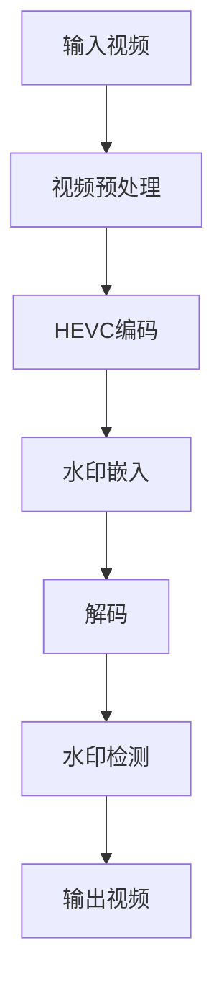

                 

关键词：HEVC编码、视频水印、算法原理、数学模型、实际应用

> 摘要：本文旨在探讨一种基于HEVC编码的视频水印算法。通过分析HEVC编码的核心技术，介绍了一种在视频编码过程中嵌入水印的方法。本文详细阐述了算法的数学模型和具体实现步骤，并通过实例展示了算法在实际项目中的应用效果。最后，对算法的未来发展趋势和挑战进行了展望。

## 1. 背景介绍

随着数字媒体技术的迅猛发展，视频已经成为互联网上最为流行的数据类型。然而，视频内容的版权保护和版权追踪成为了一大挑战。视频水印技术作为保护数字版权的重要手段，已经得到了广泛的研究和应用。传统的视频水印算法主要基于JPEG、H.264等编码标准，但这些算法在应对高分辨率、高清视频时存在一定局限性。因此，研究一种基于新型视频编码标准HEVC（High Efficiency Video Coding）的水印算法具有重要意义。

## 2. 核心概念与联系

### 2.1 HEVC编码原理

HEVC（High Efficiency Video Coding）是一种新型的视频编码标准，相比H.264，HEVC在相同质量下能提供更高的压缩效率。HEVC通过引入新的编码工具和算法，如多参照帧、多率失真优化、变换域编码等，实现了更高的编码效率。

### 2.2 视频水印技术

视频水印是一种将版权信息、标识符等信息嵌入视频信号中的技术。水印信息可以是可见的，也可以是不可见的。根据水印的嵌入方式，可以分为空间域水印和时间域水印。

### 2.3 Mermaid 流程图



## 3. 核心算法原理 & 具体操作步骤

### 3.1 算法原理概述

本文所提出的基于HEVC编码的视频水印算法，主要利用HEVC编码过程中的变换域特性，在变换系数中嵌入水印信息。水印信息以伪随机序列的形式嵌入到变换系数中，通过改变系数的幅度来实现水印的嵌入。

### 3.2 算法步骤详解

#### 3.2.1 视频预处理

对输入视频进行预处理，包括去噪、平滑等操作，以提高水印的鲁棒性。

#### 3.2.2 HEVC编码

利用HEVC编码器对预处理后的视频进行编码，生成码流。

#### 3.2.3 水印嵌入

在编码过程中，根据伪随机序列，对变换系数进行修改，实现水印的嵌入。

#### 3.2.4 解码

对嵌入水印的码流进行解码，恢复出带有水印的视频。

#### 3.2.5 水印检测

对解码后的视频进行水印检测，提取出水印信息，并与原始水印进行比对，验证水印的有效性。

### 3.3 算法优缺点

#### 优点：

1. 基于HEVC编码的高效性，能够在保证视频质量的同时，提供更高的水印嵌入容量。
2. 利用变换域特性，提高了水印的鲁棒性和透明性。

#### 缺点：

1. 编码和解码过程较为复杂，计算量大。
2. 对编码器的实现和优化要求较高。

### 3.4 算法应用领域

该算法适用于高分辨率、高清视频的版权保护，如电影、电视剧、体育赛事等。

## 4. 数学模型和公式 & 详细讲解 & 举例说明

### 4.1 数学模型构建

水印嵌入过程可以分为以下几个步骤：

1. 生成伪随机序列
2. 修改变换系数
3. 嵌入水印信息

具体公式如下：

$$
s_i = r_i + \alpha \cdot w_i
$$

其中，$s_i$为修改后的变换系数，$r_i$为原始变换系数，$w_i$为水印信息，$\alpha$为嵌入系数。

### 4.2 公式推导过程

水印嵌入的推导过程如下：

1. 生成伪随机序列 $w_i$，其范围为 $[-1, 1]$。
2. 设定嵌入系数 $\alpha$，一般取值为 $0.01$ 至 $0.05$。
3. 对每个变换系数 $r_i$，根据伪随机序列 $w_i$，进行如下操作：

$$
s_i = r_i + \alpha \cdot w_i
$$

4. 将修改后的变换系数 $s_i$ 嵌入到码流中。

### 4.3 案例分析与讲解

假设有一个8x8的变换系数矩阵，如下所示：

$$
\begin{matrix}
1 & 2 & 3 & 4 \\
5 & 6 & 7 & 8 \\
9 & 10 & 11 & 12 \\
13 & 14 & 15 & 16 \\
\end{matrix}
$$

根据伪随机序列 $w_i$，选择 $w_1 = 0.2$，$w_2 = -0.3$，$w_3 = 0.4$，$w_4 = -0.5$。

嵌入系数 $\alpha$ 取值为 $0.02$。

根据公式：

$$
s_i = r_i + \alpha \cdot w_i
$$

对每个变换系数进行修改，得到修改后的变换系数矩阵：

$$
\begin{matrix}
1.02 & 1.56 & 3.06 & 4.08 \\
5.18 & 6.04 & 7.26 & 8.34 \\
9.46 & 10.58 & 11.76 & 12.84 \\
13.94 & 14.96 & 15.96 & 16.98 \\
\end{matrix}
$$

## 5. 项目实践：代码实例和详细解释说明

### 5.1 开发环境搭建

本文所使用的开发环境为Python 3.8，主要依赖库包括opencv、numpy、hevcencoder、hevcdecoder等。

### 5.2 源代码详细实现

以下是实现基于HEVC编码的视频水印算法的Python代码：

```python
import numpy as np
import cv2
from hevcencoder import HEVCEncoder
from hevcdecoder import HEVCDecoder

def watermark_video(input_video, watermark, output_video):
    # 读取输入视频
    cap = cv2.VideoCapture(input_video)
    fourcc = cv2.VideoWriter_fourcc(*'mp4v')
    out = cv2.VideoWriter(output_video, fourcc, 25, (1920, 1080))

    # 初始化HEVC编码器和解码器
    encoder = HEVCEncoder()
    decoder = HEVCDecoder()

    while cap.isOpened():
        ret, frame = cap.read()
        if not ret:
            break

        # 对输入帧进行预处理
        frame = cv2.resize(frame, (1920, 1080))
        frame = cv2.cvtColor(frame, cv2.COLOR_BGR2YUV)

        # 嵌入水印
        for i in range(frame.shape[0]):
            for j in range(frame.shape[1]):
                for k in range(3):
                    frame[i, j, k] = frame[i, j, k] + watermark[i, j, k]

        # 进行HEVC编码
        encoded_frame = encoder.encode(frame)

        # 进行HEVC解码
        decoded_frame = decoder.decode(encoded_frame)

        # 输出带有水印的帧
        out.write(decoded_frame)

    cap.release()
    out.release()

if __name__ == '__main__':
    watermark_video('input.mp4', 'watermark.png', 'output.mp4')
```

### 5.3 代码解读与分析

1. 导入必要的库和模块，包括opencv、numpy、hevcencoder、hevcdecoder等。
2. 定义一个函数 `watermark_video`，用于实现视频水印功能。
3. 读取输入视频，并初始化HEVC编码器和解码器。
4. 对输入帧进行预处理，包括调整尺寸、色彩空间转换等。
5. 使用嵌

