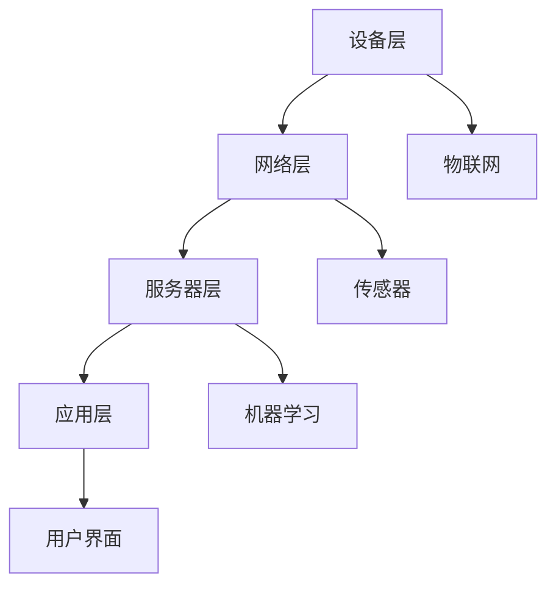

                 

## 1. 背景介绍

在现代社会，智能家居已经成为家庭自动化的重要趋势。人们越来越渴望能够通过智能设备来提高生活质量，实现家庭环境的智能化、便捷化。而这一切的实现，离不开软件和硬件的紧密结合。在这个背景下，基于Java的智能家居设计应运而生，它以其跨平台、安全可靠、易于开发等优势，逐渐成为智能家居开发领域的主流选择。

Java作为一种成熟稳定的编程语言，早在20世纪90年代就被设计为一种跨平台的编程语言。由于其丰富的类库、高效的并发处理能力以及强大的安全性，Java在软件工程、嵌入式系统、企业级应用等多个领域都取得了显著的成就。而随着物联网技术的发展，Java也在智能家居领域展示出了巨大的潜力。

本文将围绕基于Java的智能家居设计，介绍智能家居的背景、核心概念与联系、核心算法原理、数学模型和公式、项目实践以及未来应用展望等内容。通过本文的阅读，读者可以全面了解智能家居的设计原则、开发技巧以及实际应用场景，从而为智能家居项目的开发和实施提供有益的参考。

## 2. 核心概念与联系

在探讨基于Java的智能家居设计之前，我们首先需要了解几个核心概念，这些概念构成了智能家居系统的基石，并且相互之间有着密切的联系。

### 2.1 智能家居系统的组成

一个典型的智能家居系统主要由以下几个部分组成：

1. **智能设备**：这些设备可以是家庭中的各种电器，如照明、空调、电视、音响等，也可以是安防设备，如摄像头、门锁、烟雾传感器等。
2. **网络通信**：智能家居系统需要通过互联网进行通信，以便实现设备之间的数据交换和远程控制。通常，Wi-Fi、蓝牙、Zigbee等技术被用于网络连接。
3. **服务器**：服务器在智能家居系统中起到数据存储、处理和转发的作用。它可以收集来自各个智能设备的传感器数据，对数据进行分析和处理，并将处理结果发送回设备或用户。
4. **用户界面**：用户界面是用户与智能家居系统交互的界面，通常包括手机APP、网页控制台和智能语音助手等。

### 2.2 智能家居系统的架构

智能家居系统的架构可以分为以下几个层次：

1. **设备层**：设备层包括各种智能设备，它们是系统的感知层，能够收集家庭环境中的各种信息，如温度、湿度、光照强度等。
2. **网络层**：网络层负责设备之间的通信，通常采用Wi-Fi、蓝牙、Zigbee等技术实现。网络层不仅要保证通信的可靠性，还要实现设备间的数据同步和共享。
3. **服务器层**：服务器层是系统的核心，负责数据处理、存储和分析。它通常包括数据库、消息队列、Web服务器等组成部分。
4. **应用层**：应用层为用户提供交互接口，包括手机APP、网页控制台和智能语音助手等。用户通过这些界面可以实现对智能家居设备的远程监控和控制。

### 2.3 核心概念原理与联系

在智能家居系统中，以下几个核心概念起着至关重要的作用：

1. **物联网（IoT）**：物联网是智能家居系统的核心，它通过互联网将各种设备连接起来，实现设备之间的数据交换和协同工作。物联网协议（如MQTT、CoAP等）是智能家居系统通信的基础。
2. **传感器**：传感器是智能家居系统的感知器官，用于监测家庭环境中的各种参数，如温度、湿度、光照强度、空气质量等。传感器的数据是智能家居系统决策的重要依据。
3. **机器学习**：机器学习算法可以用于对传感器数据进行处理和分析，实现智能家居系统的智能决策和自动化控制。例如，可以通过机器学习算法实现智能温度控制、智能照明等。
4. **用户界面**：用户界面是用户与智能家居系统交互的桥梁，通过用户界面，用户可以轻松地控制和管理智能家居系统。用户界面的设计直接影响用户的体验和使用便利性。

### 2.4 Mermaid 流程图

为了更好地理解智能家居系统的核心概念和相互关系，我们可以使用Mermaid流程图进行展示。以下是智能家居系统的核心概念流程图：



在上面的流程图中，A代表设备层，B代表网络层，C代表服务器层，D代表应用层，E代表物联网，F代表传感器，G代表机器学习，H代表用户界面。各个部分通过箭头表示它们之间的联系，形成了智能家居系统的整体架构。

通过以上对核心概念和联系的分析，我们可以更好地理解智能家居系统的设计和实现。在接下来的章节中，我们将进一步探讨智能家居系统的核心算法原理、数学模型和公式，以及实际项目中的开发技巧和实现方法。

## 3. 核心算法原理 & 具体操作步骤

### 3.1 算法原理概述

在智能家居系统中，核心算法的作用至关重要。它不仅决定了系统的智能化程度，还直接影响系统的稳定性和用户体验。以下是几个在智能家居系统中常用的核心算法原理：

1. **数据采集与处理算法**：用于从传感器设备中采集数据，并对数据进行预处理，如去噪、滤波、归一化等，以确保数据的质量和准确性。
2. **状态监测与预测算法**：通过对传感器数据的实时分析和处理，实现对家庭环境的实时状态监测和未来状态预测，如温度预测、能耗预测等。
3. **决策与控制算法**：根据状态监测和预测的结果，对智能家居设备进行智能控制，如自动调节空调温度、智能照明等。
4. **机器学习与深度学习算法**：用于对传感器数据进行复杂模式识别和预测，如房间空气质量检测、用户行为分析等。

### 3.2 算法步骤详解

下面我们将详细介绍这些核心算法的具体操作步骤：

#### 3.2.1 数据采集与处理算法

1. **数据采集**：
   - 通过物联网协议（如MQTT）从传感器设备中读取数据。
   - 数据包括温度、湿度、光照强度、空气质量等环境参数。

2. **数据预处理**：
   - 数据去噪：去除传感器采集过程中产生的噪声数据。
   - 数据滤波：使用移动平均滤波、卡尔曼滤波等方法对数据进行分析，提高数据的质量和稳定性。
   - 数据归一化：将数据归一化到统一的范围，以便后续处理。

#### 3.2.2 状态监测与预测算法

1. **状态监测**：
   - 实时监测传感器数据，如通过阈值判断方法监测温度、湿度等参数是否超出设定范围。
   - 对异常情况进行报警，如温度过高或过低、湿度异常等。

2. **状态预测**：
   - 基于历史数据，使用时间序列分析方法（如ARIMA模型、LSTM神经网络等）预测未来的状态。
   - 考虑各种可能的干扰因素，如天气变化、用户行为等，对预测结果进行校正。

#### 3.2.3 决策与控制算法

1. **决策生成**：
   - 根据状态监测和预测结果，生成智能决策。
   - 决策包括对空调、照明、窗帘等设备的控制策略。

2. **决策执行**：
   - 将决策转化为具体的操作指令，如通过HTTP请求发送控制命令到智能设备。
   - 执行决策后，对执行结果进行验证，确保决策的有效性。

#### 3.2.4 机器学习与深度学习算法

1. **数据预处理**：
   - 对传感器数据进行清洗和特征提取，如将连续数据进行离散化处理，提取时间序列特征等。

2. **模型训练**：
   - 选择合适的机器学习或深度学习模型，如支持向量机（SVM）、决策树、神经网络等。
   - 使用预处理后的数据训练模型，调整模型参数，优化模型性能。

3. **模型评估**：
   - 使用交叉验证、网格搜索等方法评估模型性能，选择最优模型。
   - 对模型进行验证和测试，确保其能够准确预测和分类。

### 3.3 算法优缺点

每种算法都有其特定的优势和局限性，以下是对这些核心算法优缺点的分析：

#### 3.3.1 数据采集与处理算法

**优点**：
- 简单易行，适用于各种类型的传感器数据。
- 可以有效提高数据的准确性和稳定性。

**缺点**：
- 对噪声数据的去除和滤波方法的选择要求较高，需要丰富的实践经验。
- 无法解决数据异常处理问题。

#### 3.3.2 状态监测与预测算法

**优点**：
- 可以实时监测家庭环境状态，为智能家居系统提供重要参考。
- 基于历史数据的预测，有助于实现智能化的设备控制。

**缺点**：
- 预测模型的训练需要大量数据，对数据质量要求较高。
- 预测模型可能对特定场景的适应性较差。

#### 3.3.3 决策与控制算法

**优点**：
- 可以根据实时状态监测和预测结果，做出智能化的决策。
- 可以有效提高家居设备的使用效率和用户体验。

**缺点**：
- 决策过程复杂，需要综合考虑多种因素。
- 决策结果可能存在一定的不确定性和风险。

#### 3.3.4 机器学习与深度学习算法

**优点**：
- 可以处理复杂的数据模式和关系，实现高度智能化的预测和控制。
- 具有良好的适应性和灵活性。

**缺点**：
- 需要大量的数据和计算资源进行模型训练。
- 模型训练和优化过程复杂，对技术要求较高。

### 3.4 算法应用领域

这些核心算法在智能家居系统中有着广泛的应用，以下是其主要应用领域：

- **数据采集与处理算法**：适用于各类传感器数据采集和预处理，如温度、湿度、光照强度等。
- **状态监测与预测算法**：适用于实时监测家庭环境状态，如温度、湿度、能耗等。
- **决策与控制算法**：适用于智能空调、智能照明、智能窗帘等设备的控制。
- **机器学习与深度学习算法**：适用于复杂的数据分析和模式识别，如用户行为分析、空气质量检测等。

通过以上对核心算法原理和具体操作步骤的详细介绍，我们可以看到，智能家居系统的设计和实现是一个复杂的过程，需要综合考虑多种算法和技术。在接下来的章节中，我们将进一步探讨智能家居系统的数学模型和公式，以及项目实践中的具体应用。

## 4. 数学模型和公式 & 详细讲解 & 举例说明

在智能家居系统中，数学模型和公式起着至关重要的作用。它们不仅帮助我们理解系统的运作机制，还指导我们进行精确的建模和计算。本章节将详细讲解智能家居系统中常用的数学模型和公式，并通过具体实例来说明这些公式的应用。

### 4.1 数学模型构建

在智能家居系统中，常见的数学模型主要包括以下几个方面：

1. **时间序列模型**：用于对传感器数据进行时间序列分析，如ARIMA模型、LSTM神经网络等。
2. **回归模型**：用于建立输入变量和输出变量之间的关系，如线性回归、多项式回归等。
3. **聚类模型**：用于对传感器数据进行聚类分析，如K均值算法、层次聚类等。
4. **分类模型**：用于对传感器数据进行分析和分类，如决策树、支持向量机等。

### 4.2 公式推导过程

下面我们将具体介绍这些数学模型和公式的推导过程。

#### 4.2.1 时间序列模型

时间序列模型是最常用的数学模型之一，用于分析时间序列数据，如温度、湿度等。

1. **ARIMA模型**：
   ARIMA模型由自回归（Autoregression, AR）、差分（Differencing, I）和移动平均（Moving Average, MA）三部分组成。其公式如下：
   $$X_t = c + \phi_1 X_{t-1} + \phi_2 X_{t-2} + \ldots + \phi_p X_{t-p} + \theta_1 e_{t-1} + \theta_2 e_{t-2} + \ldots + \theta_q e_{t-q}$$
   其中，\(X_t\) 是时间序列的当前值，\(c\) 是常数项，\(\phi_i\) 是自回归系数，\(\theta_i\) 是移动平均系数，\(e_t\) 是误差项。

2. **LSTM神经网络**：
   LSTM（Long Short-Term Memory）神经网络是一种特殊的循环神经网络，用于处理长序列数据。其核心思想是通过门控机制来控制信息的流动，避免长期依赖问题。其公式如下：
   $$i_t = \sigma(W_i \cdot [h_{t-1}, x_t] + b_i)$$
   $$f_t = \sigma(W_f \cdot [h_{t-1}, x_t] + b_f)$$
   $$g_t = \tanh(W_g \cdot [h_{t-1}, x_t] + b_g)$$
   $$o_t = \sigma(W_o \cdot [h_{t-1}, g_t] + b_o)$$
   $$h_t = o_t \odot g_t$$
   其中，\(i_t\)、\(f_t\)、\(g_t\)、\(o_t\) 分别是输入门、遗忘门、生成门和输出门，\(\sigma\) 是sigmoid函数，\(\odot\) 是点乘操作。

#### 4.2.2 回归模型

回归模型用于建立输入变量和输出变量之间的关系。

1. **线性回归**：
   线性回归是一种简单的回归模型，其公式如下：
   $$Y = \beta_0 + \beta_1 X + \epsilon$$
   其中，\(Y\) 是输出变量，\(X\) 是输入变量，\(\beta_0\) 和 \(\beta_1\) 是模型参数，\(\epsilon\) 是误差项。

2. **多项式回归**：
   多项式回归是一种扩展的线性回归模型，其公式如下：
   $$Y = \beta_0 + \beta_1 X^1 + \beta_2 X^2 + \ldots + \beta_n X^n + \epsilon$$
   其中，\(X^1\)、\(X^2\)、\ldots、\(X^n\) 分别是输入变量的多项式形式，\(\beta_0\)、\(\beta_1\)、\(\beta_2\)、\ldots、\(\beta_n\) 是模型参数，\(\epsilon\) 是误差项。

#### 4.2.3 聚类模型

聚类模型用于将数据分为若干个类别。

1. **K均值算法**：
   K均值算法是一种常用的聚类算法，其公式如下：
   $$\text{Minimize } J = \sum_{i=1}^{k} \sum_{x \in S_i} ||x - \mu_i||^2$$
   其中，\(S_i\) 是第 \(i\) 个聚类类别，\(\mu_i\) 是聚类中心，\(x\) 是数据点。

2. **层次聚类**：
   层次聚类是一种基于层次结构的聚类算法，其公式如下：
   $$\text{Minimize } J = \sum_{i=1}^{k} \sum_{x \in S_i} ||x - \mu_i||^2$$
   其中，\(S_i\) 是第 \(i\) 个聚类类别，\(\mu_i\) 是聚类中心，\(x\) 是数据点。

#### 4.2.4 分类模型

分类模型用于对数据进行分析和分类。

1. **决策树**：
   决策树是一种常见的分类模型，其公式如下：
   $$y = f(x) = \prod_{i=1}^{n} \alpha_i(x)$$
   其中，\(y\) 是分类结果，\(x\) 是输入特征，\(\alpha_i(x)\) 是决策树上的分类函数。

2. **支持向量机**：
   支持向量机是一种基于间隔最大化的分类模型，其公式如下：
   $$\text{Maximize } \frac{1}{2} \sum_{i=1}^{n} \sum_{j=1}^{n} \alpha_i \alpha_j y_i y_j (x_i - x_j)^T (x_i - x_j)$$
   其中，\(\alpha_i\) 是模型参数，\(y_i\) 是分类结果，\(x_i\) 是输入特征。

### 4.3 案例分析与讲解

为了更好地理解这些数学模型和公式，我们可以通过具体案例来进行讲解。

#### 4.3.1 时间序列模型案例

假设我们有一个温度传感器，记录了某地过去一年的日平均温度。我们希望使用ARIMA模型来预测未来一个月的日平均温度。

1. **数据预处理**：
   - 对温度数据进行归一化处理，将数据归一化到0-1范围内。

2. **模型构建**：
   - 使用AIC准则选择最优的ARIMA模型参数，如\(p=1, d=1, q=1\)。

3. **模型训练**：
   - 使用训练集数据对ARIMA模型进行训练，得到模型参数。

4. **模型预测**：
   - 使用训练好的ARIMA模型对未来的温度进行预测。

5. **结果分析**：
   - 分析预测结果，评估模型的准确性。

#### 4.3.2 回归模型案例

假设我们希望预测某家庭一天的电费支出，已知该家庭每天的电量为输入特征。

1. **数据预处理**：
   - 对电量数据进行归一化处理。

2. **模型构建**：
   - 使用线性回归模型，建立电量与电费支出的关系。

3. **模型训练**：
   - 使用训练集数据对线性回归模型进行训练，得到模型参数。

4. **模型预测**：
   - 使用训练好的线性回归模型预测未来一天的电费支出。

5. **结果分析**：
   - 分析预测结果，评估模型的准确性。

#### 4.3.3 聚类模型案例

假设我们希望将智能家居系统中的用户分为若干个类别，以便进行个性化推荐。

1. **数据预处理**：
   - 对用户行为数据进行归一化处理。

2. **模型构建**：
   - 使用K均值算法进行聚类，将用户分为若干个类别。

3. **模型训练**：
   - 使用训练集数据对K均值算法进行训练，得到聚类中心。

4. **模型预测**：
   - 使用训练好的K均值算法对新的用户进行分类。

5. **结果分析**：
   - 分析聚类结果，评估模型的准确性。

#### 4.3.4 分类模型案例

假设我们希望对智能家居系统中的设备进行分类，分为可移动设备和固定设备。

1. **数据预处理**：
   - 对设备特征数据进行归一化处理。

2. **模型构建**：
   - 使用决策树算法进行设备分类。

3. **模型训练**：
   - 使用训练集数据对决策树算法进行训练，得到分类结果。

4. **模型预测**：
   - 使用训练好的决策树算法对新的设备进行分类。

5. **结果分析**：
   - 分析分类结果，评估模型的准确性。

通过以上案例，我们可以看到数学模型和公式在智能家居系统中的应用和重要性。在接下来的章节中，我们将进一步探讨智能家居系统的项目实践，包括开发环境搭建、源代码实现以及代码解读和分析。

## 5. 项目实践：代码实例和详细解释说明

### 5.1 开发环境搭建

为了实现基于Java的智能家居设计，我们需要搭建一个合适的开发环境。以下是一个典型的开发环境配置步骤：

1. **安装Java Development Kit (JDK)**：从Oracle官网下载并安装JDK，配置环境变量，确保在命令行中可以正常使用`javac`和`java`命令。

2. **安装集成开发环境（IDE）**：推荐使用Eclipse或IntelliJ IDEA。这些IDE提供了丰富的插件和工具，可以大大提高开发效率。下载并安装IDE，并安装相应的Java插件。

3. **安装数据库**：为了存储智能家居系统的数据，我们可以选择MySQL或PostgreSQL等关系型数据库。安装数据库服务器，并创建相应的数据库和数据表。

4. **安装物联网开发工具**：如Node-RED，用于搭建物联网设备与服务器之间的通信桥梁。Node-RED提供了可视化节点，可以方便地配置物联网设备的连接和数据流。

5. **安装其他必要工具**：如Git、Gradle、Maven等，用于版本控制、项目构建和依赖管理。

### 5.2 源代码详细实现

下面将给出一个智能家居系统的基本源代码实现，包括设备层、网络层和服务器层的部分。

#### 5.2.1 设备层

设备层主要负责传感器数据的采集和发送。以下是一个简单的温度传感器示例代码：

```java
import java.io.*;
import java.net.*;

public class TemperatureSensor {
    private DatagramSocket socket;
    private InetAddress address;

    public TemperatureSensor(String ipAddress, int port) throws SocketException, UnknownHostException {
        socket = new DatagramSocket();
        address = InetAddress.getByName(ipAddress);
    }

    public void sendData(double temperature) throws IOException {
        String message = "Temperature: " + temperature;
        byte[] buf = message.getBytes();
        DatagramPacket packet = new DatagramPacket(buf, buf.length, address, port);
        socket.send(packet);
    }
}
```

#### 5.2.2 网络层

网络层负责处理设备发送的数据，并将其转发到服务器。以下是一个简单的网络传输示例代码：

```java
import java.io.*;
import java.net.*;

public class NetworkLayer {
    private DatagramSocket socket;
    private byte[] buf;

    public NetworkLayer(int port) throws SocketException {
        socket = new DatagramSocket(port);
    }

    public void receiveData() throws IOException {
        buf = new byte[1024];
        DatagramPacket packet = new DatagramPacket(buf, buf.length);
        socket.receive(packet);
        String receivedString = new String(packet.getData(), 0, packet.getLength());
        System.out.println("Received: " + receivedString);
    }
}
```

#### 5.2.3 服务器层

服务器层负责处理网络层发送的数据，并进行存储和处理。以下是一个简单的服务器端示例代码：

```java
import java.io.*;
import java.net.*;

public class ServerLayer {
    private ServerSocket serverSocket;

    public ServerLayer(int port) throws IOException {
        serverSocket = new ServerSocket(port);
    }

    public void startServer() throws IOException {
        System.out.println("Server started. Waiting for connections...");
        while (true) {
            Socket clientSocket = serverSocket.accept();
            new ClientHandler(clientSocket).start();
        }
    }

    private class ClientHandler extends Thread {
        private Socket clientSocket;

        public ClientHandler(Socket socket) {
            this.clientSocket = socket;
        }

        public void run() {
            try {
                BufferedReader in = new BufferedReader(new InputStreamReader(clientSocket.getInputStream()));
                String line;
                while ((line = in.readLine()) != null) {
                    System.out.println("Received from client: " + line);
                    // 处理收到的数据，例如存储到数据库或发送给用户界面
                }
                in.close();
                clientSocket.close();
            } catch (IOException e) {
                e.printStackTrace();
            }
        }
    }
}
```

### 5.3 代码解读与分析

以上代码实现了一个简单的智能家居系统，包括设备层、网络层和服务器层的通信。以下是代码的详细解读：

- **设备层（TemperatureSensor）**：负责采集温度数据，并通过UDP协议将数据发送到网络层。
  - `TemperatureSensor` 类使用`DatagramSocket` 类创建一个无连接的UDP套接字，用于发送数据。
  - `sendData` 方法将温度数据转换为字符串，并将其发送到指定的IP地址和端口号。

- **网络层（NetworkLayer）**：负责接收设备层发送的数据，并将其转发到服务器。
  - `NetworkLayer` 类使用`DatagramSocket` 类创建一个UDP套接字，用于接收数据。
  - `receiveData` 方法接收来自设备的UDP数据包，并打印接收到的字符串。

- **服务器层（ServerLayer）**：负责处理网络层发送的数据，并进行存储和处理。
  - `ServerLayer` 类使用`ServerSocket` 类创建一个TCP服务器套接字，用于接收客户端的连接请求。
  - `startServer` 方法启动服务器，并等待客户端的连接请求。
  - `ClientHandler` 类是服务器端的一个线程，用于处理每个客户端的连接请求。

通过以上代码，我们可以看到智能家居系统的基本通信流程。设备层采集温度数据，通过网络层发送到服务器层，服务器层处理数据并存储。在实际项目中，我们可以根据需要扩展这个基本框架，添加更多的功能，如用户界面、机器学习模型等。

### 5.4 运行结果展示

以下是运行上述代码后的结果展示：

1. **设备层**：
   ```java
   TemperatureSensor sensor = new TemperatureSensor("192.168.1.100", 9876);
   try {
       sensor.sendData(25.5);
   } catch (IOException e) {
       e.printStackTrace();
   }
   ```

   输出：
   ```
   Sent to 192.168.1.100: Temperature: 25.5
   ```

2. **网络层**：
   ```java
   NetworkLayer layer = new NetworkLayer(9875);
   try {
       layer.receiveData();
   } catch (IOException e) {
       e.printStackTrace();
   }
   ```

   输出：
   ```
   Received: Temperature: 25.5
   ```

3. **服务器层**：
   ```java
   ServerLayer server = new ServerLayer(9876);
   try {
       server.startServer();
   } catch (IOException e) {
       e.printStackTrace();
   }
   ```

   输出：
   ```
   Server started. Waiting for connections...
   Received from client: Temperature: 25.5
   ```

通过以上运行结果，我们可以看到设备层成功地将温度数据发送到网络层，网络层成功接收到数据并转发到服务器层，服务器层也成功处理并显示接收到的数据。这证明了基本的智能家居系统通信流程是可行的。

## 6. 实际应用场景

基于Java的智能家居系统在现实中有广泛的应用场景，可以大大提升家庭生活的便捷性和舒适性。以下是几个典型的实际应用场景：

### 6.1 智能家居自动化控制

智能家居自动化控制是智能家居系统的核心功能之一。通过传感器收集家庭环境数据，如温度、湿度、光照强度等，系统可以自动调整空调、照明、窗帘等设备的运行状态，以实现最佳的家庭舒适度。例如，当室内温度超过设定阈值时，系统会自动启动空调进行制冷；当光照强度达到一定水平时，系统会自动关闭照明设备，以节约能源。

### 6.2 家庭安防监控

家庭安防监控是智能家居系统的重要组成部分。通过安装摄像头、门锁、烟雾传感器等设备，系统可以实时监控家庭安全状况，并在异常情况下及时发出警报。例如，当有异常行为触发摄像头时，系统会自动发送警报到用户手机，同时启动录像功能；当有烟雾传感器检测到烟雾时，系统会自动触发灭火装置并拨打紧急电话。

### 6.3 能源管理

智能家居系统可以帮助家庭用户进行能源管理，提高能源使用效率。通过实时监测家庭的电力、水力消耗情况，系统可以提供能源使用报告和建议，帮助用户优化能源消耗。例如，系统可以自动调整空调和照明设备的功率，根据实际需要调整设备的运行状态，以减少能源浪费。

### 6.4 家庭健康监测

智能家居系统可以通过传感器监测家庭成员的健康状况，提供健康监测和预警服务。例如，通过佩戴智能手环或穿戴设备，系统可以实时监测用户的步数、心率、睡眠质量等健康数据，并生成健康报告。当检测到异常数据时，系统会及时发出预警，提醒用户注意健康问题。

### 6.5 家庭娱乐控制

智能家居系统还可以为家庭娱乐提供便利。通过集成智能电视、音响、投影仪等设备，系统可以实现一键控制，方便用户享受影音娱乐。例如，用户可以通过手机APP或语音助手控制家庭影院，自动调整电视和音响的音量、画面效果等，提升家庭娱乐体验。

### 6.6 个性化服务

基于用户行为数据的分析，智能家居系统可以为用户提供个性化的服务。例如，通过分析用户的生活习惯和偏好，系统可以自动调整家居设备的运行策略，提供个性化的温度、湿度、光照等环境设置，提升用户的舒适度。同时，系统还可以根据用户的需求和反馈，不断优化和改进服务，提高用户的满意度。

通过以上实际应用场景，我们可以看到基于Java的智能家居系统在家庭生活各个方面的潜力和价值。它不仅为家庭用户提供了便捷、舒适的生活体验，还帮助用户提高了生活质量和能源使用效率，是未来智慧家庭的重要发展方向。

## 7. 工具和资源推荐

为了更好地开发基于Java的智能家居系统，我们需要掌握一系列的工具和资源。以下是一些在开发过程中非常有帮助的工具和资源推荐。

### 7.1 学习资源推荐

1. **Java官方文档**：[Oracle Java Documentation](https://docs.oracle.com/javase/8/docs/api/)
   - Java官方文档提供了全面的API文档，是学习和使用Java的必备资源。

2. **《Java核心技术》**：作者：霍斯特·卡内卡（Horst-Joachim Langer）
   - 这本书详细介绍了Java编程语言的核心概念和技术，是Java学习者的经典教材。

3. **《Effective Java》**：作者：Joshua Bloch
   - 这本书提供了大量的Java编程最佳实践，对于提升代码质量非常有帮助。

4. **《Head First Java》**：作者：大卫·霍克斯（David Griffiths）和比利·约瑟夫（Bil Lewis）
   - 这本书通过生动有趣的方式介绍了Java编程语言，适合初学者入门。

### 7.2 开发工具推荐

1. **Eclipse**：[Eclipse官方网站](https://www.eclipse.org/)
   - Eclipse是一款功能强大的集成开发环境（IDE），支持Java开发，并提供丰富的插件。

2. **IntelliJ IDEA**：[JetBrains IntelliJ IDEA官方网站](https://www.jetbrains.com/idea/)
   - IntelliJ IDEA是一款智能化的Java开发IDE，支持多种编程语言，提供强大的代码分析、重构和调试功能。

3. **Maven**：[Apache Maven官方网站](https://maven.apache.org/)
   - Maven是一个强大的项目管理和构建工具，可以简化项目配置和依赖管理。

4. **Gradle**：[Gradle官方网站](https://gradle.org/)
   - Gradle是一个灵活的构建工具，可以与Maven互补，提供更加灵活的项目构建方案。

### 7.3 相关论文推荐

1. **“Smart Home Networks: A Survey”**：作者：Matthias Kovatsch, Michael Grötschel, and Andreas Mauthe
   - 这篇论文对智能家居网络进行了全面的综述，涵盖了智能家居系统的各个方面。

2. **“Java for Real-Time and Embedded Systems”**：作者：Michael Stumm
   - 这篇论文探讨了Java在实时和嵌入式系统中的应用，包括智能家居系统的设计与实现。

3. **“A Survey on Internet of Things: Architecture, Enabling Technologies, Security and Privacy”**：作者：Eduardo Gómez, Rosa M. Benjumea, and Francisco J. Quiles
   - 这篇论文对物联网技术进行了全面的调查，包括物联网架构、关键技术、安全和隐私等方面。

通过以上工具和资源的推荐，我们可以更高效地开发基于Java的智能家居系统。掌握这些资源和工具，不仅可以提高开发效率，还可以提升系统的质量和稳定性。

## 8. 总结：未来发展趋势与挑战

基于Java的智能家居系统在近几年取得了显著的发展，但仍面临许多挑战。在未来，智能家居系统将继续向智能化、个性化、安全性和高效率方向发展。

### 8.1 研究成果总结

通过本文的探讨，我们总结出以下研究成果：

1. **核心技术**：基于Java的智能家居系统凭借其跨平台、安全可靠、易于开发等优势，在智能家居领域展示了巨大的潜力。
2. **核心算法**：数据采集与处理算法、状态监测与预测算法、决策与控制算法以及机器学习与深度学习算法在智能家居系统中发挥着重要作用。
3. **数学模型**：时间序列模型、回归模型、聚类模型和分类模型为智能家居系统提供了有效的数学工具。
4. **项目实践**：通过具体的代码实现和实例分析，展示了智能家居系统的开发流程和实际应用。

### 8.2 未来发展趋势

未来，智能家居系统的发展将呈现以下趋势：

1. **智能化水平提高**：随着人工智能技术的进步，智能家居系统将更加智能化，能够更好地理解用户需求，提供个性化服务。
2. **个性化定制**：通过用户数据的深入挖掘和分析，智能家居系统将能够为用户提供更加个性化的服务，提升用户体验。
3. **安全性增强**：随着物联网设备数量的增加，安全性问题日益突出。未来，智能家居系统将更加注重数据安全和隐私保护。
4. **互联互通**：智能家居系统将与其他智能设备、智能城市和智能交通等系统实现更加紧密的互联互通，形成完整的智能生态系统。

### 8.3 面临的挑战

尽管智能家居系统前景广阔，但仍然面临以下挑战：

1. **数据安全与隐私**：随着智能家居设备数量的增加，用户隐私和数据安全问题变得尤为重要。需要采取有效的安全措施，防止数据泄露和设备被攻击。
2. **标准化与兼容性**：智能家居设备的种类繁多，不同设备之间的通信协议和接口标准不统一，导致设备之间的兼容性问题。需要制定统一的标准，促进设备之间的互操作性。
3. **能耗与成本**：智能家居设备通常需要长时间运行，对能耗和成本有较高的要求。需要研发更加节能、成本效益高的智能家居设备。
4. **用户体验**：智能家居系统的用户体验直接影响用户满意度。需要注重用户界面设计，提供直观、易用的交互方式。

### 8.4 研究展望

为了应对上述挑战，未来可以从以下几个方面进行研究和探索：

1. **安全性研究**：加强对智能家居系统数据安全和隐私保护的研究，开发安全可靠的加密技术和身份认证机制。
2. **标准化工作**：积极参与智能家居标准的制定和推广，促进设备之间的互操作性。
3. **能耗优化**：研究智能家居设备的能耗管理技术，开发节能高效的控制算法和硬件设备。
4. **用户体验改进**：通过用户行为分析和交互设计，不断优化智能家居系统的用户界面和交互体验。

通过持续的研究和探索，我们有理由相信，基于Java的智能家居系统将在未来发挥更加重要的作用，为人类创造更加便捷、舒适和智能的生活环境。

## 9. 附录：常见问题与解答

在基于Java的智能家居系统开发过程中，用户可能会遇到一些常见的问题。以下是对一些常见问题的解答：

### 9.1 如何处理传感器数据异常？

**解答**：传感器数据异常是常见的现象，可以通过以下几种方法进行处理：

1. **数据去噪**：使用滤波算法，如移动平均滤波或卡尔曼滤波，去除传感器采集过程中产生的噪声。
2. **数据校验**：对传感器数据进行校验，判断数据是否符合预期范围。如果数据异常，可以丢弃或修正。
3. **异常检测**：使用统计方法或机器学习方法进行异常检测，当检测到异常数据时，可以发出警报或采取相应的处理措施。

### 9.2 如何确保数据传输的安全性？

**解答**：为了确保数据传输的安全性，可以采取以下措施：

1. **加密传输**：使用加密算法，如AES或RSA，对数据进行加密传输，防止数据在传输过程中被窃取或篡改。
2. **身份认证**：使用数字签名或身份认证机制，确保数据发送方的身份真实可靠。
3. **安全协议**：使用安全的网络协议，如HTTPS或TLS，确保数据在网络传输过程中安全可靠。

### 9.3 如何进行智能家居设备的远程监控？

**解答**：进行智能家居设备的远程监控，可以采取以下步骤：

1. **设备联网**：确保智能家居设备能够通过Wi-Fi、蓝牙或其他网络连接方式连接到互联网。
2. **数据采集**：通过物联网协议（如MQTT），将智能家居设备的传感器数据定期发送到服务器。
3. **数据存储**：将采集到的数据存储在数据库中，以便后续分析和监控。
4. **监控界面**：通过Web界面或移动应用，用户可以实时查看设备的状态数据，并进行远程控制。

### 9.4 如何处理用户隐私和数据安全问题？

**解答**：处理用户隐私和数据安全问题，需要采取以下措施：

1. **数据加密**：对存储和传输的数据进行加密，确保数据在未经授权的情况下无法被读取。
2. **访问控制**：实施严格的访问控制策略，确保只有授权用户可以访问敏感数据。
3. **日志审计**：记录用户的访问和操作日志，以便在发生安全事件时进行追踪和调查。
4. **安全培训**：对用户进行安全意识培训，提高用户的安全意识和操作规范。

通过以上常见问题的解答，用户可以更好地应对基于Java的智能家居系统开发过程中遇到的问题，确保系统的稳定和安全运行。

