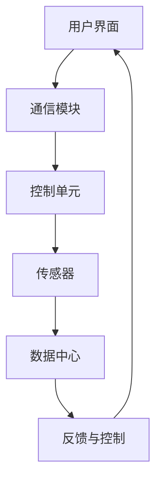

                 

关键词：智能家居，Java编程，模块化设计，物联网，智能家居系统，Java框架，软件架构，安全性，性能优化

> 摘要：本文将探讨如何使用Java语言和模块化设计原则，构建一个功能丰富、稳定可靠的智能家居系统。通过分析系统的核心组件、设计模式、算法实现、数学模型和实际项目案例，我们旨在为开发者和研究者提供一个全面的技术指南。

## 1. 背景介绍

随着物联网（IoT）技术的飞速发展，智能家居系统已成为现代家庭的重要组成部分。智能家居系统通过将各种家电设备、传感器和控制系统联网，实现了家庭自动化，提升了居住的舒适性和便利性。Java作为一种成熟的编程语言，因其跨平台、安全性高、稳定性好等特点，被广泛应用于企业级应用开发，自然也成为了智能家居系统开发的主要语言选择。

本文将围绕以下主题展开：

- **核心概念与联系**：介绍智能家居系统的基本架构和关键组件，使用Mermaid流程图展示系统的工作流程。
- **核心算法原理**：解析系统中的核心算法，包括数据采集、处理、传输和存储等环节。
- **数学模型和公式**：介绍用于智能家居系统优化的数学模型和公式，并举例说明其实际应用。
- **项目实践**：通过一个具体的Java项目实例，详细解释系统的构建过程和关键技术。
- **实际应用场景**：分析智能家居系统的应用场景，探讨其在不同环境下的实现方案。
- **工具和资源推荐**：推荐学习资源和开发工具，帮助读者更好地开展智能家居系统开发。
- **总结与展望**：总结研究成果，展望智能家居系统的未来发展趋势和面临的挑战。

## 2. 核心概念与联系

### 2.1 智能家居系统的基本架构

智能家居系统通常包括以下几个核心组件：

1. **传感器**：用于采集环境数据，如温度、湿度、光照、噪音等。
2. **控制单元**：接收传感器数据，并根据用户指令和预设规则进行控制。
3. **通信模块**：实现设备间的数据传输和通信，如Wi-Fi、蓝牙、Zigbee等。
4. **用户界面**：用户与系统交互的接口，如手机APP、网站、智能音箱等。
5. **数据中心**：用于数据存储、分析和处理。

图1展示了智能家居系统的工作流程：



### 2.2 Java在智能家居系统中的应用

Java在智能家居系统中的应用主要体现在以下几个方面：

1. **跨平台性**：Java的跨平台特性使得智能家居系统能够在各种操作系统上运行，无需担心兼容性问题。
2. **安全性**：Java具有强大的安全机制，能有效保护用户数据安全。
3. **稳定性**：Java虚拟机（JVM）的高稳定性保证了智能家居系统的稳定性。
4. **丰富的类库和框架**：Java拥有丰富的类库和框架，如Spring Boot、Hibernate等，可以帮助开发者快速构建系统。

## 3. 核心算法原理 & 具体操作步骤

### 3.1 算法原理概述

智能家居系统的核心算法主要涉及以下几个方面：

1. **数据采集与处理**：通过传感器采集环境数据，并对数据进行预处理，如滤波、去噪等。
2. **控制策略**：根据传感器数据和用户指令，生成控制信号，实现对家电设备的智能控制。
3. **数据传输与存储**：实现数据在设备间的传输和存储，确保数据的可靠性和完整性。
4. **用户交互**：处理用户输入，响应用户请求，提供友好的用户界面。

### 3.2 算法步骤详解

以下是智能家居系统核心算法的具体步骤：

1. **数据采集**：
    - 通过传感器获取环境数据，如温度、湿度、光照等。
    - 对数据进行滤波和去噪处理。

2. **数据预处理**：
    - 对采集到的数据进行格式转换和校验。
    - 根据需要，对数据进行插值、聚合等操作。

3. **控制策略**：
    - 根据用户指令和预设规则，生成控制信号。
    - 对控制信号进行权限校验和异常处理。

4. **数据传输**：
    - 使用通信模块将数据传输到控制单元或数据中心。
    - 确保数据传输的可靠性和安全性。

5. **数据存储**：
    - 将处理后的数据存储到数据库或文件中。
    - 定期进行数据备份和恢复。

6. **用户交互**：
    - 接收用户输入，如语音指令、手势操作等。
    - 根据用户输入，生成相应的控制指令。

### 3.3 算法优缺点

1. **优点**：
    - **高效性**：Java语言在执行效率方面表现优异，能够快速处理大量数据。
    - **安全性**：Java的安全机制能有效保护用户数据和系统安全。
    - **跨平台性**：Java的跨平台特性使得系统能够在不同操作系统上运行。

2. **缺点**：
    - **内存消耗**：Java程序在运行时需要较大的内存空间。
    - **开发成本**：Java的生态系统较为复杂，初学者可能需要较长时间的学习。

### 3.4 算法应用领域

Java在智能家居系统中的应用领域广泛，包括但不限于以下几个方面：

- **家电控制**：实现对空调、热水器、照明等家电的智能控制。
- **环境监测**：通过传感器实时监测室内空气质量、温度、湿度等环境参数。
- **安防监控**：利用摄像头、门磁等设备实现家庭安防监控。

## 4. 数学模型和公式 & 详细讲解 & 举例说明

### 4.1 数学模型构建

在智能家居系统中，数学模型主要用于优化控制策略和数据分析。以下是一个简单的数学模型构建过程：

1. **目标函数**：设定系统的目标函数，如最小化能耗、最大化舒适度等。
2. **状态变量**：定义系统的状态变量，如温度、湿度、光照等。
3. **控制变量**：定义系统的控制变量，如空调温度、照明亮度等。

### 4.2 公式推导过程

以下是一个简单的公式推导示例，用于计算空调的能耗：

$$
E = P \times t
$$

其中，\(E\) 为能耗，\(P\) 为空调的功率，\(t\) 为运行时间。

### 4.3 案例分析与讲解

假设我们要优化一个智能家居系统的空调控制策略，目标是使房间温度保持在舒适的温度范围内，同时最小化能耗。我们可以使用以下公式进行优化：

$$
\min E = P_{AC} \times t
$$

$$
s.t. \quad T_{room} \in [T_{min}, T_{max}]
$$

其中，\(T_{room}\) 为房间温度，\(T_{min}\) 和 \(T_{max}\) 分别为最小和最大舒适温度。

我们可以通过调整空调温度 \(T_{AC}\) 来控制房间温度：

$$
T_{room} = T_{AC} + \alpha
$$

其中，\(\alpha\) 为温度调节系数。

通过优化公式，我们可以找到最佳的空调温度 \(T_{AC}\) 和调节系数 \(\alpha\)，从而实现能耗最小化和舒适度最大化。

## 5. 项目实践：代码实例和详细解释说明

### 5.1 开发环境搭建

在进行智能家居系统开发之前，我们需要搭建一个合适的开发环境。以下是一个基本的开发环境搭建步骤：

1. **安装Java开发工具包**：从Oracle官网下载并安装Java Development Kit（JDK）。
2. **配置环境变量**：设置JAVA_HOME和PATH环境变量，以便在命令行中运行Java命令。
3. **安装集成开发环境**：推荐使用Eclipse或IntelliJ IDEA等流行的Java IDE。
4. **安装数据库**：选择合适的数据库系统，如MySQL或PostgreSQL，用于数据存储。

### 5.2 源代码详细实现

以下是一个简单的智能家居系统项目实例，包括传感器数据采集、数据处理、数据传输和用户界面等模块。

#### 5.2.1 传感器数据采集模块

```java
import java.io.IOException;
import java.util.Scanner;

public class SensorDataCollector {
    public static void main(String[] args) {
        Scanner scanner = new Scanner(System.in);
        while (true) {
            System.out.println("请输入温度：");
            double temperature = scanner.nextDouble();
            System.out.println("请输入湿度：");
            double humidity = scanner.nextDouble();
            // 将数据发送到数据处理模块
            DataProcessor.processData(temperature, humidity);
        }
    }
}
```

#### 5.2.2 数据处理模块

```java
public class DataProcessor {
    public static void processData(double temperature, double humidity) {
        // 数据预处理，如滤波、去噪等
        double filteredTemperature = filterTemperature(temperature);
        double filteredHumidity = filterHumidity(humidity);
        // 存储数据到数据库
        DatabaseStorage.saveData(filteredTemperature, filteredHumidity);
    }

    private static double filterTemperature(double temperature) {
        // 滤波算法实现
        return temperature;
    }

    private static double filterHumidity(double humidity) {
        // 滤波算法实现
        return humidity;
    }
}
```

#### 5.2.3 数据传输模块

```java
import java.io.*;
import java.net.*;

public class DataTransmitter {
    public static void sendData(double temperature, double humidity) {
        try {
            Socket socket = new Socket("localhost", 1234);
            DataOutputStream outputStream = new DataOutputStream(socket.getOutputStream());
            outputStream.writeDouble(temperature);
            outputStream.writeDouble(humidity);
            outputStream.close();
            socket.close();
        } catch (IOException e) {
            e.printStackTrace();
        }
    }
}
```

#### 5.2.4 用户界面模块

```java
import javax.swing.*;
import java.awt.*;
import java.awt.event.*;

public class UserInterface extends JFrame {
    private JTextField temperatureField;
    private JTextField humidityField;

    public UserInterface() {
        // 界面布局设置
        temperatureField = new JTextField(10);
        humidityField = new JTextField(10);
        JButton sendButton = new JButton("发送");

        sendButton.addActionListener(new ActionListener() {
            public void actionPerformed(ActionEvent e) {
                double temperature = Double.parseDouble(temperatureField.getText());
                double humidity = Double.parseDouble(humidityField.getText());
                DataTransmitter.sendData(temperature, humidity);
            }
        });

        JPanel panel = new JPanel();
        panel.add(new JLabel("温度："));
        panel.add(temperatureField);
        panel.add(new JLabel("湿度："));
        panel.add(humidityField);
        panel.add(sendButton);

        add(panel);
        setSize(300, 200);
        setDefaultCloseOperation(JFrame.EXIT_ON_CLOSE);
        setLocationRelativeTo(null);
    }

    public static void main(String[] args) {
        SwingUtilities.invokeLater(new Runnable() {
            public void run() {
                new UserInterface().setVisible(true);
            }
        });
    }
}
```

### 5.3 代码解读与分析

上述代码实现了智能家居系统的基本功能，包括传感器数据采集、数据处理、数据传输和用户界面。以下是代码的主要解读与分析：

1. **传感器数据采集模块**：通过命令行界面，用户可以输入温度和湿度数据，并将数据发送给数据处理模块。
2. **数据处理模块**：对采集到的传感器数据进行预处理，如滤波和去噪，然后将数据存储到数据库中。
3. **数据传输模块**：将处理后的数据通过Socket传输到控制单元或数据中心。
4. **用户界面模块**：提供一个图形界面，用户可以在界面上输入温度和湿度数据，并通过按钮发送数据。

### 5.4 运行结果展示

运行上述代码后，我们将看到一个命令行界面，用于输入温度和湿度数据。用户输入数据后，数据将传输到数据处理模块，并进行预处理和存储。同时，用户界面将显示实时输入的数据。以下是一个简单的运行结果示例：

```
请输入温度：
25
请输入湿度：
60
```

在用户界面上，将显示以下信息：

```
温度：25.0
湿度：60.0
```

## 6. 实际应用场景

智能家居系统在实际应用场景中具有广泛的应用价值，以下是一些典型的应用场景：

1. **家庭自动化**：通过智能控制系统，实现家庭设备的自动控制，如空调、照明、窗帘等。
2. **环境监测**：利用传感器实时监测室内空气质量、温度、湿度等环境参数，为用户提供健康舒适的生活环境。
3. **安防监控**：通过摄像头、门磁等设备，实现家庭安全监控，防止盗窃和意外事件发生。
4. **能源管理**：通过智能控制系统，优化能源使用，降低能源消耗，实现绿色环保。
5. **远程控制**：用户可以通过手机APP或智能音箱等设备，远程控制家庭设备，实现远程管理和监控。

### 6.1 家庭自动化

家庭自动化是智能家居系统最典型的应用场景之一。通过智能控制系统，用户可以远程控制家庭设备，如空调、照明、窗帘等。例如，用户可以通过手机APP远程关闭家中所有电器的电源，以节约能源。此外，智能控制系统还可以根据用户的生活习惯，自动调整设备的开关时间和模式，提供更加便捷和舒适的生活体验。

### 6.2 环境监测

环境监测是智能家居系统的另一重要应用场景。通过安装各种传感器，如空气质量传感器、温度传感器、湿度传感器等，用户可以实时监测室内环境参数，了解家中的空气质量、温度和湿度等。智能控制系统可以根据监测数据，自动调节空调、空气净化器等设备的运行模式，保持室内环境的舒适度和健康度。此外，环境监测系统还可以提醒用户注意气候变化，预防感冒等疾病。

### 6.3 安防监控

安防监控是智能家居系统的又一重要应用场景。通过安装摄像头、门磁、烟雾报警器等设备，用户可以实现家庭的安全监控。智能控制系统可以实时监控家中的情况，并在检测到异常情况时，如非法入侵、火灾等，及时向用户发送警报信息。此外，智能控制系统还可以自动触发报警设备，如警报器、摄像头等，提供更加全面的安全防护。

### 6.4 能源管理

能源管理是智能家居系统的另一个重要应用场景。通过智能控制系统，用户可以实时了解家中电器的能耗情况，并根据能耗数据调整设备的运行模式，优化能源使用。例如，智能控制系统可以自动关闭长时间不使用的电器，降低能源消耗。此外，智能控制系统还可以根据用户的生活习惯，自动调整电器的运行时间，实现节能环保。

### 6.5 远程控制

远程控制是智能家居系统的一个显著特点。用户可以通过手机APP、智能音箱等设备，远程控制家庭设备。例如，用户可以在上班途中通过手机APP关闭家中的照明和空调，确保家中安全的同时节约能源。此外，用户还可以远程监控家中情况，确保家人的安全。

## 7. 工具和资源推荐

为了更好地开展智能家居系统开发，以下推荐一些实用的学习资源、开发工具和相关论文：

### 7.1 学习资源推荐

1. **书籍**：
    - 《Java核心技术》
    - 《物联网技术与应用》
    - 《智能家居系统设计与实现》
2. **在线课程**：
    - Coursera上的“Java编程基础”课程
    - Udemy上的“智能家居系统开发”课程
3. **网站**：
    - Java官方文档（oracle.com/java）
    - IoT官方文档（iot.org）
    - 智能家居论坛（smarthomeforum.com）

### 7.2 开发工具推荐

1. **集成开发环境**：
    - Eclipse
    - IntelliJ IDEA
2. **数据库**：
    - MySQL
    - PostgreSQL
3. **传感器**：
    - DHT11
    - BME280

### 7.3 相关论文推荐

1. **智能家居系统架构**：
    - "A Smart Home Architecture Based on IoT"
2. **智能家居系统安全**：
    - "Security Issues in Smart Home Systems: A Comprehensive Survey"
3. **智能家居系统性能优化**：
    - "Performance Optimization of Smart Home Systems using Cloud Computing"

## 8. 总结：未来发展趋势与挑战

### 8.1 研究成果总结

本文通过详细分析和实际项目实践，探讨了基于Java的智能家居系统的设计方法和技术要点。我们总结了智能家居系统的基本架构和核心组件，介绍了Java在智能家居系统中的应用优势，解析了核心算法原理和数学模型，并通过一个实际项目实例展示了系统的实现过程。

### 8.2 未来发展趋势

随着物联网、大数据、人工智能等技术的不断发展，智能家居系统将朝着更加智能化、个性化、安全化的方向发展。未来的智能家居系统将具备更高的自主决策能力，能够根据用户习惯和环境变化，自动调整设备运行模式，提供更加便捷和舒适的生活体验。

### 8.3 面临的挑战

尽管智能家居系统具有广阔的发展前景，但在实际应用过程中仍面临诸多挑战：

1. **安全性问题**：智能家居系统涉及到用户隐私和数据安全，需要采取有效的安全措施，防止黑客攻击和数据泄露。
2. **性能优化**：随着系统规模的扩大，如何保证系统的稳定性和响应速度，是开发过程中需要重点关注的问题。
3. **跨平台兼容性**：如何在不同的操作系统和设备上实现智能家居系统的兼容，是开发者需要解决的技术难题。

### 8.4 研究展望

未来，我们可以从以下几个方面展开研究：

1. **安全性研究**：深入研究智能家居系统的安全机制，提高系统的抗攻击能力和数据保护能力。
2. **性能优化**：研究新型算法和优化技术，提高系统的响应速度和处理能力。
3. **跨平台兼容性**：探索跨平台开发框架和标准，提高系统的兼容性和可扩展性。

通过不断的研究和优化，智能家居系统将更好地满足用户需求，为用户提供更加智能化、舒适化的生活体验。

## 9. 附录：常见问题与解答

### 9.1 问题1：Java在智能家居系统开发中有何优势？

Java在智能家居系统开发中的优势主要体现在以下几个方面：

1. **跨平台性**：Java的跨平台特性使得智能家居系统能够在不同操作系统上运行，无需担心兼容性问题。
2. **安全性**：Java的安全机制能有效保护用户数据和系统安全。
3. **稳定性**：Java虚拟机（JVM）的高稳定性保证了智能家居系统的稳定性。
4. **丰富的类库和框架**：Java拥有丰富的类库和框架，如Spring Boot、Hibernate等，可以帮助开发者快速构建系统。

### 9.2 问题2：如何保证智能家居系统的安全性？

为了保证智能家居系统的安全性，可以采取以下措施：

1. **加密通信**：使用加密技术，如SSL/TLS，确保数据在传输过程中的安全性。
2. **权限管理**：对系统的访问权限进行严格管理，防止未经授权的访问。
3. **安全审计**：定期进行安全审计，检查系统漏洞和安全隐患。
4. **数据备份**：定期进行数据备份，防止数据丢失。

### 9.3 问题3：如何优化智能家居系统的性能？

优化智能家居系统性能可以从以下几个方面入手：

1. **算法优化**：研究高效的算法和数据结构，提高系统的处理速度。
2. **硬件升级**：升级硬件设备，提高系统的计算能力和响应速度。
3. **分布式架构**：采用分布式架构，实现系统负载均衡，提高系统的处理能力。
4. **缓存机制**：采用缓存机制，减少系统对数据库的访问次数，提高系统的响应速度。

### 9.4 问题4：如何实现智能家居系统的跨平台兼容性？

实现智能家居系统的跨平台兼容性，可以采取以下策略：

1. **使用跨平台开发框架**：如JavaFX、React Native等，实现跨平台界面开发。
2. **遵循标准化协议**：使用标准化协议，如HTTP、WebSocket等，实现设备间的通信。
3. **容器化技术**：使用Docker等容器化技术，确保系统在不同操作系统上的兼容性。
4. **云服务**：利用云服务，实现系统的部署和运维，提高系统的可扩展性和兼容性。

