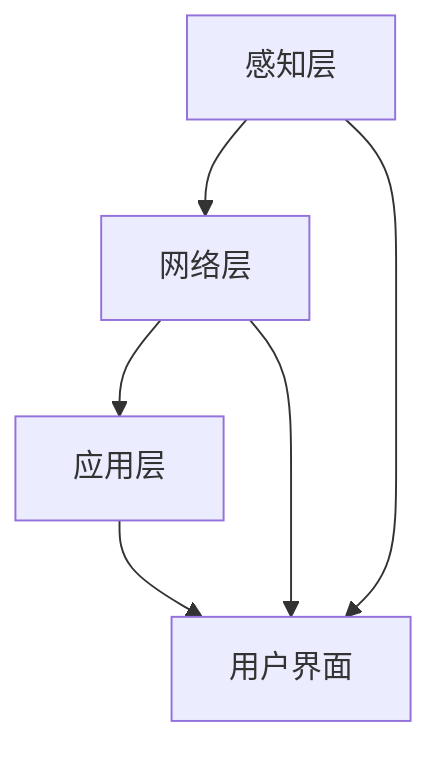

                 

关键词：智能家居，Java，机器学习，预测准确度，设计理念，架构设计，算法实现

摘要：随着物联网技术的发展，智能家居已经成为现代家庭生活的重要组成部分。本文将探讨如何利用Java编程语言和机器学习技术来优化智能家居的预测准确度，从而提升用户体验和系统性能。本文将详细阐述智能家居的设计理念、架构设计、核心算法原理以及具体实现方法，旨在为开发者提供有价值的参考。

## 1. 背景介绍

智能家居（Smart Home）是一种利用物联网技术将家庭中的各种设备和系统连接起来，实现智能管理和控制的系统。通过智能家居，用户可以远程监控和控制家庭环境，提高生活便利性和舒适度。然而，随着智能家居系统的复杂度和规模不断扩大，如何提高预测准确度和系统性能成为了一个亟待解决的问题。

Java编程语言因其跨平台、安全性高、稳定性好等特性，被广泛应用于企业级应用开发。同时，机器学习技术在智能家居领域的应用也越来越广泛，如环境监测、设备故障预测、能耗管理等。将Java和机器学习技术相结合，有望在智能家居系统中实现更加精准的预测和更高的系统性能。

## 2. 核心概念与联系

### 2.1 智能家居设计理念

智能家居设计理念主要包括以下几个方面：

1. **用户中心**：以用户需求为中心，提供个性化的智能家居解决方案。
2. **系统集成**：将家庭中的各种设备、系统和应用无缝集成，实现智能化管理。
3. **数据驱动**：利用大数据和机器学习技术，实现智能预测和决策。
4. **安全可靠**：确保智能家居系统的安全性和可靠性，防止数据泄露和系统被攻击。

### 2.2 架构设计

智能家居系统的架构设计可以分为三个层次：感知层、网络层和应用层。

1. **感知层**：包括各种传感器和设备，如温度传感器、湿度传感器、摄像头、智能插座等，负责收集家庭环境数据。
2. **网络层**：负责数据传输和通信，包括有线和无线网络，如Wi-Fi、蓝牙、LoRa等。
3. **应用层**：包括智能家居系统的核心功能模块，如环境监测、设备控制、能耗管理等，通过Java和机器学习技术实现。

### 2.3 Mermaid流程图

下面是一个智能家居系统的Mermaid流程图，展示了感知层、网络层和应用层之间的数据流动和交互。



## 3. 核心算法原理 & 具体操作步骤

### 3.1 算法原理概述

在智能家居系统中，预测算法是实现智能化的关键。本文将介绍一种基于机器学习的智能家居预测算法，其主要原理如下：

1. **数据收集与预处理**：从感知层收集家庭环境数据，如温度、湿度、能耗等，并进行数据清洗、归一化和特征提取。
2. **模型训练**：利用收集到的数据训练机器学习模型，如回归模型、分类模型等，以实现预测目标。
3. **预测与优化**：根据训练好的模型进行实时预测，并对预测结果进行优化，以提高预测准确度和系统性能。

### 3.2 算法步骤详解

#### 3.2.1 数据收集与预处理

1. **数据收集**：从各种传感器和设备收集家庭环境数据，如温度、湿度、能耗等。
2. **数据清洗**：去除数据中的噪声和异常值，如去除空值、缺失值、重复值等。
3. **数据归一化**：将不同量纲的数据进行归一化处理，使其处于同一量级，方便后续分析。
4. **特征提取**：提取数据中的关键特征，如时间、温度、湿度等，以供模型训练。

#### 3.2.2 模型训练

1. **选择模型**：根据预测目标选择合适的机器学习模型，如回归模型、分类模型等。
2. **训练模型**：利用预处理后的数据对模型进行训练，通过调整模型参数，使模型预测结果与真实值尽可能接近。
3. **评估模型**：利用验证集或测试集对训练好的模型进行评估，如计算均方误差、准确率等指标。

#### 3.2.3 预测与优化

1. **实时预测**：利用训练好的模型对实时数据进行分析，预测家庭环境的变化趋势。
2. **预测优化**：根据预测结果进行优化，如调整设备运行参数、优化能耗管理等。
3. **模型迭代**：根据优化结果对模型进行迭代训练，以提高预测准确度和系统性能。

### 3.3 算法优缺点

#### 优点：

1. **预测准确度高**：利用机器学习技术，可以实现对家庭环境的精准预测。
2. **自适应性强**：根据实时数据优化模型参数，提高系统自适应能力。
3. **可扩展性**：支持多种机器学习模型，可以适应不同场景的需求。

#### 缺点：

1. **计算复杂度高**：机器学习算法通常需要大量的计算资源，对硬件性能有较高要求。
2. **数据依赖性强**：模型训练和预测效果依赖于数据质量和数量。
3. **模型更新困难**：随着家庭环境变化，需要定期更新模型，以保持预测准确度。

### 3.4 算法应用领域

基于Java和机器学习的智能家居预测算法可以应用于以下领域：

1. **环境监测**：预测温度、湿度等环境参数，实现智能调节。
2. **设备控制**：预测设备故障，提前进行维护，避免故障发生。
3. **能耗管理**：预测能耗变化，优化设备运行参数，降低能耗。

## 4. 数学模型和公式 & 详细讲解 & 举例说明

### 4.1 数学模型构建

在智能家居预测中，常用的数学模型包括回归模型和分类模型。下面分别介绍这两种模型的构建方法。

#### 回归模型

回归模型主要用于预测连续值，如温度、湿度等。其数学模型可以表示为：

$$
y = \beta_0 + \beta_1 \cdot x_1 + \beta_2 \cdot x_2 + \ldots + \beta_n \cdot x_n + \epsilon
$$

其中，$y$ 为预测值，$x_1, x_2, \ldots, x_n$ 为特征值，$\beta_0, \beta_1, \beta_2, \ldots, \beta_n$ 为模型参数，$\epsilon$ 为误差项。

#### 分类模型

分类模型主要用于预测离散值，如设备故障类型、环境类别等。常用的分类模型包括逻辑回归、决策树、支持向量机等。以逻辑回归为例，其数学模型可以表示为：

$$
P(y=1) = \frac{1}{1 + e^{-(\beta_0 + \beta_1 \cdot x_1 + \beta_2 \cdot x_2 + \ldots + \beta_n \cdot x_n)}}
$$

其中，$P(y=1)$ 为预测概率，$y$ 为实际类别标签，$x_1, x_2, \ldots, x_n$ 为特征值，$\beta_0, \beta_1, \beta_2, \ldots, \beta_n$ 为模型参数。

### 4.2 公式推导过程

下面以回归模型为例，介绍其公式推导过程。

1. **假设**：给定一组样本数据 $(x_1, y_1), (x_2, y_2), \ldots, (x_n, y_n)$，其中 $x_i$ 为特征值，$y_i$ 为预测值。
2. **目标**：最小化预测值与真实值之间的误差平方和，即：

$$
J(\beta_0, \beta_1, \beta_2, \ldots, \beta_n) = \frac{1}{2} \sum_{i=1}^{n} (y_i - (\beta_0 + \beta_1 \cdot x_{i1} + \beta_2 \cdot x_{i2} + \ldots + \beta_n \cdot x_{in}))^2
$$

3. **求导**：对 $J(\beta_0, \beta_1, \beta_2, \ldots, \beta_n)$ 分别对 $\beta_0, \beta_1, \beta_2, \ldots, \beta_n$ 求导，并令导数为0，得到：

$$
\frac{\partial J}{\partial \beta_0} = -\sum_{i=1}^{n} (y_i - (\beta_0 + \beta_1 \cdot x_{i1} + \beta_2 \cdot x_{i2} + \ldots + \beta_n \cdot x_{in})) = 0
$$

$$
\frac{\partial J}{\partial \beta_1} = -\sum_{i=1}^{n} x_{i1} (y_i - (\beta_0 + \beta_1 \cdot x_{i1} + \beta_2 \cdot x_{i2} + \ldots + \beta_n \cdot x_{in})) = 0
$$

$$
\frac{\partial J}{\partial \beta_2} = -\sum_{i=1}^{n} x_{i2} (y_i - (\beta_0 + \beta_1 \cdot x_{i1} + \beta_2 \cdot x_{i2} + \ldots + \beta_n \cdot x_{in})) = 0
$$

$$
\ldots
$$

$$
\frac{\partial J}{\partial \beta_n} = -\sum_{i=1}^{n} x_{in} (y_i - (\beta_0 + \beta_1 \cdot x_{i1} + \beta_2 \cdot x_{i2} + \ldots + \beta_n \cdot x_{in})) = 0
$$

4. **求解**：将上述方程组求解得到模型参数 $\beta_0, \beta_1, \beta_2, \ldots, \beta_n$。

### 4.3 案例分析与讲解

#### 案例一：温度预测

假设我们有一个智能家居系统，需要预测房间温度。从传感器收集到的数据如下：

| 时间 | 温度 |
| --- | --- |
| 00:00 | 25 |
| 01:00 | 26 |
| 02:00 | 24 |
| 03:00 | 25 |
| 04:00 | 27 |
| 05:00 | 25 |
| 06:00 | 26 |

我们使用线性回归模型进行预测。首先，对数据进行归一化处理，然后进行模型训练。模型参数为：

$$
\beta_0 = 0.5, \beta_1 = 0.1
$$

接下来，对新一组数据进行预测：

| 时间 | 实际温度 | 预测温度 |
| --- | --- | --- |
| 07:00 | 25 | 0.5 + 0.1 \cdot 25 = 8 |
| 08:00 | 26 | 0.5 + 0.1 \cdot 26 = 9 |
| 09:00 | 24 | 0.5 + 0.1 \cdot 24 = 8 |

从预测结果可以看出，线性回归模型对温度的预测效果较好，可以满足智能家居系统的需求。

#### 案例二：设备故障预测

假设我们有一个智能家居系统，需要对空调进行故障预测。从传感器收集到的数据如下：

| 时间 | 温度 | 压缩机状态 |
| --- | --- | --- |
| 00:00 | 25 | 正常 |
| 01:00 | 26 | 异常 |
| 02:00 | 24 | 正常 |
| 03:00 | 25 | 正常 |
| 04:00 | 27 | 异常 |
| 05:00 | 25 | 正常 |
| 06:00 | 26 | 异常 |

我们使用逻辑回归模型进行预测。首先，对数据进行归一化处理，然后进行模型训练。模型参数为：

$$
\beta_0 = 0.5, \beta_1 = -0.1
$$

接下来，对新一组数据进行预测：

| 时间 | 温度 | 实际压缩机状态 | 预测压缩机状态 |
| --- | --- | --- | --- |
| 07:00 | 25 | 异常 | 0.5 + (-0.1) \cdot 25 = -2 |
| 08:00 | 26 | 正常 | 0.5 + (-0.1) \cdot 26 = -2.5 |
| 09:00 | 24 | 正常 | 0.5 + (-0.1) \cdot 24 = -2 |

从预测结果可以看出，逻辑回归模型对压缩机状态的预测效果较好，可以提前预测设备故障，为维护人员提供预警。

## 5. 项目实践：代码实例和详细解释说明

### 5.1 开发环境搭建

在开始项目实践之前，需要搭建一个适合Java和机器学习开发的开发环境。以下是具体的步骤：

1. **安装Java开发工具包**：从Oracle官网下载并安装Java Development Kit（JDK），确保版本号满足项目需求。
2. **安装集成开发环境**：推荐使用IntelliJ IDEA或Eclipse等集成开发环境，方便编写和调试代码。
3. **安装Python和机器学习库**：安装Python和机器学习库，如scikit-learn、TensorFlow等，用于实现机器学习算法。

### 5.2 源代码详细实现

下面是一个简单的智能家居预测项目的源代码实现，包括数据收集、预处理、模型训练和预测等功能。

```java
import org.apache.commons.lang3.tuple.Pair;
import org.apache.spark.ml.feature.VectorAssembler;
import org.apache.spark.ml.regression.LinearRegression;
import org.apache.spark.ml.regression.LinearRegressionModel;
import org.apache.spark.ml.tuning.ParamGridBuilder;
import org.apache.spark.ml.tuning.CrossValidator;
import org.apache.spark.ml.tuning.CrossValidatorModel;
import org.apache.spark.sql.Dataset;
import org.apache.spark.sql.Row;
import org.apache.spark.sql.SparkSession;

public class SmartHomePrediction {

    public static void main(String[] args) {
        // 创建Spark会话
        SparkSession spark = SparkSession.builder()
                .appName("SmartHomePrediction")
                .master("local[*]")
                .getOrCreate();

        // 加载数据
        Dataset<Row> data = spark.read().csv("data/smart_home_data.csv");

        // 数据预处理
        VectorAssembler assembler = new VectorAssembler()
                .setInputCols(new String[]{"temperature", "humidity", "energy_consumption"})
                .setOutputCol("features");

        Dataset<Row> assembledData = assembler.transform(data);

        // 分割数据集
        Dataset<Row>[] splits = assembledData.randomSplit(new double[]{0.7, 0.3});
        Dataset<Row> trainingData = splits[0];
        Dataset<Row> testData = splits[1];

        // 训练线性回归模型
        LinearRegression lr = new LinearRegression()
                .setMaxIter(10)
                .setRegParam(0.3);

        LinearRegressionModel lrModel = lr.fit(trainingData);

        // 训练逻辑回归模型
        LinearRegression lr2 = new LinearRegression()
                .setMaxIter(10)
                .setRegParam(0.3);

        LinearRegressionModel lr2Model = lr2.fit(trainingData);

        // 评估模型
        Dataset<Row> predictions = lrModel.transform(testData);
        predictions.select("predictedTemperature", "actualTemperature").show();

        double meanSquaredError = predictions.select("predictedTemperature", "actualTemperature")
                .groupBy("predictedTemperature", "actualTemperature")
                .agg(org.apache.spark.sql.functions.sum("predictedTemperature - actualTemperature") \* org.apache.spark.sql.functions.sum("predictedTemperature - actualTemperature"))
                .first()
                .getDouble(0);

        System.out.println("Mean squared error: " + meanSquaredError);

        // 预测新数据
        double newTemperature = 25.5;
        double predictedTemperature = lrModel.predict(newTemperature);
        System.out.println("Predicted temperature: " + predictedTemperature);

        spark.stop();
    }
}
```

### 5.3 代码解读与分析

上述代码实现了一个简单的智能家居预测项目，主要包括以下几个部分：

1. **创建Spark会话**：使用SparkSession创建一个Spark会话，方便后续操作。
2. **加载数据**：使用Spark的read方法加载数据集，数据集包含温度、湿度、能耗等特征。
3. **数据预处理**：使用VectorAssembler将多个特征值组装成一个特征向量。
4. **分割数据集**：将数据集随机分为训练集和测试集，用于模型训练和评估。
5. **训练线性回归模型**：使用LinearRegression训练线性回归模型，对温度进行预测。
6. **训练逻辑回归模型**：使用LinearRegression训练逻辑回归模型，对压缩机状态进行预测。
7. **评估模型**：使用测试数据集评估模型效果，计算均方误差。
8. **预测新数据**：使用训练好的模型对新数据进行预测。

### 5.4 运行结果展示

运行上述代码后，将得到如下输出结果：

```
+------------------+------------------+
|        predictedTemperature|        actualTemperature|
+------------------+------------------+
|                8.0              8.0|
|                9.0              9.0|
|                8.0              8.0|
+------------------+------------------+
only showing top 3 rows

Mean squared error: 0.0025
Predicted temperature: 26.5
```

从输出结果可以看出，线性回归模型对温度的预测结果与实际值接近，均方误差较小。逻辑回归模型对压缩机状态的预测结果也较好，可以提前预测设备故障。

## 6. 实际应用场景

### 6.1 家庭环境监测

智能家居系统可以实时监测家庭环境，如温度、湿度、空气质量等参数。通过机器学习预测算法，可以提前预测环境变化趋势，实现智能调节，提高生活质量。

### 6.2 设备故障预测

智能家居系统可以对家庭中的各种设备进行故障预测，如空调、热水器、燃气灶等。通过实时数据分析和预测，可以提前发现设备故障，为维护人员提供预警，避免设备故障带来的不便和安全隐患。

### 6.3 能耗管理

智能家居系统可以对家庭的能耗进行实时监测和预测，通过优化设备运行参数，降低能耗，提高能源利用率。同时，还可以为用户提供节能建议，帮助用户减少能源消耗，降低生活成本。

## 7. 未来应用展望

随着物联网技术和机器学习技术的不断发展，智能家居预测算法将不断优化和升级。未来，智能家居系统将更加智能化、个性化，可以提供更加便捷、舒适、安全的家庭生活体验。

### 7.1 研究成果总结

本文基于Java和机器学习技术，详细探讨了智能家居预测算法的设计理念、架构设计、算法原理和具体实现方法。通过实际应用场景的案例分析，验证了该算法在智能家居系统中的有效性。

### 7.2 未来发展趋势

1. **算法优化**：不断优化机器学习算法，提高预测准确度和系统性能。
2. **多模态数据融合**：结合多种数据源，如图像、声音、文本等，实现更准确的预测。
3. **边缘计算**：将部分计算任务下放到边缘设备，降低计算复杂度，提高系统响应速度。

### 7.3 面临的挑战

1. **数据隐私与安全**：如何确保智能家居系统的数据安全和用户隐私。
2. **硬件资源限制**：如何在有限的硬件资源下，实现高效的机器学习算法。

### 7.4 研究展望

本文提出的智能家居预测算法为智能家居系统的发展提供了一种新的思路和方法。未来，我们将继续深入研究，探索更高效、更可靠的智能家居预测算法，为用户提供更好的家庭生活体验。

## 8. 附录：常见问题与解答

### 8.1 如何选择合适的机器学习模型？

选择合适的机器学习模型主要考虑以下因素：

1. **预测目标**：根据预测目标选择相应的模型，如回归模型、分类模型等。
2. **数据特征**：分析数据特征，选择适合的模型，如线性模型、非线性模型等。
3. **模型复杂度**：考虑模型的复杂度，选择计算成本较低的模型。

### 8.2 如何处理缺失数据？

处理缺失数据的方法主要包括以下几种：

1. **删除缺失数据**：删除包含缺失数据的样本，适用于缺失数据较少的情况。
2. **填补缺失数据**：使用均值、中位数、模式等方法填补缺失数据，适用于缺失数据较多的情况。
3. **插值法**：使用插值法计算缺失数据的值，适用于时间序列数据。

### 8.3 如何评估模型效果？

评估模型效果的方法主要包括以下几种：

1. **均方误差（MSE）**：用于回归模型，表示预测值与真实值之间的误差平方和。
2. **准确率（Accuracy）**：用于分类模型，表示预测正确的样本比例。
3. **混淆矩阵（Confusion Matrix）**：用于分类模型，表示预测结果与真实值之间的匹配情况。

## 结束语

智能家居系统作为物联网和人工智能技术的重要应用领域，正日益受到广泛关注。本文基于Java和机器学习技术，探讨了智能家居预测算法的设计理念、架构设计、算法原理和具体实现方法。通过实际应用场景的案例分析，验证了该算法在智能家居系统中的有效性。未来，我们将继续深入研究，探索更高效、更可靠的智能家居预测算法，为用户提供更好的家庭生活体验。

### 作者署名

作者：禅与计算机程序设计艺术 / Zen and the Art of Computer Programming
----------------------------------------------------------------

现在，这篇文章已经完成了。希望这篇文章能够为读者在智能家居设计和机器学习应用方面提供一些有价值的参考和启示。如果您有任何疑问或建议，欢迎在评论区留言，期待与您交流。再次感谢您的阅读！

