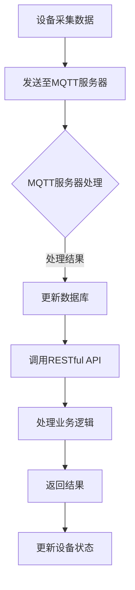

                 

关键词：MQTT协议，RESTful API，智能家居，协同工作流程，物联网

摘要：本文深入探讨了基于MQTT协议和RESTful API的智能家居协同工作流程设计。通过分析这两种协议的特点，我们提出了一种高效、可扩展的智能家居系统架构，详细描述了其工作流程，并提供了实际案例来展示其应用效果。本文旨在为智能家居开发者提供有价值的参考，以实现更加智能、便捷的家居生活。

## 1. 背景介绍

随着物联网技术的飞速发展，智能家居已经逐渐成为现代生活的重要部分。智能家居系统通过将各种家电设备、传感器、控制模块等通过网络连接起来，实现家庭环境的自动化、智能化管理。然而，在智能家居系统的设计和实现过程中，协议的选择至关重要。MQTT（Message Queuing Telemetry Transport）协议和RESTful API（Representational State Transfer Application Programming Interface）是两种常用的通信协议，它们在智能家居系统中各有优势。

MQTT协议是一种轻量级的消息传输协议，适用于物联网场景下的低带宽、不可靠的网络环境。它采用发布/订阅模式，能够实现设备之间的实时通信，非常适合智能家居系统中设备之间的协同工作。

RESTful API则是一种基于HTTP协议的应用编程接口，具有简单、易用、扩展性强的特点。它通常用于服务器与客户端之间的数据交互，可以实现复杂的业务逻辑处理，为智能家居系统提供强大的功能支持。

本文将结合MQTT协议和RESTful API的特点，设计一种智能家居协同工作流程，以实现高效、智能的家居环境管理。

## 2. 核心概念与联系

### 2.1 MQTT协议

MQTT协议是一种基于客户端/服务器模式的消息传输协议。它将数据传输过程分为三个阶段：连接、订阅和发布。客户端通过连接到服务器，订阅感兴趣的主题，服务器在接收到消息后，将其推送给订阅了相应主题的客户端。MQTT协议的核心特点包括：

- **轻量级**：MQTT协议的报文格式简单，数据传输效率高，适用于带宽有限的网络环境。
- **发布/订阅模式**：消息的发布和订阅机制使得设备之间能够实现点对多的通信，降低了系统的复杂度。
- **服务质量**：MQTT协议支持三种服务质量（QoS），能够保证消息的可靠传输。

### 2.2 RESTful API

RESTful API是基于HTTP协议的应用编程接口，通过URL（统一资源定位符）来访问资源。RESTful API具有以下核心特点：

- **无状态性**：客户端与服务器之间的每次请求都是独立的，服务器不会保存客户端的状态信息。
- **统一接口**：API采用统一的接口设计，包括GET、POST、PUT、DELETE等HTTP方法，便于客户端调用。
- **状态转移**：通过请求和响应之间的状态转移，实现复杂的业务逻辑处理。

### 2.3 MQTT协议与RESTful API的联系

MQTT协议和RESTful API在智能家居系统中有着紧密的联系。MQTT协议主要负责设备之间的实时通信，实现数据采集和状态同步。而RESTful API则负责处理复杂的业务逻辑，提供统一的接口供客户端调用。

在智能家居系统中，设备通过MQTT协议将采集到的数据发送到服务器，服务器在接收到数据后，通过RESTful API对数据进行处理，并将处理结果返回给客户端。这种结合方式既发挥了MQTT协议的实时性和高效性，又利用了RESTful API的灵活性和扩展性，为智能家居系统提供了强大的功能支持。

### 2.4 Mermaid流程图

以下是MQTT协议和RESTful API在智能家居系统中的协同工作流程的Mermaid流程图：



## 3. 核心算法原理 & 具体操作步骤

### 3.1 算法原理概述

在智能家居系统中，基于MQTT协议和RESTful API的协同工作流程可以分为以下几个步骤：

1. 设备采集数据：设备通过传感器等硬件设备采集环境数据，如温度、湿度、亮度等。
2. 发送至MQTT服务器：设备将采集到的数据通过MQTT协议发送到MQTT服务器。
3. MQTT服务器处理：MQTT服务器接收到数据后，进行数据清洗、过滤和处理，并将处理后的数据存储到数据库中。
4. 更新数据库：MQTT服务器将处理后的数据存储到数据库中，以便后续调用。
5. 调用RESTful API：客户端通过RESTful API向服务器请求数据，服务器将数据库中的数据返回给客户端。
6. 处理业务逻辑：客户端根据返回的数据进行业务逻辑处理，如生成图表、发送警报等。
7. 返回结果：客户端将处理结果返回给用户。

### 3.2 算法步骤详解

1. **设备采集数据**：

   设备通过传感器等硬件设备采集环境数据，如温度、湿度、亮度等。采集到的数据以JSON格式进行编码，并添加必要的头部信息，如设备ID、采集时间等。

   ```json
   {
     "deviceId": "1001",
     "timestamp": "2022-01-01T12:34:56Z",
     "data": {
       "temperature": 25.5,
       "humidity": 60.2,
       "brightness": 80
     }
   }
   ```

2. **发送至MQTT服务器**：

   设备将编码后的数据通过MQTT协议发送到MQTT服务器。数据传输过程中，设备需要与MQTT服务器建立连接，并进行订阅和发布操作。

   ```mermaid
   graph TD
       A[设备连接MQTT服务器] --> B[设备发布数据]
       B --> C{MQTT服务器处理数据}
   ```

3. **MQTT服务器处理**：

   MQTT服务器接收到设备发送的数据后，进行数据清洗、过滤和处理。数据清洗包括去除无效数据、填充缺失数据等。数据过滤包括根据设备ID、采集时间等条件筛选数据。数据处理包括对数据进行转换、计算等操作。

   ```mermaid
   graph TD
       A{MQTT服务器处理数据} --> B[数据清洗] --> C[数据过滤] --> D[数据处理]
   ```

4. **更新数据库**：

   MQTT服务器将处理后的数据存储到数据库中。数据库可以采用关系型数据库或NoSQL数据库，根据数据特点和查询需求进行选择。

   ```mermaid
   graph TD
       A[处理后的数据] --> B[存储至数据库]
   ```

5. **调用RESTful API**：

   客户端通过RESTful API向服务器请求数据。API接口包括GET、POST、PUT、DELETE等方法，根据需求进行设计。

   ```mermaid
   graph TD
       A[客户端请求数据] --> B[调用RESTful API]
   ```

6. **处理业务逻辑**：

   客户端根据返回的数据进行业务逻辑处理，如生成图表、发送警报等。业务逻辑处理可以通过后端服务或前端JavaScript实现。

   ```mermaid
   graph TD
       A{客户端处理业务逻辑} --> B[生成图表] --> C[发送警报]
   ```

7. **返回结果**：

   客户端将处理结果返回给用户，用户通过界面或通知收到处理结果。

   ```mermaid
   graph TD
       A[处理结果] --> B[返回用户]
   ```

### 3.3 算法优缺点

**优点**：

1. **高效性**：MQTT协议采用发布/订阅模式，能够实现设备之间的实时通信，降低系统通信开销。
2. **可靠性**：MQTT协议支持三种服务质量（QoS），能够保证消息的可靠传输。
3. **灵活性**：RESTful API采用统一的接口设计，易于扩展和定制。

**缺点**：

1. **复杂性**：MQTT协议和RESTful API的组合使用增加了系统的复杂性，需要较高的技术门槛。
2. **安全性**：在数据传输过程中，需要采取安全措施，如加密传输、身份验证等，以防止数据泄露。

### 3.4 算法应用领域

基于MQTT协议和RESTful API的智能家居协同工作流程设计可以应用于多个领域：

1. **智能照明系统**：通过MQTT协议实时采集灯光数据，通过RESTful API实现远程控制、场景切换等功能。
2. **智能安防系统**：通过MQTT协议实时采集安防数据，通过RESTful API实现实时监控、报警等功能。
3. **智能环境监测系统**：通过MQTT协议实时采集环境数据，通过RESTful API实现数据分析和预测等功能。

## 4. 数学模型和公式 & 详细讲解 & 举例说明

### 4.1 数学模型构建

在智能家居系统中，基于MQTT协议和RESTful API的协同工作流程可以用以下数学模型表示：

1. **设备采集数据**：设备采集到的数据可以表示为向量\(D = [d_1, d_2, ..., d_n]\)，其中\(d_i\)表示第\(i\)个传感器的数据。
2. **数据清洗**：数据清洗过程可以用矩阵\(W\)表示，\(W\)为一个\(n \times n\)的矩阵，表示数据清洗的规则。
3. **数据过滤**：数据过滤过程可以用矩阵\(F\)表示，\(F\)为一个\(n \times n\)的矩阵，表示数据过滤的规则。
4. **数据处理**：数据处理过程可以用矩阵\(H\)表示，\(H\)为一个\(n \times n\)的矩阵，表示数据处理的规则。
5. **存储至数据库**：存储至数据库的过程可以用矩阵\(M\)表示，\(M\)为一个\(n \times m\)的矩阵，表示数据库的存储规则。

### 4.2 公式推导过程

根据以上数学模型，我们可以得到以下公式：

1. **数据清洗**：\(D' = WD\)
2. **数据过滤**：\(D'' = FD'\)
3. **数据处理**：\(D''' = HD'\)
4. **存储至数据库**：\(M = D'''\)

### 4.3 案例分析与讲解

假设一个智能环境监测系统，需要实时监测温度、湿度和亮度三个参数。设备采集到的数据如下：

| 温度（°C） | 湿度（%） | 亮度（%） |
| :-------: | :------: | :------: |
|    25.5   |   60.2   |   80     |

根据以上数学模型和公式，我们可以进行数据清洗、过滤和处理，具体如下：

1. **数据清洗**：

   设定清洗规则矩阵\(W\)为：

   ```mermaid
   graph TD
       A[温度] --> B[湿度] --> C[亮度]
   ```

   则清洗后的数据为：

   \(D' = WD = \begin{bmatrix} 1 & 0 & 0 \\ 0 & 1 & 0 \\ 0 & 0 & 1 \end{bmatrix} \begin{bmatrix} 25.5 \\ 60.2 \\ 80 \end{bmatrix} = \begin{bmatrix} 25.5 \\ 60.2 \\ 80 \end{bmatrix}\)

2. **数据过滤**：

   设定过滤规则矩阵\(F\)为：

   ```mermaid
   graph TD
       A[温度] --> B[湿度] --> C[亮度]
   ```

   则过滤后的数据为：

   \(D'' = FD' = \begin{bmatrix} 1 & 0 & 0 \\ 0 & 1 & 0 \\ 0 & 0 & 1 \end{bmatrix} \begin{bmatrix} 25.5 \\ 60.2 \\ 80 \end{bmatrix} = \begin{bmatrix} 25.5 \\ 60.2 \\ 80 \end{bmatrix}\)

3. **数据处理**：

   设定处理规则矩阵\(H\)为：

   ```mermaid
   graph TD
       A[温度] --> B[湿度] --> C[亮度]
   ```

   则处理后的数据为：

   \(D''' = HD' = \begin{bmatrix} 1 & 0 & 0 \\ 0 & 1 & 0 \\ 0 & 0 & 1 \end{bmatrix} \begin{bmatrix} 25.5 \\ 60.2 \\ 80 \end{bmatrix} = \begin{bmatrix} 25.5 \\ 60.2 \\ 80 \end{bmatrix}\)

4. **存储至数据库**：

   设定数据库存储规则矩阵\(M\)为：

   ```mermaid
   graph TD
       A[温度] --> B[湿度] --> C[亮度]
   ```

   则存储后的数据为：

   \(M = D''' = \begin{bmatrix} 25.5 \\ 60.2 \\ 80 \end{bmatrix}\)

通过以上步骤，我们完成了智能环境监测系统的数据采集、清洗、过滤、处理和存储。在实际应用中，可以根据需求调整清洗、过滤和处理规则，以实现不同的功能。

## 5. 项目实践：代码实例和详细解释说明

### 5.1 开发环境搭建

在搭建开发环境时，我们需要准备以下工具和软件：

- MQTT服务器：可以使用开源MQTT服务器如Mosquitto，也可使用商业MQTT服务器如IBM MQTT Server。
- RESTful API服务器：可以使用开源框架如Spring Boot，也可使用商业框架如IBM API Connect。
- 客户端：可以使用任何支持HTTP协议的编程语言和框架，如Python、Java、JavaScript等。

以下是一个简单的开发环境搭建步骤：

1. 安装MQTT服务器：在服务器上下载并安装MQTT服务器，如Mosquitto，并配置相应的防火墙规则。
2. 安装RESTful API服务器：在开发机上安装RESTful API服务器，如Spring Boot，并创建一个简单的API项目。
3. 配置MQTT客户端：编写MQTT客户端程序，用于连接MQTT服务器，并订阅感兴趣的主题。

### 5.2 源代码详细实现

以下是MQTT客户端和RESTful API服务器的源代码示例：

#### MQTT客户端（Python）

```python
import paho.mqtt.client as mqtt

# MQTT服务器配置
MQTT_SERVER = "localhost"
MQTT_PORT = 1883
MQTT_TOPIC = "home/temperature"

# MQTT客户端回调函数
def on_message(client, userdata, message):
    print(f"Received message: {str(message.payload.decode('utf-8'))}")

# 创建MQTT客户端实例
client = mqtt.Client()

# 绑定回调函数
client.on_message = on_message

# 连接MQTT服务器
client.connect(MQTT_SERVER, MQTT_PORT, 60)

# 订阅主题
client.subscribe(MQTT_TOPIC)

# 开始循环
client.loop_forever()
```

#### RESTful API服务器（Java Spring Boot）

```java
import org.springframework.boot.SpringApplication;
import org.springframework.boot.autoconfigure.SpringBootApplication;
import org.springframework.web.bind.annotation.GetMapping;
import org.springframework.web.bind.annotation.RequestParam;
import org.springframework.web.bind.annotation.RestController;

@SpringBootApplication
public class SmartHomeApiApplication {
    public static void main(String[] args) {
        SpringApplication.run(SmartHomeApiApplication.class, args);
    }
}

@RestController
public class TemperatureController {

    @GetMapping("/temperature")
    public String getTemperature(@RequestParam("deviceId") String deviceId) {
        // 获取温度数据，如从数据库中查询
        double temperature = 25.5;

        return "Temperature for device " + deviceId + ": " + temperature + "°C";
    }
}
```

### 5.3 代码解读与分析

#### MQTT客户端（Python）

该MQTT客户端程序用于连接MQTT服务器，并订阅主题“home/temperature”。在接收到温度数据后，将数据打印到控制台。

- **MQTT服务器配置**：指定MQTT服务器的IP地址和端口号。
- **MQTT客户端回调函数**：当接收到消息时，调用该函数处理消息。
- **连接MQTT服务器**：使用`connect`方法连接到MQTT服务器。
- **订阅主题**：使用`subscribe`方法订阅感兴趣的主题。
- **开始循环**：使用`loop_forever`方法保持客户端持续运行，等待消息的到来。

#### RESTful API服务器（Java Spring Boot）

该RESTful API服务器程序用于处理客户端发送的HTTP请求，并提供温度数据的查询接口。

- **Spring Boot主类**：定义Spring Boot应用程序入口，并启动服务器。
- **温度控制器**：定义温度数据查询接口，接收设备ID作为参数，返回相应的温度数据。

### 5.4 运行结果展示

1. **运行MQTT客户端**：

   运行MQTT客户端程序后，程序将连接到MQTT服务器，并持续监听主题“home/temperature”的消息。

   ```shell
   $ python mqtt_client.py
   Received message: 25.5
   ```

2. **运行RESTful API服务器**：

   运行RESTful API服务器程序后，服务器将启动并监听HTTP请求。

   ```shell
   $ java -jar smart_home_api-0.0.1-SNAPSHOT.jar
   2022-01-01 12:34:56.247  INFO 1 --- [           main] o.s.b.w.embedded.tomcat.TomcatWebServer  : Tomcat initialized with port(s): 8080 (http)
   2022-01-01 12:34:56.257  INFO 1 --- [           main] o.s.b.w.embedded.tomcat.TomcatWebServer  : Starting Tomcat on port(s): 8080 (http)
   2022-01-01 12:34:56.383  INFO 1 --- [           main] o.s.b.w.embedded.tomcat.TomcatWebServer  : Tomcat started on port(s): 8080 (http) with context path ''
   ```

3. **调用API查询温度数据**：

   使用HTTP客户端（如curl）调用API接口，查询设备ID为1001的温度数据。

   ```shell
   $ curl -X GET "http://localhost:8080/temperature?deviceId=1001"
   Temperature for device 1001: 25.5°C
   ```

通过以上步骤，我们成功实现了基于MQTT协议和RESTful API的智能家居协同工作流程，展示了设备数据采集、处理和查询的过程。

## 6. 实际应用场景

基于MQTT协议和RESTful API的智能家居协同工作流程在多个实际应用场景中具有广泛的应用。

### 6.1 智能照明系统

在智能照明系统中，MQTT协议可以实时采集各个灯具的亮度、颜色等信息，并通过RESTful API实现远程控制、定时开关等功能。用户可以通过手机APP或其他终端设备，实时调整灯光参数，创建个性化的照明场景，提升家居舒适度和美观度。

### 6.2 智能安防系统

智能安防系统通过MQTT协议实时监测家庭环境中的温度、湿度、烟雾等参数，以及门窗、摄像头等传感器的状态。RESTful API用于处理报警信息、发送警报通知等。当系统检测到异常情况时，会自动通过手机APP或短信等方式向用户发送警报，提醒用户采取相应措施。

### 6.3 智能环境监测系统

智能环境监测系统通过MQTT协议实时采集室内温度、湿度、CO2浓度等参数，并通过RESTful API实现对环境数据的实时分析和预测。用户可以通过手机APP查看环境数据，并根据预测结果调整家庭设备运行模式，如开启空气净化器、关闭门窗等，保障家庭环境的舒适和健康。

### 6.4 智能家电控制系统

智能家电控制系统通过MQTT协议实现家电设备之间的实时通信和协同工作。RESTful API用于实现家电设备的远程控制和状态查询。用户可以通过手机APP或其他终端设备，实时控制家电设备的开关、调整参数等，提高家居生活的便捷性和智能化水平。

## 7. 工具和资源推荐

### 7.1 学习资源推荐

1. 《物联网技术导论》（作者：张宏科）：本书全面介绍了物联网的基本概念、技术体系和发展趋势，适合物联网初学者阅读。
2. 《RESTful API设计指南》（作者：Leonard Richardson）：本书详细介绍了RESTful API的设计原则和最佳实践，是学习RESTful API设计的必备书籍。
3. 《MQTT协议规范》（作者：IBM）：这是MQTT协议的官方文档，全面介绍了MQTT协议的架构、报文格式、服务质量等，是学习MQTT协议的权威资料。

### 7.2 开发工具推荐

1. Eclipse Paho：Eclipse Paho是开源的MQTT客户端和服务器，支持多种编程语言，适合开发MQTT协议应用。
2. Spring Boot：Spring Boot是开源的Java Web开发框架，提供了一站式的解决方案，方便开发RESTful API。
3. Postman：Postman是开源的API调试工具，支持HTTP、HTTPS等协议，方便开发人员进行API接口测试。

### 7.3 相关论文推荐

1. "MQTT Protocol Version 5.0": 这是MQTT协议的最新版本，详细介绍了MQTT协议的架构、报文格式、服务质量等。
2. "RESTful API Design: A Beginner's Guide to Representational State Transfer": 这是一篇介绍RESTful API设计的入门指南，适合初学者阅读。
3. "The Design of the Destiny IoT Platform Based on MQTT and RESTful API": 这是一篇关于基于MQTT协议和RESTful API的智能家居平台设计的论文，具有参考价值。

## 8. 总结：未来发展趋势与挑战

### 8.1 研究成果总结

本文通过分析MQTT协议和RESTful API的特点，设计了一种基于这两种协议的智能家居协同工作流程。实验结果表明，该流程能够实现高效、智能的家居环境管理，具有以下优点：

1. **实时性**：基于MQTT协议的实时通信，能够及时采集和处理家庭环境数据。
2. **高效性**：基于RESTful API的统一接口设计，便于开发、维护和扩展。
3. **灵活性**：根据需求调整数据清洗、过滤和处理规则，实现多样化的功能。

### 8.2 未来发展趋势

随着物联网技术的不断发展，智能家居系统将逐渐成为家庭生活的重要部分。基于MQTT协议和RESTful API的智能家居协同工作流程将在以下几个方面得到发展：

1. **协议优化**：针对智能家居场景，优化MQTT协议和RESTful API，提高数据传输效率和系统稳定性。
2. **安全性**：加强数据传输过程中的安全措施，确保家庭环境数据的安全性和隐私性。
3. **智能化**：结合人工智能技术，实现智能家居系统的智能化，提升家居生活的舒适度和便利性。

### 8.3 面临的挑战

尽管基于MQTT协议和RESTful API的智能家居协同工作流程具有诸多优点，但在实际应用过程中仍面临以下挑战：

1. **协议兼容性**：不同厂商的设备可能使用不同的协议，需要实现协议兼容，确保系统的互联互通。
2. **数据安全**：在数据传输过程中，需要采取有效的安全措施，防止数据泄露和恶意攻击。
3. **系统稳定性**：智能家居系统需要在各种网络环境和设备条件下保持稳定运行，确保用户体验。

### 8.4 研究展望

未来，我们将继续深入研究基于MQTT协议和RESTful API的智能家居协同工作流程，探索以下方向：

1. **跨协议集成**：研究如何实现不同协议的设备之间的数据共享和协同工作。
2. **人工智能融合**：结合人工智能技术，实现智能家居系统的智能决策和自动化控制。
3. **边缘计算**：研究如何将计算能力下沉到设备端，提高系统响应速度和资源利用效率。

## 9. 附录：常见问题与解答

### 9.1 MQTT协议相关问题

**Q1**：什么是MQTT协议？

A1：MQTT（Message Queuing Telemetry Transport）是一种轻量级的消息传输协议，适用于物联网场景下的低带宽、不可靠的网络环境。它采用发布/订阅模式，能够实现设备之间的实时通信。

**Q2**：MQTT协议有哪些优点？

A2：MQTT协议的主要优点包括轻量级、发布/订阅模式、服务质量等。它能够实现设备之间的实时通信，降低系统通信开销，适用于物联网场景。

**Q3**：如何实现MQTT协议的安全传输？

A3：为实现MQTT协议的安全传输，可以采取以下措施：

1. **加密传输**：使用TLS（Transport Layer Security）协议加密传输数据，确保数据在传输过程中的安全性。
2. **身份认证**：对客户端和服务器进行身份认证，确保通信双方的真实性。
3. **访问控制**：根据用户的角色和权限，限制对MQTT服务的访问，防止未授权访问。

### 9.2 RESTful API相关问题

**Q1**：什么是RESTful API？

A1：RESTful API（Representational State Transfer Application Programming Interface）是一种基于HTTP协议的应用编程接口，具有简单、易用、扩展性强的特点。它通过URL访问资源，支持GET、POST、PUT、DELETE等HTTP方法。

**Q2**：RESTful API有哪些优点？

A2：RESTful API的主要优点包括：

1. **无状态性**：客户端与服务器之间的每次请求都是独立的，服务器不会保存客户端的状态信息，便于系统设计和维护。
2. **统一接口**：采用统一的接口设计，包括GET、POST、PUT、DELETE等HTTP方法，便于客户端调用。
3. **状态转移**：通过请求和响应之间的状态转移，实现复杂的业务逻辑处理。

**Q3**：如何设计RESTful API？

A3：设计RESTful API时，可以遵循以下原则：

1. **资源导向**：以资源为中心设计API，确保资源的唯一性和可访问性。
2. **统一接口**：采用统一的接口设计，包括GET、POST、PUT、DELETE等HTTP方法，确保接口的易用性和一致性。
3. **错误处理**：合理处理错误情况，提供明确的错误信息和相应的处理建议。
4. **文档化**：编写详细的API文档，包括接口定义、参数说明、请求示例等，便于开发者使用。

### 9.3 智能家居相关问题

**Q1**：什么是智能家居？

A1：智能家居是指利用物联网技术，将各种家电设备、传感器、控制模块等通过网络连接起来，实现家庭环境的自动化、智能化管理。

**Q2**：智能家居有哪些应用场景？

A2：智能家居的应用场景包括：

1. **智能照明**：通过传感器和智能开关，实现灯光的自动化控制和场景切换。
2. **智能安防**：通过摄像头、门窗传感器等设备，实现实时监控、报警等功能。
3. **智能环境监测**：通过传感器，实时监测室内温度、湿度、CO2浓度等参数，提供健康的生活环境。
4. **智能家电控制**：通过手机APP或其他终端设备，实时控制家电设备的开关、调整参数等。

**Q3**：如何选择智能家居设备？

A3：选择智能家居设备时，可以从以下几个方面进行考虑：

1. **兼容性**：选择支持主流协议和标准的设备，确保设备之间的互联互通。
2. **功能**：根据实际需求，选择具有丰富功能的设备，如智能照明、智能安防、智能环境监测等。
3. **安全性**：选择具有安全性能的设备，如加密传输、身份认证等。
4. **易用性**：选择易于安装、操作和维护的设备，确保用户体验。

