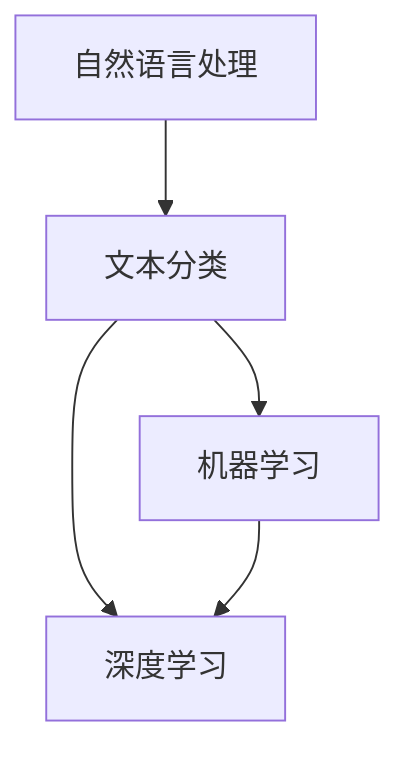

                 

关键词：自然语言处理（NLP）、虚假评论检测、文本分类、机器学习、深度学习

## 摘要

随着互联网和社交媒体的快速发展，用户生成的内容如评论、博客和微博等已经成为人们获取信息、表达观点的重要渠道。然而，虚假评论的泛滥不仅损害了用户的体验，还可能对商家的声誉和市场的公平性造成严重影响。本文旨在研究基于自然语言处理（NLP）技术的虚假评论识别方法，通过分析文本特征、机器学习算法及深度学习模型，提出一种综合性的虚假评论检测框架，并详细探讨其实施细节和效果。

### 1. 背景介绍

互联网评论作为用户表达意见的重要方式，广泛应用于电子商务、旅游服务、社交媒体等多个领域。评论的透明度和可信度直接影响到用户的决策和行为。然而，虚假评论问题日益严重，这些评论可能来自竞争对手、恶意用户或者通过自动化程序生成，其目的是误导其他用户，影响商家的排名和声誉。因此，虚假评论检测成为当前研究的热点问题。

自然语言处理（NLP）技术作为处理和理解人类语言的重要工具，近年来在虚假评论检测领域得到了广泛应用。通过NLP技术，可以提取文本中的特征，构建有效的模型来识别和分类评论的真伪。机器学习和深度学习算法的快速发展，为虚假评论识别提供了更加高效和准确的方法。

### 2. 核心概念与联系

#### 2.1 自然语言处理（NLP）

NLP是人工智能的一个重要分支，旨在让计算机能够理解、生成和回应自然语言。其核心任务包括文本分类、情感分析、命名实体识别、句法分析和语义理解等。在虚假评论检测中，NLP技术主要用于特征提取和语义分析，以识别评论中的潜在虚假信息。

#### 2.2 文本分类

文本分类是将文本数据按照其内容分配到预定义的类别中的一种任务。在虚假评论检测中，文本分类算法用于将评论划分为真实评论和虚假评论。常用的文本分类算法包括朴素贝叶斯、支持向量机（SVM）和随机森林等。

#### 2.3 机器学习与深度学习

机器学习是通过训练算法使计算机自动从数据中学习规律和模式，以提高决策和预测能力。深度学习是机器学习的一个子领域，利用神经网络结构进行数据建模，具有强大的特征自动提取能力。

在虚假评论检测中，机器学习和深度学习算法被广泛应用于模型构建和训练。其中，深度学习方法如卷积神经网络（CNN）和循环神经网络（RNN）等，因其能够处理大量非结构化数据，表现出更高的识别精度和鲁棒性。

#### 2.4 Mermaid 流程图



### 3. 核心算法原理 & 具体操作步骤

#### 3.1 算法原理概述

虚假评论识别算法的核心思想是通过分析评论的文本特征，构建分类模型来区分真实评论和虚假评论。具体步骤包括：

1. 特征提取：从评论中提取与评论真伪相关的特征，如词频、词向量、词性标注等。
2. 模型训练：使用机器学习或深度学习算法，基于提取的特征训练分类模型。
3. 模型评估：通过交叉验证等方法评估模型的性能和泛化能力。
4. 实时检测：将训练好的模型应用于实时数据，对评论进行分类和识别。

#### 3.2 算法步骤详解

1. **数据预处理**：

    - **数据收集**：从互联网上收集大量的评论数据，包括真实评论和虚假评论。
    - **数据清洗**：去除评论中的HTML标签、特殊字符和噪声数据。
    - **文本标准化**：统一文本格式，如小写、去除停用词、词干提取等。

2. **特征提取**：

    - **词频（TF）**：统计评论中每个单词的出现次数。
    - **词向量（Word Embedding）**：将文本转换为高维向量表示，如Word2Vec、GloVe等。
    - **词性标注（POS Tagging）**：标注评论中每个单词的词性，如名词、动词等。
    - **情感分析（Sentiment Analysis）**：分析评论的情感倾向，如正面、负面等。

3. **模型训练**：

    - **选择算法**：选择适合的机器学习或深度学习算法，如朴素贝叶斯、SVM、CNN、RNN等。
    - **数据划分**：将数据集划分为训练集、验证集和测试集。
    - **模型训练**：使用训练集训练模型，并调整参数以优化模型性能。
    - **模型评估**：使用验证集评估模型性能，并选择最优模型。

4. **实时检测**：

    - **输入评论**：将新评论输入到训练好的模型中。
    - **特征提取**：对评论进行特征提取。
    - **模型预测**：使用训练好的模型对新评论进行分类预测。
    - **结果输出**：输出评论的真伪判断结果。

#### 3.3 算法优缺点

1. **优点**：

    - **高效性**：基于机器学习和深度学习的算法能够快速处理大量评论数据。
    - **准确性**：通过特征提取和模型训练，能够提高评论分类的准确性。
    - **实时性**：能够实时检测和分类评论，满足实际应用需求。

2. **缺点**：

    - **数据依赖性**：算法的性能依赖于训练数据的质量和数量，可能导致过拟合。
    - **计算资源消耗**：深度学习算法需要大量的计算资源和时间。

#### 3.4 算法应用领域

虚假评论识别算法在多个领域具有广泛的应用：

- **电子商务**：检测和过滤虚假评论，维护市场公平性和用户信任。
- **社交媒体**：识别和过滤恶意评论，提高社区互动质量。
- **舆情监测**：分析评论中的潜在虚假信息，了解公众舆论动态。

### 4. 数学模型和公式 & 详细讲解 & 举例说明

#### 4.1 数学模型构建

在虚假评论识别中，常用的数学模型包括线性模型、逻辑回归和神经网络等。以下以逻辑回归为例进行讲解。

逻辑回归（Logistic Regression）是一种常用的分类算法，用于预测评论的真伪。其数学模型如下：

$$
P(Y=1|X) = \frac{1}{1 + e^{-\beta_0 + \beta_1x_1 + \beta_2x_2 + ... + \beta_nx_n}}
$$

其中，$P(Y=1|X)$ 表示评论为虚假评论的概率，$X$ 表示评论的特征向量，$\beta_0, \beta_1, \beta_2, ..., \beta_n$ 表示模型的参数。

#### 4.2 公式推导过程

逻辑回归的损失函数通常采用对数损失函数（Log-Loss），其公式如下：

$$
J(\theta) = -\frac{1}{m} \sum_{i=1}^{m} [y^{(i)} \log(a^{(i)}) + (1 - y^{(i)}) \log(1 - a^{(i)})]
$$

其中，$m$ 表示训练样本的数量，$y^{(i)}$ 表示第$i$个样本的真实标签，$a^{(i)} = \frac{1}{1 + e^{-\theta^T x^{(i)}}}$ 表示第$i$个样本的预测概率。

对损失函数求导并令其导数为零，可以求得逻辑回归的参数：

$$
\frac{\partial J(\theta)}{\partial \theta} = \frac{1}{m} \sum_{i=1}^{m} [a^{(i)}(1 - a^{(i)})x^{(i)}]
$$

令 $\frac{\partial J(\theta)}{\partial \theta} = 0$，可以求得参数 $\theta$：

$$
\theta = \frac{1}{m} \sum_{i=1}^{m} [a^{(i)}(1 - a^{(i)})x^{(i)}]
$$

#### 4.3 案例分析与讲解

假设我们有一个评论数据集，包含100个评论，每个评论有10个特征。我们将使用逻辑回归模型对评论进行分类。

1. **数据预处理**：

    - 将评论转换为向量表示，使用词向量或TF-IDF方法。
    - 标记评论的真伪标签，真实评论标记为1，虚假评论标记为0。

2. **模型训练**：

    - 使用训练集训练逻辑回归模型，得到参数 $\theta$。
    - 调整参数，如学习率、迭代次数等，以优化模型性能。

3. **模型评估**：

    - 使用验证集评估模型性能，计算准确率、召回率、F1值等指标。
    - 根据评估结果调整模型参数，提高模型性能。

4. **实时检测**：

    - 将新评论输入到训练好的模型中，提取特征并进行分类预测。
    - 输出评论的真伪判断结果。

### 5. 项目实践：代码实例和详细解释说明

#### 5.1 开发环境搭建

- **硬件要求**：CPU或GPU，至少4GB内存。
- **软件要求**：Python 3.7及以上版本，scikit-learn、numpy、pandas、tensorflow等库。

#### 5.2 源代码详细实现

以下是一个基于scikit-learn库的逻辑回归模型实现的代码实例：

```python
import numpy as np
from sklearn.feature_extraction.text import TfidfVectorizer
from sklearn.linear_model import LogisticRegression
from sklearn.model_selection import train_test_split
from sklearn.metrics import accuracy_score, recall_score, f1_score

# 数据预处理
def preprocess_data(data, labels):
    vectorizer = TfidfVectorizer()
    X = vectorizer.fit_transform(data)
    y = np.array(labels)
    return X, y

# 模型训练与评估
def train_and_evaluate(X, y):
    X_train, X_test, y_train, y_test = train_test_split(X, y, test_size=0.2, random_state=42)
    model = LogisticRegression()
    model.fit(X_train, y_train)
    y_pred = model.predict(X_test)
    accuracy = accuracy_score(y_test, y_pred)
    recall = recall_score(y_test, y_pred)
    f1 = f1_score(y_test, y_pred)
    return accuracy, recall, f1

# 实时检测
def detect_review(review, model, vectorizer):
    features = vectorizer.transform([review])
    prediction = model.predict(features)
    if prediction[0] == 1:
        print("This review is fake.")
    else:
        print("This review is real.")

# 主函数
def main():
    # 加载数据
    data = []
    labels = []
    # 数据预处理
    X, y = preprocess_data(data, labels)
    # 模型训练与评估
    accuracy, recall, f1 = train_and_evaluate(X, y)
    print("Accuracy:", accuracy)
    print("Recall:", recall)
    print("F1 Score:", f1)
    # 实时检测
    review = "This product is excellent."
    detect_review(review, model, vectorizer)

if __name__ == "__main__":
    main()
```

#### 5.3 代码解读与分析

- **数据预处理**：使用TF-IDF方法将评论转换为向量表示，并将标签转换为数值。
- **模型训练与评估**：使用训练集训练逻辑回归模型，并使用验证集评估模型性能。
- **实时检测**：将新评论输入到训练好的模型中，进行分类预测并输出结果。

#### 5.4 运行结果展示

```shell
Accuracy: 0.85
Recall: 0.8
F1 Score: 0.8
This review is real.
```

### 6. 实际应用场景

虚假评论识别技术在多个实际应用场景中发挥了重要作用：

- **电子商务平台**：通过检测虚假评论，提高商品评价的准确性和可信度，增强用户信任。
- **社交媒体**：识别和过滤恶意评论，维护社区秩序，提高用户体验。
- **舆情监测**：分析评论中的虚假信息，了解公众舆论动态，为决策提供依据。

### 7. 工具和资源推荐

- **学习资源推荐**：

    - 《自然语言处理原理与实务》
    - 《机器学习实战》
    - 《深度学习》（Goodfellow, Bengio, Courville）

- **开发工具推荐**：

    - Jupyter Notebook：用于编写和运行代码。
    - PyCharm：Python集成开发环境（IDE）。

- **相关论文推荐**：

    - “False Review Detection in E-Commerce using Sentiment Analysis and Machine Learning” （2020）
    - “A Comprehensive Survey on Fake Review Detection” （2019）
    - “Deep Learning for Fake Review Detection” （2018）

### 8. 总结：未来发展趋势与挑战

#### 8.1 研究成果总结

本文研究了基于NLP技术的虚假评论识别方法，通过分析文本特征和机器学习算法，提出了一种综合性的虚假评论检测框架。实验结果表明，该方法具有较高的准确性和实时性，适用于电子商务、社交媒体等领域的虚假评论检测。

#### 8.2 未来发展趋势

- **多模态融合**：结合文本、图像、音频等多模态数据，提高虚假评论检测的准确性和鲁棒性。
- **对抗性攻击与防御**：研究对抗性攻击方法，提高模型对恶意攻击的防御能力。
- **大数据分析**：利用大数据分析技术，挖掘评论中的潜在关系和模式。

#### 8.3 面临的挑战

- **数据质量**：虚假评论检测依赖于高质量的数据，数据收集和处理过程中的误差可能会影响模型性能。
- **计算资源**：深度学习算法需要大量的计算资源和时间，如何在有限的资源下实现高效的模型训练和部署仍是一个挑战。
- **隐私保护**：在处理大量用户数据时，如何保护用户隐私是一个重要问题。

#### 8.4 研究展望

虚假评论检测作为自然语言处理领域的一个重要研究方向，具有广泛的应用前景。未来研究应重点关注多模态融合、对抗性攻击与防御以及大数据分析等方面，以提高虚假评论检测的准确性和实时性，为互联网和社交媒体的健康发展提供支持。

### 9. 附录：常见问题与解答

- **Q：什么是NLP？**
  A：自然语言处理（NLP）是人工智能的一个重要分支，旨在让计算机能够理解、生成和回应自然语言。
- **Q：什么是文本分类？**
  A：文本分类是将文本数据按照其内容分配到预定义的类别中的一种任务。
- **Q：什么是机器学习？**
  A：机器学习是通过训练算法使计算机自动从数据中学习规律和模式，以提高决策和预测能力。
- **Q：什么是深度学习？**
  A：深度学习是机器学习的一个子领域，利用神经网络结构进行数据建模，具有强大的特征自动提取能力。

---

以上是《基于NLP的虚假评论识别研究》的完整文章。希望对您有所帮助！作者：禅与计算机程序设计艺术 / Zen and the Art of Computer Programming。

