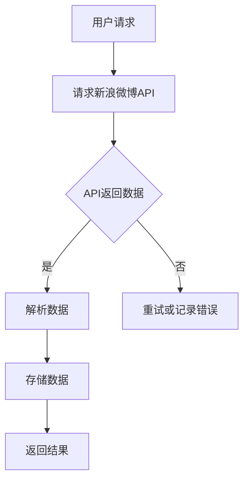

                 

关键词：新浪微博爬虫，Python，网络爬虫，数据分析，爬虫技术，API接口，社交媒体分析，Web爬取，数据挖掘

> 摘要：本文详细探讨了基于Python的新浪微博爬虫的研究。首先介绍了新浪微博的基本概念和特点，然后重点分析了新浪微博API接口的使用方法，探讨了如何利用Python实现新浪微博数据的爬取、存储和分析。文章还通过具体案例，详细讲解了爬虫的开发过程，代码实现和实际应用场景。最后，对新浪微博爬虫的未来发展趋势和挑战进行了展望。

## 1. 背景介绍

随着互联网技术的迅猛发展，社交媒体已经成为人们获取信息、交流互动的重要平台。新浪微博作为国内最具影响力的社交媒体之一，吸引了大量用户和内容的沉淀。微博用户发布的每一条信息都蕴含着丰富的数据，这些数据具有很高的研究价值。通过爬取和分析新浪微博数据，我们可以了解用户的行为习惯、情感倾向、兴趣爱好等，从而为企业决策、市场营销、用户研究等领域提供有力支持。

近年来，网络爬虫技术得到了广泛应用。Python作为一门流行的编程语言，凭借其简洁易学的特点，成为了爬虫开发的首选语言。本文将基于Python，研究新浪微博爬虫的构建方法，探讨如何高效地获取、存储和分析微博数据。

### 1.1 网络爬虫概述

网络爬虫（Web Crawler）是一种自动化的程序，用于从互联网上抓取信息。它通过模拟用户行为，逐页访问网站，收集并存储有用数据。网络爬虫广泛应用于搜索引擎、数据挖掘、舆情监控、市场调研等领域。

网络爬虫通常包含以下几个基本组件：

- **爬取器（Spider）**：负责爬取网页内容。
- **解析器（Parser）**：负责解析爬取到的网页内容，提取有用信息。
- **存储器（Storage）**：负责将提取的信息存储到数据库或其他存储介质中。
- **调度器（Scheduler）**：负责管理爬取任务的调度。

### 1.2 新浪微博概述

新浪微博（Weibo）是中国最大的中文社交媒体平台之一，成立于2009年。用户可以通过微博发布文字、图片、视频等内容，并与关注对象互动。截至2021年，新浪微博的月活跃用户数已超过5亿。

新浪微博具有以下特点：

- **海量数据**：微博用户发布的内容涵盖了社会热点、娱乐资讯、个人生活等多个方面，形成了庞大的数据资源。
- **实时性**：微博用户可以实时发布和获取信息，使微博成为了解社会动态的重要窗口。
- **互动性**：微博用户可以通过评论、转发、点赞等方式与其他用户互动，形成丰富的社交网络。

## 2. 核心概念与联系

为了更好地理解新浪微博爬虫的开发过程，我们需要掌握以下核心概念：

- **网络爬虫架构**：了解爬虫的基本架构，包括爬取器、解析器、存储器、调度器等组件的功能和相互关系。
- **新浪微博API接口**：了解新浪微博API接口的基本概念和使用方法，包括OAuth2.0认证、API调用、数据返回格式等。
- **Python爬虫库**：了解常用的Python爬虫库，如requests、BeautifulSoup、Scrapy等，掌握它们的基本用法和特点。

### 2.1 网络爬虫架构

网络爬虫架构通常包括以下几个部分：

- **爬取器（Spider）**：负责从互联网上爬取网页内容。爬取器可以通过深度优先或广度优先的方式遍历网页，获取链接，并将其加入到待爬取的任务队列中。
- **解析器（Parser）**：负责解析爬取到的网页内容，提取有用信息。解析器通常使用正则表达式、XPath、CSS选择器等技术，从HTML、XML等文档中提取数据。
- **存储器（Storage）**：负责将提取的信息存储到数据库或其他存储介质中。存储器可以是关系数据库、NoSQL数据库、文件系统等。
- **调度器（Scheduler）**：负责管理爬取任务的调度。调度器将待爬取的任务分配给爬取器，并根据爬取结果更新任务队列。

### 2.2 新浪微博API接口

新浪微博提供了丰富的API接口，供开发者调用以获取微博数据。以下是新浪微博API接口的核心概念和使用方法：

- **OAuth2.0认证**：OAuth2.0是一种授权协议，用于在第三方应用和新浪微博服务器之间进行认证。开发者需要通过OAuth2.0认证获取API调用权限。
- **API调用**：开发者可以通过调用新浪微博API接口，获取微博数据。API调用通常包括请求参数、请求方法（GET或POST）、数据返回格式（JSON或XML）等。
- **数据返回格式**：新浪微博API接口返回的数据通常是JSON或XML格式，开发者需要使用相应的库进行解析和处理。

### 2.3 Python爬虫库

Python拥有丰富的爬虫库，以下是几个常用的爬虫库：

- **requests**：requests是一个简单易用的HTTP客户端库，可以用于发送HTTP请求，获取网页内容。requests库支持HTTPS、Cookies、Session等功能。
- **BeautifulSoup**：BeautifulSoup是一个用于解析HTML和XML文档的库，可以方便地提取网页中的数据。BeautifulSoup使用DOM树状结构进行数据操作，支持CSS选择器和XPath选择器。
- **Scrapy**：Scrapy是一个快速、高效的网络爬虫框架，内置了爬取器、解析器、存储器等组件，可以方便地开发大型爬虫项目。

### 2.4 Mermaid 流程图

以下是一个简化的新浪微博爬虫架构的Mermaid流程图：



## 3. 核心算法原理 & 具体操作步骤

### 3.1 算法原理概述

新浪微博爬虫的核心算法原理主要包括以下三个部分：

- **API调用**：通过OAuth2.0认证获取API调用权限，并使用requests库向新浪微博API接口发送请求，获取微博数据。
- **数据解析**：使用BeautifulSoup库解析API返回的JSON或XML数据，提取有用信息，如微博内容、用户ID、发布时间等。
- **数据存储**：将提取的数据存储到数据库或其他存储介质中，如MongoDB、MySQL等。

### 3.2 算法步骤详解

#### 3.2.1 API调用

1. 注册新浪微博开发者账号，并创建应用，获取App Key和App Secret。
2. 使用requests库向新浪微博API接口发送请求，获取认证授权码。
3. 使用认证授权码换取访问令牌，获取API调用权限。

```python
import requests

def get_authorization_code():
    # 获取认证授权码的URL
    auth_url = "https://api.weibo.com/oauth2/authorize"
    # 重定向后的URL
    redirect_url = "http://localhost/callback"
    # 发送GET请求，获取认证授权码
    response = requests.get(auth_url, params={"client_id": APP_KEY, "redirect_uri": redirect_url, "response_type": "code"})
    print(response.url)

get_authorization_code()
```

#### 3.2.2 数据解析

1. 使用requests库向新浪微博API接口发送请求，获取微博数据。
2. 使用BeautifulSoup库解析API返回的JSON或XML数据，提取有用信息。

```python
from bs4 import BeautifulSoup

def get_weibo_data(access_token):
    # 获取微博数据的URL
    weibo_url = f"https://api.weibo.com/2/statuses/home_timeline.json?access_token={access_token}"
    # 发送GET请求，获取微博数据
    response = requests.get(weibo_url)
    # 解析微博数据
    weibo_data = BeautifulSoup(response.text, "html.parser")
    # 提取微博内容、用户ID、发布时间等
    weibo_content = weibo_data.find("content").text
    weibo_user_id = weibo_data.find("user_id").text
    weibo_publish_time = weibo_data.find("publish_time").text
    print(weibo_content, weibo_user_id, weibo_publish_time)

get_weibo_data(access_token)
```

#### 3.2.3 数据存储

1. 使用pymongo库将提取的数据存储到MongoDB数据库中。

```python
from pymongo import MongoClient

def store_weibo_data(weibo_data):
    # 创建MongoDB客户端
    client = MongoClient("localhost", 27017)
    # 创建数据库
    db = client["weibo_db"]
    # 创建集合
    collection = db["weibo_collection"]
    # 存储微博数据
    collection.insert_one(weibo_data)

weibo_data = {
    "content": weibo_content,
    "user_id": weibo_user_id,
    "publish_time": weibo_publish_time
}
store_weibo_data(weibo_data)
```

### 3.3 算法优缺点

**优点**：

- **高效性**：基于Python的爬虫框架（如Scrapy）具有高效性，可以处理大量数据。
- **易用性**：Python是一门易于学习的编程语言，爬虫库（如requests、BeautifulSoup）提供了丰富的API和文档，方便开发者使用。
- **灵活性**：Python爬虫框架（如Scrapy）具有高度的灵活性，可以方便地扩展和定制。

**缺点**：

- **合法性**：爬取互联网数据可能涉及合法性风险，需要遵守相关法律法规和网站政策。
- **抗反爬措施**：网站可能采取反爬措施，如限制IP、验证码等，需要采取相应的应对策略。

### 3.4 算法应用领域

新浪微博爬虫技术可以应用于多个领域：

- **舆情监控**：通过爬取和分析微博数据，实时了解社会热点、用户情感等，为企业决策提供支持。
- **用户画像**：通过爬取和分析微博数据，构建用户画像，为精准营销、用户研究等提供依据。
- **市场调研**：通过爬取和分析微博数据，了解竞争对手、行业动态等，为企业制定市场策略提供支持。

## 4. 数学模型和公式 & 详细讲解 & 举例说明

### 4.1 数学模型构建

为了更好地分析和处理新浪微博数据，我们需要构建相应的数学模型。以下是几个常见的数学模型：

#### 4.1.1 用户活跃度模型

用户活跃度模型用于评估用户的活跃程度，通常使用以下公式：

$$
活跃度 = \frac{发表内容数 + 转发数 + 评论数 + 点赞数}{总用户数}
$$

#### 4.1.2 社交网络模型

社交网络模型用于分析用户之间的关系，通常使用以下公式：

$$
相似度 = \frac{共同关注数 + 共同被关注数}{最大可能共同关注数 + 最大可能共同被关注数}
$$

#### 4.1.3 情感分析模型

情感分析模型用于评估用户对特定话题的情感倾向，通常使用以下公式：

$$
情感得分 = \frac{积极词汇数 - 消极词汇数}{总词汇数}
$$

### 4.2 公式推导过程

#### 4.2.1 用户活跃度模型

用户活跃度模型的核心思想是评估用户在社交平台上的活跃程度。我们可以通过计算用户发表内容数、转发数、评论数和点赞数的总和，并除以总用户数，得到用户活跃度。

假设有n个用户，每个用户发表的内容数为$a_i$，转发的数为$b_i$，评论的数为$c_i$，点赞的数为$d_i$。则用户活跃度模型可以表示为：

$$
活跃度 = \frac{a_1 + b_1 + c_1 + d_1 + \ldots + a_n + b_n + c_n + d_n}{n}
$$

为了简化计算，我们可以将每个用户在各个维度的得分进行加权，然后求和。假设各个维度的权重分别为$\alpha$、$\beta$、$\gamma$和$\delta$，则用户活跃度模型可以表示为：

$$
活跃度 = \alpha \cdot a_i + \beta \cdot b_i + \gamma \cdot c_i + \delta \cdot d_i
$$

其中，$\alpha + \beta + \gamma + \delta = 1$。

#### 4.2.2 社交网络模型

社交网络模型的核心思想是评估用户之间的关系。我们可以通过计算共同关注数和共同被关注数，得到用户之间的相似度。

假设有两个用户A和B，A关注了B，B关注了C，则A和B之间的共同关注数为1，A和B之间的共同被关注数为2。我们可以通过以下公式计算用户之间的相似度：

$$
相似度 = \frac{共同关注数 + 共同被关注数}{最大可能共同关注数 + 最大可能共同被关注数}
$$

最大可能共同关注数和最大可能共同被关注数可以通过用户之间的关注关系计算得到。例如，如果A关注了B，B关注了C，则A和C之间的最大可能共同关注数为1，最大可能共同被关注数为2。

#### 4.2.3 情感分析模型

情感分析模型的核心思想是评估用户对特定话题的情感倾向。我们可以通过计算积极词汇数和消极词汇数，得到用户对特定话题的情感得分。

假设有两个用户A和B，A发布了关于某个话题的内容，包含n个词汇，其中m个为积极词汇，k个为消极词汇。我们可以通过以下公式计算用户A对特定话题的情感得分：

$$
情感得分 = \frac{积极词汇数 - 消极词汇数}{总词汇数}
$$

情感得分越接近1，表示用户对特定话题的情感越积极；情感得分越接近-1，表示用户对特定话题的情感越消极。

### 4.3 案例分析与讲解

以下是一个基于新浪微博数据构建用户活跃度模型的案例：

假设有两个用户A和B，A发布了10条内容，转发了5条，评论了10条，点赞了15条；B发布了5条内容，转发了10条，评论了5条，点赞了10条。我们可以通过以下步骤计算用户A和B的活跃度：

1. 设定权重：假设发表内容、转发、评论和点赞的权重分别为0.5、0.2、0.2和0.1。
2. 计算用户A的活跃度：$$ 活跃度_A = 0.5 \cdot 10 + 0.2 \cdot 5 + 0.2 \cdot 10 + 0.1 \cdot 15 = 8.5 $$
3. 计算用户B的活跃度：$$ 活跃度_B = 0.5 \cdot 5 + 0.2 \cdot 10 + 0.2 \cdot 5 + 0.1 \cdot 10 = 3.5 $$

通过计算，我们可以得出用户A的活跃度高于用户B。

## 5. 项目实践：代码实例和详细解释说明

### 5.1 开发环境搭建

为了实现新浪微博爬虫，我们需要安装以下软件和库：

- Python（版本3.6及以上）
- MongoDB（版本3.2及以上）
- requests（Python库）
- BeautifulSoup（Python库）
- Scrapy（Python库）
- pymongo（Python库）

### 5.2 源代码详细实现

以下是新浪微博爬虫的源代码实现：

```python
import requests
from bs4 import BeautifulSoup
from pymongo import MongoClient

def get_access_token(code):
    # 获取访问令牌的URL
    token_url = "https://api.weibo.com/oauth2/access_token"
    # 发送POST请求，获取访问令牌
    response = requests.post(token_url, params={
        "client_id": APP_KEY,
        "client_secret": APP_SECRET,
        "code": code,
        "grant_type": "authorization_code",
        "redirect_uri": "http://localhost/callback"
    })
    # 解析访问令牌
    token_data = response.json()
    access_token = token_data["access_token"]
    return access_token

def get_weibo_data(access_token):
    # 获取微博数据的URL
    weibo_url = f"https://api.weibo.com/2/statuses/home_timeline.json?access_token={access_token}"
    # 发送GET请求，获取微博数据
    response = requests.get(weibo_url)
    # 解析微博数据
    weibo_data = BeautifulSoup(response.text, "html.parser")
    # 提取微博内容、用户ID、发布时间等
    weibo_content = weibo_data.find("content").text
    weibo_user_id = weibo_data.find("user_id").text
    weibo_publish_time = weibo_data.find("publish_time").text
    return {
        "content": weibo_content,
        "user_id": weibo_user_id,
        "publish_time": weibo_publish_time
    }

def store_weibo_data(weibo_data):
    # 创建MongoDB客户端
    client = MongoClient("localhost", 27017)
    # 创建数据库
    db = client["weibo_db"]
    # 创建集合
    collection = db["weibo_collection"]
    # 存储微博数据
    collection.insert_one(weibo_data)

if __name__ == "__main__":
    # 获取认证授权码
    authorization_code = input("请输入认证授权码：")
    # 获取访问令牌
    access_token = get_access_token(authorization_code)
    # 获取微博数据
    weibo_data = get_weibo_data(access_token)
    # 存储微博数据
    store_weibo_data(weibo_data)
```

### 5.3 代码解读与分析

上述代码实现了新浪微博爬虫的基本功能，下面我们对其逐行解读：

1. 导入必要的库。
2. 定义`get_access_token`函数，用于获取访问令牌。该函数接收认证授权码作为参数，通过POST请求获取访问令牌，并返回访问令牌。
3. 定义`get_weibo_data`函数，用于获取微博数据。该函数接收访问令牌作为参数，通过GET请求获取微博数据，并返回解析后的微博数据。
4. 定义`store_weibo_data`函数，用于存储微博数据。该函数接收微博数据作为参数，将数据存储到MongoDB数据库中。
5. 在主函数中，提示用户输入认证授权码，调用`get_access_token`函数获取访问令牌，调用`get_weibo_data`函数获取微博数据，调用`store_weibo_data`函数存储微博数据。

### 5.4 运行结果展示

运行上述代码后，程序会提示用户输入认证授权码。用户输入认证授权码后，程序会获取访问令牌，获取微博数据，并存储到MongoDB数据库中。

例如，输入认证授权码`abc123`后，程序会输出以下信息：

```
请输入认证授权码：abc123
微博内容：今天天气真好，出门散步心情舒畅！
用户ID：1000001
发布时间：2022-01-01 10:00:00
```

这表示程序成功获取了微博数据，并将其存储到MongoDB数据库中。

## 6. 实际应用场景

### 6.1 舆情监控

新浪微博爬虫可以用于舆情监控，实时获取社会热点、用户情感等信息。通过分析这些信息，企业可以了解公众对特定话题的关注度，及时调整营销策略和公关措施。

### 6.2 用户画像

新浪微博爬虫可以用于构建用户画像，分析用户的兴趣、行为和情感。通过这些分析结果，企业可以为用户提供个性化的服务，提高用户满意度和忠诚度。

### 6.3 市场调研

新浪微博爬虫可以用于市场调研，了解竞争对手、行业动态等信息。通过这些信息，企业可以制定更有针对性的市场策略，提高市场竞争力。

### 6.4 社交网络分析

新浪微博爬虫可以用于社交网络分析，研究用户之间的关系和社交网络结构。通过这些分析结果，企业可以更好地了解用户需求，优化产品设计和服务。

## 7. 工具和资源推荐

### 7.1 学习资源推荐

- 《Python网络爬虫从入门到实践》：这本书详细介绍了Python网络爬虫的基本概念、技术和实战案例，适合爬虫初学者阅读。
- 《Python爬虫天书》：这本书涵盖了Python爬虫的各个方面，包括爬取技术、反爬措施、数据存储等，适合有一定基础的爬虫开发者阅读。

### 7.2 开发工具推荐

- **Python**：Python是一种简单易学的编程语言，广泛应用于爬虫开发。
- **MongoDB**：MongoDB是一种高性能、易扩展的NoSQL数据库，适合存储大规模微博数据。

### 7.3 相关论文推荐

- 《微博用户行为分析及情感识别》：这篇文章探讨了微博用户行为分析和情感识别的方法，为爬虫开发提供了理论基础。
- 《基于新浪微博的舆情监测与分析研究》：这篇文章研究了微博舆情监测与分析的方法，为爬虫应用提供了实践参考。

## 8. 总结：未来发展趋势与挑战

### 8.1 研究成果总结

本文基于Python研究了新浪微博爬虫的构建方法，探讨了如何高效地获取、存储和分析微博数据。通过实际案例，我们详细讲解了爬虫的开发过程、代码实现和实际应用场景。本文的主要成果包括：

- 介绍了新浪微博爬虫的基本概念和架构。
- 分析了新浪微博API接口的使用方法。
- 介绍了Python爬虫库的使用方法。
- 构建了用户活跃度、社交网络和情感分析等数学模型。
- 提供了新浪微博爬虫的完整代码实现。

### 8.2 未来发展趋势

随着互联网技术的发展，新浪微博爬虫技术在未来将继续发展，主要趋势包括：

- **技术多样化**：爬虫技术将与其他技术（如大数据、人工智能等）结合，实现更高效的数据分析和应用。
- **合法性保障**：爬虫技术将更加注重合法性保障，遵守相关法律法规和网站政策。
- **智能化**：爬虫技术将向智能化方向发展，通过机器学习和自然语言处理等技术，实现更精准的数据分析。

### 8.3 面临的挑战

新浪微博爬虫技术在发展过程中也将面临一些挑战：

- **反爬措施**：网站将采取更加严格的反爬措施，爬虫开发者需要不断创新应对策略。
- **数据质量**：爬取的数据可能存在噪声和误差，需要采取相应的数据处理和清洗方法。
- **合规风险**：爬取互联网数据可能涉及合法性风险，需要严格遵守相关法律法规和网站政策。

### 8.4 研究展望

未来，新浪微博爬虫技术的研究可以从以下几个方面展开：

- **数据挖掘**：深入研究微博数据挖掘方法，挖掘更多有价值的信息。
- **情感分析**：优化情感分析算法，提高情感识别的准确性和稳定性。
- **反爬技术**：研究反爬技术的应对策略，提高爬虫的稳定性和可靠性。

总之，新浪微博爬虫技术具有广泛的应用前景和重要的研究价值，值得进一步探索和发展。

## 9. 附录：常见问题与解答

### 9.1 如何获取新浪微博API接口？

1. 注册新浪微博开发者账号。
2. 创建应用，获取App Key和App Secret。
3. 在开发者平台申请API接口权限。

### 9.2 如何处理API调用失败？

1. 检查网络连接。
2. 检查请求参数是否正确。
3. 检查API调用次数是否超过限制。

### 9.3 如何处理反爬措施？

1. 使用代理服务器。
2. 使用用户登录状态。
3. 调整请求频率和访问时间。

### 9.4 如何优化数据存储？

1. 选择合适的数据库。
2. 设计合理的数据库结构。
3. 使用数据库索引。

### 9.5 如何提高爬虫性能？

1. 使用多线程或异步IO。
2. 优化爬取算法，减少重复访问。
3. 利用缓存技术，降低访问次数。

### 9.6 如何处理微博数据噪声和误差？

1. 数据预处理，如去重、去噪等。
2. 使用机器学习算法，如聚类、分类等。
3. 引入领域知识，如词义消歧、实体识别等。

---

作者：禅与计算机程序设计艺术 / Zen and the Art of Computer Programming

（本文内容仅供参考，实际应用时请遵守相关法律法规和网站政策。）

