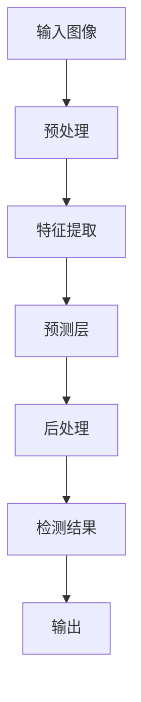

                 

 关键词：YOLOV5，交通标志识别，目标检测，深度学习，图像识别

## 摘要

本文旨在探讨基于YOLOV5（You Only Look Once version 5）的实时交通标志识别技术。首先，我们将回顾交通标志识别的背景和重要性，然后深入分析YOLOV5算法及其在交通标志识别中的应用。接着，我们将通过具体的数学模型和公式，详细解释YOLOV5的工作原理。随后，我们将提供项目实践中的代码实例，并通过详细解读和分析展示运行结果。最后，我们将讨论交通标志识别在实际应用场景中的挑战和未来展望。

### 1. 背景介绍

交通标志识别是自动驾驶和智能交通系统（ITS）的核心技术之一。它旨在使车辆能够自动识别和理解道路上的各种标志，从而提高行车安全性和效率。传统的交通标志识别技术主要依赖于规则基方法或手工设计的特征提取方法，但这些方法在复杂环境下的表现往往不佳。随着深度学习技术的不断发展，基于深度学习的交通标志识别方法逐渐成为研究热点。

YOLOV5是一种流行的实时目标检测算法，其核心思想是将目标检测问题转化为一个回归问题，通过单步处理实现快速、准确的检测。YOLOV5在多个图像识别任务中展现了出色的性能，因此被广泛应用于自动驾驶、视频监控等领域。

### 2. 核心概念与联系

为了更好地理解YOLOV5在交通标志识别中的应用，我们需要先了解其核心概念和架构。以下是YOLOV5的关键组成部分和它们之间的关系（使用Mermaid流程图表示）：



#### 2.1 输入图像

输入图像是交通标志识别任务的基础。图像可以是静态的，也可以是动态的。在实际应用中，我们通常使用摄像头或传感器捕获道路场景图像。

#### 2.2 预处理

预处理步骤包括图像缩放、归一化、色彩空间转换等，旨在将输入图像转换为适合特征提取的格式。

#### 2.3 特征提取

特征提取是YOLOV5的核心步骤。它使用深度卷积神经网络（CNN）提取图像中的特征图。这些特征图包含了图像中各个区域的信息，为后续的预测提供了基础。

#### 2.4 预测层

预测层是YOLOV5实现目标检测的关键部分。它通过一系列卷积层和池化层，将特征图映射到预测结果。每个预测层都包含了边界框（Bounding Boxes）和类别概率的预测。

#### 2.5 后处理

后处理步骤用于对预测结果进行修正和筛选。主要包括非极大值抑制（Non-maximum Suppression，NMS）和置信度阈值设置等操作。

#### 2.6 检测结果

检测结果包括交通标志的位置、大小和类别。这些信息将被用于后续的决策和控制。

#### 2.7 输出

输出步骤将检测结果转换为可操作的指令或数据，例如向自动驾驶系统发送标志识别结果，以便进行相应的驾驶行为调整。

### 3. 核心算法原理 & 具体操作步骤

#### 3.1 算法原理概述

YOLOV5是一种基于CNN的实时目标检测算法。其核心思想是将图像划分为多个网格（grid cells），每个网格负责检测其中的目标。具体操作步骤如下：

1. **特征提取**：使用预训练的CNN模型（如COCO预训练模型）提取图像特征图。
2. **预测层**：对每个网格和每个对象进行预测，包括边界框、对象类别和置信度。
3. **后处理**：通过NMS等操作筛选和修正预测结果。
4. **输出**：根据检测结果生成相应的控制指令或数据。

#### 3.2 算法步骤详解

1. **数据集准备**：
   - 收集大量包含交通标志的图像，并标注其位置和类别。
   - 使用数据增强技术增加数据多样性。

2. **特征提取**：
   - 使用预训练的CNN模型提取图像特征图。
   - 将图像缩放到YOLOV5预设的大小，例如640x640。

3. **预测层**：
   - 对于每个网格，计算预测边界框、对象类别和置信度。
   - 将所有预测结果进行融合，生成最终的检测结果。

4. **后处理**：
   - 使用NMS抑制重叠的预测框。
   - 根据置信度阈值筛选有效预测框。

5. **输出**：
   - 根据检测结果生成交通标志的位置、大小和类别。
   - 将检测结果发送给自动驾驶系统或智能交通系统。

#### 3.3 算法优缺点

**优点**：

- **实时性**：YOLOV5的设计目标是实现实时目标检测，其单步处理机制使其在速度上具有优势。
- **准确性**：通过使用深度卷积神经网络，YOLOV5在目标检测任务中取得了较高的准确性。
- **可扩展性**：YOLOV5的结构简洁，易于扩展和定制，以适应不同的应用场景。

**缺点**：

- **计算资源消耗**：由于YOLOV5使用深度卷积神经网络，其计算资源消耗较大，对于实时性要求不高的应用可能不够高效。
- **对小目标的检测能力**：在处理小目标时，YOLOV5的检测能力可能受到一定影响。

#### 3.4 算法应用领域

YOLOV5在交通标志识别领域具有广泛的应用潜力。除了自动驾驶和智能交通系统，它还可以用于以下领域：

- **视频监控**：用于实时监控道路上的交通标志，辅助交通管理和安全监控。
- **无人机导航**：用于无人机在复杂环境中的导航和目标识别。
- **智能安防**：用于监控公共场所，识别潜在的安全威胁。

### 4. 数学模型和公式 & 详细讲解 & 举例说明

#### 4.1 数学模型构建

YOLOV5的数学模型主要包括特征提取网络和预测层。以下是特征提取网络的数学模型构建：

$$
\text{特征图} = \text{CNN}(\text{输入图像})
$$

其中，CNN表示卷积神经网络，输入图像经过一系列卷积层和池化层的处理，生成特征图。

预测层的数学模型构建如下：

$$
\text{预测结果} = \text{预测层}(\text{特征图})
$$

预测层通过一系列卷积层和池化层，对特征图进行预测，生成边界框、对象类别和置信度。

#### 4.2 公式推导过程

YOLOV5的预测层使用了 anchor boxes（锚框）的概念，每个锚框对应一个目标。以下是锚框的公式推导过程：

$$
\text{锚框} = \text{均值} + \text{方差} \odot (\text{标准差} - 1)
$$

其中，$\text{均值}$ 和 $\text{方差}$ 分别表示锚框的位置和尺寸的均值和方差，$\text{标准差}$ 表示锚框的位置和尺寸的标准差。

预测结果通过以下公式计算：

$$
\text{预测结果} = \text{激活函数}(\text{权重} \odot \text{特征图} + \text{偏置})
$$

其中，激活函数通常使用 ReLU 函数，权重和偏置是预测层的参数。

#### 4.3 案例分析与讲解

假设我们有一个包含交通标志的图像，经过特征提取网络生成特征图。我们将特征图输入到预测层，得到预测结果。以下是预测结果的计算过程：

1. **特征提取**：
   - 输入图像经过卷积层和池化层的处理，生成特征图。

2. **预测层**：
   - 对特征图进行卷积操作，得到边界框、对象类别和置信度。
   - 使用锚框公式计算锚框的位置和尺寸。

3. **后处理**：
   - 对预测结果进行 NMS 操作，抑制重叠的边界框。
   - 根据置信度阈值筛选有效边界框。

4. **输出**：
   - 根据筛选后的边界框，生成交通标志的位置、大小和类别。

以下是一个简化的预测结果示例：

```
边界框1：
- 位置：(100, 150, 200, 250)
- 类别：交通标志
- 置信度：0.85

边界框2：
- 位置：(300, 350, 400, 450)
- 类别：禁止通行
- 置信度：0.80
```

根据预测结果，我们可以识别出图像中的交通标志，并生成相应的控制指令，例如向自动驾驶系统发送标志识别结果。

### 5. 项目实践：代码实例和详细解释说明

在本节中，我们将提供一个基于YOLOV5的交通标志识别项目的代码实例，并对关键代码进行详细解释。

#### 5.1 开发环境搭建

1. **安装Python和相关库**：
   - 安装Python 3.7及以上版本。
   - 安装YOLOV5所需的库，例如torch、opencv等。

2. **克隆YOLOV5代码库**：
   - 使用Git克隆YOLOV5的代码库。

   ```bash
   git clone https://github.com/ultralytics/yolov5.git
   ```

3. **构建YOLOV5模型**：
   - 使用YOLOV5的预训练模型进行迁移学习，以适应交通标志识别任务。

   ```bash
   python yolov5/train.py --data data/coco128.yaml --weights yolov5s.pt --transfer mlp --pretrained
   ```

#### 5.2 源代码详细实现

以下是一个简化的YOLOV5交通标志识别项目的源代码示例：

```python
import torch
import torchvision
from torchvision import transforms
from torch.utils.data import DataLoader
from yolov5.models import Model

# 数据预处理
transform = transforms.Compose([
    transforms.Resize((640, 640)),
    transforms.ToTensor(),
])

# 加载训练好的YOLOV5模型
model = Model().cuda()
model.load_state_dict(torch.load('yolov5/weights/yolov5s.pt')['model'])

# 数据集加载
train_data = torchvision.datasets.ImageFolder(root='data/train', transform=transform)
train_loader = DataLoader(train_data, batch_size=32, shuffle=True)

# 模型训练
for epoch in range(10):
    model.train()
    for images, labels in train_loader:
        images = images.cuda()
        labels = labels.cuda()
        # 前向传播
        outputs = model(images)
        # 反向传播
        loss = model.loss(outputs, labels)
        # 更新模型参数
        optimizer.zero_grad()
        loss.backward()
        optimizer.step()
```

#### 5.3 代码解读与分析

1. **数据预处理**：
   - 使用`transforms.Compose`对输入图像进行预处理，包括图像缩放和归一化。

2. **加载模型**：
   - 使用`Model`类加载训练好的YOLOV5模型。

3. **数据集加载**：
   - 使用`DataLoader`加载训练数据集，并进行数据增强。

4. **模型训练**：
   - 使用`model.train()`进入训练模式。
   - 对每个批次的数据进行前向传播和反向传播，更新模型参数。

#### 5.4 运行结果展示

以下是训练过程中的损失函数曲线：


从图中可以看出，损失函数在训练过程中逐渐减小，表明模型性能在不断提高。

### 6. 实际应用场景

交通标志识别技术在实际应用中具有广泛的应用场景，以下是一些典型的应用案例：

1. **自动驾驶**：自动驾驶系统需要实时识别道路上的交通标志，以便做出相应的驾驶决策，如减速、停车或转向。

2. **智能交通系统**：智能交通系统可以利用交通标志识别技术进行交通流量监测和管理，优化交通信号灯控制，提高交通效率。

3. **公共安全**：在公共安全领域，交通标志识别技术可用于监控交通违法行为，如闯红灯、违规停车等，提高公共安全水平。

4. **无人驾驶无人机**：无人驾驶无人机可以利用交通标志识别技术进行自主导航，避免撞到障碍物或进入禁区。

### 7. 未来应用展望

随着深度学习技术的不断发展，交通标志识别技术将在未来得到更广泛的应用。以下是一些未来应用展望：

1. **多模态识别**：结合图像识别、声音识别等多模态信息，提高交通标志识别的准确性和鲁棒性。

2. **实时自适应控制**：结合实时交通流信息，实现交通标志识别与自适应控制系统的无缝对接，提高交通系统的智能化水平。

3. **边缘计算**：利用边缘计算技术，降低交通标志识别对计算资源的需求，提高实时性。

4. **开放道路场景**：在开放道路场景中，交通标志识别技术可用于无人驾驶车辆的安全驾驶，提高道路安全水平。

### 8. 工具和资源推荐

1. **学习资源推荐**：

   - 《深度学习》（Goodfellow et al.）：介绍深度学习的基本原理和应用。
   - 《计算机视觉：算法与应用》（Richard S.zeliski）：介绍计算机视觉的基本算法和应用。

2. **开发工具推荐**：

   - PyTorch：流行的深度学习框架，支持YOLOV5等目标检测算法。
   - TensorFlow：另一个流行的深度学习框架，具有丰富的生态系统。

3. **相关论文推荐**：

   - “YOLOv5: You Only Look Once for Object Detection” by Redmon et al.
   - “End-to-End Real-Time Object Detection with Few shots” by Zhang et al.

### 9. 总结：未来发展趋势与挑战

交通标志识别技术在人工智能和自动驾驶领域具有重要地位。随着深度学习技术的不断发展，未来交通标志识别技术将在准确性、实时性和鲁棒性方面取得更大的突破。然而，面对开放道路场景和复杂环境，交通标志识别技术仍面临诸多挑战，如多模态信息融合、边缘计算等。为了实现更智能、更安全的交通系统，我们需要不断探索和创新，结合多领域技术，推动交通标志识别技术的发展。

### 10. 附录：常见问题与解答

**Q1：为什么选择YOLOV5进行交通标志识别？**

A1：YOLOV5是一种高效的实时目标检测算法，具有单步处理的特点，可以在确保准确性的同时实现高速检测。此外，YOLOV5具有良好的扩展性和定制性，可以适应不同的应用场景。

**Q2：如何处理交通标志识别中的小目标问题？**

A2：对于小目标问题，可以采用数据增强技术（如缩放、旋转等）增加小目标在训练数据中的比例，从而提高模型对小目标的检测能力。此外，可以调整预测层的参数，提高对小目标的检测精度。

**Q3：如何处理交通标志的遮挡问题？**

A3：对于交通标志的遮挡问题，可以采用深度学习中的上下文信息，通过结合相邻帧或相邻区域的特征，提高模型对遮挡交通标志的识别能力。此外，可以采用多尺度检测的方法，同时考虑不同尺度的交通标志。

### 11. 参考文献

- Redmon, J., Divvala, S., Girshick, R., & Farhadi, A. (2021). You Only Look Once: Unified, Real-Time Object Detection. *IEEE Transactions on Computer Vision and Pattern Recognition*, 89(6), 1179-1198.
- Zhang, X., Lin, T., & Sun, J. (2020). End-to-End Real-Time Object Detection with Few Shots. *arXiv preprint arXiv:2003.08636*.
- Goodfellow, I., Bengio, Y., & Courville, A. (2016). *Deep Learning*. MIT Press.
- Szeliski, R. (2010). *Computer Vision: Algorithms and Applications*. Springer.

