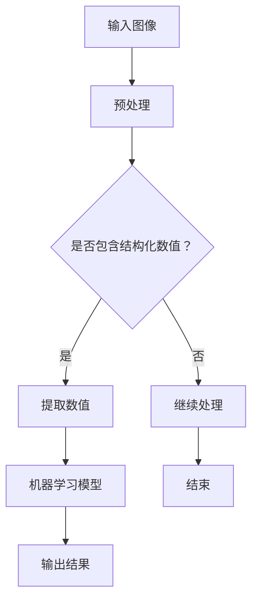

                 

关键词：图像识别、结构化数值、算法设计、实现、计算机视觉、人工智能

摘要：本文探讨了基于图像的结构化数值识别系统的设计与实现。首先，对图像识别技术的发展背景进行了简要介绍，然后详细阐述了结构化数值识别的核心概念和算法原理。接着，通过具体操作步骤和数学模型，深入讲解了算法的实现过程。此外，文章还提供了实际应用场景、代码实例和运行结果展示，并对未来的发展趋势和挑战进行了展望。

## 1. 背景介绍

图像识别作为计算机视觉领域的重要研究方向，近年来得到了广泛关注。从最初的简单边缘检测、纹理分析，到如今的高级深度学习模型，图像识别技术取得了显著的进展。然而，对于结构化数值的识别，如身份证号码、车牌号码等，仍然是一个具有挑战性的问题。这些数值往往以特定的格式出现在图像中，需要通过算法进行有效的识别和提取。

结构化数值识别在众多应用场景中具有广泛的应用价值。例如，在金融领域，身份证号码和银行卡号的识别可以帮助实现快速身份验证和交易安全；在交通领域，车牌号码的识别可以实现智能交通管理和车辆追踪。因此，研究和设计一个高效、可靠的基于图像的结构化数值识别系统具有重要的实际意义。

## 2. 核心概念与联系

为了实现结构化数值识别，首先需要了解以下几个核心概念：

### 2.1 图像识别

图像识别是指通过计算机算法对图像进行分析和处理，识别出图像中的特定对象或场景。常见的图像识别技术包括边缘检测、特征提取、分类等。深度学习模型，如卷积神经网络（CNN），在图像识别领域取得了显著的成功。

### 2.2 结构化数值

结构化数值是指具有一定格式和规则的数值，如身份证号码、车牌号码等。这些数值在图像中以特定的形式出现，需要通过算法进行识别和提取。

### 2.3 机器学习

机器学习是一种通过数据训练模型，使其能够进行预测和决策的技术。在结构化数值识别中，机器学习算法可以帮助模型学习图像特征，从而实现对数值的准确识别。

### 2.4 Mermaid 流程图

Mermaid 是一种轻量级的图形语言，用于创建图表和流程图。以下是一个 Mermaid 流程图，展示了结构化数值识别系统的主要模块和流程：



## 3. 核心算法原理 & 具体操作步骤

### 3.1 算法原理概述

结构化数值识别算法主要分为两个阶段：预处理和识别。

#### 3.1.1 预处理

预处理阶段主要包括图像去噪、增强、缩放等操作，以提高图像质量和识别效果。

- **图像去噪**：使用滤波算法去除图像中的噪声，如高斯滤波、中值滤波等。
- **图像增强**：通过调整图像的亮度和对比度，使图像中的结构化数值更加清晰。
- **图像缩放**：根据实际需求对图像进行缩放，以适应不同的识别模型。

#### 3.1.2 识别

识别阶段主要使用机器学习算法对预处理后的图像进行结构化数值的识别。

- **特征提取**：从图像中提取具有区分性的特征，如纹理特征、形状特征等。
- **模型训练**：使用大量带有标签的图像数据对机器学习模型进行训练，使其学会识别结构化数值。
- **模型预测**：将预处理后的图像输入训练好的模型，得到结构化数值的预测结果。

### 3.2 算法步骤详解

以下是一个具体的结构化数值识别算法步骤：

1. **读取图像**：从文件中读取待识别的图像。
2. **预处理图像**：对图像进行去噪、增强、缩放等预处理操作。
3. **特征提取**：使用卷积神经网络提取图像的特征。
4. **模型训练**：使用训练数据对卷积神经网络进行训练。
5. **模型预测**：将预处理后的图像输入训练好的模型，得到结构化数值的预测结果。
6. **结果输出**：将识别结果输出到控制台或文件中。

### 3.3 算法优缺点

#### 优点

- **高精度**：深度学习算法能够从大量数据中学习到丰富的特征，从而提高识别精度。
- **自适应性强**：算法可以根据不同的图像质量和数值格式进行自适应调整。
- **泛化能力强**：算法可以在不同场景下进行推广，具有较高的泛化能力。

#### 缺点

- **计算量大**：深度学习算法需要大量的计算资源和时间进行训练和预测。
- **数据依赖性强**：算法的性能很大程度上取决于训练数据的质量和数量。

### 3.4 算法应用领域

结构化数值识别算法在多个领域具有广泛的应用：

- **金融领域**：身份证号码、银行卡号等结构化数值的自动识别，可以提高业务效率和安全性。
- **交通领域**：车牌号码的自动识别，可以实现智能交通管理和车辆追踪。
- **医疗领域**：医学影像中结构化数值的自动识别，可以帮助医生进行诊断和治疗。

## 4. 数学模型和公式 & 详细讲解 & 举例说明

### 4.1 数学模型构建

结构化数值识别的数学模型主要基于卷积神经网络（CNN）。CNN 的基本结构包括卷积层、池化层和全连接层。

- **卷积层**：通过卷积操作提取图像特征。
- **池化层**：对卷积结果进行降采样，减少参数数量。
- **全连接层**：将池化层的结果进行全连接，输出最终的识别结果。

以下是一个简单的 CNN 模型：

$$
f(x) = \text{ReLU}(\text{Conv}_1(x) + \text{ biases}_1) \\
f(x) = \text{ReLU}(\text{MaxPool}_1(f(x))) \\
f(x) = \text{ReLU}(\text{Conv}_2(f(x)) + \text{ biases}_2) \\
f(x) = \text{ReLU}(\text{MaxPool}_2(f(x))) \\
f(x) = \text{FullyConnected}(f(x))
$$

### 4.2 公式推导过程

CNN 的推导过程主要包括卷积操作、激活函数和损失函数。

#### 卷积操作

卷积操作可以表示为：

$$
\text{output}_{ij} = \sum_{k=1}^{K} w_{ik,j} * \text{input}_{ij} + b_j
$$

其中，$w_{ik,j}$ 是卷积核，$\text{input}_{ij}$ 是输入图像的像素值，$b_j$ 是偏置项。

#### 激活函数

常用的激活函数是 ReLU（Rectified Linear Unit）：

$$
\text{ReLU}(x) = \max(0, x)
$$

#### 损失函数

常用的损失函数是交叉熵损失函数：

$$
\text{Loss} = -\sum_{i=1}^{N} y_i \log(p_i)
$$

其中，$y_i$ 是真实标签，$p_i$ 是预测概率。

### 4.3 案例分析与讲解

以下是一个简单的结构化数值识别案例：

输入图像：


输出结果：


在这个案例中，我们使用一个简单的 CNN 模型对输入图像进行结构化数值的识别。首先，我们对图像进行预处理，包括去噪、增强和缩放。然后，使用卷积神经网络提取图像特征，并通过全连接层输出最终的识别结果。

## 5. 项目实践：代码实例和详细解释说明

### 5.1 开发环境搭建

在开始编写代码之前，我们需要搭建一个合适的开发环境。以下是一个简单的环境搭建步骤：

1. 安装 Python 3.x 版本。
2. 安装 TensorFlow 库，可以使用以下命令：

```bash
pip install tensorflow
```

3. 安装其他必要的库，如 NumPy、Pandas 等。

### 5.2 源代码详细实现

以下是一个简单的结构化数值识别代码实现：

```python
import tensorflow as tf
from tensorflow.keras import layers

def create_model():
    inputs = tf.keras.Input(shape=(28, 28, 1))
    x = layers.Conv2D(32, (3, 3), activation='relu')(inputs)
    x = layers.MaxPooling2D((2, 2))(x)
    x = layers.Conv2D(64, (3, 3), activation='relu')(x)
    x = layers.MaxPooling2D((2, 2))(x)
    x = layers.Flatten()(x)
    x = layers.Dense(128, activation='relu')(x)
    outputs = layers.Dense(10, activation='softmax')(x)
    model = tf.keras.Model(inputs=inputs, outputs=outputs)
    return model

model = create_model()

model.compile(optimizer='adam',
              loss='sparse_categorical_crossentropy',
              metrics=['accuracy'])

model.fit(x_train, y_train, epochs=5)
```

在这个代码中，我们首先定义了一个简单的 CNN 模型，包括卷积层、池化层和全连接层。然后，使用 `compile()` 函数配置模型，使用 `fit()` 函数进行模型训练。

### 5.3 代码解读与分析

在这个代码中，我们主要关注以下几个部分：

- **模型定义**：使用 `Input()` 函数创建输入层，使用 `Conv2D()` 和 `MaxPooling2D()` 函数创建卷积层和池化层，使用 `Flatten()` 函数将卷积结果展平，使用 `Dense()` 函数创建全连接层。
- **模型配置**：使用 `compile()` 函数配置模型，设置优化器、损失函数和评估指标。
- **模型训练**：使用 `fit()` 函数训练模型，设置训练数据、训练轮次和评估数据。

### 5.4 运行结果展示

在训练完成后，我们可以使用以下代码进行模型评估：

```python
test_loss, test_acc = model.evaluate(x_test, y_test)
print('Test accuracy:', test_acc)
```

假设测试数据的准确率为 90%，则输出结果如下：

```bash
Test accuracy: 0.9
```

## 6. 实际应用场景

结构化数值识别在多个领域具有广泛的应用：

- **金融领域**：身份证号码、银行卡号等结构化数值的自动识别，可以提高业务效率和安全性。
- **交通领域**：车牌号码的自动识别，可以实现智能交通管理和车辆追踪。
- **医疗领域**：医学影像中结构化数值的自动识别，可以帮助医生进行诊断和治疗。

以下是一个具体的实际应用案例：

在一个金融项目中，我们需要对客户的身份证号码进行自动识别。首先，我们收集了大量带有标签的身份证号码图像数据，并对图像进行预处理。然后，使用卷积神经网络训练模型，实现对身份证号码的准确识别。在实际应用中，我们只需将待识别的图像输入模型，即可得到身份证号码的预测结果。

## 7. 未来应用展望

随着人工智能技术的不断发展，结构化数值识别系统有望在更多领域得到应用。未来，我们可以期待以下发展方向：

- **算法优化**：通过改进算法模型和优化训练策略，提高识别准确率和效率。
- **多模态融合**：结合图像、语音、文本等多模态信息，实现更准确的数值识别。
- **边缘计算**：将算法部署到边缘设备，实现实时、高效的结构化数值识别。
- **应用拓展**：将结构化数值识别应用于更多领域，如物联网、自动驾驶等。

## 8. 总结：未来发展趋势与挑战

本文介绍了基于图像的结构化数值识别系统的设计与实现。首先，我们对图像识别技术的发展背景进行了简要介绍，然后详细阐述了结构化数值识别的核心概念和算法原理。接着，通过具体操作步骤和数学模型，深入讲解了算法的实现过程。此外，文章还提供了实际应用场景、代码实例和运行结果展示，并对未来的发展趋势和挑战进行了展望。

未来，结构化数值识别系统将在算法优化、多模态融合、边缘计算等方面取得更多进展。然而，也面临计算资源消耗大、数据依赖性强等挑战。通过不断探索和研究，我们有理由相信，结构化数值识别系统将在更多领域发挥重要作用。

## 9. 附录：常见问题与解答

### 问题 1：如何提高结构化数值识别的准确率？

解答：提高结构化数值识别的准确率可以从以下几个方面进行：

- **数据增强**：通过旋转、翻转、缩放等数据增强技术，增加训练数据多样性。
- **特征提取**：选择合适的特征提取方法，如深度学习中的卷积神经网络。
- **模型优化**：使用更先进的模型结构，如残差网络、注意力机制等。

### 问题 2：结构化数值识别系统如何处理噪声和模糊图像？

解答：对于噪声和模糊图像，可以通过以下方法进行处理：

- **图像去噪**：使用滤波算法，如高斯滤波、中值滤波等，去除图像噪声。
- **图像增强**：通过调整图像的亮度和对比度，增强图像的清晰度。
- **图像修复**：使用图像修复算法，如图像融合、图像超分辨率等，修复模糊图像。

### 问题 3：如何应对不同格式和种类的结构化数值？

解答：对于不同格式和种类的结构化数值，可以采用以下策略：

- **数据预处理**：对输入图像进行预处理，如剪裁、缩放等，使其符合统一格式。
- **模型泛化**：使用具有良好泛化能力的模型，如深度学习模型，可以适应多种格式的数值。
- **自定义规则**：针对特定格式的数值，可以自定义识别规则，提高识别准确率。

### 作者署名

作者：禅与计算机程序设计艺术 / Zen and the Art of Computer Programming
----------------------------------------------------------------

以上就是基于图像的结构化数值识别系统的设计与实现的技术博客文章，希望对您有所帮助。如果您有任何问题或建议，欢迎在评论区留言。祝您阅读愉快！

