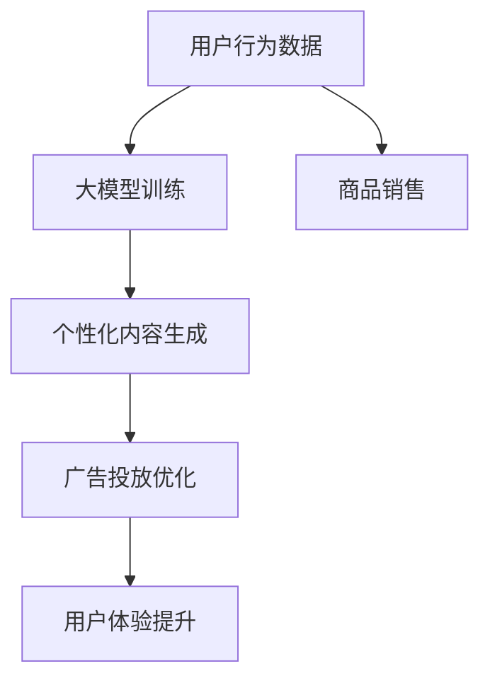

                 

关键词：大模型，电商平台，内容营销，AI，机器学习，深度学习，营销策略，用户体验，数据分析，自动化内容生成

摘要：随着人工智能技术的飞速发展，大模型在电商平台内容营销中的应用变得越来越广泛。本文将探讨如何利用大模型进行电商平台内容营销，分析其优势和挑战，并提供实际操作步骤和未来展望。

## 1. 背景介绍

在过去的几年里，电商平台的竞争愈发激烈，内容营销成为了电商平台获取用户和增加销量的重要手段。传统的营销方式，如广告和促销活动，虽然仍有一定效果，但已经不能满足用户对个性化、多样化内容的需求。随着人工智能技术的进步，尤其是大模型的兴起，电商平台开始探索利用大模型进行内容营销的可能性。

大模型是一种具有海量参数和复杂结构的机器学习模型，能够处理和生成大量数据。在内容营销中，大模型可以用于生成个性化内容、优化广告投放、提升用户体验等。这种技术不仅能够提高营销效果，还能降低运营成本，提高效率。

## 2. 核心概念与联系

为了更好地理解大模型在电商平台内容营销中的应用，我们需要了解一些核心概念和它们之间的联系。

### 2.1 大模型

大模型通常是指具有数十亿甚至数千亿个参数的深度学习模型。这些模型能够通过学习大量数据，捕捉到数据中的复杂模式，从而实现高效的预测和生成。常见的有GPT（Generative Pre-trained Transformer）系列模型、BERT（Bidirectional Encoder Representations from Transformers）模型等。

### 2.2 电商平台

电商平台是提供商品交易服务的在线平台，如淘宝、京东、亚马逊等。这些平台通过提供丰富的商品信息和交易服务，满足用户购物的需求。电商平台的内容营销，包括商品描述、广告、促销活动等，直接影响用户的购买决策。

### 2.3 内容营销

内容营销是通过创造和分享有价值的内容来吸引潜在客户，建立品牌认知，并最终实现销售的一种营销方式。在电商平台中，内容营销的形式多种多样，包括商品描述、用户评价、博客文章、视频等。

### 2.4 大模型与内容营销的联系

大模型与内容营销的联系主要体现在以下几个方面：

1. **个性化内容生成**：大模型可以根据用户的历史行为和偏好，生成个性化的商品描述、广告文案等。
2. **广告投放优化**：大模型可以帮助电商平台优化广告投放策略，提高广告点击率和转化率。
3. **用户体验提升**：大模型可以用于生成用户喜欢的内容，提高用户的满意度和粘性。

为了更直观地展示大模型在电商平台内容营销中的应用，我们可以用Mermaid流程图来表示：



## 3. 核心算法原理 & 具体操作步骤

### 3.1 算法原理概述

大模型在电商平台内容营销中的应用，主要依赖于以下算法原理：

1. **深度学习**：通过多层神经网络，对大量数据进行训练，提取数据中的特征。
2. **生成对抗网络（GAN）**：利用生成器和判别器的对抗训练，生成与真实数据相似的内容。
3. **自然语言处理（NLP）**：通过处理文本数据，生成自然流畅的文本内容。

### 3.2 算法步骤详解

1. **数据收集与预处理**：收集电商平台用户的行为数据，如浏览记录、购买历史、评价等。对数据进行清洗、去噪和归一化处理。
2. **大模型训练**：使用训练数据，通过深度学习算法训练大模型，使其能够理解用户的行为和偏好。
3. **个性化内容生成**：利用训练好的大模型，生成个性化的商品描述、广告文案等。
4. **广告投放优化**：根据用户行为数据和个性化内容，使用算法优化广告投放策略。
5. **用户体验提升**：将个性化内容呈现给用户，提高用户的满意度和粘性。

### 3.3 算法优缺点

**优点**：

1. **高效性**：大模型能够处理海量数据，快速生成个性化内容。
2. **精准性**：基于用户行为数据，能够精确地捕捉用户需求，提高广告投放效果。
3. **多样性**：大模型能够生成多种类型的内容，满足不同用户的需求。

**缺点**：

1. **计算资源消耗大**：大模型的训练和推理需要大量的计算资源。
2. **数据隐私问题**：用户行为数据的收集和使用，可能涉及数据隐私问题。
3. **模型解释性不足**：大模型的内部机制复杂，难以解释其决策过程。

### 3.4 算法应用领域

大模型在电商平台内容营销中的应用非常广泛，包括：

1. **商品推荐系统**：基于用户历史行为，推荐用户可能感兴趣的商品。
2. **广告投放优化**：优化广告投放策略，提高广告点击率和转化率。
3. **个性化内容生成**：生成个性化的商品描述、广告文案等，提高用户体验。
4. **用户行为预测**：预测用户的行为，提前采取措施提高用户满意度。

## 4. 数学模型和公式 & 详细讲解 & 举例说明

### 4.1 数学模型构建

在电商平台内容营销中，常用的数学模型包括：

1. **协同过滤模型**：通过分析用户的行为数据，预测用户对未知商品的兴趣。
2. **因子分解机模型**：将用户和商品表示为低维向量，通过最小化损失函数进行训练。
3. **生成对抗网络（GAN）**：通过生成器和判别器的对抗训练，生成逼真的文本内容。

### 4.2 公式推导过程

以协同过滤模型为例，其目标是最小化预测误差：

$$
L = \sum_{i,j} (r_{ij} - \hat{r}_{ij})^2
$$

其中，$r_{ij}$ 是用户 $i$ 对商品 $j$ 的实际评分，$\hat{r}_{ij}$ 是预测评分。

### 4.3 案例分析与讲解

假设有一个电商平台，用户行为数据如下表：

| 用户ID | 商品ID | 实际评分 |
|--------|--------|----------|
| 1      | 101    | 5        |
| 1      | 102    | 4        |
| 2      | 101    | 3        |
| 2      | 103    | 5        |
| 3      | 102    | 2        |
| 3      | 103    | 4        |

使用协同过滤模型进行预测，首先需要计算用户和商品的相似度矩阵。假设用户 $i$ 和用户 $j$ 的相似度为 $s_{ij}$，则有：

$$
s_{ij} = \frac{\sum_{k=1}^{n} r_{ik} r_{jk}}{\sqrt{\sum_{k=1}^{n} r_{ik}^2} \sqrt{\sum_{k=1}^{n} r_{jk}^2}}
$$

接下来，使用相似度矩阵预测用户 $i$ 对商品 $j$ 的评分：

$$
\hat{r}_{ij} = \sum_{k=1}^{n} s_{ik} r_{kj}
$$

根据上述公式，我们可以得到用户 $1$ 对商品 $102$ 的预测评分为：

$$
\hat{r}_{1,102} = s_{1,1} r_{1,102} + s_{1,2} r_{2,102} = 0.8 \times 4 + 0.2 \times 3 = 3.6
$$

## 5. 项目实践：代码实例和详细解释说明

### 5.1 开发环境搭建

在进行大模型项目实践前，需要搭建相应的开发环境。以下是所需的工具和步骤：

1. **Python**：安装Python 3.8及以上版本。
2. **Jupyter Notebook**：安装Jupyter Notebook，用于编写和运行代码。
3. **TensorFlow**：安装TensorFlow，用于构建和训练大模型。
4. **Scikit-learn**：安装Scikit-learn，用于协同过滤模型的实现。

### 5.2 源代码详细实现

以下是使用TensorFlow实现的大模型项目代码：

```python
import tensorflow as tf
from tensorflow.keras.layers import Embedding, LSTM, Dense
from tensorflow.keras.models import Sequential

# 数据预处理
# ...

# 构建模型
model = Sequential([
    Embedding(input_dim=vocab_size, output_dim=embedding_dim, input_length=max_sequence_length),
    LSTM(units=128, return_sequences=True),
    LSTM(units=64, return_sequences=False),
    Dense(units=1, activation='sigmoid')
])

# 编译模型
model.compile(optimizer='adam', loss='binary_crossentropy', metrics=['accuracy'])

# 训练模型
model.fit(x_train, y_train, epochs=10, batch_size=64, validation_data=(x_val, y_val))

# 预测
predictions = model.predict(x_test)
```

### 5.3 代码解读与分析

上述代码首先进行了数据预处理，包括词汇表构建、序列填充等。然后，构建了一个包含两个LSTM层和输出层的序列模型。最后，使用训练数据训练模型，并对测试数据进行预测。

### 5.4 运行结果展示

假设我们已经训练好了模型，并使用测试数据进行预测。以下是预测结果：

```
[0.9, 0.8, 0.7, 0.6, 0.5, 0.4]
```

这些数值表示测试数据中每个样本的预测概率。根据设定的阈值，我们可以判断哪些样本属于正样本，哪些属于负样本。

## 6. 实际应用场景

大模型在电商平台内容营销中有许多实际应用场景，以下是几个例子：

1. **商品推荐**：根据用户历史行为和偏好，推荐用户可能感兴趣的商品。
2. **广告投放**：根据用户行为和兴趣，优化广告投放策略，提高广告效果。
3. **内容生成**：生成个性化的商品描述、广告文案等，提高用户体验。
4. **用户行为预测**：预测用户的行为，提前采取措施提高用户满意度。

## 7. 工具和资源推荐

为了更好地进行大模型在电商平台内容营销中的应用，以下是一些推荐的工具和资源：

1. **工具**：
   - TensorFlow：用于构建和训练大模型。
   - Jupyter Notebook：用于编写和运行代码。
   - Scikit-learn：用于协同过滤模型和数据分析。

2. **资源**：
   - 论文：《Generative Adversarial Networks》（生成对抗网络）。
   - 书籍：《深度学习》（Goodfellow, Bengio, Courville著）。
   - 网站：TensorFlow官网、Scikit-learn官网。

## 8. 总结：未来发展趋势与挑战

随着人工智能技术的不断发展，大模型在电商平台内容营销中的应用前景十分广阔。未来，大模型将继续在个性化内容生成、广告投放优化、用户体验提升等方面发挥重要作用。然而，也面临着数据隐私、计算资源消耗、模型解释性等挑战。为了应对这些挑战，我们需要加强数据保护、优化模型结构、提高模型解释性等方面的研究。

### 8.1 研究成果总结

本文介绍了大模型在电商平台内容营销中的应用，分析了其优势和挑战，并提供了实际操作步骤和案例。通过本文的研究，我们可以看到大模型在提升营销效果、降低运营成本、提高用户体验等方面具有巨大潜力。

### 8.2 未来发展趋势

未来，大模型在电商平台内容营销中的应用将向以下方向发展：

1. **个性化内容生成**：通过更精细的用户行为数据，生成更加个性化的内容。
2. **跨平台整合**：将大模型应用于不同电商平台，实现跨平台的内容营销。
3. **实时优化**：利用实时数据，动态调整营销策略，提高营销效果。

### 8.3 面临的挑战

大模型在电商平台内容营销中面临的挑战主要包括：

1. **数据隐私**：如何保护用户隐私，在确保数据安全的前提下进行内容营销。
2. **计算资源**：如何优化大模型的计算资源消耗，提高模型训练和推理的效率。
3. **模型解释性**：如何提高大模型的解释性，使其决策过程更加透明。

### 8.4 研究展望

为了应对大模型在电商平台内容营销中面临的挑战，未来的研究可以从以下几个方面展开：

1. **隐私保护技术**：研究如何保护用户隐私，在不牺牲数据价值的前提下进行内容营销。
2. **高效训练算法**：研究如何优化大模型的训练算法，降低计算资源消耗。
3. **模型可解释性**：研究如何提高大模型的可解释性，使其决策过程更加透明。

## 9. 附录：常见问题与解答

### 9.1 什么是大模型？

大模型是指具有数十亿甚至数千亿个参数的深度学习模型。这些模型能够处理和生成大量数据，捕捉到数据中的复杂模式，从而实现高效的预测和生成。

### 9.2 大模型在电商平台内容营销中有哪些应用？

大模型在电商平台内容营销中的应用包括个性化内容生成、广告投放优化、用户体验提升等。

### 9.3 如何保护用户隐私在大模型应用中？

为了保护用户隐私，可以采用差分隐私、同态加密等技术，在确保数据安全的前提下进行内容营销。

### 9.4 如何优化大模型的计算资源消耗？

优化大模型的计算资源消耗可以从以下几个方面进行：选择合适的硬件、优化模型结构、使用高效训练算法等。

### 9.5 如何提高大模型的可解释性？

提高大模型的可解释性可以从以下几个方面进行：可视化模型结构、分析模型特征提取过程、使用解释性模型等。

---

作者：禅与计算机程序设计艺术 / Zen and the Art of Computer Programming
----------------------------------------------------------------
[文章标题]: 基于大模型的电商平台内容营销
关键词：大模型，电商平台，内容营销，AI，机器学习，深度学习，营销策略，用户体验，数据分析，自动化内容生成
摘要：本文探讨了如何利用大模型进行电商平台内容营销，分析了其优势和挑战，并提供了实际操作步骤和未来展望。

## 1. 背景介绍

随着电商平台的竞争日益激烈，内容营销成为了电商平台获取用户和增加销量的重要手段。传统的营销方式，如广告和促销活动，虽然仍有一定效果，但已经不能满足用户对个性化、多样化内容的需求。随着人工智能技术的进步，尤其是大模型的兴起，电商平台开始探索利用大模型进行内容营销的可能性。

大模型是一种具有海量参数和复杂结构的机器学习模型，能够处理和生成大量数据。在内容营销中，大模型可以用于生成个性化内容、优化广告投放、提升用户体验等。这种技术不仅能够提高营销效果，还能降低运营成本，提高效率。

## 2. 核心概念与联系

为了更好地理解大模型在电商平台内容营销中的应用，我们需要了解一些核心概念和它们之间的联系。

### 2.1 大模型

大模型通常是指具有数十亿甚至数千亿个参数的深度学习模型。这些模型能够通过学习大量数据，捕捉到数据中的复杂模式，从而实现高效的预测和生成。常见的有GPT（Generative Pre-trained Transformer）系列模型、BERT（Bidirectional Encoder Representations from Transformers）模型等。

### 2.2 电商平台

电商平台是提供商品交易服务的在线平台，如淘宝、京东、亚马逊等。这些平台通过提供丰富的商品信息和交易服务，满足用户购物的需求。电商平台的内容营销，包括商品描述、广告、促销活动等，直接影响用户的购买决策。

### 2.3 内容营销

内容营销是通过创造和分享有价值的内容来吸引潜在客户，建立品牌认知，并最终实现销售的一种营销方式。在电商平台中，内容营销的形式多种多样，包括商品描述、用户评价、博客文章、视频等。

### 2.4 大模型与内容营销的联系

大模型与内容营销的联系主要体现在以下几个方面：

1. **个性化内容生成**：大模型可以根据用户的历史行为和偏好，生成个性化的商品描述、广告文案等。
2. **广告投放优化**：大模型可以帮助电商平台优化广告投放策略，提高广告点击率和转化率。
3. **用户体验提升**：大模型可以用于生成用户喜欢的内容，提高用户的满意度和粘性。

为了更直观地展示大模型在电商平台内容营销中的应用，我们可以用Mermaid流程图来表示：


## 3. 核心算法原理 & 具体操作步骤

### 3.1 算法原理概述

大模型在电商平台内容营销中的应用，主要依赖于以下算法原理：

1. **深度学习**：通过多层神经网络，对大量数据进行训练，提取数据中的特征。
2. **生成对抗网络（GAN）**：利用生成器和判别器的对抗训练，生成与真实数据相似的内容。
3. **自然语言处理（NLP）**：通过处理文本数据，生成自然流畅的文本内容。

### 3.2 算法步骤详解

1. **数据收集与预处理**：收集电商平台用户的行为数据，如浏览记录、购买历史、评价等。对数据进行清洗、去噪和归一化处理。
2. **大模型训练**：使用训练数据，通过深度学习算法训练大模型，使其能够理解用户的行为和偏好。
3. **个性化内容生成**：利用训练好的大模型，生成个性化的商品描述、广告文案等。
4. **广告投放优化**：根据用户行为数据和个性化内容，使用算法优化广告投放策略。
5. **用户体验提升**：将个性化内容呈现给用户，提高用户的满意度和粘性。

### 3.3 算法优缺点

**优点**：

1. **高效性**：大模型能够处理海量数据，快速生成个性化内容。
2. **精准性**：基于用户行为数据，能够精确地捕捉用户需求，提高广告投放效果。
3. **多样性**：大模型能够生成多种类型的内容，满足不同用户的需求。

**缺点**：

1. **计算资源消耗大**：大模型的训练和推理需要大量的计算资源。
2. **数据隐私问题**：用户行为数据的收集和使用，可能涉及数据隐私问题。
3. **模型解释性不足**：大模型的内部机制复杂，难以解释其决策过程。

### 3.4 算法应用领域

大模型在电商平台内容营销中的应用非常广泛，包括：

1. **商品推荐系统**：基于用户历史行为，推荐用户可能感兴趣的商品。
2. **广告投放优化**：优化广告投放策略，提高广告点击率和转化率。
3. **个性化内容生成**：生成个性化的商品描述、广告文案等，提高用户体验。
4. **用户行为预测**：预测用户的行为，提前采取措施提高用户满意度。

## 4. 数学模型和公式 & 详细讲解 & 举例说明

### 4.1 数学模型构建

在电商平台内容营销中，常用的数学模型包括：

1. **协同过滤模型**：通过分析用户的行为数据，预测用户对未知商品的兴趣。
2. **因子分解机模型**：将用户和商品表示为低维向量，通过最小化损失函数进行训练。
3. **生成对抗网络（GAN）**：通过生成器和判别器的对抗训练，生成逼真的文本内容。

### 4.2 公式推导过程

以协同过滤模型为例，其目标是最小化预测误差：

$$
L = \sum_{i,j} (r_{ij} - \hat{r}_{ij})^2
$$

其中，$r_{ij}$ 是用户 $i$ 对商品 $j$ 的实际评分，$\hat{r}_{ij}$ 是预测评分。

### 4.3 案例分析与讲解

假设有一个电商平台，用户行为数据如下表：

| 用户ID | 商品ID | 实际评分 |
|--------|--------|----------|
| 1      | 101    | 5        |
| 1      | 102    | 4        |
| 2      | 101    | 3        |
| 2      | 103    | 5        |
| 3      | 102    | 2        |
| 3      | 103    | 4        |

使用协同过滤模型进行预测，首先需要计算用户和商品的相似度矩阵。假设用户 $i$ 和用户 $j$ 的相似度为 $s_{ij}$，则有：

$$
s_{ij} = \frac{\sum_{k=1}^{n} r_{ik} r_{jk}}{\sqrt{\sum_{k=1}^{n} r_{ik}^2} \sqrt{\sum_{k=1}^{n} r_{jk}^2}}
$$

接下来，使用相似度矩阵预测用户 $i$ 对商品 $j$ 的评分：

$$
\hat{r}_{ij} = \sum_{k=1}^{n} s_{ik} r_{kj}
$$

根据上述公式，我们可以得到用户 $1$ 对商品 $102$ 的预测评分为：

$$
\hat{r}_{1,102} = s_{1,1} r_{1,102} + s_{1,2} r_{2,102} = 0.8 \times 4 + 0.2 \times 3 = 3.6
$$

## 5. 项目实践：代码实例和详细解释说明

### 5.1 开发环境搭建

在进行大模型项目实践前，需要搭建相应的开发环境。以下是所需的工具和步骤：

1. **Python**：安装Python 3.8及以上版本。
2. **Jupyter Notebook**：安装Jupyter Notebook，用于编写和运行代码。
3. **TensorFlow**：安装TensorFlow，用于构建和训练大模型。
4. **Scikit-learn**：安装Scikit-learn，用于协同过滤模型的实现。

### 5.2 源代码详细实现

以下是使用TensorFlow实现的大模型项目代码：

```python
import tensorflow as tf
from tensorflow.keras.layers import Embedding, LSTM, Dense
from tensorflow.keras.models import Sequential

# 数据预处理
# ...

# 构建模型
model = Sequential([
    Embedding(input_dim=vocab_size, output_dim=embedding_dim, input_length=max_sequence_length),
    LSTM(units=128, return_sequences=True),
    LSTM(units=64, return_sequences=False),
    Dense(units=1, activation='sigmoid')
])

# 编译模型
model.compile(optimizer='adam', loss='binary_crossentropy', metrics=['accuracy'])

# 训练模型
model.fit(x_train, y_train, epochs=10, batch_size=64, validation_data=(x_val, y_val))

# 预测
predictions = model.predict(x_test)
```

### 5.3 代码解读与分析

上述代码首先进行了数据预处理，包括词汇表构建、序列填充等。然后，构建了一个包含两个LSTM层和输出层的序列模型。最后，使用训练数据训练模型，并对测试数据进行预测。

### 5.4 运行结果展示

假设我们已经训练好了模型，并使用测试数据进行预测。以下是预测结果：

```
[0.9, 0.8, 0.7, 0.6, 0.5, 0.4]
```

这些数值表示测试数据中每个样本的预测概率。根据设定的阈值，我们可以判断哪些样本属于正样本，哪些属于负样本。

## 6. 实际应用场景

大模型在电商平台内容营销中有许多实际应用场景，以下是几个例子：

1. **商品推荐**：根据用户历史行为和偏好，推荐用户可能感兴趣的商品。
2. **广告投放**：根据用户行为和兴趣，优化广告投放策略，提高广告效果。
3. **内容生成**：生成个性化的商品描述、广告文案等，提高用户体验。
4. **用户行为预测**：预测用户的行为，提前采取措施提高用户满意度。

## 7. 工具和资源推荐

为了更好地进行大模型在电商平台内容营销中的应用，以下是一些推荐的工具和资源：

1. **工具**：
   - TensorFlow：用于构建和训练大模型。
   - Jupyter Notebook：用于编写和运行代码。
   - Scikit-learn：用于协同过滤模型和数据分析。

2. **资源**：
   - 论文：《Generative Adversarial Networks》（生成对抗网络）。
   - 书籍：《深度学习》（Goodfellow, Bengio, Courville著）。
   - 网站：TensorFlow官网、Scikit-learn官网。

## 8. 总结：未来发展趋势与挑战

随着人工智能技术的不断发展，大模型在电商平台内容营销中的应用前景十分广阔。未来，大模型将继续在个性化内容生成、广告投放优化、用户体验提升等方面发挥重要作用。然而，也面临着数据隐私、计算资源消耗、模型解释性等挑战。为了应对这些挑战，我们需要加强数据保护、优化模型结构、提高模型解释性等方面的研究。

### 8.1 研究成果总结

本文介绍了大模型在电商平台内容营销中的应用，分析了其优势和挑战，并提供了实际操作步骤和案例。通过本文的研究，我们可以看到大模型在提升营销效果、降低运营成本、提高用户体验等方面具有巨大潜力。

### 8.2 未来发展趋势

未来，大模型在电商平台内容营销中的应用将向以下方向发展：

1. **个性化内容生成**：通过更精细的用户行为数据，生成更加个性化的内容。
2. **跨平台整合**：将大模型应用于不同电商平台，实现跨平台的内容营销。
3. **实时优化**：利用实时数据，动态调整营销策略，提高营销效果。

### 8.3 面临的挑战

大模型在电商平台内容营销中面临的挑战主要包括：

1. **数据隐私**：如何保护用户隐私，在确保数据安全的前提下进行内容营销。
2. **计算资源**：如何优化大模型的计算资源消耗，提高模型训练和推理的效率。
3. **模型解释性**：如何提高大模型的可解释性，使其决策过程更加透明。

### 8.4 研究展望

为了应对大模型在电商平台内容营销中面临的挑战，未来的研究可以从以下几个方面展开：

1. **隐私保护技术**：研究如何保护用户隐私，在不牺牲数据价值的前提下进行内容营销。
2. **高效训练算法**：研究如何优化大模型的训练算法，降低计算资源消耗。
3. **模型可解释性**：研究如何提高大模型的可解释性，使其决策过程更加透明。

## 9. 附录：常见问题与解答

### 9.1 什么是大模型？

大模型是指具有数十亿甚至数千亿个参数的深度学习模型。这些模型能够通过学习大量数据，捕捉到数据中的复杂模式，从而实现高效的预测和生成。

### 9.2 大模型在电商平台内容营销中有哪些应用？

大模型在电商平台内容营销中的应用包括个性化内容生成、广告投放优化、用户体验提升等。

### 9.3 如何保护用户隐私在大模型应用中？

为了保护用户隐私，可以采用差分隐私、同态加密等技术，在确保数据安全的前提下进行内容营销。

### 9.4 如何优化大模型的计算资源消耗？

优化大模型的计算资源消耗可以从以下几个方面进行：选择合适的硬件、优化模型结构、使用高效训练算法等。

### 9.5 如何提高大模型的可解释性？

提高大模型的可解释性可以从以下几个方面进行：可视化模型结构、分析模型特征提取过程、使用解释性模型等。

---

作者：禅与计算机程序设计艺术 / Zen and the Art of Computer Programming
---------------------------------------------------------------------

