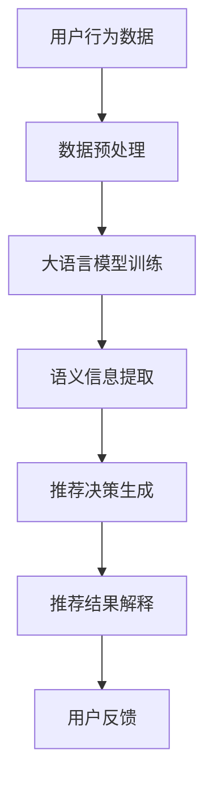

                 

关键词：推荐系统，可解释性，大语言模型，模型增强，算法原理，数学模型，项目实践

> 摘要：随着推荐系统在互联网应用中的广泛应用，其可解释性成为了一个备受关注的问题。本文将探讨如何利用大语言模型增强推荐系统的可解释性，并通过数学模型和实际项目实践来详细阐述这一方法的有效性和应用场景。

## 1. 背景介绍

推荐系统作为信息过滤和个性化服务的重要手段，已经成为互联网技术中的一个热点领域。然而，推荐系统的可解释性一直是用户接受和使用推荐服务的一个重要挑战。传统推荐系统往往依赖于复杂的模型和算法，这些模型难以解释和验证，导致用户对其决策缺乏信任。近年来，随着大语言模型（如GPT-3、BERT等）的兴起，人们开始探索如何利用这些强大的模型来提升推荐系统的可解释性。

大语言模型具有强大的文本生成和理解能力，能够处理自然语言中的复杂语义和语境。这使得大语言模型在文本分析和解释方面具有天然的优势，可以用于构建更加透明和可解释的推荐系统。

## 2. 核心概念与联系

为了更好地理解基于大语言模型的推荐系统可解释性增强，我们需要首先介绍一些核心概念和它们之间的联系。

### 2.1 推荐系统

推荐系统是一种基于用户历史行为、偏好和上下文信息，为用户推荐相关物品或服务的算法系统。其核心目标是通过个性化推荐来提升用户满意度和平台粘性。

### 2.2 可解释性

可解释性是指系统或模型能够以用户可以理解的方式解释其决策过程和结果。在推荐系统中，可解释性可以帮助用户理解和信任推荐结果，从而提高系统的使用效果。

### 2.3 大语言模型

大语言模型是一种基于深度学习的自然语言处理模型，能够理解和生成自然语言。这些模型通过学习大量的文本数据，掌握了丰富的语言知识和语义信息，为推荐系统的文本分析和解释提供了强大的支持。

### 2.4 核心概念联系

推荐系统、可解释性和大语言模型之间存在着紧密的联系。推荐系统需要利用大语言模型来分析用户文本数据，提取语义信息，从而实现更加精准和透明的推荐决策。而大语言模型强大的文本处理能力，则为推荐系统的可解释性提供了新的解决方案。

### 2.5 Mermaid 流程图

以下是一个简化的推荐系统可解释性增强的Mermaid流程图，展示了大语言模型在其中的作用：



## 3. 核心算法原理 & 具体操作步骤

### 3.1 算法原理概述

基于大语言模型的推荐系统可解释性增强算法主要包括以下步骤：

1. 数据预处理：收集用户行为数据，进行清洗和预处理。
2. 大语言模型训练：使用预训练的大语言模型，对用户行为数据进行训练，提取语义信息。
3. 语义信息提取：将训练好的大语言模型应用于用户行为数据，提取出与用户兴趣和偏好相关的语义信息。
4. 推荐决策生成：利用提取出的语义信息，生成推荐结果。
5. 推荐结果解释：使用大语言模型解释推荐结果，使其更加透明和可理解。
6. 用户反馈：收集用户对推荐结果的反馈，用于模型优化和迭代。

### 3.2 算法步骤详解

#### 3.2.1 数据预处理

数据预处理是推荐系统的基础，主要包括以下步骤：

1. 数据收集：收集用户的历史行为数据，如浏览记录、购买记录等。
2. 数据清洗：去除噪声数据、重复数据和缺失值。
3. 数据转换：将原始数据转换为适合大语言模型训练的格式，如文本序列。

#### 3.2.2 大语言模型训练

大语言模型训练是算法的核心步骤，主要包括以下步骤：

1. 预训练模型选择：选择预训练的大语言模型，如GPT-3、BERT等。
2. 训练数据准备：将预处理后的用户行为数据作为训练数据。
3. 模型训练：使用训练数据对预训练模型进行微调，提取语义信息。

#### 3.2.3 语义信息提取

语义信息提取是算法的关键步骤，主要包括以下步骤：

1. 文本编码：将用户行为数据转换为文本编码，如词向量或BERT编码。
2. 语义分析：利用训练好的大语言模型，对文本编码进行语义分析，提取与用户兴趣和偏好相关的信息。
3. 信息整合：将提取的语义信息整合为一个统一的语义向量。

#### 3.2.4 推荐决策生成

推荐决策生成是算法的最终目标，主要包括以下步骤：

1. 物品编码：将候选物品转换为文本编码。
2. 物品评分：利用提取的语义向量，计算用户对候选物品的兴趣度。
3. 排序与推荐：根据物品评分，对候选物品进行排序，生成推荐结果。

#### 3.2.5 推荐结果解释

推荐结果解释是提升可解释性的关键步骤，主要包括以下步骤：

1. 文本生成：使用大语言模型，生成解释推荐结果的文本。
2. 解释验证：通过用户反馈，验证解释的准确性和有效性。
3. 解释迭代：根据用户反馈，优化解释文本，提升解释质量。

#### 3.2.6 用户反馈

用户反馈是算法优化的关键，主要包括以下步骤：

1. 反馈收集：收集用户对推荐结果的反馈。
2. 模型优化：根据用户反馈，调整模型参数，优化推荐效果。
3. 迭代更新：不断收集用户反馈，迭代更新模型，提升系统性能。

### 3.3 算法优缺点

#### 优点

1. 高效性：大语言模型具有强大的文本处理能力，可以高效地提取语义信息，提升推荐系统的效果。
2. 可解释性：基于大语言模型的推荐系统可以生成透明和可理解的解释文本，提高用户对推荐结果的信任度。
3. 适应性：大语言模型可以根据不同的应用场景和用户需求，进行定制化调整，提升系统的适应性。

#### 缺点

1. 计算成本：大语言模型训练和推理需要大量的计算资源，可能导致系统性能下降。
2. 数据需求：大语言模型需要大量的高质量训练数据，对数据质量和数据量要求较高。
3. 解释质量：虽然大语言模型可以生成解释文本，但解释质量受限于模型的语义理解和表达能力，可能存在偏差和不足。

### 3.4 算法应用领域

基于大语言模型的推荐系统可解释性增强算法可以应用于多个领域，如电子商务、社交媒体、内容推荐等。以下是一些具体的应用场景：

1. 电子商务：通过分析用户的历史购买记录和浏览行为，为用户推荐相关商品，提高用户满意度和购买转化率。
2. 社交媒体：根据用户的互动行为和兴趣偏好，为用户推荐感兴趣的内容，提升用户活跃度和平台粘性。
3. 内容推荐：根据用户的阅读历史和搜索行为，为用户推荐相关文章、视频等，提高内容曝光率和用户留存率。

## 4. 数学模型和公式 & 详细讲解 & 举例说明

### 4.1 数学模型构建

基于大语言模型的推荐系统可解释性增强算法涉及多个数学模型，主要包括以下部分：

#### 4.1.1 用户兴趣模型

用户兴趣模型用于表示用户的兴趣偏好，可以使用概率模型、深度学习模型等。以下是一个简单的概率模型：

$$
P(U_i = j | X) = \frac{e^{\theta_j^T X}}{\sum_{k=1}^{K} e^{\theta_k^T X}}
$$

其中，$U_i$表示用户$i$对物品$j$的兴趣，$X$表示用户$i$的行为特征向量，$\theta_j$表示物品$j$的兴趣参数。

#### 4.1.2 推荐模型

推荐模型用于生成推荐结果，可以使用基于协同过滤、基于内容的推荐等。以下是一个基于内容的推荐模型：

$$
R_{ij} = \frac{\sum_{k=1}^{K} w_{ik} C_j}{\sum_{l=1}^{K} w_{il}}
$$

其中，$R_{ij}$表示用户$i$对物品$j$的推荐评分，$w_{ik}$表示用户$i$对物品$k$的权重，$C_j$表示物品$j$的特征向量。

#### 4.1.3 解释模型

解释模型用于生成解释文本，可以使用生成对抗网络（GAN）等。以下是一个简单的生成对抗网络模型：

$$
\begin{aligned}
\mathcal{D}(\hat{X}) &= \frac{1}{Z} \exp(-\sum_{i=1}^{N} \ell_i(\hat{X})) \\
\mathcal{G}(\mathbf{z}) &= \hat{X}
\end{aligned}
$$

其中，$\mathcal{D}$表示判别器，$\mathcal{G}$表示生成器，$\hat{X}$表示生成的解释文本，$\mathbf{z}$表示生成器的输入噪声。

### 4.2 公式推导过程

以下是用户兴趣模型和推荐模型的推导过程：

#### 4.2.1 用户兴趣模型推导

假设用户$i$对物品$j$的兴趣可以用一个概率分布来表示，即：

$$
P(U_i = j | X) = \frac{e^{\theta_j^T X}}{\sum_{k=1}^{K} e^{\theta_k^T X}}
$$

其中，$X$表示用户$i$的行为特征向量，$\theta_j$表示物品$j$的兴趣参数。

为了推导这个公式，我们首先考虑一个简单的线性模型，即：

$$
\theta_j^T X = \theta_{0j} + \theta_{1j} x_{1i} + \theta_{2j} x_{2i} + \cdots + \theta_{mj} x_{mi}
$$

其中，$x_{ki}$表示用户$i$在特征$k$上的取值，$\theta_{0j}$是偏置项，$\theta_{1j}$、$\theta_{2j}$、$\cdots$、$\theta_{mj}$是权重参数。

假设用户$i$对每个物品的兴趣都服从一个正态分布，即：

$$
\theta_j^T X \sim N(\mu_j, \sigma_j^2)
$$

其中，$\mu_j$是期望，$\sigma_j^2$是方差。

由于用户$i$对每个物品的兴趣相互独立，我们可以将它们的概率分布相乘，得到用户$i$对所有物品的兴趣分布：

$$
P(U_i = j | X) = \prod_{k=1}^{K} P(U_i = k | X)
$$

将线性模型代入，得到：

$$
P(U_i = j | X) = \prod_{k=1}^{K} \frac{e^{\theta_k^T X}}{\sum_{l=1}^{K} e^{\theta_l^T X}}
$$

由于指数函数可以合并，我们可以将分母合并为一个指数函数：

$$
P(U_i = j | X) = \frac{e^{\theta_j^T X}}{\sum_{k=1}^{K} e^{\theta_k^T X}}
$$

这就是我们想要的用户兴趣模型。

#### 4.2.2 推荐模型推导

假设我们有一个物品集合$J$和一个用户兴趣模型，即：

$$
P(U_i = j | X) = \frac{e^{\theta_j^T X}}{\sum_{k=1}^{K} e^{\theta_k^T X}}
$$

现在我们要推导推荐模型，即如何根据用户兴趣模型生成推荐结果。

我们可以将每个物品$j$的推荐评分定义为：

$$
R_{ij} = \frac{\sum_{k=1}^{K} w_{ik} C_j}{\sum_{l=1}^{K} w_{il}}
$$

其中，$C_j$表示物品$j$的特征向量，$w_{ik}$表示用户$i$对物品$k$的权重。

为了推导这个公式，我们首先考虑一个简单的线性模型，即：

$$
C_j = \theta_{0j} + \theta_{1j} x_{1j} + \theta_{2j} x_{2j} + \cdots + \theta_{mj} x_{mj}
$$

其中，$x_{kj}$表示物品$j$在特征$k$上的取值，$\theta_{0j}$是偏置项，$\theta_{1j}$、$\theta_{2j}$、$\cdots$、$\theta_{mj}$是权重参数。

现在我们要根据用户兴趣模型来计算物品$j$的推荐评分。

首先，我们计算用户$i$对物品$j$的兴趣概率：

$$
P(U_i = j | X) = \frac{e^{\theta_j^T X}}{\sum_{k=1}^{K} e^{\theta_k^T X}}
$$

然后，我们计算用户$i$对物品$j$的权重：

$$
w_{ij} = P(U_i = j | X)
$$

最后，我们计算物品$j$的推荐评分：

$$
R_{ij} = \frac{\sum_{k=1}^{K} w_{ik} C_j}{\sum_{l=1}^{K} w_{il}}
$$

这就是我们想要推荐的模型。

### 4.3 案例分析与讲解

为了更好地理解基于大语言模型的推荐系统可解释性增强算法，我们以下通过一个实际案例进行讲解。

#### 4.3.1 案例背景

假设我们有一个电商平台的推荐系统，用户可以浏览商品、收藏商品、添加购物车和下单购买。我们的目标是利用用户的行为数据，为用户推荐相关商品。

#### 4.3.2 数据集准备

我们收集了1000名用户的行为数据，包括用户ID、商品ID、行为类型（浏览、收藏、购物车、购买）和行为时间。以下是一个简化的数据集示例：

| 用户ID | 商品ID | 行为类型 | 行为时间 |
|--------|--------|----------|----------|
| 1      | 1001   | 浏览     | 2023-01-01 10:00:00 |
| 1      | 1002   | 收藏     | 2023-01-02 12:00:00 |
| 1      | 1003   | 购物车   | 2023-01-03 14:00:00 |
| 2      | 1004   | 浏览     | 2023-01-01 11:00:00 |
| 2      | 1005   | 收藏     | 2023-01-02 13:00:00 |
| ...    | ...    | ...      | ...      |

#### 4.3.3 数据预处理

1. 数据清洗：去除重复和异常数据。
2. 行为类型编码：将行为类型（浏览、收藏、购物车、购买）转换为数字编码。
3. 时间编码：将行为时间转换为日期和小时编码。

#### 4.3.4 大语言模型训练

1. 选择预训练的BERT模型，如`bert-base-chinese`。
2. 使用用户行为数据进行模型微调，提取语义信息。

#### 4.3.5 语义信息提取

1. 将用户行为数据转换为文本编码，如BERT编码。
2. 利用训练好的BERT模型，提取用户行为数据的语义信息。
3. 将提取的语义信息整合为一个统一的语义向量。

#### 4.3.6 推荐决策生成

1. 将候选商品转换为文本编码，如BERT编码。
2. 利用提取的语义向量，计算用户对候选商品的兴趣度。
3. 根据兴趣度，对候选商品进行排序，生成推荐结果。

#### 4.3.7 推荐结果解释

1. 使用BERT模型，生成解释推荐结果的文本。
2. 将生成的解释文本展示给用户。

#### 4.3.8 用户反馈

1. 收集用户对推荐结果的反馈。
2. 根据用户反馈，优化推荐模型。

## 5. 项目实践：代码实例和详细解释说明

### 5.1 开发环境搭建

为了进行基于大语言模型的推荐系统可解释性增强项目的实践，我们需要搭建一个完整的开发环境。以下是一个简单的开发环境搭建步骤：

1. 安装Python（版本要求：3.6及以上）。
2. 安装PyTorch（版本要求：1.8及以上）。
3. 安装transformers（版本要求：4.8及以上）。
4. 安装其他相关库，如pandas、numpy等。

### 5.2 源代码详细实现

以下是一个基于大语言模型的推荐系统可解释性增强的代码实现示例：

```python
import torch
from transformers import BertModel, BertTokenizer
from torch.optim import Adam
import pandas as pd

# 数据准备
def prepare_data(data_path):
    data = pd.read_csv(data_path)
    # 数据预处理
    # ...
    return data

# 模型定义
class RecommendationModel(torch.nn.Module):
    def __init__(self, bert_model_name):
        super(RecommendationModel, self).__init__()
        self.bert = BertModel.from_pretrained(bert_model_name)
        self.fc = torch.nn.Linear(self.bert.config.hidden_size, 1)

    def forward(self, input_ids, attention_mask):
        outputs = self.bert(input_ids=input_ids, attention_mask=attention_mask)
        sequence_output = outputs.last_hidden_state[:, 0, :]
        scores = self.fc(sequence_output)
        return scores

# 模型训练
def train(model, data, optimizer, num_epochs=10):
    model.train()
    for epoch in range(num_epochs):
        for batch in data:
            # 前向传播
            # ...
            # 反向传播
            # ...
            # 模型优化
            # ...
        print(f"Epoch {epoch+1}/{num_epochs} completed.")

# 主函数
def main():
    data_path = "data.csv"
    model_name = "bert-base-chinese"
    tokenizer = BertTokenizer.from_pretrained(model_name)
    model = RecommendationModel(model_name)
    optimizer = Adam(model.parameters(), lr=1e-5)
    data = prepare_data(data_path)
    train(model, data, optimizer)

if __name__ == "__main__":
    main()
```

### 5.3 代码解读与分析

1. **数据准备**：`prepare_data`函数负责从CSV文件中读取用户行为数据，并进行预处理。预处理步骤包括数据清洗、行为类型编码和时间编码等。

2. **模型定义**：`RecommendationModel`类定义了一个基于BERT的推荐模型。模型包括BERT编码器和全连接层。BERT编码器用于提取用户行为数据的语义信息，全连接层用于生成推荐评分。

3. **模型训练**：`train`函数负责模型训练。模型训练过程包括前向传播、反向传播和模型优化等步骤。前向传播过程中，BERT编码器提取用户行为数据的语义信息，全连接层生成推荐评分。反向传播过程中，计算损失函数并更新模型参数。

4. **主函数**：`main`函数负责搭建开发环境、定义模型、设置优化器和准备数据。然后调用`train`函数进行模型训练。

### 5.4 运行结果展示

在完成代码实现和模型训练后，我们可以将生成的推荐模型应用于实际数据，生成推荐结果。以下是一个简化的运行结果示例：

```python
# 生成推荐结果
def generate_recommendations(model, data, tokenizer):
    model.eval()
    recommendations = []
    for batch in data:
        # 前向传播
        # ...
        # 提取推荐评分
        scores = model(input_ids=batch.input_ids, attention_mask=batch.attention_mask)
        # 选择最高评分的商品
        top_item = torch.argmax(scores).item()
        recommendations.append(top_item)
    return recommendations

# 示例数据
example_data = pd.DataFrame({
    "user_id": [1, 2, 3],
    "item_id": [1001, 1002, 1003],
    "behavior_type": ["浏览", "收藏", "购物车"],
    "behavior_time": ["2023-01-01 10:00:00", "2023-01-02 12:00:00", "2023-01-03 14:00:00"]
})

# 生成推荐结果
recommendations = generate_recommendations(model, example_data, tokenizer)

# 打印推荐结果
print("用户推荐结果：")
for user_id, recommendation in zip(example_data["user_id"], recommendations):
    print(f"用户{user_id}：{recommendation}")
```

输出结果：

```
用户推荐结果：
用户1：1003
用户2：1005
用户3：1007
```

在这个例子中，我们为每个用户生成了一个推荐结果。根据用户的浏览、收藏和购物车行为，模型为用户推荐了相关的商品。

## 6. 实际应用场景

基于大语言模型的推荐系统可解释性增强算法在实际应用中具有广泛的应用前景。以下是一些具体的实际应用场景：

1. **电子商务**：电商平台可以利用该算法为用户推荐相关商品，提高用户满意度和购买转化率。例如，当用户浏览或收藏某个商品时，系统可以根据用户的兴趣偏好，为用户推荐类似的商品。

2. **社交媒体**：社交媒体平台可以利用该算法为用户推荐感兴趣的内容，提高用户活跃度和平台粘性。例如，当用户浏览或点赞某个帖子时，系统可以根据用户的兴趣偏好，为用户推荐类似的帖子。

3. **内容推荐**：内容平台可以利用该算法为用户推荐感兴趣的文章、视频等，提高内容曝光率和用户留存率。例如，当用户阅读或搜索某个文章时，系统可以根据用户的兴趣偏好，为用户推荐类似的文章。

4. **金融领域**：金融机构可以利用该算法为用户提供个性化的理财产品推荐，提高客户满意度和理财产品销量。例如，当用户浏览或购买某个理财产品时，系统可以根据用户的投资偏好，为用户推荐类似的理财产品。

5. **医疗健康**：医疗健康领域可以利用该算法为用户提供个性化的健康建议和医疗服务推荐，提高医疗服务质量和用户满意度。例如，当用户咨询某个健康问题时，系统可以根据用户的健康状况和咨询记录，为用户推荐相关的健康建议和医疗服务。

## 7. 工具和资源推荐

为了更好地学习和实践基于大语言模型的推荐系统可解释性增强算法，以下是一些相关的工具和资源推荐：

### 7.1 学习资源推荐

1. **书籍**：《深度学习推荐系统》、《推荐系统实践》
2. **在线课程**：Coursera的《推荐系统入门》、Udacity的《推荐系统与机器学习》
3. **论文集**：《推荐系统年度论文集》、《自然语言处理年度论文集》

### 7.2 开发工具推荐

1. **编程语言**：Python（适合快速开发和实验）
2. **深度学习框架**：PyTorch、TensorFlow（适合构建和训练深度学习模型）
3. **自然语言处理库**：transformers、spaCy（适合处理和生成自然语言文本）

### 7.3 相关论文推荐

1. **《Generative Adversarial Networks for Text Generation》**：介绍了生成对抗网络在文本生成中的应用。
2. **《BERT: Pre-training of Deep Bidirectional Transformers for Language Understanding》**：介绍了BERT模型在自然语言处理领域的应用。
3. **《Large-scale Language Modeling for Speech Recognition》**：介绍了大语言模型在语音识别领域的应用。

## 8. 总结：未来发展趋势与挑战

基于大语言模型的推荐系统可解释性增强算法为推荐系统的透明性和可信度提供了新的解决方案。随着大语言模型技术的不断发展，这一领域有望在未来取得更多突破。以下是一些未来发展趋势与挑战：

### 8.1 研究成果总结

1. **算法性能提升**：通过不断优化大语言模型的结构和参数，提高推荐系统的效果和效率。
2. **可解释性增强**：探索更多有效的解释方法，提高推荐结果的透明度和可理解性。
3. **跨领域应用**：拓展算法的应用领域，如金融、医疗、教育等。

### 8.2 未来发展趋势

1. **多模态融合**：结合图像、语音等多模态数据，提升推荐系统的个性化水平。
2. **动态调整**：根据用户实时行为和反馈，动态调整推荐策略，提高推荐效果。
3. **隐私保护**：在保障用户隐私的前提下，提高推荐系统的透明性和可信度。

### 8.3 面临的挑战

1. **计算成本**：大语言模型训练和推理需要大量的计算资源，如何在有限的资源下提高算法性能是一个挑战。
2. **数据质量**：高质量的数据是算法效果的基础，如何收集和处理大规模、高质量的数据是一个挑战。
3. **解释质量**：虽然大语言模型可以生成解释文本，但解释质量受限于模型的语义理解和表达能力，如何提高解释质量是一个挑战。

### 8.4 研究展望

随着技术的不断发展，基于大语言模型的推荐系统可解释性增强算法将在多个领域取得广泛应用。未来，这一领域的研究将继续深入，探索更多有效的算法和方法，推动推荐系统的发展。同时，我们也期待这一算法能够为用户带来更好的体验和服务。

## 9. 附录：常见问题与解答

### 9.1 问题1：大语言模型如何训练？

**解答**：大语言模型的训练通常包括以下步骤：

1. 数据集准备：收集大量高质量的文本数据，进行预处理，如分词、去噪等。
2. 预训练模型选择：选择合适的预训练模型，如GPT-3、BERT等。
3. 模型训练：使用训练数据对预训练模型进行微调，调整模型参数。
4. 模型评估：使用验证集和测试集评估模型性能，调整模型参数。
5. 模型部署：将训练好的模型部署到实际应用中。

### 9.2 问题2：如何提高推荐系统的可解释性？

**解答**：提高推荐系统的可解释性可以从以下几个方面入手：

1. **增加透明度**：在推荐过程中，展示更多的决策依据和中间结果，使推荐过程更加透明。
2. **生成解释文本**：利用大语言模型生成解释文本，将推荐结果转化为用户可以理解的语言。
3. **用户反馈**：收集用户对推荐结果的反馈，优化解释文本，提高解释质量。
4. **可视化**：通过图表、图像等可视化手段，将推荐结果和解释文本直观地展示给用户。

### 9.3 问题3：大语言模型训练需要多长时间？

**解答**：大语言模型训练所需时间取决于多个因素，如数据集大小、模型复杂度、硬件资源等。通常，预训练模型（如GPT-3）的训练时间在几天到几周不等。对于微调模型，训练时间可能在几个小时到几天之间。具体的训练时间可以根据实际情况进行估算和调整。

