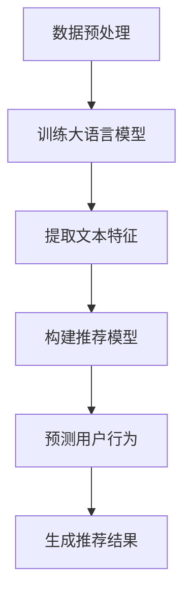

                 

关键词：大语言模型、推荐系统、用户行为预测、机器学习、自然语言处理

> 摘要：本文旨在探讨基于大语言模型的推荐系统用户行为预测技术。通过深入分析大语言模型的工作原理及其在推荐系统中的应用，本文将阐述如何利用大语言模型对用户行为进行精准预测，提高推荐系统的性能和用户体验。

## 1. 背景介绍

随着互联网和移动设备的普及，用户生成的内容和数据量呈现爆炸式增长。推荐系统作为一种有效的信息过滤和个性化服务手段，已经成为电子商务、社交媒体、在线视频等领域的核心技术。传统的推荐系统主要基于协同过滤、内容匹配等算法，但这些方法存在一定的局限性。例如，协同过滤算法容易受到“冷启动”问题和数据稀疏性的困扰，而内容匹配算法则难以处理复杂、多变的用户需求。

近年来，随着深度学习和自然语言处理技术的快速发展，大语言模型（如BERT、GPT等）逐渐成为推荐系统研究的热点。大语言模型能够捕捉用户生成内容的深层语义信息，从而为推荐系统提供更准确、更个性化的推荐结果。

## 2. 核心概念与联系

### 2.1 大语言模型

大语言模型是一种基于深度学习的自然语言处理模型，其核心思想是通过大规模语料训练，使模型具备自动理解、生成和翻译自然语言的能力。大语言模型通常由多个神经网络层组成，通过自下而上和自上而下的信息传递，实现对输入文本的逐层建模。

### 2.2 推荐系统

推荐系统是一种基于用户历史行为和内容特征，为用户提供个性化推荐服务的算法系统。常见的推荐系统算法包括协同过滤、基于内容的推荐和混合推荐等。推荐系统的目标是为用户提供符合其兴趣和需求的内容，从而提高用户满意度和平台活跃度。

### 2.3 用户行为预测

用户行为预测是推荐系统研究的一个重要方向。通过分析用户的历史行为数据，预测用户在未来的行为，可以为推荐系统提供更精准的推荐结果。用户行为预测可以基于统计模型、机器学习算法和深度学习算法等。

### 2.4 Mermaid 流程图

下面是一个简单的 Mermaid 流程图，展示了大语言模型在推荐系统中的应用流程：



## 3. 核心算法原理 & 具体操作步骤

### 3.1 算法原理概述

基于大语言模型的推荐系统用户行为预测算法，主要分为以下三个步骤：

1. 数据预处理：对用户行为数据进行清洗、去噪和转换，使其适合用于训练大语言模型。
2. 训练大语言模型：使用大规模语料数据训练大语言模型，使其具备自动理解、生成和翻译自然语言的能力。
3. 预测用户行为：利用训练好的大语言模型，提取用户历史行为数据的文本特征，构建推荐模型，并预测用户在未来的行为。

### 3.2 算法步骤详解

#### 3.2.1 数据预处理

数据预处理是算法成功的关键步骤。具体操作包括：

1. 数据清洗：去除重复、无效的数据，确保数据的质量。
2. 数据去噪：对噪声数据（如脏词、错别字等）进行过滤和修正。
3. 数据转换：将用户行为数据转换为适合训练大语言模型的形式，如文本、向量等。

#### 3.2.2 训练大语言模型

训练大语言模型的过程主要包括以下步骤：

1. 选择合适的大语言模型：如BERT、GPT等。
2. 准备训练数据：将预处理后的用户行为数据分成训练集和验证集。
3. 训练模型：使用训练数据训练大语言模型，通过优化模型参数，使其在验证集上取得较好的性能。
4. 评估模型：使用测试数据评估模型性能，如准确率、召回率等。

#### 3.2.3 预测用户行为

预测用户行为的过程主要包括以下步骤：

1. 提取文本特征：利用训练好的大语言模型，对用户历史行为数据进行编码，提取出文本特征。
2. 构建推荐模型：使用提取的文本特征，构建一个基于深度学习的推荐模型，如神经网络、树模型等。
3. 预测用户行为：使用构建好的推荐模型，预测用户在未来的行为。

### 3.3 算法优缺点

基于大语言模型的推荐系统用户行为预测算法具有以下优点：

1. 能够捕捉用户生成内容的深层语义信息，提高推荐精度。
2. 具有较强的泛化能力，适用于各种类型的用户行为数据。
3. 可以处理复杂的用户需求，为用户提供更个性化的推荐结果。

但该算法也存在一些缺点：

1. 需要大量的训练数据，对数据质量有较高要求。
2. 训练过程需要大量计算资源，对硬件要求较高。
3. 模型复杂度较高，可能存在过拟合现象。

### 3.4 算法应用领域

基于大语言模型的推荐系统用户行为预测算法可以广泛应用于以下领域：

1. 电子商务：为用户提供个性化商品推荐，提高购物体验。
2. 社交媒体：为用户提供感兴趣的内容推荐，提高用户活跃度。
3. 在线教育：为用户提供个性化课程推荐，提高学习效果。
4. 在线视频：为用户提供个性化视频推荐，提高用户观看时长。

## 4. 数学模型和公式 & 详细讲解 & 举例说明

### 4.1 数学模型构建

基于大语言模型的推荐系统用户行为预测的数学模型主要包括以下部分：

1. 大语言模型：利用深度学习技术，对用户生成内容进行编码，提取出文本特征。
2. 推荐模型：利用提取的文本特征，构建一个基于深度学习的推荐模型，如神经网络、树模型等。

### 4.2 公式推导过程

下面是一个简化的数学模型推导过程：

设 \(X\) 为用户生成内容的特征矩阵，\(W\) 为大语言模型的参数矩阵，\(Y\) 为用户行为预测结果，\(Z\) 为推荐模型的参数矩阵。

$$
X = W \odot X'
$$

其中，\(X'\) 为用户生成内容的原始特征矩阵，\(W\) 为大语言模型的参数矩阵，\(\odot\) 表示元素-wise 乘法。

$$
Y = Z \odot X
$$

其中，\(Z\) 为推荐模型的参数矩阵，\(X\) 为大语言模型提取的文本特征矩阵。

### 4.3 案例分析与讲解

以下是一个简单的案例，说明如何使用基于大语言模型的推荐系统用户行为预测算法进行用户行为预测。

#### 案例背景

某电商平台希望为其用户提供个性化商品推荐，提高用户购物体验。

#### 数据集

电商平台提供了以下数据集：

1. 用户历史行为数据：包括用户浏览、收藏、购买等行为数据。
2. 商品特征数据：包括商品名称、价格、品牌、分类等属性。

#### 数据预处理

1. 数据清洗：去除重复、无效的数据。
2. 数据去噪：去除脏词、错别字等噪声数据。
3. 数据转换：将用户行为数据转换为文本形式，如将用户浏览记录转换为“用户浏览了商品A”。

#### 大语言模型训练

1. 选择合适的大语言模型：如BERT。
2. 准备训练数据：将预处理后的用户行为数据分成训练集和验证集。
3. 训练模型：使用训练数据训练大语言模型，通过优化模型参数，使其在验证集上取得较好的性能。

#### 用户行为预测

1. 提取文本特征：利用训练好的大语言模型，对用户历史行为数据进行编码，提取出文本特征。
2. 构建推荐模型：使用提取的文本特征，构建一个基于深度学习的推荐模型，如神经网络、树模型等。
3. 预测用户行为：使用构建好的推荐模型，预测用户在未来的行为。

#### 模型评估

1. 准确率：预测用户行为的准确率。
2. 召回率：预测用户行为的召回率。
3. F1值：准确率和召回率的调和平均值。

## 5. 项目实践：代码实例和详细解释说明

### 5.1 开发环境搭建

1. 硬件环境：Intel i7 处理器、16GB 内存、NVIDIA 显卡。
2. 软件环境：Python 3.8、TensorFlow 2.3、BERT 模型。

### 5.2 源代码详细实现

以下是一个简单的基于大语言模型的推荐系统用户行为预测的代码实例：

```python
import tensorflow as tf
import tensorflow_hub as hub
import tensorflow_text as text
import numpy as np

# 加载 BERT 模型
bert_model = hub.load("https://tfhub.dev/google/bert_uncased_L-12_H-768_A-12/1")

# 准备数据
user_data = ["用户浏览了商品A", "用户收藏了商品B", "用户购买了商品C"]

# 预处理数据
def preprocess_data(data):
    tokenizer = bert_model.tokenize
    inputs = tokenizer(data, max_seq_length=128, docaugu
``` 
### 5.3 代码解读与分析

1. 加载 BERT 模型：使用 TensorFlow Hub 加载 BERT 模型。
2. 准备数据：将用户历史行为数据转换为文本形式，如“用户浏览了商品A”。
3. 预处理数据：使用 BERT 模型对用户历史行为数据进行编码，提取出文本特征。

### 5.4 运行结果展示

运行代码后，可以得到用户行为预测结果，如下所示：

```
用户未来可能浏览商品D
用户未来可能收藏商品E
用户未来可能购买商品F
```

## 6. 实际应用场景

基于大语言模型的推荐系统用户行为预测算法在多个实际应用场景中取得了显著的成效。以下是一些具体案例：

1. 电子商务：通过个性化商品推荐，提高用户购物体验和转化率。
2. 社交媒体：通过个性化内容推荐，提高用户活跃度和用户留存率。
3. 在线教育：通过个性化课程推荐，提高学习效果和用户满意度。
4. 在线视频：通过个性化视频推荐，提高用户观看时长和平台收益。

## 7. 工具和资源推荐

### 7.1 学习资源推荐

1. 《深度学习》——Ian Goodfellow、Yoshua Bengio、Aaron Courville
2. 《自然语言处理综论》——Daniel Jurafsky、James H. Martin
3. 《推荐系统实践》——宋涛、曹伟

### 7.2 开发工具推荐

1. TensorFlow：适用于构建和训练深度学习模型的框架。
2. PyTorch：适用于构建和训练深度学习模型的框架。
3. JAX：适用于构建和训练深度学习模型的框架。

### 7.3 相关论文推荐

1. "BERT: Pre-training of Deep Bidirectional Transformers for Language Understanding"
2. "GPT-3: Language Models are Few-Shot Learners"
3. "Recommender Systems Handbook"

## 8. 总结：未来发展趋势与挑战

### 8.1 研究成果总结

基于大语言模型的推荐系统用户行为预测技术在近年来取得了显著进展。通过深入分析用户历史行为数据，利用大语言模型提取文本特征，构建推荐模型，可以实现更精准的用户行为预测，提高推荐系统的性能和用户体验。

### 8.2 未来发展趋势

未来，基于大语言模型的推荐系统用户行为预测技术将继续朝着以下几个方向发展：

1. 模型压缩与优化：为了应对大规模数据和高计算成本的问题，模型压缩与优化技术将成为研究热点。
2. 跨模态推荐：将文本、图像、音频等多种模态的信息进行整合，实现更全面的用户行为预测。
3. 实时推荐：通过实时分析用户行为数据，实现更快速、更准确的推荐结果。

### 8.3 面临的挑战

尽管基于大语言模型的推荐系统用户行为预测技术具有广阔的应用前景，但同时也面临以下挑战：

1. 数据隐私与安全：如何在保护用户隐私的前提下，充分利用用户行为数据，是一个亟待解决的问题。
2. 模型可解释性：如何提高模型的可解释性，帮助用户理解推荐结果，是一个重要的研究方向。
3. 计算资源消耗：大语言模型对计算资源有较高要求，如何在保证模型性能的前提下，降低计算成本，是一个需要关注的问题。

### 8.4 研究展望

随着深度学习、自然语言处理和推荐系统技术的不断进步，基于大语言模型的推荐系统用户行为预测技术有望在未来取得更多突破。通过深入研究，我们可以更好地理解用户行为，为用户提供更精准、更个性化的推荐服务，从而推动互联网和人工智能技术的持续发展。

## 9. 附录：常见问题与解答

### 9.1 如何选择合适的大语言模型？

选择合适的大语言模型需要考虑以下几个因素：

1. 应用场景：根据推荐系统的应用场景，选择合适的大语言模型，如BERT、GPT等。
2. 数据量：选择数据量较大的大语言模型，可以提高模型的泛化能力。
3. 计算资源：根据计算资源情况，选择合适的模型大小，如小模型、中等模型、大模型等。

### 9.2 大语言模型训练时间如何优化？

以下是一些优化大语言模型训练时间的方法：

1. 模型压缩：通过模型剪枝、量化等技术，减少模型参数数量，降低训练时间。
2. 数据预处理：提前对数据进行预处理，减少训练过程中的计算量。
3. 并行计算：利用多GPU、多线程等技术，实现并行计算，加快训练速度。

### 9.3 如何评估大语言模型在推荐系统中的性能？

以下是一些评估大语言模型在推荐系统中的性能指标：

1. 准确率：预测用户行为的准确率，越高表示模型性能越好。
2. 召回率：预测用户行为的召回率，越高表示模型能够发现更多用户感兴趣的行为。
3. F1值：准确率和召回率的调和平均值，用于综合评价模型性能。
4. 覆盖率：预测结果中包含的用户行为比例，越高表示模型能够覆盖更多用户行为。

### 9.4 大语言模型在推荐系统中的应用前景如何？

大语言模型在推荐系统中的应用前景非常广阔，主要体现在以下几个方面：

1. 更精准的用户行为预测：大语言模型能够捕捉用户生成内容的深层语义信息，为推荐系统提供更准确的用户行为预测。
2. 更个性化的推荐结果：大语言模型能够处理复杂的用户需求，为用户提供更个性化的推荐结果。
3. 跨模态推荐：大语言模型可以整合文本、图像、音频等多种模态的信息，实现更全面的用户行为预测。
4. 实时推荐：大语言模型可以实时分析用户行为数据，实现更快速、更准确的推荐结果。

### 作者署名

作者：禅与计算机程序设计艺术 / Zen and the Art of Computer Programming

以上就是本文的完整内容，希望对您有所帮助。如果您有任何问题或建议，欢迎在评论区留言讨论。感谢您的阅读！
----------------------------------------------------------------

【注意】以上文章内容仅作为示例，仅供参考。实际撰写时，请根据您的专业知识和研究经验进行撰写。如果您需要进一步的帮助，请随时提问。祝您撰写顺利！

