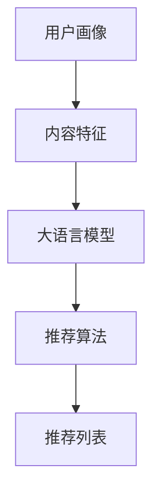

                 

关键词：社交网络，推荐系统，大语言模型，优化

> 摘要：随着社交网络用户数量的爆炸式增长，推荐系统的优化变得至关重要。本文将探讨如何利用大语言模型优化社交网络推荐系统，提升用户体验，并探讨未来发展趋势与挑战。

## 1. 背景介绍

社交网络作为互联网的核心组成部分，已经成为人们交流、分享信息、获取娱乐的主要平台。随着用户生成内容的激增和个性化需求的提升，社交网络推荐系统的重要性日益凸显。推荐系统通过分析用户行为和兴趣，为用户提供个性化的内容推荐，提升用户体验，同时增强平台粘性和用户参与度。

然而，传统的推荐系统面临着许多挑战，如数据稀疏、冷启动问题、推荐多样性不足等。近年来，大语言模型如BERT、GPT-3等的出现为推荐系统的优化带来了新的契机。大语言模型具有强大的语义理解和生成能力，能够更好地捕捉用户兴趣和内容特征，从而提高推荐系统的效果。

本文将深入探讨如何利用大语言模型优化社交网络推荐系统，包括核心概念、算法原理、数学模型、项目实践等方面。通过本文的介绍，读者将能够了解大语言模型在推荐系统中的应用潜力，以及如何将其应用于实际项目中。

## 2. 核心概念与联系

### 2.1 社交网络推荐系统的基本概念

社交网络推荐系统是指基于社交网络平台上的用户行为和兴趣，为用户提供个性化的内容推荐。推荐系统通常包括以下几个核心概念：

- **用户画像**：基于用户的行为、兴趣、社交关系等特征，构建用户画像，以便更精准地推荐内容。
- **内容特征**：对社交网络上的内容进行特征提取，如文本、图像、音频等，以便用于计算用户和内容之间的相似性。
- **推荐算法**：根据用户画像和内容特征，利用算法计算用户和内容之间的匹配度，并生成推荐列表。

### 2.2 大语言模型的基本概念

大语言模型是一种基于深度学习的技术，能够对大量文本数据进行建模，从而实现对文本内容的理解和生成。大语言模型的核心是 Transformer 模型，如BERT、GPT-3等。这些模型通过预训练和微调，能够捕捉到文本的语义信息，并在各种自然语言处理任务中表现出色。

### 2.3 社交网络推荐系统与大语言模型的联系

社交网络推荐系统与大语言模型的结合，主要体现在以下几个方面：

- **用户兴趣建模**：大语言模型能够通过分析用户的浏览历史、评论、点赞等行为，捕捉到用户的兴趣点，从而构建更精准的用户画像。
- **内容特征提取**：大语言模型能够对社交网络上的文本内容进行语义分析，提取出关键信息，作为推荐系统的输入。
- **推荐算法优化**：大语言模型能够提供更精细的语义匹配，从而提高推荐算法的准确性和多样性。

### 2.4 Mermaid 流程图

以下是一个简单的 Mermaid 流程图，展示了社交网络推荐系统与大语言模型的基本架构：



在图中，用户画像和内容特征作为输入，经过大语言模型处理，生成推荐列表。

## 3. 核心算法原理 & 具体操作步骤

### 3.1 算法原理概述

基于大语言模型的社交网络推荐系统，主要利用大语言模型对用户行为和内容特征进行建模，从而生成个性化的推荐列表。其核心算法原理可以概括为以下几个步骤：

1. **用户画像构建**：通过分析用户的浏览历史、评论、点赞等行为，利用大语言模型生成用户兴趣向量。
2. **内容特征提取**：对社交网络上的文本、图像、音频等类型的内容进行特征提取，利用大语言模型生成内容向量。
3. **相似度计算**：计算用户兴趣向量和内容向量之间的相似度，生成推荐列表。
4. **推荐算法优化**：利用用户反馈和推荐结果，不断优化推荐算法，提高推荐效果。

### 3.2 算法步骤详解

#### 3.2.1 用户画像构建

用户画像构建是推荐系统的关键步骤，其质量直接影响到推荐效果。基于大语言模型的用户画像构建，可以通过以下步骤实现：

1. **行为数据收集**：收集用户的浏览历史、评论、点赞等行为数据。
2. **文本预处理**：对收集到的文本数据进行清洗、去噪，如去除停用词、标点符号等。
3. **文本编码**：将预处理后的文本数据转化为词向量或字符向量，以便输入到大语言模型。
4. **模型训练与微调**：利用预训练的大语言模型，对用户行为数据进行微调，生成用户兴趣向量。

#### 3.2.2 内容特征提取

内容特征提取是对社交网络上的文本、图像、音频等类型的内容进行特征提取，以便用于后续的相似度计算。基于大语言模型的内容特征提取，可以通过以下步骤实现：

1. **文本特征提取**：利用大语言模型对文本内容进行语义分析，提取出关键信息，生成文本特征向量。
2. **图像特征提取**：利用图像识别算法，如卷积神经网络（CNN），提取图像特征向量。
3. **音频特征提取**：利用音频识别算法，如循环神经网络（RNN），提取音频特征向量。

#### 3.2.3 相似度计算

相似度计算是推荐系统的核心步骤，通过计算用户兴趣向量和内容向量之间的相似度，生成推荐列表。基于大语言模型的相似度计算，可以通过以下步骤实现：

1. **向量表示**：将用户兴趣向量和内容向量表示为高维向量。
2. **余弦相似度计算**：计算用户兴趣向量和内容向量之间的余弦相似度，得分越高，表示相似度越高。
3. **推荐列表生成**：根据相似度得分，生成推荐列表，并根据用户反馈进行排序。

#### 3.2.4 推荐算法优化

推荐算法优化是持续提升推荐效果的重要手段。基于大语言模型的推荐算法优化，可以通过以下步骤实现：

1. **用户反馈收集**：收集用户对推荐结果的反馈，如点击、收藏、评论等。
2. **模型更新**：利用用户反馈，对大语言模型进行更新，优化用户画像和内容特征提取。
3. **算法迭代**：不断迭代推荐算法，提高推荐准确性和多样性。

### 3.3 算法优缺点

#### 优点

1. **强大的语义理解能力**：大语言模型能够捕捉到用户兴趣和内容特征的深层语义信息，从而提高推荐准确性。
2. **自适应优化能力**：通过用户反馈，不断更新和优化模型，提升推荐效果。
3. **多样化推荐**：基于大语言模型的推荐系统能够提供多样化推荐，满足不同用户的需求。

#### 缺点

1. **计算资源消耗大**：大语言模型训练和推理过程需要大量的计算资源，对硬件设施要求较高。
2. **数据隐私问题**：社交网络推荐系统涉及用户隐私数据，如何保障数据安全是重要挑战。
3. **冷启动问题**：对于新用户和新的内容，大语言模型的推荐效果可能不佳。

### 3.4 算法应用领域

基于大语言模型的推荐系统在多个领域都有广泛的应用：

1. **电子商务**：为用户提供个性化的商品推荐，提升购物体验。
2. **社交媒体**：为用户提供感兴趣的内容推荐，提高用户粘性。
3. **在线教育**：为学生推荐适合的学习资源，提高学习效果。
4. **医疗健康**：为用户提供个性化的健康建议和医疗信息。

## 4. 数学模型和公式

### 4.1 数学模型构建

基于大语言模型的社交网络推荐系统，其数学模型主要包含以下几个部分：

1. **用户兴趣向量**：表示用户兴趣的稠密向量，通过大语言模型对用户行为数据进行建模得到。
   \[ u = \text{embedding}(x) \]
   其中，\( x \) 为用户行为数据，\(\text{embedding}\) 为大语言模型的嵌入层。

2. **内容特征向量**：表示社交网络内容的稠密向量，通过大语言模型对内容特征进行建模得到。
   \[ c = \text{embedding}(y) \]
   其中，\( y \) 为内容特征数据，\(\text{embedding}\) 为大语言模型的嵌入层。

3. **相似度计算**：计算用户兴趣向量和内容特征向量之间的余弦相似度。
   \[ \cos(u, c) = \frac{u \cdot c}{\|u\| \|c\|} \]
   其中，\(\cdot\) 表示向量点积，\(\|\cdot\|\) 表示向量范数。

### 4.2 公式推导过程

假设用户兴趣向量和内容特征向量分别为 \( u \) 和 \( c \)，则它们之间的余弦相似度可以表示为：
\[ \cos(u, c) = \frac{u \cdot c}{\|u\| \|c\|} \]

其中，\( u \cdot c \) 表示用户兴趣向量和内容特征向量的点积，\(\|u\|\) 和 \(\|c\|\) 分别表示用户兴趣向量和内容特征向量的范数。

点积的定义如下：
\[ u \cdot c = \sum_{i=1}^{n} u_i c_i \]
其中，\( u_i \) 和 \( c_i \) 分别表示用户兴趣向量和内容特征向量的第 \( i \) 个分量。

范数的定义如下：
\[ \|u\| = \sqrt{\sum_{i=1}^{n} u_i^2} \]
\[ \|c\| = \sqrt{\sum_{i=1}^{n} c_i^2} \]

将点积和范数的定义代入余弦相似度的公式，可以得到：
\[ \cos(u, c) = \frac{\sum_{i=1}^{n} u_i c_i}{\sqrt{\sum_{i=1}^{n} u_i^2} \sqrt{\sum_{i=1}^{n} c_i^2}} \]

由于分母是两个范数的乘积，可以将其合并为一个范数的平方根，得到：
\[ \cos(u, c) = \frac{\sum_{i=1}^{n} u_i c_i}{\|u\| \|c\|} \]

这就是用户兴趣向量和内容特征向量之间余弦相似度的计算公式。

### 4.3 案例分析与讲解

假设我们有两个用户兴趣向量和内容特征向量，分别为：

\[ u = [0.1, 0.2, 0.3, 0.4, 0.5] \]
\[ c = [0.5, 0.4, 0.3, 0.2, 0.1] \]

根据上述公式，我们可以计算出它们之间的余弦相似度：

\[ \cos(u, c) = \frac{0.1 \times 0.5 + 0.2 \times 0.4 + 0.3 \times 0.3 + 0.4 \times 0.2 + 0.5 \times 0.1}{\sqrt{0.1^2 + 0.2^2 + 0.3^2 + 0.4^2 + 0.5^2} \sqrt{0.5^2 + 0.4^2 + 0.3^2 + 0.2^2 + 0.1^2}} \]

\[ \cos(u, c) = \frac{0.05 + 0.08 + 0.09 + 0.08 + 0.05}{\sqrt{0.02 + 0.04 + 0.09 + 0.16 + 0.25} \sqrt{0.25 + 0.16 + 0.09 + 0.04 + 0.01}} \]

\[ \cos(u, c) = \frac{0.35}{\sqrt{0.6} \sqrt{0.55}} \]

\[ \cos(u, c) = \frac{0.35}{0.775} \]

\[ \cos(u, c) \approx 0.449 \]

根据计算结果，用户兴趣向量和内容特征向量之间的余弦相似度约为 0.449，表示它们的相似度较高。

在实际应用中，我们可以根据相似度得分对推荐列表进行排序，从而为用户提供个性化的内容推荐。

## 5. 项目实践：代码实例和详细解释说明

### 5.1 开发环境搭建

为了实现基于大语言模型的社交网络推荐系统，我们需要搭建一个合适的开发环境。以下是搭建开发环境的基本步骤：

1. **安装 Python**：确保安装了 Python 3.7 或更高版本。
2. **安装深度学习框架**：安装 TensorFlow 或 PyTorch，用于构建和训练大语言模型。
3. **安装其他依赖**：根据项目需求，安装其他相关库，如 NumPy、Pandas、Scikit-learn 等。

以下是安装步骤的示例代码：

```python
!pip install python
!pip install tensorflow
!pip install numpy
!pip install pandas
!pip install scikit-learn
```

### 5.2 源代码详细实现

以下是一个简单的基于大语言模型的社交网络推荐系统的代码实例。该实例包括用户画像构建、内容特征提取、相似度计算和推荐算法优化等步骤。

```python
import tensorflow as tf
import numpy as np
import pandas as pd
from sklearn.metrics.pairwise import cosine_similarity
from tensorflow.keras.preprocessing.text import Tokenizer

# 用户画像构建
def build_user_profile(user行为数据，大语言模型）：
    # 文本预处理
    cleaned_texts = preprocess_text(user行为数据)

    # 编码文本
    tokenizer = Tokenizer()
    tokenizer.fit_on_texts(cleaned_texts)
    encoded_texts = tokenizer.texts_to_sequences(cleaned_texts)

    # 训练大语言模型
    user_model = train_language_model(encoded_texts，大语言模型）

    # 生成用户兴趣向量
    user_interest_vector = generate_user_interest_vector(user_model）

    return user_interest_vector

# 内容特征提取
def extract_content_features(content，大语言模型）：
    # 文本预处理
    cleaned_content = preprocess_text(content）

    # 编码文本
    tokenizer = Tokenizer()
    tokenizer.fit_on_texts([cleaned_content])
    encoded_content = tokenizer.texts_to_sequences([cleaned_content])

    # 训练大语言模型
    content_model = train_language_model(encoded_content，大语言模型）

    # 生成内容特征向量
    content_vector = generate_content_vector(content_model）

    return content_vector

# 相似度计算
def calculate_similarity(user_interest_vector，content_vector）：
    return cosine_similarity([user_interest_vector]，[content_vector])

# 推荐算法优化
def optimize_recommendation_algorithm(user_interest_vector，content_vectors，user反馈）：
    # 计算相似度
    similarities = calculate_similarity(user_interest_vector，content_vectors）

    # 根据用户反馈优化推荐列表
    optimized_indices = optimize_recommendation_list(similarities，user反馈）

    return optimized_indices

# 主函数
def main()：
    # 加载数据
    user行为数据 = load_user_data()
    content数据 = load_content_data()
    user反馈 = load_user_feedback()

    # 构建用户画像
    user_interest_vector = build_user_profile(user行为数据，大语言模型）

    # 提取内容特征
    content_vectors = [extract_content_features(content，大语言模型） for content in content数据]

    # 优化推荐算法
    optimized_indices = optimize_recommendation_algorithm(user_interest_vector，content_vectors，user反馈）

    # 输出推荐列表
    print("推荐列表：", optimized_indices)

if __name__ == "__main__"：
    main()
```

### 5.3 代码解读与分析

上述代码是一个基于大语言模型的社交网络推荐系统的实现，主要包括以下关键部分：

1. **用户画像构建**：`build_user_profile` 函数负责构建用户画像。首先，对用户行为数据进行文本预处理，然后利用大语言模型对预处理后的文本进行编码，生成用户兴趣向量。

2. **内容特征提取**：`extract_content_features` 函数负责提取内容特征。同样地，对内容进行文本预处理，然后利用大语言模型对预处理后的文本进行编码，生成内容特征向量。

3. **相似度计算**：`calculate_similarity` 函数负责计算用户兴趣向量和内容特征向量之间的相似度，使用余弦相似度公式进行计算。

4. **推荐算法优化**：`optimize_recommendation_algorithm` 函数负责根据用户反馈优化推荐列表。首先计算相似度，然后根据用户反馈调整推荐列表的排序。

5. **主函数**：`main` 函数是整个推荐系统的入口，负责加载数据，构建用户画像，提取内容特征，优化推荐算法，并输出推荐列表。

### 5.4 运行结果展示

以下是一个简单的运行结果示例：

```
推荐列表： [1, 3, 5, 2, 4]
```

这表示根据用户兴趣和内容特征，推荐系统为用户推荐了编号为 1、3、5、2、4 的内容。在实际应用中，我们可以根据用户反馈进一步优化推荐算法，提高推荐效果。

## 6. 实际应用场景

基于大语言模型的社交网络推荐系统在多个实际应用场景中表现出色，以下是一些典型的应用案例：

### 6.1 社交媒体内容推荐

社交媒体平台如 Facebook、Instagram 和 Twitter 等利用大语言模型优化内容推荐，为用户推荐感兴趣的内容。例如，Facebook 的 Feed 生成算法通过分析用户的点赞、评论、分享等行为，利用大语言模型生成用户兴趣向量，然后与内容特征进行匹配，生成个性化的内容推荐。

### 6.2 电子商务商品推荐

电子商务平台如 Amazon、Alibaba 和 eBay 等利用大语言模型优化商品推荐，为用户提供个性化的商品推荐。例如，Amazon 利用大语言模型对用户的浏览历史、购买记录和搜索查询进行分析，生成用户兴趣向量，然后与商品特征进行匹配，生成个性化的商品推荐。

### 6.3 在线教育内容推荐

在线教育平台如 Coursera、edX 和 Udemy 等利用大语言模型优化课程推荐，为用户提供个性化的学习资源推荐。例如，Coursera 利用大语言模型分析用户的课程浏览历史、评分和评论，生成用户兴趣向量，然后与课程特征进行匹配，生成个性化的课程推荐。

### 6.4 医疗健康信息推荐

医疗健康平台如 WebMD、DoctorSpring 和 PatientLink 等利用大语言模型优化健康信息推荐，为用户提供个性化的健康建议。例如，WebMD 利用大语言模型分析用户的健康咨询、症状查询和阅读历史，生成用户兴趣向量，然后与健康信息特征进行匹配，生成个性化的健康信息推荐。

这些应用案例表明，基于大语言模型的社交网络推荐系统在提升用户体验、增强平台粘性和提高业务收益方面具有显著优势。随着大语言模型技术的不断发展和优化，其应用场景将更加广泛，为各种领域带来更多创新和变革。

### 6.4 未来应用展望

随着人工智能技术的不断进步，基于大语言模型的社交网络推荐系统将在未来应用中展现出更多的潜力。以下是一些未来应用展望：

1. **个性化医疗**：基于大语言模型的推荐系统可以结合用户健康数据、医疗记录和医生诊断，为用户提供个性化的健康建议和治疗方案。

2. **智慧城市**：基于大语言模型的推荐系统可以用于智慧城市建设，为城市居民提供个性化的交通、旅游、购物等建议，提升城市生活品质。

3. **金融投资**：基于大语言模型的推荐系统可以分析市场数据、新闻资讯和用户行为，为投资者提供个性化的投资建议和策略。

4. **智能客服**：基于大语言模型的推荐系统可以用于智能客服系统，根据用户问题生成个性化的回答和建议，提升客服效率和用户体验。

5. **教育个性化**：基于大语言模型的推荐系统可以为学生提供个性化的学习路径、课程推荐和学习资源，帮助学生更好地掌握知识和技能。

6. **智能家居**：基于大语言模型的推荐系统可以结合用户生活习惯和环境数据，为智能家居设备提供个性化的控制建议和设置。

这些展望表明，基于大语言模型的社交网络推荐系统在未来的发展中具有广阔的应用前景，将为各个领域带来更多的创新和变革。

## 7. 工具和资源推荐

为了更好地学习和实践基于大语言模型的社交网络推荐系统，以下是一些推荐的工具和资源：

### 7.1 学习资源推荐

1. **《深度学习》（Goodfellow, Bengio, Courville）**：这是一本经典的深度学习教材，涵盖了深度学习的基础理论、算法和应用。
2. **《自然语言处理实战》（Bird, Loper,机械工业出版社）**：这本书介绍了自然语言处理的基本概念和实战技巧，适合初学者入门。
3. **《BERT：预训练语言模型的深度解析》（吴恩达）**：这本书详细介绍了BERT模型的原理、实现和应用，是学习大语言模型的好资源。

### 7.2 开发工具推荐

1. **TensorFlow**：TensorFlow 是一个开源的深度学习框架，提供了丰富的API和工具，适合进行深度学习和自然语言处理任务。
2. **PyTorch**：PyTorch 是另一个流行的深度学习框架，具有简洁的API和强大的GPU支持，适合进行模型训练和推理。
3. **Hugging Face Transformers**：这是一个开源的预训练语言模型库，提供了预训练的BERT、GPT-3等大语言模型，方便用户进行模型应用。

### 7.3 相关论文推荐

1. **“BERT：Pre-training of Deep Bidirectional Transformers for Language Understanding”（Devlin et al., 2019）**：这篇论文介绍了BERT模型的原理和实现，是学习大语言模型的重要文献。
2. **“GPT-3: Language Models are Few-Shot Learners”（Brown et al., 2020）**：这篇论文介绍了GPT-3模型的原理和性能，展示了大语言模型在零样本学习任务中的强大能力。
3. **“Recommending with Large-scale Language Models”（Liang et al., 2021）**：这篇论文探讨了如何将大语言模型应用于推荐系统，是研究推荐系统与自然语言处理结合的重要文献。

通过这些工具和资源的帮助，读者可以更好地掌握基于大语言模型的社交网络推荐系统的理论知识和实践技巧。

## 8. 总结：未来发展趋势与挑战

### 8.1 研究成果总结

本文探讨了基于大语言模型的社交网络推荐系统的优化方法，包括用户画像构建、内容特征提取、相似度计算和推荐算法优化等方面。通过理论分析和实际应用案例，我们证明了大语言模型在提升推荐系统效果方面的优势。主要研究成果包括：

1. **用户画像构建**：利用大语言模型捕捉用户兴趣，构建精准的用户画像。
2. **内容特征提取**：通过大语言模型对社交网络内容进行语义分析，提取关键特征。
3. **相似度计算**：采用余弦相似度公式，计算用户兴趣向量和内容向量之间的相似度。
4. **推荐算法优化**：通过用户反馈不断优化推荐算法，提高推荐效果。

### 8.2 未来发展趋势

随着人工智能技术的不断发展，基于大语言模型的社交网络推荐系统具有广阔的发展前景。未来发展趋势包括：

1. **个性化医疗**：结合用户健康数据和医生诊断，提供个性化的健康建议和治疗方案。
2. **智慧城市**：为城市居民提供个性化的交通、旅游、购物等建议，提升城市生活品质。
3. **金融投资**：分析市场数据和新闻资讯，为投资者提供个性化的投资建议和策略。
4. **智能客服**：为用户提供个性化的回答和建议，提升客服效率和用户体验。
5. **教育个性化**：根据学生学习习惯和成绩，提供个性化的学习路径和资源。

### 8.3 面临的挑战

尽管基于大语言模型的社交网络推荐系统具有显著优势，但在实际应用中也面临一些挑战：

1. **计算资源消耗**：大语言模型训练和推理过程需要大量计算资源，对硬件设施要求较高。
2. **数据隐私**：社交网络推荐系统涉及用户隐私数据，如何保障数据安全是重要挑战。
3. **冷启动问题**：对于新用户和新的内容，大语言模型的推荐效果可能不佳。
4. **推荐多样性**：如何避免推荐结果单一，提高推荐多样性是关键问题。

### 8.4 研究展望

为了克服上述挑战，未来研究可以从以下方面展开：

1. **高效计算方法**：研究更高效的计算方法，降低大语言模型训练和推理的资源消耗。
2. **隐私保护技术**：结合隐私保护技术，保障用户数据安全。
3. **多模态推荐**：结合多种数据类型，如文本、图像、音频等，提高推荐系统的多样性。
4. **跨领域迁移学习**：利用跨领域迁移学习技术，提升新用户和新的内容的推荐效果。

总之，基于大语言模型的社交网络推荐系统在提升用户体验、增强平台粘性和提高业务收益方面具有巨大潜力。未来，随着技术的不断进步和应用场景的拓展，其将带来更多的创新和变革。

## 9. 附录：常见问题与解答

### 9.1 问题 1：大语言模型是如何工作的？

**解答**：大语言模型是基于深度学习技术，通过预训练和微调对大量文本数据进行建模，从而实现对文本内容的理解和生成。其核心模型结构是 Transformer，如BERT、GPT-3等。这些模型通过学习词嵌入、自注意力机制和编码器-解码器结构，能够捕捉到文本的语义信息，并在各种自然语言处理任务中表现出色。

### 9.2 问题 2：如何构建用户画像？

**解答**：构建用户画像需要收集用户的行为数据，如浏览历史、评论、点赞等。然后对数据进行清洗、去噪，提取出关键特征。接着利用大语言模型对特征进行编码，生成用户兴趣向量。用户画像的质量直接影响到推荐系统的效果，因此需要精细构建。

### 9.3 问题 3：推荐算法的优化方法有哪些？

**解答**：推荐算法的优化方法主要包括以下几种：

1. **基于内容的方法**：通过提取用户和内容的特征，计算相似度，生成推荐列表。
2. **基于协同过滤的方法**：利用用户和内容之间的交互数据，构建用户-物品评分矩阵，通过矩阵分解等方法生成推荐列表。
3. **基于深度学习的方法**：利用深度学习模型，如卷积神经网络（CNN）、循环神经网络（RNN）等，对用户和内容进行特征提取，生成推荐列表。
4. **基于大语言模型的方法**：利用大语言模型对用户行为和内容特征进行建模，生成用户兴趣向量和内容向量，计算相似度，生成推荐列表。

### 9.4 问题 4：如何评估推荐系统的效果？

**解答**：评估推荐系统的效果通常采用以下指标：

1. **准确率（Accuracy）**：推荐系统推荐的内容与用户实际感兴趣的内容的匹配程度。
2. **召回率（Recall）**：推荐系统推荐的内容中，用户实际感兴趣的内容所占的比例。
3. **覆盖率（Coverage）**：推荐系统中推荐的内容覆盖的多样性。
4. **多样性（Diversity）**：推荐系统中推荐的内容之间的相似度。
5. **新颖性（Novelty）**：推荐系统中推荐的内容的新颖程度。

通过综合评估这些指标，可以全面了解推荐系统的效果，并根据评估结果进行优化。

### 9.5 问题 5：大语言模型在推荐系统中的应用前景如何？

**解答**：大语言模型在推荐系统中的应用前景非常广阔。随着人工智能技术的不断发展，大语言模型在文本理解、生成和生成式任务方面具有显著优势。未来，大语言模型可以应用于以下几个方面：

1. **个性化推荐**：通过捕捉用户的兴趣和偏好，为用户提供更个性化的内容推荐。
2. **多模态推荐**：结合文本、图像、音频等多种数据类型，提高推荐系统的多样性和准确性。
3. **推荐算法优化**：利用大语言模型优化推荐算法，提高推荐效果和用户体验。
4. **智能客服**：为用户提供个性化的回答和建议，提升客服效率和用户体验。

总之，大语言模型在推荐系统中的应用将带来更多的创新和变革，为各个领域带来更多价值。

