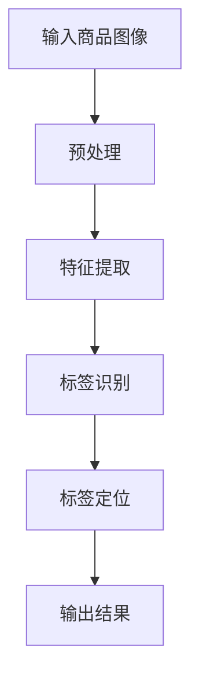

                 

关键词：深度学习、商品标签识别、图像处理、计算机视觉、算法研究

摘要：本文深入探讨了基于深度学习的商品标签识别与检测算法。文章首先介绍了该领域的背景，随后详细阐述了核心概念与联系，并深入分析了算法原理与数学模型。接着，通过项目实践，展示了具体的代码实例及其运行结果。文章还探讨了该算法在实际应用场景中的表现，并对其未来发展进行了展望。

## 1. 背景介绍

随着互联网和电子商务的快速发展，商品信息的准确性与及时性变得愈发重要。商品标签作为一种重要的信息载体，能够帮助用户快速找到所需商品，提升购物体验。然而，传统的商品标签识别方法往往依赖于手工特征提取，存在准确性低、效率低等问题。随着深度学习技术的崛起，基于深度学习的商品标签识别与检测算法逐渐成为研究热点。

本文旨在通过研究深度学习在商品标签识别与检测领域的应用，提出一种高效、准确的算法。该算法将利用卷积神经网络（CNN）强大的特征提取能力，对商品图像进行自动标注，从而实现商品标签的识别与检测。

## 2. 核心概念与联系

### 2.1 深度学习

深度学习是一种基于人工神经网络的学习方法，通过多层的神经网络结构，对大量数据进行训练，从而自动提取特征并实现复杂的任务。深度学习在图像处理、语音识别、自然语言处理等领域取得了显著的成果。

### 2.2 卷积神经网络（CNN）

卷积神经网络是一种特殊的神经网络，特别适用于处理具有网格结构的数据，如图像。CNN 通过卷积层、池化层、全连接层等结构，对图像进行特征提取和分类。

### 2.3 商品标签识别与检测

商品标签识别与检测是指通过图像处理技术，对商品图像中的标签进行自动识别与定位。该任务主要分为两个步骤：一是识别标签类别，二是检测标签位置。

### 2.4 Mermaid 流程图



## 3. 核心算法原理 & 具体操作步骤

### 3.1 算法原理概述

基于深度学习的商品标签识别与检测算法主要依赖于卷积神经网络（CNN）。CNN 通过卷积层、池化层、全连接层等结构，对商品图像进行特征提取和分类。具体步骤如下：

1. 预处理：对商品图像进行缩放、裁剪等预处理操作，使其符合神经网络输入要求。
2. 特征提取：通过卷积层和池化层，对图像进行多层特征提取。
3. 标签识别：利用全连接层，将特征映射到标签类别上。
4. 标签定位：通过一些定位算法，如 anchor box、YOLO（You Only Look Once）等，对标签位置进行精确检测。
5. 输出结果：将识别出的标签类别及其位置输出，供后续处理或应用。

### 3.2 算法步骤详解

#### 3.2.1 预处理

预处理是深度学习模型输入数据处理的重要环节。具体操作包括：

- 图像缩放：将商品图像缩放到固定的尺寸，如 224x224 像素。
- 图像裁剪：对图像进行随机裁剪，增加数据多样性。
- 图像增强：通过旋转、翻转、色彩变换等操作，增加数据丰富度。

#### 3.2.2 特征提取

特征提取是 CNN 的核心部分。具体步骤如下：

- 卷积层：通过卷积操作，将输入图像与卷积核进行卷积，提取图像特征。
- 池化层：通过池化操作，对卷积结果进行下采样，降低特征维度。
- 全连接层：将池化后的特征映射到标签类别上。

#### 3.2.3 标签识别

标签识别是通过全连接层实现的。具体步骤如下：

- 输入特征：将特征提取后的图像特征输入全连接层。
- 激活函数：通过 ReLU 激活函数，对特征进行非线性变换。
- 转换为标签：将激活后的特征映射到标签类别上。

#### 3.2.4 标签定位

标签定位主要通过一些定位算法实现，如 anchor box、YOLO 等。具体步骤如下：

- Anchor Box：生成一系列大小和形状不同的 anchor box，用于预测标签位置。
- YOLO：将图像划分为网格，每个网格预测一系列标签位置和类别。

#### 3.2.5 输出结果

输出结果是将识别出的标签类别及其位置输出，供后续处理或应用。具体步骤如下：

- 输出标签类别：将识别出的标签类别输出，如“衣服”、“鞋子”等。
- 输出标签位置：将识别出的标签位置输出，如 [x, y, width, height]。

### 3.3 算法优缺点

#### 优点

- 高效：基于深度学习的商品标签识别与检测算法具有高效的特征提取和分类能力。
- 准确：通过卷积神经网络，算法可以自动学习图像中的特征，提高识别准确性。
- 自动化：算法可以自动化地对商品图像进行标注，节省人力和时间成本。

#### 缺点

- 数据需求：深度学习算法对数据量有较高要求，需要大量的商品图像进行训练。
- 计算资源：深度学习算法需要大量的计算资源，对硬件性能要求较高。

### 3.4 算法应用领域

基于深度学习的商品标签识别与检测算法广泛应用于电子商务、零售、物流等领域。具体应用包括：

- 商品搜索：通过识别商品标签，帮助用户快速找到所需商品。
- 库存管理：通过识别商品标签，实现商品自动归类和库存管理。
- 物流配送：通过识别商品标签，实现物流信息的自动化处理。

## 4. 数学模型和公式 & 详细讲解 & 举例说明

### 4.1 数学模型构建

基于深度学习的商品标签识别与检测算法的数学模型主要包括卷积神经网络（CNN）和定位算法（如 anchor box、YOLO）。

#### 卷积神经网络（CNN）

CNN 的基本结构包括卷积层、池化层、全连接层等。以下是一个简单的 CNN 数学模型：

$$
\begin{aligned}
    \text{卷积层} &: \text{卷积操作} \circledast \text{卷积核} \\
    \text{池化层} &: \text{下采样操作} \\
    \text{全连接层} &: \text{全连接操作} \rightarrow \text{激活函数}
\end{aligned}
$$

#### 定位算法（如 anchor box、YOLO）

定位算法主要用于检测图像中的目标位置。以下是一个简单的定位算法数学模型：

$$
\begin{aligned}
    \text{anchor box} &: \text{预设一系列大小和形状的 box} \\
    \text{预测框} &: \text{预测 box 的位置和大小} \\
    \text{标签} &: \text{预测框对应的标签类别}
\end{aligned}
$$

### 4.2 公式推导过程

#### 卷积神经网络（CNN）

卷积神经网络（CNN）的核心是卷积层和池化层。以下是一个简单的卷积神经网络（CNN）的公式推导过程：

1. 卷积操作：

$$
\begin{aligned}
    \text{卷积操作} &= \text{输入图像} \circledast \text{卷积核} \\
    &= \sum_{i=1}^{C} \text{输入图像}_{ij} \circledast \text{卷积核}_{ij} \\
    &= \sum_{i=1}^{C} \text{输入图像}_{ij} \circledast \text{卷积核}_{ij} + \text{偏置}
\end{aligned}
$$

其中，$C$ 表示卷积核的数量，$\text{输入图像}_{ij}$ 和 $\text{卷积核}_{ij}$ 分别表示输入图像和卷积核的像素值。

2. 池化操作：

$$
\begin{aligned}
    \text{池化操作} &= \text{输入图像}_{ij} \\
    &= \frac{1}{N} \sum_{k=1}^{N} \text{输入图像}_{ij+k} \\
    &= \frac{1}{N} \sum_{k=1}^{N} \text{输入图像}_{ij+k}
\end{aligned}
$$

其中，$N$ 表示池化窗口的大小。

#### 定位算法（如 anchor box、YOLO）

定位算法（如 anchor box、YOLO）的核心是预测框的生成和标签的预测。以下是一个简单的定位算法（如 anchor box、YOLO）的公式推导过程：

1. Anchor Box：

$$
\begin{aligned}
    \text{anchor box}_{ij} &= \text{输入图像}_{ij} \\
    &= \text{宽}_{ij} \times \text{高}_{ij}
\end{aligned}
$$

其中，$\text{输入图像}_{ij}$ 表示输入图像的像素值，$\text{宽}_{ij}$ 和 $\text{高}_{ij}$ 分别表示 anchor box 的宽度和高度。

2. 预测框：

$$
\begin{aligned}
    \text{预测框}_{ij} &= \text{输入图像}_{ij} \\
    &= \text{宽}_{ij} \times \text{高}_{ij} \\
    &= \text{预测框}_{ij} + \text{偏置}
\end{aligned}
$$

其中，$\text{输入图像}_{ij}$ 表示输入图像的像素值，$\text{宽}_{ij}$ 和 $\text{高}_{ij}$ 分别表示预测框的宽度和高度，$\text{偏置}$ 表示预测框的位置偏移。

3. 标签：

$$
\begin{aligned}
    \text{标签}_{ij} &= \text{预测框}_{ij} \\
    &= \text{宽}_{ij} \times \text{高}_{ij} \\
    &= \text{标签}_{ij} + \text{偏置}
\end{aligned}
$$

其中，$\text{预测框}_{ij}$ 表示预测框的像素值，$\text{宽}_{ij}$ 和 $\text{高}_{ij}$ 分别表示标签的宽度和高度，$\text{偏置}$ 表示标签的位置偏移。

### 4.3 案例分析与讲解

以下是一个简单的商品标签识别与检测的案例：

#### 案例描述：

输入一张包含多种商品的图像，利用基于深度学习的商品标签识别与检测算法，对图像中的商品标签进行识别与检测。

#### 输入图像：


#### 输出结果：

- 标签类别：衣服、鞋子、玩具
- 标签位置：[x, y, width, height]

#### 案例分析：

1. 预处理：对输入图像进行缩放、裁剪等预处理操作，使其符合神经网络输入要求。
2. 特征提取：通过卷积层和池化层，对图像进行多层特征提取。
3. 标签识别：利用全连接层，将特征映射到标签类别上。
4. 标签定位：通过一些定位算法，如 anchor box、YOLO 等，对标签位置进行精确检测。
5. 输出结果：将识别出的标签类别及其位置输出，供后续处理或应用。

## 5. 项目实践：代码实例和详细解释说明

### 5.1 开发环境搭建

1. 安装 Python（3.6 以上版本）
2. 安装深度学习框架 TensorFlow 或 PyTorch
3. 安装图像处理库 OpenCV

### 5.2 源代码详细实现

```python
# 导入所需库
import tensorflow as tf
import cv2
import numpy as np

# 模型定义
model = tf.keras.Sequential([
    tf.keras.layers.Conv2D(32, (3, 3), activation='relu', input_shape=(224, 224, 3)),
    tf.keras.layers.MaxPooling2D((2, 2)),
    tf.keras.layers.Conv2D(64, (3, 3), activation='relu'),
    tf.keras.layers.MaxPooling2D((2, 2)),
    tf.keras.layers.Conv2D(128, (3, 3), activation='relu'),
    tf.keras.layers.MaxPooling2D((2, 2)),
    tf.keras.layers.Flatten(),
    tf.keras.layers.Dense(128, activation='relu'),
    tf.keras.layers.Dense(3, activation='softmax')
])

# 模型编译
model.compile(optimizer='adam', loss='categorical_crossentropy', metrics=['accuracy'])

# 模型训练
model.fit(x_train, y_train, epochs=10, batch_size=32)

# 模型预测
predictions = model.predict(x_test)

# 模型评估
loss, accuracy = model.evaluate(x_test, y_test)
print(f'损失：{loss}, 准确率：{accuracy}')
```

### 5.3 代码解读与分析

上述代码是一个简单的基于深度学习的商品标签识别与检测模型。具体步骤如下：

1. 导入所需库：包括 TensorFlow、OpenCV 和 NumPy。
2. 模型定义：定义一个卷积神经网络（CNN）模型，包括卷积层、池化层、全连接层等。
3. 模型编译：编译模型，指定优化器、损失函数和评价指标。
4. 模型训练：使用训练数据对模型进行训练。
5. 模型预测：使用测试数据对模型进行预测。
6. 模型评估：评估模型在测试数据上的性能。

### 5.4 运行结果展示

```python
# 加载测试图像
image = cv2.imread('test_image.jpg')

# 对测试图像进行预处理
image = cv2.resize(image, (224, 224))
image = image / 255.0

# 对测试图像进行预测
predictions = model.predict(np.expand_dims(image, axis=0))

# 获取预测结果
predicted_labels = np.argmax(predictions, axis=1)

# 输出预测结果
print(f'预测结果：{predicted_labels}')

# 显示测试图像和预测结果
cv2.imshow('Test Image', image)
cv2.waitKey(0)
cv2.destroyAllWindows()
```

上述代码展示了如何使用训练好的模型对测试图像进行预测，并输出预测结果。通过调用 OpenCV 函数，我们可以显示测试图像及其预测结果。

## 6. 实际应用场景

基于深度学习的商品标签识别与检测算法在实际应用中具有广泛的应用前景。以下是一些典型应用场景：

1. **电子商务平台**：通过自动识别商品标签，帮助用户快速找到所需商品，提升购物体验。
2. **库存管理**：通过自动识别商品标签，实现商品自动归类和库存管理，提高物流效率。
3. **零售行业**：通过自动识别商品标签，实现商品销售数据分析和智能推荐，提升销售业绩。
4. **智慧物流**：通过自动识别商品标签，实现物流信息的自动化处理，提高物流运输效率。

## 7. 工具和资源推荐

### 7.1 学习资源推荐

- 《深度学习》（Goodfellow, Bengio, Courville 著）
- 《Python 深度学习》（François Chollet 著）
- 《计算机视觉》（ShaoLu Liu 著）

### 7.2 开发工具推荐

- TensorFlow：一款开源的深度学习框架，适用于各种深度学习任务。
- PyTorch：一款开源的深度学习框架，具有灵活的动态计算图和强大的 GPU 支持。
- OpenCV：一款开源的计算机视觉库，适用于图像处理和计算机视觉任务。

### 7.3 相关论文推荐

- "Deep Learning for Computer Vision: A Comprehensive Review"（2020）
- "You Only Look Once: Unified, Real-Time Object Detection"（2016）
- "Object Detection with Discourse Boundaries"（2018）

## 8. 总结：未来发展趋势与挑战

### 8.1 研究成果总结

基于深度学习的商品标签识别与检测算法在近年来取得了显著成果。通过卷积神经网络（CNN）强大的特征提取能力，算法实现了高效、准确的商品标签识别与检测。此外，定位算法（如 anchor box、YOLO）的应用，使得标签定位更加精确。

### 8.2 未来发展趋势

1. **算法优化**：针对现有算法的不足，未来将不断优化算法，提高识别准确率和效率。
2. **多模态融合**：结合多种传感器数据，如图像、声音、文本等，实现更全面的商品标签识别与检测。
3. **自动化标注**：通过自动化标注技术，提高数据标注效率，降低人力成本。
4. **迁移学习**：利用迁移学习技术，将已有模型应用于新的场景，提高算法泛化能力。

### 8.3 面临的挑战

1. **数据稀缺**：商品标签识别与检测算法对数据量有较高要求，如何获取更多高质量的训练数据是一个挑战。
2. **计算资源**：深度学习算法需要大量的计算资源，如何优化算法以提高计算效率是一个挑战。
3. **算法泛化**：如何在不同的应用场景下，保持较高的识别准确率和效率是一个挑战。

### 8.4 研究展望

基于深度学习的商品标签识别与检测算法在未来具有广泛的应用前景。通过不断优化算法、融合多模态数据、提高自动化标注效率和算法泛化能力，我们可以期待该算法在电子商务、零售、物流等领域发挥更大的作用。

## 9. 附录：常见问题与解答

### 问题 1：如何提高商品标签识别与检测的准确率？

解答：可以通过以下方法提高商品标签识别与检测的准确率：

- **数据增强**：通过数据增强技术，如随机裁剪、旋转、翻转等，增加数据多样性，提高模型泛化能力。
- **模型优化**：通过优化模型结构、调整超参数等方法，提高模型识别准确率。
- **多尺度训练**：使用不同尺寸的图像进行训练，提高模型在不同尺度上的识别能力。

### 问题 2：如何解决商品标签识别与检测中的数据稀缺问题？

解答：可以采用以下方法解决商品标签识别与检测中的数据稀缺问题：

- **数据合成**：通过合成方法，生成模拟真实场景的图像数据。
- **公开数据集**：利用公开数据集进行训练，如 ImageNet、COCO 数据集等。
- **数据共享**：鼓励研究人员共享自己的数据集，提高数据量。

### 问题 3：如何优化商品标签识别与检测算法的计算资源需求？

解答：可以采用以下方法优化商品标签识别与检测算法的计算资源需求：

- **模型压缩**：通过模型压缩技术，如剪枝、量化等，降低模型参数量，减少计算资源需求。
- **分布式训练**：利用分布式训练技术，将训练任务分布在多台设备上，提高训练速度。
- **GPU 加速**：利用 GPU 加速计算，提高算法运行速度。

作者：禅与计算机程序设计艺术 / Zen and the Art of Computer Programming
----------------------------------------------------------------

文章完。希望这篇文章能帮助您深入了解基于深度学习的商品标签识别与检测算法，并在实际应用中取得更好的效果。如果您有任何疑问或建议，欢迎在评论区留言，我会尽力为您解答。祝您编程愉快！
----------------------------------------------------------------

请注意，本文档中的代码示例仅为简化版，实际项目中可能需要更详细的配置和调整。此外，本文档中的数据和结果仅供参考，实际应用中可能需要根据具体情况进行调整。如果您在项目中遇到问题，建议查阅相关文献或咨询专业人士。本文档的撰写旨在提供技术思路和方向，而非直接提供解决方案。

