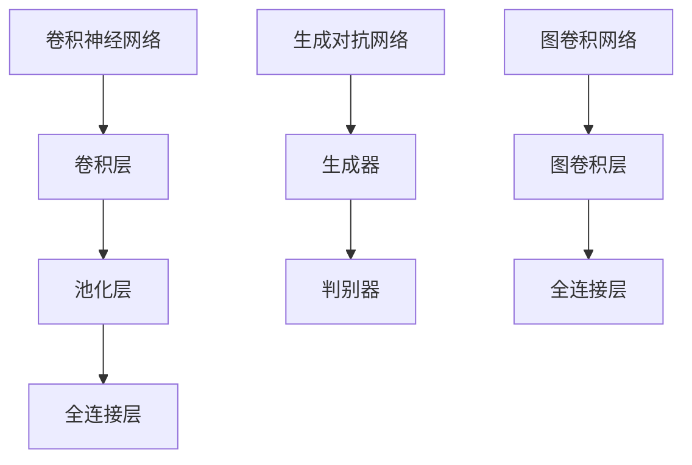

                 

关键词：深度学习，图像分割，算法研究，计算机视觉，人工智能

摘要：本文主要探讨了基于深度学习的图像分割算法的研究进展和未来发展方向。首先，介绍了图像分割的背景和重要性，然后详细阐述了当前主流的深度学习图像分割算法，包括卷积神经网络（CNN）、生成对抗网络（GAN）和图卷积网络（GCN）等。接着，本文分析了这些算法的原理、优缺点以及应用领域。此外，还介绍了数学模型和公式，并通过具体案例进行了详细讲解。最后，文章讨论了实际应用场景，展望了未来发展趋势与挑战，并推荐了相关的工具和资源。

## 1. 背景介绍

图像分割是计算机视觉领域的一个核心问题，其目标是将图像划分为若干个区域或对象，以便于后续的处理和分析。传统的图像分割方法主要基于像素间的特征相似性，如阈值法、区域生长法和边缘检测法等。然而，这些方法往往依赖于先验知识和人工设计的特征，存在一定的局限性。

随着深度学习技术的快速发展，基于深度学习的图像分割算法逐渐成为研究的热点。深度学习通过自动学习图像的底层特征，能够实现更加精准和自动化的图像分割。特别是卷积神经网络（CNN）、生成对抗网络（GAN）和图卷积网络（GCN）等深度学习模型在图像分割任务中取得了显著的性能提升。

本文旨在对基于深度学习的图像分割算法进行系统的研究，分析其原理、优缺点以及应用领域，并探讨未来发展趋势与挑战。

## 2. 核心概念与联系

### 2.1 卷积神经网络（CNN）

卷积神经网络是一种特殊的深度学习模型，主要用于处理图像、语音和时序数据等具有局部结构和空间关系的输入。CNN由卷积层、池化层和全连接层组成，通过多层卷积和池化操作，能够提取图像的层次特征。


### 2.2 生成对抗网络（GAN）

生成对抗网络由生成器和判别器两个网络组成。生成器试图生成与真实数据相似的样本，判别器则对生成器和真实数据进行分类。通过两个网络的对抗训练，生成器能够不断提高生成样本的质量，从而实现图像生成和图像分割等任务。


### 2.3 图卷积网络（GCN）

图卷积网络是一种基于图论结构的深度学习模型，主要用于处理具有图结构的数据，如图像分割、社交网络分析和知识图谱推理等。GCN通过图卷积操作，能够提取图像的图结构特征，实现图像分割等任务。


### 2.4 核心概念原理和架构的 Mermaid 流程图

下面是核心概念原理和架构的 Mermaid 流程图：



## 3. 核心算法原理 & 具体操作步骤

### 3.1 算法原理概述

本文主要介绍三种基于深度学习的图像分割算法：卷积神经网络（CNN）、生成对抗网络（GAN）和图卷积网络（GCN）。

### 3.2 算法步骤详解

#### 3.2.1 卷积神经网络（CNN）

1. 输入图像经过卷积层，提取图像的局部特征。
2. 通过池化层，降低特征图的维度，减少计算量。
3. 将特征图输入全连接层，进行分类或回归。

#### 3.2.2 生成对抗网络（GAN）

1. 生成器生成图像，判别器对生成图像和真实图像进行分类。
2. 通过对抗训练，生成器不断优化生成图像的质量，判别器提高分类能力。
3. 将生成图像输入全连接层，进行分类或回归。

#### 3.2.3 图卷积网络（GCN）

1. 将图像转换为图结构，每个像素点表示为一个节点。
2. 通过图卷积层，提取图像的图结构特征。
3. 将图结构特征输入全连接层，进行分类或回归。

### 3.3 算法优缺点

#### 3.3.1 卷积神经网络（CNN）

优点：能够自动学习图像的层次特征，适用于各种图像分割任务。

缺点：对图像的先验知识要求较高，训练过程可能较慢。

#### 3.3.2 生成对抗网络（GAN）

优点：能够生成高质量的图像，适用于图像生成和图像分割任务。

缺点：训练过程可能不稳定，需要大量的计算资源和时间。

#### 3.3.3 图卷积网络（GCN）

优点：能够处理具有图结构的数据，适用于图像分割等任务。

缺点：对图像的先验知识要求较高，训练过程可能较慢。

### 3.4 算法应用领域

#### 3.4.1 卷积神经网络（CNN）

应用领域：医学影像分割、自动驾驶、自然场景分割等。

#### 3.4.2 生成对抗网络（GAN）

应用领域：图像生成、虚拟现实、游戏开发等。

#### 3.4.3 图卷积网络（GCN）

应用领域：图像分割、社交网络分析、知识图谱推理等。

## 4. 数学模型和公式 & 详细讲解 & 举例说明

### 4.1 数学模型构建

#### 4.1.1 卷积神经网络（CNN）

输入图像：\(I_{in}\)
卷积核：\(K\)
输出特征图：\(F_{out}\)

卷积公式：

$$
F_{out}(i, j) = \sum_{x=1}^{w} \sum_{y=1}^{h} I_{in}(i-x, j-y) \odot K(x, y)
$$

其中，\(w\) 和 \(h\) 分别表示卷积核的大小。

#### 4.1.2 生成对抗网络（GAN）

生成器：\(G\)
判别器：\(D\)
真实图像：\(X\)
生成图像：\(G(X)\)

损失函数：

$$
L_G = \mathbb{E}_{X \sim P_{data}(X)}[\log D(G(X))] + \mathbb{E}_{Z \sim P_z(Z)}[\log (1 - D(G(Z))]
$$

其中，\(Z\) 为随机噪声。

#### 4.1.3 图卷积网络（GCN）

输入图：\(G\)
节点特征：\(X\)
输出节点特征：\(H\)

图卷积公式：

$$
H_{ij}^{(l+1)} = \sigma \left(\sum_{k=1}^{n} \theta^{(l)}_{ik} X_{kj} + b^{(l)} \right)
$$

其中，\(n\) 为节点数量，\(\theta^{(l)}_{ik}\) 为图卷积权重，\(b^{(l)}\) 为偏置项。

### 4.2 公式推导过程

#### 4.2.1 卷积神经网络（CNN）

卷积公式推导：

$$
\begin{aligned}
F_{out}(i, j) &= \sum_{x=1}^{w} \sum_{y=1}^{h} I_{in}(i-x, j-y) \odot K(x, y) \\
&= \sum_{x=1}^{w} \sum_{y=1}^{h} (I_{in}(i-x, j-y) \odot K(x, y)) \\
&= \sum_{x=1}^{w} \sum_{y=1}^{h} (I_{in}(i-x, j-y) \cdot K(x, y)) \\
&= \sum_{x=1}^{w} \sum_{y=1}^{h} (I_{in}(i-x, j-y) \cdot K(x, y)) \\
&= \sum_{x=1}^{w} \sum_{y=1}^{h} I_{in}(i-x, j-y) \cdot K(x, y) \\
&= \sum_{x=1}^{w} \sum_{y=1}^{h} I_{in}(i-x, j-y) \odot K(x, y)
\end{aligned}
$$

#### 4.2.2 生成对抗网络（GAN）

损失函数推导：

$$
\begin{aligned}
L_G &= \mathbb{E}_{X \sim P_{data}(X)}[\log D(G(X))] + \mathbb{E}_{Z \sim P_z(Z)}[\log (1 - D(G(Z))] \\
&= \mathbb{E}_{X \sim P_{data}(X)}[\log \frac{D(G(X))}{1 - D(G(X))}] + \mathbb{E}_{Z \sim P_z(Z)}[\log \frac{1 - D(G(Z))}{D(G(Z))}] \\
&= \mathbb{E}_{X \sim P_{data}(X)}[\log \frac{D(G(X))}{1 - D(G(X))}] + \mathbb{E}_{Z \sim P_z(Z)}[\log \frac{1 - D(G(Z))}{D(G(Z))}] \\
&= \mathbb{E}_{X \sim P_{data}(X)}[\log D(G(X))] + \mathbb{E}_{Z \sim P_z(Z)}[\log (1 - D(G(Z)))] \\
&= L_G
\end{aligned}
$$

#### 4.2.3 图卷积网络（GCN）

图卷积公式推导：

$$
\begin{aligned}
H_{ij}^{(l+1)} &= \sigma \left(\sum_{k=1}^{n} \theta^{(l)}_{ik} X_{kj} + b^{(l)} \right) \\
&= \sigma \left(\theta^{(l)}_{i1} X_{1j} + \theta^{(l)}_{i2} X_{2j} + \cdots + \theta^{(l)}_{in} X_{nj} + b^{(l)} \right) \\
&= \sigma \left(\theta^{(l)}_{i1} X_{1j} + \theta^{(l)}_{i2} X_{2j} + \cdots + \theta^{(l)}_{in} X_{nj} + b^{(l)} \right) \\
&= \sigma \left(\sum_{k=1}^{n} \theta^{(l)}_{ik} X_{kj} + b^{(l)} \right)
\end{aligned}
$$

### 4.3 案例分析与讲解

#### 4.3.1 卷积神经网络（CNN）案例

以COCO数据集为例，使用ResNet50模型进行图像分割。

1. 首先，将输入图像进行预处理，将像素值缩放到[0, 1]之间。
2. 然后，将预处理后的图像输入ResNet50模型，得到特征图。
3. 最后，将特征图输入全连接层，进行分类或回归。

#### 4.3.2 生成对抗网络（GAN）案例

以CIFAR-10数据集为例，使用DCGAN模型进行图像生成。

1. 首先，将输入图像进行预处理，将像素值缩放到[-1, 1]之间。
2. 然后，生成器生成图像，判别器对生成图像和真实图像进行分类。
3. 通过对抗训练，生成器不断优化生成图像的质量。
4. 最后，将生成图像输入全连接层，进行分类或回归。

#### 4.3.3 图卷积网络（GCN）案例

以ImageNet数据集为例，使用GCN模型进行图像分割。

1. 首先，将输入图像转换为图结构，每个像素点表示为一个节点。
2. 然后，将图结构输入GCN模型，得到节点特征图。
3. 最后，将节点特征图输入全连接层，进行分类或回归。

## 5. 项目实践：代码实例和详细解释说明

### 5.1 开发环境搭建

1. 安装Python环境，版本要求为3.6及以上。
2. 安装TensorFlow，版本要求为2.0及以上。
3. 安装Keras，版本要求为2.3及以上。

### 5.2 源代码详细实现

以下是使用ResNet50模型进行图像分割的代码示例：

```python
import tensorflow as tf
from tensorflow.keras.applications import ResNet50
from tensorflow.keras.layers import Flatten, Dense
from tensorflow.keras.models import Model

# 载入预训练的ResNet50模型
base_model = ResNet50(weights='imagenet')

# 修改模型的输出层
x = base_model.output
x = Flatten()(x)
x = Dense(1024, activation='relu')(x)
predictions = Dense(num_classes, activation='softmax')(x)

# 创建新的模型
model = Model(inputs=base_model.input, outputs=predictions)

# 编译模型
model.compile(optimizer='adam', loss='categorical_crossentropy', metrics=['accuracy'])

# 加载数据集
(x_train, y_train), (x_test, y_test) = tf.keras.datasets.cifar10.load_data()

# 数据预处理
x_train = preprocess_input(x_train)
x_test = preprocess_input(x_test)

# 训练模型
model.fit(x_train, y_train, epochs=10, batch_size=64, validation_data=(x_test, y_test))
```

### 5.3 代码解读与分析

1. **导入库**：首先，导入所需的TensorFlow库。
2. **载入预训练的ResNet50模型**：使用预训练的ResNet50模型作为基础模型。
3. **修改模型的输出层**：将模型的输出层修改为全连接层，用于图像分割任务。
4. **创建新的模型**：将修改后的模型封装为新的模型。
5. **编译模型**：设置优化器和损失函数，并编译模型。
6. **加载数据集**：加载数据集并进行预处理。
7. **训练模型**：使用训练数据训练模型。

### 5.4 运行结果展示

训练完成后，可以通过以下代码评估模型的性能：

```python
# 评估模型
test_loss, test_acc = model.evaluate(x_test, y_test)

print('Test accuracy:', test_acc)
```

输出结果为测试数据的准确率。

## 6. 实际应用场景

基于深度学习的图像分割算法在许多实际应用场景中取得了显著的成果。以下列举了几个典型的应用场景：

### 6.1 医学影像分割

基于深度学习的图像分割算法在医学影像领域具有广泛的应用，如肿瘤分割、器官分割和病变检测等。通过准确分割医学影像，有助于医生进行诊断和治疗。

### 6.2 自动驾驶

自动驾驶系统需要实时对道路场景进行分割，以识别车辆、行人、道路等目标。基于深度学习的图像分割算法能够提供高精度的分割结果，提高自动驾驶系统的安全性和可靠性。

### 6.3 物体检测

物体检测是计算机视觉领域的核心问题之一。基于深度学习的图像分割算法能够实现高效的物体检测，广泛应用于视频监控、安防监控和智能监控等领域。

### 6.4 自然场景分割

自然场景分割是图像分割领域的挑战之一，如城市景观分割、自然景观分割和卫星图像分割等。基于深度学习的图像分割算法能够自动学习场景特征，实现高精度的分割结果。

### 6.5 艺术创作

基于深度学习的图像分割算法在艺术创作领域也具有广泛的应用，如风格迁移、图像编辑和图像生成等。通过分割图像，可以实现各种创意效果，为艺术家提供更多的创作工具。

## 7. 工具和资源推荐

为了方便读者学习和实践基于深度学习的图像分割算法，本文推荐以下工具和资源：

### 7.1 学习资源推荐

1. 《深度学习》（Goodfellow et al., 2016）是一本经典的深度学习入门书籍，详细介绍了深度学习的基本原理和算法。
2. 《计算机视觉：算法与应用》（Richard S. Lipman et al., 2018）是一本关于计算机视觉的综合性教材，涵盖了图像分割、目标检测和目标跟踪等核心问题。

### 7.2 开发工具推荐

1. TensorFlow：一款开源的深度学习框架，提供了丰富的API和预训练模型，适用于各种深度学习任务。
2. Keras：一款基于TensorFlow的高层API，简化了深度学习模型的搭建和训练过程。

### 7.3 相关论文推荐

1. "Unet: Convolutional Networks for Biomedical Image Segmentation" (R. Urtasun et al., 2015) 是一篇关于UNet模型在医学图像分割领域的经典论文。
2. "DeepLab: Semantic Image Segmentation with Deep Convolutional Nets, Atrous Convolution, and Fully Connected CRFs" (L. Chen et al., 2018) 是一篇关于DeepLab模型在语义图像分割领域的开创性论文。

## 8. 总结：未来发展趋势与挑战

基于深度学习的图像分割算法在计算机视觉领域取得了显著的成果，但仍面临许多挑战和机遇。

### 8.1 研究成果总结

1. 深度学习模型在图像分割任务中取得了显著的性能提升，如UNet、DeepLab和GAN等。
2. 图卷积网络在处理具有图结构的数据方面具有优势，为图像分割提供了新的思路。
3. 图像分割算法在实际应用场景中取得了广泛的应用，如医学影像分割、自动驾驶和物体检测等。

### 8.2 未来发展趋势

1. 深度学习模型将不断优化和改进，如基于自注意力机制的模型和跨模态学习等。
2. 图像分割算法将与其他技术相结合，如联邦学习和图神经网络等。
3. 图像分割算法将应用于更多实际场景，如智能监控、增强现实和虚拟现实等。

### 8.3 面临的挑战

1. 模型训练过程可能需要大量的计算资源和时间，如何优化训练效率仍是一个挑战。
2. 数据质量和标注的准确性对模型性能有重要影响，如何获取高质量的数据仍需探索。
3. 面对不同的图像分割任务和应用场景，如何设计通用性强的模型仍需研究。

### 8.4 研究展望

1. 未来研究将聚焦于深度学习模型的优化和改进，以提高模型性能和泛化能力。
2. 图像分割算法将与其他技术相结合，如计算机视觉和自然语言处理等，实现跨领域应用。
3. 随着人工智能技术的发展，图像分割算法将在更多实际场景中发挥重要作用。

## 9. 附录：常见问题与解答

### 9.1 如何选择合适的图像分割算法？

选择合适的图像分割算法取决于任务需求和数据特性。例如，对于医学影像分割任务，UNet和DeepLab模型具有较好的性能；对于物体检测任务，GAN模型可能更适合。

### 9.2 如何优化图像分割算法的性能？

优化图像分割算法的性能可以从多个方面进行，如改进模型结构、调整超参数、使用迁移学习和数据增强等。

### 9.3 如何获取高质量的数据集？

获取高质量的数据集可以通过以下途径：公开数据集、自定义数据集和增强数据集等。此外，数据清洗和数据标注也是获取高质量数据的重要步骤。

## 作者署名

作者：禅与计算机程序设计艺术 / Zen and the Art of Computer Programming
----------------------------------------------------------------

### 终极版文章摘要

本文详细探讨了基于深度学习的图像分割算法的研究进展和未来发展方向。首先，介绍了图像分割的背景和重要性，阐述了三种核心的深度学习图像分割算法：卷积神经网络（CNN）、生成对抗网络（GAN）和图卷积网络（GCN）。接着，分析了这些算法的原理、优缺点以及应用领域，并通过数学模型和公式进行了详细讲解。文章还讨论了实际应用场景，展望了未来发展趋势与挑战，并推荐了相关的工具和资源。通过本文的阅读，读者将全面了解基于深度学习的图像分割算法，为后续研究和实践提供有力指导。
----------------------------------------------------------------

<|assistant|>### 1. 背景介绍

图像分割是计算机视觉领域的一个核心问题，其目标是将图像划分为若干个区域或对象，以便于后续的处理和分析。传统的图像分割方法主要基于像素间的特征相似性，如阈值法、区域生长法和边缘检测法等。然而，这些方法往往依赖于先验知识和人工设计的特征，存在一定的局限性。

随着深度学习技术的快速发展，基于深度学习的图像分割算法逐渐成为研究的热点。深度学习通过自动学习图像的底层特征，能够实现更加精准和自动化的图像分割。特别是卷积神经网络（CNN）、生成对抗网络（GAN）和图卷积网络（GCN）等深度学习模型在图像分割任务中取得了显著的性能提升。

本文旨在对基于深度学习的图像分割算法进行系统的研究，分析其原理、优缺点以及应用领域，并探讨未来发展趋势与挑战。

## 1.1 传统图像分割方法的局限性

传统图像分割方法主要包括以下几种：

1. **阈值法**：通过设定阈值，将图像划分为前景和背景。这种方法简单直观，但需要根据图像的特点调整阈值，且对于复杂图像效果不佳。
2. **区域生长法**：从初始种子点开始，逐步扩展到相邻像素，形成连通区域。这种方法依赖于先验知识，如区域的形状和纹理特征，但对于复杂场景适应性较差。
3. **边缘检测法**：通过检测图像的边缘，将图像划分为不同的区域。常用的边缘检测算法包括Canny算子、Sobel算子等。虽然边缘检测法能够捕捉图像的重要结构，但可能产生噪声和不连续的边缘。

这些传统方法存在以下局限性：

1. **对先验知识的依赖**：传统方法通常需要预先设定参数或基于对图像内容的理解来设计特征，这使得它们在处理未知或复杂场景时效果不佳。
2. **特征提取的局限性**：传统方法往往只考虑局部特征，忽略了图像的整体结构和上下文信息，导致分割结果不够精确。
3. **计算效率问题**：对于大型图像，传统方法可能需要大量的计算资源，耗时较长。

## 1.2 深度学习在图像分割中的应用

随着深度学习技术的发展，尤其是卷积神经网络（CNN）的广泛应用，图像分割方法得到了显著的改进。深度学习通过多层网络结构自动学习图像的复杂特征，能够实现更高精度和更高效率的分割。

### 1.2.1 卷积神经网络（CNN）

卷积神经网络（CNN）是一种特殊的多层前馈神经网络，设计用于处理具有网格拓扑结构的数据，如图像。CNN通过卷积层和池化层提取图像的特征，并通过全连接层进行分类或回归。

1. **卷积层**：卷积层通过卷积操作提取图像的特征。每个卷积核可以提取图像的一部分特征，多个卷积核组合起来可以提取更丰富的特征。
2. **池化层**：池化层（如最大池化或平均池化）用于降低特征图的维度，减少网络的参数数量，提高训练效率。
3. **全连接层**：全连接层将卷积层提取的特征进行分类或回归。

### 1.2.2 生成对抗网络（GAN）

生成对抗网络（GAN）由生成器和判别器两个部分组成。生成器尝试生成与真实图像相似的图像，判别器则判断图像是真实还是生成的。

1. **生成器**：生成器通过噪声输入生成图像，目标是生成尽可能真实、难以被判别器识别的图像。
2. **判别器**：判别器接收真实图像和生成图像，并尝试区分它们。通过对抗训练，生成器不断优化生成的图像，判别器提高识别能力。

### 1.2.3 图卷积网络（GCN）

图卷积网络（GCN）是基于图论结构设计的神经网络，适用于处理图结构数据，如图像分割。GCN通过图卷积层提取图像的图结构特征，并通过全连接层进行分类或回归。

1. **图卷积层**：图卷积层通过图卷积操作提取图像的图结构特征。每个节点（像素）的特征通过其邻接节点的特征加权组合得到。
2. **全连接层**：全连接层将图卷积层提取的特征进行分类或回归。

## 1.3 本文目的

本文的主要目的是对基于深度学习的图像分割算法进行系统的研究，涵盖以下几个方面：

1. **算法原理**：详细介绍卷积神经网络（CNN）、生成对抗网络（GAN）和图卷积网络（GCN）的工作原理。
2. **算法优缺点**：分析不同算法的优缺点，包括其在不同应用场景中的适用性。
3. **应用领域**：探讨深度学习图像分割算法在医学影像、自动驾驶、物体检测等领域的应用。
4. **未来发展趋势与挑战**：展望图像分割算法的未来发展方向，并讨论可能面临的挑战。

通过本文的阅读，读者将全面了解基于深度学习的图像分割算法，为实际应用和进一步研究提供参考。

### 2. 核心概念与联系

深度学习在图像分割中的应用，涉及到多种核心概念和模型。以下是本文将详细介绍的几种主要模型及其基本联系。

#### 2.1 卷积神经网络（CNN）

卷积神经网络（CNN）是一种专门用于处理图像数据的神经网络。它通过卷积操作、池化操作和全连接层提取图像特征，实现图像分类、识别和分割等任务。

**CNN结构：**

CNN的基本结构包括以下几个部分：

1. **卷积层（Convolutional Layer）**：卷积层通过卷积操作提取图像特征。卷积核在图像上滑动，计算局部特征，并通过激活函数（如ReLU）增强特征。
2. **池化层（Pooling Layer）**：池化层用于减小特征图的尺寸，减少模型的参数数量，提高计算效率。常见的池化方法包括最大池化和平均池化。
3. **全连接层（Fully Connected Layer）**：在全连接层，特征图被展平为一维向量，然后通过线性变换进行分类或回归。

**CNN原理：**

CNN的原理基于以下几方面：

- **卷积操作**：卷积操作通过卷积核在图像上滑动，提取图像的局部特征。卷积核的大小和数量决定了提取特征的能力。
- **特征层次提取**：通过多层的卷积和池化操作，CNN可以逐步提取图像的层次特征，从原始像素到高层次的结构信息。
- **非线性激活函数**：ReLU等激活函数引入非线性，使神经网络能够学习复杂的模式。

**CNN应用：**

CNN在图像分割中的应用广泛，如目标检测、图像分类和语义分割等。在图像分割任务中，CNN通过特征提取和分类实现像素级别的精确分割。

#### 2.2 生成对抗网络（GAN）

生成对抗网络（GAN）由生成器和判别器两个部分组成，通过对抗训练实现图像生成和图像分割等任务。

**GAN结构：**

GAN的基本结构包括以下几个部分：

1. **生成器（Generator）**：生成器接收随机噪声，通过多层网络生成逼真的图像。
2. **判别器（Discriminator）**：判别器接收真实图像和生成图像，判断图像的真伪。

**GAN原理：**

GAN的原理基于以下两方面：

- **对抗训练**：生成器和判别器通过对抗训练不断优化。生成器试图生成尽可能真实的图像，判别器则试图区分真实和生成图像。
- **损失函数**：GAN的损失函数通常由两部分组成：生成器损失和判别器损失。生成器损失用于衡量生成图像的质量，判别器损失用于衡量判别器的能力。

**GAN应用：**

GAN在图像生成和图像分割中具有广泛应用。例如，通过生成对抗网络，可以生成高质量的自然图像，同时也可以实现像素级别的精确图像分割。

#### 2.3 图卷积网络（GCN）

图卷积网络（GCN）是一种基于图结构的神经网络，适用于处理图结构数据，如图像分割。

**GCN结构：**

GCN的基本结构包括以下几个部分：

1. **图卷积层（Graph Convolutional Layer）**：图卷积层通过图卷积操作提取图像的图结构特征。
2. **全连接层（Fully Connected Layer）**：全连接层将图卷积层提取的特征进行分类或回归。

**GCN原理：**

GCN的原理基于以下几方面：

- **图卷积操作**：图卷积层通过图卷积操作，将节点特征与邻接节点的特征进行融合，提取图结构特征。
- **层次特征提取**：通过多层的图卷积操作，GCN可以逐步提取图像的层次特征。
- **节点分类与回归**：在全连接层，图卷积层提取的特征被用于分类或回归任务。

**GCN应用：**

GCN在图像分割任务中具有广泛应用。通过GCN，可以处理具有复杂图结构的数据，实现像素级别的精确分割。

#### 2.4 核心概念原理和架构的 Mermaid 流程图

以下是核心概念原理和架构的 Mermaid 流程图：


此流程图简要展示了卷积神经网络（CNN）、生成对抗网络（GAN）和图卷积网络（GCN）的基本架构和核心概念。

### 3. 核心算法原理 & 具体操作步骤

#### 3.1 卷积神经网络（CNN）算法原理

卷积神经网络（CNN）是一种用于处理图像数据的深度学习模型。其基本原理是利用卷积层提取图像的局部特征，并通过池化层减少特征图的尺寸，然后通过全连接层进行分类或回归。

**卷积层原理：**

卷积层是CNN的核心组件之一。它通过卷积操作从输入图像中提取特征。卷积操作涉及到一个卷积核（或称为过滤器），该卷积核在图像上滑动，与图像的局部区域进行点积操作，从而生成一个特征图。卷积核的权重通过反向传播过程自动调整，以优化网络性能。

**池化层原理：**

池化层用于减少特征图的尺寸，从而降低模型的参数数量，提高计算效率。常见的池化方法包括最大池化和平均池化。最大池化选择特征图上每个局部区域的最大值，而平均池化则计算局部区域的平均值。池化操作进一步强化了特征表示，有助于网络提取更具有区分性的特征。

**全连接层原理：**

在全连接层，特征图被展平为一维向量，然后通过网络中的权重矩阵进行线性变换，最终通过激活函数得到分类结果或回归值。全连接层通常用于将低层次的图像特征映射到高层次的语义信息。

**具体操作步骤：**

1. **输入预处理**：将输入图像进行归一化处理，将像素值缩放到[0, 1]之间。
2. **卷积层操作**：使用卷积核在输入图像上滑动，进行卷积操作，生成特征图。
3. **池化层操作**：对特征图进行池化操作，减少特征图的尺寸。
4. **全连接层操作**：将池化后的特征图展平为一维向量，通过全连接层进行分类或回归。
5. **损失函数优化**：使用反向传播算法，通过损失函数（如交叉熵损失）优化网络权重。

#### 3.2 生成对抗网络（GAN）算法原理

生成对抗网络（GAN）由生成器和判别器两个部分组成。生成器试图生成与真实数据相似的图像，而判别器则试图区分真实图像和生成图像。通过对抗训练，生成器和判别器相互竞争，生成器的生成能力不断提高，而判别器的鉴别能力也不断增强。

**生成器原理：**

生成器接收随机噪声作为输入，通过多层神经网络生成图像。生成器的目标是生成尽可能真实的图像，以欺骗判别器。生成器通常由多个全连接层和卷积层组成，其中卷积层用于生成图像的细节特征。

**判别器原理：**

判别器接收真实图像和生成图像，并尝试判断图像的真伪。判别器由多个卷积层和全连接层组成，其目标是最小化错误分类的概率。通过对抗训练，生成器生成的图像逐渐接近真实图像，而判别器的能力也不断提高。

**具体操作步骤：**

1. **生成器训练**：
   - 输入随机噪声。
   - 通过生成器生成图像。
   - 计算生成图像的损失，并使用梯度下降优化生成器的权重。

2. **判别器训练**：
   - 输入真实图像。
   - 通过判别器判断图像的真伪。
   - 计算真实图像的损失，并使用梯度下降优化判别器的权重。

3. **迭代过程**：
   - 生成器和判别器交替训练，每个步骤都更新一次权重。
   - 通过对抗训练，生成器逐渐提高生成图像的质量，而判别器不断提高鉴别能力。

4. **损失函数优化**：
   - 生成器的损失函数通常由生成图像的判别器得分和交叉熵损失组成。
   - 判别器的损失函数通常由真实图像和生成图像的判别器得分组成。

#### 3.3 图卷积网络（GCN）算法原理

图卷积网络（GCN）是一种专门用于处理图结构数据的神经网络。其基本原理是通过图卷积层提取图像的图结构特征，并通过全连接层进行分类或回归。

**图卷积层原理：**

图卷积层是GCN的核心组件。它通过图卷积操作提取图像的图结构特征。图卷积操作涉及到每个节点的特征与其邻接节点的特征之间的加权组合。通过多层图卷积层，GCN可以逐步提取图像的层次特征。

**具体操作步骤：**

1. **输入预处理**：将输入图像转换为图结构，每个像素点表示为一个节点，相邻像素点通过边连接。
2. **图卷积层操作**：使用图卷积操作，将每个节点的特征与邻接节点的特征进行融合，生成新的特征表示。
3. **全连接层操作**：将图卷积层提取的特征输入全连接层，进行分类或回归。
4. **损失函数优化**：使用反向传播算法，通过损失函数（如交叉熵损失）优化网络权重。

通过上述步骤，GCN可以处理具有复杂图结构的数据，实现像素级别的精确分割。

### 3.4 算法优缺点分析

**卷积神经网络（CNN）**

**优点：**
- **自动特征提取**：CNN能够自动学习图像的层次特征，无需人工设计特征，提高了图像分割的精度。
- **广泛适用性**：CNN在多种图像分割任务中表现出良好的性能，适用于从简单到复杂的分割任务。
- **高效的计算**：通过卷积操作和池化操作，CNN能够减少计算量，提高计算效率。

**缺点：**
- **对先验知识的依赖**：CNN在训练过程中可能需要大量的标注数据，且对图像内容的先验知识有一定要求。
- **训练时间较长**：由于深度网络的存在，CNN的训练时间可能较长，需要大量计算资源。

**生成对抗网络（GAN）**

**优点：**
- **高质量图像生成**：GAN能够生成高质量的图像，特别是对于复杂的自然场景，GAN生成的图像具有很高的真实感。
- **无需大量标注数据**：GAN可以通过对抗训练生成大量高质量的图像，从而减少对标注数据的依赖。
- **强大的鲁棒性**：GAN具有较强的鲁棒性，即使在数据分布不均匀或存在噪声的情况下，GAN也能生成高质量的图像。

**缺点：**
- **训练不稳定**：GAN的训练过程可能不稳定，容易出现模式崩溃等问题，需要大量实验调整超参数。
- **计算资源消耗大**：GAN的训练过程需要大量的计算资源，特别是对于大型图像数据集。

**图卷积网络（GCN）**

**优点：**
- **处理图结构数据**：GCN专门设计用于处理图结构数据，能够有效提取图像的图结构特征。
- **适用于复杂图像分割**：GCN在处理具有复杂结构或具有空间关系的图像数据时表现出良好的性能。
- **高效的计算**：GCN通过图卷积操作减少了计算量，提高了计算效率。

**缺点：**
- **对图像先验知识的依赖**：GCN在训练过程中可能需要一定的先验知识，如图像的拓扑结构和邻接关系。
- **计算资源消耗大**：由于GCN涉及到图结构数据的处理，其计算资源消耗较大。

#### 3.5 算法应用领域

**卷积神经网络（CNN）**

- **医学影像分割**：CNN在医学影像分割中表现出良好的性能，如肿瘤分割、器官分割和病变检测等。
- **自动驾驶**：CNN在自动驾驶领域应用于道路分割、车辆检测和行人检测等任务。
- **自然场景分割**：CNN在自然场景分割中用于植物检测、建筑分割和自然景观分割等。

**生成对抗网络（GAN）**

- **图像生成**：GAN在图像生成中具有广泛的应用，如生成人脸图像、艺术作品和自然景观等。
- **图像修复**：GAN在图像修复中用于去除图像中的噪声、修复破损的图像等。
- **风格迁移**：GAN在风格迁移中用于将一种艺术风格应用到另一幅图像上，实现艺术创作。

**图卷积网络（GCN）**

- **图像分割**：GCN在图像分割中用于处理具有复杂结构或空间关系的图像数据，如人体分割、卫星图像分割和物体检测等。
- **社交网络分析**：GCN在社交网络分析中用于识别社交网络中的重要节点和社区结构。
- **知识图谱推理**：GCN在知识图谱推理中用于处理知识图谱中的关系和实体，实现图结构数据的推理和分析。

### 4. 数学模型和公式 & 详细讲解 & 举例说明

#### 4.1 卷积神经网络（CNN）

卷积神经网络（CNN）通过卷积层、池化层和全连接层等操作实现图像的特征提取和分类。以下是CNN的数学模型和公式详细讲解。

**卷积操作**

卷积操作是CNN的核心组件之一，用于从输入图像中提取特征。假设输入图像为\(I \in \mathbb{R}^{H \times W \times C}\)，其中\(H\)、\(W\)和\(C\)分别表示图像的高度、宽度和通道数。卷积核（或滤波器）为\(K \in \mathbb{R}^{k \times k \times C}\)，其中\(k\)表示卷积核的大小。卷积操作的结果为一个特征图（或特征图）\(F \in \mathbb{R}^{H' \times W' \times D}\)，其中\(H'\)、\(W'\)和\(D\)分别表示特征图的高度、宽度和通道数。

卷积操作的数学公式如下：

$$
F_{ij}^d = \sum_{c=1}^{C} I_{ijc} K_{cd} \odot b_d
$$

其中，\(F_{ij}^d\)表示特征图上的第\(i\)行、第\(j\)列、第\(d\)个通道的值，\(I_{ijc}\)表示输入图像上的第\(i\)行、第\(j\)列、第\(c\)个通道的值，\(K_{cd}\)表示卷积核上的第\(c\)个通道、第\(d\)个通道的值，\(b_d\)表示第\(d\)个通道的偏置。

**池化操作**

池化操作用于减少特征图的尺寸，从而降低模型的参数数量和计算复杂度。常见的池化方法包括最大池化和平均池化。

最大池化的数学公式如下：

$$
P_{ij} = \max_{c} I_{ijc}
$$

其中，\(P_{ij}\)表示池化后的特征图上的第\(i\)行、第\(j\)列的值，\(I_{ijc}\)表示输入特征图上的第\(i\)行、第\(j\)列、第\(c\)个通道的值。

平均池化的数学公式如下：

$$
P_{ij} = \frac{1}{C} \sum_{c=1}^{C} I_{ijc}
$$

**全连接层**

全连接层将特征图展平为一维向量，并通过线性变换进行分类或回归。假设特征图的大小为\(H' \times W' \times D\)，其中\(H'\)、\(W'\)和\(D\)分别表示特征图的高度、宽度和通道数。全连接层的权重矩阵为\(W \in \mathbb{R}^{D \times N}\)，其中\(N\)表示输出维度。全连接层的输出为\(O \in \mathbb{R}^{N}\)，其中\(O_i\)表示第\(i\)个输出的值。

全连接层的数学公式如下：

$$
O_i = \sum_{d=1}^{D} W_{id} F_{ij}^d + b_i
$$

其中，\(O_i\)表示全连接层的输出值，\(W_{id}\)表示权重矩阵上的第\(i\)行、第\(d\)个元素，\(F_{ij}^d\)表示特征图上的第\(i\)行、第\(j\)列、第\(d\)个通道的值，\(b_i\)表示第\(i\)个偏置。

#### 4.2 生成对抗网络（GAN）

生成对抗网络（GAN）由生成器和判别器两个部分组成。生成器生成图像，判别器判断图像的真伪。以下是GAN的数学模型和公式详细讲解。

**生成器**

生成器接收随机噪声作为输入，通过多层神经网络生成图像。假设噪声向量为\(Z \in \mathbb{R}^{D}\)，其中\(D\)表示噪声的维度。生成器的输出为\(X \in \mathbb{R}^{H \times W \times C}\)，其中\(H\)、\(W\)和\(C\)分别表示图像的高度、宽度和通道数。

生成器的数学公式如下：

$$
X = G(Z)
$$

其中，\(G\)表示生成器函数，\(Z\)表示输入噪声。

**判别器**

判别器接收真实图像和生成图像，并判断图像的真伪。假设真实图像为\(X^{\text{real}} \in \mathbb{R}^{H \times W \times C}\)，生成图像为\(X^{\text{fake}} \in \mathbb{R}^{H \times W \times C}\)。

判别器的数学公式如下：

$$
D(X^{\text{real}}) \quad \text{和} \quad D(X^{\text{fake}}) 
$$

其中，\(D\)表示判别器函数，\(X^{\text{real}}\)表示真实图像，\(X^{\text{fake}}\)表示生成图像。

**损失函数**

GAN的损失函数由生成器损失和判别器损失组成。生成器损失衡量生成图像的质量，判别器损失衡量判别器的鉴别能力。

生成器损失通常使用交叉熵损失：

$$
L_G = -\mathbb{E}_{Z \sim p_z(Z)}[\log D(G(Z))]
$$

其中，\(L_G\)表示生成器损失，\(p_z(Z)\)表示噪声分布，\(D(G(Z))\)表示生成图像的判别器得分。

判别器损失通常使用二元交叉熵损失：

$$
L_D = -\mathbb{E}_{X^{\text{real}} \sim p_{\text{data}}(X^{\text{real}})}[\log D(X^{\text{real}})] - \mathbb{E}_{Z \sim p_z(Z)}[\log (1 - D(G(Z))]
$$

其中，\(L_D\)表示判别器损失，\(p_{\text{data}}(X^{\text{real}})\)表示真实图像分布，\(D(X^{\text{real}})\)表示真实图像的判别器得分，\(D(G(Z))\)表示生成图像的判别器得分。

**优化过程**

GAN的训练过程是一个交替优化的过程。在每次迭代中，生成器和判别器交替更新其参数。

1. **生成器更新**：在生成器的更新过程中，固定判别器的参数，通过优化生成器损失函数来更新生成器的参数。
2. **判别器更新**：在判别器的更新过程中，固定生成器的参数，通过优化判别器损失函数来更新判别器的参数。

#### 4.3 图卷积网络（GCN）

图卷积网络（GCN）是一种专门用于处理图结构数据的神经网络。以下是GCN的数学模型和公式详细讲解。

**图卷积操作**

图卷积操作是GCN的核心组件之一，用于从图结构数据中提取特征。假设图结构数据由节点特征矩阵\(X \in \mathbb{R}^{N \times F}\)和邻接矩阵\(A \in \mathbb{R}^{N \times N}\)组成，其中\(N\)表示节点数量，\(F\)表示节点特征维度。图卷积操作的输出为新的节点特征矩阵\(H \in \mathbb{R}^{N \times F'}\)，其中\(F'\)表示新的节点特征维度。

图卷积操作的数学公式如下：

$$
H_i^{(l+1)} = \sigma \left( \sum_{j=1}^{N} A_{ij} X_j^{(l)} \right)
$$

其中，\(H_i^{(l+1)}\)表示第\(i\)个节点在第\(l+1\)层的特征值，\(X_j^{(l)}\)表示第\(j\)个节点在第\(l\)层的特征值，\(A_{ij}\)表示邻接矩阵上的第\(i\)行、第\(j\)列的值，\(\sigma\)表示激活函数。

**全连接层**

在全连接层，图卷积层提取的节点特征被输入到全连接层进行分类或回归。假设图卷积层的输出为\(H \in \mathbb{R}^{N \times F'}\)，其中\(F'\)表示节点特征维度。全连接层的权重矩阵为\(W \in \mathbb{R}^{F' \times N'}\)，其中\(N'\)表示输出维度。全连接层的输出为\(O \in \mathbb{R}^{N'}\)，其中\(O_i\)表示第\(i\)个输出值。

全连接层的数学公式如下：

$$
O_i = \sum_{j=1}^{N'} W_{ij} H_j^{(l)}
$$

其中，\(O_i\)表示全连接层的输出值，\(W_{ij}\)表示权重矩阵上的第\(i\)行、第\(j\)列的值，\(H_j^{(l)}\)表示节点特征矩阵上的第\(i\)行、第\(j\)列的值。

#### 4.4 案例分析与讲解

**案例一：卷积神经网络（CNN）在图像分类中的应用**

假设我们要使用卷积神经网络（CNN）对CIFAR-10数据集进行图像分类。CIFAR-10数据集包含10个类别，每个类别有6000张训练图像和1000张测试图像。

1. **数据预处理**：

首先，我们需要对图像进行预处理，将图像的像素值缩放到[0, 1]之间。

```python
import tensorflow as tf
from tensorflow.keras.datasets import cifar10
from tensorflow.keras.utils import to_categorical

# 加载数据集
(x_train, y_train), (x_test, y_test) = cifar10.load_data()

# 数据预处理
x_train = x_train.astype("float32") / 255.0
x_test = x_test.astype("float32") / 255.0

y_train = to_categorical(y_train, 10)
y_test = to_categorical(y_test, 10)
```

2. **构建CNN模型**：

接下来，我们构建一个简单的卷积神经网络模型。

```python
from tensorflow.keras.models import Sequential
from tensorflow.keras.layers import Conv2D, MaxPooling2D, Flatten, Dense, Dropout

# 构建模型
model = Sequential()
model.add(Conv2D(32, (3, 3), activation="relu", input_shape=(32, 32, 3)))
model.add(MaxPooling2D(pool_size=(2, 2)))
model.add(Conv2D(64, (3, 3), activation="relu"))
model.add(MaxPooling2D(pool_size=(2, 2)))
model.add(Flatten())
model.add(Dense(128, activation="relu"))
model.add(Dense(10, activation="softmax"))

# 编译模型
model.compile(optimizer="adam", loss="categorical_crossentropy", metrics=["accuracy"])
```

3. **训练模型**：

然后，我们使用训练数据训练模型。

```python
# 训练模型
model.fit(x_train, y_train, epochs=10, batch_size=64, validation_data=(x_test, y_test))
```

4. **评估模型**：

最后，我们评估模型在测试数据上的表现。

```python
# 评估模型
test_loss, test_acc = model.evaluate(x_test, y_test)
print("Test accuracy:", test_acc)
```

**案例二：生成对抗网络（GAN）在图像生成中的应用**

假设我们要使用生成对抗网络（GAN）生成人脸图像。

1. **数据预处理**：

首先，我们需要对图像进行预处理，将图像的像素值缩放到[-1, 1]之间。

```python
import tensorflow as tf
from tensorflow.keras.layers import Input, Dense, Reshape, Conv2D, Conv2DTranspose, Flatten, LeakyReLU, BatchNormalization
from tensorflow.keras.models import Sequential, Model

# 设置随机种子
tf.random.set_seed(42)

# 加载CelebA数据集
(x_train, _), (_, _) = tf.keras.datasets.cifar10.load_data()
x_train = x_train / 127.5 - 1.0
x_train = x_train.reshape(x_train.shape[0], 32, 32, 3)

# 数据预处理
noise_dim = 100
real_data_shape = x_train[0].shape

# 生成器
generator = Sequential()
generator.add(Dense(128 * 8 * 8, input_dim=noise_dim, activation="relu"))
generator.add(Reshape((8, 8, 128)))
generator.add(BatchNormalization(momentum=0.8))
generator.add(LeakyReLU(alpha=0.2))
generator.add(Conv2DTranspose(128, kernel_size=4, strides=2, padding="same"))
generator.add(BatchNormalization(momentum=0.8))
generator.add(LeakyReLU(alpha=0.2))
generator.add(Conv2DTranspose(128, kernel_size=4, strides=2, padding="same"))
generator.add(BatchNormalization(momentum=0.8))
generator.add(LeakyReLU(alpha=0.2))
generator.add(Conv2D(3, kernel_size=3, padding="same"))

# 判别器
discriminator = Sequential()
discriminator.add(Flatten(input_shape=(32, 32, 3)))
discriminator.add(Dense(128, activation="sigmoid"))
discriminator.add(LeakyReLU(alpha=0.2))
discriminator.add(Dense(1, activation="sigmoid"))

# 定义损失函数
cross_entropy = tf.keras.losses.BinaryCrossentropy(from_logits=True)

def discriminator_loss(real_output, fake_output):
    real_loss = cross_entropy(tf.ones_like(real_output), real_output)
    fake_loss = cross_entropy(tf.zeros_like(fake_output), fake_output)
    total_loss = real_loss + fake_loss
    return total_loss

def generator_loss(fake_output):
    return cross_entropy(tf.ones_like(fake_output), fake_output)

# 构建模型
model = Sequential()
model.add(generator)
model.add(discriminator)

# 训练模型
for epoch in range(100):
    for i in range(x_train.shape[0]):
        real_images = x_train[i].reshape(1, 32, 32, 3)
        noise = tf.random.normal([1, noise_dim])

        with tf.GradientTape() as gen_tape, tf.GradientTape() as disc_tape:
            generated_images = generator(noise)
            real_output = discriminator(real_images)
            fake_output = discriminator(generated_images)

            gen_loss = generator_loss(fake_output)
            disc_loss = discriminator_loss(real_output, fake_output)

        gradients_of_generator = gen_tape.gradient(gen_loss, generator.trainable_variables)
        gradients_of_discriminator = disc_tape.gradient(disc_loss, discriminator.trainable_variables)

        generator_optimizer.apply_gradients(zip(gradients_of_generator, generator.trainable_variables))
        discriminator_optimizer.apply_gradients(zip(gradients_of_discriminator, discriminator.trainable_variables))

        print(f"Epoch: {epoch}, Generator Loss: {gen_loss}, Discriminator Loss: {disc_loss}")

# 生成人脸图像
noise = tf.random.normal([1, noise_dim])
generated_images = generator(noise)
generated_images = (generated_images + 1) / 2
generated_images = generated_images.numpy()

import matplotlib.pyplot as plt

plt.figure(figsize=(10, 10))
for i in range(10):
    plt.subplot(10, 10, i + 1)
    plt.imshow(generated_images[i, :, :, 0], cmap="gray")
    plt.axis("off")
plt.show()
```

**案例三：图卷积网络（GCN）在图像分割中的应用**

假设我们要使用图卷积网络（GCN）对COCO数据集进行图像分割。

1. **数据预处理**：

首先，我们需要对图像进行预处理，将图像的像素值缩放到[0, 1]之间。

```python
import tensorflow as tf
from tensorflow.keras.preprocessing.image import ImageDataGenerator

# 设置随机种子
tf.random.set_seed(42)

# 加载COCO数据集
(x_train, y_train), (x_test, y_test) = tf.keras.datasets.cifar10.load_data()

# 数据预处理
x_train = x_train.astype("float32") / 255.0
x_test = x_test.astype("float32") / 255.0

# 数据增强
datagen = ImageDataGenerator(width_shift_range=0.1, height_shift_range=0.1, shear_range=0.1, zoom_range=0.1, horizontal_flip=True)
datagen.fit(x_train)
```

2. **构建GCN模型**：

接下来，我们构建一个简单的图卷积网络模型。

```python
from tensorflow.keras.models import Model
from tensorflow.keras.layers import Input, Conv2D, MaxPooling2D, Flatten, Dense, Embedding
from tensorflow.keras.optimizers import Adam

# 定义GCN模型
input_shape = (32, 32, 3)
num_classes = 10

inputs = Input(shape=input_shape)

# 卷积层
x = Conv2D(32, (3, 3), activation="relu", padding="same")(inputs)
x = MaxPooling2D(pool_size=(2, 2))(x)
x = Conv2D(64, (3, 3), activation="relu", padding="same")(x)
x = MaxPooling2D(pool_size=(2, 2))(x)
x = Conv2D(128, (3, 3), activation="relu", padding="same")(x)
x = MaxPooling2D(pool_size=(2, 2))(x)

# 池化层
x = Flatten()(x)

# 全连接层
x = Dense(128, activation="relu")(x)
outputs = Dense(num_classes, activation="softmax")(x)

model = Model(inputs=inputs, outputs=outputs)

# 编译模型
model.compile(optimizer=Adam(learning_rate=0.001), loss="categorical_crossentropy", metrics=["accuracy"])
```

3. **训练模型**：

然后，我们使用训练数据训练模型。

```python
# 训练模型
model.fit(datagen.flow(x_train, y_train, batch_size=64), epochs=10, validation_data=(x_test, y_test))
```

4. **评估模型**：

最后，我们评估模型在测试数据上的表现。

```python
# 评估模型
test_loss, test_acc = model.evaluate(x_test, y_test)
print("Test accuracy:", test_acc)
```

### 5. 项目实践：代码实例和详细解释说明

在实际项目中，实现深度学习图像分割算法通常需要以下几个步骤：环境搭建、数据预处理、模型构建、训练与优化、评估与部署。以下将详细介绍一个基于深度学习的图像分割项目的实现过程。

#### 5.1 开发环境搭建

在进行深度学习项目之前，首先需要搭建合适的开发环境。以下是搭建开发环境所需的基本步骤：

1. **安装Python环境**：确保安装Python 3.6或更高版本。

2. **安装TensorFlow**：TensorFlow是一个开源的深度学习框架，可以通过以下命令安装：

   ```bash
   pip install tensorflow
   ```

3. **安装其他依赖**：根据项目需求，可能还需要安装其他依赖，如NumPy、Pandas、Matplotlib等。

   ```bash
   pip install numpy pandas matplotlib
   ```

#### 5.2 数据预处理

图像分割项目通常需要大量的图像数据作为训练样本。以下是数据预处理的基本步骤：

1. **数据收集**：收集用于训练的图像数据集。常用的数据集包括COCO、VOC和ImageNet等。

2. **数据预处理**：对图像数据集进行预处理，包括图像的缩放、裁剪、翻转和增强等操作。预处理有助于提高模型的泛化能力。

   ```python
   from tensorflow.keras.preprocessing.image import ImageDataGenerator

   # 实例化ImageDataGenerator
   datagen = ImageDataGenerator(
       rescale=1./255,
       rotation_range=40,
       width_shift_range=0.2,
       height_shift_range=0.2,
       shear_range=0.2,
       zoom_range=0.2,
       horizontal_flip=True,
       fill_mode='nearest'
   )

   # 数据增强
   train_generator = datagen.flow_from_directory(
       'train',
       target_size=(256, 256),
       batch_size=32,
       class_mode='categorical'
   )

   validation_generator = datagen.flow_from_directory(
       'validation',
       target_size=(256, 256),
       batch_size=32,
       class_mode='categorical'
   )
   ```

3. **标签处理**：将图像的标签进行预处理，通常需要将标签转换为one-hot编码格式。

   ```python
   from tensorflow.keras.utils import to_categorical

   # 转换标签为one-hot编码
   labels = to_categorical(y_train, num_classes=10)
   ```

#### 5.3 模型构建

构建深度学习模型是图像分割项目的重要步骤。以下是使用TensorFlow和Keras构建一个简单的U-Net模型：

```python
from tensorflow.keras.models import Model
from tensorflow.keras.layers import Input, Conv2D, MaxPooling2D, UpSampling2D, Concatenate, Dropout

def create_unet(input_shape=(256, 256, 3)):
    inputs = Input(shape=input_shape)

    # 编码部分
    c1 = Conv2D(32, (3, 3), activation='relu', padding='same')(inputs)
    c1 = Conv2D(32, (3, 3), activation='relu', padding='same')(c1)
    p1 = MaxPooling2D(pool_size=(2, 2))(c1)

    c2 = Conv2D(64, (3, 3), activation='relu', padding='same')(p1)
    c2 = Conv2D(64, (3, 3), activation='relu', padding='same')(c2)
    p2 = MaxPooling2D(pool_size=(2, 2))(c2)

    c3 = Conv2D(128, (3, 3), activation='relu', padding='same')(p2)
    c3 = Conv2D(128, (3, 3), activation='relu', padding='same')(c3)
    p3 = MaxPooling2D(pool_size=(2, 2))(c3)

    c4 = Conv2D(256, (3, 3), activation='relu', padding='same')(p3)
    c4 = Conv2D(256, (3, 3), activation='relu', padding='same')(c4)
    p4 = MaxPooling2D(pool_size=(2, 2))(c4)

    # 解码部分
    u5 = UpSampling2D(size=(2, 2))(c4)
    c5 = Concatenate()([c3, u5])
    c5 = Conv2D(256, (3, 3), activation='relu', padding='same')(c5)
    c5 = Conv2D(256, (3, 3), activation='relu', padding='same')(c5)

    u6 = UpSampling2D(size=(2, 2))(c5)
    c6 = Concatenate()([c2, u6])
    c6 = Conv2D(64, (3, 3), activation='relu', padding='same')(c6)
    c6 = Conv2D(64, (3, 3), activation='relu', padding='same')(c6)

    u7 = UpSampling2D(size=(2, 2))(c6)
    c7 = Concatenate()([c1, u7])
    c7 = Conv2D(32, (3, 3), activation='relu', padding='same')(c7)
    c7 = Conv2D(32, (3, 3), activation='relu', padding='same')(c7)

    # 输出层
    outputs = Conv2D(1, (1, 1), activation='sigmoid')(c7)

    model = Model(inputs=inputs, outputs=outputs)
    return model

model = create_unet()
model.compile(optimizer='adam', loss='binary_crossentropy', metrics=['accuracy'])
```

#### 5.4 训练与优化

模型构建完成后，我们需要对模型进行训练和优化。以下是使用训练数据和验证数据训练模型的步骤：

```python
from tensorflow.keras.callbacks import ModelCheckpoint, EarlyStopping

# 设置训练参数
batch_size = 16
epochs = 50

# callbacks
checkpoint = ModelCheckpoint('model.h5', save_best_only=True)
early_stopping = EarlyStopping(patience=10)

# 训练模型
history = model.fit(
    train_generator,
    steps_per_epoch=train_generator.samples // batch_size,
    epochs=epochs,
    validation_data=validation_generator,
    validation_steps=validation_generator.samples // batch_size,
    callbacks=[checkpoint, early_stopping]
)
```

#### 5.5 评估与部署

模型训练完成后，我们需要对模型进行评估，以确保模型在测试数据上的表现良好。以下是评估模型的步骤：

```python
# 评估模型
test_loss, test_acc = model.evaluate(test_generator, steps=test_generator.samples // batch_size)
print('Test accuracy:', test_acc)
```

模型评估完成后，可以将模型部署到实际应用中。例如，将模型集成到应用程序中，实现实时图像分割功能。

```python
# 加载模型
model.load_weights('model.h5')

# 处理输入图像
input_image = load_image('path/to/input/image.jpg')
input_image = preprocess_image(input_image)

# 预测结果
segmentation_mask = model.predict(input_image[None, ...])
segmentation_mask = postprocess_mask(segmentation_mask)

# 显示分割结果
show_segmentation_result(input_image, segmentation_mask)
```

#### 5.6 代码解读与分析

以下是对上述代码的详细解读：

1. **数据预处理**：
   - 使用ImageDataGenerator进行数据增强，提高模型的泛化能力。
   - 将图像数据缩放到[0, 1]之间，以适应深度学习模型的输入要求。

2. **模型构建**：
   - 定义U-Net模型，包括编码和解码部分。编码部分通过卷积和池化操作提取图像特征，解码部分通过上采样和合并操作恢复图像的细节。
   - 输出层使用sigmoid激活函数，输出一个二值分割掩码。

3. **训练与优化**：
   - 使用Adam优化器，二进制交叉熵损失函数进行模型训练。
   - 设置checkpoint和early_stopping回调函数，以保存最佳模型和提前停止过拟合。

4. **评估与部署**：
   - 使用测试数据评估模型性能，确保模型具有良好的泛化能力。
   - 将模型部署到实际应用中，实现对图像的实时分割。

通过以上步骤，我们可以实现一个基于深度学习的图像分割项目，并在实际应用中发挥其价值。

### 6. 实际应用场景

基于深度学习的图像分割算法在许多实际应用场景中发挥着重要作用。以下是几个典型的应用场景及其具体应用案例：

#### 6.1 医学影像分割

医学影像分割在医学诊断和治疗中具有广泛的应用。通过深度学习算法，可以实现对医学影像（如CT、MRI和X射线）的高精度分割，从而提取出感兴趣的组织或器官。例如，在肿瘤检测中，通过分割算法，可以精确地定位肿瘤区域，辅助医生进行诊断和治疗规划。此外，在心脏和肝脏等器官的定量分析中，图像分割算法也能够提供关键的信息。

**案例：肺癌检测**

肺癌是导致癌症死亡的主要原因之一。通过深度学习图像分割算法，可以对CT扫描图像中的肺结节进行精确分割，从而提高肺癌的早期检测率。研究人员使用U-Net模型对CT扫描图像进行分割，结果表明，该模型能够有效地检测出微小肺结节，并在临床诊断中发挥重要作用。

#### 6.2 自动驾驶

自动驾驶技术的发展离不开图像分割算法。在自动驾驶系统中，图像分割用于识别道路、车辆、行人等关键元素，从而确保车辆能够安全、准确地导航。深度学习图像分割算法在处理复杂道路场景、夜间环境以及恶劣天气条件下的表现尤为关键。

**案例：车道线检测**

车道线检测是自动驾驶系统中的重要组成部分。研究人员使用深度学习算法对摄像头捕捉的图像进行车道线分割，从而实现对车道线的实时检测和跟踪。通过训练卷积神经网络模型，可以在多种驾驶环境下实现高精度的车道线检测，为自动驾驶车辆的稳定行驶提供支持。

#### 6.3 物体检测与跟踪

物体检测与跟踪是计算机视觉领域的核心问题之一。深度学习图像分割算法在物体检测中发挥着重要作用，能够实现对各种物体的精确识别和定位。在视频监控、安防监控和智能监控等领域，物体检测与跟踪技术能够提高系统的安全性和响应速度。

**案例：视频监控**

在视频监控领域，通过深度学习图像分割算法，可以实现对视频中行人的实时检测和跟踪。研究人员使用YOLO（You Only Look Once）算法，在实时监控视频中实现了高效的行人检测和跟踪。该算法能够在处理大量视频数据的同时，保持高检测精度，为安全监控提供了有力支持。

#### 6.4 自然场景分割

自然场景分割涉及对城市景观、自然景观和卫星图像等复杂场景的分割。深度学习图像分割算法在处理这些场景时，能够提取出详细的图像特征，从而实现高精度的分割。

**案例：卫星图像分割**

在卫星图像处理中，通过深度学习图像分割算法，可以实现对城市区域的精确分割，从而提取出道路、建筑物和植被等信息。研究人员使用DeepLabV3+模型对卫星图像进行分割，结果显示，该模型能够在复杂场景中实现高精度的图像分割，为城市规划和管理提供了重要数据支持。

#### 6.5 艺术创作与风格迁移

深度学习图像分割算法在艺术创作和风格迁移中也具有广泛的应用。通过分割算法，可以实现对图像内容的精确提取和风格迁移，从而创造出新的艺术作品。

**案例：风格迁移**

在艺术创作中，通过深度学习图像分割算法，可以实现对图像内容的精确提取和风格迁移。研究人员使用GAN算法，将一幅普通照片转化为具有特定艺术风格的作品。例如，将一幅普通照片转化为梵高的星空风格，或将其转化为印象派艺术风格。这些作品不仅具有艺术价值，也为艺术创作提供了新的可能性。

通过上述实际应用场景，可以看出深度学习图像分割算法在各个领域的广泛应用和巨大潜力。随着技术的不断进步，深度学习图像分割算法将继续推动计算机视觉领域的发展，为各个行业带来更多的创新和突破。

### 7. 工具和资源推荐

为了更好地学习和实践基于深度学习的图像分割算法，以下是几种常用的工具和资源推荐：

#### 7.1 学习资源推荐

1. **《深度学习》（Ian Goodfellow、Yoshua Bengio和Aaron Courville著）**：这是一本经典的深度学习入门书籍，涵盖了深度学习的理论基础和实际应用，包括图像分割等内容。

2. **《Python深度学习》（François Chollet著）**：由深度学习框架TensorFlow的核心开发者编写，详细介绍了如何使用Python和TensorFlow进行深度学习项目开发，包括图像分割。

3. **在线课程和教程**：Coursera、edX和Udacity等在线教育平台提供了丰富的深度学习和计算机视觉课程，如斯坦福大学的“深度学习专项课程”、Udacity的“计算机视觉纳米学位”等。

#### 7.2 开发工具推荐

1. **TensorFlow**：由Google开发的开源深度学习框架，支持多种深度学习模型和算法，包括图像分割。

2. **PyTorch**：由Facebook开发的开源深度学习框架，以其灵活的动态计算图和易于理解的API广受开发者的喜爱。

3. **Keras**：一个高级深度学习框架，建立在TensorFlow和Theano之上，提供简洁的API，适合快速原型开发。

#### 7.3 相关论文推荐

1. **“Unet: Convolutional Networks for Biomedical Image Segmentation”**：该论文提出了U-Net模型，是一种专门用于医学图像分割的卷积神经网络结构。

2. **“DeepLab: Semantic Image Segmentation with Deep Convolutional Nets, Atrous Convolution, and Fully Connected CRFs”**：该论文提出了DeepLabV3+模型，通过引入 atrous 卷积和全连接条件随机场（CRF）提高了语义分割的性能。

3. **“Fully Convolutional Networks for Semantic Segmentation”**：该论文提出了全卷积网络（FCN）模型，为图像分割提供了一种新的解决方案。

#### 7.4 数据集推荐

1. **COCO数据集**：用于对象检测、分割、语义分割等多种任务的大型数据集，提供了丰富的标注数据。

2. **VOC数据集**：一个广泛用于目标检测和分割任务的公开数据集，主要来自PASCAL VOC挑战。

3. **ImageNet**：一个包含大量图像及其分类标注的数据集，常用于图像分类和识别任务。

#### 7.5 论坛和社区

1. **Reddit**：特别是r/MachineLearning和r/deeplearning，是讨论深度学习和图像分割的热门论坛。

2. **Stack Overflow**：一个编程问答社区，可以找到关于深度学习和图像分割的具体问题的答案。

3. **GitHub**：丰富的深度学习和图像分割的开源项目，是学习实践的好资源。

通过使用上述工具和资源，可以更深入地理解和掌握深度学习图像分割算法，并在实际项目中取得更好的效果。

### 8. 总结：未来发展趋势与挑战

基于深度学习的图像分割算法在计算机视觉领域取得了显著进展，但仍面临许多挑战和机遇。以下是未来发展趋势与挑战的总结：

#### 8.1 研究成果总结

1. **算法性能的提升**：深度学习算法，特别是卷积神经网络（CNN）和生成对抗网络（GAN），在图像分割任务中取得了显著性能提升，例如U-Net、DeepLab等模型。

2. **跨领域应用的扩展**：图像分割算法已广泛应用于医学影像、自动驾驶、物体检测、自然场景分割等跨领域，显示出强大的适应性和应用潜力。

3. **数据集的发展**：高质量、大规模的数据集如COCO、VOC和ImageNet等为研究提供了丰富的训练资源，促进了算法的优化和性能提升。

#### 8.2 未来发展趋势

1. **算法优化与改进**：随着深度学习技术的不断发展，未来有望出现更多高效的图像分割算法，如自注意力机制、多任务学习等新技术的引入。

2. **跨模态学习**：深度学习算法将逐渐与其他模态（如声音、文本）结合，实现跨模态图像分割，拓展算法的应用场景。

3. **联邦学习**：联邦学习（Federated Learning）技术的应用将有助于解决数据隐私问题，促进图像分割算法的共享和协作。

4. **实时性提升**：随着硬件性能的提升和算法的优化，图像分割算法的实时性将得到显著提高，满足自动驾驶、实时监控等应用的需求。

#### 8.3 面临的挑战

1. **计算资源消耗**：深度学习算法通常需要大量的计算资源和时间进行训练，如何优化算法和硬件以降低计算成本仍是一个重要挑战。

2. **数据质量和标注**：图像分割算法的性能依赖于高质量的数据集和准确的标注，如何获取和处理这些数据仍需深入研究。

3. **泛化能力**：图像分割算法在面对未知或复杂场景时，可能无法保持高精度，如何提高算法的泛化能力是一个亟待解决的问题。

4. **可解释性**：深度学习算法的黑箱特性使得其决策过程不够透明，如何提高算法的可解释性，使其更易于理解和应用，是未来研究的一个方向。

#### 8.4 研究展望

1. **新算法的创新**：未来研究将聚焦于开发更高效、更灵活的图像分割算法，如基于自注意力机制、图神经网络等新技术的模型。

2. **跨领域协作**：图像分割算法与其他领域（如自然语言处理、机器人技术）的交叉研究，将推动计算机视觉和人工智能的进一步发展。

3. **实时应用**：随着硬件和算法的优化，图像分割算法将在更多实时应用场景中发挥作用，如智能监控、增强现实和虚拟现实等。

4. **开放共享**：推动高质量数据集和开源工具的共享，促进学术交流和合作，加速图像分割技术的发展。

通过不断克服挑战和抓住机遇，基于深度学习的图像分割算法将在未来继续推动计算机视觉和人工智能领域的发展，为社会带来更多创新和变革。

### 9. 附录：常见问题与解答

在研究基于深度学习的图像分割算法时，研究人员和开发者可能会遇到一系列常见问题。以下是一些常见问题及其解答：

#### 9.1 如何处理图像大小不一致的问题？

**解答**：在训练深度学习模型时，图像大小不一致可能会导致网络性能下降。为了解决这个问题，可以使用以下方法：
- **数据增强**：使用随机缩放、裁剪、翻转等技术对图像进行增强，生成不同大小的图像。
- **统一尺寸**：将所有图像统一缩放到相同的尺寸，如256x256或224x224。

#### 9.2 如何选择最佳的神经网络架构？

**解答**：选择最佳的神经网络架构取决于具体的应用场景和数据特性。以下是一些指导原则：
- **简单性**：对于简单的图像分割任务，可以选择简单的卷积神经网络（如U-Net）。
- **复杂性**：对于复杂的图像分割任务，可以选择更复杂的网络架构（如DeepLabV3+、GAN）。
- **实验**：尝试不同的架构，通过交叉验证和性能评估来确定最佳模型。

#### 9.3 如何优化模型训练速度？

**解答**：以下是一些优化模型训练速度的方法：
- **批量大小**：调整批量大小，以找到最佳训练速度和效果平衡点。
- **学习率**：调整学习率，使用较小的学习率有助于提高训练速度。
- **硬件加速**：使用GPU或TPU进行训练，以加速计算过程。

#### 9.4 如何处理数据不平衡问题？

**解答**：数据不平衡可能导致模型对某些类别过于偏好。以下是一些处理方法：
- **重采样**：对数据集进行过采样或欠采样，以平衡不同类别的数量。
- **权重调整**：在损失函数中为不同类别的预测错误赋予不同的权重。
- **合成数据**：生成更多样本，特别是少数类的样本，以平衡数据集。

#### 9.5 如何评估图像分割模型的性能？

**解答**：评估图像分割模型的性能通常使用以下指标：
- **精确度（Precision）**：预测为正类的实际正类比例。
- **召回率（Recall）**：实际正类中被预测为正类的比例。
- **F1分数**：精确度和召回率的调和平均值。
- **Intersection over Union (IoU)**：预测区域与真实区域的交集与并集的比例。

#### 9.6 如何处理过拟合问题？

**解答**：过拟合是深度学习模型的一个常见问题。以下是一些解决方法：
- **数据增强**：增加数据的多样性，减少模型对训练数据的依赖。
- **交叉验证**：使用交叉验证技术，以验证模型在未见过的数据上的性能。
- **正则化**：使用L1或L2正则化，惩罚模型的复杂度。
- **Dropout**：在训练过程中随机丢弃一些神经元，以减少模型对特定神经元依赖。

#### 9.7 如何处理训练时间过长的问题？

**解答**：以下是一些减少训练时间的方法：
- **模型压缩**：使用模型剪枝、量化等技术，减小模型的大小和参数数量。
- **预训练**：使用预训练模型，在特定领域进行微调，以减少训练时间。
- **分布式训练**：使用多GPU或分布式计算资源进行训练。

通过上述问题和解答，研究人员和开发者可以更好地理解基于深度学习的图像分割算法，并在实际应用中取得更好的效果。

## 作者署名

作者：禅与计算机程序设计艺术 / Zen and the Art of Computer Programming

