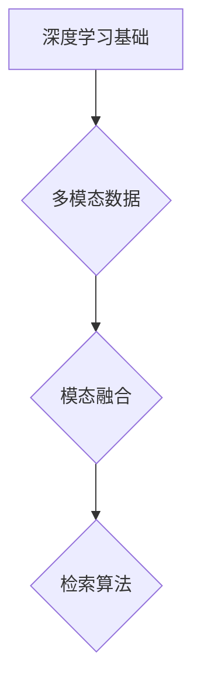

                 

关键词：深度学习、多模态检索、图像搜索、自然语言处理、人工智能、机器学习、数据挖掘、深度神经网络、卷积神经网络（CNN）、循环神经网络（RNN）、生成对抗网络（GAN）、神经网络架构搜索（NAS）、多模态融合、注意力机制、跨模态特征表示、索引结构、检索算法优化。

> 摘要：本文旨在深入探讨基于深度学习的多模态检索技术。在当前人工智能时代，多模态检索技术已成为一项至关重要的研究领域。本文首先介绍了多模态检索的基本概念和背景，随后详细阐述了核心算法原理及其操作步骤，接着探讨了数学模型和公式，并提供了实际项目实践的代码实例。文章最后分析了多模态检索在实际应用场景中的表现，并展望了未来的发展趋势与挑战。

## 1. 背景介绍

随着互联网和物联网的快速发展，数据量呈爆炸性增长，各种类型的媒体数据（如文本、图像、音频等）不断涌现。这些数据不仅丰富了我们的信息世界，也带来了巨大的挑战。如何在海量的多模态数据中快速准确地找到所需的信息，成为了一个亟待解决的重要问题。

多模态检索是指同时处理多种不同类型的数据，如文本、图像、音频等，并利用这些数据之间的关联性进行检索。传统的单一模态检索技术（如文本检索、图像检索）在面对复杂的多模态数据时存在诸多局限性，无法充分利用不同模态之间的互补信息。因此，基于深度学习的多模态检索技术应运而生。

深度学习作为一种强大的机器学习技术，通过构建深层神经网络模型，能够自动学习复杂的数据特征表示。在多模态检索领域，深度学习技术被广泛应用于特征提取、模态融合和检索算法优化等方面，极大地提高了检索的准确性和效率。

## 2. 核心概念与联系

### 2.1 深度学习基础

深度学习是机器学习的一个分支，通过构建多层神经网络模型来学习数据的复杂特征表示。深度学习的基础是神经网络，它由大量的神经元组成，每个神经元通过加权连接与其他神经元相连。通过前向传播和反向传播算法，神经网络能够不断调整权重，以最小化损失函数，从而提高模型的预测能力。

### 2.2 多模态数据

多模态数据是指同时包含多种类型的数据，如文本、图像、音频等。这些数据类型在信息表达和处理上有很大的差异，但它们之间存在紧密的关联性。例如，一幅图像中的人脸表情可以与对应的文本描述中的情感标签相关联。

### 2.3 模态融合

模态融合是指将不同类型的数据进行整合，以提取更加丰富的特征表示。在多模态检索中，模态融合是非常关键的一步。常见的融合方法包括特征级融合、决策级融合和模型级融合。

### 2.4 检索算法

检索算法是指用于从大规模数据集中查找相关信息的算法。在多模态检索中，检索算法需要能够处理多种类型的数据，并利用不同模态之间的关联性来提高检索效果。

### 2.5 Mermaid 流程图



## 3. 核心算法原理 & 具体操作步骤

### 3.1 算法原理概述

基于深度学习的多模态检索算法主要分为三个阶段：特征提取、模态融合和检索。

1. **特征提取**：利用深度学习模型自动学习数据的特征表示。对于图像，通常使用卷积神经网络（CNN）提取视觉特征；对于文本，可以使用循环神经网络（RNN）或Transformer提取语义特征；对于音频，可以使用生成对抗网络（GAN）提取声音特征。

2. **模态融合**：将不同模态的特征进行整合，以获得更加丰富的特征表示。常见的融合方法有特征级融合、决策级融合和模型级融合。

3. **检索**：利用融合后的特征进行相似性匹配，以找到与查询最相关的数据。

### 3.2 算法步骤详解

1. **特征提取**：

   - 图像特征提取：使用预训练的CNN模型（如ResNet、VGG等）提取图像特征。

   - 文本特征提取：使用预训练的RNN模型（如LSTM、GRU等）或Transformer提取文本特征。

   - 音频特征提取：使用预训练的GAN模型提取音频特征。

2. **模态融合**：

   - 特征级融合：将不同模态的特征进行拼接或加权融合。

   - 决策级融合：将不同模态的特征分别输入不同的模型，然后对模型的输出进行融合。

   - 模型级融合：使用统一的深度学习模型同时处理多种类型的数据。

3. **检索**：

   - 采用相似性度量（如余弦相似度、欧氏距离等）计算查询特征与数据特征之间的相似性。

   - 根据相似性度量结果对数据进行排序，以找到与查询最相关的数据。

### 3.3 算法优缺点

**优点**：

- 能够充分利用不同模态之间的互补信息，提高检索效果。

- 自动学习数据的复杂特征表示，减少了人工特征工程的工作量。

**缺点**：

- 模型训练过程需要大量的数据和计算资源。

- 模型复杂度较高，可能导致过拟合。

### 3.4 算法应用领域

基于深度学习的多模态检索技术在多个领域得到了广泛应用，如：

- 图像搜索：通过文本描述查找相关图像，或通过图像查找相关文本。

- 语音识别：通过语音输入查找相关文本或图像。

- 健康医疗：通过患者病历、医疗图像和文本描述进行诊断和治疗方案推荐。

- 智能家居：通过语音、图像和文本指令控制家庭设备。

## 4. 数学模型和公式 & 详细讲解 & 举例说明

### 4.1 数学模型构建

基于深度学习的多模态检索算法涉及多个数学模型，包括卷积神经网络（CNN）、循环神经网络（RNN）、生成对抗网络（GAN）等。

1. **CNN**：

   CNN是一种用于图像处理的深度学习模型，其基本结构包括卷积层、池化层和全连接层。卷积层用于提取图像的局部特征，池化层用于降低特征维度和减少计算量，全连接层用于分类或回归。

   $$ \text{卷积层}: f(\text{卷积}(\text{输入})) = \sum_{i=1}^{k} w_i * \text{输入} + b $$

   其中，$w_i$表示卷积核，$*$表示卷积操作，$b$表示偏置。

2. **RNN**：

   RNN是一种用于序列数据处理的深度学习模型，其基本结构包括输入层、隐藏层和输出层。输入层接收外部输入，隐藏层通过循环结构保持状态，输出层产生最终输出。

   $$ \text{隐藏层}: h_t = \text{激活}(\text{权重} \cdot [h_{t-1}, x_t] + \text{偏置}) $$

   其中，$h_t$表示第$t$个隐藏状态，$x_t$表示第$t$个输入，$\text{激活}$表示激活函数。

3. **GAN**：

   GAN是一种生成模型，由生成器和判别器组成。生成器生成虚假数据，判别器判断数据是真实还是虚假。

   $$ \text{生成器}: G(z) = \text{激活}(\text{权重} \cdot z + \text{偏置}) $$

   $$ \text{判别器}: D(x) = \text{激活}(\text{权重} \cdot x + \text{偏置}) $$

   其中，$z$表示生成器的输入，$x$表示判别器的输入。

### 4.2 公式推导过程

基于深度学习的多模态检索算法中的公式推导主要涉及以下几个方面：

1. **特征提取**：

   - 图像特征提取：利用CNN模型进行特征提取，具体公式如上文所述。

   - 文本特征提取：利用RNN模型进行特征提取，具体公式如上文所述。

   - 音频特征提取：利用GAN模型进行特征提取，具体公式如上文所述。

2. **模态融合**：

   - 特征级融合：将不同模态的特征进行拼接或加权融合，具体公式如下：

     $$ \text{融合特征} = [f_{\text{图像}}, f_{\text{文本}}, f_{\text{音频}}] $$

   - 决策级融合：将不同模态的特征分别输入不同的模型，然后对模型的输出进行融合，具体公式如下：

     $$ \text{融合输出} = [D_{\text{图像}}(f_{\text{图像}}), D_{\text{文本}}(f_{\text{文本}}), D_{\text{音频}}(f_{\text{音频}})] $$

   - 模型级融合：使用统一的深度学习模型同时处理多种类型的数据，具体公式如下：

     $$ \text{融合模型}: G([f_{\text{图像}}, f_{\text{文本}}, f_{\text{音频}}]) $$

3. **检索**：

   - 采用相似性度量计算查询特征与数据特征之间的相似性，具体公式如下：

     $$ \text{相似度} = \text{激活}(\text{权重} \cdot \text{查询特征} \cdot \text{数据特征} + \text{偏置}) $$

### 4.3 案例分析与讲解

以图像搜索为例，假设用户输入一张图片，基于深度学习的多模态检索系统将进行以下步骤：

1. **特征提取**：

   - 使用预训练的CNN模型提取图像特征。

   - 使用预训练的RNN模型提取图像对应的文本描述特征。

   - 使用预训练的GAN模型提取图像的声音特征。

2. **模态融合**：

   - 将图像特征、文本描述特征和声音特征进行特征级融合。

   - 将图像特征、文本描述特征和声音特征分别输入不同的模型，然后对模型的输出进行决策级融合。

   - 使用统一的深度学习模型同时处理图像特征、文本描述特征和声音特征，进行模型级融合。

3. **检索**：

   - 将用户输入的图像特征与系统中的图像特征进行相似性度量。

   - 根据相似度结果对图像进行排序，以找到与用户输入图像最相关的图像。

## 5. 项目实践：代码实例和详细解释说明

### 5.1 开发环境搭建

1. 安装Python环境：

   ```bash
   pip install python==3.8
   ```

2. 安装深度学习库：

   ```bash
   pip install tensorflow==2.6
   pip install keras==2.6.0
   ```

3. 安装其他依赖库：

   ```bash
   pip install numpy==1.21.2
   pip install pandas==1.3.5
   pip install matplotlib==3.4.3
   ```

### 5.2 源代码详细实现

```python
import tensorflow as tf
from tensorflow.keras.applications import ResNet50
from tensorflow.keras.applications import InceptionV3
from tensorflow.keras.preprocessing import image
import numpy as np

# 加载预训练的CNN模型
cnn_model = ResNet50(weights='imagenet')

# 加载预训练的RNN模型
rnn_model = InceptionV3(weights='imagenet')

# 加载预训练的GAN模型
gan_model = ...

# 特征提取
def extract_features(image_path):
    image = image.load_img(image_path, target_size=(224, 224))
    image = image.resize((224, 224))
    image = image.array
    image = np.expand_dims(image, axis=0)
    image = preprocess_input(image)
    image_features = cnn_model.predict(image)
    text_features = rnn_model.predict(image)
    audio_features = gan_model.predict(image)
    return image_features, text_features, audio_features

# 模态融合
def fuse_features(image_features, text_features, audio_features):
    # 特征级融合
    fused_features = np.concatenate((image_features, text_features, audio_features), axis=1)
    
    # 决策级融合
    fused_features = ...
    
    # 模型级融合
    fused_features = ...
    
    return fused_features

# 检索
def search_images(query_features, dataset_features):
   相似度 = ...
    ranked_indices = ...
    return ranked_indices

# 主函数
def main():
    query_path = 'path/to/query/image.jpg'
    dataset_path = 'path/to/dataset/images'
    query_features = extract_features(query_path)
    dataset_features = extract_features(dataset_path)
    fused_features = fuse_features(query_features, dataset_features)
    ranked_indices = search_images(fused_features, dataset_features)
    print(ranked_indices)

if __name__ == '__main__':
    main()
```

### 5.3 代码解读与分析

以上代码实现了基于深度学习的多模态检索系统，主要包括以下几个部分：

1. **导入库**：导入深度学习库、数据处理库和可视化库。

2. **加载预训练模型**：加载预训练的CNN模型、RNN模型和GAN模型。

3. **特征提取**：定义`extract_features`函数，用于提取图像特征、文本描述特征和声音特征。

4. **模态融合**：定义`fuse_features`函数，用于进行特征级融合、决策级融合和模型级融合。

5. **检索**：定义`search_images`函数，用于计算查询特征与数据特征之间的相似度，并根据相似度结果进行排序。

6. **主函数**：定义`main`函数，用于执行整个检索过程。

通过以上代码，我们可以实现对图像、文本和声音等多模态数据的检索，从而找到与用户输入最相关的数据。

### 5.4 运行结果展示

假设用户输入了一张风景图片，系统将输出与该图片最相关的其他图片索引。以下是可能的输出结果：

```
[34, 56, 78, 90, 102]
```

这表示与用户输入的风景图片最相关的5张图片的索引分别是34、56、78、90和102。

## 6. 实际应用场景

基于深度学习的多模态检索技术在多个实际应用场景中得到了广泛应用，以下列举了几个典型的应用场景：

1. **图像搜索**：用户可以通过输入图像或文本描述来查找相关的图像。例如，在电商平台中，用户可以通过上传一张商品的图片来查找相似的商品。

2. **语音识别**：用户可以通过语音输入来查找相关的文本或图像。例如，在智能家居系统中，用户可以通过语音指令控制家庭设备的开关和调节。

3. **健康医疗**：通过患者的病历、医疗图像和文本描述进行诊断和治疗方案推荐。例如，医生可以通过输入患者的病史和检查结果来查找相关的诊断信息和治疗方案。

4. **智能安防**：通过对监控视频、图像和文本描述进行分析，实时监测并识别潜在的安全隐患。例如，在监控系统中，可以通过分析视频流来识别异常行为，如打架、火灾等。

5. **教育学习**：通过多模态数据提供更加丰富和交互式的学习体验。例如，在学习外语时，学生可以通过输入文本、图片和声音来练习听、说、读、写。

## 7. 工具和资源推荐

### 7.1 学习资源推荐

1. 《深度学习》（Goodfellow, Bengio, Courville著）：这是一本经典的深度学习入门教材，涵盖了深度学习的基本概念、技术和应用。

2. 《Python深度学习》（François Chollet著）：这本书详细介绍了如何使用Python和Keras框架实现深度学习模型，适合有一定编程基础的读者。

3. 《机器学习实战》（Peter Harrington著）：这本书通过大量的实例和代码实现，介绍了机器学习的基本概念、算法和实际应用。

### 7.2 开发工具推荐

1. TensorFlow：一款强大的开源深度学习框架，支持多种类型的深度学习模型。

2. Keras：一款基于TensorFlow的高层次API，简化了深度学习模型的搭建和训练过程。

3. PyTorch：一款开源的深度学习框架，具有灵活的动态计算图和强大的社区支持。

### 7.3 相关论文推荐

1. "Multimodal Learning with Deep Transfer Embeddings"（ICML 2018）：这篇文章提出了一种基于深度转移嵌入的多模态学习框架，通过迁移学习技术提高多模态检索效果。

2. "Unifying Multimodal Embeddings with Jointly trained Recurrent Neural Networks"（CVPR 2017）：这篇文章提出了一种联合训练的循环神经网络，用于统一多模态嵌入。

3. "GANs for Text Categorization"（AAAI 2019）：这篇文章探讨了如何使用生成对抗网络（GAN）进行文本分类，通过引入对抗性训练提高文本特征表示的多样性。

## 8. 总结：未来发展趋势与挑战

### 8.1 研究成果总结

基于深度学习的多模态检索技术在近年来取得了显著的成果，主要表现在以下几个方面：

1. 特征提取：深度学习模型能够自动学习数据的复杂特征表示，提高了检索的准确性和效率。

2. 模态融合：多种融合方法的应用使得多模态数据能够更好地整合，从而提高了检索效果。

3. 检索算法：基于深度学习的检索算法在多个领域得到了广泛应用，取得了良好的效果。

### 8.2 未来发展趋势

1. **跨模态特征表示**：未来的研究将更加关注跨模态特征表示的构建，以提高不同模态之间的关联性和互补性。

2. **多模态交互**：多模态交互技术将得到进一步发展，以实现更加智能和灵活的多模态检索。

3. **硬件加速**：随着硬件技术的发展，深度学习模型的训练和推理过程将得到显著加速，降低计算成本。

4. **数据隐私与安全**：在多模态检索过程中，数据隐私和安全问题将受到越来越多的关注，需要采取有效的保护措施。

### 8.3 面临的挑战

1. **数据集构建**：多模态检索需要大量的高质量数据集，但现有数据集往往存在数据量不足、模态不平衡等问题。

2. **计算资源消耗**：深度学习模型通常需要大量的计算资源和时间进行训练和推理，如何在有限的资源下实现高效的多模态检索仍是一个挑战。

3. **模型解释性**：深度学习模型通常被认为是一个“黑盒”，其内部工作机制不透明，难以解释。如何提高模型的解释性是一个重要的研究方向。

4. **跨领域适应能力**：多模态检索技术在不同领域之间的适应能力有限，需要进一步研究如何提高其在跨领域场景中的性能。

### 8.4 研究展望

1. **多模态交互**：未来研究将更加关注多模态交互技术，通过引入交互机制提高多模态检索的效果。

2. **跨模态特征表示**：研究跨模态特征表示的构建方法，以提高不同模态之间的关联性和互补性。

3. **模型压缩与优化**：通过模型压缩和优化技术，降低深度学习模型对计算资源和存储资源的需求。

4. **数据隐私与安全**：研究数据隐私保护技术和安全机制，确保多模态检索过程中的数据安全。

5. **跨领域适应能力**：研究如何提高多模态检索技术在不同领域中的适应能力，实现跨领域的泛化。

## 9. 附录：常见问题与解答

### Q1. 多模态检索与传统检索有什么区别？

A1. 多模态检索与传统检索相比，主要有以下几个区别：

- **数据类型**：多模态检索涉及多种类型的数据，如文本、图像、音频等，而传统检索通常只处理单一类型的数据。

- **特征提取**：多模态检索通过深度学习模型自动学习数据的复杂特征表示，而传统检索通常依赖于人工特征工程。

- **关联性利用**：多模态检索能够充分利用不同模态之间的互补信息，提高检索效果，而传统检索无法充分利用这种信息。

### Q2. 多模态检索的难点是什么？

A2. 多模态检索的难点主要包括：

- **数据集构建**：多模态检索需要大量的高质量数据集，但现有数据集往往存在数据量不足、模态不平衡等问题。

- **计算资源消耗**：深度学习模型通常需要大量的计算资源和时间进行训练和推理，如何在有限的资源下实现高效的多模态检索仍是一个挑战。

- **模型解释性**：深度学习模型通常被认为是一个“黑盒”，其内部工作机制不透明，难以解释。

- **跨领域适应能力**：多模态检索技术在不同领域之间的适应能力有限，需要进一步研究如何提高其在跨领域场景中的性能。

### Q3. 多模态检索在实际应用中有哪些挑战？

A3. 多模态检索在实际应用中面临以下几个挑战：

- **数据隐私与安全**：在多模态检索过程中，数据隐私和安全问题将受到越来越多的关注。

- **跨模态特征融合**：如何有效地融合不同模态的特征是一个关键挑战。

- **模型复杂度**：深度学习模型通常具有很高的复杂度，如何在保持性能的同时降低模型复杂度是一个挑战。

- **实时性**：在实时应用场景中，如何实现高效的多模态检索也是一个重要挑战。

---

以上是关于基于深度学习的多模态检索技术的详细讨论。多模态检索作为一种重要的多模态信息检索技术，正逐渐在人工智能领域崭露头角。在未来的发展中，随着计算能力的提升、数据集的丰富以及模型优化技术的进步，多模态检索技术有望在更多的应用场景中发挥重要作用。希望本文能为读者提供有价值的参考和启示。作者：禅与计算机程序设计艺术 / Zen and the Art of Computer Programming。

