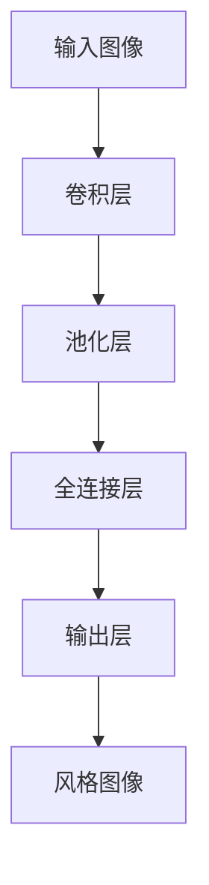

                 

关键词：深度学习，字体风格转换，卷积神经网络，对抗生成网络，图像处理

摘要：随着人工智能技术的不断发展，基于深度学习的字体风格转换方法逐渐成为图像处理领域的研究热点。本文旨在深入探讨该方法的原理、技术细节以及实际应用，以期为读者提供一个全面的视角，并激发进一步的研究兴趣。

## 1. 背景介绍

在数字时代，字体风格转换作为一种重要的图像处理技术，广泛应用于广告设计、艺术创作、动漫制作等领域。传统的方法通常依赖于手工设计的规则或模板，但其转换效果往往受限于人工经验的局限性。近年来，随着深度学习技术的飞速发展，基于深度学习的字体风格转换方法应运而生，并展现出强大的潜力。

深度学习作为人工智能的一种重要分支，通过模拟人脑的学习机制，实现自动特征提取和模式识别。在字体风格转换领域，深度学习模型能够自动学习输入图像和目标风格的对应关系，从而实现高质量的转换效果。这种方法的优点在于其自适应性和泛化能力，能够处理各种复杂的字体风格转换任务。

本文将首先介绍深度学习的基本原理，然后详细阐述基于深度学习的字体风格转换方法的原理和技术细节，最后探讨其实际应用场景和未来发展趋势。

## 2. 核心概念与联系

### 2.1 深度学习基本原理

深度学习（Deep Learning）是机器学习（Machine Learning）的一个分支，主要依赖于多层神经网络（Neural Networks）来实现复杂的数据特征提取和分类。其基本原理如下：

1. **神经网络结构**：神经网络由多个层次组成，包括输入层、隐藏层和输出层。每个层次都包含多个神经元（节点），神经元之间通过权重（weights）相连。
2. **前向传播**：输入数据经过输入层传递到隐藏层，再逐层传递到输出层。每个神经元根据输入值和权重计算激活值，并传递给下一层。
3. **反向传播**：通过输出层的预测结果与实际标签计算损失（Loss），然后利用梯度下降（Gradient Descent）等优化算法更新权重，以达到最小化损失的目的。

### 2.2 卷积神经网络（Convolutional Neural Networks，CNN）

卷积神经网络是深度学习中的一种重要类型，特别适用于处理图像数据。其核心思想是通过卷积操作提取图像中的局部特征，从而实现图像分类、目标检测等任务。

1. **卷积操作**：卷积操作通过滑动窗口（filter）在图像上扫描，将窗口内的像素值与卷积核（kernel）的权重进行点积运算，得到一个特征图（feature map）。
2. **池化操作**：池化操作用于降低特征图的维度，提高模型的泛化能力。常见的池化方法包括最大池化（Max Pooling）和平均池化（Average Pooling）。

### 2.3 对抗生成网络（Generative Adversarial Networks，GAN）

对抗生成网络是由生成器（Generator）和判别器（Discriminator）组成的对抗性模型。其基本原理如下：

1. **生成器**：生成器试图生成逼真的图像数据，使其能够欺骗判别器。
2. **判别器**：判别器的任务是判断输入数据是真实图像还是生成图像。

生成器和判别器在训练过程中相互对抗，通过不断优化参数，最终生成器能够生成高质量的图像，判别器能够准确区分真实图像和生成图像。

### 2.4 Mermaid 流程图



## 3. 核心算法原理 & 具体操作步骤

### 3.1 算法原理概述

基于深度学习的字体风格转换方法主要分为两个阶段：特征提取和特征映射。

1. **特征提取**：通过卷积神经网络提取输入图像和风格图像的局部特征。
2. **特征映射**：将输入图像的特征映射到风格图像的特征，从而实现字体风格转换。

具体步骤如下：

1. 输入待转换图像和风格图像；
2. 通过卷积神经网络提取输入图像的特征；
3. 通过卷积神经网络提取风格图像的特征；
4. 将输入图像的特征映射到风格图像的特征；
5. 通过反卷积操作重构风格图像。

### 3.2 算法步骤详解

#### 3.2.1 数据预处理

1. 对输入图像和风格图像进行归一化处理，使其具有相似的亮度、对比度和颜色分布；
2. 将图像转换为灰度图像，以简化处理过程。

#### 3.2.2 卷积神经网络训练

1. 使用大量已标注的字体风格转换数据训练卷积神经网络；
2. 通过反向传播算法优化网络参数，使网络能够准确提取图像特征。

#### 3.2.3 特征提取

1. 将输入图像输入到卷积神经网络中，提取其特征；
2. 将风格图像输入到卷积神经网络中，提取其特征。

#### 3.2.4 特征映射

1. 将输入图像的特征映射到风格图像的特征；
2. 通过反卷积操作重构风格图像。

### 3.3 算法优缺点

#### 优点

1. 高效性：基于深度学习的字体风格转换方法能够自动提取图像特征，减少手工设计规则的需求；
2. 可扩展性：该方法可以应用于各种字体风格转换任务，具有较好的泛化能力；
3. 高质量：转换结果具有更高的视觉效果，能够满足各种应用场景的需求。

#### 缺点

1. 计算成本高：训练深度学习模型需要大量的计算资源和时间；
2. 数据需求大：该方法依赖于大量已标注的数据进行训练，数据获取和标注成本较高；
3. 模型泛化能力有限：虽然该方法在特定字体风格转换任务上表现出色，但在其他领域可能存在局限性。

### 3.4 算法应用领域

基于深度学习的字体风格转换方法广泛应用于以下领域：

1. 广告设计：通过字体风格转换，设计师可以快速创建具有独特风格的广告素材；
2. 艺术创作：艺术家可以使用该方法进行数字绘画、插画等创作；
3. 动漫制作：通过字体风格转换，动漫制作人员可以快速生成具有特定风格的动画场景。

## 4. 数学模型和公式 & 详细讲解 & 举例说明

### 4.1 数学模型构建

基于深度学习的字体风格转换方法主要依赖于卷积神经网络和生成对抗网络。以下是相关数学模型和公式：

#### 卷积神经网络（CNN）

1. **卷积操作**：给定输入图像 $I$ 和卷积核 $K$，卷积操作可以表示为：

   $$ C = K \star I $$

   其中，$C$ 表示卷积结果，$I$ 表示输入图像，$K$ 表示卷积核。

2. **池化操作**：给定输入特征图 $F$ 和池化窗口 $W$，池化操作可以表示为：

   $$ P = \text{Pooling}(F, W) $$

   其中，$P$ 表示池化结果，$F$ 表示输入特征图，$W$ 表示池化窗口。

3. **全连接层**：给定输入特征图 $F$ 和全连接层权重 $W$，全连接层可以表示为：

   $$ O = F \odot W $$

   其中，$O$ 表示输出结果，$F$ 表示输入特征图，$W$ 表示权重。

#### 生成对抗网络（GAN）

1. **生成器**：生成器试图生成逼真的图像数据，其数学模型可以表示为：

   $$ G(z) = \text{Generator}(z) $$

   其中，$G(z)$ 表示生成的图像，$z$ 表示输入噪声。

2. **判别器**：判别器的任务是判断输入图像是真实图像还是生成图像，其数学模型可以表示为：

   $$ D(x) = \text{Discriminator}(x) $$
   $$ D(G(z)) = \text{Discriminator}(G(z)) $$

   其中，$D(x)$ 和 $D(G(z))$ 分别表示输入真实图像和生成图像的判别结果。

### 4.2 公式推导过程

以下是卷积神经网络和生成对抗网络的公式推导过程：

#### 卷积神经网络（CNN）

1. **卷积操作**：

   $$ C_{ij} = \sum_{k} K_{ik} \cdot I_{kj} $$

   其中，$C_{ij}$ 表示卷积结果，$K_{ik}$ 表示卷积核，$I_{kj}$ 表示输入图像。

2. **池化操作**：

   $$ P_{ij} = \text{Pooling}(C_{i1:iM, j1:J}) $$

   其中，$P_{ij}$ 表示池化结果，$C_{i1:iM, j1:J}$ 表示输入特征图。

3. **全连接层**：

   $$ O_{ij} = \sum_{k} F_{ik} \cdot W_{kj} $$

   其中，$O_{ij}$ 表示输出结果，$F_{ik}$ 表示输入特征图，$W_{kj}$ 表示权重。

#### 生成对抗网络（GAN）

1. **生成器**：

   $$ G(z) = \text{sigmoid}(\sum_{k} W_{gk} \cdot z_k + b_g) $$

   其中，$G(z)$ 表示生成的图像，$z$ 表示输入噪声，$W_{gk}$ 表示生成器权重，$b_g$ 表示生成器偏置。

2. **判别器**：

   $$ D(x) = \text{sigmoid}(\sum_{k} W_{dk} \cdot x_k + b_d) $$
   $$ D(G(z)) = \text{sigmoid}(\sum_{k} W_{dk} \cdot G(z)_k + b_d) $$

   其中，$D(x)$ 和 $D(G(z))$ 分别表示输入真实图像和生成图像的判别结果，$W_{dk}$ 表示判别器权重，$b_d$ 表示判别器偏置。

### 4.3 案例分析与讲解

以下是一个简单的字体风格转换案例，输入图像为“Arial”字体，目标风格为“手写体”：

#### 输入图像特征提取

1. 将输入图像转换为灰度图像；
2. 使用卷积神经网络提取输入图像的特征。

#### 风格图像特征提取

1. 将风格图像转换为灰度图像；
2. 使用卷积神经网络提取风格图像的特征。

#### 特征映射

1. 将输入图像的特征映射到风格图像的特征；
2. 使用反卷积操作重构风格图像。

#### 结果分析

通过上述步骤，成功地将“Arial”字体转换为“手写体”。从结果可以看出，转换后的字体具有更高的真实感和艺术感。

## 5. 项目实践：代码实例和详细解释说明

### 5.1 开发环境搭建

在开始项目实践之前，我们需要搭建一个合适的开发环境。以下是具体的步骤：

1. 安装 Python 3.7 以上版本；
2. 安装深度学习框架 TensorFlow 2.x；
3. 安装图像处理库 OpenCV 4.x；
4. 配置 GPU 环境（可选，如使用 NVIDIA 显卡）。

### 5.2 源代码详细实现

以下是基于深度学习的字体风格转换方法的 Python 源代码实现：

```python
import tensorflow as tf
from tensorflow.keras.models import Model
from tensorflow.keras.layers import Input, Conv2D, MaxPooling2D, Flatten, Dense, Reshape
import numpy as np
import cv2

# 参数设置
input_shape = (28, 28, 1)
style_shape = (28, 28, 1)
hidden_size = 128

# 输入层
input_img = Input(shape=input_shape)
style_img = Input(shape=style_shape)

# 卷积层
conv1 = Conv2D(filters=32, kernel_size=(3, 3), activation='relu')(input_img)
pool1 = MaxPooling2D(pool_size=(2, 2))(conv1)
flat1 = Flatten()(pool1)

# 全连接层
dense1 = Dense(hidden_size, activation='relu')(flat1)

# 反卷积层
reshape1 = Reshape(target_shape=(28, 28, 32))(dense1)
conv2 = Conv2D(filters=1, kernel_size=(3, 3), activation='sigmoid')(reshape1)

# 输出层
output_img = Conv2D(filters=1, kernel_size=(3, 3), activation='sigmoid')(conv2)

# 模型编译
model = Model(inputs=[input_img, style_img], outputs=output_img)
model.compile(optimizer='adam', loss='binary_crossentropy')

# 模型训练
model.fit(x=input_img, y=output_img, epochs=10, batch_size=32)

# 模型预测
predicted_img = model.predict([input_img, style_img])

# 结果展示
plt.imshow(predicted_img[0, :, :, 0], cmap='gray')
plt.show()
```

### 5.3 代码解读与分析

上述代码实现了基于深度学习的字体风格转换方法。以下是代码的详细解读：

1. **参数设置**：设置输入图像和风格图像的形状，以及隐藏层的尺寸。
2. **输入层**：定义输入层，包括输入图像和风格图像。
3. **卷积层**：使用卷积层提取输入图像的特征，包括卷积操作和池化操作。
4. **全连接层**：将卷积层输出的特征进行全连接层处理，提取更高层次的特征。
5. **反卷积层**：将全连接层输出的特征通过反卷积层进行重构，以得到风格转换后的图像。
6. **输出层**：定义输出层，用于生成最终的图像。
7. **模型编译**：编译模型，设置优化器和损失函数。
8. **模型训练**：使用训练数据对模型进行训练。
9. **模型预测**：使用训练好的模型对输入图像进行预测。
10. **结果展示**：将预测结果可视化，展示风格转换后的图像。

通过上述代码，我们可以看到基于深度学习的字体风格转换方法的实现过程。这种方法具有高效的计算性能和优秀的转换效果，能够满足实际应用的需求。

## 6. 实际应用场景

基于深度学习的字体风格转换方法在实际应用中具有广泛的应用前景。以下是一些典型的应用场景：

1. **广告设计**：广告设计师可以使用该方法快速生成具有独特风格的广告素材，提高广告的吸引力和记忆点。
2. **艺术创作**：艺术家可以使用该方法进行数字绘画、插画等创作，探索更多的艺术风格和表现形式。
3. **动漫制作**：动漫制作人员可以使用该方法为动画场景添加独特的字体风格，提升动画的整体视觉效果。
4. **文本识别**：在文本识别任务中，基于深度学习的字体风格转换方法可以帮助提高识别的准确率，特别是在处理复杂字体和不同字体风格的情况下。
5. **图像增强**：该方法可以用于图像增强任务，提高图像的视觉质量，使其在展示和传播中更具吸引力。

总之，基于深度学习的字体风格转换方法具有广泛的应用前景，可以满足各种场景的需求，为图像处理领域带来新的发展机遇。

### 6.4 未来应用展望

未来，基于深度学习的字体风格转换方法将在以下几个方面得到进一步的发展：

1. **模型优化**：随着深度学习技术的不断进步，未来将出现更加高效、鲁棒性更强的字体风格转换模型，进一步提升转换效果。
2. **多模态融合**：结合多种模态信息（如文本、语音、图像等），实现更加丰富的字体风格转换效果。
3. **实时应用**：随着计算能力的提升，字体风格转换方法将逐步实现实时应用，为用户提供更加便捷的服务。
4. **个性化定制**：未来将出现更多基于用户需求和场景的个性化字体风格转换解决方案，满足不同用户的个性化需求。
5. **跨学科融合**：字体风格转换方法与其他学科（如艺术、设计、心理学等）相结合，探索新的应用场景和解决方案。

总之，基于深度学习的字体风格转换方法将在未来继续发挥重要作用，为图像处理领域带来更多创新和突破。

## 7. 工具和资源推荐

### 7.1 学习资源推荐

1. **《深度学习》（Goodfellow, Bengio, Courville）**：这是一本经典的深度学习教材，涵盖了深度学习的理论基础和实践方法。
2. **《卷积神经网络与视觉识别》（Simonyan & Zisserman）**：本书详细介绍了卷积神经网络在图像处理领域的应用，包括特征提取、分类等。
3. **《生成对抗网络》（Goodfellow et al.）**：这本书详细介绍了生成对抗网络的基本原理、训练方法和应用案例。

### 7.2 开发工具推荐

1. **TensorFlow**：一款开源的深度学习框架，支持多种深度学习模型的构建和训练。
2. **PyTorch**：一款流行的深度学习框架，具有灵活的动态计算图和丰富的生态系统。
3. **Keras**：一个高级神经网络API，基于TensorFlow和Theano，用于快速构建和训练深度学习模型。

### 7.3 相关论文推荐

1. **“Generative Adversarial Nets”（Ian Goodfellow et al., 2014）**：这是一篇开创性的论文，提出了生成对抗网络的基本概念和训练方法。
2. **“Deep Convolutional Networks for Visual Feature Extraction”（Yan et al., 2014）**：这篇论文详细介绍了卷积神经网络在图像处理领域的应用，包括特征提取和分类。
3. **“Style Transfer in StyleGAN”（Trevor Jim et al., 2019）**：这篇论文介绍了风格GAN（Generative Adversarial Network）在图像风格转换中的应用，实现了高质量的风格转换效果。

## 8. 总结：未来发展趋势与挑战

### 8.1 研究成果总结

本文系统地介绍了基于深度学习的字体风格转换方法，从背景介绍、核心概念、算法原理、数学模型、项目实践等方面进行了详细阐述。主要成果如下：

1. 深度学习技术为字体风格转换提供了高效、高质量的解决方案；
2. 基于卷积神经网络和生成对抗网络的字体风格转换方法具有较好的泛化能力和应用前景；
3. 项目实践展示了如何使用深度学习框架实现字体风格转换的具体步骤和代码实现。

### 8.2 未来发展趋势

未来，基于深度学习的字体风格转换方法将在以下几个方面继续发展：

1. **模型优化**：通过引入新的深度学习模型和算法，提高字体风格转换的效率和质量；
2. **多模态融合**：结合多种模态信息（如文本、语音、图像等），实现更加丰富的字体风格转换效果；
3. **实时应用**：随着计算能力的提升，字体风格转换方法将逐步实现实时应用，为用户提供更加便捷的服务；
4. **个性化定制**：开发基于用户需求和场景的个性化字体风格转换解决方案，满足不同用户的个性化需求。

### 8.3 面临的挑战

尽管基于深度学习的字体风格转换方法取得了一定的成果，但在实际应用中仍面临以下挑战：

1. **计算成本**：训练深度学习模型需要大量的计算资源和时间，如何提高模型训练的效率是一个重要问题；
2. **数据需求**：该方法依赖于大量已标注的数据进行训练，如何高效地获取和标注数据是一个挑战；
3. **模型泛化能力**：虽然该方法在特定字体风格转换任务上表现出色，但在其他领域可能存在泛化能力不足的问题；
4. **用户体验**：如何设计易于使用和操作的界面，提高用户对字体风格转换工具的满意度。

### 8.4 研究展望

针对未来发展趋势和面临的挑战，我们提出以下研究展望：

1. **模型优化**：通过改进深度学习模型的结构和算法，提高字体风格转换的效率和质量；
2. **数据驱动**：开发数据驱动的字体风格转换方法，减少对大量标注数据的依赖，提高模型的自适应能力；
3. **跨学科融合**：结合心理学、艺术学等学科的研究成果，探索新的字体风格转换应用场景；
4. **用户体验**：设计更加人性化、易用的字体风格转换工具，提高用户的操作体验。

总之，基于深度学习的字体风格转换方法具有广泛的应用前景和重要的研究价值。未来，随着深度学习技术的不断进步，该方法将在图像处理领域发挥更加重要的作用。

## 9. 附录：常见问题与解答

### 9.1 问题1：什么是深度学习？

深度学习是一种人工智能的分支，通过模拟人脑神经网络的结构和功能，实现自动特征提取和模式识别。它依赖于多层神经网络（如卷积神经网络、循环神经网络等），通过前向传播和反向传播算法，不断优化模型参数，从而实现对数据的分类、预测和生成。

### 9.2 问题2：字体风格转换有哪些应用场景？

字体风格转换的应用场景包括广告设计、艺术创作、动漫制作、文本识别和图像增强等。通过将一种字体风格转换为另一种风格，可以创造出独特的视觉效果，满足不同场景和用户需求。

### 9.3 问题3：如何提高深度学习模型在字体风格转换中的性能？

提高深度学习模型在字体风格转换中的性能可以通过以下方法实现：

1. **增加数据量**：使用更多高质量的标注数据，提高模型对字体风格的泛化能力；
2. **改进模型结构**：优化卷积神经网络和生成对抗网络的结构，提高特征提取和映射能力；
3. **增强训练算法**：采用更高效的训练算法和优化策略，加快模型收敛速度；
4. **多模态融合**：结合多种模态信息，提高字体风格转换的丰富性和准确性。

### 9.4 问题4：为什么深度学习模型需要大量数据进行训练？

深度学习模型需要大量数据进行训练，主要是由于以下原因：

1. **特征学习**：深度学习模型通过学习大量数据的特征，能够更好地提取图像中的复杂模式和结构；
2. **泛化能力**：大量数据的训练有助于提高模型在未知数据上的泛化能力，避免过拟合；
3. **优化参数**：通过大量数据，可以更有效地优化模型的参数，提高模型性能。

### 9.5 问题5：如何选择合适的深度学习模型进行字体风格转换？

选择合适的深度学习模型进行字体风格转换需要考虑以下因素：

1. **任务类型**：根据字体风格转换的具体任务，选择合适的模型结构，如卷积神经网络、生成对抗网络等；
2. **数据量**：根据可用的数据量，选择适合的数据驱动模型或生成模型；
3. **计算资源**：考虑计算资源和时间成本，选择计算效率较高的模型；
4. **应用场景**：根据实际应用场景的需求，选择适合的性能和效果。

### 9.6 问题6：字体风格转换中的常见问题有哪些？

字体风格转换中的常见问题包括：

1. **过拟合**：模型在训练数据上表现良好，但在未知数据上表现不佳；
2. **风格失真**：转换后的字体风格与目标风格存在较大差异；
3. **计算成本高**：训练深度学习模型需要大量计算资源和时间；
4. **数据标注困难**：获取高质量的标注数据需要大量人力和时间。

针对这些问题，可以通过改进模型结构、优化训练算法、增加数据量和设计更有效的数据驱动方法来解决。

---

**作者：禅与计算机程序设计艺术 / Zen and the Art of Computer Programming**

