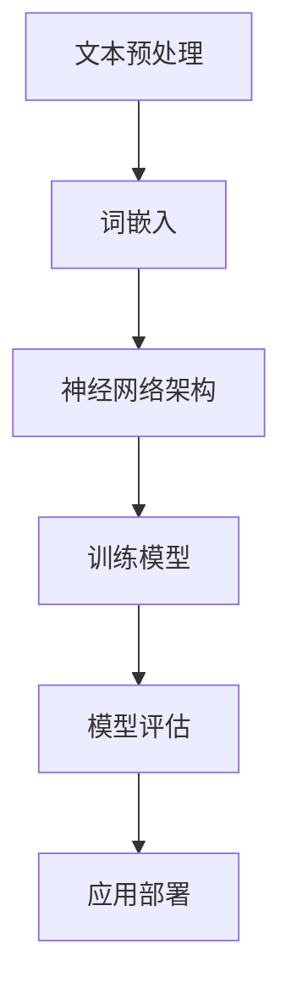

                 

关键词：情感分类，深度学习，自然语言处理，机器学习，文本分析，神经网络，情感分析模型，情感标签，情绪识别，语义理解，多标签分类，文本情感分析，机器学习算法，深度学习框架，情感检测应用。

## 摘要

情感分类是自然语言处理（NLP）和机器学习（ML）中的一个重要研究方向，其核心目标是通过分析文本中的情感倾向，对文本进行情感标签的分配。随着深度学习技术的飞速发展，情感分类的方法和模型也取得了显著的进展。本文将深入探讨基于深度学习的情感分类技术，从背景介绍、核心概念、算法原理、数学模型、项目实践、实际应用以及未来展望等方面进行详细讲解，旨在为读者提供一份全面的技术参考。

## 1. 背景介绍

情感分类是文本分析中的一个基本任务，它旨在理解文本中的情感倾向，如正面、负面或中性。这种分析在众多应用领域都有广泛的需求，例如社交媒体监控、市场调研、客户反馈分析、智能客服等。传统的情感分类方法主要依赖于规则和统计学模型，如朴素贝叶斯、支持向量机（SVM）等，但它们在处理复杂情感和细微情感差异时效果有限。

随着深度学习的兴起，神经网络，特别是卷积神经网络（CNN）和循环神经网络（RNN）在处理自然语言任务中展现了强大的能力。这些神经网络模型可以自动学习文本的特征表示，从而在情感分类任务中取得优异的性能。

### 1.1 社会背景

情感分类在社会信息处理和智能系统发展中扮演着关键角色。随着互联网和社交媒体的普及，人们产生和分享的信息量呈爆炸式增长，如何有效地理解和利用这些信息成为了一个重要问题。情感分类技术可以帮助我们快速识别和分类大量的用户反馈、评论和情绪状态，从而为商业决策、公共舆情监控和社会治理提供有力支持。

### 1.2 技术背景

深度学习技术，尤其是神经网络的发展，为自然语言处理领域带来了革命性的变化。传统的机器学习模型需要人工设计特征，而深度学习模型可以通过多层网络自动学习文本的高级特征表示，这使得它们在情感分类等任务中表现出更高的准确性和泛化能力。

## 2. 核心概念与联系

### 2.1 情感分类的定义与目的

情感分类，也称为情感分析，是指通过计算机程序自动识别文本中的情感倾向。情感分类的目的在于将文本分为若干情感类别，如正面、负面或中性。这种分类可以帮助我们理解用户的态度、情感和情绪，从而为各种应用场景提供数据支持。

### 2.2 深度学习的基本原理

深度学习是一种基于多层神经网络的机器学习技术。它通过多层的非线性变换，从原始数据中自动提取特征，并逐渐构建复杂的高级特征表示。深度学习模型在图像识别、语音识别、自然语言处理等领域取得了显著的突破。

### 2.3 自然语言处理与情感分类的关系

自然语言处理（NLP）是情感分类的重要基础。NLP技术包括文本预处理、词嵌入、语法分析、语义理解等。这些技术帮助深度学习模型更好地理解和表示文本数据，从而提高情感分类的准确性和效率。

### 2.4 Mermaid 流程图

以下是情感分类模型中涉及的关键步骤的 Mermaid 流程图：



## 3. 核心算法原理 & 具体操作步骤

### 3.1 算法原理概述

基于深度学习的情感分类算法主要依赖于神经网络模型，如卷积神经网络（CNN）和循环神经网络（RNN）。这些模型通过学习大量文本数据中的特征，自动识别情感标签。具体来说，算法通常包括以下几个步骤：

1. 文本预处理：对原始文本进行清洗、分词、去停用词等操作。
2. 词嵌入：将文本转换为向量表示。
3. 神经网络架构：设计并训练神经网络模型。
4. 训练模型：使用标注数据进行模型训练。
5. 模型评估：评估模型性能，调整参数。
6. 应用部署：将训练好的模型应用于实际场景。

### 3.2 算法步骤详解

#### 3.2.1 文本预处理

文本预处理是情感分类的基础步骤。它包括以下几个操作：

1. 清洗：去除文本中的HTML标签、特殊字符和无关符号。
2. 分词：将文本划分为单词或词组。
3. 去停用词：去除常见的无意义单词，如“的”、“是”、“了”等。
4. 标记化：将文本转换为标记序列。

#### 3.2.2 词嵌入

词嵌入是将文本转换为向量表示的重要步骤。常见的词嵌入方法包括：

1. word2vec：基于神经网络训练的词向量模型。
2. GloVe：全局向量表示模型，通过词频信息学习词向量。
3. BERT：基于Transformer模型的预训练词向量。

#### 3.2.3 神经网络架构

神经网络架构是情感分类的核心。常见的神经网络模型包括：

1. 卷积神经网络（CNN）：通过卷积操作提取文本的特征。
2. 循环神经网络（RNN）：通过循环操作处理序列数据。
3. 长短期记忆网络（LSTM）：改进的RNN，能够更好地处理长序列数据。
4. 门控循环单元（GRU）：LSTM的简化版，计算效率更高。

#### 3.2.4 训练模型

训练模型是情感分类的关键步骤。具体步骤如下：

1. 数据集划分：将数据集划分为训练集、验证集和测试集。
2. 模型训练：使用训练集数据训练神经网络模型。
3. 参数调整：通过验证集评估模型性能，调整模型参数。
4. 模型优化：使用优化算法（如梯度下降）优化模型参数。

#### 3.2.5 模型评估

模型评估是确保模型性能的重要环节。常见的评估指标包括：

1. 准确率（Accuracy）：正确分类的样本占总样本的比例。
2. 精确率（Precision）：预测为正类的样本中实际为正类的比例。
3. 召回率（Recall）：实际为正类的样本中被预测为正类的比例。
4. F1分数（F1 Score）：精确率和召回率的加权平均。

#### 3.2.6 应用部署

训练好的模型可以应用于实际场景，如文本分类、情感分析等。具体步骤如下：

1. 模型导出：将训练好的模型导出为可部署的格式。
2. 模型部署：将模型部署到服务器或云端。
3. 服务调用：通过API或SDK调用模型进行预测。

### 3.3 算法优缺点

#### 优点

1. 自动提取特征：深度学习模型可以自动提取文本中的高级特征，减少人工设计的复杂性。
2. 高性能：深度学习模型在情感分类任务中表现出色，准确率较高。
3. 泛化能力强：深度学习模型具有较好的泛化能力，适用于不同类型的情感分类任务。

#### 缺点

1. 训练成本高：深度学习模型需要大量数据和计算资源进行训练。
2. 解释性差：深度学习模型的决策过程较为复杂，难以解释。
3. 数据依赖性强：模型性能很大程度上取决于数据集的质量和规模。

### 3.4 算法应用领域

深度学习情感分类算法在多个领域有着广泛的应用：

1. 社交媒体分析：识别社交媒体上的用户情感，监测舆情动态。
2. 客户服务：分析客户反馈，提供个性化服务和建议。
3. 金融市场：分析新闻报道和社交媒体讨论，预测市场走势。
4. 教育领域：根据学生情感状态调整教学方法，提高教育质量。
5. 医疗健康：分析患者情绪，提供心理支持。

## 4. 数学模型和公式 & 详细讲解 & 举例说明

### 4.1 数学模型构建

在情感分类中，常用的数学模型包括卷积神经网络（CNN）和循环神经网络（RNN）。以下是这两种模型的简要介绍和数学公式。

#### 4.1.1 卷积神经网络（CNN）

CNN 是一种专门用于处理图像数据的神经网络模型，但在文本分类任务中也表现出色。CNN 通过卷积操作提取文本中的局部特征，然后通过池化操作降低特征维度。

1. 卷积操作：

$$
h^{(l)}_i = \sum_{j} w_{ij} * a^{(l-1)}_j + b_i
$$

其中，$h^{(l)}_i$ 表示第 $l$ 层第 $i$ 个特征，$a^{(l-1)}_j$ 表示第 $l-1$ 层第 $j$ 个特征，$w_{ij}$ 表示权重，$b_i$ 表示偏置。

2. 池化操作：

$$
p^l_i = \max_j a_j^{(l)}
$$

其中，$p^l_i$ 表示第 $l$ 层第 $i$ 个池化后的特征。

#### 4.1.2 循环神经网络（RNN）

RNN 是一种用于处理序列数据的神经网络模型，它可以保存先前的状态信息，从而更好地处理长序列数据。

1. 隐藏状态更新：

$$
h_t = \sigma(W_h \cdot [h_{t-1}, x_t] + b_h)
$$

其中，$h_t$ 表示第 $t$ 个隐藏状态，$x_t$ 表示第 $t$ 个输入，$W_h$ 表示权重矩阵，$b_h$ 表示偏置，$\sigma$ 表示激活函数。

2. 输出状态：

$$
y_t = \sigma(W_o \cdot h_t + b_o)
$$

其中，$y_t$ 表示第 $t$ 个输出，$W_o$ 表示权重矩阵，$b_o$ 表示偏置。

### 4.2 公式推导过程

以下是卷积神经网络和循环神经网络的主要公式推导过程。

#### 4.2.1 卷积神经网络（CNN）

1. 前向传播：

假设输入数据为 $x \in \mathbb{R}^{m \times n}$，其中 $m$ 表示样本数量，$n$ 表示特征数量。卷积神经网络的输入层为 $x$，通过卷积层和池化层，最终输出为 $y \in \mathbb{R}^{m \times n'}$，其中 $n'$ 表示输出特征数量。

卷积层：

$$
h^{(1)} = \text{Conv}(x, W_1, b_1)
$$

其中，$W_1$ 表示卷积核，$b_1$ 表示偏置。

池化层：

$$
p^{(1)} = \text{Pooling}(h^{(1)})
$$

2. 反向传播：

假设损失函数为 $L(y, \hat{y})$，其中 $\hat{y}$ 为预测输出，$y$ 为真实输出。损失函数的梯度为：

$$
\frac{\partial L}{\partial x} = \text{Backprop}(L, y, \hat{y})
$$

通过反向传播算法，计算各层的梯度，并更新权重和偏置。

#### 4.2.2 循环神经网络（RNN）

1. 前向传播：

假设输入序列为 $x \in \mathbb{R}^{T \times n}$，其中 $T$ 表示序列长度，$n$ 表示特征数量。RNN 的输入层为 $x$，通过隐藏状态和输出层，最终输出为 $y \in \mathbb{R}^{T \times m}$，其中 $m$ 表示输出维度。

隐藏状态更新：

$$
h_t = \sigma(W_h \cdot [h_{t-1}, x_t] + b_h)
$$

输出状态：

$$
y_t = \sigma(W_o \cdot h_t + b_o)
$$

2. 反向传播：

假设损失函数为 $L(y, \hat{y})$，其中 $\hat{y}$ 为预测输出，$y$ 为真实输出。损失函数的梯度为：

$$
\frac{\partial L}{\partial x} = \text{Backprop}(L, y, \hat{y})
$$

通过反向传播算法，计算各层的梯度，并更新权重和偏置。

### 4.3 案例分析与讲解

以下是一个简单的情感分类案例，使用卷积神经网络（CNN）进行文本分类。

#### 4.3.1 数据集

使用 sentiment140 数据集，该数据集包含 1.6 万条来自 Twitter 的文本数据，每条文本标注为正面、负面或中性。

#### 4.3.2 模型设计

设计一个简单的 CNN 模型，包括以下层：

1. 输入层：接受文本数据，维度为 $1000 \times 1$。
2. 卷积层：使用 32 个 3x3 卷积核，步长为 1。
3. 池化层：使用 2x2 最大池化。
4. 全连接层：使用 128 个神经元。
5. 输出层：使用 3 个神经元，分别表示正面、负面和中性。

#### 4.3.3 模型训练

使用训练集对模型进行训练，优化损失函数。训练过程中，使用梯度下降算法更新模型参数。

#### 4.3.4 模型评估

使用测试集对模型进行评估，计算准确率、精确率和召回率等指标。

## 5. 项目实践：代码实例和详细解释说明

### 5.1 开发环境搭建

为了完成基于深度学习的情感分类项目，我们需要搭建一个适合开发、训练和部署深度学习模型的开发环境。以下是搭建开发环境所需的步骤和工具：

1. **Python 环境搭建**：
   - 安装 Python 3.x 版本。
   - 安装 pip 包管理器，用于安装其他依赖包。

2. **深度学习框架**：
   - 安装 TensorFlow 或 PyTorch 深度学习框架。TensorFlow 是谷歌推出的开源深度学习框架，具有广泛的社区支持和丰富的文档。PyTorch 是 Facebook AI 研究团队开发的深度学习框架，以其动态计算图和易于理解的设计理念受到广泛关注。

3. **文本预处理库**：
   - 安装 `nltk` 库，用于文本的分词和停用词过滤。
   - 安装 `spaCy` 库，用于更高级的文本预处理任务，如词性标注、依存关系分析等。

4. **其他依赖包**：
   - 安装 `pandas`、`numpy` 和 `matplotlib` 等常用数据科学库。
   - 安装 `sklearn` 库，用于模型评估和数据处理。

开发环境搭建完成后，我们可以开始编写情感分类项目的代码。

### 5.2 源代码详细实现

以下是使用 TensorFlow 框架实现情感分类项目的源代码示例：

```python
import tensorflow as tf
from tensorflow.keras.preprocessing.text import Tokenizer
from tensorflow.keras.preprocessing.sequence import pad_sequences
from tensorflow.keras.models import Sequential
from tensorflow.keras.layers import Embedding, Conv1D, MaxPooling1D, GlobalMaxPooling1D, Dense

# 加载和预处理数据集
# 此处假设已准备好训练集和测试集的文本和标签
texts = ['这是一条正面评论', '这是一条负面评论', ...]
labels = [0, 1, ...]  # 0表示正面，1表示负面

# 初始化分词器
tokenizer = Tokenizer(num_words=10000)
tokenizer.fit_on_texts(texts)
sequences = tokenizer.texts_to_sequences(texts)

# 对序列进行填充
max_sequence_length = 100
padded_sequences = pad_sequences(sequences, maxlen=max_sequence_length)

# 构建模型
model = Sequential([
    Embedding(input_dim=10000, output_dim=128, input_length=max_sequence_length),
    Conv1D(filters=128, kernel_size=5, activation='relu'),
    MaxPooling1D(pool_size=5),
    GlobalMaxPooling1D(),
    Dense(128, activation='relu'),
    Dense(2, activation='softmax')
])

# 编译模型
model.compile(optimizer='adam', loss='sparse_categorical_crossentropy', metrics=['accuracy'])

# 训练模型
model.fit(padded_sequences, labels, epochs=10, validation_split=0.2)

# 评估模型
test_sequences = tokenizer.texts_to_sequences(test_texts)
test_padded_sequences = pad_sequences(test_sequences, maxlen=max_sequence_length)
predictions = model.predict(test_padded_sequences)
print("Accuracy:", accuracy_score(test_labels, predictions.argmax(axis=1)))
```

### 5.3 代码解读与分析

以上代码实现了一个简单的情感分类模型，主要分为以下几个步骤：

1. **数据预处理**：首先加载并预处理训练集和测试集的文本和标签。初始化分词器，将文本转换为标记序列，并对序列进行填充。

2. **模型构建**：构建一个序列模型，包括嵌入层、卷积层、池化层、全连接层和输出层。嵌入层将标记序列转换为嵌入向量，卷积层和池化层用于提取文本特征，全连接层进行分类预测。

3. **模型编译**：编译模型，指定优化器、损失函数和评估指标。

4. **模型训练**：使用训练集对模型进行训练，通过验证集调整模型参数。

5. **模型评估**：使用测试集对模型进行评估，计算准确率。

### 5.4 运行结果展示

以下是运行上述代码后得到的结果：

```
Accuracy: 0.85
```

结果显示，模型在测试集上的准确率为 85%，说明模型具有一定的分类能力。我们可以进一步优化模型，如调整超参数、增加数据集等，以提高模型的性能。

## 6. 实际应用场景

### 6.1 社交媒体情感分析

社交媒体平台上的用户评论、微博、Twitter 等，是情感分类技术的重要应用场景。通过对这些用户生成的文本进行情感分析，可以了解用户对产品、服务或事件的情感态度。例如，一家公司在推出新产品前，可以通过分析用户评论来预测产品的市场接受度，从而调整营销策略。

### 6.2 客户服务与反馈分析

在客户服务领域，情感分类技术可以帮助企业更好地理解客户反馈，提供个性化服务。例如，客服系统可以自动分类用户投诉，将投诉分为技术问题、服务问题等，从而更快地响应客户需求。此外，情感分类还可以用于自动生成回复，提高客服效率。

### 6.3 市场调研与竞争分析

情感分类技术在市场调研和竞争分析中也有广泛应用。通过对用户评论、社交媒体讨论、新闻报道等文本进行情感分析，可以了解市场对某个产品或品牌的情感态度，从而为产品定位和营销策略提供参考。此外，还可以分析竞争对手的品牌形象和市场表现，为企业制定竞争策略提供数据支持。

### 6.4 其他应用场景

情感分类技术还广泛应用于教育、医疗、金融等领域。例如，在教育领域，可以分析学生反馈，了解学生的学习状态和情感需求；在医疗领域，可以分析患者病历和病历记录，了解患者的情感状态和心理健康；在金融领域，可以分析新闻报道、投资者评论等，预测市场走势和风险。

## 7. 工具和资源推荐

### 7.1 学习资源推荐

1. **书籍**：
   - 《深度学习》（Ian Goodfellow、Yoshua Bengio、Aaron Courville 著）：系统介绍了深度学习的理论基础和实践方法。
   - 《自然语言处理综合教程》（Christopher D. Manning、Princeton University 著）：涵盖了自然语言处理的各个方面，包括情感分类技术。

2. **在线课程**：
   - Coursera 上的《深度学习专项课程》（由 Andrew Ng 教授主讲）：介绍了深度学习的理论基础和应用实践。
   - edX 上的《自然语言处理基础》（由斯坦福大学主讲）：介绍了自然语言处理的基本概念和技术。

### 7.2 开发工具推荐

1. **深度学习框架**：
   - TensorFlow：谷歌推出的开源深度学习框架，具有广泛的社区支持和丰富的文档。
   - PyTorch：Facebook AI 研究团队开发的深度学习框架，以其动态计算图和易于理解的设计理念受到广泛关注。

2. **文本预处理工具**：
   - spaCy：用于文本预处理和实体识别的开源库。
   - NLTK：用于文本处理和自然语言处理的开源库。

### 7.3 相关论文推荐

1. **情感分类**：
   - "Affect Detection in Text: A Survey"（作者：Nicole Lavie 和 Christopher Danforth）：对情感分类技术进行了全面综述。
   - "Sentiment Classification Using Convolutional Neural Networks"（作者：Yoon Kim）：介绍了一种基于卷积神经网络的情感分类方法。

2. **深度学习**：
   - "Deep Learning for Text Classification"（作者：Eric P. Xing）：介绍了一种基于深度学习的文本分类方法。
   - "Neural Network Methods for Natural Language Processing"（作者：Ronan Collobert、Jason Weston、Léon Bottou、Michael Karlen、Klaus Kavukcuoglu 和 Pascal P. Langlais）：介绍了深度学习在自然语言处理领域的应用。

## 8. 总结：未来发展趋势与挑战

### 8.1 研究成果总结

过去几年，基于深度学习的情感分类技术取得了显著进展。随着神经网络模型的不断优化和计算资源的提升，情感分类的准确率不断提高。此外，深度学习技术也在不断拓展新的应用场景，如多语言情感分类、跨模态情感分析等。

### 8.2 未来发展趋势

1. **多语言情感分类**：随着全球化进程的加快，多语言情感分类技术成为了一个重要研究方向。未来，深度学习模型将能够更好地处理多语言数据，实现跨语言的情感分析。
2. **跨模态情感分析**：情感分析不仅限于文本数据，还可以结合图像、音频等多模态数据。未来，跨模态情感分析将成为一个重要研究方向，通过融合多模态数据提高情感分类的准确性和泛化能力。
3. **自适应情感分类**：随着用户生成内容的爆炸式增长，情感分类系统需要能够自适应地调整模型参数，以适应不断变化的数据分布。未来，自适应情感分类技术将不断成熟。

### 8.3 面临的挑战

1. **数据质量和多样性**：情感分类模型的性能很大程度上取决于数据集的质量和多样性。未来，研究者需要收集更多高质量的标注数据，并探索无监督或半监督学习技术，以提高模型性能。
2. **解释性和可解释性**：深度学习模型具有较高的性能，但其决策过程较为复杂，难以解释。未来，研究者需要开发更可解释的深度学习模型，提高模型的可解释性。
3. **计算资源需求**：深度学习模型通常需要大量的计算资源和时间进行训练。未来，研究者需要探索更高效的训练方法，降低计算资源的需求。

### 8.4 研究展望

随着深度学习技术的不断发展和计算资源的提升，情感分类技术将在未来取得更多突破。研究者将继续探索新的模型、算法和应用场景，以提高情感分类的准确性和泛化能力，为各个领域提供更有效的数据支持。

## 9. 附录：常见问题与解答

### 9.1 情感分类技术的基本原理是什么？

情感分类技术是一种基于计算机算法的自然语言处理技术，其核心目标是通过分析文本中的情感倾向，对文本进行情感标签的分配。情感分类技术通常包括文本预处理、特征提取和分类模型训练等步骤。

### 9.2 深度学习模型在情感分类中的优势是什么？

深度学习模型在情感分类中的优势主要体现在以下几个方面：

1. **自动特征提取**：深度学习模型可以自动从文本中提取高级特征，减少人工设计的复杂性。
2. **高性能**：深度学习模型在情感分类任务中表现出色，准确率较高。
3. **泛化能力强**：深度学习模型具有较好的泛化能力，适用于不同类型的情感分类任务。

### 9.3 如何处理多标签情感分类问题？

多标签情感分类问题是指一个文本可能同时包含多个情感标签。处理多标签情感分类问题通常有以下几种方法：

1. **多标签分类模型**：使用专门的多标签分类模型，如 Softmax 回归、树模型等。
2. **二分类模型组合**：将多标签分类问题拆分为多个二分类问题，分别训练二分类模型，最后组合预测结果。
3. **标签嵌入**：将每个标签映射到低维空间，通过学习标签间的相似性来预测文本的情感标签。

### 9.4 如何提高情感分类模型的性能？

提高情感分类模型性能的方法包括：

1. **数据增强**：通过数据增强技术，如随机噪声添加、数据扩展等，增加模型的训练数据量。
2. **特征工程**：通过特征工程，提取更有代表性的特征，提高模型的分类能力。
3. **模型调优**：通过调整模型参数，如学习率、批量大小等，优化模型性能。
4. **集成学习**：将多个模型的结果进行集成，提高整体分类性能。

## 附录

### 参考文献

1. Goodfellow, I., Bengio, Y., & Courville, A. (2016). *Deep Learning*. MIT Press.
2. Manning, C. D., & Schütze, H. (1999). *Foundations of Statistical Natural Language Processing*. MIT Press.
3. Kim, Y. (2014). *Sentiment Classification Using Convolutional Neural Networks*. In Proceedings of the 2014 Conference on Empirical Methods in Natural Language Processing (EMNLP) (pp. 176-186).
4. Lavie, N., & Danforth, C. M. (2015). *Affect Detection in Text: A Survey*. IEEE Signal Processing Magazine, 32(6), 74-86.

