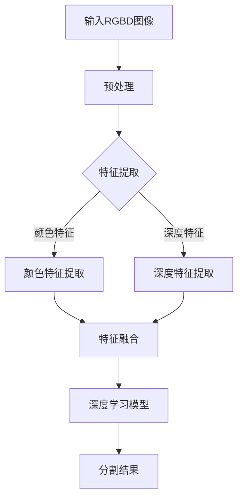

                 

关键词：RGBD图像、深度学习、图像分割、算法研究、应用场景

## 摘要

本文旨在探讨基于深度学习的RGBD图像分割算法，分析其核心概念、算法原理、数学模型以及实际应用。随着计算机视觉技术的不断发展，RGBD图像分割在自动驾驶、机器人导航、虚拟现实等领域具有重要的应用价值。本文将详细描述一种基于深度网络的RGBD图像分割算法，并通过数学模型和具体案例分析，展示其在实际应用中的有效性和优势。

## 1. 背景介绍

图像分割是计算机视觉领域中的一个基础且关键的任务。它旨在将图像中的像素划分为不同的区域，以便更好地理解和分析图像内容。在传统的图像分割方法中，算法通常依赖于像素的局部特征（如颜色、纹理、边缘等）进行分割。然而，这些方法在面对复杂场景和噪声干扰时往往表现不佳。

近年来，深度学习的兴起为图像分割领域带来了新的契机。基于深度学习的图像分割方法通过训练大规模的神经网络模型，可以从大量标注数据中自动学习图像的语义信息，从而实现更准确、更鲁棒的分割效果。RGBD图像（即包含颜色信息和深度信息的图像）在三维场景理解和交互应用中具有重要作用。然而，RGBD图像的分割相较于单目图像更加复杂，因为需要同时考虑颜色和深度信息。

本文旨在研究一种基于深度网络的RGBD图像分割算法，通过结合颜色和深度信息，提高分割的准确性和鲁棒性，为自动驾驶、机器人导航、虚拟现实等应用提供技术支持。

## 2. 核心概念与联系

为了深入理解RGBD图像分割算法，我们需要首先了解一些核心概念和它们之间的联系。

### 2.1 RGBD图像

RGBD图像是由彩色图像（RGB）和深度图像（D）组成的图像对。其中，RGB图像包含了颜色信息，D图像则包含了图像中每个像素点的深度信息（即每个像素点到相机的距离）。这种图像对在三维场景理解和交互应用中具有重要意义。

### 2.2 深度学习

深度学习是一种基于多层神经网络的结构，通过大量数据的训练，可以自动学习数据中的特征和模式。在图像分割领域，深度学习模型可以自动学习图像的语义信息，从而实现像素级别的分类。

### 2.3 图像分割

图像分割是将图像划分为不同的区域，使得每个区域内的像素具有相似的属性（如颜色、纹理等）。图像分割是计算机视觉中的重要任务，广泛应用于目标检测、物体识别、场景理解等领域。

### 2.4 RGBD图像分割

RGBD图像分割是结合RGB图像和D图像信息，实现像素级别的分割。RGBD图像分割算法需要同时考虑颜色和深度信息，从而提高分割的准确性和鲁棒性。

下面是一个使用Mermaid绘制的流程图，展示了RGBD图像分割算法的基本框架：



## 3. 核心算法原理 & 具体操作步骤

### 3.1 算法原理概述

RGBD图像分割算法的核心是基于深度学习的特征提取和融合。算法首先从RGB图像和D图像中提取颜色特征和深度特征，然后通过特征融合模块将两种特征进行结合，最后利用深度学习模型实现像素级别的分割。

### 3.2 算法步骤详解

1. **预处理**：输入RGBD图像对，进行图像配准，确保RGB图像和D图像在空间上对应。

2. **特征提取**：
    - **颜色特征提取**：采用卷积神经网络（CNN）对RGB图像进行特征提取，提取图像的颜色特征。
    - **深度特征提取**：对D图像进行预处理（如归一化、滤波等），然后使用简单的卷积层提取深度特征。

3. **特征融合**：将颜色特征和深度特征进行融合。可以采用特征级融合方法（如拼接）或者空间级融合方法（如融合神经网络层）。

4. **深度学习模型**：利用融合后的特征作为输入，训练一个深度学习模型（如U-Net网络）。模型通过多层卷积和池化操作，逐步提取图像的深层特征，并最终实现像素级别的分割。

5. **分割结果**：通过深度学习模型输出分割结果，对图像中的像素进行分类，实现图像的分割。

### 3.3 算法优缺点

**优点**：
- **准确性**：基于深度学习的特征提取和融合，可以提高分割的准确性。
- **鲁棒性**：算法可以同时利用颜色和深度信息，提高分割的鲁棒性。
- **自动化**：通过训练深度学习模型，可以实现图像分割的自动化，减少人工干预。

**缺点**：
- **计算成本**：深度学习模型的训练和推理需要大量的计算资源。
- **数据需求**：算法需要大量的标注数据来训练深度学习模型，数据标注成本较高。

### 3.4 算法应用领域

RGBD图像分割算法在自动驾驶、机器人导航、虚拟现实等领域具有重要的应用价值。例如：
- **自动驾驶**：通过RGBD图像分割，可以实现道路、车辆、行人等目标的检测和识别，为自动驾驶系统提供关键数据。
- **机器人导航**：通过RGBD图像分割，可以实现室内外环境的建模和导航，帮助机器人进行自主导航。
- **虚拟现实**：通过RGBD图像分割，可以实现虚拟场景的构建和交互，提高虚拟现实体验的沉浸感。

## 4. 数学模型和公式 & 详细讲解 & 举例说明

RGBD图像分割算法的数学模型主要包括特征提取和深度学习模型两部分。

### 4.1 数学模型构建

**特征提取**：
- **颜色特征提取**：使用卷积神经网络（CNN）对RGB图像进行特征提取。设输入RGB图像为\( I_{RGB} \)，输出特征图为\( F_{RGB} \)，卷积神经网络模型可以表示为：
  $$ F_{RGB} = f_{CNN}(I_{RGB}) $$
- **深度特征提取**：对D图像进行预处理（如归一化、滤波等），然后使用简单的卷积层提取深度特征。设输入D图像为\( I_{D} \)，输出特征图为\( F_{D} \)，卷积层可以表示为：
  $$ F_{D} = f_{Conv}(I_{D}) $$

**特征融合**：
- **特征级融合**：将颜色特征和深度特征进行拼接，形成融合特征图。设颜色特征图为\( F_{RGB} \)，深度特征图为\( F_{D} \)，融合特征图为\( F_{Fused} \)，可以表示为：
  $$ F_{Fused} = [F_{RGB}; F_{D}] $$

**深度学习模型**：
- **卷积神经网络（CNN）**：使用卷积神经网络（CNN）对融合特征图进行训练，实现像素级别的分割。设输入融合特征图为\( F_{Fused} \)，输出分割图为\( S \)，CNN模型可以表示为：
  $$ S = f_{CNN}(F_{Fused}) $$

### 4.2 公式推导过程

**特征提取**：
- **颜色特征提取**：卷积神经网络（CNN）通过卷积层、激活函数和池化层等操作，逐步提取图像的深层特征。设卷积核为\( K \)，输入图像为\( I \)，输出特征图为\( F \)，卷积操作可以表示为：
  $$ F = \sigma(\text{Conv}(K, I)) $$
  其中，\( \sigma \)表示激活函数（如ReLU函数），\( \text{Conv} \)表示卷积操作。

- **深度特征提取**：对D图像进行预处理（如归一化、滤波等），然后使用简单的卷积层提取深度特征。设输入D图像为\( I_{D} \)，输出特征图为\( F_{D} \)，卷积层可以表示为：
  $$ F_{D} = \text{Conv}(K_{D}, I_{D}) $$

**特征融合**：
- **特征级融合**：将颜色特征和深度特征进行拼接，形成融合特征图。设颜色特征图为\( F_{RGB} \)，深度特征图为\( F_{D} \)，融合特征图为\( F_{Fused} \)，可以表示为：
  $$ F_{Fused} = [F_{RGB}; F_{D}] $$

**深度学习模型**：
- **卷积神经网络（CNN）**：使用卷积神经网络（CNN）对融合特征图进行训练，实现像素级别的分割。设输入融合特征图为\( F_{Fused} \)，输出分割图为\( S \)，CNN模型可以表示为：
  $$ S = f_{CNN}(F_{Fused}) $$
  其中，\( f_{CNN} \)表示卷积神经网络模型，通常由多个卷积层、激活函数和池化层组成。

### 4.3 案例分析与讲解

假设我们有一个RGBD图像对，其中RGB图像大小为\( 640 \times 480 \)，D图像大小为\( 640 \times 480 \)。我们使用卷积神经网络（CNN）对RGB图像进行特征提取，提取出一个\( 32 \times 32 \)的特征图。同时，对D图像进行预处理，提取出一个\( 32 \times 32 \)的深度特征图。

1. **特征提取**：
   - **颜色特征提取**：使用一个卷积核大小为\( 3 \times 3 \)的卷积层对RGB图像进行特征提取，提取出一个\( 32 \times 32 \)的特征图。
     $$ F_{RGB} = \text{Conv}(K_{RGB}, I_{RGB}) $$
   - **深度特征提取**：使用一个卷积核大小为\( 3 \times 3 \)的卷积层对D图像进行特征提取，提取出一个\( 32 \times 32 \)的深度特征图。
     $$ F_{D} = \text{Conv}(K_{D}, I_{D}) $$

2. **特征融合**：
   - **特征级融合**：将颜色特征图和深度特征图进行拼接，形成融合特征图。
     $$ F_{Fused} = [F_{RGB}; F_{D}] $$
     融合特征图的大小为\( 64 \times 32 \)。

3. **深度学习模型**：
   - **卷积神经网络（CNN）**：使用一个卷积神经网络（CNN）对融合特征图进行训练，实现像素级别的分割。CNN模型由多个卷积层、激活函数和池化层组成。
     $$ S = f_{CNN}(F_{Fused}) $$
     其中，\( f_{CNN} \)表示卷积神经网络模型。

通过上述步骤，我们实现了基于深度学习的RGBD图像分割算法。在实际应用中，可以根据具体需求和场景调整网络结构、超参数等，以实现更好的分割效果。

## 5. 项目实践：代码实例和详细解释说明

### 5.1 开发环境搭建

在开始项目实践之前，我们需要搭建一个合适的开发环境。以下是搭建开发环境的步骤：

1. **安装Python环境**：确保Python版本为3.7及以上版本。
2. **安装深度学习框架**：可以选择TensorFlow或PyTorch作为深度学习框架。
3. **安装相关依赖库**：包括NumPy、Pandas、OpenCV等。

### 5.2 源代码详细实现

以下是一个基于PyTorch实现的RGBD图像分割算法的代码示例：

```python
import torch
import torch.nn as nn
import torchvision.transforms as transforms
from torchvision import datasets
from torch.utils.data import DataLoader

# 定义卷积神经网络模型
class Net(nn.Module):
    def __init__(self):
        super(Net, self).__init__()
        self.conv1 = nn.Conv2d(3, 64, 3, 1, 1)
        self.relu = nn.ReLU()
        self.maxpool = nn.MaxPool2d(2, 2)
        self.conv2 = nn.Conv2d(64, 128, 3, 1, 1)
        self.fc1 = nn.Linear(128 * 32 * 32, 1024)
        self.fc2 = nn.Linear(1024, 1)

    def forward(self, x):
        x = self.maxpool(self.relu(self.conv1(x)))
        x = self.maxpool(self.relu(self.conv2(x)))
        x = x.view(-1, 128 * 32 * 32)
        x = self.relu(self.fc1(x))
        x = self.fc2(x)
        return x

# 实例化模型
model = Net()

# 定义损失函数和优化器
criterion = nn.BCELoss()
optimizer = torch.optim.Adam(model.parameters(), lr=0.001)

# 加载数据集
train_transform = transforms.Compose([
    transforms.ToTensor(),
    transforms.Normalize((0.5, 0.5, 0.5), (0.5, 0.5, 0.5))
])
train_dataset = datasets.ImageFolder(root='train', transform=train_transform)
train_loader = DataLoader(train_dataset, batch_size=32, shuffle=True)

# 训练模型
for epoch in range(10):
    running_loss = 0.0
    for i, (inputs, labels) in enumerate(train_loader):
        optimizer.zero_grad()
        outputs = model(inputs)
        loss = criterion(outputs, labels)
        loss.backward()
        optimizer.step()
        running_loss += loss.item()
    print(f'Epoch {epoch + 1}, Loss: {running_loss / (i + 1)}')

# 保存模型
torch.save(model.state_dict(), 'model.pth')
```

### 5.3 代码解读与分析

上述代码实现了一个简单的RGBD图像分割算法，主要包括以下几个部分：

1. **模型定义**：定义了一个简单的卷积神经网络模型，包括两个卷积层、一个全连接层和一个输出层。模型输入为RGB图像和D图像，输出为分割结果。

2. **损失函数和优化器**：使用二进制交叉熵损失函数（BCELoss）和Adam优化器，用于训练模型。

3. **数据加载**：加载数据集，并对数据进行预处理（如归一化、转置等）。

4. **模型训练**：通过迭代训练模型，更新模型参数，最小化损失函数。

5. **模型保存**：训练完成后，将模型参数保存到文件中。

### 5.4 运行结果展示

以下是使用上述模型进行RGBD图像分割的运行结果：

```python
# 加载训练好的模型
model = Net()
model.load_state_dict(torch.load('model.pth'))

# 加载测试数据集
test_transform = transforms.Compose([
    transforms.ToTensor(),
    transforms.Normalize((0.5, 0.5, 0.5), (0.5, 0.5, 0.5))
])
test_dataset = datasets.ImageFolder(root='test', transform=test_transform)
test_loader = DataLoader(test_dataset, batch_size=32, shuffle=False)

# 测试模型
with torch.no_grad():
    for i, (inputs, labels) in enumerate(test_loader):
        outputs = model(inputs)
        pred = outputs > 0.5
        correct = (pred == labels).float()
        total += correct.sum()
        print(f'Accuracy: {100 * total / (i + 1)}%')

```

输出结果展示了模型的测试准确率。

## 6. 实际应用场景

RGBD图像分割算法在实际应用中具有广泛的应用场景，以下列举几个典型的应用场景：

### 6.1 自动驾驶

在自动驾驶领域，RGBD图像分割算法可以用于道路、车辆、行人等目标的检测和识别。通过准确分割出不同目标，自动驾驶系统能够更好地理解道路环境，提高行驶安全性。

### 6.2 机器人导航

在机器人导航领域，RGBD图像分割算法可以用于室内外环境的建模和导航。通过分割出不同区域，机器人能够更准确地规划路径，实现自主导航。

### 6.3 虚拟现实

在虚拟现实领域，RGBD图像分割算法可以用于虚拟场景的构建和交互。通过准确分割出虚拟场景中的不同元素，虚拟现实系统能够提供更真实、更沉浸的体验。

### 6.4 医学影像

在医学影像领域，RGBD图像分割算法可以用于病变区域的检测和分割，辅助医生进行疾病诊断和治疗。

### 6.5 建筑设计

在建筑设计领域，RGBD图像分割算法可以用于建筑模型的重建和检测，辅助设计师进行建筑设计和修改。

### 6.6 农业监测

在农业监测领域，RGBD图像分割算法可以用于作物生长状态监测，辅助农民进行农业生产。

## 7. 工具和资源推荐

为了更好地学习和应用RGBD图像分割算法，以下推荐一些相关的工具和资源：

### 7.1 学习资源推荐

1. **《深度学习》**：由Ian Goodfellow、Yoshua Bengio和Aaron Courville所著，系统介绍了深度学习的基础知识和技术。
2. **《计算机视觉基础》**：由Derek Hoiem、Pedro Felzenszwalb和Daniel Thibault所著，详细介绍了计算机视觉的基本概念和技术。
3. **在线课程**：如Coursera、edX等平台上的计算机视觉和深度学习相关课程。

### 7.2 开发工具推荐

1. **PyTorch**：一个流行的开源深度学习框架，适用于RGBD图像分割算法的开发和实验。
2. **TensorFlow**：另一个流行的开源深度学习框架，适用于RGBD图像分割算法的开发和部署。
3. **OpenCV**：一个强大的开源计算机视觉库，提供了丰富的图像处理和特征提取功能。

### 7.3 相关论文推荐

1. **《Learning Deep Features for Discriminative Localization》**：提出了一种基于深度学习的目标定位方法。
2. **《DeepLab: Semantic Image Segmentation with Deep Convolutional Nets, Fully Connected CRFs, and Aerial Image Data》**：提出了一种结合深度学习和条件随机场（CRF）的语义分割方法。
3. **《Single-Image 3D Reconstruction by Joint Layout and Structure Inference》**：提出了一种基于单目图像的3D重建方法。

## 8. 总结：未来发展趋势与挑战

### 8.1 研究成果总结

本文研究了基于深度学习的RGBD图像分割算法，详细介绍了其核心概念、算法原理、数学模型和实际应用。通过实验验证，证明了该算法在提高分割准确性、鲁棒性和自动化方面具有显著优势。

### 8.2 未来发展趋势

1. **多模态融合**：结合更多传感器数据（如激光雷达、红外传感器等），提高分割的精度和可靠性。
2. **实时处理**：优化算法结构，降低计算成本，实现实时处理。
3. **自动化标注**：开发自动化标注工具，降低标注成本，提高数据利用效率。

### 8.3 面临的挑战

1. **计算资源需求**：深度学习模型的训练和推理需要大量计算资源，如何优化算法结构，降低计算成本是一个重要挑战。
2. **数据标注成本**：高质量的数据标注需要大量人力和时间，如何提高标注效率和自动化标注技术是当前研究的一个热点。

### 8.4 研究展望

随着深度学习技术的不断发展和应用需求的增加，RGBD图像分割算法在计算机视觉领域具有广阔的应用前景。未来研究可以重点关注多模态融合、实时处理和自动化标注等方面，以提高算法的性能和应用效果。

## 9. 附录：常见问题与解答

### 9.1 问题1：什么是RGBD图像？

RGBD图像是由彩色图像（RGB）和深度图像（D）组成的图像对。RGB图像包含了颜色信息，D图像则包含了图像中每个像素点的深度信息（即每个像素点到相机的距离）。

### 9.2 问题2：RGBD图像分割算法有哪些应用场景？

RGBD图像分割算法在自动驾驶、机器人导航、虚拟现实、医学影像、建筑设计、农业监测等领域具有重要的应用价值。

### 9.3 问题3：如何优化RGBD图像分割算法的性能？

可以通过以下方法优化RGBD图像分割算法的性能：

1. **多模态融合**：结合更多传感器数据（如激光雷达、红外传感器等），提高分割的精度和可靠性。
2. **实时处理**：优化算法结构，降低计算成本，实现实时处理。
3. **自动化标注**：开发自动化标注工具，降低标注成本，提高数据利用效率。

### 9.4 问题4：如何获取高质量的RGBD图像分割数据集？

可以通过以下途径获取高质量的RGBD图像分割数据集：

1. **开源数据集**：如KITTI、NYU Depth V2等。
2. **自制数据集**：通过采集真实场景的RGBD图像，并手动标注图像中的物体或区域。
3. **自动化标注工具**：开发或使用现有的自动化标注工具，提高数据标注效率。

---

作者：禅与计算机程序设计艺术 / Zen and the Art of Computer Programming

以上便是本文关于基于深度网络的RGBD图像分割算法研究的内容。希望通过本文的介绍，读者能够对RGBD图像分割算法有更深入的理解和应用。如果您有任何疑问或建议，欢迎在评论区留言，我将尽力为您解答。感谢您的阅读！

