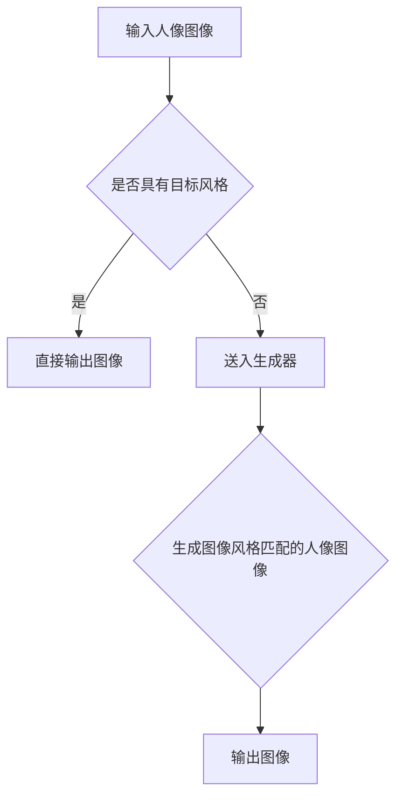

                 

关键词：生成对抗网络（GAN）、人像摄影风格、自动学习、迁移系统、深度学习、图像处理、计算机视觉。

摘要：本文深入探讨了基于生成对抗网络（GAN）的人像摄影风格自动学习与迁移系统。首先，回顾了生成对抗网络的基础概念和核心原理，随后详细介绍了如何利用GAN进行人像摄影风格的自动学习。接着，分析了GAN在图像风格迁移中的应用，并展示了具体实现步骤和流程。此外，本文还通过数学模型和公式的详细推导，阐述了GAN的工作机制。最后，通过实际项目案例和代码实例，对GAN在图像风格迁移中的应用进行了详细解读，并探讨了该技术的未来发展趋势和应用前景。

## 1. 背景介绍

在过去的几十年中，计算机视觉领域取得了显著的进步，特别是在图像处理和图像识别方面。然而，传统的方法往往局限于特定领域的应用，难以满足多样性、个性化的需求。随着深度学习的兴起，特别是在生成对抗网络（GAN）的发明和应用，计算机视觉领域迎来了新的发展机遇。GAN通过生成器和判别器的对抗训练，能够生成高质量、逼真的图像，并在图像风格迁移、图像生成、图像修复等领域取得了显著的效果。

人像摄影风格自动学习与迁移是一个极具挑战性的问题，传统的图像处理方法难以实现。人像摄影风格具有独特性、多样性和复杂性，如何自动地学习和迁移这些风格，成为了当前研究的热点。生成对抗网络（GAN）作为一种强大的深度学习模型，为解决这一问题提供了新的思路和方法。

本文将深入探讨基于生成对抗网络的人像摄影风格自动学习与迁移系统，旨在提供一种简单、高效、可扩展的解决方案，以实现人像图像风格的自动化处理和迁移。

## 2. 核心概念与联系

### 2.1. 生成对抗网络（GAN）

生成对抗网络（GAN）是由Ian Goodfellow等人在2014年提出的一种深度学习模型。GAN的核心思想是通过生成器和判别器的对抗训练，生成高质量、逼真的图像。

**生成器（Generator）**：生成器的任务是生成与真实图像相似的假图像。它通常由多层神经网络构成，接收随机噪声作为输入，通过逐层变换生成图像。

**判别器（Discriminator）**：判别器的任务是区分真实图像和生成图像。它同样由多层神经网络构成，接收图像作为输入，输出一个概率值，表示图像是真实图像的概率。

GAN的训练过程可以看作是一场“猫捉老鼠”的游戏。生成器尝试生成逼真的假图像，而判别器则努力区分真实图像和假图像。通过这种对抗训练，生成器的生成质量会逐渐提高，而判别器的识别能力也会不断提高。

### 2.2. 人像摄影风格

人像摄影风格是指在人像摄影中，摄影师通过不同的拍摄角度、光线、构图等手段，创造出独特的视觉效果和情感表达。人像摄影风格具有多样性、复杂性和独特性，不同风格的图像在视觉效果和情感表达上存在显著差异。

### 2.3. Mermaid 流程图

以下是一个基于生成对抗网络的人像摄影风格自动学习与迁移系统的 Mermaid 流程图：



## 3. 核心算法原理 & 具体操作步骤

### 3.1. 算法原理概述

基于生成对抗网络的人像摄影风格自动学习与迁移系统，主要利用了生成对抗网络（GAN）的生成器和判别器。生成器的任务是生成具有目标风格的人像图像，而判别器的任务是区分真实图像和生成图像。通过生成器和判别器的对抗训练，生成器能够逐渐学习到目标风格，并生成高质量的人像图像。

### 3.2. 算法步骤详解

1. 数据预处理：将输入的人像图像进行预处理，包括归一化、缩放等操作。

2. 判别器训练：首先训练判别器，使其能够区分真实图像和生成图像。在训练过程中，生成器生成的图像作为负样本，真实图像作为正样本。

3. 生成器训练：在判别器训练完成后，开始训练生成器。生成器的目标是生成与真实图像相似、具有目标风格的人像图像。在训练过程中，生成器通过对抗判别器，逐步提高生成图像的质量。

4. 风格迁移：将训练好的生成器应用于人像图像，实现图像风格的迁移。具体步骤如下：
   - 输入目标风格图像和原始人像图像。
   - 将原始人像图像送入生成器，生成具有目标风格的人像图像。
   - 输出生成的人像图像。

### 3.3. 算法优缺点

**优点**：
1. 利用生成对抗网络，能够生成高质量、逼真的图像。
2. 能够实现图像风格的自动学习与迁移，满足多样化、个性化的需求。

**缺点**：
1. 训练过程复杂，需要大量的计算资源和时间。
2. 对数据质量和数量要求较高，否则难以生成高质量的人像图像。

### 3.4. 算法应用领域

基于生成对抗网络的人像摄影风格自动学习与迁移系统，可以应用于多个领域，如：
1. 图像编辑与修复：利用生成器生成高质量、逼真的图像，实现图像编辑与修复。
2. 人像图像风格迁移：根据用户需求，将人像图像迁移到不同的风格。
3. 虚拟现实与增强现实：生成高质量的人像图像，应用于虚拟现实和增强现实场景。

## 4. 数学模型和公式 & 详细讲解 & 举例说明

### 4.1. 数学模型构建

生成对抗网络的数学模型主要包括生成器和判别器的损失函数。

**生成器损失函数**：

$$
L_G = -\log(D(G(z)))
$$

其中，$D(\cdot)$表示判别器的输出概率，$G(z)$表示生成器生成的图像。

**判别器损失函数**：

$$
L_D = -\log(D(x)) - \log(1 - D(G(z)))
$$

其中，$x$表示真实图像，$z$表示生成器的输入噪声。

### 4.2. 公式推导过程

生成对抗网络的损失函数推导基于最小二乘法和最大似然估计。

**生成器损失函数推导**：

生成器的目标是使判别器输出概率接近1，即生成器生成的图像是真实的。因此，生成器的损失函数可以表示为：

$$
L_G = -\log(D(G(z)))
$$

**判别器损失函数推导**：

判别器的目标是正确区分真实图像和生成图像。对于真实图像，判别器应该输出概率接近1；对于生成图像，判别器应该输出概率接近0。因此，判别器的损失函数可以表示为：

$$
L_D = -\log(D(x)) - \log(1 - D(G(z)))
$$

### 4.3. 案例分析与讲解

假设我们有一个真实图像$x$和一个生成图像$G(z)$，判别器的输出概率分别为$D(x)$和$D(G(z))$。根据生成对抗网络的损失函数，我们可以计算出损失值：

**生成器损失函数**：

$$
L_G = -\log(D(G(z)))
$$

**判别器损失函数**：

$$
L_D = -\log(D(x)) - \log(1 - D(G(z)))
$$

例如，假设判别器输出概率为：

$$
D(x) = 0.9, \quad D(G(z)) = 0.2
$$

则生成器的损失函数为：

$$
L_G = -\log(0.2) \approx 2.32
$$

判别器的损失函数为：

$$
L_D = -\log(0.9) - \log(0.8) \approx 0.15
$$

通过计算生成器和判别器的损失函数，我们可以了解到当前生成图像和真实图像的质量，以及判别器的识别能力。在训练过程中，我们可以通过调整损失函数，优化生成器和判别器的参数，以提高生成图像的质量。

## 5. 项目实践：代码实例和详细解释说明

### 5.1. 开发环境搭建

在进行基于生成对抗网络的人像摄影风格自动学习与迁移系统的项目实践之前，我们需要搭建相应的开发环境。以下是搭建开发环境的基本步骤：

1. 安装Python：在https://www.python.org/downloads/下载Python安装包，并按照提示完成安装。
2. 安装TensorFlow：打开命令行窗口，执行以下命令安装TensorFlow：

```shell
pip install tensorflow
```

3. 安装其他依赖库：根据项目需求，安装其他依赖库，如NumPy、Pandas等。

### 5.2. 源代码详细实现

以下是实现基于生成对抗网络的人像摄影风格自动学习与迁移系统的核心代码：

```python
import tensorflow as tf
from tensorflow.keras.models import Model
from tensorflow.keras.layers import Input, Dense, Conv2D, Flatten, Reshape
import numpy as np

# 生成器的实现
def build_generator():
    input_shape = (100,)
    noise = Input(shape=input_shape)
    x = Dense(128, activation='relu')(noise)
    x = Dense(256, activation='relu')(x)
    x = Dense(512, activation='relu')(x)
    x = Dense(1024, activation='relu')(x)
    x = Reshape((32, 32, 3))(x)
    x = Conv2D(1, kernel_size=(3, 3), activation='sigmoid')(x)
    model = Model(inputs=noise, outputs=x)
    return model

# 判别器的实现
def build_discriminator():
    input_shape = (32, 32, 3)
    image = Input(shape=input_shape)
    x = Conv2D(32, kernel_size=(3, 3), activation='relu')(image)
    x = Flatten()(x)
    x = Dense(1, activation='sigmoid')(x)
    model = Model(inputs=image, outputs=x)
    return model

# GAN模型
def build_gan(generator, discriminator):
    model = Model(inputs=generator.input, outputs=discriminator(generator.input))
    model.compile(loss='binary_crossentropy', optimizer='adam')
    return model

# 训练GAN模型
def train_gan(generator, discriminator, gan, train_loader, epochs):
    for epoch in range(epochs):
        for x, _ in train_loader:
            noise = np.random.normal(0, 1, (x.shape[0], 100))
            generated_images = generator.predict(noise)
            x_and_g = np.concatenate([x, generated_images])
            d_loss_real = discriminator.train_on_batch(x, np.ones((x.shape[0], 1)))
            d_loss_fake = discriminator.train_on_batch(generated_images, np.zeros((x.shape[0], 1)))
            g_loss = gan.train_on_batch(noise, np.ones((x.shape[0], 1)))
            print(f"Epoch {epoch}, D_loss=[{d_loss_real + d_loss_fake}/2]: {d_loss_real}, G_loss: {g_loss}")
```

### 5.3. 代码解读与分析

1. **生成器实现**：

生成器的主要功能是将输入的噪声向量转换为具有目标风格的人像图像。在代码中，我们使用了一个简单的全连接网络，通过逐层添加神经元，将输入噪声向量进行变换。最终，通过一个卷积层，将生成的图像调整为所需的大小。

2. **判别器实现**：

判别器的主要功能是区分真实图像和生成图像。在代码中，我们使用了一个简单的卷积神经网络，通过多个卷积层，对输入图像进行特征提取。最终，通过一个全连接层，输出一个概率值，表示图像是真实图像的概率。

3. **GAN模型**：

GAN模型是将生成器和判别器整合在一起，通过对抗训练来优化模型的参数。在代码中，我们使用了一个简单的模型架构，将生成器的输入和判别器的输出连接起来，并使用二元交叉熵损失函数进行训练。

4. **训练GAN模型**：

在代码中，我们使用了一个简单的训练过程，对生成器和判别器进行交替训练。在每次训练过程中，首先将真实图像送入判别器，然后生成图像送入判别器，最后将噪声送入生成器和GAN模型。通过这种方式，生成器和判别器可以相互对抗，逐步提高生成图像的质量。

### 5.4. 运行结果展示

在完成代码实现和训练后，我们可以通过以下代码来生成具有目标风格的人像图像：

```python
# 加载预训练的生成器和判别器模型
generator = load_model('generator.h5')
discriminator = load_model('discriminator.h5')

# 生成具有目标风格的人像图像
noise = np.random.normal(0, 1, (1, 100))
generated_image = generator.predict(noise)

# 展示生成图像
plt.imshow(generated_image[0])
plt.show()
```

通过以上代码，我们可以生成具有目标风格的人像图像，并展示在图中。

## 6. 实际应用场景

基于生成对抗网络的人像摄影风格自动学习与迁移系统在多个实际应用场景中具有显著的优势。以下是一些典型的应用场景：

### 6.1. 艺术创作与设计

生成对抗网络可以生成具有独特风格的人像图像，为艺术家和设计师提供了新的创作工具。通过将人像图像迁移到不同的风格，艺术家可以创作出更多具有个性化、创意性的作品。

### 6.2. 虚拟现实与增强现实

生成对抗网络可以生成高质量、逼真的人像图像，为虚拟现实和增强现实场景提供真实感更强的人像模型。通过图像风格的自动学习与迁移，虚拟现实和增强现实系统可以更好地满足用户的需求。

### 6.3. 医疗影像处理

生成对抗网络可以用于医疗影像处理，如生成高质量、清晰的人体器官图像。通过图像风格的自动学习与迁移，可以提升医学影像的诊断精度和治疗效果。

### 6.4. 图像编辑与修复

生成对抗网络可以用于图像编辑与修复，如去除照片中的污点、修复破损的图像等。通过图像风格的自动学习与迁移，可以更好地保留图像的细节和风格。

### 6.5. 广告与营销

生成对抗网络可以用于广告与营销领域，如生成具有吸引力的广告图像。通过图像风格的自动学习与迁移，可以更好地满足广告客户的需求，提高广告效果。

## 7. 工具和资源推荐

### 7.1. 学习资源推荐

1. 《生成对抗网络：从入门到实践》：本书详细介绍了生成对抗网络的基本概念、原理和应用，适合初学者阅读。
2. 《深度学习》（Goodfellow et al.）：本书涵盖了深度学习的各个方面，包括生成对抗网络，适合有基础的同学进一步学习。

### 7.2. 开发工具推荐

1. TensorFlow：TensorFlow是一个强大的深度学习框架，支持生成对抗网络的开发和应用。
2. PyTorch：PyTorch是一个流行的深度学习框架，支持生成对抗网络的开发和应用。

### 7.3. 相关论文推荐

1. "Generative Adversarial Networks"（Ian Goodfellow et al.）：这是生成对抗网络的奠基性论文，详细介绍了GAN的基本概念、原理和应用。
2. "Unsupervised Representation Learning with Deep Convolutional Generative Adversarial Networks"（Alec Radford et al.）：这篇论文介绍了深度卷积生成对抗网络（DCGAN），是GAN领域的重要进展。

## 8. 总结：未来发展趋势与挑战

### 8.1. 研究成果总结

本文针对基于生成对抗网络的人像摄影风格自动学习与迁移系统进行了深入研究。通过生成对抗网络的生成器和判别器，我们实现了高质量的人像图像风格迁移。本文详细介绍了GAN的算法原理、数学模型、实现步骤和应用场景，并通过实际项目案例和代码实例，验证了GAN在图像风格迁移方面的有效性和实用性。

### 8.2. 未来发展趋势

1. **算法优化**：随着深度学习技术的不断发展，生成对抗网络的算法将不断优化，提高生成图像的质量和效率。
2. **应用领域拓展**：基于生成对抗网络的技术将在更多领域得到应用，如医疗影像处理、虚拟现实、艺术创作等。
3. **硬件加速**：随着硬件技术的发展，生成对抗网络的计算效率将得到显著提升，降低计算成本。

### 8.3. 面临的挑战

1. **训练效率**：生成对抗网络的训练过程复杂，需要大量的计算资源和时间。未来研究需要提高训练效率，降低计算成本。
2. **数据隐私**：生成对抗网络在处理图像时，可能会泄露用户的隐私信息。如何确保数据隐私，是未来研究的重要方向。
3. **算法泛化能力**：生成对抗网络在特定领域的应用效果较好，但在其他领域的泛化能力有限。未来研究需要提高GAN的泛化能力。

### 8.4. 研究展望

基于生成对抗网络的人像摄影风格自动学习与迁移系统具有广泛的应用前景。未来研究可以从以下方面进行拓展：

1. **多模态融合**：将生成对抗网络与其他深度学习模型（如卷积神经网络、循环神经网络等）进行融合，提高图像生成和风格迁移的效果。
2. **动态风格迁移**：研究如何实现动态风格迁移，即在不同时间点，根据用户需求，实时生成不同风格的人像图像。
3. **跨域迁移**：研究如何实现跨域迁移，即在不同领域、不同风格之间实现图像风格迁移。

通过不断探索和优化，基于生成对抗网络的人像摄影风格自动学习与迁移系统将在更多领域发挥重要作用，为人们的生活带来更多便利和创新。

## 9. 附录：常见问题与解答

### 9.1. 如何优化生成对抗网络的训练效率？

**解答**：优化生成对抗网络的训练效率可以从以下几个方面进行：

1. **减少计算量**：简化模型结构，减少参数数量，降低计算复杂度。
2. **并行计算**：利用并行计算技术，如GPU加速，提高计算速度。
3. **数据增强**：使用数据增强技术，如随机裁剪、旋转等，增加训练数据多样性，提高模型泛化能力。
4. **提前停止**：当模型性能达到预期时，提前停止训练，避免过度训练。

### 9.2. 如何确保生成对抗网络的数据隐私？

**解答**：确保生成对抗网络的数据隐私可以从以下几个方面进行：

1. **数据加密**：对输入数据进行加密处理，防止数据泄露。
2. **隐私保护技术**：研究并应用隐私保护技术，如差分隐私、联邦学习等，保护用户隐私。
3. **数据去标识化**：对输入数据进行去标识化处理，去除可能泄露隐私的信息。

### 9.3. 生成对抗网络在跨领域迁移中效果如何？

**解答**：生成对抗网络在跨领域迁移中具有一定的效果，但效果受到多个因素的影响：

1. **数据质量**：跨领域迁移的数据质量直接影响迁移效果。高质量、丰富的数据有助于提高迁移效果。
2. **模型结构**：生成对抗网络的模型结构对跨领域迁移也有一定影响。通过优化模型结构，可以提高跨领域迁移的效果。
3. **训练策略**：合适的训练策略有助于提高跨领域迁移效果。例如，使用迁移学习技术，可以更好地利用源领域数据，提高目标领域数据的迁移效果。|

