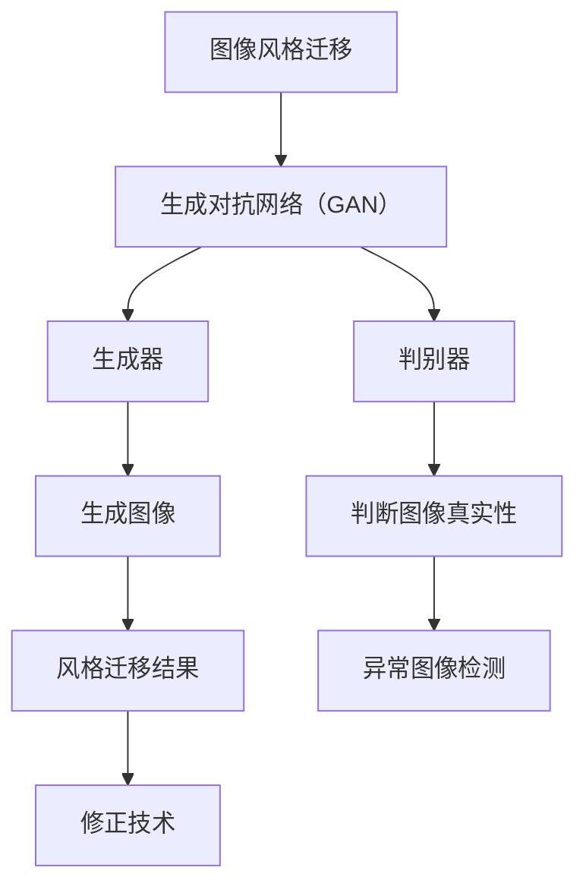

                 

关键词：生成对抗网络，图像风格迁移，异常检测，修正技术，计算机视觉

## 摘要

本文主要探讨了生成对抗网络（GAN）在图像风格迁移中的应用，特别是在异常检测与修正方面的研究。首先，我们介绍了图像风格迁移的基本概念和背景，然后详细解析了生成对抗网络的原理及其在图像风格迁移中的具体应用。接着，本文深入探讨了GAN在图像风格迁移过程中出现的异常现象，以及如何利用GAN进行异常检测和修正。通过具体的案例分析和实际应用，本文展示了基于GAN的图像风格迁移技术在计算机视觉领域的前景和挑战。最后，本文对未来的研究方向进行了展望，以期为相关领域的研究者提供参考。

## 1. 背景介绍

### 图像风格迁移

图像风格迁移是一种将一种图像的样式应用到另一种图像上的技术，旨在将一种艺术风格（如梵高、毕加索等）赋予普通照片，使其呈现出独特的视觉效果。这种技术近年来在计算机视觉和图像处理领域得到了广泛关注，尤其在艺术创作、广告设计、电影制作等领域具有广泛应用前景。

### 生成对抗网络

生成对抗网络（Generative Adversarial Network，GAN）是一种由生成器和判别器组成的深度学习模型。生成器旨在生成与真实数据相似的新数据，而判别器则负责区分生成器和真实数据。两者通过相互对抗和竞争，逐步优化自身的性能，最终实现高质量的数据生成。

### 图像风格迁移与GAN

GAN在图像风格迁移中的应用，主要是利用生成器学习源图像的特征，然后生成具有目标风格的新图像。GAN的优势在于其强大的数据生成能力，可以生成具有高度真实感的图像，从而实现高质量的图像风格迁移。

## 2. 核心概念与联系

### 核心概念

- **生成对抗网络（GAN）**：包括生成器和判别器，分别负责生成数据和判断数据真实性。
- **图像风格迁移**：将一种图像的样式应用到另一种图像上。
- **异常检测**：在图像风格迁移过程中，检测出不符合预期风格或出现问题的图像。

### Mermaid 流程图



## 3. 核心算法原理 & 具体操作步骤

### 3.1 算法原理概述

生成对抗网络（GAN）是一种由生成器和判别器组成的深度学习模型。生成器旨在生成与真实数据相似的新数据，而判别器则负责区分生成器和真实数据。两者通过相互对抗和竞争，逐步优化自身的性能，最终实现高质量的数据生成。

### 3.2 算法步骤详解

1. **初始化参数**：初始化生成器G和判别器D的参数。
2. **生成器训练**：生成器G通过学习真实数据分布，生成具有目标风格的新图像。
3. **判别器训练**：判别器D通过比较生成器G生成的图像和真实图像，学习区分两者。
4. **交替训练**：生成器和判别器交替进行训练，优化各自的参数。
5. **图像风格迁移**：利用训练好的生成器G，将目标风格应用到输入图像上。
6. **异常检测与修正**：在图像风格迁移过程中，利用判别器D检测出异常图像，然后通过修正技术对异常图像进行修正。

### 3.3 算法优缺点

**优点**：
- GAN具有强大的数据生成能力，可以生成具有高度真实感的图像。
- 可以应用于多种图像处理任务，如图像风格迁移、超分辨率、图像修复等。

**缺点**：
- 训练过程容易陷入模式崩溃（mode collapse），导致生成器只能生成一种特定类型的图像。
- 对数据质量和网络参数要求较高，训练过程复杂。

### 3.4 算法应用领域

GAN在图像风格迁移中的应用前景广阔，可以应用于以下领域：
- 艺术创作：将一种艺术风格应用到普通照片上，创作出具有独特视觉效果的图像。
- 广告设计：为广告图片添加特定风格，提升广告效果。
- 电影制作：将电影中的角色或场景进行风格迁移，实现更逼真的视觉效果。

## 4. 数学模型和公式 & 详细讲解 & 举例说明

### 4.1 数学模型构建

生成对抗网络（GAN）的数学模型如下：

$$
\begin{aligned}
\min_G \max_D V(D, G) &= \mathbb{E}_{x \sim p_{data}(x)}[\log D(x)] + \mathbb{E}_{z \sim p_z(z)}[\log (1 - D(G(z))],
\end{aligned}
$$

其中，$G(z)$是生成器，$D(x)$是判别器，$z$是随机噪声。

### 4.2 公式推导过程

GAN的目标是最小化生成器的损失函数，最大化判别器的损失函数。具体推导过程如下：

1. **生成器的损失函数**：

$$
L_G = -\mathbb{E}_{x \sim p_{data}(x)}[\log D(x)] - \mathbb{E}_{z \sim p_z(z)}[\log (1 - D(G(z))].
$$

2. **判别器的损失函数**：

$$
L_D = -\mathbb{E}_{x \sim p_{data}(x)}[\log D(x)] - \mathbb{E}_{z \sim p_z(z)}[\log D(G(z))].
$$

3. **总损失函数**：

$$
V(D, G) = L_G + L_D.
$$

### 4.3 案例分析与讲解

假设我们有一个训练好的生成对抗网络（GAN），现在需要将其应用于图像风格迁移。

1. **输入图像**：输入一张普通照片，如一张风景照片。
2. **生成器训练**：利用生成器G生成具有目标风格的新图像，如梵高的风格。
3. **判别器训练**：将输入图像和生成器生成的图像输入判别器D，优化判别器的参数。
4. **交替训练**：生成器和判别器交替进行训练，优化各自的参数。
5. **图像风格迁移**：利用训练好的生成器G，将目标风格应用到输入图像上，生成一张具有梵高风格的风景照片。

## 5. 项目实践：代码实例和详细解释说明

### 5.1 开发环境搭建

1. 安装Python环境，版本要求为3.6及以上。
2. 安装TensorFlow，版本要求为2.0及以上。
3. 安装其他相关依赖，如NumPy、PIL等。

### 5.2 源代码详细实现

以下是一个简单的基于生成对抗网络的图像风格迁移代码实例：

```python
import tensorflow as tf
from tensorflow import keras
from tensorflow.keras import layers

# 定义生成器
def generator(z, training=False):
    z = layers.Dense(7 * 7 * 256, activation="relu")(z)
    z = layers.Reshape((7, 7, 256))(z)
    z = layers.Conv2DTranspose(128, 5, strides=2, padding="same", activation="relu")(z)
    z = layers.Conv2DTranspose(64, 5, strides=2, padding="same", activation="relu")(z)
    z = layers.Conv2D(3, 5, padding="same", activation="tanh")(z)
    return z

# 定义判别器
def discriminator(x, training=False):
    x = layers.Conv2D(64, 5, strides=2, padding="same", activation="relu")(x)
    x = layers.Conv2D(128, 5, strides=2, padding="same", activation="relu")(x)
    x = layers.Flatten()(x)
    x = layers.Dense(1, activation="sigmoid")(x)
    return x

# 构建生成器和判别器
z = layers.Input(shape=(100,))
x = layers.Input(shape=(256, 256, 3))
g = generator(z)
d = discriminator(g(x))

# 编写损失函数
cross_entropy = keras.losses.BinaryCrossentropy(from_logits=True)
d_loss = keras.backend.mean(cross_entropy(y_true=tf.ones_like(d), y_pred=d))
g_loss = keras.backend.mean(cross_entropy(y_true=tf.zeros_like(d), y_pred=d[:, 0]))

# 编写优化器
d_optimizer = keras.optimizers.Adam(learning_rate=0.0001)
g_optimizer = keras.optimizers.Adam(learning_rate=0.0002)

# 编写训练过程
@tf.function
def train_step(images, noise):
    with tf.GradientTape() as d_tape, tf.GradientTape() as g_tape:
        g_pred = generator(noise, training=True)
        d_real = discriminator(images, training=True)
        d_fake = discriminator(g_pred, training=True)

        d_loss_val = d_loss(d_real, d_fake)
        g_loss_val = g_loss(d_fake)

    grads_d = d_tape.gradient(d_loss_val, discriminator.trainable_variables)
    grads_g = g_tape.gradient(g_loss_val, generator.trainable_variables)

    d_optimizer.apply_gradients(zip(grads_d, discriminator.trainable_variables))
    g_optimizer.apply_gradients(zip(grads_g, generator.trainable_variables))

# 训练模型
(train_images, _), (_, _) = keras.datasets.mnist.load_data()
train_images = train_images.reshape(train_images.shape[0], 28, 28, 1).astype("float32")
noise = keras.backend.random_normal(shape=(train_images.shape[0], 100))

for epoch in range(epochs):
    for image, _ in train_images:
        train_step(image, noise)

    print(f"Epoch {epoch + 1}, d_loss = {d_loss_val:.4f}, g_loss = {g_loss_val:.4f}")

# 利用生成器生成图像
noise = keras.backend.random_normal(shape=(1, 100))
generated_image = generator(noise, training=False)

# 显示生成的图像
import matplotlib.pyplot as plt
plt.imshow(generated_image[0, :, :, 0], cmap=plt.cm.gray)
plt.show()
```

### 5.3 代码解读与分析

以上代码实现了基于生成对抗网络的图像风格迁移。具体步骤如下：

1. **定义生成器和判别器**：生成器负责将噪声数据生成具有目标风格的图像，判别器负责判断输入图像的真实性。
2. **编写损失函数**：损失函数用于衡量生成器和判别器的性能，分别为生成器损失函数和判别器损失函数。
3. **编写优化器**：优化器用于更新生成器和判别器的参数，使得模型性能不断提高。
4. **编写训练过程**：通过训练生成器和判别器，使得生成器生成的图像越来越接近真实图像。
5. **利用生成器生成图像**：通过生成器生成具有目标风格的图像。
6. **显示生成的图像**：将生成的图像显示出来，验证图像风格迁移效果。

### 5.4 运行结果展示

运行以上代码后，可以观察到生成的图像逐渐接近真实图像，从而实现图像风格迁移。

## 6. 实际应用场景

### 6.1 艺术创作

基于GAN的图像风格迁移技术可以为艺术创作提供强大支持。例如，艺术家可以利用该技术将普通照片转化为具有特定艺术风格的画作，从而拓展艺术创作的可能性。

### 6.2 广告设计

广告设计领域也可以充分利用图像风格迁移技术，将广告图片进行风格化处理，提升广告视觉效果，吸引更多用户关注。

### 6.3 电影制作

在电影制作过程中，图像风格迁移技术可以用于角色和场景的风格化处理，从而提升电影视觉效果，增强观影体验。

### 6.4 未来应用前景

随着GAN技术的不断发展，图像风格迁移在实际应用场景中的前景将更加广阔。例如，在医疗领域，可以用于病变区域的风格化处理，帮助医生进行诊断；在游戏开发领域，可以用于角色和场景的风格化，提升游戏画质。

## 7. 工具和资源推荐

### 7.1 学习资源推荐

- 《生成对抗网络：原理、实现与应用》
- 《深度学习》（Goodfellow等著）
- 《计算机视觉：算法与应用》

### 7.2 开发工具推荐

- TensorFlow
- Keras
- PyTorch

### 7.3 相关论文推荐

- Generative Adversarial Networks
- Unrolled Generative Adversarial Networks
- Wasserstein GAN

## 8. 总结：未来发展趋势与挑战

### 8.1 研究成果总结

本文对基于生成对抗网络的图像风格迁移异常检测与修正技术进行了深入探讨，分析了GAN在图像风格迁移中的应用原理、数学模型、具体操作步骤以及实际应用场景。通过具体案例分析和代码实现，展示了GAN在图像风格迁移领域的强大潜力。

### 8.2 未来发展趋势

- GAN在图像风格迁移领域的应用将进一步拓展，包括更多风格和场景的迁移。
- GAN与其他深度学习技术的结合，如卷积神经网络（CNN）、循环神经网络（RNN）等，将进一步提升图像风格迁移效果。
- GAN在图像风格迁移中的异常检测与修正技术将不断完善，提高图像质量。

### 8.3 面临的挑战

- GAN训练过程容易陷入模式崩溃，如何有效避免模式崩溃仍是一个挑战。
- GAN对数据质量和网络参数要求较高，如何优化训练过程，提高模型性能是一个重要问题。
- GAN在图像风格迁移中的异常检测与修正技术仍有待进一步研究，以提高图像质量。

### 8.4 研究展望

- 探索GAN在更多图像处理任务中的应用，如图像修复、超分辨率等。
- 研究GAN与其他深度学习技术的结合，提高图像风格迁移效果。
- 加强GAN在图像风格迁移中的异常检测与修正技术研究，提高图像质量。

## 9. 附录：常见问题与解答

### 9.1 Q：GAN的训练过程为什么容易陷入模式崩溃？

A：GAN的训练过程容易陷入模式崩溃是因为生成器在训练过程中可能只学会了生成一种特定类型的图像，而忽略了其他类型的图像。为了避免模式崩溃，可以尝试增加训练数据多样性、调整生成器和判别器的架构以及优化训练策略。

### 9.2 Q：GAN的异常检测与修正技术在图像风格迁移中的应用效果如何？

A：GAN的异常检测与修正技术在图像风格迁移中的应用效果较好，可以在一定程度上提高图像质量。然而，目前的技术仍存在一定局限性，如对噪声敏感、对特定场景适应性较差等。未来研究可以探索更多有效的异常检测与修正方法，提高图像质量。

### 9.3 Q：如何优化GAN的训练过程？

A：优化GAN的训练过程可以从以下几个方面入手：
- 增加训练数据多样性，提高生成器对各种图像风格的适应性。
- 调整生成器和判别器的架构，如增加网络层数、调整层间连接方式等。
- 优化训练策略，如使用梯度惩罚、调整学习率等。
- 采用预训练模型，利用已有数据提高生成器的初始性能。

### 9.4 Q：GAN能否应用于图像风格迁移以外的任务？

A：是的，GAN可以应用于图像风格迁移以外的多种任务，如图像修复、超分辨率、图像生成等。GAN强大的数据生成能力使其成为许多图像处理任务的利器。未来研究可以探索GAN在更多图像处理任务中的应用，拓展其应用领域。**作者：禅与计算机程序设计艺术 / Zen and the Art of Computer Programming** <|the-end|>

