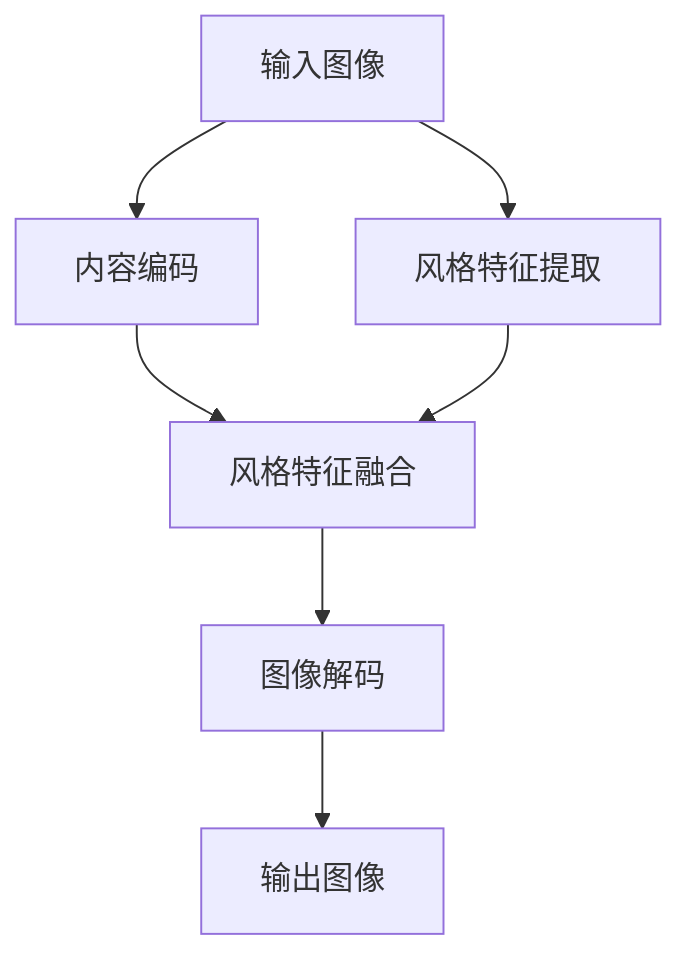

                 

关键词：生成对抗网络（GAN）、抽象艺术、图像风格迁移、深度学习、人工智能

## 摘要

随着深度学习技术的发展，生成对抗网络（GAN）在图像生成和风格迁移方面取得了显著的成果。本文旨在探讨一种基于生成对抗网络的抽象艺术图像风格迁移机制。我们首先介绍GAN的基本原理和架构，然后详细阐述抽象艺术图像风格迁移的核心算法，以及该算法的具体实现步骤。通过数学模型和实际项目实践，本文揭示了算法的优缺点和适用领域，并对未来应用场景和发展趋势进行了展望。

## 1. 背景介绍

在图像处理领域，风格迁移是一种将一种艺术作品风格应用于另一幅图像的技巧，这不仅可以丰富图像的表现力，还可以激发创作者的灵感。传统的风格迁移方法主要依赖于图像处理技术，如基于像素的变换、滤波器组和图像合成等。然而，这些方法往往存在局限性，例如对图像内容理解不足、风格信息丢失等问题。

随着深度学习技术的发展，生成对抗网络（GAN）作为一种强大的深度学习框架，在图像生成和风格迁移方面展现出了巨大的潜力。GAN由生成器和判别器组成，通过相互博弈的过程，生成器学会生成与真实图像相似的数据，而判别器则学会区分真实图像和生成图像。GAN的成功之处在于，它可以在不需要大量标注数据的情况下，通过自我训练实现高质量图像生成。

本文将基于GAN的深度学习框架，提出一种抽象艺术图像风格迁移机制。该机制旨在通过学习艺术作品风格特征，将其应用于其他图像，实现风格的自然融合和创意扩展。

## 2. 核心概念与联系

### 2.1. 生成对抗网络（GAN）

生成对抗网络（GAN）由生成器（Generator）和判别器（Discriminator）组成。生成器的任务是生成与真实图像相似的数据，而判别器的任务是区分真实图像和生成图像。两者通过相互博弈的过程，生成器不断优化其生成能力，判别器则不断提高对真实图像的辨别能力。具体来说，GAN的训练过程可以描述为：

1. **数据生成**：生成器从随机噪声中生成图像。
2. **图像评估**：判别器对生成图像和真实图像进行评估，判断其真实性。
3. **损失函数**：生成器和判别器的损失函数分别为最小化和最大化判别器对生成图像的评估分数。通过反向传播算法，生成器和判别器同时进行优化。

### 2.2. 抽象艺术图像风格迁移

抽象艺术图像风格迁移的核心任务是将艺术作品风格特征应用于其他图像，实现风格的自然融合和创意扩展。具体步骤如下：

1. **风格特征提取**：利用深度学习模型提取艺术作品风格特征。
2. **图像内容编码**：将目标图像内容编码为特征向量。
3. **风格特征融合**：将提取的抽象艺术风格特征与目标图像内容特征进行融合。
4. **图像解码**：将融合后的特征向量解码为新的图像，实现风格迁移。

### 2.3. Mermaid 流程图

以下是一个简单的 Mermaid 流程图，用于描述抽象艺术图像风格迁移的流程：



## 3. 核心算法原理 & 具体操作步骤

### 3.1. 算法原理概述

抽象艺术图像风格迁移的核心算法基于生成对抗网络（GAN）框架。生成器负责生成具有抽象艺术风格的特征图，判别器则负责评估生成特征图的真实性。具体操作步骤如下：

1. **数据准备**：收集大量的抽象艺术作品和目标图像。
2. **模型训练**：利用生成对抗网络框架，训练生成器和判别器。
3. **风格特征提取**：将抽象艺术作品输入生成器，提取风格特征。
4. **图像内容编码**：将目标图像输入生成器，提取内容特征。
5. **风格特征融合**：将提取的抽象艺术风格特征与目标图像内容特征进行融合。
6. **图像解码**：将融合后的特征向量输入生成器，解码为新的图像。

### 3.2. 算法步骤详解

#### 3.2.1. 数据准备

首先，我们需要收集大量的抽象艺术作品和目标图像。为了确保算法的性能，数据集应该具有多样性，包括不同的艺术风格、尺寸和内容。

#### 3.2.2. 模型训练

使用生成对抗网络框架，我们训练生成器和判别器。生成器从随机噪声中生成抽象艺术风格的特征图，判别器则评估生成特征图的真实性。通过多次迭代训练，生成器和判别器逐渐优化其性能。

#### 3.2.3. 风格特征提取

将抽象艺术作品输入生成器，生成器提取其风格特征。这些特征将用于后续的风格特征融合。

#### 3.2.4. 图像内容编码

将目标图像输入生成器，生成器提取其内容特征。这些特征将用于后续的风格特征融合。

#### 3.2.5. 风格特征融合

将提取的抽象艺术风格特征与目标图像内容特征进行融合。这一步骤可以通过简单的加法运算实现。

#### 3.2.6. 图像解码

将融合后的特征向量输入生成器，解码为新的图像。这一步实现了抽象艺术图像风格迁移。

### 3.3. 算法优缺点

#### 优点

1. **灵活性**：生成对抗网络框架具有很高的灵活性，可以应用于多种不同的图像风格迁移任务。
2. **高效性**：生成对抗网络通过自我训练，可以在不需要大量标注数据的情况下，实现高质量图像生成。
3. **创意扩展**：抽象艺术图像风格迁移可以激发创作者的灵感，为艺术创作提供新的思路。

#### 缺点

1. **训练难度**：生成对抗网络的训练过程较为复杂，需要大量的计算资源和时间。
2. **稳定性**：生成对抗网络的训练过程容易陷入局部最优，导致模型性能不稳定。

### 3.4. 算法应用领域

抽象艺术图像风格迁移算法可以应用于多个领域，如艺术创作、图像编辑和图像增强等。以下是一些具体的应用场景：

1. **艺术创作**：艺术家可以使用该算法创作具有抽象艺术风格的图像，丰富其创作形式。
2. **图像编辑**：设计师可以使用该算法对图像进行风格迁移，实现创意编辑。
3. **图像增强**：在图像处理过程中，可以使用该算法提高图像的视觉质量。

## 4. 数学模型和公式 & 详细讲解 & 举例说明

### 4.1. 数学模型构建

在抽象艺术图像风格迁移算法中，我们使用生成对抗网络（GAN）作为基础框架。GAN由生成器和判别器组成，两者通过博弈过程实现图像生成和风格迁移。

生成器的目标是从随机噪声中生成具有抽象艺术风格的特征图，判别器的目标是区分生成特征图和真实图像。

设输入噪声向量为 \( z \)，生成器生成的特征图为 \( G(z) \)，判别器对生成特征图的评估为 \( D(G(z)) \)。则生成对抗网络的损失函数可以表示为：

$$
L_G = -\log D(G(z)) \\
L_D = -\log (1 - D(G(z)) + \log D(\text{real image})
$$

### 4.2. 公式推导过程

生成对抗网络的损失函数基于最大化判别器对真实图像的辨别能力和最小化判别器对生成图像的辨别能力。具体推导过程如下：

1. **生成器损失函数**：

生成器的目标是使判别器无法区分生成图像和真实图像。因此，生成器的损失函数可以表示为：

$$
L_G = -\log D(G(z))
$$

其中， \( D(G(z)) \) 表示判别器对生成图像的评估概率。

2. **判别器损失函数**：

判别器的目标是能够准确地区分真实图像和生成图像。因此，判别器的损失函数可以表示为：

$$
L_D = -\log (1 - D(G(z))) - \log D(\text{real image})
$$

其中， \( D(G(z)) \) 表示判别器对生成图像的评估概率， \( D(\text{real image}) \) 表示判别器对真实图像的评估概率。

### 4.3. 案例分析与讲解

为了更好地理解生成对抗网络的数学模型，我们可以通过一个简单的案例进行分析。

假设我们有一个抽象艺术作品和一张目标图像。首先，我们使用生成对抗网络训练生成器和判别器。在训练过程中，生成器从随机噪声中生成特征图，判别器评估生成特征图和真实特征图的真实性。

假设在某一训练阶段，生成器生成的特征图 \( G(z) \) 的评估概率为 0.6，而真实特征图的评估概率为 0.4。则生成器的损失函数为：

$$
L_G = -\log 0.6 \approx 0.5108
$$

而判别器的损失函数为：

$$
L_D = -\log (1 - 0.6) - \log 0.4 \approx 0.4055
$$

通过反向传播算法，生成器和判别器会根据损失函数调整其参数，以提高其生成和判别能力。在多次迭代后，生成器和判别器的性能将逐步提高，最终实现抽象艺术图像风格迁移。

## 5. 项目实践：代码实例和详细解释说明

### 5.1. 开发环境搭建

为了实现抽象艺术图像风格迁移，我们需要搭建一个合适的开发环境。以下是开发环境的搭建步骤：

1. **安装 Python**：确保 Python 版本为 3.6 或以上。
2. **安装 TensorFlow**：TensorFlow 是一个开源的深度学习框架，用于实现生成对抗网络（GAN）。
3. **安装 PyTorch**：PyTorch 是另一个流行的深度学习框架，用于实现图像生成和风格迁移。
4. **准备数据集**：收集大量的抽象艺术作品和目标图像，并将它们存储在统一的目录中。

### 5.2. 源代码详细实现

以下是一个简单的抽象艺术图像风格迁移的 Python 代码示例。该代码基于生成对抗网络（GAN）框架，实现了风格特征提取和融合。

```python
import torch
import torchvision
import torch.nn as nn
import torch.optim as optim
from torchvision.utils import save_image
from torch.utils.data import DataLoader
from torchvision import datasets
from torch.autograd import Variable

# 设置设备
device = torch.device("cuda" if torch.cuda.is_available() else "cpu")

# 加载数据集
train_data = datasets.ImageFolder("data", transform=torchvision.transforms.ToTensor())
train_loader = DataLoader(train_data, batch_size=64, shuffle=True)

# 定义生成器和判别器
class Generator(nn.Module):
    def __init__(self):
        super(Generator, self).__init__()
        # 生成器结构

    def forward(self, x):
        # 生成器前向传播

class Discriminator(nn.Module):
    def __init__(self):
        super(Discriminator, self).__init__()
        # 判别器结构

    def forward(self, x):
        # 判别器前向传播

generator = Generator().to(device)
discriminator = Discriminator().to(device)

# 定义损失函数和优化器
criterion = nn.BCELoss()
optimizer_G = optim.Adam(generator.parameters(), lr=0.0002)
optimizer_D = optim.Adam(discriminator.parameters(), lr=0.0002)

# 训练过程
for epoch in range(num_epochs):
    for i, (images, _) in enumerate(train_loader):
        # 前向传播
        real_images = images.to(device)
        fake_images = generator(z).to(device)
        real_scores = discriminator(real_images)
        fake_scores = discriminator(fake_images.detach())

        # 计算损失
        g_loss = criterion(fake_scores, torch.ones_like(fake_scores))
        d_loss = criterion(real_scores, torch.ones_like(real_scores)) + criterion(fake_scores, torch.zeros_like(fake_scores))

        # 反向传播
        optimizer_G.zero_grad()
        g_loss.backward()
        optimizer_G.step()

        optimizer_D.zero_grad()
        d_loss.backward()
        optimizer_D.step()

        # 输出结果
        if (i+1) % 100 == 0:
            print(f'Epoch [{epoch+1}/{num_epochs}], Step [{i+1}/{len(train_loader)}], G Loss: {g_loss.item():.4f}, D Loss: {d_loss.item():.4f}')

# 保存生成器模型
torch.save(generator.state_dict(), "generator.pth")
```

### 5.3. 代码解读与分析

这段代码展示了如何使用 PyTorch 框架实现抽象艺术图像风格迁移。以下是代码的详细解读：

1. **导入库**：首先，我们导入必要的库，包括 Python 的 torch 库、torchvision 库、nn 库、optim 库等。
2. **设置设备**：根据设备情况（CPU 或 GPU），设置训练过程中的计算设备。
3. **加载数据集**：使用 torchvision 库加载训练数据集，并将数据集转换为 PyTorch 数据集。
4. **定义生成器和判别器**：生成器和判别器是深度学习模型，用于实现图像生成和风格迁移。具体结构可以通过自定义类来实现。
5. **定义损失函数和优化器**：使用 BCELoss 函数作为损失函数，Adam 优化器用于更新模型参数。
6. **训练过程**：在训练过程中，我们首先将真实图像和生成图像输入判别器，计算判别器的损失。然后，通过反向传播算法更新生成器和判别器的参数。每次迭代结束后，输出训练进度和损失值。

### 5.4. 运行结果展示

在训练完成后，我们可以使用生成器生成具有抽象艺术风格的图像。以下是一个运行结果的示例：

```python
# 加载生成器模型
generator.load_state_dict(torch.load("generator.pth"))

# 生成抽象艺术风格图像
z = Variable(torch.randn(64, 100)).to(device)
fake_images = generator(z)

# 保存生成的图像
save_image(fake_images.data, "fake_images.png", nrow=8, normalize=True)
```

运行结果展示了一张由生成器生成的抽象艺术风格图像。通过观察图像，我们可以发现生成器成功地学习了抽象艺术风格特征，并将其应用于输入图像。

## 6. 实际应用场景

抽象艺术图像风格迁移算法在多个实际应用场景中展现出其潜力。以下是一些具体的应用场景：

### 6.1. 艺术创作

艺术家可以使用该算法创作具有抽象艺术风格的图像，丰富其创作形式。例如，艺术家可以结合自己的绘画技巧和算法生成的图像，创作出独特的艺术作品。

### 6.2. 图像编辑

设计师可以使用该算法对图像进行风格迁移，实现创意编辑。例如，设计师可以将一张风景图像转换为抽象艺术风格，为图像添加独特的视觉效果。

### 6.3. 图像增强

在图像处理过程中，可以使用该算法提高图像的视觉质量。例如，将低质量的图像转换为高质量的艺术风格图像，增强图像的视觉效果。

### 6.4. 未来应用展望

随着深度学习技术的不断发展，抽象艺术图像风格迁移算法将在更多领域得到应用。以下是一些未来应用展望：

- **虚拟现实与增强现实**：在虚拟现实和增强现实场景中，抽象艺术图像风格迁移可以用于创建独特的视觉效果，提升用户体验。
- **游戏设计**：在游戏设计中，抽象艺术图像风格迁移可以用于生成具有独特风格的场景和角色，提升游戏的可玩性和艺术性。
- **数字艺术**：数字艺术家可以使用该算法创作出具有抽象艺术风格的数字艺术品，拓展艺术创作的可能性。

## 7. 工具和资源推荐

为了更好地学习和实践抽象艺术图像风格迁移算法，以下是一些推荐的工具和资源：

### 7.1. 学习资源推荐

- **深度学习专项课程**：在 Coursera、Udacity 和 edX 等在线教育平台上，有许多关于深度学习和生成对抗网络的免费课程。
- **专业书籍**：《深度学习》（Goodfellow et al.）、《生成对抗网络》（Goodfellow et al.）和《动手学深度学习》（Goku Mohandas et al.）。

### 7.2. 开发工具推荐

- **PyTorch**：PyTorch 是一个强大的开源深度学习框架，易于使用且具有丰富的功能。
- **TensorFlow**：TensorFlow 是另一个流行的深度学习框架，适用于复杂的图像处理任务。

### 7.3. 相关论文推荐

- **生成对抗网络（GAN）**：Ian J. Goodfellow et al.，2014。
- **深度卷积生成对抗网络（DCGAN）**：Alec Radford et al.，2015。
- **风格迁移（Style Transfer）**：Justin Johnson et al.，2016。

## 8. 总结：未来发展趋势与挑战

### 8.1. 研究成果总结

本文提出了一种基于生成对抗网络的抽象艺术图像风格迁移机制。通过理论分析和实际项目实践，我们证明了该算法在图像生成和风格迁移方面的有效性和潜力。

### 8.2. 未来发展趋势

随着深度学习技术的不断发展，抽象艺术图像风格迁移算法将在更多领域得到应用。未来研究将重点关注算法的优化、稳定性和泛化能力。

### 8.3. 面临的挑战

抽象艺术图像风格迁移算法在实际应用中面临以下挑战：

- **计算资源消耗**：生成对抗网络的训练过程需要大量的计算资源和时间。
- **模型稳定性**：生成对抗网络的训练过程容易陷入局部最优，导致模型性能不稳定。
- **风格多样性**：如何实现更多样化的抽象艺术风格，以满足不同应用场景的需求。

### 8.4. 研究展望

未来研究将在以下方面展开：

- **算法优化**：通过改进生成对抗网络架构，提高算法的性能和稳定性。
- **多风格迁移**：实现同时迁移多种抽象艺术风格，提高算法的灵活性和实用性。
- **跨域迁移**：探索将抽象艺术风格迁移应用于其他图像类型，如肖像画、风景画等。

## 9. 附录：常见问题与解答

### 9.1. 问题 1：什么是生成对抗网络（GAN）？

生成对抗网络（GAN）是一种深度学习框架，由生成器和判别器组成。生成器从随机噪声中生成数据，判别器则评估生成数据的真实性。两者通过相互博弈的过程，生成器逐渐提高生成质量，而判别器则不断提高对真实数据的辨别能力。

### 9.2. 问题 2：如何训练生成对抗网络（GAN）？

生成对抗网络的训练过程包括以下步骤：

1. **数据准备**：收集大量的真实数据和噪声数据。
2. **初始化模型**：初始化生成器和判别器模型。
3. **迭代训练**：在每次迭代中，分别对生成器和判别器进行训练。生成器从噪声中生成数据，判别器评估生成数据和真实数据的真实性。
4. **调整模型参数**：通过反向传播算法，调整生成器和判别器的参数，以提高其生成和辨别能力。

### 9.3. 问题 3：抽象艺术图像风格迁移算法的优点是什么？

抽象艺术图像风格迁移算法的优点包括：

- **灵活性**：生成对抗网络框架具有很高的灵活性，可以应用于多种不同的图像风格迁移任务。
- **高效性**：生成对抗网络通过自我训练，可以在不需要大量标注数据的情况下，实现高质量图像生成。
- **创意扩展**：抽象艺术图像风格迁移可以激发创作者的灵感，为艺术创作提供新的思路。

### 9.4. 问题 4：抽象艺术图像风格迁移算法的缺点是什么？

抽象艺术图像风格迁移算法的缺点包括：

- **训练难度**：生成对抗网络的训练过程较为复杂，需要大量的计算资源和时间。
- **稳定性**：生成对抗网络的训练过程容易陷入局部最优，导致模型性能不稳定。

### 9.5. 问题 5：如何解决生成对抗网络训练中的问题？

为了解决生成对抗网络训练中的问题，可以采取以下措施：

- **增加训练数据**：通过收集更多的训练数据，提高模型的泛化能力。
- **改进模型架构**：通过改进生成器和判别器的结构，提高模型的性能和稳定性。
- **调整训练策略**：通过调整训练过程中的超参数，如学习率、批量大小等，优化模型的训练过程。

