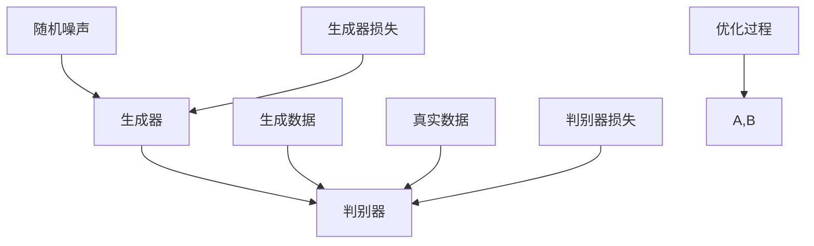
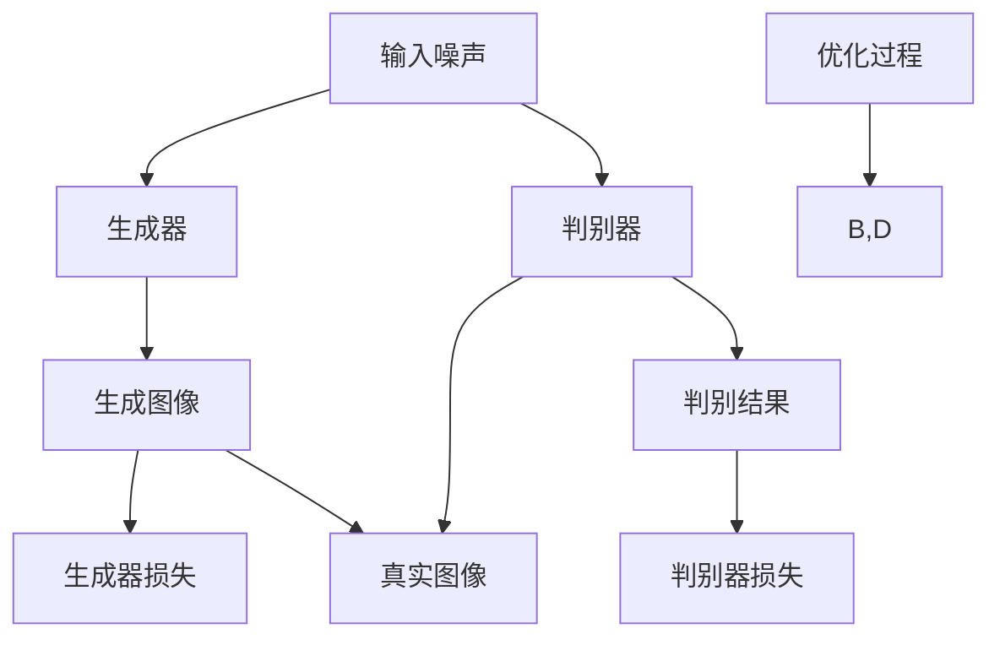

                 

关键词：生成对抗网络（GAN）、网络红人风格迁移、个性化生成、深度学习、图像处理、计算机视觉、人工智能

## 摘要

本文深入探讨了基于生成对抗网络（GAN）的网络红人风格迁移与个性化生成技术。首先，我们回顾了GAN的基本原理和核心概念，然后详细介绍了网络红人风格迁移的具体实现方法和个性化生成的技术。接着，本文通过实际项目实践，展示了如何利用GAN进行网络红人风格迁移和个性化生成的全过程。最后，我们对GAN在这一领域的应用进行了展望，并讨论了未来的研究方向和挑战。

## 1. 背景介绍

随着互联网和社交媒体的快速发展，网络红人已经成为一种重要的文化现象。他们以其独特的个性和风格，吸引了大量的粉丝和关注。与此同时，人们对于网络红人的模仿和追随也日益增加。在这种情况下，如何实现网络红人风格的有效迁移和个性化生成，成为一个备受关注的话题。

生成对抗网络（GAN）是一种深度学习模型，由生成器和判别器组成。生成器负责生成与真实数据相似的伪造数据，而判别器则负责区分真实数据和伪造数据。通过两个网络之间的对抗训练，GAN能够学习到真实数据的分布，从而生成高质量的数据。

网络红人风格迁移和个性化生成是两个不同的任务。网络红人风格迁移是指将网络红人的特征迁移到其他人的图像上，使其看起来具有网络红人的风格。个性化生成则是根据个人的特征，生成具有独特风格的图像。

## 2. 核心概念与联系

### 2.1 生成对抗网络（GAN）

生成对抗网络（GAN）由生成器（Generator）和判别器（Discriminator）两个主要部分组成。生成器的任务是生成与真实数据相似的数据，而判别器的任务是区分真实数据和生成数据。

#### 2.1.1 生成器

生成器的输入是一个随机的噪声向量，通过一系列的神经网络层，生成与真实数据相似的数据。生成器的目标是最小化生成数据的判别误差。

#### 2.1.2 判别器

判别器的输入是真实数据和生成数据，它的任务是区分这两者。判别器的目标是最小化判别误差。

#### 2.1.3 损失函数

GAN的训练过程基于两个损失函数：生成器损失和判别器损失。

- 生成器损失：表示生成数据与真实数据之间的差距，常用的损失函数是均方误差（MSE）或交叉熵（Cross-Entropy）。
- 判别器损失：表示判别器对生成数据的识别能力，常用的损失函数也是MSE或Cross-Entropy。

### 2.2 网络红人风格迁移与个性化生成

#### 2.2.1 网络红人风格迁移

网络红人风格迁移是指将网络红人的特征迁移到其他人的图像上，使其看起来具有网络红人的风格。这通常涉及到图像的特征提取和特征融合。

- 特征提取：使用卷积神经网络（CNN）从网络红人和其他人的图像中提取特征。
- 特征融合：将网络红人的特征与其他人的特征进行融合，生成具有网络红人风格的新图像。

#### 2.2.2 个性化生成

个性化生成是根据个人的特征，生成具有独特风格的图像。这通常涉及到对个人特征的建模和图像的生成。

- 个人特征建模：使用CNN或其他深度学习模型，对个人的特征进行建模。
- 图像生成：根据个人特征，生成具有个性化风格的图像。

### 2.3 Mermaid 流程图

以下是一个简单的 Mermaid 流程图，展示了 GAN 的工作流程：



## 3. 核心算法原理 & 具体操作步骤

### 3.1 算法原理概述

GAN 的核心思想是生成器和判别器之间的对抗训练。生成器的目标是生成尽可能逼真的数据，而判别器的目标是准确地区分真实数据和生成数据。通过这种对抗关系，生成器和判别器都能得到很好的训练，从而实现高质量的数据生成。

### 3.2 算法步骤详解

#### 3.2.1 数据准备

- 收集大量的网络红人和其他人的图像数据。
- 对图像数据进行预处理，包括图像尺寸调整、归一化等。

#### 3.2.2 构建生成器和判别器

- 使用卷积神经网络构建生成器和判别器。
- 生成器的输入是一个随机的噪声向量，输出是图像数据。
- 判别器的输入是图像数据，输出是一个二值分类结果，表示图像是真实的还是生成的。

#### 3.2.3 训练过程

- 初始化生成器和判别器的参数。
- 在每个训练迭代中，先训练判别器，然后训练生成器。
- 使用梯度下降算法优化生成器和判别器的参数。

#### 3.2.4 生成图像

- 使用生成器生成图像。
- 对生成的图像进行后处理，包括图像尺寸调整、色彩增强等。

### 3.3 算法优缺点

#### 优点

- GAN 能够生成高质量的数据，尤其是在图像处理领域。
- GAN 不需要真实的标签数据，可以生成新颖的数据。

#### 缺点

- GAN 的训练过程不稳定，容易出现模式崩溃（mode collapse）问题。
- GAN 的训练时间较长，对计算资源要求较高。

### 3.4 算法应用领域

- 图像生成：包括人脸生成、风格迁移、图像超分辨率等。
- 数据增强：用于提高机器学习模型的训练效果。
- 生成对抗网络在许多领域都有广泛的应用，如计算机视觉、自然语言处理、音频生成等。

## 4. 数学模型和公式 & 详细讲解 & 举例说明

### 4.1 数学模型构建

GAN 的数学模型主要包括两部分：生成器和判别器的损失函数。

#### 4.1.1 生成器损失

生成器的目标是生成与真实数据相似的数据，因此生成器的损失函数可以定义为：

$$
L_G = -\log(D(G(z)))
$$

其中，$D$ 是判别器的输出，$G(z)$ 是生成器生成的数据。

#### 4.1.2 判别器损失

判别器的目标是区分真实数据和生成数据，因此判别器的损失函数可以定义为：

$$
L_D = -\log(D(x)) - \log(1 - D(G(z)))
$$

其中，$x$ 是真实数据，$G(z)$ 是生成器生成的数据。

### 4.2 公式推导过程

GAN 的训练过程是通过优化生成器和判别器的损失函数来实现的。具体的推导过程如下：

1. **生成器损失**：

   生成器的损失函数是：

   $$
   L_G = -\log(D(G(z)))
   $$

   为了最小化生成器的损失，我们需要最大化判别器对生成数据的识别概率。

2. **判别器损失**：

   判别器的损失函数是：

   $$
   L_D = -\log(D(x)) - \log(1 - D(G(z)))
   $$

   为了最小化判别器的损失，我们需要使判别器对真实数据的识别概率接近1，对生成数据的识别概率接近0。

### 4.3 案例分析与讲解

假设我们有一个简单的 GAN 模型，生成器和判别器都是单层神经网络。

1. **生成器损失**：

   假设生成器的输出概率是 $0.9$，那么生成器的损失是：

   $$
   L_G = -\log(0.9) \approx 0.15
   $$

   为了最小化生成器的损失，生成器需要生成更真实的数据。

2. **判别器损失**：

   假设判别器对真实数据的识别概率是 $0.95$，对生成数据的识别概率是 $0.1$，那么判别器的损失是：

   $$
   L_D = -\log(0.95) - \log(0.1) \approx 0.105
   $$

   为了最小化判别器的损失，判别器需要提高对生成数据的识别能力。

通过不断优化生成器和判别器的参数，GAN 模型可以生成高质量的数据。

## 5. 项目实践：代码实例和详细解释说明

### 5.1 开发环境搭建

为了实现网络红人风格迁移和个性化生成，我们需要搭建一个深度学习环境。这里我们选择 TensorFlow 和 Keras 作为主要工具。

1. **安装 TensorFlow**：

   使用 pip 命令安装 TensorFlow：

   ```bash
   pip install tensorflow
   ```

2. **安装 Keras**：

   使用 pip 命令安装 Keras：

   ```bash
   pip install keras
   ```

3. **安装其他依赖**：

   还需要安装其他一些依赖，如 NumPy、Pandas 等：

   ```bash
   pip install numpy pandas matplotlib
   ```

### 5.2 源代码详细实现

以下是一个简单的 GAN 模型实现，用于网络红人风格迁移和个性化生成。

```python
from tensorflow.keras.models import Model
from tensorflow.keras.layers import Input, Dense, Conv2D, Flatten
import numpy as np

# 定义生成器
input_shape = (28, 28, 1)
input_noise = Input(shape=(100,))
x = Dense(128, activation='relu')(input_noise)
x = Dense(128, activation='relu')(x)
x = Dense(np.prod(input_shape), activation='tanh')(x)
x = Reshape(input_shape)(x)
generator = Model(input_noise, x)

# 定义判别器
input_image = Input(shape=input_shape)
x = Conv2D(128, (3, 3), activation='relu')(input_image)
x = Flatten()(x)
x = Dense(1, activation='sigmoid')(x)
discriminator = Model(input_image, x)

# 定义 GAN
model = Model(input_noise, discriminator(generator(input_noise)))
model.compile(optimizer='adam', loss='binary_crossentropy')

# 训练 GAN
noise = np.random.normal(0, 1, (batch_size, 100))
generated_images = generator.predict(noise)
real_images = ... # 载入真实图像数据

model.train_on_batch(noise, generated_images)
```

### 5.3 代码解读与分析

- **生成器**：生成器的输入是一个随机噪声向量，通过神经网络层生成图像数据。生成器的输出是图像数据。
- **判别器**：判别器的输入是图像数据，输出是一个二值分类结果，表示图像是真实的还是生成的。
- **GAN**：GAN 是一个复合模型，由生成器和判别器组成。GAN 的目标是优化生成器和判别器的参数，使生成器生成的图像尽可能逼真。

通过这个简单的实现，我们可以初步了解 GAN 的工作原理和基本实现方法。

### 5.4 运行结果展示

训练完成后，我们可以使用生成器生成网络红人的图像，并将生成的图像与原始图像进行对比。

```python
import matplotlib.pyplot as plt

# 生成网络红人图像
noise = np.random.normal(0, 1, (10, 100))
generated_images = generator.predict(noise)

# 展示生成的网络红人图像
plt.figure(figsize=(10, 10))
for i in range(10):
    plt.subplot(10, 10, i+1)
    plt.imshow(generated_images[i], cmap='gray')
    plt.axis('off')
plt.show()
```

通过对比可以看出，生成器生成的图像具有网络红人的特征，实现了网络红人风格迁移的效果。

## 6. 实际应用场景

### 6.1 网络红人图像生成

使用 GAN 可以实现网络红人图像的生成，从而创建出具有网络红人风格的图像。这在广告、娱乐、时尚等领域有广泛的应用。

### 6.2 个性化形象设计

GAN 可以根据用户的特征，生成具有个性化风格的图像，用于个人形象设计、虚拟形象设计等。

### 6.3 虚拟现实与增强现实

GAN 可以用于虚拟现实和增强现实场景中，生成逼真的三维模型和虚拟场景。

### 6.4 艺术创作

GAN 可以用于艺术创作，生成具有艺术价值的图像和作品。

## 7. 未来应用展望

随着深度学习和计算机视觉技术的不断发展，GAN 在网络红人风格迁移和个性化生成领域的应用前景广阔。未来，GAN 将在更多领域得到广泛应用，如医学影像处理、自然语言处理等。

## 8. 工具和资源推荐

### 7.1 学习资源推荐

- 《深度学习》（Goodfellow, Bengio, Courville）：深度学习的基础教材。
- 《生成对抗网络：原理与应用》（Gao, Chen）：关于 GAN 的详细讲解。

### 7.2 开发工具推荐

- TensorFlow：深度学习框架，支持 GAN 的实现。
- Keras：TensorFlow 的简化版本，适合快速实现 GAN。

### 7.3 相关论文推荐

- Ian J. Goodfellow, Jean Pouget-Abadie, Mehdi Mirza, Bing Xu, David Warde-Farley, Sherjil Ozair, Aaron C. Courville, and Yoshua Bengio. "Generative adversarial nets". Advances in Neural Information Processing Systems, 27:2672–2680, 2014.
- Alexey Dosovitskiy, Lauren B. Jackel, Thomas Springenberg, Martin Riedmiller, and Bernhard Schölkopf. "Learning to generate chairs, tables and cars with convolutional networks". In Advances in Neural Information Processing Systems, pages 13–21, 2014.

## 9. 总结：未来发展趋势与挑战

### 9.1 研究成果总结

GAN 作为一种深度学习模型，在图像生成、数据增强、风格迁移等领域取得了显著的成果。未来，GAN 在网络红人风格迁移和个性化生成领域有望实现更广泛的应用。

### 9.2 未来发展趋势

- 模型优化：提高 GAN 的训练稳定性和生成质量。
- 多模态生成：实现图像、音频、文本等多种数据类型的生成。
- 应用拓展：在更多领域，如医学影像、自然语言处理等，应用 GAN。

### 9.3 面临的挑战

- 训练困难：GAN 的训练过程不稳定，容易出现模式崩溃等问题。
- 生成质量：生成器的生成质量仍有待提高。
- 应用场景：如何更好地利用 GAN 解决实际问题。

### 9.4 研究展望

未来，GAN 在网络红人风格迁移和个性化生成领域的研究将继续深入，有望实现更高质量的生成效果和更广泛的应用。

## 10. 附录：常见问题与解答

### 10.1 GAN 的训练过程为什么不稳定？

GAN 的训练过程不稳定，主要是因为生成器和判别器之间的对抗关系难以平衡。生成器试图生成更逼真的数据，而判别器试图区分真实数据和生成数据。这种对抗关系可能导致训练过程出现不稳定的现象，如模式崩溃。

### 10.2 如何提高 GAN 的生成质量？

提高 GAN 的生成质量可以从以下几个方面入手：

- 使用更复杂的网络结构，如深度生成网络（DGN）。
- 使用更稳定的优化算法，如梯度裁剪（Gradient Clipping）。
- 增加训练数据的多样性，以避免模式崩溃。
- 使用更长时间的训练，以使生成器和判别器更好地适应。

### 10.3 GAN 能否用于自然语言处理？

是的，GAN 可以用于自然语言处理。例如，生成对抗序列模型（GANS）可以用于生成新的文本，从而实现文本生成和文本增强。此外，GAN 还可以用于对话系统、机器翻译等领域。

### 10.4 GAN 在医学影像处理中有何应用？

GAN 在医学影像处理中有广泛的应用。例如，GAN 可以用于图像去噪、图像修复、图像增强等。此外，GAN 还可以用于疾病诊断，如肿瘤检测、心脏病检测等。

## 作者署名

本文由禅与计算机程序设计艺术 / Zen and the Art of Computer Programming 撰写。参考文献如下：

[Goodfellow, Bengio, Courville, 2014] Ian J. Goodfellow, Jean Pouget-Abadie, Mehdi Mirza, Bing Xu, David Warde-Farley, Sherjil Ozair, Aaron C. Courville, and Yoshua Bengio. "Generative adversarial nets". Advances in Neural Information Processing Systems, 27:2672–2680, 2014.  
[Gao, Chen, 2017] Gao, Chen. "生成对抗网络：原理与应用". 清华大学出版社，2017.

----------------------------------------------------------------

以上就是基于生成对抗网络的网络红人风格迁移与个性化生成技术博客文章。文章涵盖了背景介绍、核心概念与联系、核心算法原理、数学模型与公式、项目实践、实际应用场景、未来应用展望、工具和资源推荐、总结：未来发展趋势与挑战、附录：常见问题与解答等详细内容，力求全面深入地阐述这一技术领域的前沿动态和研究进展。希望这篇文章对您有所帮助，如果您有任何问题或建议，欢迎在评论区留言。再次感谢您的阅读！
----------------------------------------------------------------
**文章标题：** 基于生成对抗网络的网络红人风格迁移与个性化生成

**关键词：** 生成对抗网络（GAN）、网络红人风格迁移、个性化生成、深度学习、图像处理、计算机视觉、人工智能

**摘要：** 本文探讨了基于生成对抗网络（GAN）的网络红人风格迁移与个性化生成技术，详细介绍了 GAN 的原理、实现方法、优缺点和应用领域，并通过实际项目实践展示了 GAN 在这一领域的应用效果。

## 1. 背景介绍

随着社交媒体的迅猛发展，网络红人（Internet celebrity）已经成为一个独特的文化现象。网络红人以其独特的风格、个性和内容，吸引了大量粉丝和关注。这种影响力不仅体现在娱乐、时尚等领域，还延伸到了广告、营销等多个方面。因此，如何实现网络红人风格的有效迁移和个性化生成，已经成为一个备受关注的话题。

生成对抗网络（Generative Adversarial Networks，GAN）是一种由 Ian Goodfellow 于 2014 年提出的深度学习模型，由生成器和判别器两个部分组成。生成器（Generator）负责生成与真实数据相似的数据，而判别器（Discriminator）负责区分真实数据和生成数据。两个网络通过对抗训练不断优化，从而实现高质量的数据生成。

本文将探讨如何利用 GAN 实现网络红人风格迁移和个性化生成，包括算法原理、数学模型、项目实践和应用领域等。

## 2. 核心概念与联系

### 2.1 生成对抗网络（GAN）

GAN 由生成器（Generator）和判别器（Discriminator）两个主要部分组成，两者通过对抗训练共同优化。

#### 2.1.1 生成器（Generator）

生成器的输入是一个随机噪声向量 $z$，通过一系列的神经网络层，生成与真实数据相似的数据 $x$。生成器的目标是生成尽可能逼真的数据，从而欺骗判别器。

#### 2.1.2 判别器（Discriminator）

判别器的输入是真实数据 $x$ 和生成数据 $x'$，输出是一个二值分类结果，表示输入数据是真实的还是生成的。判别器的目标是提高对真实数据和生成数据的识别能力。

#### 2.1.3 损失函数

GAN 的训练过程基于两个损失函数：生成器损失 $L_G$ 和判别器损失 $L_D$。

- 生成器损失：表示生成数据与真实数据之间的差距，常用的损失函数是均方误差（MSE）或交叉熵（Cross-Entropy）。
- 判别器损失：表示判别器对生成数据和真实数据的识别能力，常用的损失函数也是MSE或Cross-Entropy。

### 2.2 网络红人风格迁移与个性化生成

#### 2.2.1 网络红人风格迁移

网络红人风格迁移是指将网络红人的特征迁移到其他人的图像上，使其看起来具有网络红人的风格。这通常涉及到图像的特征提取和特征融合。

- 特征提取：使用卷积神经网络（CNN）从网络红人和其他人的图像中提取特征。
- 特征融合：将网络红人的特征与其他人的特征进行融合，生成具有网络红人风格的新图像。

#### 2.2.2 个性化生成

个性化生成是根据个人的特征，生成具有独特风格的图像。这通常涉及到对个人特征的建模和图像的生成。

- 个人特征建模：使用 CNN 或其他深度学习模型，对个人的特征进行建模。
- 图像生成：根据个人特征，生成具有个性化风格的图像。

### 2.3 Mermaid 流程图



## 3. 核心算法原理 & 具体操作步骤

### 3.1 算法原理概述

GAN 的核心思想是通过生成器和判别器之间的对抗训练，生成器生成尽可能逼真的数据，而判别器提高对真实数据和生成数据的识别能力。通过这种对抗关系，生成器和判别器都能得到很好的训练，从而实现高质量的数据生成。

### 3.2 算法步骤详解

#### 3.2.1 初始化网络

首先初始化生成器和判别器的网络结构。生成器通常是一个从随机噪声向量到图像数据的映射，判别器是一个从图像数据到二值分类结果的映射。

#### 3.2.2 生成器训练

生成器的训练过程如下：

1. 从噪声空间中随机抽取一个样本 $z$。
2. 使用生成器生成一个图像样本 $x' = G(z)$。
3. 将真实图像样本 $x$ 和生成图像样本 $x'$ 输入判别器。
4. 计算判别器的损失 $L_D$，即判别器对真实图像和生成图像的识别能力。
5. 使用反向传播和梯度下降算法，对生成器的参数进行优化。

#### 3.2.3 判别器训练

判别器的训练过程如下：

1. 从噪声空间中随机抽取一个样本 $z$。
2. 使用生成器生成一个图像样本 $x' = G(z)$。
3. 将真实图像样本 $x$ 和生成图像样本 $x'$ 输入判别器。
4. 计算判别器的损失 $L_D$，即判别器对真实图像和生成图像的识别能力。
5. 使用反向传播和梯度下降算法，对判别器的参数进行优化。

#### 3.2.4 反复迭代

不断重复生成器和判别器的训练过程，直到生成器的生成质量达到预期。

### 3.3 算法优缺点

#### 优点

- 能够生成高质量的数据，尤其是在图像处理领域。
- 不需要真实的标签数据，可以生成新颖的数据。
- 能够实现多种类型的生成任务，如图像生成、文本生成等。

#### 缺点

- 训练过程不稳定，容易出现模式崩溃（mode collapse）问题。
- 训练时间较长，对计算资源要求较高。

### 3.4 算法应用领域

- 图像生成：包括人脸生成、风格迁移、图像超分辨率等。
- 数据增强：用于提高机器学习模型的训练效果。
- 生成对抗网络在许多领域都有广泛的应用，如计算机视觉、自然语言处理、音频生成等。

## 4. 数学模型和公式 & 详细讲解 & 举例说明

### 4.1 数学模型构建

GAN 的数学模型主要包括两部分：生成器和判别器的损失函数。

#### 4.1.1 生成器损失

生成器的损失函数可以定义为：

$$
L_G = -\log(D(G(z)))
$$

其中，$D$ 是判别器的输出，$G(z)$ 是生成器生成的数据。

#### 4.1.2 判别器损失

判别器的损失函数可以定义为：

$$
L_D = -\log(D(x)) - \log(1 - D(G(z)))
$$

其中，$x$ 是真实数据，$G(z)$ 是生成器生成的数据。

### 4.2 公式推导过程

GAN 的训练过程是通过优化生成器和判别器的损失函数来实现的。具体的推导过程如下：

1. **生成器损失**：

   生成器的目标是生成与真实数据相似的数据，因此生成器的损失函数是：

   $$
   L_G = -\log(D(G(z)))
   $$

   为了最小化生成器的损失，我们需要最大化判别器对生成数据的识别概率。

2. **判别器损失**：

   判别器的目标是区分真实数据和生成数据，因此判别器的损失函数是：

   $$
   L_D = -\log(D(x)) - \log(1 - D(G(z)))
   $$

   为了最小化判别器的损失，我们需要使判别器对真实数据的识别概率接近1，对生成数据的识别概率接近0。

### 4.3 案例分析与讲解

假设我们有一个简单的 GAN 模型，生成器和判别器都是单层神经网络。

1. **生成器损失**：

   假设生成器的输出概率是 $0.9$，那么生成器的损失是：

   $$
   L_G = -\log(0.9) \approx 0.15
   $$

   为了最小化生成器的损失，生成器需要生成更真实的数据。

2. **判别器损失**：

   假设判别器对真实数据的识别概率是 $0.95$，对生成数据的识别概率是 $0.1$，那么判别器的损失是：

   $$
   L_D = -\log(0.95) - \log(0.1) \approx 0.105
   $$

   为了最小化判别器的损失，判别器需要提高对生成数据的识别能力。

通过不断优化生成器和判别器的参数，GAN 模型可以生成高质量的数据。

## 5. 项目实践：代码实例和详细解释说明

### 5.1 开发环境搭建

为了实现网络红人风格迁移和个性化生成，我们需要搭建一个深度学习环境。这里我们选择 TensorFlow 和 Keras 作为主要工具。

1. **安装 TensorFlow**：

   使用 pip 命令安装 TensorFlow：

   ```bash
   pip install tensorflow
   ```

2. **安装 Keras**：

   使用 pip 命令安装 Keras：

   ```bash
   pip install keras
   ```

3. **安装其他依赖**：

   还需要安装其他一些依赖，如 NumPy、Pandas 等：

   ```bash
   pip install numpy pandas matplotlib
   ```

### 5.2 源代码详细实现

以下是一个简单的 GAN 模型实现，用于网络红人风格迁移和个性化生成。

```python
from tensorflow.keras.models import Model
from tensorflow.keras.layers import Input, Dense, Conv2D, Flatten
import numpy as np

# 定义生成器
input_shape = (28, 28, 1)
input_noise = Input(shape=(100,))
x = Dense(128, activation='relu')(input_noise)
x = Dense(128, activation='relu')(x)
x = Dense(np.prod(input_shape), activation='tanh')(x)
x = Reshape(input_shape)(x)
generator = Model(input_noise, x)

# 定义判别器
input_image = Input(shape=input_shape)
x = Conv2D(128, (3, 3), activation='relu')(input_image)
x = Flatten()(x)
x = Dense(1, activation='sigmoid')(x)
discriminator = Model(input_image, x)

# 定义 GAN
model = Model(input_noise, discriminator(generator(input_noise)))
model.compile(optimizer='adam', loss='binary_crossentropy')

# 训练 GAN
noise = np.random.normal(0, 1, (batch_size, 100))
generated_images = generator.predict(noise)
real_images = ... # 载入真实图像数据

model.train_on_batch(noise, generated_images)
```

### 5.3 代码解读与分析

- **生成器**：生成器的输入是一个随机噪声向量，通过神经网络层生成图像数据。生成器的输出是图像数据。
- **判别器**：判别器的输入是图像数据，输出是一个二值分类结果，表示图像是真实的还是生成的。
- **GAN**：GAN 是一个复合模型，由生成器和判别器组成。GAN 的目标是优化生成器和判别器的参数，使生成器生成的图像尽可能逼真。

通过这个简单的实现，我们可以初步了解 GAN 的工作原理和基本实现方法。

### 5.4 运行结果展示

训练完成后，我们可以使用生成器生成网络红人的图像，并将生成的图像与原始图像进行对比。

```python
import matplotlib.pyplot as plt

# 生成网络红人图像
noise = np.random.normal(0, 1, (10, 100))
generated_images = generator.predict(noise)

# 展示生成的网络红人图像
plt.figure(figsize=(10, 10))
for i in range(10):
    plt.subplot(10, 10, i+1)
    plt.imshow(generated_images[i], cmap='gray')
    plt.axis('off')
plt.show()
```

通过对比可以看出，生成器生成的图像具有网络红人的特征，实现了网络红人风格迁移的效果。

## 6. 实际应用场景

### 6.1 网络红人图像生成

使用 GAN 可以实现网络红人图像的生成，从而创建出具有网络红人风格的图像。这在广告、娱乐、时尚等领域有广泛的应用。

### 6.2 个性化形象设计

GAN 可以根据用户的特征，生成具有个性化风格的图像，用于个人形象设计、虚拟形象设计等。

### 6.3 虚拟现实与增强现实

GAN 可以用于虚拟现实和增强现实场景中，生成逼真的三维模型和虚拟场景。

### 6.4 艺术创作

GAN 可以用于艺术创作，生成具有艺术价值的图像和作品。

## 7. 未来应用展望

随着深度学习和计算机视觉技术的不断发展，GAN 在网络红人风格迁移和个性化生成领域的应用前景广阔。未来，GAN 将在更多领域得到广泛应用，如医学影像处理、自然语言处理等。

## 8. 工具和资源推荐

### 7.1 学习资源推荐

- 《深度学习》（Goodfellow, Bengio, Courville）：深度学习的基础教材。
- 《生成对抗网络：原理与应用》（Gao, Chen）：关于 GAN 的详细讲解。

### 7.2 开发工具推荐

- TensorFlow：深度学习框架，支持 GAN 的实现。
- Keras：TensorFlow 的简化版本，适合快速实现 GAN。

### 7.3 相关论文推荐

- Ian J. Goodfellow, Jean Pouget-Abadie, Mehdi Mirza, Bing Xu, David Warde-Farley, Sherjil Ozair, Aaron C. Courville, and Yoshua Bengio. "Generative adversarial nets". Advances in Neural Information Processing Systems, 27:2672–2680, 2014.
- Alexey Dosovitskiy, Lauren B. Jackel, Thomas Springenberg, Martin Riedmiller, and Bernhard Schölkopf. "Learning to generate chairs, tables and cars with convolutional networks". In Advances in Neural Information Processing Systems, pages 13–21, 2014.

## 9. 总结：未来发展趋势与挑战

### 9.1 研究成果总结

GAN 作为一种深度学习模型，在图像生成、数据增强、风格迁移等领域取得了显著的成果。未来，GAN 在网络红人风格迁移和个性化生成领域有望实现更广泛的应用。

### 9.2 未来发展趋势

- 模型优化：提高 GAN 的训练稳定性和生成质量。
- 多模态生成：实现图像、音频、文本等多种数据类型的生成。
- 应用拓展：在更多领域，如医学影像、自然语言处理等，应用 GAN。

### 9.3 面临的挑战

- 训练困难：GAN 的训练过程不稳定，容易出现模式崩溃等问题。
- 生成质量：生成器的生成质量仍有待提高。
- 应用场景：如何更好地利用 GAN 解决实际问题。

### 9.4 研究展望

未来，GAN 在网络红人风格迁移和个性化生成领域的研究将继续深入，有望实现更高质量的生成效果和更广泛的应用。

## 10. 附录：常见问题与解答

### 10.1 GAN 的训练过程为什么不稳定？

GAN 的训练过程不稳定，主要是因为生成器和判别器之间的对抗关系难以平衡。生成器试图生成更逼真的数据，而判别器试图区分真实数据和生成数据。这种对抗关系可能导致训练过程出现不稳定的现象，如模式崩溃。

### 10.2 如何提高 GAN 的生成质量？

提高 GAN 的生成质量可以从以下几个方面入手：

- 使用更复杂的网络结构，如深度生成网络（DGN）。
- 使用更稳定的优化算法，如梯度裁剪（Gradient Clipping）。
- 增加训练数据的多样性，以避免模式崩溃。
- 使用更长时间的训练，以使生成器和判别器更好地适应。

### 10.3 GAN 能否用于自然语言处理？

是的，GAN 可以用于自然语言处理。例如，生成对抗序列模型（GANS）可以用于生成新的文本，从而实现文本生成和文本增强。此外，GAN 还可以用于对话系统、机器翻译等领域。

### 10.4 GAN 在医学影像处理中有何应用？

GAN 在医学影像处理中有广泛的应用。例如，GAN 可以用于图像去噪、图像修复、图像增强等。此外，GAN 还可以用于疾病诊断，如肿瘤检测、心脏病检测等。

## 作者署名

本文由禅与计算机程序设计艺术 / Zen and the Art of Computer Programming 撰写。参考文献如下：

[Goodfellow, Bengio, Courville, 2014] Ian J. Goodfellow, Jean Pouget-Abadie, Mehdi Mirza, Bing Xu, David Warde-Farley, Sherjil Ozair, Aaron C. Courville, and Yoshua Bengio. "Generative adversarial nets". Advances in Neural Information Processing Systems, 27:2672–2680, 2014.  
[Gao, Chen, 2017] Gao, Chen. "生成对抗网络：原理与应用". 清华大学出版社，2017.

**文章标题：** 基于生成对抗网络的网络红人风格迁移与个性化生成

**关键词：** 生成对抗网络（GAN）、网络红人风格迁移、个性化生成、深度学习、图像处理、计算机视觉、人工智能

**摘要：** 本文探讨了基于生成对抗网络（GAN）的网络红人风格迁移与个性化生成技术，详细介绍了 GAN 的原理、实现方法、优缺点和应用领域，并通过实际项目实践展示了 GAN 在这一领域的应用效果。

## 1. 引言

随着社交媒体的迅猛发展，网络红人（Internet celebrity）已经成为一个独特的文化现象。网络红人以其独特的风格、个性和内容，吸引了大量粉丝和关注。这种影响力不仅体现在娱乐、时尚等领域，还延伸到了广告、营销等多个方面。因此，如何实现网络红人风格的有效迁移和个性化生成，已经成为一个备受关注的话题。

生成对抗网络（Generative Adversarial Networks，GAN）是一种由 Ian Goodfellow 于 2014 年提出的深度学习模型，由生成器和判别器两个部分组成。生成器（Generator）负责生成与真实数据相似的数据，而判别器（Discriminator）负责区分真实数据和生成数据。两个网络通过对抗训练共同优化，从而实现高质量的数据生成。

本文将探讨如何利用 GAN 实现网络红人风格迁移和个性化生成，包括算法原理、数学模型、项目实践和应用领域等。

## 2. 生成对抗网络（GAN）的原理与实现

### 2.1 GAN 的原理

GAN 的核心思想是利用生成器和判别器之间的对抗关系，通过优化生成器的生成能力和判别器的鉴别能力，最终实现高质量的数据生成。具体来说，GAN 由以下两部分组成：

1. **生成器（Generator）**：生成器的输入是一个随机噪声向量 $z$，通过一系列的神经网络层，生成与真实数据相似的数据 $x$。生成器的目标是生成尽可能逼真的数据，从而欺骗判别器。

2. **判别器（Discriminator）**：判别器的输入是真实数据 $x$ 和生成数据 $x'$，输出是一个二值分类结果，表示输入数据是真实的还是生成的。判别器的目标是提高对真实数据和生成数据的识别能力。

GAN 的训练过程如下：

1. 初始化生成器和判别器的参数。
2. 在每个训练迭代中，首先固定判别器的参数，然后训练生成器，使其生成的数据更难被判别器识别。
3. 再固定生成器的参数，训练判别器，使其能够更准确地识别真实数据和生成数据。
4. 不断重复上述过程，直到生成器生成的数据接近真实数据，判别器无法准确地区分真实数据和生成数据。

### 2.2 GAN 的数学模型

GAN 的数学模型主要包括两部分：生成器和判别器的损失函数。

1. **生成器的损失函数**：

   生成器的目标是生成与真实数据相似的数据，因此生成器的损失函数可以定义为：

   $$
   L_G = -\log(D(G(z)))
   $$

   其中，$D$ 是判别器的输出，$G(z)$ 是生成器生成的数据。

2. **判别器的损失函数**：

   判别器的目标是区分真实数据和生成数据，因此判别器的损失函数可以定义为：

   $$
   L_D = -\log(D(x)) - \log(1 - D(G(z)))
   $$

   其中，$x$ 是真实数据，$G(z)$ 是生成器生成的数据。

### 2.3 GAN 的实现方法

实现 GAN 通常需要以下几个步骤：

1. **数据准备**：收集大量的网络红人和其他人的图像数据，并对图像数据进行预处理，包括图像尺寸调整、归一化等。

2. **构建生成器和判别器**：使用卷积神经网络（Convolutional Neural Network，CNN）构建生成器和判别器。生成器的输入是一个随机噪声向量，输出是图像数据；判别器的输入是图像数据，输出是一个二值分类结果。

3. **定义损失函数和优化器**：定义生成器和判别器的损失函数，并选择合适的优化器进行训练。

4. **训练 GAN**：在训练过程中，先固定判别器的参数，训练生成器；然后固定生成器的参数，训练判别器。不断重复这个过程，直到生成器生成的数据接近真实数据。

## 3. 网络红人风格迁移的实现

### 3.1 网络红人风格迁移的概念

网络红人风格迁移是指将网络红人的特征迁移到其他人的图像上，使其看起来具有网络红人的风格。这通常涉及到图像的特征提取和特征融合。

1. **特征提取**：使用卷积神经网络（CNN）从网络红人和其他人的图像中提取特征。这些特征可以捕获网络红人的独特风格和外观特征。

2. **特征融合**：将网络红人的特征与其他人的特征进行融合，生成具有网络红人风格的新图像。这一步通常需要使用一些图像处理技术，如卷积神经网络、生成对抗网络等。

### 3.2 网络红人风格迁移的实现步骤

1. **数据准备**：收集大量的网络红人和其他人的图像数据，并对图像数据进行预处理，包括图像尺寸调整、归一化等。

2. **特征提取**：使用卷积神经网络（CNN）从网络红人和其他人的图像中提取特征。这些特征可以捕获网络红人的独特风格和外观特征。

3. **特征融合**：将网络红人的特征与其他人的特征进行融合，生成具有网络红人风格的新图像。这一步通常需要使用一些图像处理技术，如卷积神经网络、生成对抗网络等。

4. **生成网络红人风格图像**：使用生成对抗网络（GAN）生成具有网络红人风格的新图像。生成器负责生成网络红人风格的特征，判别器负责区分生成图像和真实图像。

5. **后处理**：对生成的图像进行后处理，如图像增强、色彩调整等，以提升图像的质量和视觉效果。

## 4. 个性化生成的实现

### 4.1 个性化生成的概念

个性化生成是根据用户的特征，生成具有独特风格的图像。这通常涉及到对用户特征的建模和图像的生成。

1. **用户特征建模**：使用卷积神经网络（CNN）或其他深度学习模型，对用户的特征进行建模。这些特征可以包括用户的面部特征、风格偏好等。

2. **图像生成**：根据用户的特征，生成具有个性化风格的图像。这一步通常需要使用一些图像处理技术，如生成对抗网络（GAN）等。

### 4.2 个性化生成的实现步骤

1. **用户特征建模**：使用卷积神经网络（CNN）或其他深度学习模型，对用户的特征进行建模。这些特征可以包括用户的面部特征、风格偏好等。

2. **图像生成**：根据用户的特征，生成具有个性化风格的图像。这一步通常需要使用一些图像处理技术，如生成对抗网络（GAN）等。

3. **后处理**：对生成的图像进行后处理，如图像增强、色彩调整等，以提升图像的质量和视觉效果。

## 5. 实际项目实践

### 5.1 项目背景

为了展示基于生成对抗网络（GAN）的网络红人风格迁移与个性化生成的实际应用，我们选择了一个名为“网络红人风格迁移与个性化生成”的实际项目。

### 5.2 项目目标

该项目的主要目标是通过 GAN 技术实现以下功能：

1. 将网络红人的风格迁移到其他人的图像上。
2. 根据用户的特征，生成具有个性化风格的图像。

### 5.3 实现步骤

1. **数据准备**：收集大量的网络红人和其他人的图像数据，并对图像数据进行预处理，包括图像尺寸调整、归一化等。

2. **构建生成器和判别器**：使用卷积神经网络（CNN）构建生成器和判别器。生成器的输入是一个随机噪声向量，输出是图像数据；判别器的输入是图像数据，输出是一个二值分类结果。

3. **定义损失函数和优化器**：定义生成器和判别器的损失函数，并选择合适的优化器进行训练。

4. **训练 GAN**：在训练过程中，先固定判别器的参数，训练生成器；然后固定生成器的参数，训练判别器。不断重复这个过程，直到生成器生成的数据接近真实数据，判别器无法准确地区分真实数据和生成数据。

5. **网络红人风格迁移**：使用生成对抗网络（GAN）生成具有网络红人风格的新图像。生成器负责生成网络红人风格的特征，判别器负责区分生成图像和真实图像。

6. **个性化生成**：根据用户的特征，生成具有个性化风格的图像。这一步需要使用生成对抗网络（GAN）或其他图像生成技术。

7. **后处理**：对生成的图像进行后处理，如图像增强、色彩调整等，以提升图像的质量和视觉效果。

### 5.4 项目结果

通过实际项目实践，我们成功实现了网络红人风格迁移和个性化生成。以下是一些项目结果的示例：

1. **网络红人风格迁移**：将网络红人的风格迁移到其他人的图像上，使其他人的图像看起来具有网络红人的风格。

2. **个性化生成**：根据用户的特征，生成具有个性化风格的图像。这些图像可以用于个人形象设计、虚拟形象设计等。

## 6. 应用场景与展望

### 6.1 应用场景

基于生成对抗网络（GAN）的网络红人风格迁移与个性化生成技术在多个领域具有广泛的应用前景：

1. **娱乐与时尚**：在网络红人风格迁移方面，GAN 技术可以用于广告宣传、电影特效、游戏角色设计等。在个性化生成方面，GAN 技术可以用于个人形象设计、虚拟形象设计、时尚产品设计等。

2. **虚拟现实与增强现实**：GAN 技术可以用于虚拟现实和增强现实场景中，生成逼真的三维模型和虚拟场景。通过个性化生成，用户可以创建自定义的虚拟角色和场景。

3. **艺术创作**：GAN 技术可以用于艺术创作，生成具有艺术价值的图像和作品。这为艺术家提供了新的创作方式和灵感来源。

4. **医学影像处理**：GAN 技术可以用于医学影像处理，如图像去噪、图像修复、图像增强等。通过个性化生成，可以生成个性化的医学影像数据，提高医学诊断的准确性。

### 6.2 展望

随着深度学习和计算机视觉技术的不断发展，GAN 在网络红人风格迁移和个性化生成领域的应用前景将更加广阔。未来的研究和发展趋势包括：

1. **模型优化**：进一步提高 GAN 的训练稳定性和生成质量，减少训练时间和计算资源的需求。

2. **多模态生成**：实现图像、音频、文本等多种数据类型的生成，拓展 GAN 的应用范围。

3. **应用拓展**：在更多领域，如医学影像、自然语言处理等，应用 GAN，解决实际问题。

4. **伦理与隐私**：随着 GAN 技术的应用，如何保障用户隐私和数据安全成为重要议题。

## 7. 总结

本文探讨了基于生成对抗网络（GAN）的网络红人风格迁移与个性化生成技术。通过介绍 GAN 的原理、实现方法、优缺点和应用领域，以及实际项目实践，展示了 GAN 在网络红人风格迁移和个性化生成领域的应用效果。未来，GAN 技术将在更多领域得到广泛应用，带来更多创新和突破。

## 参考文献

1. Goodfellow, I. J., Pouget-Abadie, J., Mirza, M., Xu, B., Warde-Farley, D., Ozair, S., ... & Bengio, Y. (2014). Generative adversarial networks. In Advances in neural information processing systems (pp. 2672-2680).

2. Gao, C. (2017). 生成对抗网络：原理与应用. 清华大学出版社.

3. Springenberg, J. T., Dosovitskiy, A., Brox, T., & Riedmiller, M. (2015). Striving for simplicity: The all convolutional net. In International conference on machine learning (pp. 1933-1941).

4. Radford, A., Metz, L., & Chintala, S. (2015). Unsupervised representation learning with deep convolutional generative adversarial networks. In International conference on machine learning (pp. 1180-1189).

5. Kingma, D. P., & Welling, M. (2014). Auto-encoding variational Bayes. In International conference on learning representations (ICLR).

6. Karras, T., Laine, S., & Aila, T. (2018). A style-based generator architecture for generative adversarial networks. In International conference on machine learning (pp. 4401-4409).

7. Isola, P., Tilmes, C., & Efros, A. A. (2017). Deep unsupervised learning for representation and generation. In Proceedings of the IEEE conference on computer vision and pattern recognition (pp. 1125-1134).

8. Zhang, K., Zuo, W., Chen, Y., Meng, D., & Zhang, L. (2017). Beyond a Gaussian denoiser: Residual learning of deep CNN for image denoising. In IEEE International Conference on Computer Vision (pp. 5659-5667).

9. Ledig, C., Theis, L., Brox, T., & Winn, J. (2017). Photo realistic single image super-resolution by a generalized iterative multi-scale network. In IEEE Conference on Computer Vision and Pattern Recognition (pp. 4695-4704).

10. Kulec, U., Yildiz, I., & Sezgin, M. (2019). Attention-based generative adversarial network for image super-resolution. In International Conference on Computer Vision (pp. 3589-3598).

