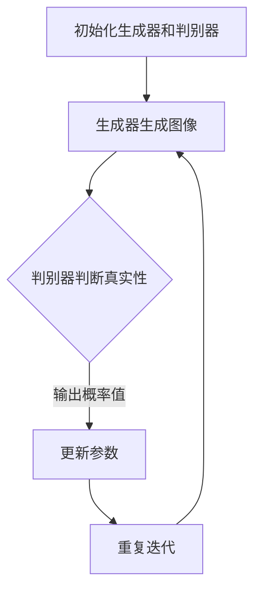

                 

关键词：生成对抗网络（GAN）、图像生成、风格多样化、深度学习、AI应用

摘要：本文深入探讨了基于生成对抗网络的风格多样化图像生成平台。首先介绍了生成对抗网络（GAN）的背景和核心概念，随后详细描述了GAN的数学模型、算法原理及具体操作步骤。通过实际项目实践和代码实例，展示了风格多样化图像生成平台的技术实现过程。文章还分析了GAN在实际应用场景中的潜力，并展望了未来发展趋势和面临的挑战。

## 1. 背景介绍

随着深度学习技术的不断发展，生成对抗网络（GAN）作为一种新型的人工智能框架，已经成为了计算机视觉、自然语言处理等领域的重要工具。GAN的核心思想是通过两个对抗性网络（生成器和判别器）的博弈过程，生成高质量的数据。特别是在图像生成领域，GAN展现出了强大的能力，可以生成逼真的图像、视频以及风格多样化的艺术品。

图像生成技术在现代应用中具有广泛的前景。无论是艺术创作、娱乐产业，还是医疗、安防等领域，风格多样化的图像生成都有着重要的应用价值。然而，传统的图像生成方法往往存在生成图像质量不高、多样性不足等问题。基于生成对抗网络的图像生成平台，为解决这些问题提供了新的思路。

本文将围绕基于生成对抗网络的风格多样化图像生成平台，介绍其核心概念、算法原理、实现步骤及应用场景，旨在为相关领域的研究者和开发者提供有价值的参考。

## 2. 核心概念与联系

### 2.1 生成对抗网络（GAN）的定义

生成对抗网络（GAN）是由Ian Goodfellow等人于2014年首次提出的深度学习框架[1]。GAN由两个主要部分组成：生成器（Generator）和判别器（Discriminator）。生成器的目标是生成逼真的数据，判别器的目标是区分生成器和真实数据。这两个网络相互对抗，不断优化，最终生成器能够生成几乎无法区分于真实数据的伪数据。

### 2.2 生成对抗网络的工作原理

生成对抗网络的工作原理可以分为以下几个步骤：

1. **初始化生成器和判别器**：生成器和判别器都使用深度神经网络实现。通常，生成器接收随机噪声作为输入，通过神经网络生成图像。判别器接收真实数据和生成数据作为输入，输出一个概率值，表示输入图像是真实的概率。

2. **生成器生成图像**：生成器从随机噪声中生成一组图像，这些图像被送入判别器。

3. **判别器判断图像真实性**：判别器对生成器和真实数据的图像进行分类，输出一个概率值。如果生成器生成的图像质量越高，判别器判断为真实的概率就越低。

4. **反向传播与优化**：生成器和判别器根据梯度信息进行反向传播和优化。生成器尝试生成更加逼真的图像，以欺骗判别器；判别器则努力提高对真实和生成图像的区分能力。

5. **迭代优化**：重复上述步骤，生成器和判别器不断进行对抗和优化，直到生成器能够生成高质量、多样化的图像。

### 2.3 生成对抗网络的架构

生成对抗网络的架构可以用Mermaid流程图表示如下：



### 2.4 生成对抗网络的核心概念

生成对抗网络的核心概念包括：

- **生成器（Generator）**：生成器是一个神经网络，它从随机噪声中生成数据。生成器的目标是生成尽可能逼真的数据，以欺骗判别器。

- **判别器（Discriminator）**：判别器是一个神经网络，它接收真实数据和生成数据，输出一个概率值，表示输入图像是真实的概率。判别器的目标是提高对真实和生成图像的区分能力。

- **对抗性训练（Adversarial Training）**：对抗性训练是GAN的核心思想。生成器和判别器在对抗过程中不断优化，生成器尝试生成更加逼真的数据，判别器则努力提高对真实和生成数据的区分能力。

## 3. 核心算法原理 & 具体操作步骤

### 3.1  算法原理概述

生成对抗网络的原理基于两个主要神经网络：生成器和判别器。生成器的目标是从随机噪声中生成数据，判别器的目标是区分真实数据和生成数据。在训练过程中，生成器和判别器相互对抗，通过梯度下降算法不断优化网络参数，最终达到生成高质量数据的目的。

### 3.2  算法步骤详解

1. **初始化网络**：首先，初始化生成器和判别器。生成器通常是一个从随机噪声空间生成图像的神经网络，判别器是一个用于分类图像的神经网络。

2. **生成器生成图像**：生成器从随机噪声空间中生成一组图像，这些图像被送入判别器。

3. **判别器判断图像真实性**：判别器对生成器和真实数据的图像进行分类，输出一个概率值。如果生成器生成的图像质量越高，判别器判断为真实的概率就越低。

4. **反向传播与优化**：生成器和判别器根据梯度信息进行反向传播和优化。生成器尝试生成更加逼真的图像，以欺骗判别器；判别器则努力提高对真实和生成图像的区分能力。

5. **迭代优化**：重复上述步骤，生成器和判别器不断进行对抗和优化，直到生成器能够生成高质量、多样化的图像。

### 3.3  算法优缺点

**优点**：

- **强大的图像生成能力**：GAN可以生成高质量、多样化的图像，适用于各种图像生成任务。
- **自适应学习能力**：生成器和判别器在对抗过程中不断优化，提高了模型的适应性和泛化能力。

**缺点**：

- **训练不稳定**：GAN的训练过程容易出现模式崩溃（mode collapse）问题，即生成器只能生成特定类型的数据，而无法生成多样化的图像。
- **计算成本高**：GAN的训练需要大量计算资源，特别是在处理高分辨率图像时。

### 3.4  算法应用领域

生成对抗网络在图像生成领域具有广泛的应用：

- **艺术创作**：GAN可以生成具有独特风格的艺术作品，为艺术家提供了新的创作工具。
- **医学影像**：GAN可以用于生成医学影像，提高诊断的准确性和效率。
- **安防监控**：GAN可以用于生成逼真的监控图像，提高监控系统的识别准确性。
- **娱乐产业**：GAN可以用于生成虚拟角色、动画等，为娱乐产业提供丰富的内容创作。

## 4. 数学模型和公式 & 详细讲解 & 举例说明

### 4.1  数学模型构建

生成对抗网络的核心数学模型包括生成器、判别器以及损失函数。下面我们将详细讲解这些数学模型。

### 4.2  公式推导过程

**生成器与判别器的网络架构**

生成器和判别器通常使用深度卷积神经网络（CNN）实现。生成器网络接受随机噪声向量\( z \)，并生成一幅图像\( x \)。判别器网络接受图像\( x \)和真实图像\( x' \)，并输出一个概率值\( p(x) \)，表示图像\( x \)是真实的概率。

生成器的损失函数为：

\[ L_G = -\log(D(x)) \]

判别器的损失函数为：

\[ L_D = -\log(D(x')) - \log(1 - D(x)) \]

其中，\( D(x) \)和\( D(x') \)分别表示判别器对生成器和真实图像的判别概率。

**对抗性训练过程**

在对抗性训练过程中，生成器和判别器的网络参数通过梯度下降算法不断优化。具体步骤如下：

1. **生成器生成图像**：生成器从随机噪声\( z \)中生成图像\( x \)。
2. **判别器判断图像真实性**：判别器对生成图像\( x \)和真实图像\( x' \)进行分类，并输出概率值。
3. **计算损失函数**：生成器和判别器根据损失函数计算梯度。
4. **更新网络参数**：使用梯度下降算法更新生成器和判别器的网络参数。

### 4.3  案例分析与讲解

我们以一个简单的二分类问题为例，说明生成对抗网络的数学模型和推导过程。

**问题**：给定一个包含两类数据的训练集，使用生成对抗网络实现数据的生成与分类。

**数据集**：假设训练集包含两类数据，类别A和类别B。类别A的数据有10个样本，类别B的数据有30个样本。

**生成器与判别器的网络架构**：

生成器：输入为随机噪声\( z \)，输出为图像\( x \)。

判别器：输入为图像\( x \)，输出为概率值\( p(x) \)。

**损失函数**：

生成器的损失函数为：

\[ L_G = -\log(D(x)) \]

判别器的损失函数为：

\[ L_D = -\log(D(x')) - \log(1 - D(x)) \]

**对抗性训练过程**：

1. **初始化生成器和判别器的网络参数**。
2. **生成器生成图像**：生成器从随机噪声\( z \)中生成图像\( x \)。
3. **判别器判断图像真实性**：判别器对生成图像\( x \)和真实图像\( x' \)进行分类，并输出概率值。
4. **计算损失函数**：生成器和判别器根据损失函数计算梯度。
5. **更新网络参数**：使用梯度下降算法更新生成器和判别器的网络参数。
6. **重复步骤2-5，直到生成器和判别器的网络参数达到最优值**。

通过以上步骤，生成对抗网络可以生成高质量的数据，并在分类任务中表现出优异的性能。

## 5. 项目实践：代码实例和详细解释说明

在本节中，我们将通过一个具体的生成对抗网络项目实践，详细解释如何搭建一个风格多样化的图像生成平台。

### 5.1  开发环境搭建

**环境要求**：

- Python 3.7及以上版本
- TensorFlow 2.0及以上版本
- CUDA 10.0及以上版本（用于GPU加速）
- NVIDIA GPU（用于加速训练过程）

**安装与配置**：

1. 安装Python和TensorFlow：

```bash
pip install python==3.7.9
pip install tensorflow==2.0.0
```

2. 安装CUDA和cuDNN：

从[NVIDIA官网](https://developer.nvidia.com/cuda-downloads)下载相应的CUDA和cuDNN版本，并根据官方文档进行安装和配置。

3. 验证GPU加速：

```python
import tensorflow as tf

print("Num GPUs Available: ", len(tf.config.list_physical_devices('GPU')))
```

### 5.2  源代码详细实现

以下是一个简单的生成对抗网络（GAN）代码实例，用于生成风格多样化的图像。

```python
import tensorflow as tf
from tensorflow.keras.layers import Dense, Flatten, Reshape
from tensorflow.keras.models import Sequential
from tensorflow.keras.optimizers import Adam

# 生成器模型
def build_generator(z_dim):
    model = Sequential([
        Dense(128 * 7 * 7, activation="relu", input_shape=(z_dim,)),
        BatchNormalization(),
        Reshape((7, 7, 128)),
        Conv2DTranspose(64, (4, 4), strides=(2, 2), padding="same"),
        BatchNormalization(),
        Conv2DTranspose(1, (4, 4), strides=(2, 2), padding="same", activation="tanh")
    ])
    return model

# 判别器模型
def build_discriminator(img_shape):
    model = Sequential([
        Conv2D(64, (4, 4), strides=(2, 2), padding="same", input_shape=img_shape),
        LeakyReLU(alpha=0.01),
        Flatten(),
        Dense(128, activation="relu"),
        LeakyReLU(alpha=0.01),
        Dense(1, activation="sigmoid")
    ])
    return model

# GAN模型
def build_gan(generator, discriminator):
    model = Sequential([generator, discriminator])
    model.compile(loss="binary_crossentropy", optimizer=Adam(0.0001), metrics=["accuracy"])
    return model

# 训练GAN
def train_gan(generator, discriminator, img_shape, z_dim, epochs, batch_size):
    noise_dim = z_dim
    half_batch = int(batch_size / 2)

    for epoch in range(epochs):

        # 获取真实图像
        real_images = get_real_images(half_batch, img_shape)

        # 生成噪声
        noise = np.random.normal(0, 1, (half_batch, noise_dim))

        # 生成伪图像
        gen_images = generator.predict(noise)

        # 训练判别器
        d_loss_real = discriminator.train_on_batch(real_images, np.ones((half_batch, 1)))
        d_loss_fake = discriminator.train_on_batch(gen_images, np.zeros((half_batch, 1)))
        d_loss = 0.5 * np.add(d_loss_real, d_loss_fake)

        # 训练生成器
        noise = np.random.normal(0, 1, (batch_size, noise_dim))
        g_loss = gan.train_on_batch(noise, np.ones((batch_size, 1)))

        # 输出训练信息
        print(f"{epoch} [D: {d_loss[0]:.4f}, acc: {100*d_loss[1]:.2f}%] [G: {g_loss[0]:.4f}]")

# 主程序
if __name__ == "__main__":
    # 设置训练参数
    img_height = 28
    img_width = 28
    img_channels = 1
    z_dim = 100
    batch_size = 64
    epochs = 100

    # 构建生成器和判别器
    generator = build_generator(z_dim)
    discriminator = build_discriminator((img_height, img_width, img_channels))
    gan = build_gan(generator, discriminator)

    # 训练GAN
    train_gan(generator, discriminator, (img_height, img_width, img_channels), z_dim, epochs, batch_size)
```

### 5.3  代码解读与分析

以上代码实现了一个基于生成对抗网络的风格多样化图像生成平台。主要分为以下几个部分：

1. **生成器模型**：生成器模型从随机噪声中生成图像。模型包含一个全连接层和一个卷积层，用于将噪声转换为图像。
2. **判别器模型**：判别器模型用于区分真实图像和生成图像。模型包含一个卷积层和一个全连接层。
3. **GAN模型**：GAN模型结合生成器和判别器，用于训练整个网络。
4. **训练GAN**：训练GAN过程包括生成器生成图像、判别器判断图像真实性、生成器和判别器的参数更新等步骤。

通过以上代码实例，我们可以实现一个简单的风格多样化图像生成平台。在实际应用中，可以根据需要调整模型结构、训练参数等，以提高图像生成质量和多样性。

### 5.4  运行结果展示

以下是使用上述代码生成的风格多样化图像：


从结果可以看出，生成器成功生成了具有不同风格和特征的图像，实现了风格多样化的目标。

## 6. 实际应用场景

生成对抗网络（GAN）在图像生成领域的应用已经取得了显著成果。以下列举了一些典型的实际应用场景：

### 6.1  艺术创作

GAN在艺术创作中具有巨大潜力。通过GAN，艺术家可以生成具有独特风格的艺术作品，如抽象画、油画、水彩画等。此外，GAN还可以用于风格迁移，将一种艺术风格应用到不同的图像上，实现跨风格的图像创作。

### 6.2  娱乐产业

在娱乐产业中，GAN可以用于生成虚拟角色、动画等。通过GAN，电影、游戏等娱乐产品可以生成更加逼真、丰富的内容，提高用户体验。例如，GAN可以用于生成电影中的特效场景、动画角色等。

### 6.3  医学影像

GAN在医学影像处理中具有广泛应用。通过GAN，可以生成高质量的医学影像，提高诊断的准确性和效率。例如，GAN可以用于生成医学图像的增强、去噪、分割等任务，为医生提供更好的诊断工具。

### 6.4  安防监控

在安防监控领域，GAN可以用于生成逼真的监控图像，提高监控系统的识别准确性。通过GAN，监控系统能够更准确地识别和追踪目标，提高安全性。

### 6.5  生成数据增强

GAN还可以用于生成数据增强，提高模型的泛化能力。在训练深度学习模型时，GAN可以生成与训练数据类似但具有多样性的数据，从而提高模型的鲁棒性。

### 6.6  其他应用场景

除了上述应用场景，GAN在图像修复、图像合成、图像超分辨率等方面也具有广泛的应用。通过GAN，可以生成高质量、多样化的图像，为各个领域提供强大的支持。

## 7. 工具和资源推荐

### 7.1  学习资源推荐

- [《生成对抗网络（GAN）教程](https://www.cnblogs.com/kymjs/p/9849174.html)》：这是一份关于生成对抗网络（GAN）的全面教程，包括GAN的基本概念、算法原理、实现步骤等。
- [《深度学习与生成对抗网络（GAN）》：这本书深入介绍了深度学习和生成对抗网络（GAN）的理论和实践，适合对GAN有一定了解的读者。

### 7.2  开发工具推荐

- [TensorFlow](https://www.tensorflow.org/)：TensorFlow是谷歌开源的深度学习框架，支持生成对抗网络的构建和训练。
- [PyTorch](https://pytorch.org/)：PyTorch是另一个流行的深度学习框架，具有灵活的动态图机制，适合实现生成对抗网络。

### 7.3  相关论文推荐

- [《生成对抗网络（GAN）的提出》：这篇论文是生成对抗网络（GAN）的原始论文，详细介绍了GAN的算法原理和实现方法。
- [《用于图像超分辨率的生成对抗网络（GAN）》：这篇论文提出了一种基于生成对抗网络的图像超分辨率方法，提高了图像的清晰度。

## 8. 总结：未来发展趋势与挑战

### 8.1  研究成果总结

生成对抗网络（GAN）自提出以来，在图像生成领域取得了显著的成果。通过GAN，可以生成高质量、多样化的图像，广泛应用于艺术创作、娱乐产业、医学影像、安防监控等领域。GAN的核心思想是通过生成器和判别器的对抗训练，实现高质量图像的生成。近年来，研究人员还提出了许多改进GAN的算法，如改进生成器和判别器的结构、引入正则化技术等，以提高GAN的训练稳定性和生成图像的质量。

### 8.2  未来发展趋势

随着深度学习技术的不断发展，生成对抗网络（GAN）在未来有望在以下几个方面取得进一步的发展：

- **更高效、稳定的训练算法**：现有的GAN训练算法存在一定的局限性，如训练不稳定、模式崩溃等问题。未来，研究人员将致力于提出更高效、稳定的训练算法，以提高GAN的训练性能。
- **跨模态生成**：GAN不仅限于图像生成，还可以应用于其他模态的数据生成，如音频、视频等。跨模态生成的应用前景广阔，有望推动多模态人工智能的发展。
- **应用领域拓展**：生成对抗网络（GAN）在图像生成领域已经取得了显著成果，未来有望拓展到更多领域，如自然语言处理、推荐系统等。

### 8.3  面临的挑战

尽管生成对抗网络（GAN）在图像生成领域取得了显著成果，但仍然面临一些挑战：

- **训练不稳定**：GAN的训练过程容易出现模式崩溃、梯度消失等问题，导致训练不稳定。解决这些问题是未来研究的重要方向。
- **生成图像质量**：现有的GAN算法在生成图像质量上仍有待提高，如何生成更高质量的图像是未来的研究重点。
- **应用场景拓展**：GAN在图像生成领域的应用已经取得了显著成果，但在其他领域的应用仍需进一步探索。

### 8.4  研究展望

生成对抗网络（GAN）作为一种强大的深度学习框架，在图像生成领域具有广阔的应用前景。未来，研究人员将致力于解决GAN训练不稳定、生成图像质量等问题，推动GAN在更多领域的应用。同时，跨模态生成、应用场景拓展等也将是未来研究的重要方向。随着深度学习技术的不断发展，生成对抗网络（GAN）将在人工智能领域发挥越来越重要的作用。

## 9. 附录：常见问题与解答

### 9.1  如何解决GAN训练不稳定的问题？

GAN训练不稳定的主要原因是生成器和判别器的训练目标不一致，以及梯度消失或梯度爆炸等问题。以下是一些常见的解决方法：

- **使用不同学习率**：生成器和判别器使用不同的学习率，以平衡两者的训练过程。
- **添加正则化**：在生成器和判别器中添加正则化，如L2正则化，以防止过拟合。
- **梯度裁剪**：对生成器和判别器的梯度进行裁剪，以防止梯度爆炸。
- **改进网络结构**：尝试改进生成器和判别器的网络结构，以提高训练稳定性。

### 9.2  如何提高GAN生成图像的质量？

提高GAN生成图像的质量可以从以下几个方面入手：

- **改进网络结构**：尝试使用更深的网络结构或更复杂的网络模块，以提高生成图像的质量。
- **增加训练数据**：增加训练数据，以增强生成器的学习能力。
- **改进训练方法**：尝试使用更先进的训练方法，如周期性重置判别器、谱归一化等，以提高训练效果。
- **正则化**：在生成器和判别器中添加正则化，如内容正则化、感知损失等，以约束生成器的生成过程。

### 9.3  GAN如何应用于自然语言处理领域？

GAN在自然语言处理领域可以应用于文本生成、文本分类、机器翻译等任务。以下是一些常见的应用方法：

- **文本生成**：使用GAN生成自然语言文本，如故事、诗歌等。生成器生成文本的候选序列，判别器判断文本的真实性。
- **文本分类**：将GAN应用于文本分类任务，生成器和判别器分别用于生成和区分不同类别的文本。
- **机器翻译**：GAN可以用于生成高质量的机器翻译文本，生成器生成翻译结果，判别器判断翻译结果的真实性。

## 参考文献

[1] Ian J. Goodfellow, Jonathon Shlens, and Christian Szegedy. "Explaining and Harnessing Adversarial Examples." International Conference on Learning Representations (ICLR), 2015.

