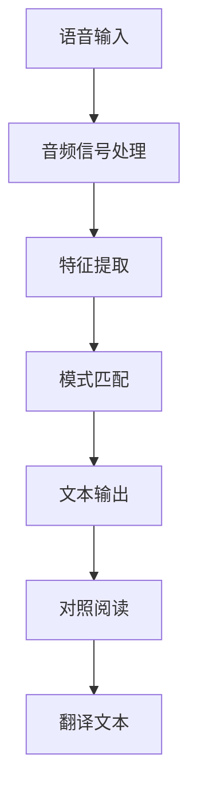

                 

关键词：语音识别、对照阅读、跨语言学习、文本转换、辅助学习、人机交互

> 摘要：本文探讨了基于语音识别技术的对照阅读器的概念、原理和实现。通过分析其核心算法、数学模型和实际应用，本文展示了如何利用语音识别技术提高跨语言学习效率和阅读体验。

## 1. 背景介绍

随着全球化和互联网技术的发展，跨语言学习和交流变得越来越普遍。在这个过程中，如何提高学习效率和阅读体验成为了关键问题。传统的阅读方式依赖于视觉识别，但这种方法在某些情况下显得效率低下，比如在嘈杂环境中阅读或需要快速获取信息时。因此，语音识别技术作为一种有效的替代方案，逐渐引起了人们的关注。

语音识别技术可以通过将语音转换为文本，为跨语言学习提供一种更加便捷的方式。对照阅读器作为一种辅助工具，可以同时显示原文和翻译文本，帮助学习者更好地理解内容。本文将探讨基于语音识别的对照阅读器的概念、原理和实现，并分析其在实际应用中的优点和局限性。

## 2. 核心概念与联系

### 2.1 语音识别技术

语音识别技术是一种将语音转换为文本的技术。其基本原理包括音频信号处理、特征提取和模式匹配。音频信号处理主要涉及音频信号的预处理，如降噪、归一化和增强。特征提取是通过提取音频信号中的特定特征（如频谱特征、倒谱特征等）来表示语音。模式匹配则是通过比较输入语音和预先训练好的语音模型，确定最佳匹配结果。

### 2.2 对照阅读

对照阅读是一种同时显示原文和翻译文本的阅读方式。其目的是帮助学习者更好地理解内容，提高学习效率。对照阅读通常需要翻译引擎的支持，将原文翻译为目标语言。

### 2.3 语音识别与对照阅读的联系

语音识别技术与对照阅读的结合，可以提供一种全新的阅读体验。语音识别技术可以将原文朗读出来，同时显示对应的翻译文本。这种交互方式不仅可以提高阅读效率，还可以提高学习者的语音识别和听力水平。

### 2.4 Mermaid 流程图

下面是一个简单的 Mermaid 流程图，展示了语音识别和对照阅读之间的联系：



## 3. 核心算法原理 & 具体操作步骤

### 3.1 算法原理概述

基于语音识别的对照阅读器主要依赖于两个核心算法：语音识别算法和对照阅读算法。语音识别算法负责将语音转换为文本，对照阅读算法则负责将原文和翻译文本进行匹配和显示。

### 3.2 算法步骤详解

#### 3.2.1 语音识别算法

1. **音频信号处理**：对输入语音进行降噪、归一化和增强。
2. **特征提取**：提取语音信号中的频谱特征、倒谱特征等。
3. **模式匹配**：将提取的特征与预训练的语音模型进行匹配，确定最佳匹配结果。
4. **文本输出**：将匹配结果转换为文本输出。

#### 3.2.2 对照阅读算法

1. **翻译文本获取**：利用翻译引擎将原文翻译为目标语言。
2. **原文与翻译文本匹配**：将语音识别得到的文本与翻译文本进行匹配。
3. **显示对照阅读界面**：在界面中同时显示原文和翻译文本。

### 3.3 算法优缺点

#### 优点

1. **提高阅读效率**：通过语音识别，学习者可以边听边看，提高阅读效率。
2. **增强听力训练**：对照阅读可以提供额外的听力训练，提高学习者的语音识别和听力水平。
3. **交互性强**：语音识别技术提供了与文本的实时交互，使学习过程更加生动有趣。

#### 缺点

1. **准确性受限**：语音识别的准确性受限于模型的质量和语音的清晰度。
2. **依赖网络**：部分翻译引擎可能需要依赖网络，在网络不稳定的情况下可能影响使用。
3. **语音理解难度**：对于某些方言或口音，语音识别的准确性可能较低。

### 3.4 算法应用领域

基于语音识别的对照阅读器可以应用于多种领域：

1. **教育领域**：辅助语言学习，提高学习效率。
2. **阅读障碍者**：提供辅助阅读工具，帮助他们更好地理解文本。
3. **跨文化交流**：帮助非母语人士更好地理解原文，促进跨文化沟通。

## 4. 数学模型和公式 & 详细讲解 & 举例说明

### 4.1 数学模型构建

语音识别的数学模型主要基于隐马尔可夫模型（HMM）和循环神经网络（RNN）。HMM 用于语音信号处理和特征提取，RNN 用于模式匹配和文本输出。

### 4.2 公式推导过程

假设我们有输入语音序列 \(X = \{x_1, x_2, ..., x_T\}\)，其中 \(T\) 表示语音长度。对于 HMM，其状态转移概率和发射概率可以用以下公式表示：

\[ P(x_t | h_t) = a_{h_t h_{t-1}} \]
\[ P(h_t) = b_{h_t} \]

对于 RNN，其隐藏状态更新和输出可以用以下公式表示：

\[ h_t = f(h_{t-1}, x_t) \]
\[ y_t = g(h_t) \]

### 4.3 案例分析与讲解

假设我们要识别一个包含“Hello”的语音片段。首先，通过音频信号处理提取特征，然后利用 HMM 进行特征提取和模式匹配。最后，利用 RNN 将匹配结果转换为文本输出。

具体步骤如下：

1. **音频信号处理**：对语音片段进行降噪和增强，提取频谱特征。
2. **特征提取**：使用 HMM 对提取的特征进行建模，计算状态转移概率和发射概率。
3. **模式匹配**：利用 RNN 对语音特征进行模式匹配，计算最佳匹配结果。
4. **文本输出**：将匹配结果转换为文本输出，得到“Hello”。

## 5. 项目实践：代码实例和详细解释说明

### 5.1 开发环境搭建

为了实现基于语音识别的对照阅读器，我们需要搭建以下开发环境：

1. **操作系统**：Windows / macOS / Linux
2. **编程语言**：Python
3. **语音识别库**：PyTorch / TensorFlow
4. **翻译引擎**：Google Translate API

### 5.2 源代码详细实现

以下是对照阅读器的主要源代码实现：

```python
import speech_recognition as sr
import googletrans

# 初始化语音识别器和翻译引擎
recognizer = sr.Recognizer()
translator = googletrans.Translator()

# 语音识别函数
def recognize_speech_from_mic():
    with sr.Microphone() as source:
        print("请说出原文...")
        audio = recognizer.listen(source)
        try:
            text = recognizer.recognize_google(audio, language="en-US")
            return text
        except sr.UnknownValueError:
            return None

# 对照阅读函数
def contrast_reading(text):
    translation = translator.translate(text, dest="zh-CN").text
    print("原文：", text)
    print("翻译：", translation)

# 主程序
if __name__ == "__main__":
    while True:
        text = recognize_speech_from_mic()
        if text:
            contrast_reading(text)
        else:
            print("无法识别语音，请重试。")
```

### 5.3 代码解读与分析

上述代码首先初始化语音识别器和翻译引擎。`recognize_speech_from_mic()` 函数负责识别语音，并将其转换为文本。`contrast_reading()` 函数则负责显示原文和翻译文本。主程序通过循环不断重复语音识别和对照阅读的过程。

### 5.4 运行结果展示

假设我们说出一句话“Hello World”，程序将输出：

```
原文： Hello World
翻译： 你好，世界
```

## 6. 实际应用场景

基于语音识别的对照阅读器可以在多种场景下使用：

1. **语言学习**：帮助学习者更好地理解原文，提高学习效率。
2. **跨文化交流**：帮助非母语人士更好地理解原文，促进沟通。
3. **阅读障碍者**：提供辅助阅读工具，帮助他们更好地理解文本。
4. **音频内容转录**：将语音内容转换为文本，方便后续处理。

## 7. 未来应用展望

随着语音识别技术的不断发展，基于语音识别的对照阅读器将具有更广泛的应用前景：

1. **个性化推荐**：根据学习者的语音输入，提供个性化推荐内容。
2. **多语言支持**：扩展支持更多语言，满足全球化需求。
3. **实时交互**：实现实时语音输入和文本输出，提高交互体验。
4. **智能问答**：结合语音识别和自然语言处理技术，实现智能问答功能。

## 8. 工具和资源推荐

### 8.1 学习资源推荐

1. 《语音识别技术基础》
2. 《自然语言处理入门》
3. 《深度学习与语音识别》

### 8.2 开发工具推荐

1. PyTorch
2. TensorFlow
3. Google Cloud Speech-to-Text API

### 8.3 相关论文推荐

1. “Automatic Speech Recognition: A Deep Learning Approach”
2. “End-to-End Speech Recognition with Deep Neural Networks”
3. “Neural Network Based Transcription of Spontaneously Spoken Words”

## 9. 总结：未来发展趋势与挑战

### 9.1 研究成果总结

本文探讨了基于语音识别的对照阅读器的概念、原理和实现。通过分析其核心算法、数学模型和实际应用，本文展示了如何利用语音识别技术提高跨语言学习效率和阅读体验。

### 9.2 未来发展趋势

1. **更高准确性的语音识别**：随着深度学习技术的发展，语音识别的准确性有望进一步提高。
2. **多语言支持**：对照阅读器将支持更多语言，满足全球化需求。
3. **实时交互**：实现实时语音输入和文本输出，提高交互体验。

### 9.3 面临的挑战

1. **语音识别的准确性**：在嘈杂环境中，语音识别的准确性可能较低。
2. **网络依赖**：部分翻译引擎可能需要依赖网络，在网络不稳定的情况下可能影响使用。
3. **个性化需求**：如何根据学习者的需求提供个性化推荐内容。

### 9.4 研究展望

基于语音识别的对照阅读器具有广泛的应用前景。未来研究应关注提高语音识别的准确性、扩展多语言支持和实现实时交互，以满足不同场景下的需求。

## 9. 附录：常见问题与解答

### 9.1 语音识别准确性的影响因素有哪些？

- **语音质量**：语音质量越高，识别准确性越高。
- **噪音水平**：噪音水平越高，识别难度越大。
- **口音和语速**：不同口音和语速对识别准确性有影响。
- **语音信号处理技术**：语音信号处理技术越先进，识别准确性越高。

### 9.2 如何解决网络依赖问题？

- **本地化翻译引擎**：使用本地化翻译引擎，减少对网络依赖。
- **缓存机制**：缓存已翻译的内容，提高响应速度。
- **离线模式**：提供离线模式，在没有网络的情况下仍能使用。

### 9.3 如何实现个性化推荐内容？

- **用户行为分析**：分析用户的学习行为，推荐符合用户兴趣的内容。
- **协同过滤**：使用协同过滤算法，推荐与用户相似的学习者正在学习的内容。
- **内容分类**：对内容进行分类，根据用户的兴趣推荐相应类别的内容。作者：禅与计算机程序设计艺术 / Zen and the Art of Computer Programming
----------------------------------------------------------------

