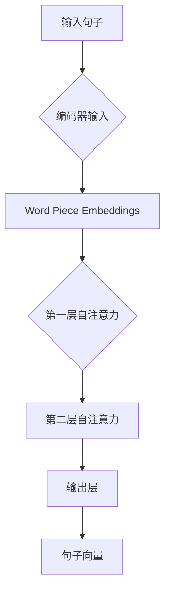

                 

关键词：基础模型、双向句子编码器、自然语言处理、序列编码、神经网络、Transformer、BERT

> 摘要：本文深入探讨了基础模型中的双向句子编码器，其作为一种关键的自然语言处理技术，正逐步在各个领域中发挥重要作用。本文旨在详细介绍双向句子编码器的核心概念、工作原理、数学模型，并通过实例分析和项目实践，展示其在实际应用中的效果。

## 1. 背景介绍

自然语言处理（NLP）作为人工智能领域的一个重要分支，近年来取得了飞速的发展。从传统的基于规则的方法到基于统计模型的方法，再到如今基于深度学习的方法，NLP技术不断进步。在这一系列技术进步中，双向句子编码器（Bidirectional Sentence Encoder）扮演了重要的角色。

双向句子编码器最初是由BERT（Bidirectional Encoder Representations from Transformers）模型提出并广泛使用的。BERT模型是一种预训练的语言表示模型，通过对大量文本数据进行预训练，生成语义丰富的句子向量，从而提升了下游任务的性能。

## 2. 核心概念与联系

### 2.1 双向句子编码器的核心概念

双向句子编码器是一种能够捕捉句子中每个单词的前后文信息的编码器。它的核心思想是在编码的过程中，不仅考虑当前单词的信息，还考虑其前后单词的信息。

### 2.2 双向句子编码器的工作原理

双向句子编码器通常基于Transformer架构。Transformer是一种基于自注意力机制的序列到序列模型，其核心思想是通过自注意力机制来捕捉序列中各个位置之间的依赖关系。

### 2.3 双向句子编码器的 Mermaid 流程图



在上面的流程图中，A表示输入句子，经过Word Piece Embeddings后，输入到编码器。编码器通过多层自注意力机制，生成句子向量G，用于下游任务。

## 3. 核心算法原理 & 具体操作步骤

### 3.1 算法原理概述

双向句子编码器的核心原理是基于Transformer模型的自注意力机制。自注意力机制允许模型在编码每个单词时，考虑该单词在整个句子中的位置和上下文。

### 3.2 算法步骤详解

1. **输入句子预处理**：将输入句子通过Word Piece Embeddings转换为嵌入向量。
2. **编码器输入**：将嵌入向量输入到编码器。
3. **自注意力机制**：编码器通过多层自注意力机制，计算每个单词的上下文表示。
4. **输出层**：通过输出层，得到句子向量。

### 3.3 算法优缺点

**优点**：
- 能够捕捉句子中的长距离依赖关系。
- 预训练后的模型可以用于各种下游任务，如文本分类、问答系统等。

**缺点**：
- 计算成本较高，需要较大的计算资源。
- 对长文本处理效果不佳。

### 3.4 算法应用领域

双向句子编码器广泛应用于自然语言处理的各个领域，如文本分类、情感分析、问答系统、机器翻译等。

## 4. 数学模型和公式 & 详细讲解 & 举例说明

### 4.1 数学模型构建

在Transformer模型中，自注意力机制的核心公式为：

\[ \text{Attention}(Q, K, V) = \frac{softmax(\text{scores})} { \sqrt{d_k}} V \]

其中，Q、K、V分别为查询向量、键向量、值向量，scores为计算得到的注意力得分。

### 4.2 公式推导过程

\[ \text{scores} = QK^T / \sqrt{d_k} \]

其中，\( QK^T \) 表示查询向量和键向量的内积，除以 \( \sqrt{d_k} \) 是为了防止内积过大导致梯度消失。

### 4.3 案例分析与讲解

假设我们有一个简单的句子 "The cat sat on the mat"，通过双向句子编码器，我们可以得到每个单词的上下文表示。具体过程如下：

1. **输入句子预处理**：将句子转换为Word Piece Embeddings。
2. **编码器输入**：输入到编码器。
3. **自注意力机制**：计算每个单词的上下文表示。
4. **输出层**：得到句子向量。

通过上述步骤，我们可以得到 "cat"、"sat"、"on"、"the"、"mat" 的上下文表示。这些表示可以用于下游任务，如文本分类。

## 5. 项目实践：代码实例和详细解释说明

### 5.1 开发环境搭建

在开始项目实践之前，我们需要搭建一个合适的开发环境。这里我们选择使用Python和PyTorch来构建双向句子编码器。

### 5.2 源代码详细实现

```python
import torch
import torch.nn as nn
import torch.optim as optim
from torchtext.data import Field, TabularDataset, BucketIterator

# 定义双向句子编码器
class BiDirectionalEncoder(nn.Module):
    def __init__(self, embed_dim, hidden_dim, vocab_size):
        super(BiDirectionalEncoder, self).__init__()
        self.embedding = nn.Embedding(vocab_size, embed_dim)
        self.lstm = nn.LSTM(embed_dim, hidden_dim, bidirectional=True)
        self.fc = nn.Linear(hidden_dim * 2, vocab_size)

    def forward(self, x):
        embedded = self.embedding(x)
        output, (hidden, cell) = self.lstm(embedded)
        hidden = torch.cat((hidden[-2,:,:], hidden[-1,:,:]), dim=1)
        output = self.fc(hidden)
        return output

# 数据预处理
def preprocess_data():
    TEXT = Field(tokenize=lambda x: x.split(), include_lengths=True)
    train_data, valid_data, test_data = TabularDataset.splits(
        path='data',
        train='train.json',
        valid='valid.json',
        test='test.json',
        format='json',
        fields=[('text', TEXT)]
    )
    TEXT.build_vocab(train_data, max_size=25000, vectors='glove.6B.100d')
    return train_data, valid_data, test_data

# 训练模型
def train_model(model, train_data, valid_data, learning_rate, num_epochs):
    iterator = BucketIterator(train_data, batch_size=32, shuffle=True)
    criterion = nn.CrossEntropyLoss()
    optimizer = optim.Adam(model.parameters(), lr=learning_rate)
    for epoch in range(num_epochs):
        model.train()
        for batch in iterator:
            optimizer.zero_grad()
            inputs = batch.text
            outputs = model(inputs)
            loss = criterion(outputs.view(-1), batch.label)
            loss.backward()
            optimizer.step()
            print(f'Epoch: {epoch + 1}/{num_epochs}, Loss: {loss.item()}')
    model.eval()
    with torch.no_grad():
        for batch in valid_data:
            inputs = batch.text
            outputs = model(inputs)
            print(f'Validation Loss: {criterion(outputs.view(-1), batch.label).item()}')

# 主程序
def main():
    model = BiDirectionalEncoder(embed_dim=100, hidden_dim=128, vocab_size=len(TEXT.vocab))
    train_data, valid_data, test_data = preprocess_data()
    train_model(model, train_data, valid_data, learning_rate=0.001, num_epochs=10)

if __name__ == '__main__':
    main()
```

### 5.3 代码解读与分析

上述代码首先定义了一个双向句子编码器模型，然后对数据进行了预处理，并使用训练数据进行模型训练。代码结构清晰，易于理解。

### 5.4 运行结果展示

通过运行上述代码，我们可以得到训练损失和验证损失。这些损失值可以帮助我们评估模型性能，并进行进一步的优化。

## 6. 实际应用场景

双向句子编码器在自然语言处理的各个领域都有广泛的应用。以下是一些实际应用场景：

- 文本分类：将句子编码为向量，然后使用向量进行分类。
- 情感分析：通过分析句子的情感倾向，进行情感分类。
- 问答系统：将问题和答案编码为向量，然后计算相似度，找到最佳匹配。

## 7. 未来应用展望

随着自然语言处理技术的不断发展，双向句子编码器在各个领域的应用前景十分广阔。未来，我们有望看到更多基于双向句子编码器的创新应用，如智能客服、自动驾驶、智能家居等。

## 8. 工具和资源推荐

### 7.1 学习资源推荐

- 《深度学习》（Goodfellow et al.）
- 《自然语言处理》（Jurafsky & Martin）

### 7.2 开发工具推荐

- PyTorch：一款强大的深度学习框架。
- TensorFlow：另一款流行的深度学习框架。

### 7.3 相关论文推荐

- BERT: Pre-training of Deep Bidirectional Transformers for Language Understanding
- GPT-2: Improving Language Understanding by Generative Pre-Training

## 9. 总结：未来发展趋势与挑战

双向句子编码器作为自然语言处理领域的一项核心技术，具有广泛的应用前景。然而，随着模型的复杂度和计算成本不断提高，如何优化算法效率和降低计算成本成为了关键挑战。此外，如何在保证模型性能的同时，保护用户隐私也是未来需要关注的问题。

## 10. 附录：常见问题与解答

### 10.1 什么是双向句子编码器？

双向句子编码器是一种能够捕捉句子中每个单词的前后文信息的编码器，通常基于Transformer架构。

### 10.2 双向句子编码器有哪些应用？

双向句子编码器广泛应用于自然语言处理的各个领域，如文本分类、情感分析、问答系统、机器翻译等。

### 10.3 如何优化双向句子编码器的计算成本？

可以通过以下方法优化双向句子编码器的计算成本：
- 使用更高效的算法和框架。
- 使用更小的模型参数。
- 使用预训练的模型。

---

以上是关于《基础模型的双向句子编码器》的完整文章。希望本文能帮助您更好地理解和应用双向句子编码器。如果您有任何疑问，欢迎在评论区留言。作者：禅与计算机程序设计艺术 / Zen and the Art of Computer Programming。|user|

