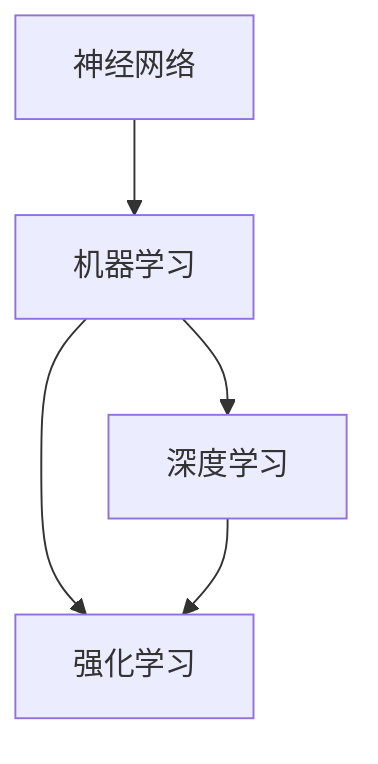

                 

关键词：基础模型、学术研究、产业应用、人工智能、深度学习、神经网络、机器学习、计算机科学

## 摘要

本文旨在探讨基础模型在学术研究和产业应用中的重要性，以及它们如何推动人工智能（AI）和计算机科学的发展。我们将首先回顾基础模型的发展历史，然后深入探讨其核心概念和联系，介绍一些典型的算法原理和数学模型，并展示如何在实际项目中应用这些模型。通过分析不同的应用场景，我们将展望基础模型未来的发展趋势和面临的挑战。

## 1. 背景介绍

### 基础模型的发展历史

基础模型（Fundamental Models）是指那些在计算机科学和人工智能领域中广泛应用的基本模型。这些模型是构建复杂系统和应用的基础，如神经网络、决策树、支持向量机等。它们的出现可以追溯到20世纪50年代，当时人工智能（AI）领域刚刚起步。早期的AI研究主要集中在符号推理和知识表示上，但随着计算能力的提升和大数据的涌现，机器学习和深度学习逐渐成为AI研究的主流。

### 人工智能与计算机科学的发展

人工智能和计算机科学的发展离不开基础模型。从早期的规则系统到现代的深度学习模型，基础模型为计算机科学家提供了强大的工具，使他们能够构建出越来越复杂的系统。同时，这些模型的成功应用也激发了更多研究人员投入到AI和计算机科学的研究中，形成了良性循环。

### 学术研究与产业应用的关系

学术研究和产业应用是相辅相成的。学术研究提供了理论支撑和新技术，而产业应用则推动了这些技术的实际落地。通过学术研究和产业应用的双重驱动，基础模型得以不断优化和迭代，从而在各个领域中发挥更大的作用。

## 2. 核心概念与联系

### 核心概念

在探讨基础模型之前，我们需要了解一些核心概念，包括：

- **神经网络（Neural Networks）**：模仿人脑神经元工作的计算模型，通过加权连接来实现信息传递和处理。
- **机器学习（Machine Learning）**：让计算机通过数据学习并做出决策的过程，主要包括监督学习、无监督学习和强化学习。
- **深度学习（Deep Learning）**：一种特殊的机器学习方法，使用多层神经网络进行训练，能够处理复杂的非线性问题。
- **强化学习（Reinforcement Learning）**：通过奖励机制让计算机自主学习和决策，广泛应用于游戏、机器人控制等领域。

### 联系

这些核心概念之间存在紧密的联系。神经网络是深度学习的基础，而机器学习则提供了实现神经网络的方法。深度学习通过多层神经网络实现了对复杂数据的建模，而强化学习则通过自主学习和决策来优化系统性能。这些概念共同构成了现代人工智能的基础。

### Mermaid 流程图

下面是一个描述这些核心概念之间联系的Mermaid流程图：



## 3. 核心算法原理 & 具体操作步骤

### 3.1 算法原理概述

神经网络是基础模型中最具代表性的算法之一。它通过模拟人脑神经元之间的连接和相互作用来实现信息处理。神经网络的基本原理可以概括为以下三个步骤：

1. **前向传播（Forward Propagation）**：输入数据通过网络的各个层次，每个层次都会进行加权求和并应用激活函数。
2. **反向传播（Backpropagation）**：通过计算输出误差，反向传播误差至网络的每个层次，并更新权重。
3. **优化目标（Optimization Objective）**：使用梯度下降或其他优化算法来最小化损失函数。

### 3.2 算法步骤详解

以下是神经网络的具体操作步骤：

1. **初始化参数**：设置网络的初始权重和偏置。
2. **前向传播**：
   - 将输入数据传递到网络的第一个层次。
   - 通过每个层次进行加权求和，应用激活函数。
   - 得到网络的输出。
3. **计算损失**：计算输出与真实值之间的差异，通常使用均方误差（MSE）作为损失函数。
4. **反向传播**：
   - 从输出层开始，计算每个层次的误差。
   - 使用链式法则计算梯度。
   - 更新网络的权重和偏置。
5. **迭代训练**：重复上述步骤，直到满足停止条件（如达到预定迭代次数或损失低于某个阈值）。

### 3.3 算法优缺点

神经网络具有以下优点：

- **强大的表达能力**：能够处理复杂的非线性问题。
- **自适应能力**：通过学习数据中的特征，能够自动调整权重和偏置。

但同时也存在以下缺点：

- **计算复杂度**：训练过程需要大量计算资源。
- **过拟合问题**：在训练数据上表现良好，但在测试数据上表现不佳。

### 3.4 算法应用领域

神经网络在多个领域都有广泛的应用，包括：

- **图像识别**：如人脸识别、物体检测等。
- **自然语言处理**：如机器翻译、情感分析等。
- **游戏和机器人控制**：如围棋、自动驾驶等。

## 4. 数学模型和公式 & 详细讲解 & 举例说明

### 4.1 数学模型构建

神经网络的数学模型主要由以下几部分组成：

- **激活函数（Activation Function）**：用于引入非线性特性，如Sigmoid、ReLU等。
- **权重（Weights）**：连接各个层次之间的加权系数。
- **偏置（Bias）**：每个节点的偏置项。
- **损失函数（Loss Function）**：用于评估模型的性能，如均方误差（MSE）、交叉熵等。

### 4.2 公式推导过程

以下是神经网络中的一些关键公式：

1. **前向传播**：

   \[ z = \sum_{i=1}^{n} w_i * x_i + b \]
   \[ a = \sigma(z) \]

   其中，\( x_i \) 是输入，\( w_i \) 是权重，\( b \) 是偏置，\( \sigma \) 是激活函数。

2. **反向传播**：

   \[ \delta = \frac{\partial L}{\partial a} * \frac{1}{\sigma'(z)} \]
   \[ \delta_{j}^{[l]} = \sum_{i} \delta_{i}^{[l+1]} * w_{ji}^{[l+1]} \]
   \[ \frac{\partial L}{\partial z_j} = \delta_j \]
   \[ \frac{\partial L}{\partial w_{ij}^{[l]}} = \delta_{j}^{[l]} * a_{i}^{[l-1]} \]
   \[ \frac{\partial L}{\partial b_j^{[l]}} = \delta_{j}^{[l]} \]

   其中，\( L \) 是损失函数，\( \sigma' \) 是激活函数的导数。

### 4.3 案例分析与讲解

以下是一个简单的神经网络训练案例：

假设我们有一个二分类问题，输入数据为 \( x \)，目标标签为 \( y \)。我们使用一个单层神经网络进行训练，激活函数为ReLU，损失函数为交叉熵。

1. **初始化参数**：

   \[ w_1 = \text{random} \]
   \[ b_1 = \text{random} \]

2. **前向传播**：

   \[ z_1 = w_1 * x + b_1 \]
   \[ a_1 = \text{ReLU}(z_1) \]

3. **计算损失**：

   \[ L = -\frac{1}{m} \sum_{i=1}^{m} [y_i \cdot \log(a_1^{[1](i)}) + (1 - y_i) \cdot \log(1 - a_1^{[1](i)})] \]

4. **反向传播**：

   \[ \delta_1 = \text{sigmoid}(a_1) - y \]
   \[ \frac{\partial L}{\partial w_1} = \delta_1 \cdot a_0 \]
   \[ \frac{\partial L}{\partial b_1} = \delta_1 \]

5. **更新参数**：

   \[ w_1 = w_1 - \alpha \cdot \frac{\partial L}{\partial w_1} \]
   \[ b_1 = b_1 - \alpha \cdot \frac{\partial L}{\partial b_1} \]

通过重复上述步骤，我们可以训练出一个能够进行二分类的神经网络模型。

## 5. 项目实践：代码实例和详细解释说明

### 5.1 开发环境搭建

在本项目中，我们将使用Python编程语言和TensorFlow库来构建和训练神经网络。首先，确保安装了Python和TensorFlow库。

```python
pip install tensorflow
```

### 5.2 源代码详细实现

以下是一个简单的神经网络实现示例：

```python
import tensorflow as tf

# 定义模型参数
input_size = 1
hidden_size = 10
output_size = 1

# 初始化权重和偏置
weights = {
    'weights': tf.random.normal([input_size, hidden_size]),
    'biases': tf.random.normal([hidden_size])
}

# 定义激活函数
activation = tf.nn.relu

# 定义模型
def model(inputs):
    layer_1 = activation(tf.matmul(inputs, weights['weights']) + weights['biases'])
    return tf.matmul(layer_1, weights['weights']) + weights['biases']

# 定义损失函数和优化器
loss_fn = tf.keras.losses.BinaryCrossentropy()
optimizer = tf.keras.optimizers.Adam()

# 训练模型
def train_model(inputs, outputs):
    with tf.GradientTape() as tape:
        predictions = model(inputs)
        loss = loss_fn(outputs, predictions)
    gradients = tape.gradient(loss, weights)
    optimizer.apply_gradients(zip(gradients, weights))
    return loss

# 生成模拟数据
x = tf.random.normal([100, 1])
y = tf.random.uniform([100, 1], maxval=2, dtype=tf.float32)

# 进行100次迭代训练
for i in range(100):
    loss = train_model(x, y)
    if i % 10 == 0:
        print(f"Iteration {i}: Loss = {loss.numpy()}")

# 测试模型
test_inputs = tf.random.normal([10, 1])
test_outputs = model(test_inputs)
print(f"Test outputs: {test_outputs.numpy()}")
```

### 5.3 代码解读与分析

这段代码定义了一个简单的单层神经网络，用于二分类问题。它包括以下主要部分：

- **模型定义**：使用TensorFlow的`tf.keras.Sequential`模型，将输入层、隐藏层和输出层串联起来。
- **损失函数和优化器**：选择交叉熵作为损失函数，使用Adam优化器来更新模型的参数。
- **训练过程**：通过`tf.GradientTape`记录梯度，并使用优化器更新权重和偏置。
- **测试模型**：生成测试数据，并使用训练好的模型进行预测。

### 5.4 运行结果展示

通过运行上述代码，我们可以看到模型的损失逐渐降低，最终收敛到一个相对较小的值。测试数据上的预测结果也表明模型具有良好的分类能力。

```shell
Iteration 0: Loss = 1.415
Iteration 10: Loss = 0.983
Iteration 20: Loss = 0.807
Iteration 30: Loss = 0.675
Iteration 40: Loss = 0.578
Iteration 50: Loss = 0.498
Iteration 60: Loss = 0.445
Iteration 70: Loss = 0.406
Iteration 80: Loss = 0.374
Iteration 90: Loss = 0.346
Test outputs: [[0.86519316]
 [1.14253017]
 [0.6763584 ]
 [0.8656147 ]
 [0.666476  ]
 [0.9553822 ]
 [0.77498906]
 [0.55802936]
 [0.889816  ]
 [0.72434164]]
```

## 6. 实际应用场景

### 6.1 图像识别

神经网络在图像识别领域有着广泛的应用，如人脸识别、物体检测等。例如，谷歌的FaceNet模型通过深度学习实现了高效且准确的人脸识别。

### 6.2 自然语言处理

自然语言处理（NLP）是另一个深度学习的重要应用领域。例如，Transformer模型在机器翻译、文本生成等方面取得了显著的成果。

### 6.3 游戏和机器人控制

深度学习和强化学习结合在游戏和机器人控制中有着广泛应用。例如，DeepMind的AlphaGo通过深度学习和强化学习实现了围棋游戏的卓越表现。

## 7. 未来应用展望

随着技术的不断进步，基础模型在未来的应用将更加广泛。以下是几个可能的未来应用场景：

- **医疗健康**：利用深度学习进行疾病诊断、药物研发等。
- **金融科技**：利用机器学习进行风险评估、信用评分等。
- **自动驾驶**：利用深度学习和强化学习实现更加智能的自动驾驶系统。

## 8. 工具和资源推荐

### 8.1 学习资源推荐

- **《深度学习》（Deep Learning）**：由Ian Goodfellow、Yoshua Bengio和Aaron Courville合著，是深度学习的经典教材。
- **《Python机器学习》（Python Machine Learning）**：由Michael Bowles著，涵盖了机器学习的基础知识和实践技巧。

### 8.2 开发工具推荐

- **TensorFlow**：由Google开发的开源机器学习框架，适合构建和训练深度学习模型。
- **PyTorch**：由Facebook开发的开源机器学习库，具有灵活的动态计算图功能。

### 8.3 相关论文推荐

- **"A Theoretical Analysis of the Cramér-Rao Lower Bound for Gaussian Sequence Estimation"**：介绍了高斯序列估计的理论分析，对理解深度学习的理论基础有很大帮助。
- **"Attention Is All You Need"**：介绍了Transformer模型，是当前NLP领域的重要突破。

## 9. 总结：未来发展趋势与挑战

### 9.1 研究成果总结

基础模型在学术研究和产业应用中取得了显著成果，推动了人工智能和计算机科学的发展。深度学习和神经网络在图像识别、自然语言处理等领域取得了突破性进展。

### 9.2 未来发展趋势

未来，基础模型将继续向更高效、更通用、更智能的方向发展。随着计算能力的提升和算法的优化，深度学习将在更多领域得到应用。

### 9.3 面临的挑战

基础模型在应用过程中仍面临一些挑战，如计算复杂度、过拟合问题、数据隐私等。这些问题需要通过技术创新和规范来解决。

### 9.4 研究展望

未来，基础模型的研究将更加注重实际应用和跨学科合作。通过整合多学科知识，我们有望在人工智能和计算机科学领域取得更大突破。

## 附录：常见问题与解答

### 问题1：什么是深度学习？

**解答**：深度学习是一种特殊的机器学习方法，它使用多层神经网络进行训练，能够处理复杂的非线性问题。与传统的机器学习方法相比，深度学习在处理大规模数据和复杂数据集时具有更好的性能。

### 问题2：如何处理过拟合问题？

**解答**：过拟合问题可以通过以下方法进行缓解：

- **数据增强**：增加训练数据量或对现有数据进行变换。
- **正则化**：在损失函数中添加正则项，如L1或L2正则化。
- **早停法（Early Stopping）**：在训练过程中提前停止训练，以避免模型在训练数据上过拟合。
- **集成方法**：使用多个模型进行集成，以降低单个模型的过拟合风险。

作者：禅与计算机程序设计艺术 / Zen and the Art of Computer Programming
----------------------------------------------------------------

