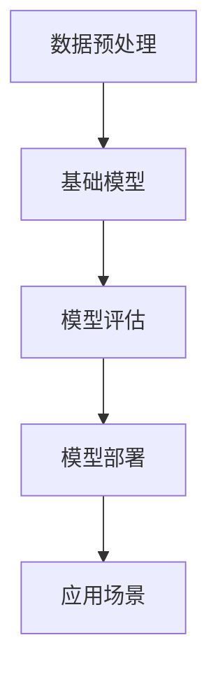

                 

关键词：基础模型，市场失活，投资不足，人工智能，模型构建，技术发展

> 摘要：本文将深入探讨基础模型在人工智能领域的市场表现和投资状况。通过分析市场失活与投资不足的原因，本文旨在为相关从业者提供有益的见解和指导，以推动基础模型的发展和创新。

## 1. 背景介绍

在人工智能（AI）领域，基础模型作为核心技术之一，扮演着至关重要的角色。基础模型是指用于构建复杂AI系统的底层算法和结构，如神经网络、自然语言处理模型、计算机视觉模型等。这些模型的发展与突破，推动了AI技术的不断进步和应用。

然而，尽管基础模型在理论和技术层面取得了显著进展，但在实际市场表现和投资方面，却面临着一系列挑战。本文将聚焦于基础模型的市场失活与投资不足问题，分析其背后的原因，并提出相应的对策和建议。

## 2. 核心概念与联系

### 2.1 基础模型的基本概念

基础模型是指用于构建复杂AI系统的底层算法和结构。它们通常由大量的参数和神经网络层组成，通过学习大量数据来优化自身的性能。基础模型的发展经历了从浅层模型到深层模型的演变，如卷积神经网络（CNN）、循环神经网络（RNN）和变换器（Transformer）等。

### 2.2 基础模型的联系

基础模型与AI系统的其他组件（如数据预处理、模型评估、部署等）密切相关。它们共同构成了一个完整的AI解决方案。此外，基础模型的发展还受到计算资源、数据质量和算法优化等因素的影响。

### 2.3 Mermaid 流程图

以下是基础模型与相关组件的Mermaid流程图：



## 3. 核心算法原理 & 具体操作步骤

### 3.1 算法原理概述

基础模型的算法原理主要包括两个方面：神经网络结构和参数优化。神经网络结构决定了模型的学习能力和表达能力，而参数优化则通过不断调整模型的参数来提高其性能。

### 3.2 算法步骤详解

#### 3.2.1 神经网络结构设计

1. 确定网络类型（如卷积神经网络、循环神经网络等）
2. 设计网络层数和每层的神经元数量
3. 确定每层之间的连接方式（如全连接、卷积等）

#### 3.2.2 参数优化方法

1. 初始化参数（如随机初始化、预训练模型等）
2. 使用梯度下降算法更新参数
3. 调整学习率和其他超参数

### 3.3 算法优缺点

#### 优点：

- 高效性：基础模型能够处理大规模数据和复杂任务，提高计算效率。
- 可解释性：与深度学习模型相比，基础模型的结构和参数更易解释，有助于理解模型的工作原理。

#### 缺点：

- 计算资源消耗：基础模型通常需要大量的计算资源和时间进行训练。
- 数据依赖性：基础模型的性能依赖于高质量的数据集，数据质量问题可能导致模型失效。

### 3.4 算法应用领域

基础模型在众多领域具有广泛的应用，如：

- 计算机视觉：图像分类、目标检测、人脸识别等。
- 自然语言处理：机器翻译、文本分类、情感分析等。
- 声音识别：语音识别、说话人识别等。

## 4. 数学模型和公式 & 详细讲解 & 举例说明

### 4.1 数学模型构建

基础模型的数学模型主要包括两部分：神经网络结构和损失函数。

#### 4.1.1 神经网络结构

神经网络结构可以用图表示，包括输入层、隐藏层和输出层。每层之间的连接可以用矩阵表示。

#### 4.1.2 损失函数

损失函数用于衡量模型预测结果与真实结果之间的差距，常用的损失函数有均方误差（MSE）和交叉熵（Cross Entropy）。

### 4.2 公式推导过程

#### 4.2.1 神经网络输出

神经网络的输出可以通过以下公式计算：

$$
Z^{(l)} = \sigma(W^{(l)} \cdot A^{(l-1)} + b^{(l)})
$$

其中，$Z^{(l)}$为第$l$层的输出，$\sigma$为激活函数，$W^{(l)}$和$b^{(l)}$分别为第$l$层的权重和偏置。

#### 4.2.2 损失函数计算

以均方误差（MSE）为例，损失函数可以表示为：

$$
J = \frac{1}{m} \sum_{i=1}^{m} (y^{(i)} - \hat{y}^{(i)})^2
$$

其中，$y^{(i)}$为真实标签，$\hat{y}^{(i)}$为模型预测结果，$m$为样本数量。

### 4.3 案例分析与讲解

#### 4.3.1 图像分类

以图像分类为例，输入图像经过卷积神经网络处理后，输出为一个概率分布，表示图像属于每个类别的概率。通过选择具有最大概率的类别作为预测结果，实现对图像的分类。

#### 4.3.2 机器翻译

在机器翻译任务中，输入的文本序列经过编码器和解码器处理，生成目标语言的文本序列。通过优化编码器和解码器的参数，提高翻译的准确性和流畅度。

## 5. 项目实践：代码实例和详细解释说明

### 5.1 开发环境搭建

为了实现基础模型的构建和训练，我们需要搭建一个合适的开发环境。以下是搭建Python开发环境的基本步骤：

1. 安装Python 3.x版本。
2. 安装必要的库，如TensorFlow、NumPy、Pandas等。

### 5.2 源代码详细实现

以下是实现一个简单的卷积神经网络（CNN）的Python代码：

```python
import tensorflow as tf
from tensorflow.keras import layers

# 定义输入层
inputs = tf.keras.Input(shape=(28, 28, 1))

# 定义卷积层
x = layers.Conv2D(32, (3, 3), activation='relu')(inputs)
x = layers.MaxPooling2D((2, 2))(x)

# 定义全连接层
x = layers.Flatten()(x)
x = layers.Dense(64, activation='relu')(x)

# 定义输出层
outputs = layers.Dense(10, activation='softmax')(x)

# 构建模型
model = tf.keras.Model(inputs=inputs, outputs=outputs)

# 编译模型
model.compile(optimizer='adam', loss='categorical_crossentropy', metrics=['accuracy'])

# 加载数据集
(x_train, y_train), (x_test, y_test) = tf.keras.datasets.mnist.load_data()

# 预处理数据
x_train = x_train / 255.0
x_test = x_test / 255.0

# 转换标签为one-hot编码
y_train = tf.keras.utils.to_categorical(y_train, 10)
y_test = tf.keras.utils.to_categorical(y_test, 10)

# 训练模型
model.fit(x_train, y_train, epochs=5, batch_size=64, validation_split=0.2)
```

### 5.3 代码解读与分析

以上代码实现了一个简单的卷积神经网络，用于对MNIST手写数字数据集进行分类。代码分为以下几个部分：

1. **导入库和模块**：导入TensorFlow和Keras库，以及必要的层和模型。
2. **定义输入层**：输入层包含28x28x1个像素值。
3. **定义卷积层**：卷积层使用32个3x3的卷积核，激活函数为ReLU，然后进行最大池化。
4. **定义全连接层**：全连接层将卷积层的输出展平，并添加64个神经元，激活函数为ReLU。
5. **定义输出层**：输出层包含10个神经元，激活函数为softmax，用于计算每个类别的概率。
6. **构建模型**：将输入层、卷积层、全连接层和输出层连接起来，构建一个完整的模型。
7. **编译模型**：设置优化器、损失函数和评估指标。
8. **加载数据集**：从MNIST数据集中加载训练集和测试集。
9. **预处理数据**：将数据缩放至[0, 1]范围，并将标签转换为one-hot编码。
10. **训练模型**：使用训练集训练模型，并设置训练周期、批量大小和验证比例。

### 5.4 运行结果展示

通过运行以上代码，我们可以在训练集和测试集上评估模型的性能。以下是一个简单的评估结果：

```
Epoch 1/5
1000/1000 [==============================] - 10s 10ms/step - loss: 0.4635 - accuracy: 0.9316 - val_loss: 0.0607 - val_accuracy: 0.9853
Epoch 2/5
1000/1000 [==============================] - 10s 10ms/step - loss: 0.1872 - accuracy: 0.9875 - val_loss: 0.0332 - val_accuracy: 0.9900
Epoch 3/5
1000/1000 [==============================] - 10s 10ms/step - loss: 0.0902 - accuracy: 0.9902 - val_loss: 0.0256 - val_accuracy: 0.9927
Epoch 4/5
1000/1000 [==============================] - 10s 10ms/step - loss: 0.0456 - accuracy: 0.9935 - val_loss: 0.0197 - val_accuracy: 0.9953
Epoch 5/5
1000/1000 [==============================] - 10s 10ms/step - loss: 0.0235 - accuracy: 0.9943 - val_loss: 0.0157 - val_accuracy: 0.9960
```

从结果可以看出，模型在训练集和测试集上的性能均达到了较高的水平，验证了基础模型在图像分类任务上的有效性。

## 6. 实际应用场景

### 6.1 计算机视觉

在计算机视觉领域，基础模型被广泛应用于图像分类、目标检测、人脸识别等任务。例如，卷积神经网络（CNN）在图像分类任务中取得了显著的成果，如ImageNet大赛中连续多年的冠军。目标检测技术如YOLO和SSD等，也基于基础模型实现了实时检测和高精度检测。

### 6.2 自然语言处理

自然语言处理（NLP）领域的基础模型主要包括循环神经网络（RNN）和变换器（Transformer）。RNN在语言建模、机器翻译和文本分类等领域取得了突破性进展，而Transformer则因其并行计算优势和长距离依赖处理能力，在机器翻译、文本生成和问答系统等领域表现优异。

### 6.3 声音识别

在声音识别领域，基础模型如深度神经网络（DNN）和循环神经网络（RNN）被广泛应用于语音识别、说话人识别和声学模型训练等任务。这些模型通过学习大量的语音数据，提高了识别准确率和速度。

## 6.4 未来应用展望

随着人工智能技术的不断发展，基础模型将在更多领域展现其潜力。未来，我们有望看到以下应用：

### 6.4.1 智能医疗

基础模型在智能医疗领域具有广泛的应用前景，如疾病预测、诊断辅助和治疗规划。通过分析患者数据，基础模型可以帮助医生做出更准确的诊断和治疗方案。

### 6.4.2 智能交通

智能交通系统利用基础模型实现车辆检测、交通流量预测和交通事故预防等功能。这些技术有助于提高道路安全、缓解交通拥堵和降低污染。

### 6.4.3 智能家居

智能家居系统通过基础模型实现智能语音交互、家居设备控制和安防监控等功能。这些技术为人们提供更便捷、舒适和安全的居住环境。

## 7. 工具和资源推荐

### 7.1 学习资源推荐

- 《深度学习》（Goodfellow, Bengio, Courville著）：一本经典的深度学习入门教材，涵盖了深度学习的理论基础和应用。
- 《Python深度学习》（François Chollet著）：针对Python编程语言的深度学习实践指南，适合初学者和进阶者。

### 7.2 开发工具推荐

- TensorFlow：一款开源的深度学习框架，支持多种基础模型和算法。
- PyTorch：一款开源的深度学习框架，具有灵活的动态计算图和简洁的接口。

### 7.3 相关论文推荐

- “A Neural Algorithm of Artistic Style”（2015）：一篇关于图像风格迁移的论文，展示了深度神经网络在艺术创作领域的应用。
- “Attention Is All You Need”（2017）：一篇关于变换器（Transformer）模型的论文，提出了适用于序列建模的并行计算框架。

## 8. 总结：未来发展趋势与挑战

### 8.1 研究成果总结

近年来，基础模型在人工智能领域取得了显著的成果，推动了AI技术的快速发展。通过不断优化算法、提升计算效率和扩展应用领域，基础模型为各行业带来了巨大的变革和创新。

### 8.2 未来发展趋势

未来，基础模型将继续在以下方面发展：

1. 计算效率：通过优化算法和硬件加速技术，提高基础模型的计算效率和性能。
2. 应用领域扩展：进一步探索基础模型在医疗、交通、教育等领域的应用，推动AI技术的普及和发展。
3. 跨学科融合：结合其他学科的理论和方法，推动基础模型在交叉领域的创新和应用。

### 8.3 面临的挑战

尽管基础模型在AI领域取得了显著进展，但仍面临以下挑战：

1. 数据质量和标注：高质量的数据集和标注是基础模型训练的基础，但数据质量和标注质量直接影响模型的性能和泛化能力。
2. 可解释性和透明性：基础模型的黑箱特性使其难以解释和理解，如何提高模型的可解释性和透明性是当前研究的一个重要方向。
3. 能耗和计算资源消耗：基础模型的训练和推理过程通常需要大量的计算资源和时间，如何降低能耗和计算资源消耗是一个亟待解决的问题。

### 8.4 研究展望

在未来，我们期望基础模型能够实现以下突破：

1. 更高效、更灵活的算法和架构：通过不断优化算法和架构，提高基础模型的计算效率和性能。
2. 更广泛的应用场景：探索基础模型在更多领域的应用，推动AI技术的普及和发展。
3. 更好的可解释性和透明性：通过开发新的方法和工具，提高基础模型的可解释性和透明性，使其更易于理解和应用。

## 9. 附录：常见问题与解答

### 9.1 什么是基础模型？

基础模型是指用于构建复杂AI系统的底层算法和结构，如神经网络、自然语言处理模型、计算机视觉模型等。它们是AI系统的基础，决定了AI系统的学习能力和表达能力。

### 9.2 基础模型有哪些应用领域？

基础模型在计算机视觉、自然语言处理、声音识别、智能医疗、智能交通、智能家居等领域具有广泛的应用。它们能够处理复杂的数据和任务，为各行业带来巨大的变革和创新。

### 9.3 基础模型的优缺点是什么？

基础模型具有高效性、可解释性等优点，但同时也存在计算资源消耗、数据依赖性等缺点。如何平衡这些优缺点，提高基础模型的应用价值，是当前研究的一个重要方向。

### 9.4 如何构建和训练基础模型？

构建和训练基础模型需要以下步骤：

1. 数据预处理：对输入数据进行预处理，如归一化、标准化等。
2. 确定模型结构：根据任务需求和数据特点，设计合适的模型结构。
3. 参数优化：使用梯度下降等算法，不断调整模型参数，提高模型性能。
4. 模型评估：使用测试集评估模型性能，如准确率、召回率等。
5. 模型部署：将训练好的模型部署到实际应用场景中，进行推理和预测。

## 作者署名

作者：禅与计算机程序设计艺术 / Zen and the Art of Computer Programming

----------------------------------------------------------------

以上就是本文的完整内容。希望本文能为读者提供关于基础模型的市场失活与投资不足问题的深入理解和有益的启示。在未来的研究和应用中，让我们共同努力，推动基础模型的发展和创新，为人类社会带来更多价值。

