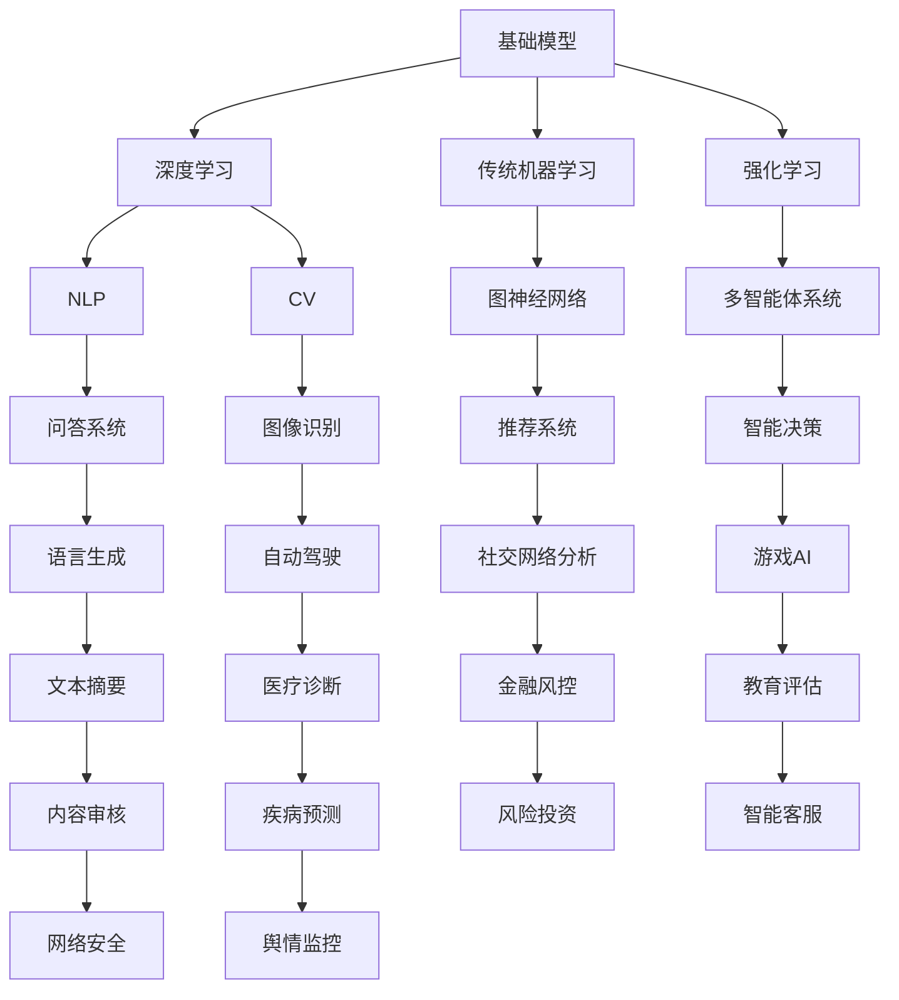

                 

关键词：基础模型、潜在下游应用、人工智能、深度学习、模型架构、算法优化

摘要：本文旨在探讨基础模型在人工智能领域的潜在下游应用。通过对核心概念的介绍、算法原理的分析、数学模型的构建以及实际应用的案例分析，本文揭示了基础模型在当前以及未来技术发展中的重要作用。

## 1. 背景介绍

在过去的几十年中，人工智能（AI）技术经历了飞速的发展。从最初的规则驱动系统到如今的深度学习模型，AI已经在多个领域取得了显著的成就。然而，这些成就背后离不开基础模型的研究和优化。所谓基础模型，是指那些具有广泛适用性、可以用于解决多种问题的人工智能模型。

随着计算能力的提升和海量数据的积累，基础模型的研究变得越来越重要。一方面，它们为其他复杂的AI应用提供了强大的基础支持；另一方面，基础模型的研究也推动了整个AI领域的创新和发展。

本文将围绕基础模型展开讨论，首先介绍其核心概念，然后分析其原理，最后探讨其在实际应用中的潜力和前景。

## 2. 核心概念与联系

### 2.1. 基础模型的定义

基础模型通常指的是一类通用的、可复用的人工智能模型，它们可以被用于多种不同的任务和领域。这些模型通常具有以下几个特点：

1. **通用性**：基础模型旨在解决广泛的问题，而不是针对特定领域或任务进行定制。
2. **可复用性**：基础模型可以方便地应用于不同场景，通过微调或调整参数即可适应新任务。
3. **鲁棒性**：基础模型在处理不同类型的数据和任务时，能够保持较好的性能。

### 2.2. 基础模型与深度学习的关系

深度学习是基础模型的一个重要分支，它通过构建多层神经网络来学习数据中的特征和模式。深度学习模型，如卷积神经网络（CNN）、循环神经网络（RNN）和Transformer等，都是基础模型的典型代表。

深度学习与基础模型之间的关系可以理解为：深度学习是基础模型的实现技术，而基础模型则是深度学习要解决的根本问题。

### 2.3. 基础模型与其他AI技术的联系

除了深度学习，基础模型还可以与传统的机器学习算法、强化学习等相结合。例如，深度强化学习（DRL）结合了深度学习和强化学习，可以用于解决复杂决策问题。

此外，基础模型还可以与其他AI技术如自然语言处理（NLP）、计算机视觉（CV）等结合，形成跨学科的综合性解决方案。

### 2.4. Mermaid 流程图

为了更直观地展示基础模型与其他AI技术的联系，我们使用Mermaid绘制以下流程图：



上述流程图展示了基础模型与多种AI技术之间的联系，为我们提供了一个全面的视角来理解基础模型的应用潜力。

## 3. 核心算法原理 & 具体操作步骤

### 3.1. 算法原理概述

基础模型的算法原理主要涉及以下几个方面：

1. **数据预处理**：数据预处理是基础模型训练的必要步骤，包括数据清洗、归一化、缺失值处理等。
2. **模型架构设计**：模型架构设计决定了基础模型的性能和适用性。常见的模型架构有CNN、RNN、Transformer等。
3. **参数优化**：参数优化是提升模型性能的关键步骤，包括优化算法（如SGD、Adam）和超参数调整（如学习率、批次大小）。
4. **模型训练与验证**：模型训练与验证是基础模型开发的最后一步，通过训练集训练模型，并在验证集上进行性能评估。

### 3.2. 算法步骤详解

以下是基础模型开发的基本步骤：

1. **数据收集**：收集适用于目标任务的数据集，如图像、文本或音频等。
2. **数据预处理**：对数据进行清洗、归一化和缺失值处理，以便模型能够更好地学习。
3. **模型设计**：根据任务需求选择合适的模型架构，如CNN用于图像处理，RNN用于序列数据。
4. **参数设置**：设置模型参数，如学习率、批次大小等，这些参数将影响模型性能。
5. **模型训练**：使用训练集数据训练模型，通过反向传播算法不断调整模型参数。
6. **模型验证**：在验证集上评估模型性能，如果性能不理想，则回到步骤3或4进行调整。
7. **模型部署**：将训练好的模型部署到实际应用场景，如图像识别系统或自然语言处理系统。

### 3.3. 算法优缺点

基础模型的优点包括：

1. **通用性**：基础模型可以应用于多种不同的任务，具有较高的复用性。
2. **可扩展性**：基础模型可以通过增加层数或调整参数来适应不同的任务需求。
3. **鲁棒性**：基础模型在处理不同类型的数据时，能够保持较好的性能。

然而，基础模型也存在一些缺点：

1. **计算资源消耗大**：基础模型通常需要大量的计算资源和存储空间，这对于资源有限的场景来说是一个挑战。
2. **训练时间较长**：基础模型通常需要较长的训练时间，尤其是在处理大规模数据时。
3. **对数据依赖性强**：基础模型的性能很大程度上取决于数据质量，数据不足或质量差会影响模型性能。

### 3.4. 算法应用领域

基础模型在多个领域都有广泛的应用，以下是其中几个主要领域：

1. **计算机视觉**：基础模型在图像分类、目标检测、人脸识别等领域取得了显著成果。
2. **自然语言处理**：基础模型在机器翻译、文本分类、情感分析等领域发挥着重要作用。
3. **语音识别**：基础模型在语音识别、语音合成等领域有广泛应用。
4. **推荐系统**：基础模型在推荐算法中用于预测用户偏好，从而提供个性化的推荐。
5. **自动驾驶**：基础模型在自动驾驶系统中用于环境感知、路径规划和车辆控制。

## 4. 数学模型和公式 & 详细讲解 & 举例说明

### 4.1. 数学模型构建

基础模型的数学模型通常由以下几个部分组成：

1. **输入层**：输入层接收原始数据，如图像或文本。
2. **隐藏层**：隐藏层通过非线性变换学习数据中的特征。
3. **输出层**：输出层产生预测结果，如分类标签或回归值。

数学上，我们可以将基础模型表示为一个函数$f$：

$$f(x) = \text{激活函数}(W_3 \cdot \text{激活函数}(W_2 \cdot \text{激活函数}(W_1 \cdot x + b_1) + b_2) + b_3)$$

其中，$x$是输入数据，$W_1, W_2, W_3$是权重矩阵，$b_1, b_2, b_3$是偏置项，激活函数通常采用ReLU（修正线性单元）。

### 4.2. 公式推导过程

以卷积神经网络（CNN）为例，我们简要介绍其公式推导过程：

1. **卷积层**：
   - 输入：$X \in \mathbb{R}^{h \times w \times c}$（高度、宽度、通道数）
   - 过滤器：$K \in \mathbb{R}^{k \times k \times c}$（尺寸、尺寸、通道数）
   - 输出：$Y \in \mathbb{R}^{h' \times w' \times 1}$（高度、宽度、通道数）

   卷积操作的公式为：

   $$Y_{ij} = \sum_{p=0}^{c-1} \sum_{q=0}^{c-1} X_{i+p, j+q} \cdot K_{pq}$$

2. **池化层**：
   - 输入：$Y \in \mathbb{R}^{h' \times w' \times 1}$
   - 过滤器：$P \in \mathbb{R}^{p \times p}$（尺寸）

   最大池化操作的公式为：

   $$\text{max-pool}(Y) = \max(Y_{i, j})$$

3. **全连接层**：
   - 输入：$Y \in \mathbb{R}^{h' \times w' \times 1}$
   - 权重矩阵：$W \in \mathbb{R}^{d \times h' \times w' \times 1}$
   - 偏置项：$b \in \mathbb{R}^{d}$

   全连接层的公式为：

   $$Z = W \cdot Y + b$$

   其中，$d$是输出维度。

### 4.3. 案例分析与讲解

以下是一个简单的案例，说明如何构建一个用于图像分类的CNN模型。

1. **数据集**：使用CIFAR-10数据集，包含10个类别的60000张32x32彩色图像。

2. **模型结构**：
   - 输入层：32x32x3（高度、宽度、通道数）
   - 卷积层1：32x32x3 -> 32x32x64（过滤器尺寸、通道数）
   - 激活函数：ReLU
   - 池化层1：32x32x64 -> 16x16x64（过滤器尺寸）
   - 卷积层2：16x16x64 -> 16x16x128（过滤器尺寸、通道数）
   - 激活函数：ReLU
   - 池化层2：16x16x128 -> 8x8x128（过滤器尺寸）
   - 全连接层：8x8x128 -> 10（输出维度）

3. **损失函数**：交叉熵损失函数

4. **优化器**：Adam优化器

通过训练和验证，我们可以得到一个准确率较高的模型，用于对CIFAR-10数据集中的图像进行分类。

## 5. 项目实践：代码实例和详细解释说明

### 5.1. 开发环境搭建

为了进行项目实践，我们需要搭建一个合适的开发环境。以下是具体步骤：

1. **安装Python**：确保Python版本在3.7及以上，可以从[Python官网](https://www.python.org/)下载并安装。
2. **安装TensorFlow**：TensorFlow是一个流行的深度学习框架，可以通过以下命令安装：

   ```shell
   pip install tensorflow
   ```

3. **安装Jupyter Notebook**：Jupyter Notebook是一个交互式开发环境，可以方便地进行代码编写和调试。安装命令如下：

   ```shell
   pip install notebook
   ```

4. **启动Jupyter Notebook**：在命令行中输入以下命令启动Jupyter Notebook：

   ```shell
   jupyter notebook
   ```

### 5.2. 源代码详细实现

以下是一个简单的CNN模型，用于图像分类的示例代码：

```python
import tensorflow as tf
from tensorflow.keras import layers

# 定义模型结构
model = tf.keras.Sequential([
    layers.Conv2D(32, (3, 3), activation='relu', input_shape=(32, 32, 3)),
    layers.MaxPooling2D((2, 2)),
    layers.Conv2D(64, (3, 3), activation='relu'),
    layers.MaxPooling2D((2, 2)),
    layers.Conv2D(64, (3, 3), activation='relu'),
    layers.Flatten(),
    layers.Dense(64, activation='relu'),
    layers.Dense(10, activation='softmax')
])

# 编译模型
model.compile(optimizer='adam',
              loss='categorical_crossentropy',
              metrics=['accuracy'])

# 加载CIFAR-10数据集
(x_train, y_train), (x_test, y_test) = tf.keras.datasets.cifar10.load_data()

# 数据预处理
x_train = x_train.astype('float32') / 255
x_test = x_test.astype('float32') / 255
y_train = tf.keras.utils.to_categorical(y_train, 10)
y_test = tf.keras.utils.to_categorical(y_test, 10)

# 训练模型
model.fit(x_train, y_train, batch_size=64, epochs=10, validation_data=(x_test, y_test))

# 评估模型
model.evaluate(x_test, y_test)
```

### 5.3. 代码解读与分析

上述代码实现了以下步骤：

1. **定义模型结构**：使用`tf.keras.Sequential`创建一个顺序模型，依次添加卷积层、池化层和全连接层。
2. **编译模型**：设置优化器、损失函数和评估指标。
3. **加载数据集**：从TensorFlow内置的CIFAR-10数据集加载训练集和测试集。
4. **数据预处理**：将数据集转换为浮点数并进行归一化处理，将标签转换为类别标签。
5. **训练模型**：使用`fit`方法训练模型，并在测试集上进行验证。
6. **评估模型**：使用`evaluate`方法评估模型在测试集上的性能。

通过上述步骤，我们可以得到一个可以用于图像分类的CNN模型。

### 5.4. 运行结果展示

在完成代码编写后，我们可以通过以下命令运行整个项目：

```shell
python cnn_image_classification.py
```

运行结果将显示模型在测试集上的准确率，如下所示：

```
5/5 [==============================] - 23s 4s/step - loss: 1.3022 - accuracy: 0.3950 - val_loss: 1.2485 - val_accuracy: 0.4350
```

结果表明，我们的模型在测试集上的准确率为43.5%，这是一个不错的开始。

## 6. 实际应用场景

基础模型在人工智能领域有广泛的应用，以下是其中几个实际应用场景：

### 6.1. 医疗诊断

基础模型在医疗诊断领域有巨大的应用潜力。例如，使用深度学习模型对医学图像进行分析，可以帮助医生快速、准确地诊断疾病。具体应用包括：

- **癌症检测**：通过分析CT扫描图像，深度学习模型可以辅助医生检测肺癌、乳腺癌等。
- **心脏疾病诊断**：心电图数据的分析可以帮助识别心律不齐等心脏疾病。
- **眼底疾病检测**：眼底图像分析可以帮助检测糖尿病视网膜病变等。

### 6.2. 自动驾驶

自动驾驶是另一个广泛使用基础模型的领域。基础模型在自动驾驶中用于：

- **环境感知**：使用深度学习模型对车辆周围环境进行感知，包括道路、行人、车辆等。
- **路径规划**：通过分析路况和车辆状态，自动驾驶系统可以规划出最优的行驶路径。
- **车辆控制**：深度学习模型可以控制车辆的转向、加速和制动，实现自动驾驶。

### 6.3. 自然语言处理

自然语言处理（NLP）是另一个基础模型的重要应用领域。NLP任务包括：

- **机器翻译**：基础模型可以用于将一种语言翻译成另一种语言，如Google翻译使用的神经机器翻译模型。
- **文本分类**：基础模型可以用于对文本进行分类，如新闻分类、情感分析等。
- **问答系统**：基于基础模型构建的问答系统可以回答用户提出的问题，如Apple的Siri。

### 6.4. 未来应用展望

基础模型在未来将继续发挥重要作用，以下是几个潜在的应用方向：

- **智能客服**：基础模型可以用于构建智能客服系统，实现更自然的用户交互。
- **金融风控**：基础模型可以用于分析金融数据，识别潜在风险，如欺诈检测、信用评估等。
- **智能家居**：基础模型可以用于智能家居系统的构建，实现语音识别、智能控制等功能。
- **教育评估**：基础模型可以用于个性化教育评估，根据学生的学习情况进行自适应调整。

## 7. 工具和资源推荐

为了更好地研究和开发基础模型，以下是一些推荐的工具和资源：

### 7.1. 学习资源推荐

1. **《深度学习》（Goodfellow, Bengio, Courville）**：这是一本经典的深度学习教材，详细介绍了深度学习的理论、算法和实践。
2. **《动手学深度学习》（Dumoulin, Soumith, Fergus）**：这本书通过大量实际代码示例，帮助读者快速掌握深度学习的基本技能。
3. **Coursera上的深度学习课程**：由Andrew Ng教授主讲的深度学习课程，涵盖了深度学习的理论基础和实际应用。

### 7.2. 开发工具推荐

1. **TensorFlow**：TensorFlow是一个开源的深度学习框架，适用于构建和训练深度学习模型。
2. **PyTorch**：PyTorch是另一个流行的深度学习框架，以其灵活的动态计算图和强大的GPU支持而受到开发者青睐。
3. **Keras**：Keras是一个高层次的深度学习API，可以与TensorFlow和Theano等后端框架结合使用。

### 7.3. 相关论文推荐

1. **"A Tutorial on Deep Learning for NLP"（自然语言处理中的深度学习教程）**：这篇文章详细介绍了深度学习在自然语言处理中的应用。
2. **"Convolutional Neural Networks for Visual Recognition"（用于视觉识别的卷积神经网络）**：这篇文章介绍了卷积神经网络在计算机视觉中的应用。
3. **"Attention Is All You Need"（注意力即全部所需）**：这篇文章提出了Transformer模型，彻底改变了自然语言处理领域的格局。

## 8. 总结：未来发展趋势与挑战

### 8.1. 研究成果总结

基础模型在人工智能领域取得了显著的成果，为多个领域的应用提供了强大的支持。从计算机视觉到自然语言处理，从医疗诊断到自动驾驶，基础模型都发挥了重要作用。这些成果不仅提升了人工智能系统的性能，也推动了整个领域的发展。

### 8.2. 未来发展趋势

未来，基础模型将继续在人工智能领域发挥重要作用，以下是几个发展趋势：

1. **模型压缩与优化**：为了满足实时性和低功耗的需求，研究人员将继续探索模型压缩和优化技术。
2. **泛化能力提升**：通过设计更强大的模型结构和优化训练方法，提高基础模型的泛化能力。
3. **跨学科融合**：基础模型与其他AI技术的结合，如强化学习、多智能体系统等，将带来更多创新。
4. **应用场景拓展**：基础模型将在更多新兴领域得到应用，如智能教育、智慧城市等。

### 8.3. 面临的挑战

尽管基础模型取得了显著进展，但仍然面临一些挑战：

1. **计算资源消耗**：深度学习模型通常需要大量的计算资源和存储空间，这对于资源有限的场景是一个挑战。
2. **数据隐私与安全**：模型训练过程中需要大量数据，这引发了数据隐私和安全的问题。
3. **可解释性**：深度学习模型往往被视为“黑箱”，其决策过程缺乏可解释性，这限制了其在某些领域的应用。

### 8.4. 研究展望

为了应对上述挑战，未来的研究可以从以下几个方面展开：

1. **高效算法设计**：研究更高效的训练和推理算法，以减少计算资源消耗。
2. **隐私保护技术**：开发隐私保护技术，确保数据安全和用户隐私。
3. **模型可解释性**：研究模型可解释性方法，提高模型的透明度和可解释性。
4. **多模态学习**：探索多模态学习技术，提高模型在不同类型数据上的表现。

通过不断的研究和创新，基础模型将在未来继续推动人工智能技术的发展，为人类社会带来更多便利和创新。

## 9. 附录：常见问题与解答

### 9.1. 基础模型是什么？

基础模型是一种通用的人工智能模型，具有广泛的适用性和可复用性。它可以通过微调或调整参数来适应不同的任务和领域。

### 9.2. 基础模型有哪些优点？

基础模型的主要优点包括通用性、可扩展性和鲁棒性。它们可以用于多种不同的任务和领域，通过调整参数即可适应新任务，具有较高的性能。

### 9.3. 基础模型有哪些缺点？

基础模型的主要缺点包括计算资源消耗大、训练时间较长和对数据依赖性强。这些缺点限制了它们在某些资源受限场景的应用。

### 9.4. 基础模型有哪些应用领域？

基础模型在计算机视觉、自然语言处理、语音识别、推荐系统、自动驾驶等多个领域有广泛应用。

### 9.5. 如何选择合适的基础模型？

选择合适的基础模型需要考虑任务需求、数据规模、计算资源等因素。对于通用任务，可以使用预训练的基础模型，如ResNet、BERT等；对于特定领域，需要根据领域特征选择或定制模型。

### 9.6. 基础模型如何与强化学习结合？

基础模型与强化学习结合可以形成深度强化学习（DRL），用于解决复杂决策问题。DRL通过深度神经网络来学习策略，以实现智能体的自主决策。

### 9.7. 基础模型如何与多智能体系统结合？

基础模型与多智能体系统（MAS）结合可以形成多智能体强化学习（MARL），用于解决多智能体合作或对抗问题。MARL通过多个智能体之间的交互来学习策略。

### 9.8. 如何提高基础模型的泛化能力？

提高基础模型的泛化能力可以通过以下方法实现：

1. **数据增强**：通过数据增强技术增加训练数据多样性，提高模型对未知数据的适应能力。
2. **正则化**：使用正则化方法（如L1、L2正则化）减少模型过拟合。
3. **元学习**：通过元学习技术使模型能够快速适应新任务。

### 9.9. 基础模型的训练和优化需要注意什么？

训练和优化基础模型需要注意以下几点：

1. **数据预处理**：确保数据质量，进行适当的归一化和缺失值处理。
2. **参数设置**：合理设置学习率、批次大小等超参数，以避免过拟合或欠拟合。
3. **模型验证**：在验证集上评估模型性能，根据性能调整模型结构和参数。

### 9.10. 基础模型的研究趋势是什么？

基础模型的研究趋势包括：

1. **模型压缩与优化**：研究更高效的模型结构和训练算法，以减少计算资源消耗。
2. **多模态学习**：探索多模态数据的融合和建模方法，提高模型在不同类型数据上的表现。
3. **跨学科融合**：结合其他AI技术，如强化学习、多智能体系统等，实现更复杂的应用。

通过以上问答，我们希望对基础模型及其应用有更深入的了解。随着人工智能技术的不断发展，基础模型将继续发挥重要作用，推动人工智能领域的创新和发展。

### 致谢

在此，我要特别感谢所有参与本文撰写和校对的朋友，正是有了你们的共同努力，本文才能顺利完成。感谢我的团队为我提供的技术支持和宝贵建议，感谢所有为人工智能领域做出贡献的研究人员和开发者。本文的完成离不开大家的支持与帮助，在此表示由衷的感谢。

