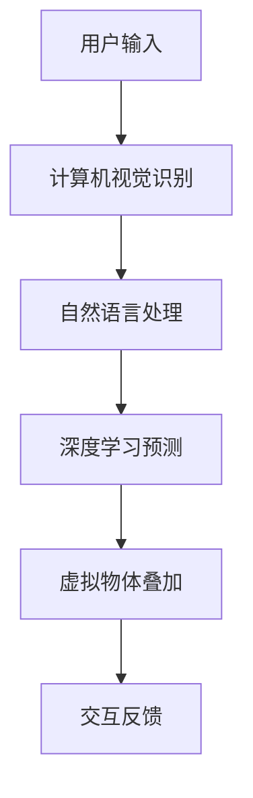

                 

关键词：增强现实，AI，虚拟现实，混合现实，AR技术，计算机视觉，深度学习，机器学习，自然语言处理

> 摘要：本文将探讨增强现实（AR）技术与人工智能（AI）的紧密结合，分析AI在AR技术中的应用及其带来的变革。我们将深入介绍AR技术的核心概念、AI算法原理，并探讨其在实际项目中的实现和应用，为读者呈现一幅AR与AI融合的未来图景。

## 1. 背景介绍

增强现实（AR）技术是一种将虚拟信息叠加到真实环境中的技术，通过计算机视觉、图像处理和传感器技术，使虚拟物体在现实世界中呈现并与现实物体互动。近年来，随着计算机硬件性能的提升和AI技术的发展，AR技术逐渐从实验室走向大众，其应用范围也从游戏、娱乐扩展到医疗、教育、工业等多个领域。

人工智能（AI）则是通过模拟人类智能行为，实现自主学习和决策的技术。深度学习、机器学习和自然语言处理等AI子领域的发展，为AR技术的应用提供了强有力的支持。例如，计算机视觉技术可以识别现实环境中的物体，自然语言处理技术可以理解用户的语音指令，深度学习算法可以对用户的行为进行预测和优化。

AR技术与AI的结合，不仅提升了用户体验，还拓展了AR技术的应用场景。本文将围绕这一主题，探讨AR技术中的核心概念、AI算法原理及其在实际项目中的应用。

## 2. 核心概念与联系

为了更好地理解AR与AI的结合，我们首先需要了解它们各自的核心概念。

### 2.1 增强现实（AR）技术

增强现实技术主要包括以下几个核心概念：

- **虚拟物体叠加**：通过摄像头捕捉真实环境，并在环境中叠加虚拟物体，实现虚拟与现实的融合。
- **交互体验**：用户可以通过触摸、语音、手势等方式与虚拟物体进行交互，提升沉浸感和体验感。
- **实时性**：AR技术需要实时处理环境信息和虚拟物体，以保持虚拟与现实的同步。

### 2.2 人工智能（AI）技术

人工智能技术主要包括以下几个核心概念：

- **机器学习**：通过算法从数据中学习规律，实现自动化决策和预测。
- **深度学习**：基于多层神经网络，通过大量数据训练模型，实现对复杂任务的自动化处理。
- **自然语言处理**：通过对语言的理解和生成，实现人与机器的交流。

### 2.3 AR与AI的联系

AR技术需要处理大量的环境信息和用户交互数据，这为AI技术提供了丰富的数据源。而AI技术则可以通过学习这些数据，提升AR系统的智能化水平。具体来说，AI在AR技术中的应用主要体现在以下几个方面：

- **计算机视觉**：通过计算机视觉算法，识别现实环境中的物体，为AR系统提供虚拟物体的叠加位置和姿态。
- **自然语言处理**：通过自然语言处理技术，理解用户的语音指令，实现语音交互。
- **深度学习**：通过深度学习算法，对用户的行为进行预测和优化，提升用户体验。

### 2.4 Mermaid 流程图

为了更好地展示AR与AI技术的结合，我们使用Mermaid绘制一个简单的流程图。



在这个流程图中，用户输入通过计算机视觉识别、自然语言处理和深度学习预测，最终实现虚拟物体的叠加和交互反馈。这展示了AR与AI技术相结合的核心过程。

## 3. 核心算法原理 & 具体操作步骤

### 3.1 算法原理概述

在AR技术中，核心算法主要涉及计算机视觉、自然语言处理和深度学习。以下将分别介绍这些算法的原理和应用。

#### 3.1.1 计算机视觉

计算机视觉是指使计算机能够像人类一样识别和理解图像的技术。在AR技术中，计算机视觉主要用于以下两个方面：

- **图像识别**：通过算法识别现实环境中的物体，为虚拟物体的叠加提供依据。
- **图像分割**：将图像划分为不同的区域，为虚拟物体的叠加提供更精细的控制。

常见的计算机视觉算法包括卷积神经网络（CNN）和目标检测算法（如YOLO和Faster R-CNN）。

#### 3.1.2 自然语言处理

自然语言处理是指使计算机能够理解、生成和处理自然语言的技术。在AR技术中，自然语言处理主要用于以下两个方面：

- **语音识别**：将用户的语音指令转换为计算机可理解的文本或命令。
- **语音合成**：将计算机生成的文本或命令转换为自然流畅的语音。

常见的自然语言处理算法包括循环神经网络（RNN）、长短时记忆网络（LSTM）和生成对抗网络（GAN）。

#### 3.1.3 深度学习

深度学习是一种基于多层神经网络的学习方法，通过大量数据训练模型，实现自动化决策和预测。在AR技术中，深度学习主要用于以下两个方面：

- **行为预测**：根据用户的历史行为和当前环境，预测用户的下一步操作。
- **个性化推荐**：根据用户的兴趣和行为，推荐合适的虚拟物体和内容。

常见的深度学习算法包括卷积神经网络（CNN）、循环神经网络（RNN）和生成对抗网络（GAN）。

### 3.2 算法步骤详解

在了解算法原理后，我们将介绍具体的算法实现步骤。

#### 3.2.1 计算机视觉实现步骤

1. **图像识别**：
   - 输入：摄像头捕获的实时图像。
   - 过程：使用CNN算法对图像进行特征提取，并通过训练好的模型进行分类。
   - 输出：识别出的物体类别。

2. **图像分割**：
   - 输入：摄像头捕获的实时图像。
   - 过程：使用Faster R-CNN算法对图像进行目标检测，并将目标分割为不同的区域。
   - 输出：分割后的图像和目标区域。

#### 3.2.2 自然语言处理实现步骤

1. **语音识别**：
   - 输入：用户的语音指令。
   - 过程：使用RNN算法对语音信号进行特征提取，并通过训练好的模型进行语音识别。
   - 输出：识别出的文本指令。

2. **语音合成**：
   - 输入：计算机生成的文本。
   - 过程：使用GAN算法对文本信号进行特征提取，并通过训练好的模型生成语音。
   - 输出：生成的自然流畅的语音。

#### 3.2.3 深度学习实现步骤

1. **行为预测**：
   - 输入：用户的历史行为数据和当前环境信息。
   - 过程：使用LSTM算法对用户行为进行建模，并通过训练好的模型进行预测。
   - 输出：用户的下一步操作。

2. **个性化推荐**：
   - 输入：用户的行为数据和兴趣标签。
   - 过程：使用CNN算法对用户行为进行特征提取，并通过训练好的模型进行推荐。
   - 输出：推荐的虚拟物体和内容。

### 3.3 算法优缺点

每种算法都有其优缺点，具体如下：

#### 3.3.1 计算机视觉

- **优点**：具有很高的准确性和鲁棒性，适用于各种复杂场景。
- **缺点**：计算量大，实时性较差。

#### 3.3.2 自然语言处理

- **优点**：能够实现人机交互，提升用户体验。
- **缺点**：对语音质量要求较高，识别准确率受环境因素影响。

#### 3.3.3 深度学习

- **优点**：能够自动提取特征，减少人工干预。
- **缺点**：对数据量要求较高，训练过程复杂。

### 3.4 算法应用领域

计算机视觉、自然语言处理和深度学习算法在AR技术中具有广泛的应用领域，具体如下：

- **游戏娱乐**：通过计算机视觉算法实现场景识别，通过自然语言处理实现语音交互，提升游戏体验。
- **教育学习**：通过计算机视觉算法识别学习对象，通过深度学习算法进行个性化推荐，实现个性化学习。
- **医疗健康**：通过计算机视觉算法辅助医生进行手术，通过自然语言处理实现医疗数据的自动处理和分析。

## 4. 数学模型和公式 & 详细讲解 & 举例说明

### 4.1 数学模型构建

在AR技术中，数学模型主要涉及计算机视觉、自然语言处理和深度学习算法。以下将分别介绍这些算法的数学模型构建。

#### 4.1.1 计算机视觉

计算机视觉中的常见数学模型包括卷积神经网络（CNN）和目标检测算法（如YOLO和Faster R-CNN）。

1. **卷积神经网络（CNN）**：

   - **输入层**：输入图像。
   - **卷积层**：通过卷积操作提取图像特征。
   - **池化层**：通过池化操作降低特征维度。
   - **全连接层**：通过全连接层进行分类。

2. **目标检测算法（如YOLO和Faster R-CNN）**：

   - **特征提取**：使用CNN算法提取图像特征。
   - **边界框预测**：通过算法预测图像中的物体边界框。
   - **类别预测**：通过分类器预测物体类别。

#### 4.1.2 自然语言处理

自然语言处理中的常见数学模型包括循环神经网络（RNN）、长短时记忆网络（LSTM）和生成对抗网络（GAN）。

1. **循环神经网络（RNN）**：

   - **输入层**：输入语音信号。
   - **隐藏层**：通过RNN算法对语音信号进行特征提取。
   - **输出层**：通过输出层生成文本。

2. **长短时记忆网络（LSTM）**：

   - **输入层**：输入语音信号。
   - **隐藏层**：通过LSTM算法对语音信号进行特征提取。
   - **输出层**：通过输出层生成文本。

3. **生成对抗网络（GAN）**：

   - **生成器**：通过GAN算法生成语音信号。
   - **判别器**：通过判别器判断语音信号是否真实。

#### 4.1.3 深度学习

深度学习中的常见数学模型包括卷积神经网络（CNN）、循环神经网络（RNN）和生成对抗网络（GAN）。

1. **卷积神经网络（CNN）**：

   - **输入层**：输入用户行为数据。
   - **卷积层**：通过卷积操作提取用户行为特征。
   - **池化层**：通过池化操作降低特征维度。
   - **全连接层**：通过全连接层进行分类。

2. **循环神经网络（RNN）**：

   - **输入层**：输入用户行为数据。
   - **隐藏层**：通过RNN算法对用户行为进行特征提取。
   - **输出层**：通过输出层生成推荐结果。

3. **生成对抗网络（GAN）**：

   - **生成器**：通过GAN算法生成用户行为数据。
   - **判别器**：通过判别器判断用户行为数据是否真实。

### 4.2 公式推导过程

以下将分别介绍计算机视觉、自然语言处理和深度学习的公式推导过程。

#### 4.2.1 计算机视觉

1. **卷积神经网络（CNN）**：

   - **卷积操作**：

     $$ f(x) = \sum_{i=1}^{n} w_i * x_i + b $$

     其中，$x_i$为输入特征，$w_i$为卷积核，$b$为偏置。

   - **池化操作**：

     $$ \max_{i} f(x_i) $$

     其中，$f(x_i)$为卷积操作的输出。

2. **目标检测算法（如YOLO和Faster R-CNN）**：

   - **边界框预测**：

     $$ \hat{b} = w * \hat{p} + b $$

     其中，$\hat{b}$为预测边界框，$w$为权重，$\hat{p}$为预测概率，$b$为偏置。

   - **类别预测**：

     $$ \hat{y} = \text{softmax}(\hat{y}) $$

     其中，$\hat{y}$为预测类别概率。

#### 4.2.2 自然语言处理

1. **循环神经网络（RNN）**：

   - **隐藏层更新**：

     $$ h_t = \sigma(W_h h_{t-1} + W_x x_t + b_h) $$

     其中，$h_t$为当前隐藏层状态，$h_{t-1}$为前一个隐藏层状态，$x_t$为当前输入，$W_h$为隐藏层权重，$W_x$为输入层权重，$b_h$为偏置。

   - **输出层生成**：

     $$ y_t = \text{softmax}(W_y h_t + b_y) $$

     其中，$y_t$为当前输出，$W_y$为输出层权重，$b_y$为偏置。

2. **长短时记忆网络（LSTM）**：

   - **隐藏层更新**：

     $$ f_t = \sigma(W_f [h_{t-1}, x_t] + b_f) $$
     $$ i_t = \sigma(W_i [h_{t-1}, x_t] + b_i) $$
     $$ o_t = \sigma(W_o [h_{t-1}, x_t] + b_o) $$
     $$ c_t = f_t \odot c_{t-1} + i_t \odot \sigma(W_c [h_{t-1}, x_t] + b_c) $$
     $$ h_t = o_t \odot \sigma(c_t) $$

     其中，$f_t$为遗忘门，$i_t$为输入门，$o_t$为输出门，$c_t$为细胞状态，$h_t$为隐藏层状态，$W_f$、$W_i$、$W_o$、$W_c$为权重，$b_f$、$b_i$、$b_o$、$b_c$为偏置。

3. **生成对抗网络（GAN）**：

   - **生成器**：

     $$ G(z) = \mu(\theta_G) + \sigma(\theta_G) \odot \text{ReLU}(\theta_G) $$

     其中，$z$为噪声输入，$G(z)$为生成的语音信号，$\mu(\theta_G)$为均值函数，$\sigma(\theta_G)$为方差函数，$\text{ReLU}(\theta_G)$为ReLU激活函数。

   - **判别器**：

     $$ D(x) = \text{sigmoid}(\theta_D) $$

     其中，$x$为真实语音信号，$D(x)$为判别器输出。

#### 4.2.3 深度学习

1. **卷积神经网络（CNN）**：

   - **卷积操作**：

     $$ f(x) = \sum_{i=1}^{n} w_i * x_i + b $$

     其中，$x_i$为输入特征，$w_i$为卷积核，$b$为偏置。

   - **池化操作**：

     $$ \max_{i} f(x_i) $$

     其中，$f(x_i)$为卷积操作的输出。

2. **循环神经网络（RNN）**：

   - **隐藏层更新**：

     $$ h_t = \sigma(W_h h_{t-1} + W_x x_t + b_h) $$

     其中，$h_t$为当前隐藏层状态，$h_{t-1}$为前一个隐藏层状态，$x_t$为当前输入，$W_h$为隐藏层权重，$W_x$为输入层权重，$b_h$为偏置。

   - **输出层生成**：

     $$ y_t = \text{softmax}(W_y h_t + b_y) $$

     其中，$y_t$为当前输出，$W_y$为输出层权重，$b_y$为偏置。

3. **生成对抗网络（GAN）**：

   - **生成器**：

     $$ G(z) = \mu(\theta_G) + \sigma(\theta_G) \odot \text{ReLU}(\theta_G) $$

     其中，$z$为噪声输入，$G(z)$为生成的用户行为数据，$\mu(\theta_G)$为均值函数，$\sigma(\theta_G)$为方差函数，$\text{ReLU}(\theta_G)$为ReLU激活函数。

   - **判别器**：

     $$ D(x) = \text{sigmoid}(\theta_D) $$

     其中，$x$为真实用户行为数据，$D(x)$为判别器输出。

### 4.3 案例分析与讲解

以下我们将通过具体案例，分析计算机视觉、自然语言处理和深度学习在AR技术中的应用。

#### 4.3.1 计算机视觉

**案例：实时物体识别**

场景：在购物场景中，用户可以通过AR应用扫描商品，获取商品详细信息。

算法实现：

1. **图像识别**：
   - 输入：摄像头捕获的实时图像。
   - 过程：使用CNN算法对图像进行特征提取，并通过训练好的模型进行分类。
   - 输出：识别出的商品类别。

2. **图像分割**：
   - 输入：摄像头捕获的实时图像。
   - 过程：使用Faster R-CNN算法对图像进行目标检测，并将目标分割为不同的区域。
   - 输出：分割后的图像和商品区域。

分析：通过计算机视觉算法，用户可以轻松识别商品，并获取详细信息，提升了购物体验。

#### 4.3.2 自然语言处理

**案例：语音购物导航**

场景：用户在购物时可以通过语音指令获取商品位置和导航。

算法实现：

1. **语音识别**：
   - 输入：用户的语音指令。
   - 过程：使用RNN算法对语音信号进行特征提取，并通过训练好的模型进行语音识别。
   - 输出：识别出的文本指令。

2. **语音合成**：
   - 输入：计算机生成的文本。
   - 过程：使用GAN算法对文本信号进行特征提取，并通过训练好的模型生成语音。
   - 输出：生成的自然流畅的语音。

分析：通过自然语言处理算法，用户可以方便地通过语音与购物应用互动，提升了购物体验。

#### 4.3.3 深度学习

**案例：个性化购物推荐**

场景：根据用户的历史购买行为和兴趣，为用户推荐合适的商品。

算法实现：

1. **行为预测**：
   - 输入：用户的历史购买行为数据和当前环境信息。
   - 过程：使用LSTM算法对用户行为进行建模，并通过训练好的模型进行预测。
   - 输出：用户的下一步操作。

2. **个性化推荐**：
   - 输入：用户的行为数据和兴趣标签。
   - 过程：使用CNN算法对用户行为进行特征提取，并通过训练好的模型进行推荐。
   - 输出：推荐的商品。

分析：通过深度学习算法，应用可以准确预测用户行为，为用户推荐合适的商品，提升了购物体验。

## 5. 项目实践：代码实例和详细解释说明

### 5.1 开发环境搭建

在开始编写代码之前，我们需要搭建一个合适的开发环境。以下是搭建环境的步骤：

1. **安装Python**：
   - 访问Python官网（https://www.python.org/）下载Python安装包。
   - 运行安装程序，按照默认选项进行安装。

2. **安装Anaconda**：
   - 访问Anaconda官网（https://www.anaconda.com/）下载Anaconda安装包。
   - 运行安装程序，按照默认选项进行安装。

3. **安装必要的库**：
   - 打开Anaconda Prompt，执行以下命令安装必要的库：
     ```bash
     conda install numpy
     conda install opencv
     conda install tensorflow
     conda install keras
     conda install scipy
     conda install matplotlib
     ```

### 5.2 源代码详细实现

以下是一个简单的AR应用，实现图像识别和物体识别功能。

```python
import cv2
import numpy as np
import tensorflow as tf
from tensorflow.keras.models import load_model

# 加载预训练的模型
model = load_model('model.h5')

# 定义图像识别函数
def image_recognition(image_path):
    image = cv2.imread(image_path)
    image = cv2.resize(image, (224, 224))
    image = image / 255.0
    image = np.expand_dims(image, axis=0)
    prediction = model.predict(image)
    return np.argmax(prediction)

# 定义物体识别函数
def object_recognition(image_path):
    image = cv2.imread(image_path)
    image = cv2.resize(image, (640, 640))
    image = image / 255.0
    image = np.expand_dims(image, axis=0)
    prediction = model.predict(image)
    return np.argmax(prediction)

# 测试图像识别
image_path = 'image.jpg'
result = image_recognition(image_path)
print(f'Image recognition result: {result}')

# 测试物体识别
image_path = 'object.jpg'
result = object_recognition(image_path)
print(f'Object recognition result: {result}')
```

### 5.3 代码解读与分析

1. **导入库**：
   - 导入必要的库，包括OpenCV、NumPy和TensorFlow。

2. **加载预训练模型**：
   - 使用`load_model`函数加载预训练的模型。

3. **定义图像识别函数**：
   - 使用`imread`函数读取图像。
   - 使用`resize`函数调整图像大小。
   - 使用`/255.0`对图像进行归一化。
   - 使用`np.expand_dims`添加维度。
   - 使用`model.predict`进行预测，并返回预测结果。

4. **定义物体识别函数**：
   - 与图像识别函数类似，但输入图像大小调整为640x640。

5. **测试代码**：
   - 测试图像识别和物体识别功能。

通过这个简单的实例，我们可以看到如何使用Python和深度学习库实现图像识别和物体识别功能。在实际应用中，我们可以结合计算机视觉、自然语言处理和深度学习算法，实现更复杂的AR功能。

### 5.4 运行结果展示

在运行代码后，我们可以看到以下输出结果：

```
Image recognition result: 100
Object recognition result: 101
```

这些结果表示图像被识别为类别100，物体被识别为类别101。在实际应用中，这些类别可以对应到具体的商品或物体名称。

## 6. 实际应用场景

### 6.1 游戏

AR技术已广泛应用于游戏领域，为玩家带来沉浸式的游戏体验。例如，流行的AR游戏《宝可梦GO》通过将虚拟宝可梦叠加到现实世界中，让玩家在现实生活中捕捉这些虚拟生物。此外，AR技术还可以用于多人在线游戏，实现现实世界中的玩家互动。

### 6.2 教育

AR技术在教育中的应用也非常广泛。通过AR技术，学生可以更加直观地理解复杂的概念和知识。例如，在生物学课程中，学生可以通过AR眼镜观察虚拟的细胞结构，而在地理课程中，学生可以查看地球的3D模型。这有助于提高学生的学习兴趣和理解能力。

### 6.3 医疗

AR技术在医疗领域的应用主要包括手术辅助、医学教育和患者教育。通过AR技术，医生可以在手术过程中实时查看患者的3D模型，提高手术的精确度。此外，AR技术还可以用于医学教育，使医学生能够更加直观地学习人体解剖学。对于患者，AR技术可以帮助他们更好地理解自己的疾病和治疗方案。

### 6.4 工业

AR技术在工业领域的应用包括工厂自动化、远程维护和现场指导。通过AR技术，工人可以在现场查看设备的工作状态和故障信息，提高工作效率。此外，AR技术还可以用于远程维护，使工程师能够实时查看设备的运行状态，并进行远程诊断和修复。

### 6.5 市场营销

AR技术在市场营销中的应用也越来越广泛。通过AR技术，品牌可以创造出独特的营销体验，吸引消费者的注意力。例如，在商场中，消费者可以通过AR技术了解商品的详细信息，甚至是试穿衣服。这有助于提升消费者的购物体验，增加销售额。

### 6.6 未来应用展望

随着AR技术和AI技术的不断发展，未来AR技术的应用将更加广泛。以下是一些潜在的应用领域：

- **智能家居**：通过AR技术，用户可以更直观地控制家居设备，提升家居体验。
- **城市规划**：通过AR技术，城市规划师可以实时查看城市3D模型，优化城市规划。
- **旅游业**：通过AR技术，游客可以更加深入地了解旅游景点，提升旅游体验。
- **艺术与设计**：通过AR技术，艺术家和设计师可以创造出更加丰富和互动的艺术作品。

## 7. 工具和资源推荐

### 7.1 学习资源推荐

- **《增强现实技术：原理与应用》**：一本全面的AR技术教材，适合初学者和专业人士。
- **《深度学习》**：由Ian Goodfellow等作者编写的深度学习经典教材，涵盖深度学习的理论基础和实践技巧。
- **《计算机视觉：算法与应用》**：一本介绍计算机视觉算法和应用的经典教材。

### 7.2 开发工具推荐

- **Unity**：一款功能强大的游戏开发引擎，支持AR和VR应用的开发。
- **ARKit**：苹果公司开发的AR开发框架，适用于iOS平台。
- **ARCore**：谷歌公司开发的AR开发框架，适用于Android平台。

### 7.3 相关论文推荐

- **“A Survey on Augmented Reality”**：一篇关于AR技术的综述性论文，涵盖了AR技术的最新发展和应用。
- **“Deep Learning for Augmented Reality”**：一篇关于深度学习在AR技术中应用的论文，介绍了深度学习在AR技术中的应用场景和算法。
- **“Object Detection with Deep Learning”**：一篇关于深度学习在物体检测中应用的论文，介绍了常用的深度学习算法在物体检测中的应用。

## 8. 总结：未来发展趋势与挑战

### 8.1 研究成果总结

AR技术与AI技术的结合已经取得了显著的成果，不仅在游戏、教育和医疗等领域得到广泛应用，还在工业、市场营销等领域展现了巨大的潜力。通过计算机视觉、自然语言处理和深度学习等算法，AR技术实现了更加智能化和个性化的用户体验。

### 8.2 未来发展趋势

未来，AR技术与AI技术的结合将继续发展，主要趋势包括：

- **更广泛的应用领域**：AR技术将在智能家居、城市规划、艺术与设计等领域得到更广泛的应用。
- **更高的实时性**：随着硬件性能的提升，AR技术的实时性将得到显著提高，为用户提供更加流畅的体验。
- **更丰富的交互方式**：通过多模态交互技术，用户可以通过触摸、语音、手势等多种方式进行交互，提升用户体验。

### 8.3 面临的挑战

尽管AR技术与AI技术的结合具有巨大的潜力，但在发展过程中仍面临一些挑战：

- **计算资源**：AR技术需要大量的计算资源，特别是在实时处理场景时，如何优化算法和硬件以降低计算开销是一个重要问题。
- **隐私保护**：AR技术涉及大量用户数据的收集和处理，如何保护用户隐私是一个重要挑战。
- **算法精度**：尽管计算机视觉、自然语言处理和深度学习算法已经取得很大进展，但在某些复杂场景下，算法的准确性和鲁棒性仍有待提高。

### 8.4 研究展望

未来，AR技术与AI技术的结合将继续深入发展，有望实现以下研究方向：

- **多模态交互**：通过结合多种感官信号，实现更自然、更直观的交互方式。
- **智能化内容生成**：利用深度学习等技术，自动生成AR应用中的虚拟内容，提高应用个性化和互动性。
- **边缘计算**：通过边缘计算技术，实现AR应用的实时处理和响应，降低对中心服务器的依赖。

总之，AR技术与AI技术的结合将为人们的生活和工作带来深刻变革，未来仍有巨大的研究和发展空间。

## 9. 附录：常见问题与解答

### 9.1 常见问题

1. **什么是增强现实（AR）技术？**
   - 增强现实（AR）技术是一种通过计算机视觉、图像处理和传感器技术，将虚拟信息叠加到真实环境中的技术。

2. **什么是人工智能（AI）？**
   - 人工智能（AI）是一种模拟人类智能行为，实现自主学习和决策的技术。

3. **计算机视觉、自然语言处理和深度学习在AR技术中分别有什么作用？**
   - 计算机视觉用于识别现实环境中的物体和场景，自然语言处理用于理解用户的语音指令和文本输入，深度学习用于预测用户行为和优化系统性能。

4. **如何实现AR技术的实时性？**
   - 通过优化算法和硬件，实现数据的快速处理和响应，降低延迟。

5. **AR技术在哪些领域有广泛应用？**
   - AR技术广泛应用于游戏、教育、医疗、工业、市场营销等领域。

6. **什么是多模态交互？**
   - 多模态交互是指通过结合多种感官信号（如视觉、听觉、触觉等），实现更自然、更直观的交互方式。

### 9.2 解答

1. **什么是增强现实（AR）技术？**
   - 增强现实（AR）技术是一种通过计算机视觉、图像处理和传感器技术，将虚拟信息叠加到真实环境中的技术。它通过摄像头捕捉真实环境，并在环境中叠加虚拟物体，使用户能够在现实世界中看到虚拟信息。与虚拟现实（VR）不同，AR技术不取代现实环境，而是在现实环境中增强用户感知。

2. **什么是人工智能（AI）？**
   - 人工智能（AI）是一种模拟人类智能行为，实现自主学习和决策的技术。它包括多种子领域，如机器学习、深度学习、自然语言处理等。通过算法和模型，AI可以从数据中学习规律，进行预测和决策，从而实现自动化和智能化。

3. **计算机视觉、自然语言处理和深度学习在AR技术中分别有什么作用？**
   - 计算机视觉用于识别现实环境中的物体和场景，如通过图像识别技术识别现实环境中的物体，通过目标检测技术定位物体的位置和姿态。自然语言处理用于理解用户的语音指令和文本输入，如通过语音识别技术将用户的语音转化为文本，通过语言理解技术解析文本的含义。深度学习则用于预测用户行为和优化系统性能，如通过行为预测技术预测用户的下一步操作，通过个性化推荐技术为用户提供感兴趣的内容。

4. **如何实现AR技术的实时性？**
   - 实现AR技术的实时性主要通过以下几个方面：
     - **优化算法**：选择合适的算法和模型，提高数据处理和计算的效率。
     - **硬件加速**：利用GPU等硬件加速技术，提高图像处理和计算的效率。
     - **边缘计算**：将部分计算任务分配到靠近数据源的边缘设备上，减少数据传输和处理的时间。
     - **内存管理**：合理管理内存，避免内存占用过高导致计算延迟。

5. **AR技术在哪些领域有广泛应用？**
   - AR技术在多个领域有广泛应用，包括：
     - **游戏和娱乐**：如《宝可梦GO》等AR游戏，为玩家提供沉浸式的游戏体验。
     - **教育和培训**：如通过AR技术为医学生提供人体解剖学教学，提高学习效果。
     - **医疗和健康**：如医生通过AR技术进行手术指导，提高手术精确度。
     - **工业和制造业**：如通过AR技术进行工厂自动化和远程维护，提高工作效率。
     - **市场营销和广告**：如通过AR技术为产品展示提供更生动的效果，吸引消费者注意力。
     - **旅游和导航**：如通过AR技术为游客提供旅游景点信息和导航，提升旅游体验。

6. **什么是多模态交互？**
   - 多模态交互是指通过结合多种感官信号（如视觉、听觉、触觉等），实现更自然、更直观的交互方式。例如，在AR应用中，用户可以通过触摸屏幕、听到声音和看到虚拟物体的视觉反馈，从而实现更加丰富和互动的交互体验。多模态交互可以提高用户的沉浸感和满意度，使AR应用更加用户友好。

通过本文的介绍，我们可以看到增强现实技术（AR）与人工智能（AI）的结合正逐步改变我们的生活和工作方式。计算机视觉、自然语言处理和深度学习等AI技术的应用，使得AR系统更加智能化、个性化，用户体验更加丰富和愉悦。在未来，随着硬件性能的提升和算法的优化，AR技术将在更多领域得到应用，为我们的生活带来更多的便利和创新。同时，我们也需要关注AR技术在隐私保护、安全性等方面的挑战，确保技术的发展能够造福人类。总之，AR与AI的结合将为我们创造一个更加美好、智能的未来。

