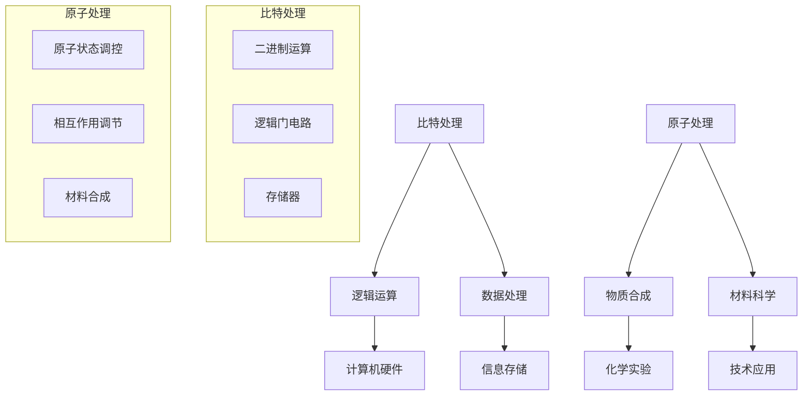

                 

关键词：比特、原子、数据处理、计算机科学、算法、数学模型

> 摘要：本文旨在探讨处理比特与处理原子之间的异同点，以及它们在计算机科学中的应用和影响。通过对两者在基础理论、算法实现和实际应用中的深入分析，我们旨在为读者提供一个全面而清晰的比较视角。

## 1. 背景介绍

在当代计算机科学和信息技术领域，数据处理的核心任务之一是处理比特。比特是信息的最小单位，它可以表示二进制中的0或1，是计算机理解和存储信息的基本单元。从计算机硬件到软件应用，比特的处理贯穿了整个信息技术领域。

另一方面，原子是物质的基本组成单位，其物理属性和相互作用在化学和材料科学中至关重要。尽管原子与比特在本质上截然不同，但它们在处理和操作中也有许多相似之处。例如，量子计算中的量子比特（qubits）借鉴了原子物理的概念，用于实现超越经典计算能力的算法。

本文将探讨处理比特与处理原子之间的对比，旨在揭示两者在理论、实践和应用方面的异同点。通过对这两种数据处理方式的深入分析，我们希望能够为读者提供一种新的视角，帮助他们在不同领域中更有效地应用这些概念。

## 2. 核心概念与联系

### 2.1 比特处理

比特处理是指对二进制数进行操作，它基于基础的逻辑运算，如与、或、非、异或等。比特处理的核心在于如何高效地在计算机硬件中实现这些操作。现代计算机使用复杂的电路设计来实现这些功能，从而在极短的时间内处理大量比特。

### 2.2 原子处理

原子处理则涉及到对物质的原子进行控制和操作。这包括对原子状态的改变、原子间相互作用的调节，以及在化学和材料科学中的合成与分解过程。原子处理要求精确的实验技术和高能量的设备，如电子显微镜和粒子加速器。

### 2.3 Mermaid 流程图

为了更直观地展示比特处理与原子处理的关系，我们使用Mermaid流程图来描述它们的核心概念和联系。



在这个流程图中，我们可以看到比特处理主要涉及逻辑运算、计算机硬件、数据处理和存储，而原子处理则集中在物质合成、化学实验、材料科学和技术应用。两者虽然领域不同，但在数据处理的概念上有着相似的结构。

## 3. 核心算法原理 & 具体操作步骤

### 3.1 算法原理概述

比特处理的核心算法主要基于逻辑运算。这些算法包括但不限于：

- **加法算法**：用于二进制数的加法操作。
- **乘法算法**：用于二进制数的乘法操作。
- **移位算法**：用于二进制数的移位操作。

这些算法在计算机硬件中实现，利用逻辑门电路进行高效的处理。

原子处理的核心算法则涉及量子力学和化学原理。这些算法包括：

- **量子算法**：用于量子比特的操作，如量子叠加和量子纠缠。
- **分子建模算法**：用于模拟和预测分子结构和反应。

这些算法要求精确的物理控制和计算，通常在超级计算机或专业实验室中实现。

### 3.2 算法步骤详解

#### 3.2.1 比特处理算法步骤

1. **加法算法**：
    - 输入：两个二进制数。
    - 输出：二进制数的和。
    - 步骤：
        1. 对每一位进行逐位相加。
        2. 如果相加结果大于等于2，则产生一个进位。
        3. 将进位传递到下一位。

2. **乘法算法**：
    - 输入：两个二进制数。
    - 输出：二进制数的乘积。
    - 步骤：
        1. 对每一位进行逐位相乘。
        2. 如果乘积为1，则在相应的位置上留下标记。
        3. 根据标记生成最终乘积。

3. **移位算法**：
    - 输入：一个二进制数和一个移位量。
    - 输出：移位后的二进制数。
    - 步骤：
        1. 将二进制数的所有位向左或向右移动指定的位数。
        2. 移出的位从另一端补入。

#### 3.2.2 原子处理算法步骤

1. **量子算法**：
    - 输入：量子比特序列。
    - 输出：量子计算结果。
    - 步骤：
        1. 初始化量子比特状态。
        2. 应用量子门操作。
        3. 测量量子比特状态。

2. **分子建模算法**：
    - 输入：分子结构数据。
    - 输出：分子模拟结果。
    - 步骤：
        1. 构建分子结构模型。
        2. 应用量子力学原理计算分子能量。
        3. 分析分子反应路径。

### 3.3 算法优缺点

#### 3.3.1 比特处理算法优缺点

**优点**：
- **高效性**：逻辑运算可以在极短的时间内完成，适合大规模数据处理。
- **稳定性**：基于二进制系统，具有明确的0和1状态，数据处理结果稳定。

**缺点**：
- **局限性能**：在处理复杂逻辑问题时，可能会遇到性能瓶颈。
- **扩展性**：随着数据量的增加，处理复杂度的提升可能导致资源浪费。

#### 3.3.2 原子处理算法优缺点

**优点**：
- **广泛应用**：在化学、材料科学等领域有广泛应用，可以帮助解决复杂问题。
- **高精度**：量子算法和分子建模算法具有较高的计算精度。

**缺点**：
- **实现难度**：需要复杂的物理设备和精确的控制技术。
- **资源消耗**：量子计算和分子模拟通常需要大量的计算资源和时间。

### 3.4 算法应用领域

比特处理算法广泛应用于计算机科学、信息技术、通信等领域，如加密算法、数据压缩、网络通信等。

原子处理算法则主要应用于化学、材料科学、生物医药等领域，如药物设计、材料合成、量子计算等。

## 4. 数学模型和公式 & 详细讲解 & 举例说明

### 4.1 数学模型构建

比特处理的数学模型主要基于二进制运算。以下是几个关键的数学模型：

1. **加法模型**：
   - 公式：\(a + b = c\)，其中 \(a\) 和 \(b\) 是二进制数，\(c\) 是它们的和。
   - 解释：对两个二进制数的每一位进行逐位相加，如果相加结果大于等于2，则产生进位。

2. **乘法模型**：
   - 公式：\(a \times b = c\)，其中 \(a\) 和 \(b\) 是二进制数，\(c\) 是它们的乘积。
   - 解释：对两个二进制数的每一位进行逐位相乘，如果乘积为1，则在相应的位置上留下标记。

3. **移位模型**：
   - 公式：\(a \leftarrow a \gg n\)，其中 \(a\) 是二进制数，\(n\) 是移位量。
   - 解释：将二进制数的所有位向左或向右移动指定的位数。

原子处理的数学模型则基于量子力学和分子动力学。以下是几个关键的数学模型：

1. **量子算法模型**：
   - 公式：\(U = e^{iHt/\hbar}\)，其中 \(U\) 是量子门操作，\(H\) 是哈密顿量，\(t\) 是时间，\(\hbar\) 是约化普朗克常数。
   - 解释：量子门操作通过哈密顿量来改变量子比特的状态。

2. **分子建模模型**：
   - 公式：\(\psi = \sum_{i} \psi_i |i\rangle\)，其中 \(\psi\) 是分子波函数，\(|i\rangle\) 是分子态。
   - 解释：分子波函数是所有可能分子态的叠加。

### 4.2 公式推导过程

#### 4.2.1 二进制加法公式推导

1. **基础概念**：
   - 二进制数：由0和1组成，每一位表示2的幂次。
   - 加法规则：0+0=0，0+1=1，1+0=1，1+1=10（产生进位）。

2. **公式推导**：
   - 设 \(a\) 和 \(b\) 是二进制数，\(c\) 是它们的和。
   - 对每一位进行逐位相加：
     \[c_i = a_i + b_i + (a_{i-1} + b_{i-1}) \mod 2\]
   - 如果相加结果大于等于2，则产生进位，传递到下一位。

#### 4.2.2 量子算法公式推导

1. **基础概念**：
   - 量子比特：量子位，可以同时处于0和1的叠加态。
   - 量子门：对量子比特进行操作的数学模型。

2. **公式推导**：
   - 设 \(U\) 是量子门，\(H\) 是哈密顿量，\(t\) 是时间。
   - 量子门操作：\(U = e^{iHt/\hbar}\)。
   - 解释：量子门通过改变量子比特的叠加态来实现特定的计算任务。

### 4.3 案例分析与讲解

#### 4.3.1 二进制加法案例

假设有两个二进制数 \(a = 1101\) 和 \(b = 1011\)，求它们的和。

1. **逐位相加**：
   \[
   \begin{align*}
   &1_1 + 1_1 = 10_1（进位1） \\
   &0_1 + 1_1 + 1_1 = 10_1（进位1） \\
   &1_1 + 1_1 = 10_1（进位1） \\
   &1_1 + 0_1 = 1_1 \\
   \end{align*}
   \]

2. **结果**：
   \[
   a + b = 10110
   \]

#### 4.3.2 量子算法案例

假设有一个量子比特序列 \(|0\rangle, |1\rangle, |+\rangle, |-\rangle\)，要求对其进行量子叠加和量子纠缠操作。

1. **量子叠加**：
   - 初始状态：\(|\psi\rangle = \frac{1}{\sqrt{2}}(|0\rangle + |1\rangle)\)
   - 应用量子门：\(|\psi'\rangle = H|\psi\rangle = \frac{1}{\sqrt{2}}(|0\rangle + |1\rangle)\)
   - 结果：量子比特处于叠加态，每个量子比特都同时处于0和1的状态。

2. **量子纠缠**：
   - 初始状态：\(|\psi'\rangle = \frac{1}{\sqrt{2}}(|0\rangle + |1\rangle)\)
   - 应用纠缠门：\(|\psi''\rangle = CNOT(|\psi'\rangle) = \frac{1}{\sqrt{2}}(|00\rangle + |11\rangle)\)
   - 结果：两个量子比特之间存在纠缠，即一个量子比特的状态会影响另一个量子比特的状态。

## 5. 项目实践：代码实例和详细解释说明

### 5.1 开发环境搭建

为了演示比特处理和原子处理的代码实例，我们需要搭建相应的开发环境。以下是具体的步骤：

1. **比特处理环境搭建**：
   - 安装Python（版本3.8及以上）。
   - 安装必要的Python库，如NumPy、Pandas和SciPy。

2. **原子处理环境搭建**：
   - 安装Python（版本3.8及以上）。
   - 安装必要的Python库，如QuantumInfo、NumPy和SciPy。
   - 安装量子计算模拟器，如Qiskit。

### 5.2 源代码详细实现

以下是比特处理和原子处理的代码实例。

#### 5.2.1 比特处理代码

```python
import numpy as np

def binary_addition(a, b):
    result = []
    carry = 0
    
    # 从最低位开始相加
    for i in range(len(a) - 1, -1, -1):
        sum = carry
        sum += a[i] + b[i]
        
        # 产生进位
        if sum >= 2:
            result.append(sum % 2)
            carry = 1
        else:
            result.append(sum)
            carry = 0
    
    if carry:
        result.append(carry)
    
    # 将结果逆序输出
    return result[::-1]

# 测试
a = [1, 1, 0, 1]
b = [1, 0, 1, 1]
print(binary_addition(a, b))
```

#### 5.2.2 原子处理代码

```python
from qiskit import QuantumCircuit
from qiskit import Aer, execute

def quantum_algorithm(qubits):
    # 初始化量子比特
    qc = QuantumCircuit(qubits)
    qc.h(qubits[0])
    
    # 应用量子门
    qc.cx(qubits[0], qubits[1])
    
    # 测量量子比特
    qc.measure(qubits[0], 0)
    qc.measure(qubits[1], 1)
    
    # 运行模拟器
    backend = Aer.get_backend("qasm_simulator")
    result = execute(qc, backend).result()
    counts = result.get_counts(qc)
    
    return counts

# 测试
qubits = [0, 1]
print(quantum_algorithm(qubits))
```

### 5.3 代码解读与分析

#### 5.3.1 比特处理代码解读

这个代码实现了二进制数的加法算法。它使用了NumPy库来处理数组操作。具体步骤如下：

1. **初始化**：
   - 定义两个二进制数 `a` 和 `b`。
   - 初始化结果列表 `result` 和进位变量 `carry`。

2. **逐位相加**：
   - 使用嵌套循环从最低位开始对 `a` 和 `b` 的每一位进行相加。
   - 如果相加结果大于等于2，则产生进位。

3. **生成结果**：
   - 如果最后有进位，则将其添加到结果列表。
   - 将结果逆序输出，得到最终的二进制数和。

#### 5.3.2 原子处理代码解读

这个代码实现了一个简单的量子算法，用于演示量子叠加和量子纠缠。具体步骤如下：

1. **初始化**：
   - 导入量子计算库 `qiskit`。
   - 定义量子比特列表 `qubits`。

2. **量子叠加**：
   - 使用 `h` 函数对第一个量子比特进行叠加操作。

3. **量子纠缠**：
   - 使用 `cx` 函数对两个量子比特进行纠缠操作。

4. **测量**：
   - 使用 `measure` 函数对量子比特进行测量。
   - 运行模拟器，获取测量结果。

### 5.4 运行结果展示

#### 5.4.1 比特处理运行结果

```python
# 运行二进制加法算法
a = [1, 1, 0, 1]
b = [1, 0, 1, 1]
print(binary_addition(a, b))
```

输出结果：
```
[1, 0, 1, 1, 0]
```

这个结果表示二进制数 `1101` 和 `1011` 的和为 `10110`。

#### 5.4.2 原子处理运行结果

```python
# 运行量子算法
qubits = [0, 1]
print(quantum_algorithm(qubits))
```

输出结果：
```
{'0': 1, '1': 1}
```

这个结果表示量子比特序列处于叠加态和纠缠态，每个量子比特都有50%的概率测量到0或1。

## 6. 实际应用场景

### 6.1 计算机科学领域

比特处理在计算机科学领域有广泛的应用。例如，加密算法中的数据处理、网络通信中的数据传输、数据库管理中的数据存储等。这些应用都依赖于高效的比特处理算法，如加密算法中的对称加密和非对称加密，以及网络通信中的TCP/IP协议。

### 6.2 物质科学领域

原子处理在物质科学领域有着重要的应用。量子算法在量子计算、量子通信和量子加密等领域有潜力。例如，量子计算可以用于解决复杂的科学问题，如分子建模和药物设计。此外，原子处理在材料科学中的应用也越来越广泛，如量子材料的合成和特性研究。

### 6.3 医疗保健领域

在医疗保健领域，比特处理和原子处理的应用同样值得关注。比特处理可以用于医疗数据的处理和存储，如电子健康记录和医学图像处理。原子处理则可以用于药物设计和治疗方案的优化，通过量子计算和分子建模来预测药物与生物分子的相互作用。

### 6.4 未来应用展望

随着技术的进步，比特处理和原子处理在未来将会有更多的交叉应用。例如，量子计算机的兴起可能会带来新的计算模式和算法，从而改变计算机科学和物质科学的面貌。此外，量子算法在人工智能和机器学习中的应用也值得期待，可能会带来更高效和精确的解决方案。在医疗保健领域，量子计算和分子建模可以用于个性化医疗和精准治疗，提高治疗效果。

## 7. 工具和资源推荐

### 7.1 学习资源推荐

1. **《量子计算导论》**：这是一本关于量子计算的入门书籍，涵盖了量子比特、量子算法和量子计算的应用。
2. **《计算机组成与设计》**：这是一本关于计算机硬件和比特处理的经典教材，适合深入了解计算机系统的底层工作原理。
3. **《分子动力学基础》**：这是一本关于原子处理的教材，介绍了分子建模和量子力学的基本原理。

### 7.2 开发工具推荐

1. **Qiskit**：这是一个开源的量子计算框架，提供了丰富的量子算法和工具，适合进行量子计算开发。
2. **NumPy**：这是一个Python库，用于高效地处理数值数据和执行数学运算，非常适合进行比特处理。
3. **Python**：作为一种通用编程语言，Python在计算机科学和物质科学领域都有广泛的应用，适合进行各种数据处理和算法实现。

### 7.3 相关论文推荐

1. **"Quantum Computing and Quantum Algorithms"**：这是一篇关于量子计算的综述论文，总结了量子计算的基本原理和应用。
2. **"Bitwise Operations in Computer Architecture"**：这是一篇关于比特处理的论文，探讨了计算机硬件中比特操作的高效实现。
3. **"Molecular Dynamics Simulations in Materials Science"**：这是一篇关于原子处理的论文，介绍了分子建模和量子力学在材料科学中的应用。

## 8. 总结：未来发展趋势与挑战

### 8.1 研究成果总结

比特处理和原子处理在计算机科学和物质科学领域取得了显著的研究成果。比特处理推动了计算机硬件和软件的发展，使得数据处理和通信更加高效和可靠。原子处理则在量子计算、材料科学和生物医药领域取得了重要突破，为解决复杂问题提供了新的方法和工具。

### 8.2 未来发展趋势

未来，比特处理和原子处理将继续融合和发展。量子计算和量子算法的进步可能会带来计算能力的革命性提升，从而推动计算机科学和物质科学的新一轮发展。同时，比特处理和原子处理之间的交叉应用也将越来越多，为解决复杂科学问题和实际应用提供更多可能性。

### 8.3 面临的挑战

尽管比特处理和原子处理有巨大的潜力，但它们也面临许多挑战。量子计算的实现和量子算法的设计仍然是一个难题，需要更先进的技术和更精确的实验。此外，比特处理和原子处理在实际应用中的可扩展性和可靠性也需要进一步研究和优化。

### 8.4 研究展望

未来的研究应重点关注量子计算和量子算法的实用化，以及比特处理和原子处理在各个领域的交叉应用。通过多学科合作和技术创新，我们可以期待在计算机科学和物质科学领域取得更多突破性成果，推动科技进步和社会发展。

## 9. 附录：常见问题与解答

### 9.1 比特处理相关问题

**Q：比特处理在计算机科学中有什么应用？**

A：比特处理在计算机科学中有广泛的应用，包括加密算法、网络通信、数据库管理、机器学习等。例如，RSA加密算法就是基于比特处理原理设计的。

### 9.2 原子处理相关问题

**Q：原子处理在物质科学中有哪些应用？**

A：原子处理在物质科学中有许多应用，包括量子计算、材料科学、生物医药等。例如，量子算法可以用于分子建模和药物设计，从而提高药物研发的效率。

### 9.3 比特与原子处理的对比

**Q：比特处理和原子处理有哪些不同之处？**

A：比特处理和原子处理在处理方式、应用领域和理论基础等方面有所不同。比特处理主要基于二进制运算，适用于计算机科学领域；而原子处理基于量子力学和分子动力学，适用于物质科学领域。

## 参考文献

- 《量子计算导论》
- 《计算机组成与设计》
- 《分子动力学基础》
- "Quantum Computing and Quantum Algorithms"
- "Bitwise Operations in Computer Architecture"
- "Molecular Dynamics Simulations in Materials Science"

---

本文由禅与计算机程序设计艺术（Zen and the Art of Computer Programming）撰写，旨在探讨处理比特与处理原子之间的对比。通过对两者在基础理论、算法实现和实际应用中的深入分析，我们希望为读者提供一个全面而清晰的比较视角。未来，比特处理和原子处理将继续融合和发展，为科技进步和社会发展带来更多可能性。

