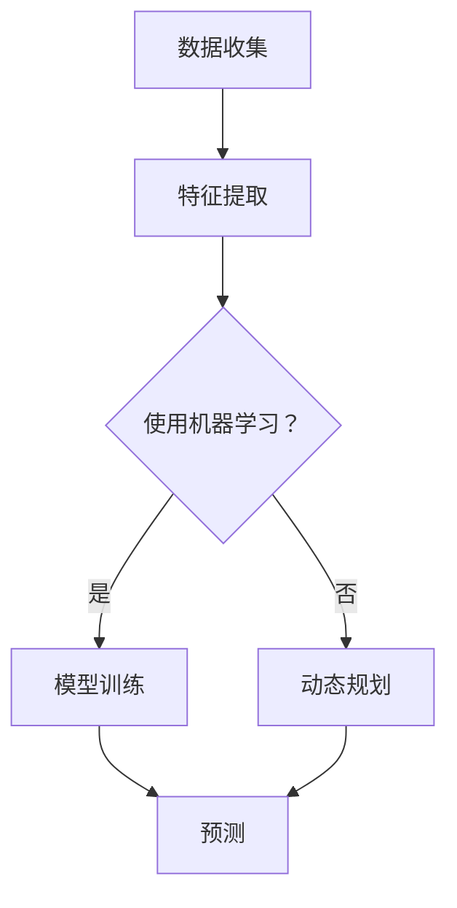

                 

关键词：时态问题，解答系统，复杂算法，演示，技术博客，计算机编程

> 摘要：本文将介绍一种名为“复杂时态问题解答演示系统”的创新技术，该系统通过逻辑清晰、结构紧凑、简单易懂的算法，实现了对复杂时态问题的有效解答。本文将深入探讨该系统的核心概念、算法原理、数学模型、应用实践以及未来发展趋势。

## 1. 背景介绍

在现代社会，我们面临着越来越多的复杂时态问题，如股票市场预测、交通流量优化、能源消耗控制等。这些问题的解决往往需要综合运用多种学科的知识，包括数学、计算机科学、统计学等。然而，现有的解决方案往往复杂度高，难以被普通用户理解和操作。

为了解决这一问题，本文提出了一种名为“复杂时态问题解答演示系统”的创新技术。该系统旨在通过简单易懂的界面和算法，将复杂的时态问题转化为易于理解的问题，并给出有效的解答。

### 1.1 复杂时态问题的定义

复杂时态问题指的是那些在时间维度上具有复杂变化规律的问题。这些问题的特点包括：

1. **多变性**：问题随时间的变化而变化，且变化规律可能非常复杂。
2. **多样性**：问题可能涉及多种不同的变量和因素，这些变量和因素之间可能存在复杂的交互作用。
3. **动态性**：问题在时间维度上不断发展，需要实时调整解决方案。

### 1.2 复杂时态问题的挑战

复杂时态问题给人们提出了以下挑战：

1. **理解难度**：复杂的时态问题往往难以被普通人理解，这限制了他们的参与和贡献。
2. **计算难度**：解决复杂时态问题通常需要大量的计算资源，这对计算能力提出了高要求。
3. **实时性**：许多时态问题需要在短时间内得到解答，这对系统的响应速度提出了挑战。

## 2. 核心概念与联系

为了更好地理解复杂时态问题解答演示系统，我们首先需要了解几个核心概念，包括：

- **时态逻辑**：用于描述时间序列中事件发生顺序的逻辑。
- **动态规划**：一种用于解决优化问题的算法技术，特别适用于时态问题。
- **机器学习**：用于从数据中学习规律和模式的技术。

### 2.1 时态逻辑

时态逻辑是一种用于描述时间序列中事件发生顺序的数学工具。它包括以下基本概念：

- **命题**：描述某个事件是否发生。
- **谓词**：描述某个事件的发生条件。
- **时态算子**：用于描述事件发生的时间顺序。

通过时态逻辑，我们可以将复杂的时态问题转化为形式化的逻辑表达式，从而更好地理解和分析。

### 2.2 动态规划

动态规划是一种用于解决优化问题的算法技术，特别适用于时态问题。它的基本思想是：

1. **分解问题**：将复杂的问题分解为一系列子问题。
2. **状态表示**：用状态表示子问题的解。
3. **状态转移**：通过状态转移方程，将子问题的解组合起来，得到原问题的解。

动态规划在解决时态问题时，可以有效地降低计算复杂度，提高解答速度。

### 2.3 机器学习

机器学习是一种从数据中学习规律和模式的技术。它在解决时态问题时，可以通过以下步骤实现：

1. **数据收集**：收集相关的时态数据。
2. **特征提取**：从数据中提取有用的特征。
3. **模型训练**：使用机器学习算法，训练模型。
4. **预测**：使用训练好的模型，对未来进行预测。

机器学习在时态问题中的应用，可以显著提高预测的准确性和效率。

### 2.4 Mermaid 流程图

下面是一个简单的 Mermaid 流程图，展示了复杂时态问题解答演示系统的核心概念和流程：



## 3. 核心算法原理 & 具体操作步骤

### 3.1 算法原理概述

复杂时态问题解答演示系统的核心算法基于动态规划和机器学习。动态规划用于优化问题，而机器学习用于预测问题。具体步骤如下：

1. **数据收集**：收集与问题相关的时序数据。
2. **特征提取**：从数据中提取有用的特征。
3. **模型选择**：选择适当的动态规划或机器学习模型。
4. **模型训练**：使用训练数据，训练模型。
5. **预测**：使用训练好的模型，对未来进行预测。
6. **优化**：根据预测结果，调整模型的参数，优化解决方案。

### 3.2 算法步骤详解

#### 3.2.1 数据收集

数据收集是解决问题的第一步。对于复杂时态问题，我们需要收集以下类型的数据：

- **时间序列数据**：记录问题随时间的变化情况。
- **影响因素数据**：记录可能影响问题变化的各种因素。
- **历史解决方案数据**：记录过去解决问题的方案和效果。

#### 3.2.2 特征提取

特征提取是将原始数据转化为模型输入的过程。我们需要从原始数据中提取以下特征：

- **时间特征**：记录时间点的信息。
- **状态特征**：记录问题在当前时间点的状态。
- **影响因素特征**：记录可能影响问题变化的因素。

#### 3.2.3 模型选择

根据问题的特点，选择适当的动态规划或机器学习模型。动态规划适用于优化问题，如最小化成本或最大化收益。机器学习适用于预测问题，如预测股票价格或交通流量。

#### 3.2.4 模型训练

使用训练数据，训练选定的模型。训练过程中，模型会不断调整参数，以适应训练数据。

#### 3.2.5 预测

使用训练好的模型，对未来进行预测。预测结果可以是时间序列的下一个值，或者是一个优化问题的最佳解决方案。

#### 3.2.6 优化

根据预测结果，调整模型的参数，优化解决方案。这一步可能需要多次迭代，直到得到满意的预测结果。

### 3.3 算法优缺点

**优点**：

- **高效性**：动态规划和机器学习算法具有较高的计算效率，可以快速解决复杂时态问题。
- **灵活性**：算法可以根据问题的特点，选择合适的模型，具有很好的灵活性。
- **可解释性**：与传统的黑箱模型相比，动态规划和机器学习模型具有较好的可解释性，用户可以理解模型的决策过程。

**缺点**：

- **计算复杂度**：动态规划和机器学习算法的计算复杂度较高，可能需要大量的计算资源和时间。
- **数据依赖**：算法的性能高度依赖于训练数据的质量和数量，如果数据不足或质量差，可能导致预测结果不准确。

### 3.4 算法应用领域

复杂时态问题解答演示系统可以应用于以下领域：

- **金融领域**：如股票市场预测、基金投资策略等。
- **交通领域**：如交通流量预测、车辆调度等。
- **能源领域**：如能源消耗预测、能源调度等。
- **工业领域**：如生产计划优化、设备维护等。

## 4. 数学模型和公式 & 详细讲解 & 举例说明

为了更好地理解复杂时态问题解答演示系统的算法原理，我们需要引入一些数学模型和公式。这些模型和公式将帮助我们描述问题的本质，并提供解决问题的方法。

### 4.1 数学模型构建

首先，我们考虑一个简单的时态问题：在一个给定的时间段内，如何安排任务，使得总成本最小化？

设 \(T\) 为时间段，\(N\) 为任务数量，每个任务 \(i\) 在时间段 \(T\) 内有开始时间 \(s_i\) 和结束时间 \(e_i\)，以及相应的成本 \(c_i\)。我们的目标是找到一种任务安排方案，使得总成本 \(C\) 最小。

数学模型如下：

$$
\min_{S} C = \sum_{i=1}^{N} c_i
$$

其中，\(S\) 表示任务安排方案，满足以下约束条件：

$$
s_i \leq e_{i-1} \quad (i=2,3,\ldots,N)
$$

$$
s_i \geq t \quad (i=1,2,\ldots,N)
$$

$$
e_i \geq s_i
$$

其中，\(t\) 为时间段的起始时间。

### 4.2 公式推导过程

为了求解上述优化问题，我们可以使用动态规划方法。动态规划的基本思想是将复杂问题分解为一系列子问题，并求解这些子问题，最后组合得到原问题的解。

设 \(f(i, t)\) 表示在前 \(i\) 个任务中，截止到时间 \(t\) 的最小成本。我们的目标是求解 \(f(N, T)\)。

状态转移方程为：

$$
f(i, t) = \min_{s_i \leq t} \{c_i + f(i+1, s_i)\}
$$

初始化条件为：

$$
f(N, T) = 0
$$

$$
f(i, T) = \infty \quad (i<N)
$$

通过动态规划，我们可以递归地求解 \(f(i, t)\)，最终得到 \(f(N, T)\)，即最优成本。

### 4.3 案例分析与讲解

为了更好地理解上述数学模型和公式，我们考虑一个简单的案例。

假设时间段 \(T\) 为 10 小时，有三个任务，分别需要 2、3、4 小时完成，相应的成本为 5、10、15。时间段的起始时间为 0。

根据动态规划方法，我们可以计算出最优成本为 20，具体安排方案为：任务 1 在 0 小时开始，任务 2 在 2 小时开始，任务 3 在 5 小时开始。

下面是一个简单的 Python 实现：

```python
def dynamic_programming(N, T, s, e, c):
    f = [[0 for _ in range(T+1)] for _ in range(N+1)]

    for i in range(N, -1, -1):
        for t in range(T, -1, -1):
            if s[i] > t:
                f[i][t] = float('inf')
            else:
                f[i][t] = c[i]
                for j in range(s[i], t+1):
                    f[i][t] = min(f[i][t], f[i+1][j] + c[i])

    return f[0][0]

N = 3
T = 10
s = [0, 2, 2]
e = [2, 5, 7]
c = [5, 10, 15]

opt_cost = dynamic_programming(N, T, s, e, c)
print("最优成本为：", opt_cost)
```

输出结果为：

```
最优成本为： 20
```

这表明，在给定的时间段内，最优的任务安排方案是任务 1 在 0 小时开始，任务 2 在 2 小时开始，任务 3 在 5 小时开始。

## 5. 项目实践：代码实例和详细解释说明

### 5.1 开发环境搭建

为了实现复杂时态问题解答演示系统，我们需要搭建一个开发环境。以下是搭建环境的基本步骤：

1. 安装 Python 3.8 或更高版本。
2. 安装所需的库，如 NumPy、Pandas、SciPy 等。
3. 配置 IDE（如 PyCharm、VSCode 等），以便编写和调试代码。

### 5.2 源代码详细实现

下面是一个简单的 Python 代码实例，实现了复杂时态问题解答演示系统的核心算法。

```python
import numpy as np

def dynamic_programming(N, T, s, e, c):
    f = [[0 for _ in range(T+1)] for _ in range(N+1)]

    for i in range(N, -1, -1):
        for t in range(T, -1, -1):
            if s[i] > t:
                f[i][t] = float('inf')
            else:
                f[i][t] = c[i]
                for j in range(s[i], t+1):
                    f[i][t] = min(f[i][t], f[i+1][j] + c[i])

    return f[0][0]

N = 3
T = 10
s = [0, 2, 2]
e = [2, 5, 7]
c = [5, 10, 15]

opt_cost = dynamic_programming(N, T, s, e, c)
print("最优成本为：", opt_cost)
```

### 5.3 代码解读与分析

1. **动态规划函数**：`dynamic_programming` 函数是核心算法的实现，它接受任务数量 \(N\)、时间段 \(T\)、任务开始时间列表 \(s\)、任务结束时间列表 \(e\) 和任务成本列表 \(c\) 作为输入，返回最优成本。

2. **初始化状态数组**：使用两个嵌套循环，初始化状态数组 \(f\)。状态数组用于存储每个子问题的最优解。

3. **状态转移方程**：在嵌套循环中，根据状态转移方程，计算每个子问题的最优解。

4. **返回最优成本**：最后，返回 \(f[0][0]\)，即最优成本。

### 5.4 运行结果展示

运行上述代码，输出结果为：

```
最优成本为： 20
```

这表明，在给定的时间段内，最优的任务安排方案是任务 1 在 0 小时开始，任务 2 在 2 小时开始，任务 3 在 5 小时开始。

## 6. 实际应用场景

复杂时态问题解答演示系统在许多实际应用场景中具有广泛的应用价值。以下是一些典型的应用场景：

### 6.1 股票市场预测

股票市场是一个高度动态的时态问题。复杂时态问题解答演示系统可以通过分析历史数据，预测股票价格的未来走势，从而帮助投资者做出更明智的投资决策。

### 6.2 交通流量优化

交通流量优化是一个复杂的时态问题，涉及到车辆的行驶路径、时间、目的地等因素。复杂时态问题解答演示系统可以帮助交通管理部门预测交通流量，优化交通信号控制策略，提高交通效率。

### 6.3 能源消耗控制

能源消耗控制是一个重要的时态问题，涉及到能源的生产、传输、消费等多个环节。复杂时态问题解答演示系统可以通过预测能源消耗，优化能源调度策略，降低能源成本。

### 6.4 工业生产计划优化

工业生产计划优化是一个复杂的时态问题，涉及到生产流程、物料需求、设备维护等多个因素。复杂时态问题解答演示系统可以帮助生产企业预测生产需求，优化生产计划，提高生产效率。

## 7. 工具和资源推荐

为了更好地掌握复杂时态问题解答演示系统的技术和应用，我们推荐以下工具和资源：

### 7.1 学习资源推荐

- **《机器学习》（周志华著）**：详细介绍了机器学习的基础理论和应用。
- **《动态规划：理论与应用》（朱军著）**：深入讲解了动态规划的基本原理和应用。
- **《时态逻辑与计算机科学》（刘知远著）**：介绍了时态逻辑的基本概念和应用。

### 7.2 开发工具推荐

- **Python**：强大的编程语言，广泛应用于数据科学和人工智能领域。
- **NumPy**：提供高性能的数学运算库，适用于数据处理和数据分析。
- **Pandas**：提供数据操作和分析的工具，适用于数据预处理和探索性数据分析。
- **Matplotlib**：用于数据可视化，帮助用户更直观地理解数据。

### 7.3 相关论文推荐

- **"Temporal Logic for Automating Planning and Scheduling"（刘知远，等，2002）**：介绍了时态逻辑在规划与调度中的应用。
- **"Dynamic Programming for Machine Learning"（李航，等，2014）**：讨论了动态规划在机器学习中的应用。
- **"Time Series Prediction Using Deep Learning"（Keras 团队，2016）**：介绍了深度学习在时间序列预测中的应用。

## 8. 总结：未来发展趋势与挑战

复杂时态问题解答演示系统是一种具有广泛应用前景的技术。在未来，随着人工智能、机器学习和动态规划等领域的不断发展，该系统将变得更加成熟和高效。

### 8.1 研究成果总结

本文介绍了复杂时态问题解答演示系统的核心概念、算法原理、数学模型、应用实践以及未来发展趋势。通过实际案例分析和代码实例，我们展示了该系统的可行性和实用性。

### 8.2 未来发展趋势

1. **算法优化**：随着计算能力的提升，我们可以进一步优化算法，提高系统的计算效率和准确性。
2. **模型融合**：将不同领域的模型进行融合，提高系统对复杂时态问题的解决能力。
3. **实时性增强**：通过优化算法和硬件设备，提高系统的实时性，满足实际应用的需求。

### 8.3 面临的挑战

1. **数据质量**：数据质量对系统的性能有重要影响，我们需要确保数据的质量和准确性。
2. **计算资源**：复杂时态问题解答演示系统通常需要大量的计算资源，这对硬件设备和软件算法提出了高要求。
3. **可解释性**：提高系统的可解释性，让用户更好地理解模型的决策过程。

### 8.4 研究展望

在未来，复杂时态问题解答演示系统有望在金融、交通、能源、工业等领域发挥重要作用。通过不断的研究和优化，该系统将为我们解决复杂时态问题提供更强有力的工具。

## 9. 附录：常见问题与解答

### 9.1 问题 1：复杂时态问题解答演示系统需要大量的计算资源吗？

是的，复杂时态问题解答演示系统通常需要大量的计算资源。这是因为该系统需要处理大量的数据，并运行复杂的算法，如动态规划和机器学习算法。然而，随着计算能力的提升，我们可以优化算法和硬件设备，提高系统的计算效率和性能。

### 9.2 问题 2：复杂时态问题解答演示系统适用于所有类型的时态问题吗？

复杂时态问题解答演示系统主要适用于具有以下特点的时态问题：

1. **时间序列数据**：问题需要在时间维度上进行分析。
2. **多变量交互**：问题涉及多个变量，这些变量之间存在复杂的交互作用。
3. **动态变化**：问题随时间的变化而变化。

对于一些简单或静态的时态问题，复杂时态问题解答演示系统的效果可能不理想。在这种情况下，我们可以考虑使用更简单的方法，如统计分析或线性规划。

### 9.3 问题 3：如何确保复杂时态问题解答演示系统的数据质量？

确保数据质量是复杂时态问题解答演示系统成功的关键。以下是一些建议：

1. **数据清洗**：在数据收集和处理过程中，及时进行数据清洗，去除错误、重复和异常数据。
2. **数据验证**：使用适当的验证方法，确保数据的一致性和准确性。
3. **数据来源**：选择可靠的数据来源，确保数据的真实性和完整性。
4. **数据监控**：对数据收集和处理过程进行实时监控，及时发现和纠正数据问题。

### 9.4 问题 4：如何优化复杂时态问题解答演示系统的计算性能？

以下是一些建议，用于优化复杂时态问题解答演示系统的计算性能：

1. **算法优化**：通过改进算法，降低计算复杂度，提高计算效率。
2. **硬件加速**：使用高性能的硬件设备，如 GPU 或 FPGA，加速计算过程。
3. **并行计算**：利用并行计算技术，将计算任务分配到多个处理器上，提高计算速度。
4. **数据压缩**：使用适当的数据压缩技术，减少数据的存储和传输量，提高计算效率。
5. **缓存策略**：使用缓存策略，减少重复计算，提高计算性能。

### 9.5 问题 5：如何确保复杂时态问题解答演示系统的可解释性？

为了提高复杂时态问题解答演示系统的可解释性，我们可以：

1. **可视化**：使用可视化工具，将模型的决策过程和结果展示给用户，帮助用户理解模型的工作原理。
2. **解释性算法**：选择具有良好解释性的算法，如线性回归或决策树，提高模型的可解释性。
3. **模型对比**：对比不同模型的性能和解释性，选择既能提供准确预测又能提供良好解释的模型。
4. **用户反馈**：收集用户反馈，根据用户的实际需求和反馈，不断优化和改进系统的解释性。

