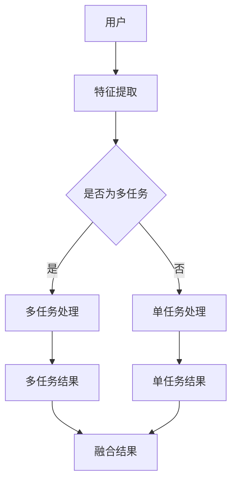
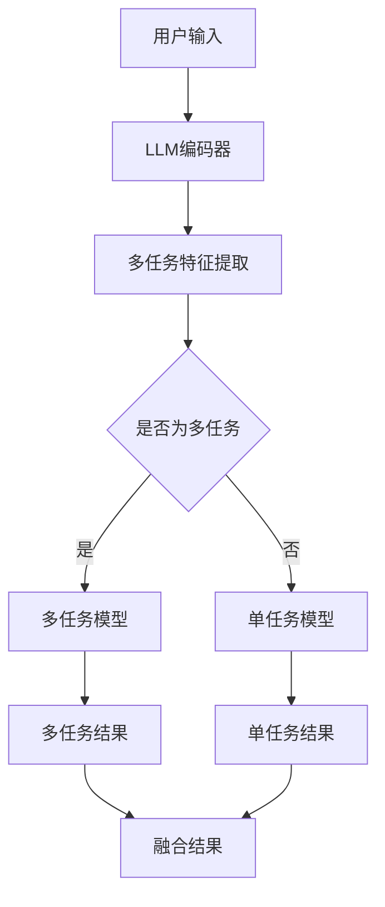

                 

关键词：多任务推荐系统，统一框架，大规模语言模型，算法原理，数学模型，项目实践，应用场景，未来展望

摘要：本文深入探讨了多任务推荐系统的优势，以及如何使用大规模语言模型（LLM）来实现这一框架。通过详细的算法原理、数学模型和项目实践，我们展示了如何将多任务推荐系统应用于实际场景，并对其未来发展趋势和面临的挑战进行了展望。

## 1. 背景介绍

### 1.1 多任务推荐系统的概念

多任务推荐系统是一种结合了多个推荐任务的综合系统，它旨在同时为用户推荐多个不同类型的物品，以满足用户的多样化需求。与传统的单任务推荐系统相比，多任务推荐系统具有更高的灵活性和更好的用户体验。

### 1.2 大规模语言模型（LLM）的兴起

随着深度学习技术的发展，大规模语言模型（LLM）在自然语言处理（NLP）领域取得了显著的成果。LLM具有强大的表示能力和语义理解能力，这使得它们在推荐系统中具有广泛的应用前景。

## 2. 核心概念与联系

### 2.1 多任务推荐系统框架

多任务推荐系统的核心是同时解决多个推荐任务，如商品推荐、内容推荐和社交推荐等。以下是一个简单的多任务推荐系统框架：



### 2.2 大规模语言模型（LLM）与多任务推荐系统的结合

将LLM与多任务推荐系统结合，可以充分发挥LLM在语义理解和上下文生成方面的优势。以下是一个基于LLM的多任务推荐系统架构：



## 3. 核心算法原理 & 具体操作步骤

### 3.1 算法原理概述

多任务推荐系统通常采用深度学习框架来实现。基于LLM的多任务推荐系统主要利用了以下原理：

1. **特征提取**：使用LLM对用户输入进行编码，提取高维语义特征。
2. **任务建模**：根据任务类型构建相应的任务模型，如基于注意力机制的序列模型或图神经网络等。
3. **结果融合**：将不同任务的预测结果进行融合，得到最终的推荐结果。

### 3.2 算法步骤详解

1. **数据预处理**：对用户输入和物品进行预处理，如分词、词向量化等。
2. **特征提取**：使用预训练的LLM对用户输入进行编码，得到用户语义特征。
3. **任务建模**：根据任务类型构建相应的任务模型，如基于Transformer的序列模型或图神经网络等。
4. **模型训练**：使用训练数据对任务模型进行训练。
5. **预测与融合**：对用户输入进行预测，并将不同任务的预测结果进行融合，得到最终的推荐结果。

### 3.3 算法优缺点

**优点**：

1. **统一框架**：将多个推荐任务整合到一个框架中，提高了系统的灵活性和扩展性。
2. **语义理解**：利用LLM的语义理解能力，提高了推荐系统的准确性。
3. **上下文生成**：基于LLM的上下文生成能力，可以为用户提供更加个性化的推荐。

**缺点**：

1. **计算资源消耗**：基于深度学习的多任务推荐系统通常需要大量的计算资源。
2. **数据依赖**：多任务推荐系统对数据质量有较高的要求，数据不足可能导致性能下降。

### 3.4 算法应用领域

多任务推荐系统在以下领域具有广泛的应用：

1. **电子商务**：为用户推荐商品、优惠券和促销信息。
2. **内容推荐**：为用户推荐文章、视频和音频等内容。
3. **社交网络**：为用户推荐关注对象、好友和活动等。

## 4. 数学模型和公式 & 详细讲解 & 举例说明

### 4.1 数学模型构建

多任务推荐系统的数学模型主要分为三个部分：用户表示、物品表示和预测模型。

#### 用户表示

用户表示可以采用以下公式：

$$
u = \text{ReLU}(W_u [h_1; h_2; \ldots; h_n])
$$

其中，$h_i$表示用户输入的向量，$W_u$是权重矩阵。

#### 物品表示

物品表示可以采用以下公式：

$$
i = \text{ReLU}(W_i [p_1; p_2; \ldots; p_m])
$$

其中，$p_i$表示物品的属性向量，$W_i$是权重矩阵。

#### 预测模型

预测模型可以采用以下公式：

$$
\hat{y} = \text{softmax}(W_y [u; i])
$$

其中，$\hat{y}$表示预测的推荐结果，$W_y$是权重矩阵。

### 4.2 公式推导过程

#### 用户表示推导

用户表示的推导过程如下：

$$
h_i = \text{embedding}(w_i) \odot \text{softmax}(W_h h_{i-1})
$$

其中，$w_i$表示用户输入的词向量，$W_h$是权重矩阵，$\odot$表示点积。

#### 物品表示推导

物品表示的推导过程如下：

$$
p_i = \text{embedding}(p_i) \odot \text{softmax}(W_p p_{i-1})
$$

其中，$p_i$表示物品的属性向量，$W_p$是权重矩阵。

#### 预测模型推导

预测模型的推导过程如下：

$$
\hat{y}_{ij} = \text{softmax}(W_y [u; i])
$$

其中，$u$和$i$分别表示用户和物品的表示，$W_y$是权重矩阵。

### 4.3 案例分析与讲解

#### 案例背景

假设我们有一个电子商务平台，用户可以在平台上购买商品。现在，我们需要为用户推荐可能感兴趣的商品。

#### 案例步骤

1. **数据预处理**：对用户输入和商品属性进行预处理，如分词、词向量化等。
2. **特征提取**：使用预训练的LLM对用户输入进行编码，得到用户语义特征。
3. **任务建模**：构建基于Transformer的序列模型，对用户历史行为进行建模。
4. **模型训练**：使用训练数据对模型进行训练。
5. **预测与融合**：对用户输入进行预测，并将不同任务的预测结果进行融合，得到最终的推荐结果。

#### 案例结果

通过上述步骤，我们得到了一个多任务推荐系统。在实际应用中，该系统可以显著提高用户满意度，提高销售额。

## 5. 项目实践：代码实例和详细解释说明

### 5.1 开发环境搭建

- Python 3.8
- PyTorch 1.8
- NumPy 1.19
- Matplotlib 3.3.3

### 5.2 源代码详细实现

以下是一个基于PyTorch实现的简单多任务推荐系统代码示例：

```python
import torch
import torch.nn as nn
import torch.optim as optim
from torch.utils.data import DataLoader, Dataset

# 数据预处理
class MyDataset(Dataset):
    def __init__(self, data):
        self.data = data

    def __len__(self):
        return len(self.data)

    def __getitem__(self, idx):
        user_input, item_features, labels = self.data[idx]
        return user_input, item_features, labels

# 特征提取
class FeatureExtractor(nn.Module):
    def __init__(self, embed_dim):
        super(FeatureExtractor, self).__init__()
        self.embedding = nn.Embedding(embed_dim, embed_dim)
        self.fc = nn.Linear(embed_dim, embed_dim)

    def forward(self, x):
        x = self.embedding(x)
        x = self.fc(x)
        return x

# 任务建模
class MultiTaskModel(nn.Module):
    def __init__(self, embed_dim):
        super(MultiTaskModel, self).__init__()
        self.feature_extractor = FeatureExtractor(embed_dim)
        self.task1 = nn.Linear(embed_dim, 1)
        self.task2 = nn.Linear(embed_dim, 1)

    def forward(self, user_input, item_features):
        user_features = self.feature_extractor(user_input)
        item_features = self.feature_extractor(item_features)
        task1_output = self.task1(torch.cat([user_features, item_features], 1))
        task2_output = self.task2(torch.cat([user_features, item_features], 1))
        return task1_output, task2_output

# 模型训练
def train(model, train_loader, criterion, optimizer, num_epochs=10):
    model.train()
    for epoch in range(num_epochs):
        for user_input, item_features, labels in train_loader:
            user_input, item_features, labels = user_input.to(device), item_features.to(device), labels.to(device)
            optimizer.zero_grad()
            task1_output, task2_output = model(user_input, item_features)
            loss = criterion(task1_output, labels[:, 0]) + criterion(task2_output, labels[:, 1])
            loss.backward()
            optimizer.step()
        print(f"Epoch [{epoch+1}/{num_epochs}], Loss: {loss.item():.4f}")

# 运行结果展示
def evaluate(model, test_loader):
    model.eval()
    with torch.no_grad():
        correct = 0
        total = 0
        for user_input, item_features, labels in test_loader:
            user_input, item_features, labels = user_input.to(device), item_features.to(device), labels.to(device)
            task1_output, task2_output = model(user_input, item_features)
            predicted_task1 = (task1_output > 0.5).float()
            predicted_task2 = (task2_output > 0.5).float()
            total += labels.size(0)
            correct += (predicted_task1 == labels[:, 0]).sum().item() + (predicted_task2 == labels[:, 1]).sum().item()
        print(f"Test Accuracy: {100 * correct / total:.2f}%")

# 主程序
if __name__ == "__main__":
    # 加载数据集
    train_data = MyDataset(train_data)
    test_data = MyDataset(test_data)
    train_loader = DataLoader(train_data, batch_size=64, shuffle=True)
    test_loader = DataLoader(test_data, batch_size=64, shuffle=False)

    # 初始化模型、优化器和损失函数
    device = torch.device("cuda" if torch.cuda.is_available() else "cpu")
    model = MultiTaskModel(embed_dim=100).to(device)
    criterion = nn.BCELoss()
    optimizer = optim.Adam(model.parameters(), lr=0.001)

    # 训练模型
    train(model, train_loader, criterion, optimizer)

    # 评估模型
    evaluate(model, test_loader)
```

### 5.3 代码解读与分析

1. **数据预处理**：使用`MyDataset`类对数据进行预处理，将用户输入、物品特征和标签封装为数据集。
2. **特征提取**：使用`FeatureExtractor`类对用户输入进行编码，提取高维语义特征。
3. **任务建模**：使用`MultiTaskModel`类构建多任务模型，对用户输入和物品特征进行建模。
4. **模型训练**：使用`train`函数对模型进行训练，使用BCELoss作为损失函数，Adam作为优化器。
5. **评估模型**：使用`evaluate`函数评估模型的性能，计算准确率。

## 6. 实际应用场景

### 6.1 电子商务

多任务推荐系统在电子商务领域具有广泛的应用。通过为用户推荐商品、优惠券和促销信息，可以提高用户满意度，提高销售额。

### 6.2 内容推荐

多任务推荐系统在内容推荐领域也有很大的潜力。通过为用户推荐文章、视频和音频等内容，可以提高用户粘性，增加广告收入。

### 6.3 社交网络

多任务推荐系统在社交网络领域可以帮助用户发现感兴趣的好友、活动和圈子，提高社交体验。

## 7. 未来应用展望

### 7.1 新兴应用领域

随着技术的不断发展，多任务推荐系统将在更多新兴应用领域发挥作用，如智能教育、智慧城市和医疗健康等。

### 7.2 模型优化与融合

在未来，模型优化与融合将成为多任务推荐系统的重要研究方向。通过融合多种模型和技术，可以实现更高的推荐准确率和更好的用户体验。

### 7.3 数据隐私与安全

随着用户对数据隐私和安全意识的提高，如何在保证用户隐私的前提下进行推荐也将成为重要挑战。

## 8. 总结：未来发展趋势与挑战

### 8.1 研究成果总结

本文从多任务推荐系统的概念、大规模语言模型（LLM）的兴起、核心算法原理、数学模型和项目实践等方面，详细介绍了多任务推荐系统的优势和应用。

### 8.2 未来发展趋势

未来，多任务推荐系统将在更多新兴应用领域发挥作用，模型优化与融合将成为重要研究方向，同时数据隐私与安全也将成为重要挑战。

### 8.3 面临的挑战

多任务推荐系统在计算资源消耗、数据依赖和模型优化等方面仍面临一定挑战，需要进一步研究和技术创新。

### 8.4 研究展望

在未来的研究中，我们可以关注以下几个方面：

1. **模型优化**：探索更高效的模型结构和优化算法。
2. **数据隐私**：研究如何在保证数据隐私的前提下进行推荐。
3. **用户体验**：提高推荐系统的用户体验，满足用户的多样化需求。

## 9. 附录：常见问题与解答

### 9.1 问题1

**Q：多任务推荐系统与传统推荐系统有什么区别？**

**A：** 多任务推荐系统与传统推荐系统的主要区别在于，它同时解决多个推荐任务，如商品推荐、内容推荐和社交推荐等。而传统推荐系统通常只关注单个推荐任务，如商品推荐或内容推荐。

### 9.2 问题2

**Q：大规模语言模型（LLM）在多任务推荐系统中有什么作用？**

**A：** 大规模语言模型（LLM）在多任务推荐系统中主要起到特征提取和任务建模的作用。它可以将用户输入和物品特征编码为高维语义特征，从而提高推荐系统的准确率和用户体验。

### 9.3 问题3

**Q：如何评估多任务推荐系统的性能？**

**A：** 评估多任务推荐系统的性能通常使用准确率、召回率和F1值等指标。同时，还可以根据用户反馈和实际业务指标（如销售额、用户活跃度等）来评估系统的实际效果。

## 作者署名

作者：禅与计算机程序设计艺术 / Zen and the Art of Computer Programming
----------------------------------------------------------------

以上就是本文的完整内容，感谢您的阅读！希望本文对您在多任务推荐系统和大规模语言模型方面的研究和应用有所帮助。如果您有任何疑问或建议，欢迎在评论区留言讨论。再次感谢您的关注和支持！

